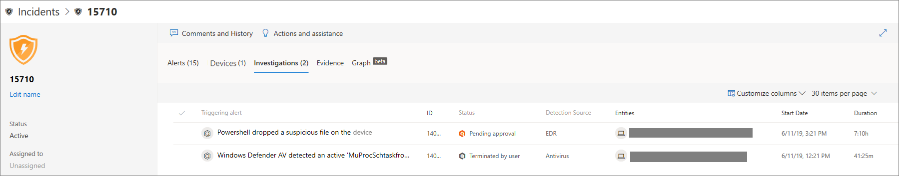

# Analizzare gli eventi imprevisti in Microsoft Defender for Endpoint

[!INCLUDE [Microsoft 365 Defender rebranding](../../includes/microsoft-defender.md)]

**Si applica a:**
- [Microsoft Defender per endpoint](https://go.microsoft.com/fwlink/p/?linkid=2154037)
- [Microsoft 365 Defender](https://go.microsoft.com/fwlink/?linkid=2118804)

Analizzare gli eventi imprevisti che interessano la rete, comprenderne il significato e raccogliere le prove per risolverli. 

Quando si analizza un evento imprevisto, viene visualizzato:
- Dettagli incidente
- Azioni e commenti relativi agli eventi imprevisti
- Schede (avvisi, dispositivi, indagini, prove, grafico)

> [!VIDEO https://www.microsoft.com/en-us/videoplayer/embed/RE4qLUV]

## Analizzare i dettagli dell'evento imprevisto 
Fare clic su un evento imprevisto per visualizzare **il riquadro Operazioni non consentite.** Seleziona **Apri pagina evento imprevisto** per visualizzare i dettagli dell'evento imprevisto e le informazioni correlate (avvisi, dispositivi, indagini, prove, grafico). 

### Avvisi
È possibile analizzare gli avvisi e vedere come sono stati collegati in un evento imprevisto. Gli avvisi sono raggruppati in eventi imprevisti in base ai motivi seguenti:
- Indagine automatizzata - L'indagine automatizzata ha attivato l'avviso collegato durante l'analisi dell'avviso originale 
- Caratteristiche dei file - I file associati all'avviso hanno caratteristiche simili
- Associazione manuale: un utente ha collegato manualmente gli avvisi
- Tempo di proximate- Gli avvisi sono stati attivati sullo stesso dispositivo entro un determinato intervallo di tempo
- Stesso file: i file associati all'avviso sono esattamente gli stessi
- Stesso URL- L'URL che ha attivato l'avviso è esattamente lo stesso

Puoi anche gestire un avviso e visualizzare i metadati dell'avviso insieme ad altre informazioni. Per ulteriori informazioni, vedere [Analizzare gli avvisi.](investigate-alerts.md) 

### Dispositivi
Puoi anche analizzare i dispositivi che fanno parte di un evento imprevisto o sono correlati a un determinato evento. Per altre informazioni, vedi [Analizzare i dispositivi.](investigate-machines.md)

### Indagini
Selezionare **Indagini per** visualizzare tutte le indagini automatiche avviate dal sistema in risposta agli avvisi relativi agli eventi imprevisti.

## Passare attraverso le prove
Microsoft Defender for Endpoint analizza automaticamente tutti gli eventi supportati e le entità sospette degli eventi imprevisti negli avvisi, fornendoti la risposta automatica e le informazioni sui file, i processi, i servizi e altro ancora importanti. 

Ognuna delle entità analizzate verrà contrassegnata come infetta, correttiva o sospetta. 

## Visualizzazione delle minacce di cybersecurity associate 
Microsoft Defender for Endpoint aggrega le informazioni sulle minacce in un evento imprevisto in modo da poter visualizzare i modelli e le correlazioni provenienti da diversi punti dati. È possibile visualizzare tale correlazione tramite il grafico degli eventi imprevisti.

### Grafico degli eventi imprevisti
Il **grafico** narra la storia dell'attacco di cybersecurity. Ad esempio, mostra qual era il punto di ingresso, quale indicatore di compromissione o attività è stato osservato su quale dispositivo. ecc.

È possibile fare clic sui cerchi nel grafico degli eventi imprevisti per visualizzare i dettagli dei file dannosi, i rilevamenti di file associati, il numero di istanze presenti in tutto il mondo, se è stato osservato nell'organizzazione, in tal caso, il numero di istanze.

## Argomenti correlati
- [Coda incidenti](https://docs.microsoft.com/microsoft-365/security/defender-endpoint/view-incidents-queue)
- [Analizzare gli eventi imprevisti in Microsoft Defender for Endpoint](https://docs.microsoft.com/microsoft-365/security/defender-endpoint/investigate-incidents)
- [Gestire gli eventi imprevisti di Microsoft Defender for Endpoint](https://docs.microsoft.com/microsoft-365/security/defender-endpoint/manage-incidents)
