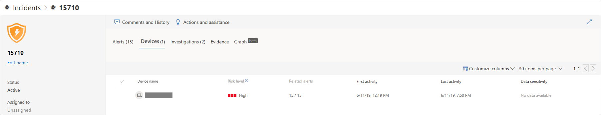

# Analizzare gli eventi imprevisti in Microsoft Defender for EndpointInvestigate incidents in Microsoft Defender for Endpoint

[!INCLUDE [Microsoft 365 Defender rebranding](../../includes/microsoft-defender.md)]

**Si applica a:****Applies to:**
- [Microsoft Defender per endpointMicrosoft Defender for Endpoint](https://go.microsoft.com/fwlink/p/?linkid=2154037)
- [Microsoft 365 DefenderMicrosoft 365 Defender](https://go.microsoft.com/fwlink/?linkid=2118804)

Analizzare gli eventi imprevisti che interessano la rete, comprenderne il significato e raccogliere le prove per risolverli.Investigate incidents that affect your network, understand what they mean, and collate evidence to resolve them. 

Quando si analizza un evento imprevisto, viene visualizzato:When you investigate an incident, you'll see:
- Dettagli incidenteIncident details
- Azioni e commenti relativi agli eventi imprevistiIncident comments and actions
- Schede (avvisi, dispositivi, indagini, prove, grafico)Tabs (alerts, devices, investigations, evidence, graph)

> [!VIDEO https://www.microsoft.com/en-us/videoplayer/embed/RE4qLUV]

## Analizzare i dettagli dell'evento imprevistoAnalyze incident details 
Fare clic su un evento imprevisto per visualizzare **il riquadro Operazioni non consentite.**Click an incident to see the **Incident pane**. Seleziona **Apri pagina evento imprevisto** per visualizzare i dettagli dell'evento imprevisto e le informazioni correlate (avvisi, dispositivi, indagini, prove, grafico).Select **Open incident page** to see the incident details and related information (alerts, devices, investigations, evidence, graph). 

### AvvisiAlerts
È possibile analizzare gli avvisi e vedere come sono stati collegati in un evento imprevisto.You can investigate the alerts and see how they were linked together in an incident. Gli avvisi sono raggruppati in eventi imprevisti in base ai motivi seguenti:Alerts are grouped into incidents based on the following reasons:
- Indagine automatizzata - L'indagine automatizzata ha attivato l'avviso collegato durante l'analisi dell'avviso originaleAutomated investigation - The automated investigation triggered the linked alert while investigating the original alert 
- Caratteristiche dei file - I file associati all'avviso hanno caratteristiche similiFile characteristics - The files associated with the alert have similar characteristics
- Associazione manuale: un utente ha collegato manualmente gli avvisiManual association - A user manually linked the alerts
- Tempo di proximate- Gli avvisi sono stati attivati sullo stesso dispositivo entro un determinato intervallo di tempoProximate time - The alerts were triggered on the same device within a certain timeframe
- Stesso file: i file associati all'avviso sono esattamente gli stessiSame file - The files associated with the alert are exactly the same
- Stesso URL- L'URL che ha attivato l'avviso è esattamente lo stessoSame URL - The URL that triggered the alert is exactly the same

Puoi anche gestire un avviso e visualizzare i metadati dell'avviso insieme ad altre informazioni.You can also manage an alert and see alert metadata along with other information. Per ulteriori informazioni, vedere [Analizzare gli avvisi.](investigate-alerts.md)For more information, see [Investigate alerts](investigate-alerts.md). 

### DispositiviDevices
Puoi anche analizzare i dispositivi che fanno parte di un evento imprevisto o sono correlati a un determinato evento.You can also investigate the devices that are part of, or related to, a given incident. Per altre informazioni, vedi [Analizzare i dispositivi.](investigate-machines.md)For more information, see [Investigate devices](investigate-machines.md).

### IndaginiInvestigations
Selezionare **Indagini per** visualizzare tutte le indagini automatiche avviate dal sistema in risposta agli avvisi relativi agli eventi imprevisti.Select **Investigations** to see all the automatic investigations launched by the system in response to the incident alerts.

## Passare attraverso le proveGoing through the evidence
Microsoft Defender for Endpoint analizza automaticamente tutti gli eventi supportati e le entità sospette degli eventi imprevisti negli avvisi, fornendoti la risposta automatica e le informazioni sui file, i processi, i servizi e altro ancora importanti.Microsoft Defender for Endpoint automatically investigates all the incidents' supported events and suspicious entities in the alerts, providing you with autoresponse and information about the important files, processes, services, and more. 

Ognuna delle entità analizzate verrà contrassegnata come infetta, correttiva o sospetta.Each of the analyzed entities will be marked as infected, remediated, or suspicious. 

## Visualizzazione delle minacce di cybersecurity associateVisualizing associated cybersecurity threats 
Microsoft Defender for Endpoint aggrega le informazioni sulle minacce in un evento imprevisto in modo da poter visualizzare i modelli e le correlazioni provenienti da diversi punti dati.Microsoft Defender for Endpoint aggregates the threat information into an incident so you can see the patterns and correlations coming in from various data points. È possibile visualizzare tale correlazione tramite il grafico degli eventi imprevisti.You can view such correlation through the incident graph.

### Grafico degli eventi imprevistiIncident graph
Il **grafico** narra la storia dell'attacco di cybersecurity.The **Graph** tells the story of the cybersecurity attack. Ad esempio, mostra qual era il punto di ingresso, quale indicatore di compromissione o attività è stato osservato su quale dispositivo.For example, it shows you what was the entry point, which indicator of compromise or activity was observed on which device. ecc.etc.

È possibile fare clic sui cerchi nel grafico degli eventi imprevisti per visualizzare i dettagli dei file dannosi, i rilevamenti di file associati, il numero di istanze presenti in tutto il mondo, se è stato osservato nell'organizzazione, in tal caso, il numero di istanze.You can click the circles on the incident graph to view the details of the malicious files, associated file detections, how many instances have there been worldwide, whether it’s been observed in your organization, if so, how many instances.

## Argomenti correlatiRelated topics
- [Coda incidentiIncidents queue](https://docs.microsoft.com/microsoft-365/security/defender-endpoint/view-incidents-queue)
- [Analizzare gli eventi imprevisti in Microsoft Defender for EndpointInvestigate incidents in Microsoft Defender for Endpoint](https://docs.microsoft.com/microsoft-365/security/defender-endpoint/investigate-incidents)
- [Gestire gli eventi imprevisti di Microsoft Defender for EndpointManage Microsoft Defender for Endpoint incidents](https://docs.microsoft.com/microsoft-365/security/defender-endpoint/manage-incidents)
