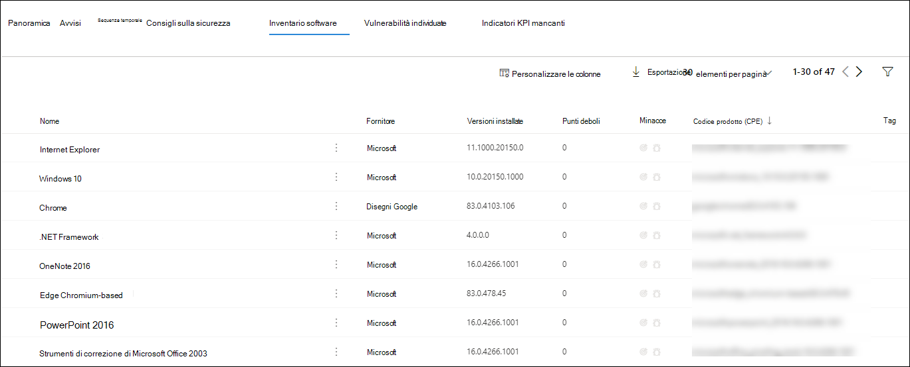

# Analizzare i dispositivi nell'elenco Di Microsoft Defender per dispositivi endpointInvestigate devices in the Microsoft Defender for Endpoint Devices list

[!INCLUDE [Microsoft 365 Defender rebranding](../../includes/microsoft-defender.md)]

**Si applica a:****Applies to:**
- [Microsoft Defender ATPMicrosoft Defender for Endpoint](https://go.microsoft.com/fwlink/p/?linkid=2146631)
- [Microsoft 365 DefenderMicrosoft 365 Defender](https://go.microsoft.com/fwlink/?linkid=2118804)

>Vuoi provare Defender per Endpoint?Want to experience Defender for Endpoint? [Iscriversi per una versione di valutazione gratuita.Sign up for a free trial.](https://www.microsoft.com/microsoft-365/windows/microsoft-defender-atp?ocid=docs-wdatp-investigatemachines-abovefoldlink)

Analizzare i dettagli di un avviso generato su un dispositivo specifico per identificare altri comportamenti o eventi che potrebbero essere correlati all'avviso o all'ambito potenziale della violazione.Investigate the details of an alert raised on a specific device to identify other behaviors or events that might be related to the alert or the potential scope of the breach.

> [!NOTE]
> Come parte del processo di indagine o di risposta, puoi raccogliere un pacchetto di indagine da un dispositivo.As part of the investigation or response process, you can collect an investigation package from a device. Ecco come: Raccogliere [il pacchetto di indagine dai dispositivi](https://docs.microsoft.com/microsoft-365/security/defender-endpoint/respond-machine-alerts#collect-investigation-package-from-devices).Here's how: [Collect investigation package from devices](https://docs.microsoft.com/microsoft-365/security/defender-endpoint/respond-machine-alerts#collect-investigation-package-from-devices).

Puoi fare clic sui dispositivi interessati ogni volta che li vedi nel portale per aprire un report dettagliato su tale dispositivo.You can click on affected devices whenever you see them in the portal to open a detailed report about that device. I dispositivi interessati sono identificati nelle aree seguenti:Affected devices are identified in the following areas:

- [Elenco dispositiviDevices list](investigate-machines.md)
- [Coda avvisiAlerts queue](alerts-queue.md)
- [Dashboard delle operazioni di sicurezzaSecurity operations dashboard](security-operations-dashboard.md)
- Qualsiasi singolo avvisoAny individual alert
- Qualsiasi visualizzazione dei dettagli dei singoli fileAny individual file details view
- Qualsiasi indirizzo IP o visualizzazione dei dettagli del dominioAny IP address or domain details view

Quando indaghi su un dispositivo specifico, vedrai:When you investigate a specific device, you'll see:

- Dettagli dispositivoDevice details
- Azioni di rispostaResponse actions
- Schede (panoramica, avvisi, sequenza temporale, suggerimenti per la sicurezza, inventario software, vulnerabilità individuate, INDICATORI KPI mancanti)Tabs (overview, alerts, timeline, security recommendations, software inventory, discovered vulnerabilities, missing KBs)
- Schede (avvisi attivi, utenti connessi, valutazione della sicurezza)Cards (active alerts, logged on users, security assessment)

## Dettagli dispositivoDevice details

La sezione dettagli dispositivo fornisce informazioni quali il dominio, il sistema operativo e lo stato di integrità del dispositivo.The device details section provides information such as the domain, OS, and health state of the device. Se nel dispositivo è disponibile un pacchetto di analisi, vedrai un collegamento che ti consente di scaricare il pacchetto.If there's an investigation package available on the device, you'll see a link that allows you to download the package.

## Azioni di rispostaResponse actions

Le azioni di risposta vengono eseguite nella parte superiore di una pagina specifica del dispositivo e includono:Response actions run along the top of a specific device page and include:

- Gestire i tagManage tags
- Isola dispositivoIsolate device
- Limitare l'esecuzione delle appRestrict app execution
- Eseguire l'analisi antivirusRun antivirus scan
- Raccogliere il pacchetto di analisiCollect investigation package
- Avviare la sessione di risposta in tempo realeInitiate Live Response Session
- Avviare un'indagine automatizzataInitiate automated investigation
- Consultare un esperto di minacceConsult a threat expert
- Centro notificheAction center

Puoi eseguire azioni di risposta nel centro notifiche, in una pagina del dispositivo specifico o in una pagina di file specifica.You can take response actions in the Action center, in a specific device page, or in a specific file page.

Per altre informazioni su come eseguire un'azione su un dispositivo, vedi [Eseguire un'azione di risposta in un dispositivo.](respond-machine-alerts.md)For more information on how to take action on a device, see [Take response action on a device](respond-machine-alerts.md).

Per ulteriori informazioni, vedere [Investigate user entities](investigate-user.md).For more information, see [Investigate user entities](investigate-user.md).

## SchedeTabs

Le schede forniscono informazioni rilevanti sulla sicurezza e sulla prevenzione delle minacce relative al dispositivo.The tabs provide relevant security and threat prevention information related to the device. In ogni scheda è possibile personalizzare le  colonne visualizzate selezionando Personalizza colonne dalla barra sopra le intestazioni di colonna.In each tab, you can customize the columns that are shown by selecting **Customize columns** from the bar above the column headers.

### PanoramicaOverview
Nella **scheda Panoramica** vengono visualizzate le [schede](#cards) per gli avvisi attivi, gli utenti connessi e la valutazione della sicurezza.The **Overview** tab displays the [cards](#cards) for active alerts, logged on users, and security assessment.

### AvvisiAlerts

La **scheda** Avvisi fornisce un elenco di avvisi associati al dispositivo.The **Alerts** tab provides a list of alerts that are associated with the device. Questo elenco è una versione filtrata della coda avvisi e mostra una breve descrizione dell'avviso, della gravità (alto, medio, basso, informativo), dello stato nella coda (nuovo, in corso, risolto), classificazione (non impostato, falso avviso, avviso vero), stato dell'indagine, categoria dell'avviso, destinatario dell'avviso e ultima attività.This list is a filtered version of the [Alerts queue](alerts-queue.md), and shows a short description of the alert, severity (high, medium, low, informational), status in the queue (new, in progress, resolved), classification (not set, false alert, true alert), investigation state, category of alert, who is addressing the alert, and last activity. È inoltre possibile filtrare gli avvisi.You can also filter the alerts.

Quando l'icona del cerchio a sinistra di un avviso è selezionata, viene visualizzato un riquadro a comparsa.When the circle icon to the left of an alert is selected, a fly-out appears. Da questo pannello puoi gestire l'avviso e visualizzare altri dettagli, ad esempio il numero di incidente e i dispositivi correlati.From this panel you can manage the alert and view more details such as incident number and related devices. È possibile selezionare più avvisi alla volta.Multiple alerts can be selected at a time.

Per visualizzare una visualizzazione a pagina intera di un avviso, incluso il grafico degli eventi imprevisti e l'albero dei processi, selezionare il titolo dell'avviso.To see a full page view of an alert including incident graph and process tree, select the title of the alert.

### Sequenza temporaleTimeline

La **scheda** Sequenza temporale fornisce una visualizzazione cronologica degli eventi e degli avvisi associati che sono stati osservati nel dispositivo.The **Timeline** tab provides a chronological view of the events and associated alerts that have been observed on the device. In questo modo puoi correlare eventi, file e indirizzi IP in relazione al dispositivo.This can help you correlate any events, files, and IP addresses in relation to the device.

La sequenza temporale consente inoltre di eseguire il drill-down in modo selettivo negli eventi che si sono verificati in un determinato periodo di tempo.The timeline also enables you to selectively drill down into events that occurred within a given time period. Puoi visualizzare la sequenza temporale degli eventi che si sono verificati in un dispositivo in un periodo di tempo selezionato.You can view the temporal sequence of events that occurred on a device over a selected time period. Per controllare ulteriormente la visualizzazione, è possibile filtrare in base ai gruppi di eventi o personalizzare le colonne.To further control your view, you can filter by event groups or customize the columns.

>[!NOTE]
> Per visualizzare gli eventi del firewall, è necessario abilitare il criterio di controllo, vedere [Audit Filtering Platform connection.](https://docs.microsoft.com/windows/security/threat-protection/auditing/audit-filtering-platform-connection)For firewall events to be displayed, you'll need to enable the audit policy, see [Audit Filtering Platform connection](https://docs.microsoft.com/windows/security/threat-protection/auditing/audit-filtering-platform-connection).
>Il firewall copre gli eventi seguentiFirewall covers the following events
>
>- [5025](https://docs.microsoft.com/windows/security/threat-protection/auditing/event-5025) - Servizio firewall arrestato[5025](https://docs.microsoft.com/windows/security/threat-protection/auditing/event-5025) - firewall service stopped
>- [5031](https://docs.microsoft.com/windows/security/threat-protection/auditing/event-5031) - Applicazione bloccata dall'accettazione delle connessioni in ingresso sulla rete[5031](https://docs.microsoft.com/windows/security/threat-protection/auditing/event-5031) - application blocked from accepting incoming connections on the network
>- [5157](https://docs.microsoft.com/windows/security/threat-protection/auditing/event-5157) - Connessione bloccata[5157](https://docs.microsoft.com/windows/security/threat-protection/auditing/event-5157) - blocked connection

Alcune delle funzionalità includono:Some of the functionality includes:

- Cercare eventi specificiSearch for specific events
  - Usa la barra di ricerca per cercare eventi sequenza temporale specifici.Use the search bar to look for specific timeline events.
- Filtrare gli eventi da una data specificaFilter events from a specific date
  - Selezionare l'icona del calendario in alto a sinistra della tabella per visualizzare gli eventi dell'ultimo giorno, settimana, 30 giorni o intervallo personalizzato.Select the calendar icon in the upper left of the table to display events in the past day, week, 30 days, or custom range. Per impostazione predefinita, la sequenza temporale del dispositivo è impostata per visualizzare gli eventi degli ultimi 30 giorni.By default, the device timeline is set to display the events from the past 30 days.
  - Usa la sequenza temporale per passare a un momento specifico evidenziando la sezione.Use the timeline to jump to a specific moment in time by highlighting the section. Le frecce sulla sequenza temporale consentono di individuare indagini automatizzateThe arrows on the timeline pinpoint automated investigations
- Esportare eventi dettagliati della sequenza temporale del dispositivoExport detailed device timeline events
  - Esporta la sequenza temporale del dispositivo per la data corrente o un intervallo di date specificato fino a sette giorni.Export the device timeline for the current date or a specified date range up to seven days.

Ulteriori dettagli su determinati eventi sono disponibili nella **sezione Informazioni** aggiuntive.More details about certain events are provided in the **Additional information** section. Questi dettagli variano a seconda del tipo di evento, ad esempio:These details vary depending on the type of event, for example: 

- Contenuto di Application Guard: l'evento del Web browser è stato limitato da un contenitore isolatoContained by Application Guard - the web browser event was restricted by an isolated container
- Minaccia attiva rilevata: il rilevamento delle minacce si è verificato durante l'esecuzione della minacciaActive threat detected - the threat detection occurred while the threat was running
- Correzione non riuscita: un tentativo di correzione della minaccia rilevata è stato richiamato ma non è riuscitoRemediation unsuccessful - an attempt to remediate the detected threat was invoked but failed
- Correzione riuscita: la minaccia rilevata è stata arrestata e pulitaRemediation successful - the detected threat was stopped and cleaned
- Avviso ignorato dall'utente: l'Windows Defender SmartScreen è stato ignorato e sostituito da un utenteWarning bypassed by user - the Windows Defender SmartScreen warning was dismissed and overridden by a user
- Rilevato script sospetto: è stato rilevato uno script potenzialmente dannoso in esecuzioneSuspicious script detected - a potentially malicious script was found running
- Categoria di avviso: se l'evento ha generato un avviso, viene fornita la categoria di avviso ("Movimento laterale", ad esempio)The alert category - if the event led to the generation of an alert, the alert category  ("Lateral Movement", for example) is provided

#### Dettagli eventoEvent details
Seleziona un evento per visualizzare i dettagli pertinenti su tale evento.Select an event to view relevant details about that event. Viene visualizzato un pannello per visualizzare informazioni generali sull'evento.A panel displays to show general event information. Se applicabile e i dati sono disponibili, viene visualizzato anche un grafico che mostra le entità correlate e le relative relazioni.When applicable and data is available, a graph showing related entities and their relationships are also shown.

Per esaminare ulteriormente l'evento e gli eventi correlati, è possibile eseguire rapidamente una [query](advanced-hunting-overview.md) di ricerca avanzata selezionando Cerca **eventi correlati.**To further inspect the event and related events, you can quickly run an [advanced hunting](advanced-hunting-overview.md) query by selecting **Hunt for related events**. La query restituirà l'evento selezionato e l'elenco di altri eventi che si sono verificati nello stesso momento nello stesso endpoint.The query will return the selected event and the list of other events that occurred around the same time on the same endpoint.

### Consigli sulla sicurezzaSecurity recommendations

**I suggerimenti per** la sicurezza vengono generati da Microsoft Defender per la funzionalità di gestione delle [& delle](tvm-dashboard-insights.md) vulnerabilità di Microsoft Defender for Endpoint.**Security recommendations** are generated from Microsoft Defender for Endpoint's [Threat & Vulnerability Management](tvm-dashboard-insights.md) capability. La selezione di un suggerimento mostrerà un pannello in cui è possibile visualizzare dettagli pertinenti, ad esempio la descrizione del suggerimento e i potenziali rischi associati alla sua non applicazione.Selecting a recommendation will show a panel where you can view relevant details such as description of the recommendation and the potential risks associated with not enacting it. Per [informazioni dettagliate, vedere](tvm-security-recommendation.md) Consigli per la sicurezza.See [Security recommendation](tvm-security-recommendation.md) for details.

### Inventario softwareSoftware inventory

La **scheda Inventario** software consente di visualizzare il software nel dispositivo, insieme a eventuali punti deboli o minacce.The **Software inventory** tab lets you view software on the device, along with any weaknesses or threats. Se si seleziona il nome del software, verrà visualizzata la pagina dei dettagli del software in cui è possibile visualizzare i suggerimenti per la sicurezza, le vulnerabilità individuate, i dispositivi installati e la distribuzione delle versioni.Selecting the name of the software will take you to the software details page where you can view security recommendations, discovered vulnerabilities, installed devices, and version distribution. Per [informazioni dettagliate, vedere Inventario](tvm-software-inventory.md) softwareSee [Software inventory](tvm-software-inventory.md) for details

### Vulnerabilità individuateDiscovered vulnerabilities

La **scheda Vulnerabilità individuate** mostra il nome, la gravità e le informazioni dettagliate sulle minacce delle vulnerabilità individuate nel dispositivo.The **Discovered vulnerabilities** tab shows the name, severity, and threat insights of discovered vulnerabilities on the device. La selezione di vulnerabilità specifiche mostrerà una descrizione e dettagli.Selecting specific vulnerabilities will show a description and details.

### Indicatori KPI mancantiMissing KBs
Nella **scheda Blob** mancanti sono elencati gli aggiornamenti di sicurezza mancanti per il dispositivo.The **Missing KBs** tab lists the missing security updates for the device.

## SchedeCards

### Avvisi attiviActive alerts

La **scheda Azure Advanced Threat Protection** visualizza una panoramica generale degli avvisi relativi al dispositivo e al relativo livello di rischio, se è stata abilitata la funzionalità Azure ATP e sono presenti avvisi attivi.The **Azure Advanced Threat Protection** card will display a high-level overview of alerts related to the device and their risk level, if you have enabled the Azure ATP feature, and there are any active alerts. Ulteriori informazioni sono disponibili nel drill-down "Avvisi".More information is available in the "Alerts" drill down.

>[!NOTE]
>Dovrai abilitare l'integrazione sia in Azure ATP che in Defender for Endpoint per usare questa funzionalità.You'll need to enable the integration on both Azure ATP and Defender for Endpoint to use this feature. In Defender for Endpoint puoi abilitare questa funzionalità nelle funzionalità avanzate.In Defender for Endpoint, you can enable this feature in advanced features. Per ulteriori informazioni su come abilitare le funzionalità avanzate, vedere [Attivare le funzionalità avanzate.](advanced-features.md)For more information on how to enable advanced features, see [Turn on advanced features](advanced-features.md).

### Utenti connessiLogged on users

La **scheda Utenti connessi** mostra quanti utenti hanno effettuato l'accesso negli ultimi 30 giorni, insieme agli utenti più e meno frequenti.The **Logged on users** card shows how many users have logged on in the past 30 days, along with the most and least frequent users. Se si seleziona il collegamento "Visualizza tutti gli utenti", verrà aperto il riquadro dei dettagli, in cui vengono visualizzate informazioni quali il tipo di utente, il tipo di accesso e la data e l'ultima visualizzazione dell'utente.Selecting the "See all users" link opens the details pane, which displays information such as user type, log on type, and when the user was first and last seen. Per ulteriori informazioni, vedere [Investigate user entities](investigate-user.md).For more information, see [Investigate user entities](investigate-user.md).

### Valutazioni sulla sicurezzaSecurity assessments

La **scheda Valutazioni della sicurezza** mostra il livello complessivo di esposizione, i consigli per la sicurezza, il software installato e le vulnerabilità individuate.The **Security assessments** card shows the overall exposure level, security recommendations, installed software, and discovered vulnerabilities. Il livello di esposizione di un dispositivo è determinato dall'impatto cumulativo dei consigli di sicurezza in sospeso.A device's exposure level is determined by the cumulative impact of its pending security recommendations.

## Argomenti correlatiRelated topics

- [Visualizzare e organizzare la coda di Microsoft Defender for Endpoint AlertsView and organize the Microsoft Defender for Endpoint Alerts queue](alerts-queue.md)
- [Gestire gli avvisi di Microsoft Defender for EndpointManage Microsoft Defender for Endpoint alerts](manage-alerts.md)
- [Analizzare gli avvisi di Microsoft Defender for EndpointInvestigate Microsoft Defender for Endpoint alerts](investigate-alerts.md)
- [Analizzare un file associato a un avviso di Defender for EndpointInvestigate a file associated with a Defender for Endpoint alert](investigate-files.md)
- [Analizzare un indirizzo IP associato a un avviso Defender for EndpointInvestigate an IP address associated with a Defender for Endpoint alert](investigate-ip.md)
- [Analizzare un dominio associato a un avviso Defender for EndpointInvestigate a domain associated with a Defender for Endpoint alert](investigate-domain.md)
- [Analizzare un account utente in Defender for EndpointInvestigate a user account in Defender for Endpoint](investigate-user.md)
- [Suggerimenti per la sicurezzaSecurity recommendation](tvm-security-recommendation.md)
- [Inventario softwareSoftware inventory](tvm-software-inventory.md)
