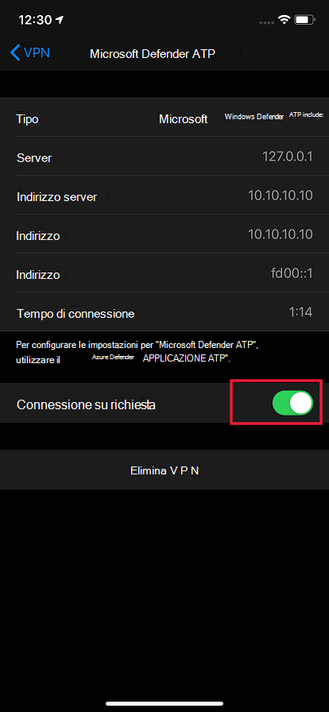
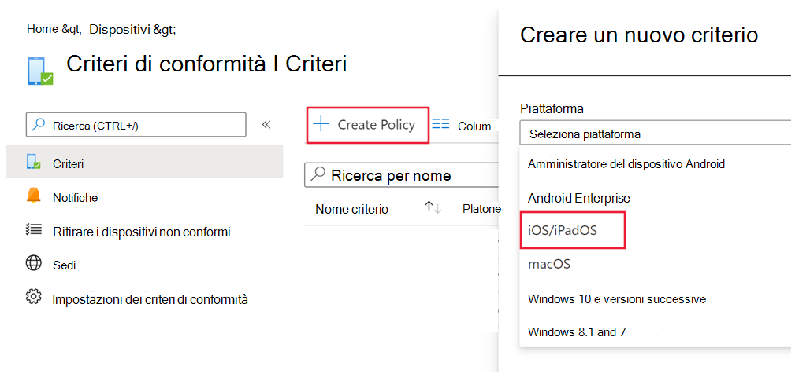
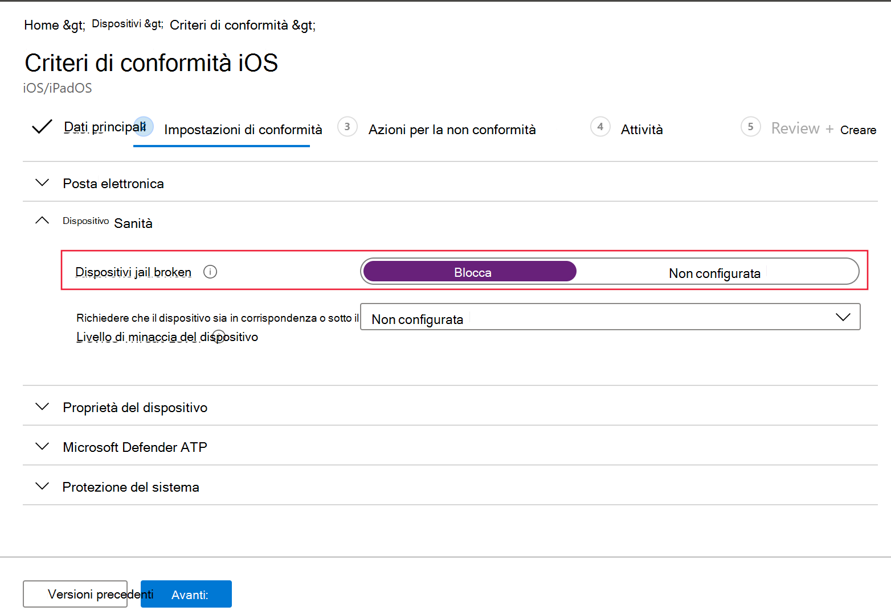
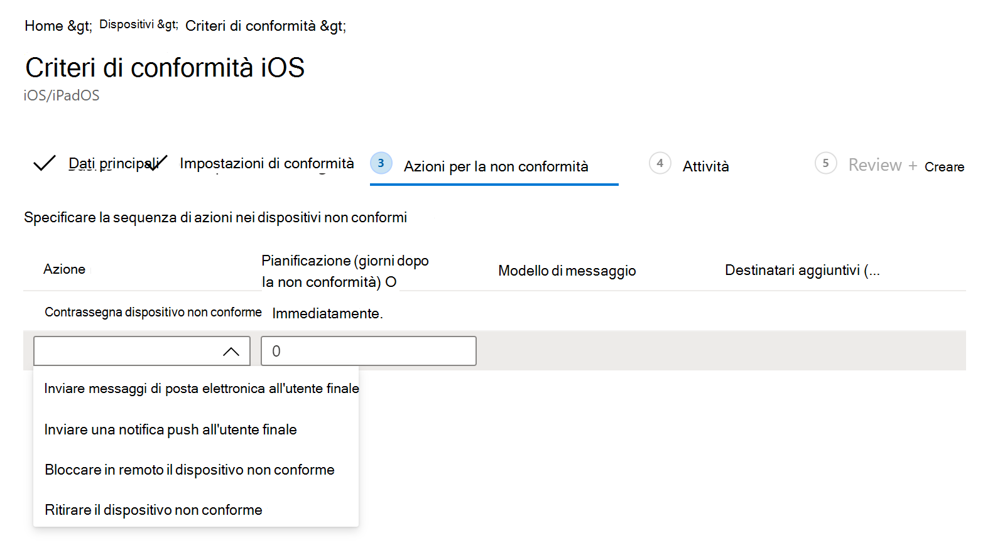

# Configurare Microsoft Defender per le funzionalità di Endpoint in iOSConfigure Microsoft Defender for Endpoint on iOS features

[!INCLUDE [Microsoft 365 Defender rebranding](../../includes/microsoft-defender.md)]

**Si applica a:****Applies to:**
- [Microsoft Defender per endpointMicrosoft Defender for Endpoint](https://go.microsoft.com/fwlink/p/?linkid=2154037)
- [Microsoft 365 DefenderMicrosoft 365 Defender](https://go.microsoft.com/fwlink/?linkid=2118804)

> Vuoi provare Defender per Endpoint?Want to experience Defender for Endpoint? [Iscriversi per una versione di valutazione gratuita.Sign up for a free trial.](https://www.microsoft.com/microsoft-365/windows/microsoft-defender-atp?ocid=docs-wdatp-exposedapis-abovefoldlink) 

> [!NOTE]
> Defender for Endpoint in iOS userebbe una VPN per fornire la funzionalità di protezione Web.Defender for Endpoint on iOS would use a VPN in order to provide the Web Protection feature. Non si tratta di una NORMALE VPN ed è una VPN locale/con looping che non porta traffico all'esterno del dispositivo.This is not a regular VPN and is a local/self-looping VPN that does not take traffic outside the device.

## Accesso condizionale con Defender per Endpoint in iOSConditional Access with Defender for Endpoint on iOS  
Microsoft Defender for Endpoint su iOS insieme a Microsoft Intune e Azure Active Directory consente di far rispettare la conformità dei dispositivi e i criteri di accesso condizionale in base al punteggio di rischio del dispositivo.Microsoft Defender for Endpoint on iOS along with Microsoft Intune and Azure Active Directory enables enforcing Device compliance and Conditional Access policies based on device risk score. Defender for Endpoint è una soluzione Mobile Threat Defense (MTD) che puoi distribuire per sfruttare questa funzionalità tramite Intune.Defender for Endpoint is a Mobile Threat Defense (MTD) solution that you can deploy to leverage this capability via Intune.

Per altre informazioni su come configurare l'accesso condizionale con Defender per Endpoint in iOS, vedi [Defender per Endpoint e Intune.](/mem/intune/protect/advanced-threat-protection)For more information about how to set up Conditional Access with Defender for Endpoint on iOS, see [Defender for Endpoint and Intune](/mem/intune/protect/advanced-threat-protection).

### Rilevamento jailbreak da parte di Microsoft Defender per EndpointJailbreak detection by Microsoft Defender for Endpoint
Microsoft Defender for Endpoint è in grado di rilevare i dispositivi gestiti e non gestiti che sono jailbroken.Microsoft Defender for Endpoint has the capability of detecting unmanaged and managed devices that are jailbroken. Se viene rilevato che un dispositivo è jailbroken, verrà segnalato un avviso ad alto rischio al Centro sicurezza e se l'accesso condizionale viene configurazione in base al punteggio di rischio del dispositivo, al dispositivo verrà impedito l'accesso ai dati aziendali.If a device is detected to be jailbroken, a **High**-risk alert will be reported to Security Center and if Conditional Access is setup based on device risk score, then the device will be blocked from accessing corporate data.

## Protezione Web e VPNWeb Protection and VPN

Per impostazione predefinita, Defender per Endpoint in iOS include e abilita la funzionalità di protezione Web.By default, Defender for Endpoint on iOS includes and enables the web protection feature. [La protezione Web](web-protection-overview.md) consente di proteggere i dispositivi dalle minacce Web e proteggere gli utenti dagli attacchi di phishing.[Web protection](web-protection-overview.md) helps to secure devices against web threats and protect users from phishing attacks. Defender for Endpoint su iOS usa una VPN per fornire questa protezione.Defender for Endpoint on iOS uses a VPN in order to provide this protection. Tieni presente che si tratta di una VPN locale e, a differenza della VPN tradizionale, il traffico di rete non viene inviato all'esterno del dispositivo.Please note this is a local VPN and unlike traditional VPN, network traffic is not sent outside the device.

Anche se abilitata per impostazione predefinita, in alcuni casi potrebbe essere necessario disabilitare vpn.While enabled by default, there might be some cases that require you to disable VPN. Ad esempio, vuoi eseguire alcune app che non funzionano quando è configurata una VPN.For example, you want to run some apps that do not work when a VPN is configured. In questi casi, puoi scegliere di disabilitare vpn dall'app nel dispositivo seguendo la procedura seguente:In such cases, you can choose to disable VPN from the app on the device by following the steps below:

1. Nel dispositivo iOS, apri l'app **Impostazioni,** tocca o fai clic su **Generale** e **quindi su VPN.**On your iOS device, open the **Settings** app, click or tap **General** and then **VPN**.
1. Tocca o fai clic sul pulsante "i" per Microsoft Defender for Endpoint.Click or tap the "i" button for Microsoft Defender for Endpoint.
1. Disattiva la **Connessione su richiesta per** disabilitare la VPN.Toggle off **Connect On Demand** to disable VPN.

    > [!div class="mx-imgBorder"]
    > 

> [!NOTE]
> Protezione Web non sarà disponibile quando LA VPN è disabilitata.Web Protection will not be available when VPN is disabled. Per abilitare di nuovo Web Protection, apri l'app Microsoft Defender for Endpoint nel dispositivo e tocca o fai clic su **Avvia VPN.**To re-enable Web Protection, open the Microsoft Defender for Endpoint app on the device and click or tap **Start VPN**.

## Coesistenza di più profili VPNCo-existence of multiple VPN profiles

Apple iOS non supporta più VPN a livello di dispositivo per essere attive contemporaneamente.Apple iOS does not support multiple device-wide VPNs to be active simultaneously. Anche se nel dispositivo possono esistere più profili VPN, può essere attiva una sola VPN alla volta.While multiple VPN profiles can exist on the device, only one VPN can be active at a time.

## Configurare i criteri di conformità per i dispositivi jailbrokenConfigure compliance policy against jailbroken devices

Per proteggere l'accesso ai dati aziendali nei dispositivi iOS jailbroken, è consigliabile configurare i criteri di conformità seguenti in Intune.To protect corporate data from being accessed on jailbroken iOS devices, we recommend that you set up the following compliance policy on Intune.

> [!NOTE]
> Il rilevamento jailbreak è una funzionalità fornita da Microsoft Defender per Endpoint in iOS.Jailbreak detection is a capability provided by Microsoft Defender for Endpoint on iOS. Tuttavia, ti consigliamo di configurare questo criterio come un ulteriore livello di difesa contro gli scenari di jailbreak.However, we recommend that you setup this policy as an additional layer of defense against jailbreak scenarios.

Segui i passaggi seguenti per creare un criterio di conformità per i dispositivi jailbroken.Follow the steps below to create a compliance policy against jailbroken devices.

1. In [Microsoft Endpoint Manager di amministrazione,](https://go.microsoft.com/fwlink/?linkid=2109431)vai a **Criteri** di  ->  **conformità dispositivi** Crea  ->  **criterio.**In [Microsoft Endpoint Manager admin center](https://go.microsoft.com/fwlink/?linkid=2109431), go to **Devices** -> **Compliance policies** -> **Create Policy**. Seleziona "iOS/iPadOS" come piattaforma e fai clic su **Crea.**Select "iOS/iPadOS" as platform and click **Create**.

    > [!div class="mx-imgBorder"]
    > 

2. Specificare un nome del criterio, ad esempio "Criteri di conformità per Jailbreak".Specify a name of the policy, for example "Compliance Policy for Jailbreak".
3. Nella pagina impostazioni di conformità fai clic per espandere la sezione **Integrità** dispositivo e fai clic **su Blocca** per il campo **Dispositivi Jailbroken.**In the compliance settings page, click to expand **Device Health** section and click **Block** for **Jailbroken devices** field.

    > [!div class="mx-imgBorder"]
    > 

4. Nella sezione *Azione per la non conformità* selezionare le azioni in base ai requisiti e selezionare **Avanti**.In the *Action for noncompliance* section, select the actions as per your requirements and select **Next**.

    > [!div class="mx-imgBorder"]
    > 

5. Nella sezione *Assegnazioni* selezionare i gruppi di utenti che si desidera includere per questo criterio e quindi selezionare **Avanti.**In the *Assignments* section, select the user groups that you want to include for this policy and then select **Next**.
6. Nella sezione **Revisione e creazione** verificare che tutte le informazioni immesse siano corrette e quindi selezionare **Crea**.In the **Review+Create** section, verify that all the information entered is correct and then select **Create**.

## Configurare indicatori personalizzatiConfigure custom indicators

Defender for Endpoint su iOS consente agli amministratori di configurare indicatori personalizzati anche nei dispositivi iOS.Defender for Endpoint on iOS enables admins to configure custom indicators on iOS devices as well. Per ulteriori informazioni su come configurare gli indicatori personalizzati, vedere [Manage indicators](/microsoft-365/security/defender-endpoint/manage-indicators).For more information on how to configure custom indicators, see [Manage indicators](/microsoft-365/security/defender-endpoint/manage-indicators).

> [!NOTE]
> Defender for Endpoint in iOS supporta la creazione di indicatori personalizzati solo per indirizzi IP e URL/domini.Defender for Endpoint on iOS supports creating custom indicators only for IP addresses and URLs/domains.

## Segnala sito non sicuroReport unsafe site

I siti Web di phishing rappresentano siti Web attendibili allo scopo di ottenere informazioni personali o finanziarie.Phishing websites impersonate trustworthy websites for the purpose of obtaining your personal or financial information. Visitare la [pagina Fornire commenti e](https://www.microsoft.com/wdsi/filesubmission/exploitguard/networkprotection) suggerimenti sulla protezione di rete se si desidera segnalare un sito Web che potrebbe essere un sito di phishing.Visit the [Provide feedback about network protection](https://www.microsoft.com/wdsi/filesubmission/exploitguard/networkprotection) page if you want to report a website that could be a phishing site.

