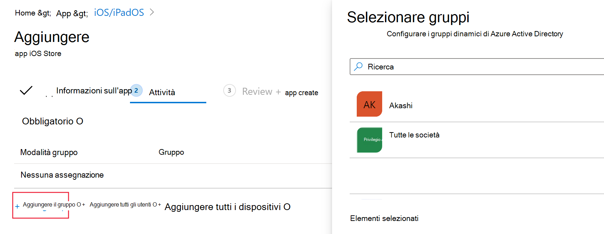
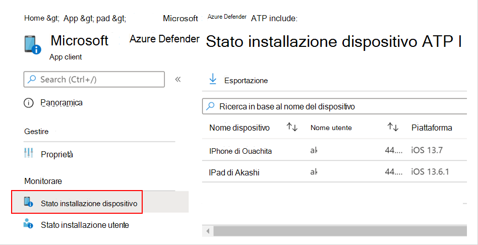
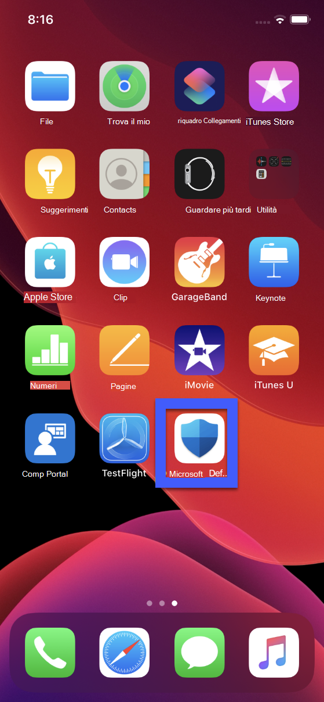
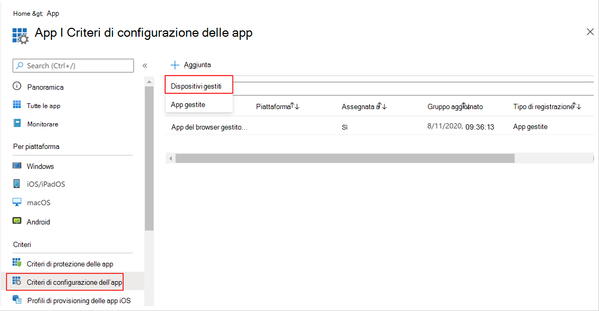
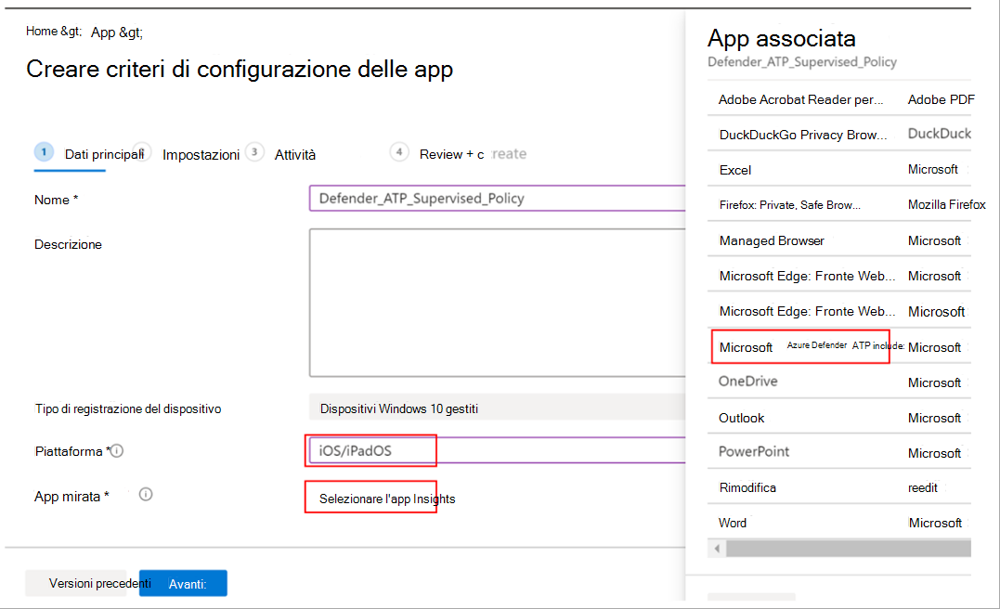
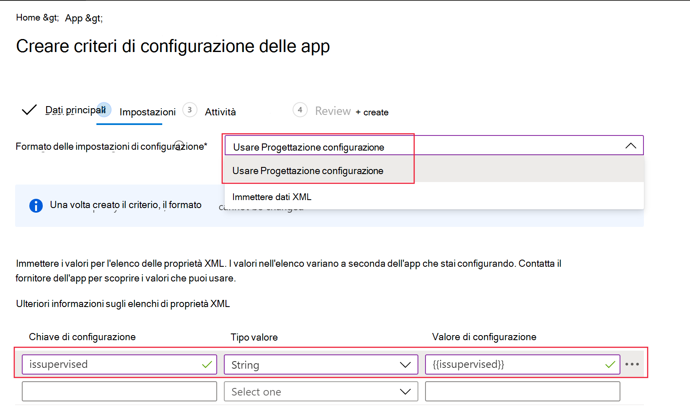
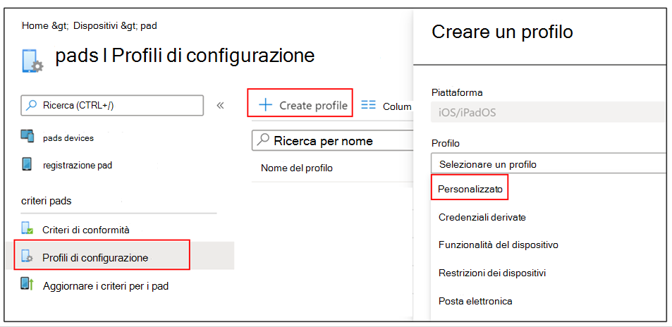

# Distribuire Microsoft Defender per Endpoint in iOS

[!INCLUDE [Microsoft 365 Defender rebranding](../../includes/microsoft-defender.md)]

**Si applica a:**
- [Microsoft Defender per endpoint](https://go.microsoft.com/fwlink/p/?linkid=2154037)
- [Microsoft 365 Defender](https://go.microsoft.com/fwlink/?linkid=2118804)

> Vuoi provare Defender per Endpoint? [Iscriversi per una versione di valutazione gratuita.](https://www.microsoft.com/microsoft-365/windows/microsoft-defender-atp?ocid=docs-wdatp-investigateip-abovefoldlink)

Questo argomento descrive la distribuzione di Defender per Endpoint per iOS nei dispositivi registrati nel portale aziendale di Intune. Per altre informazioni sulla registrazione dei dispositivi Intune, vedi Registrare dispositivi [iOS/iPadOS in Intune.](https://docs.microsoft.com/mem/intune/enrollment/ios-enroll)

## Prima di iniziare

- Assicurati di avere accesso [all'interfaccia di amministrazione di Microsoft Endpoint Manager.](https://go.microsoft.com/fwlink/?linkid=2109431)

- Verificare che la registrazione iOS sia stata eseguita per gli utenti. Gli utenti devono disporre di una licenza defender per endpoint assegnata per poter usare Defender per Endpoint per iOS. Per istruzioni [su come assegnare licenze, vedere](https://docs.microsoft.com/azure/active-directory/users-groups-roles/licensing-groups-assign) Assegnare licenze agli utenti.

> [!NOTE]
> Microsoft Defender ATP (Microsoft Defender for Endpoint) per iOS è ora disponibile [nell'Apple App Store.](https://aka.ms/mdatpiosappstore)

## Fasi di distribuzione

Distribuire Defender per Endpoint per iOS tramite il portale aziendale di Intune.

### Aggiungere l'app di iOS Store

1. [Nell'interfaccia di amministrazione di Microsoft Endpoint manager](https://go.microsoft.com/fwlink/?linkid=2109431)vai a **App**  ->  **iOS/iPadOS**  ->  **Aggiungi**  ->  **app dello Store iOS** e fai clic su **Seleziona.**

    > [!div class="mx-imgBorder"]
    > 

1. Nella pagina Aggiungi app fai clic su **Cerca nell'App Store** e digita **Microsoft Defender Endpoint** nella barra di ricerca. Nella sezione dei risultati della ricerca fai clic su *Microsoft Defender Endpoint* e fai clic su **Seleziona.**

1. Seleziona **iOS 11.0** come sistema operativo minimo. Esamina le altre informazioni sull'app e fai clic su **Avanti.**

1. Nella sezione *Assegnazioni* passare alla sezione **Obbligatorio** e selezionare **Aggiungi gruppo.** Puoi quindi scegliere i gruppi di utenti di destinazione dell'app Defender per Endpoint per iOS. Fare **clic su** Seleziona e quindi su **Avanti.**

    > [!NOTE]
    > Il gruppo di utenti selezionato deve essere costituito da utenti registrati in Intune.

    > [!div class="mx-imgBorder"]
    > 

1. Nella sezione *Revisione e creazione* verificare che tutte le informazioni immesse siano corrette e quindi selezionare **Crea**. In pochi istanti, l'app Defender for Endpoint dovrebbe essere creata correttamente e dovrebbe essere visualizzata una notifica nell'angolo in alto a destra della pagina.

1. Nella pagina delle informazioni sull'app visualizzata, nella sezione **Monitor** seleziona **Stato** installazione dispositivo per verificare che l'installazione del dispositivo sia stata completata correttamente.

    > [!div class="mx-imgBorder"]
    > 

## Completare l'onboarding e controllare lo stato

1. Dopo aver installato Defender for Endpoint per iOS nel dispositivo, verrà visualizzata l'icona dell'app.

    

2. Tocca l'icona dell'app Defender for Endpoint e segui le istruzioni visualizzate per completare la procedura di onboarding. I dettagli includono l'accettazione da parte dell'utente finale delle autorizzazioni iOS richieste da Defender per Endpoint per iOS.

3. Al completamento dell'onboarding, il dispositivo inizierà a essere visualizzato nell'elenco Dispositivi in Microsoft Defender Security Center.

    > [!div class="mx-imgBorder"]
    > 

## Configurare Microsoft Defender per Endpoint per la modalità supervisione

L'app Microsoft Defender for Endpoint su iOS ha capacità specializzate nei dispositivi iOS/iPadOS supervisionati, date le maggiori funzionalità di gestione fornite dalla piattaforma su questi tipi di dispositivi. Per sfruttare queste funzionalità, l'app Defender for Endpoint deve sapere se un dispositivo è in modalità supervisione.

### Configurare la modalità supervisionata tramite Intune

Intune consente di configurare l'app Defender per iOS tramite un criterio di configurazione dell'app.

   > [!NOTE]
   > Questo criterio di configurazione dell'app per i dispositivi supervisionati è applicabile solo ai dispositivi gestiti e deve essere destinato a tutti i dispositivi iOS gestiti come procedura consigliata.

1. Accedi all'interfaccia di amministrazione di [Microsoft Endpoint Manager](https://go.microsoft.com/fwlink/?linkid=2109431) e vai a **App** Criteri di configurazione  >  **app**  >  **Aggiungi**. Fare clic **su Dispositivi gestiti**.

    > [!div class="mx-imgBorder"]
    > 

1. Nella pagina *Crea criteri di configurazione* app fornire le informazioni seguenti:
    - Nome criterio
    - Piattaforma: seleziona iOS/iPadOS
    - App mirata: seleziona **Microsoft Defender ATP** nell'elenco

    > [!div class="mx-imgBorder"]
    > 

1. Nella schermata successiva seleziona **Usa progettazione configurazione** come formato. Specificare la proprietà seguente:
    - Chiave di configurazione: issupervised
    - Tipo di valore: String
    - Valore di configurazione: {{issupervised}}
    
    > [!div class="mx-imgBorder"]
    > 

1. Fare **clic su** Avanti per aprire la pagina Tag **ambito.** I tag di ambito sono facoltativi. Fare clic su **Avanti** per continuare.

1. Nella **pagina Assegnazioni** selezionare i gruppi che riceveranno il profilo. Per questo scenario, è consigliabile scegliere come destinazione **Tutti i dispositivi**. Per ulteriori informazioni sull'assegnazione di profili, vedere [Assegnare profili utente e dispositivo.](https://docs.microsoft.com/mem/intune/configuration/device-profile-assign)

   Quando si distribuisce ai gruppi di utenti, un utente deve accedere a un dispositivo prima dell'applicazione del criterio.

   Fare clic su **Avanti**.

1. Al termine della pagina Revisione **e** creazione scegliere **Crea.** Il nuovo profilo viene visualizzato nell'elenco dei profili di configurazione.

1. Successivamente, per le funzionalità avanzate di anti-phishing, puoi distribuire un profilo personalizzato nei dispositivi iOS supervisionati. Seguire la procedura seguente:
    - Scaricare il profilo di configurazione da [https://aka.ms/mdatpiossupervisedprofile](https://aka.ms/mdatpiossupervisedprofile)
    - Passare a **Dispositivi profili** di  ->  **configurazione iOS/iPadOS** Crea  ->    ->  **profilo**

    > [!div class="mx-imgBorder"]
    > 

    - Specificare un nome del profilo. Quando viene richiesto di importare un file del profilo di configurazione, selezionare quello scaricato in precedenza.
    - Nella sezione **Assegnazione** seleziona il gruppo di dispositivi a cui vuoi applicare il profilo. Come procedura consigliata, questa operazione deve essere applicata a tutti i dispositivi iOS gestiti. Fare clic su **Avanti**.
    - Al termine della pagina Revisione **e** creazione scegliere **Crea.** Il nuovo profilo viene visualizzato nell'elenco dei profili di configurazione.

## Operazioni successive

[Configurare Defender per le funzionalità di Endpoint per iOS](ios-configure-features.md)
