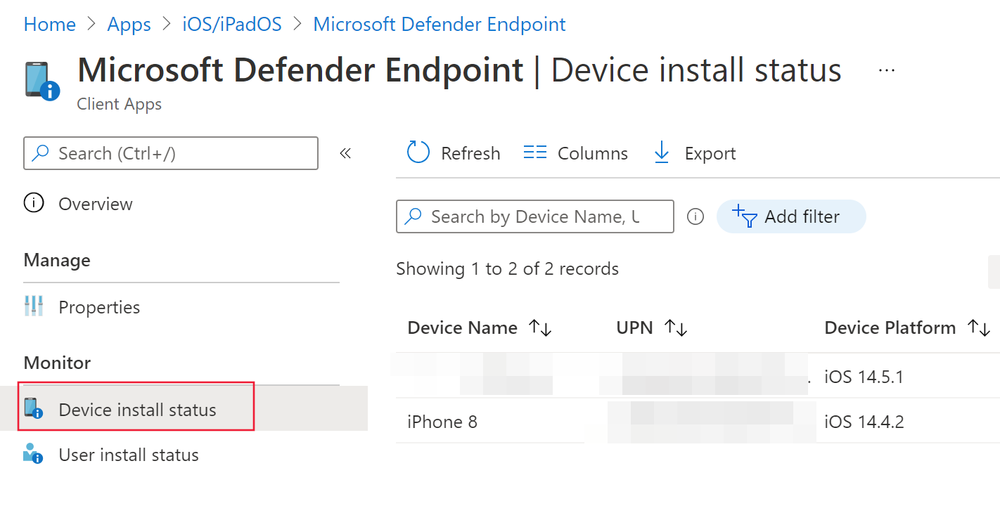

# Distribuire Microsoft Defender per Endpoint per iOSDeploy Microsoft Defender for Endpoint for iOS

[!INCLUDE [Microsoft 365 Defender rebranding](../../includes/microsoft-defender.md)]

**Si applica a:****Applies to:**
- [Microsoft Defender per endpointMicrosoft Defender for Endpoint](https://go.microsoft.com/fwlink/p/?linkid=2154037)
- [Microsoft 365 DefenderMicrosoft 365 Defender](https://go.microsoft.com/fwlink/?linkid=2118804)

> Vuoi provare Defender per Endpoint?Want to experience Defender for Endpoint? [Iscriversi per una versione di valutazione gratuita.Sign up for a free trial.](https://www.microsoft.com/microsoft-365/windows/microsoft-defender-atp?ocid=docs-wdatp-investigateip-abovefoldlink)

Questo argomento descrive la distribuzione di Defender per Endpoint per iOS nei dispositivi registrati nel portale aziendale di Intune.This topic describes deploying Defender for Endpoint for iOS on Intune Company Portal enrolled devices. Per altre informazioni sulla registrazione dei dispositivi Intune, vedi Registrare dispositivi [iOS/iPadOS in Intune.](https://docs.microsoft.com/mem/intune/enrollment/ios-enroll)For more information about Intune device enrollment, see [Enroll iOS/iPadOS devices in Intune](https://docs.microsoft.com/mem/intune/enrollment/ios-enroll).

## Prima di iniziareBefore you begin

- Assicurati di avere accesso [all'interfaccia di amministrazione di Microsoft Endpoint Manager.](https://go.microsoft.com/fwlink/?linkid=2109431)Ensure you have access to [Microsoft Endpoint manager admin center](https://go.microsoft.com/fwlink/?linkid=2109431).

- Verificare che la registrazione iOS sia stata eseguita per gli utenti.Ensure iOS enrollment is done for your users. Gli utenti devono disporre di una licenza defender per endpoint assegnata per poter usare Defender per Endpoint per iOS.Users need to have a Defender for Endpoint license assigned in order to use Defender for Endpoint for iOS. Per istruzioni [su come assegnare licenze, vedere](https://docs.microsoft.com/azure/active-directory/users-groups-roles/licensing-groups-assign) Assegnare licenze agli utenti.Refer to [Assign licenses to users](https://docs.microsoft.com/azure/active-directory/users-groups-roles/licensing-groups-assign) for instructions on how to assign licenses.

> [!NOTE]
> Microsoft Defender ATP (Microsoft Defender for Endpoint) per iOS è ora disponibile [nell'Apple App Store.](https://aka.ms/mdatpiosappstore)Microsoft Defender ATP (Microsoft Defender for Endpoint) for iOS is now available in the [Apple App Store](https://aka.ms/mdatpiosappstore).

## Fasi di distribuzioneDeployment steps

Distribuire Defender per Endpoint per iOS tramite il portale aziendale di Intune.Deploy Defender for Endpoint for iOS via Intune Company Portal.

### Aggiungere l'app di iOS StoreAdd iOS store app

1. [Nell'interfaccia di amministrazione di Microsoft Endpoint manager](https://go.microsoft.com/fwlink/?linkid=2109431)vai a **App**  ->  **iOS/iPadOS**  ->  **Aggiungi**  ->  **app dello Store iOS** e fai clic su **Seleziona.**In [Microsoft Endpoint manager admin center](https://go.microsoft.com/fwlink/?linkid=2109431), go to **Apps** -> **iOS/iPadOS** -> **Add** -> **iOS store app** and click **Select**.

    > [!div class="mx-imgBorder"]
    > 

1. Nella pagina Aggiungi app fai clic su **Cerca nell'App Store** e digita **Microsoft Defender Endpoint** nella barra di ricerca.On the Add app page, click on **Search the App Store** and type **Microsoft Defender Endpoint** in the search bar. Nella sezione dei risultati della ricerca fai clic su *Microsoft Defender Endpoint* e fai clic su **Seleziona.**In the search results section, click on *Microsoft Defender Endpoint* and click **Select**.

1. Seleziona **iOS 11.0** come sistema operativo minimo.Select **iOS 11.0** as the Minimum operating system. Esamina le altre informazioni sull'app e fai clic su **Avanti.**Review the rest of information about the app and click **Next**.

1. Nella sezione *Assegnazioni* passare alla sezione **Obbligatorio** e selezionare **Aggiungi gruppo.**In the *Assignments* section, go to the **Required** section and select **Add group**. Puoi quindi scegliere i gruppi di utenti di destinazione dell'app Defender per Endpoint per iOS.You can then choose the user group(s) that you would like to target Defender for Endpoint for iOS app. Fare **clic su** Seleziona e quindi su **Avanti.**Click **Select** and then **Next**.

    > [!NOTE]
    > Il gruppo di utenti selezionato deve essere costituito da utenti registrati in Intune.The selected user group should consist of Intune enrolled users.

    > [!div class="mx-imgBorder"]
    > 

1. Nella sezione *Revisione e creazione* verificare che tutte le informazioni immesse siano corrette e quindi selezionare **Crea**.In the *Review + Create* section, verify that all the information entered is correct and then select **Create**. In pochi istanti, l'app Defender for Endpoint dovrebbe essere creata correttamente e dovrebbe essere visualizzata una notifica nell'angolo in alto a destra della pagina.In a few moments, the Defender for Endpoint app should be created successfully, and a notification should show up at the top-right corner of the page.

1. Nella pagina delle informazioni sull'app visualizzata, nella sezione **Monitor** seleziona **Stato** installazione dispositivo per verificare che l'installazione del dispositivo sia stata completata correttamente.In the app information page that is displayed, in the **Monitor** section, select **Device install status** to verify that the device installation has completed successfully.

    > [!div class="mx-imgBorder"]
    > 

## Completare l'onboarding e controllare lo statoComplete onboarding and check status

1. Dopo aver installato Defender for Endpoint per iOS nel dispositivo, verrà visualizzata l'icona dell'app.Once Defender for Endpoint for iOS has been installed on the device, you  will see the app icon.

    

2. Tocca l'icona dell'app Defender for Endpoint e segui le istruzioni visualizzate per completare la procedura di onboarding.Tap the Defender for Endpoint app icon and follow the on-screen instructions to complete the onboarding steps. I dettagli includono l'accettazione da parte dell'utente finale delle autorizzazioni iOS richieste da Defender per Endpoint per iOS.The details include end-user acceptance of iOS permissions required by Defender for Endpoint for iOS.

3. Al completamento dell'onboarding, il dispositivo inizierà a essere visualizzato nell'elenco Dispositivi in Microsoft Defender Security Center.Upon successful onboarding, the device will start showing up on the Devices list in Microsoft Defender Security Center.

    > [!div class="mx-imgBorder"]
    > 

## Configurare Microsoft Defender per Endpoint per la modalità supervisioneConfigure Microsoft Defender for Endpoint for Supervised Mode

L'app Microsoft Defender for Endpoint per iOS ha capacità specializzate nei dispositivi iOS/iPadOS supervisionati, date le maggiori funzionalità di gestione fornite dalla piattaforma su questi tipi di dispositivi.The Microsoft Defender for Endpoint for iOS app has specialized ability on supervised iOS/iPadOS devices, given the increased management capabilities provided by the platform on these types of devices. Per sfruttare queste funzionalità, l'app Defender for Endpoint deve sapere se un dispositivo è in modalità supervisione.To take advantage of these capabilities, the Defender for Endpoint app needs to know if a device is in Supervised Mode.

### Configurare la modalità supervisionata tramite IntuneConfigure Supervised Mode via Intune

Intune consente di configurare l'app Defender per iOS tramite un criterio di configurazione dell'app.Intune allows you to configure the Defender for iOS app through an App Configuration policy.

   > [!NOTE]
   > Questo criterio di configurazione dell'app per i dispositivi supervisionati è applicabile solo ai dispositivi gestiti e deve essere destinato a tutti i dispositivi iOS gestiti come procedura consigliata.This app configuration policy for supervised devices is applicable only to managed devices and should be targeted for all managed iOS devices as a best practice.

1. Accedi all'interfaccia di amministrazione di [Microsoft Endpoint Manager](https://go.microsoft.com/fwlink/?linkid=2109431) e vai a **App** Criteri di configurazione  >  **app**  >  **Aggiungi**.Sign in to the [Microsoft Endpoint Manager admin center](https://go.microsoft.com/fwlink/?linkid=2109431) and go to **Apps** > **App configuration policies** > **Add**. Fare clic **su Dispositivi gestiti**.Click on **Managed devices**.

    > [!div class="mx-imgBorder"]
    > 

1. Nella pagina *Crea criteri di configurazione* app fornire le informazioni seguenti:In the *Create app configuration policy* page, provide the following information:
    - Nome criterioPolicy Name
    - Piattaforma: seleziona iOS/iPadOSPlatform: Select iOS/iPadOS
    - App mirata: seleziona **Microsoft Defender ATP** nell'elencoTargeted app: Select **Microsoft Defender ATP** from the list

    > [!div class="mx-imgBorder"]
    > 

1. Nella schermata successiva seleziona **Usa progettazione configurazione** come formato.In the next screen, select **Use configuration designer** as the format. Specificare la proprietà seguente:Specify the following property:
    - Chiave di configurazione: issupervisedConfiguration Key: issupervised
    - Tipo di valore: StringValue type: String
    - Valore di configurazione: {{issupervised}}Configuration Value: {{issupervised}}
    
    > [!div class="mx-imgBorder"]
    > 

1. Fare **clic su** Avanti per aprire la pagina Tag **ambito.**Click **Next** to open the **Scope tags** page. I tag di ambito sono facoltativi.Scope tags are optional. Fare clic su **Avanti** per continuare.Click **Next** to continue.

1. Nella **pagina Assegnazioni** selezionare i gruppi che riceveranno il profilo.On the **Assignments** page, select the groups that will receive this profile. Per questo scenario, è consigliabile scegliere come destinazione **Tutti i dispositivi**.For this scenario, it is best practice to target **All Devices**. Per ulteriori informazioni sull'assegnazione di profili, vedere [Assegnare profili utente e dispositivo.](https://docs.microsoft.com/mem/intune/configuration/device-profile-assign)For more information on assigning profiles, see [Assign user and device profiles](https://docs.microsoft.com/mem/intune/configuration/device-profile-assign).

   Quando si distribuisce ai gruppi di utenti, un utente deve accedere a un dispositivo prima dell'applicazione del criterio.When deploying to user groups, a user must sign in to a device before the policy applies.

   Fare clic su **Avanti**.Click **Next**.

1. Al termine della pagina Revisione **e** creazione scegliere **Crea.**On the **Review + create** page, when you're done, choose **Create**. Il nuovo profilo viene visualizzato nell'elenco dei profili di configurazione.The new profile is displayed in the list of configuration profiles.

1. Successivamente, per le funzionalità avanzate di anti-phishing, puoi distribuire un profilo personalizzato nei dispositivi iOS supervisionati.Next, for enhanced Anti-phishing capabilities, you can deploy a custom profile on the supervised iOS devices. Seguire la procedura seguente:Follow the steps below:
    - Scaricare il profilo di configurazione da [https://aka.ms/mdatpiossupervisedprofile](https://aka.ms/mdatpiossupervisedprofile)Download the config profile from [https://aka.ms/mdatpiossupervisedprofile](https://aka.ms/mdatpiossupervisedprofile)
    - Passare a **Dispositivi profili** di  ->  **configurazione iOS/iPadOS** Crea  ->    ->  **profilo**Navigate to **Devices** -> **iOS/iPadOS** -> **Configuration profiles** -> **Create Profile**

    > [!div class="mx-imgBorder"]
    > 

    - Specificare un nome del profilo.Provide a name of the profile. Quando viene richiesto di importare un file del profilo di configurazione, selezionare quello scaricato in precedenza.When prompted to import a Configuration profile file, select the one downloaded above.
    - Nella sezione **Assegnazione** seleziona il gruppo di dispositivi a cui vuoi applicare il profilo.In the **Assignment** section, select the device group to which you want to apply this profile. Come procedura consigliata, questa operazione deve essere applicata a tutti i dispositivi iOS gestiti.As a best practice, this should be applied to all managed iOS devices. Fare clic su **Avanti**.Click **Next**.
    - Al termine della pagina Revisione **e** creazione scegliere **Crea.**On the **Review + create** page, when you're done, choose **Create**. Il nuovo profilo viene visualizzato nell'elenco dei profili di configurazione.The new profile is displayed in the list of configuration profiles.

## Operazioni successiveNext Steps

[Configurare Defender per le funzionalità di Endpoint per iOSConfigure Defender for Endpoint for iOS features](ios-configure-features.md)
