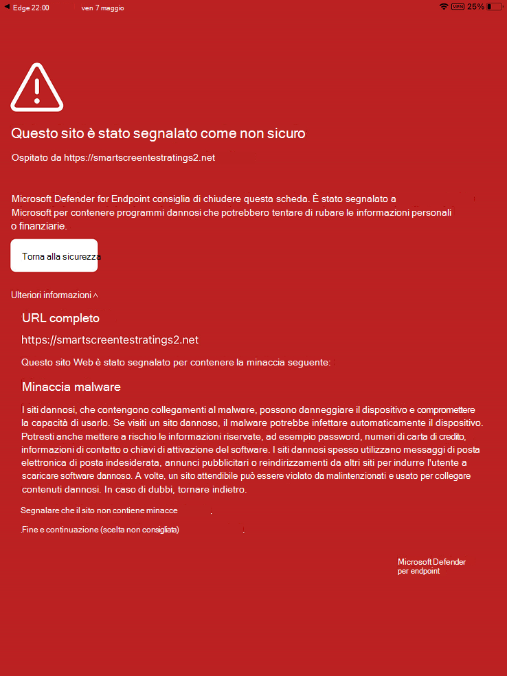

# Risolvere i problemi e trovare risposte alle domande frequenti su Microsoft Defender per Endpoint su iOS

[!INCLUDE [Microsoft 365 Defender rebranding](../../includes/microsoft-defender.md)]

**Si applica a:**
- [Microsoft Defender per endpoint](https://go.microsoft.com/fwlink/p/?linkid=2154037)
- [Microsoft 365 Defender](https://go.microsoft.com/fwlink/?linkid=2118804)

> Vuoi provare Defender per Endpoint? [Iscriversi per una versione di valutazione gratuita.](https://www.microsoft.com/microsoft-365/windows/microsoft-defender-atp?ocid=docs-wdatp-exposedapis-abovefoldlink) 

In questo argomento vengono fornite informazioni per la risoluzione dei problemi che possono verificarsi quando usi Microsoft Defender for Endpoint in iOS.

> [!NOTE]
> Defender for Endpoint in iOS userebbe una VPN per fornire la funzionalità di protezione Web. Non si tratta di una NORMALE VPN ed è una VPN locale/con looping che non porta traffico all'esterno del dispositivo.

## Le app non funzionano quando la VPN è attivata
Alcune app non funzionano più quando viene rilevata una VPN attiva. Puoi disabilitare la VPN durante l'uso di tali app. 

Per impostazione predefinita, Defender per Endpoint in iOS include e abilita la funzionalità di protezione Web. [La protezione Web](web-protection-overview.md) consente di proteggere i dispositivi dalle minacce Web e proteggere gli utenti dagli attacchi di phishing. Defender for Endpoint su iOS usa una VPN per fornire questa protezione. Tieni presente che si tratta di una VPN locale e, a differenza della VPN tradizionale, il traffico di rete non viene inviato all'esterno del dispositivo.

Anche se abilitata per impostazione predefinita, in alcuni casi potrebbe essere necessario disabilitare vpn. Ad esempio, vuoi eseguire alcune app che non funzionano quando è configurata una VPN. In questi casi, puoi scegliere di disabilitare vpn dall'app nel dispositivo seguendo la procedura seguente:

1. Nel dispositivo iOS, apri l'app **Impostazioni,** tocca o fai clic su **Generale** e **quindi su VPN.**
1. Tocca o fai clic sul pulsante "i" per Microsoft Defender for Endpoint.
1. Disattiva la **Connessione su richiesta per** disabilitare la VPN.

    > [!div class="mx-imgBorder"]
    > 

> [!NOTE]
> Protezione Web non sarà disponibile quando LA VPN è disabilitata. Per abilitare di nuovo Web Protection, apri l'app Microsoft Defender for Endpoint nel dispositivo e tocca o fai clic su **Avvia VPN.**

## Problemi con più profili VPN

Apple iOS non supporta più VPN **a livello** di dispositivo per essere attive contemporaneamente. Anche se nel dispositivo possono esistere più profili VPN, può essere attiva una sola VPN alla volta.

Microsoft Defender for Endpoint VPN può coesistere con altri VPN configurati *come per app* o *"Personale".*

## Consumo batteria

Nell'app Impostazioni, iOS mostra solo l'utilizzo della batteria delle app visibili all'utente per un periodo di tempo specifico. L'utilizzo della batteria da parte delle app visualizzate sullo schermo è solo per tale durata e viene calcolato da iOS in base a una serie di fattori, tra cui l'utilizzo della CPU e della rete. Microsoft Defender for Endpoint usa una VPN locale/loop-back in background per controllare il traffico Web per eventuali siti Web o connessioni dannose. I pacchetti di rete da qualsiasi app passano attraverso questo controllo e questo causa il calcolo impreciso dell'utilizzo della batteria di Microsoft Defender per Endpoint. Il consumo effettivo della batteria di Microsoft Defender per Endpoint è molto inferiore a quello visualizzato nella pagina Batteria Impostazioni nel dispositivo.

In media, l'utilizzo giornaliero della batteria da parte di Microsoft Defender for Endpoint in esecuzione in background è circa **l'8,81%** della batteria complessiva consumata in quel giorno. Questa metrica viene riportata da Apple in base all'utilizzo effettivo di Microsoft Defender per Endpoint nei dispositivi degli utenti finali e, a causa di motivi menzionati in precedenza, può essere utilizzata anche per altre app con attività di rete.

Inoltre, la VPN utilizzata è una VPN locale e, a differenza di una VPN tradizionale, il traffico di rete non viene inviato all'esterno del dispositivo.

## Utilizzo dei dati

Microsoft Defender for Endpoint usa una VPN locale/loopback per controllare il traffico Web per eventuali connessioni o siti Web dannosi. Per questo motivo, l'utilizzo dei dati di Microsoft Defender for Endpoint può essere inesatto. L'utilizzo effettivo dei dati da parte di Microsoft Defender per Endpoint non è significativo e minore di quello mostrato nella pagina Utilizzo dati Impostazioni nel dispositivo.

## Segnala sito non sicuro

I siti Web di phishing rappresentano siti Web attendibili allo scopo di ottenere informazioni personali o finanziarie. Visitare la [pagina Fornire commenti e suggerimenti](https://www.microsoft.com/wdsi/filesubmission/exploitguard/networkprotection) sulla protezione di rete per segnalare un sito Web che potrebbe essere un sito di phishing.

## Rilevato sito dannoso

Microsoft Defender for Endpoint ti protegge dal phishing o da altri attacchi basati sul Web. Se viene rilevato un sito dannoso, la connessione viene bloccata e viene inviato un avviso al portale del Centro sicurezza dell'organizzazione. L'avviso include il nome di dominio della connessione, l'indirizzo IP remoto e i dettagli del dispositivo.

Inoltre, nel dispositivo iOS viene visualizzata una notifica. Toccando la notifica si apre la schermata seguente per l'utente per esaminare i dettagli.

> [!div class="mx-imgBorder"]
> 

## Dati e privacy

Per informazioni dettagliate sui dati raccolti e sulla privacy, vedi [Informazioni sulla privacy - Microsoft Defender per Endpoint su iOS.](ios-privacy.md)

