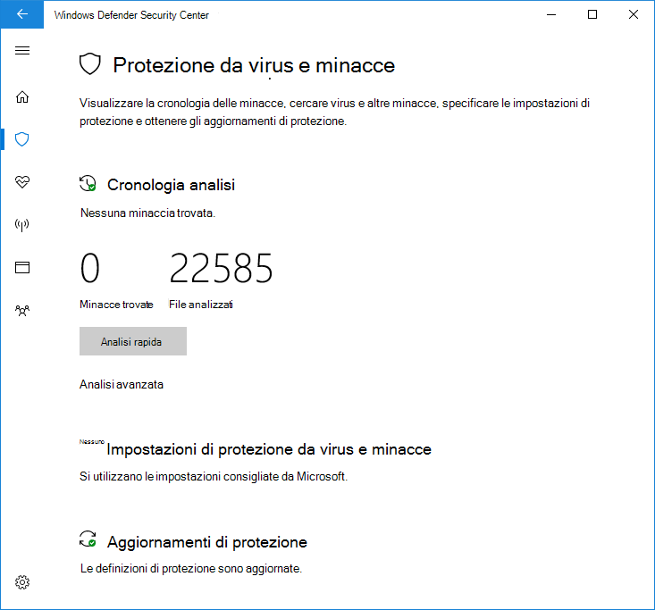

# Usare analisi periodiche limitate in Microsoft Defender AntivirusUse limited periodic scanning in Microsoft Defender Antivirus

[!INCLUDE [Microsoft 365 Defender rebranding](../../includes/microsoft-defender.md)]

**Si applica a:****Applies to:**

- [Microsoft Defender per endpointMicrosoft Defender for Endpoint](/microsoft-365/security/defender-endpoint/)

L'analisi periodica limitata è un tipo speciale di rilevamento e correzione delle minacce che può essere abilitato quando è stato installato un altro prodotto antivirus in un Windows 10 dispositivo.Limited periodic scanning is a special type of threat detection and remediation that can be enabled when you have installed another antivirus product on a Windows 10 device.

Può essere abilitato solo in determinate situazioni.It can only be enabled in certain situations. Per ulteriori informazioni sull'analisi periodica limitata e sul Antivirus Microsoft Defender con altri prodotti antivirus, vedere [Antivirus Microsoft Defender compatibilità.](microsoft-defender-antivirus-compatibility.md)For more information about limited periodic scanning and how Microsoft Defender Antivirus works with other antivirus products, see [Microsoft Defender Antivirus compatibility](microsoft-defender-antivirus-compatibility.md).

**Microsoft non consiglia di utilizzare questa funzionalità in ambienti aziendali. Si tratta di una funzionalità destinata principalmente agli utenti.****Microsoft does not recommend using this feature in enterprise environments. This is a feature primarily intended for consumers.** Questa funzionalità usa solo un sottoinsieme limitato delle funzionalità Antivirus Microsoft Defender per rilevare malware e non sarà in grado di rilevare la maggior parte del malware e software potenzialmente indesiderato.This feature only uses a limited subset of the Microsoft Defender Antivirus capabilities to detect malware, and will not be able to detect most malware and potentially unwanted software. Inoltre, le funzionalità di gestione e creazione di report saranno limitate.Also, management and reporting capabilities will be limited. Microsoft consiglia alle aziende di scegliere la soluzione antivirus principale e usarla esclusivamente.Microsoft recommends enterprises choose their primary antivirus solution and use it exclusively.

## Come abilitare l'analisi periodica limitataHow to enable limited periodic scanning

Per impostazione predefinita, Antivirus Microsoft Defender si abilita su un dispositivo Windows 10 se non è installato alcun altro prodotto antivirus o se l'altro prodotto non è aggiornato, è scaduto o non funziona correttamente.By default, Microsoft Defender Antivirus will enable itself on a Windows 10 device if there is no other antivirus product installed, or if the other product is out-of-date, expired, or not working correctly.

Se Antivirus Microsoft Defender è abilitato, verranno visualizzate le opzioni consuete per configurarlo nel dispositivo:If Microsoft Defender Antivirus is enabled, the usual options will appear to configure it on that device:

Se un altro prodotto antivirus è installato e funziona correttamente, Antivirus Microsoft Defender si disabiliterà.If another antivirus product is installed and working correctly, Microsoft Defender Antivirus will disable itself. L Sicurezza di Windows app modificherà la sezione **Protezione** dalle minacce & virus per mostrare lo stato del prodotto AV e fornirà un collegamento alle opzioni di configurazione del prodotto.The Windows Security app will change the **Virus & threat protection** section to show status about the AV product, and provide a link to the product's configuration options.

Sotto qualsiasi prodotto AV di terze parti, un nuovo collegamento verrà visualizzato **come Antivirus Microsoft Defender opzioni**.Underneath any third party AV products, a new link will appear as **Microsoft Defender Antivirus options**. Facendo clic su questo collegamento verrà visualizzato l'interruttore che consente una scansione periodica limitata.Clicking this link will expand to show the toggle that enables limited periodic scanning. Si noti che l'opzione periodica limitata è un interruttore per abilitare o disabilitare l'analisi periodica.Note that the limited periodic option is a toggle to enable or disable periodic scanning. 

Facendo scorrere l'interruttore **su On** verranno mostrate le opzioni standard di Microsoft Defender AV sotto il prodotto AV di terze parti.Sliding the switch to **On** will show the standard Microsoft Defender AV options underneath the third party AV product. L'opzione di scansione periodica limitata verrà visualizzata nella parte inferiore della pagina.The limited periodic scanning option will appear at the bottom of the page.

## Articoli correlatiRelated articles

- [Configurare la protezione comportamentale, euristica e in tempo realeConfigure behavioral, heuristic, and real-time protection](configure-protection-features-microsoft-defender-antivirus.md)
- [Antivirus Microsoft Defender in Windows 10Microsoft Defender Antivirus in Windows 10](microsoft-defender-antivirus-in-windows-10.md)