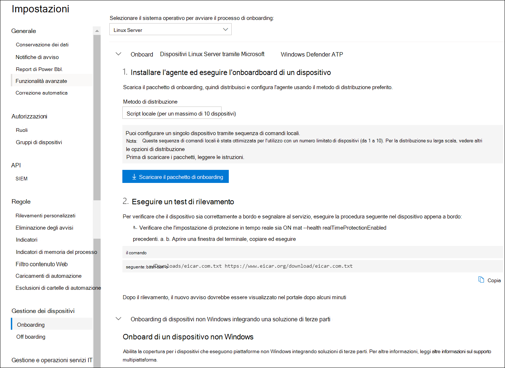

# <a name="deploy-microsoft-defender-for-endpoint-on-linux-manually"></a>Distribuire manualmente Microsoft Defender per Endpoint su Linux

[!INCLUDE [Microsoft 365 Defender rebranding](../../includes/microsoft-defender.md)]


**Si applica a:**
- [Microsoft Defender per endpoint](https://go.microsoft.com/fwlink/p/?linkid=2154037)
- [Microsoft 365 Defender](https://go.microsoft.com/fwlink/?linkid=2118804)

> Vuoi provare Defender per Endpoint? [Iscriversi per una versione di valutazione gratuita.](https://www.microsoft.com/microsoft-365/windows/microsoft-defender-atp?ocid=docs-wdatp-investigateip-abovefoldlink)

Questo articolo descrive come distribuire Manualmente Microsoft Defender for Endpoint su Linux. Una distribuzione corretta richiede il completamento di tutte le attività seguenti:

- [Distribuire manualmente Microsoft Defender per Endpoint su Linux](#deploy-microsoft-defender-for-endpoint-on-linux-manually)
  - [Prerequisiti e requisiti di sistema](#prerequisites-and-system-requirements)
  - [Configurare l'archivio software Linux](#configure-the-linux-software-repository)
    - [RHEL e varianti (CentOS e Oracle Linux)](#rhel-and-variants-centos-and-oracle-linux)
    - [SLES e varianti](#sles-and-variants)
    - [Sistemi Ubuntu e Debian](#ubuntu-and-debian-systems)
  - [Installazione dell'applicazione](#application-installation)
  - [Scaricare il pacchetto di onboarding](#download-the-onboarding-package)
  - [Configurazione client](#client-configuration)
  - [Script del programma di installazione](#installer-script)
  - [Registrare i problemi di installazione](#log-installation-issues)
  - [Aggiornamenti del sistema operativo](#operating-system-upgrades)
  - [Disinstallazione](#uninstallation)

## <a name="prerequisites-and-system-requirements"></a>Prerequisiti e requisiti di sistema

Prima di iniziare, vedi [Microsoft Defender for Endpoint on Linux](microsoft-defender-endpoint-linux.md) per una descrizione dei prerequisiti e dei requisiti di sistema per la versione software corrente.

## <a name="configure-the-linux-software-repository"></a>Configurare l'archivio software Linux

Defender per Endpoint su Linux può essere distribuito da uno dei seguenti canali (indicato di seguito come *[canale]*): *insiders-fast,* *insiders-slow* o *prod*. Ognuno di questi canali corrisponde a un archivio software Linux. Le istruzioni per configurare il dispositivo per l'uso di uno di questi archivi sono disponibili di seguito.

La scelta del canale determina il tipo e la frequenza degli aggiornamenti offerti al dispositivo. I dispositivi *in Insiders-fast* sono i primi a ricevere aggiornamenti e nuove funzionalità, seguiti successivamente da *insider lenti* e infine *da prod*.

Per visualizzare in anteprima le nuove funzionalità e fornire feedback anticipato, è consigliabile configurare alcuni dispositivi nell'organizzazione per l'uso di *insiders-fast* o *insiders-slow*.

> [!WARNING]
> Il cambio di canale dopo l'installazione iniziale richiede la reinstallazione del prodotto. Per cambiare il canale del prodotto: disinstalla il pacchetto esistente, ri-configura il dispositivo per l'uso del nuovo canale e segui i passaggi in questo documento per installare il pacchetto dal nuovo percorso.

### <a name="rhel-and-variants-centos-and-oracle-linux"></a>RHEL e varianti (CentOS e Oracle Linux)

- Installa `yum-utils` se non è ancora installato:

    ```bash
    sudo yum install yum-utils
    ```

- Annotare la distribuzione e la versione e identificare la voce più vicina (in base alla versione principale e secondaria) in `https://packages.microsoft.com/config/` . Ad esempio, RHEL 7.9 è più vicino a 7,4 rispetto a 8.

    Nei comandi seguenti sostituisci *[distro]* e *[versione]* con le informazioni identificate:

    > [!NOTE]
    > Nel caso di Oracle Linux, sostituisci *[distro]* con "rhel".

    ```bash
    sudo yum-config-manager --add-repo=https://packages.microsoft.com/config/[distro]/[version]/[channel].repo
    ```

    Ad esempio, se si esegue CentOS 7 e si desidera distribuire Defender for Endpoint su Linux dal *canale prod:*

    ```bash
    sudo yum-config-manager --add-repo=https://packages.microsoft.com/config/centos/7/prod.repo
    ```

    Oppure, se vuoi esplorare nuove funzionalità su dispositivi selezionati, potresti voler distribuire MDE per Linux nel canale *veloce per i insider:*

    ```bash
    sudo yum-config-manager --add-repo=https://packages.microsoft.com/config/centos/7/insiders-fast.repo
    ```

- Installare la chiave pubblica del Gruppo di criteri di gruppo di Microsoft:

    ```bash
    sudo rpm --import http://packages.microsoft.com/keys/microsoft.asc
    ```

- Scarica e rendi utilizzabili tutti i metadati per gli archivi yum attualmente abilitati:

    ```bash
    yum makecache
    ```

### <a name="sles-and-variants"></a>SLES e varianti

- Annotare la distribuzione e la versione e identificare la voce più vicina(in base alla versione principale e secondaria) in `https://packages.microsoft.com/config/` .

    Nei comandi seguenti sostituisci *[distro]* e *[versione]* con le informazioni identificate:

    ```bash
    sudo zypper addrepo -c -f -n microsoft-[channel] https://packages.microsoft.com/config/[distro]/[version]/[channel].repo
    ```

    Ad esempio, se si esegue SLES 12 e si desidera distribuire MDE per Linux dal *canale prod:*

    ```bash
    sudo zypper addrepo -c -f -n microsoft-prod https://packages.microsoft.com/config/sles/12/prod.repo
    ```

- Installare la chiave pubblica del Gruppo di criteri di gruppo di Microsoft:

    ```bash
    sudo rpm --import http://packages.microsoft.com/keys/microsoft.asc
    ```

### <a name="ubuntu-and-debian-systems"></a>Sistemi Ubuntu e Debian

- Installa `curl` se non è ancora installato:

    ```bash
    sudo apt-get install curl
    ```

- Installa `libplist-utils` se non è ancora installato:

    ```bash
    sudo apt-get install libplist-utils
    ```

- Annotare la distribuzione e la versione e identificare la voce più vicina (in base alla versione principale e secondaria) in `https://packages.microsoft.com/config` .

    Nel comando seguente sostituisci *[distro]* e *[versione]* con le informazioni identificate:

    ```bash
    curl -o microsoft.list https://packages.microsoft.com/config/[distro]/[version]/[channel].list
    ```

    Ad esempio, se si esegue Ubuntu 18.04 e si desidera distribuire MDE per Linux dal *canale prod:*

    ```bash
    curl -o microsoft.list https://packages.microsoft.com/config/ubuntu/18.04/prod.list
    ```

- Installare la configurazione del repository:

    ```bash
    sudo mv ./microsoft.list /etc/apt/sources.list.d/microsoft-[channel].list
    ```
    Ad esempio, se hai scelto *il canale prod:*

    ```bash
    sudo mv ./microsoft.list /etc/apt/sources.list.d/microsoft-prod.list
    ```

- Installare il `gpg` pacchetto se non è già installato:

    ```bash
    sudo apt-get install gpg
    ```

  Se `gpg` non è disponibile, installare `gnupg` .

- Installare la chiave pubblica del Gruppo di criteri di gruppo di Microsoft:

    ```bash
    curl https://packages.microsoft.com/keys/microsoft.asc | sudo apt-key add -
    ```

- Installare il driver https se non è già presente:

    ```bash
    sudo apt-get install apt-transport-https
    ```

- Aggiornare i metadati del repository:

    ```bash
    sudo apt-get update
    ```

## <a name="application-installation"></a>Installazione dell'applicazione

- RHEL e varianti (CentOS e Oracle Linux):

    ```bash
    sudo yum install mdatp
    ```

    Se nel dispositivo sono configurati più archivi Microsoft, è possibile specificare il repository da cui installare il pacchetto. L'esempio seguente mostra come installare il pacchetto dal canale se nel dispositivo è configurato anche `production` `insiders-fast` il canale repository. Questa situazione può verificarsi se si usano più prodotti Microsoft nel dispositivo. A seconda della distribuzione e della versione del server, l'alias del repository potrebbe essere diverso da quello dell'esempio seguente.

    ```bash
    # list all repositories
    yum repolist
    ```
    ```Output
    ...
    packages-microsoft-com-prod               packages-microsoft-com-prod        316
    packages-microsoft-com-prod-insiders-fast packages-microsoft-com-prod-ins      2
    ...
    ```
    ```bash
    # install the package from the production repository
    sudo yum --enablerepo=packages-microsoft-com-prod install mdatp
    ```

- SLES e varianti:

    ```bash
    sudo zypper install mdatp
    ```

    Se nel dispositivo sono configurati più archivi Microsoft, è possibile specificare il repository da cui installare il pacchetto. L'esempio seguente mostra come installare il pacchetto dal canale se nel dispositivo è configurato anche `production` `insiders-fast` il canale repository. Questa situazione può verificarsi se si usano più prodotti Microsoft nel dispositivo.

    ```bash
    zypper repos
    ```

    ```Output
    ...
    #  | Alias | Name | ...
    XX | packages-microsoft-com-insiders-fast | microsoft-insiders-fast | ...
    XX | packages-microsoft-com-prod | microsoft-prod | ...
    ...
    ```
    ```bash
    sudo zypper install packages-microsoft-com-prod:mdatp
    ```

- Sistema Ubuntu e Debian:

    ```bash
    sudo apt-get install mdatp
    ```

    Se nel dispositivo sono configurati più archivi Microsoft, è possibile specificare il repository da cui installare il pacchetto. L'esempio seguente mostra come installare il pacchetto dal canale se nel dispositivo è configurato anche `production` `insiders-fast` il canale repository. Questa situazione può verificarsi se si usano più prodotti Microsoft nel dispositivo.

    ```bash
    cat /etc/apt/sources.list.d/*
    ```
    ```Output
    deb [arch=arm64,armhf,amd64] https://packages.microsoft.com/ubuntu/18.04/prod insiders-fast main
    deb [arch=amd64] https://packages.microsoft.com/ubuntu/18.04/prod bionic main
    ```
    ```bash
    sudo apt -t bionic install mdatp
    ```

## <a name="download-the-onboarding-package"></a>Scaricare il pacchetto di onboarding

Scaricare il pacchetto di onboarding da Microsoft Defender Security Center:

1. In Microsoft Defender Security Center passare a Gestione **Impostazioni > dispositivi > onboarding**.
2. Nel primo menu a discesa seleziona **Linux Server** come sistema operativo. Nel secondo menu a discesa seleziona Script locale (per un massimo **di 10 dispositivi)** come metodo di distribuzione.
3. Seleziona **Scarica pacchetto di onboarding.** Salvare il file come WindowsDefenderATPOnboardingPackage.zip.

    

4. Da un prompt dei comandi, verificare di disporre del file.
    Estrarre il contenuto dell'archivio:

    ```bash
    ls -l
    ```

    ```Output
    total 8
    -rw-r--r-- 1 test  staff  5752 Feb 18 11:22 WindowsDefenderATPOnboardingPackage.zip
    ```

    ```bash
    unzip WindowsDefenderATPOnboardingPackage.zip
    ```
    ```Output
    Archive:  WindowsDefenderATPOnboardingPackage.zip
    inflating: MicrosoftDefenderATPOnboardingLinuxServer.py
    ```


## <a name="client-configuration"></a>Configurazione client

1. Copia MicrosoftDefenderATPOnboardingLinuxServer.py nel dispositivo di destinazione.

    Inizialmente il dispositivo client non è associato a un'organizzazione. Si noti che *l'attributo orgId* è vuoto:

    ```bash
    mdatp health --field org_id
    ```

2. Esegui MicrosoftDefenderATPOnboardingLinuxServer.py e tieni presente che, per eseguire questo comando, devi aver `python` installato nel dispositivo:

    ```bash
    python MicrosoftDefenderATPOnboardingLinuxServer.py
    ```

3. Verifica che il dispositivo sia ora associato all'organizzazione e segnala un identificatore di organizzazione valido:

    ```bash
    mdatp health --field org_id
    ```

4. Pochi minuti dopo aver completato l'installazione, è possibile visualizzare lo stato eseguendo il comando seguente. Il valore restituito di `1` indica che il prodotto funziona come previsto:

    ```bash
    mdatp health --field healthy
    ```

    > [!IMPORTANT]
    > Quando il prodotto viene avviato per la prima volta, scarica le definizioni antimalware più recenti. A seconda della connessione Internet, l'operazione può richiedere alcuni minuti. Durante questo periodo di tempo il comando precedente restituisce il valore `false` . È possibile controllare lo stato dell'aggiornamento delle definizioni utilizzando il comando seguente:
    > ```bash
    > mdatp health --field definitions_status
    > ```
    > Tenere presente che potrebbe essere necessario configurare un proxy anche dopo aver completato l'installazione iniziale. Vedi [Configurare Defender per Endpoint su Linux per l'individuazione di proxy statici: configurazione post-installazione.](https://docs.microsoft.com/microsoft-365/security/defender-endpoint/linux-static-proxy-configuration#post-installation-configuration)

5. Eseguire un test di rilevamento per verificare che il dispositivo sia correttamente onboarded e che il servizio sia segnalato. Eseguire la procedura seguente nel dispositivo appena onboarded:

    - Verificare che la protezione in tempo reale sia abilitata (denotata dall'esecuzione `1` del comando seguente):

        ```bash
        mdatp health --field real_time_protection_enabled
        ```

    - Aprire una finestra terminale. Copiare ed eseguire il comando seguente:

        ``` bash
        curl -o /tmp/eicar.com.txt https://www.eicar.org/download/eicar.com.txt
        ```

    - Il file dovrebbe essere stato messo in quarantena da Defender per Endpoint su Linux. Utilizzare il comando seguente per elencare tutte le minacce rilevate:

        ```bash
        mdatp threat list
        ```

## <a name="installer-script"></a>Script del programma di installazione

In alternativa, puoi usare uno script di avvio automatico del [programma](https://github.com/microsoft/mdatp-xplat/blob/master/linux/installation/mde_installer.sh) di installazione fornito nel nostro repository GitHub [pubblico.](https://github.com/microsoft/mdatp-xplat/)
Lo script identifica la distribuzione e la versione e configura il dispositivo per estrarre il pacchetto più recente e installarlo.
Puoi anche eseguire l'onboardboard con uno script fornito.

```bash
❯ ./mde_installer.sh --help
usage: basename ./mde_installer.sh [OPTIONS]
Options:
-c|--channel      specify the channel from which you want to install. Default: insiders-fast
-i|--install      install the product
-r|--remove       remove the product
-u|--upgrade      upgrade the existing product
-o|--onboard      onboard/offboard the product with <onboarding_script>
-p|--passive-mode set EPP to passive mode
-t|--tag          set a tag by declaring <name> and <value>. ex: -t GROUP Coders
-m|--min_req      enforce minimum requirements
-w|--clean        remove repo from package manager for a specific channel
-v|--version      print out script version
-h|--help         display help
```

Per altre [informazioni, vedere](https://github.com/microsoft/mdatp-xplat/tree/master/linux/installation).

## <a name="log-installation-issues"></a>Registrare i problemi di installazione

Vedere [Registrare i problemi](linux-resources.md#log-installation-issues) di installazione per ulteriori informazioni su come trovare il registro generato automaticamente creato dal programma di installazione quando si verifica un errore.

## <a name="operating-system-upgrades"></a>Aggiornamenti del sistema operativo

Durante l'aggiornamento del sistema operativo a una nuova versione principale, devi prima disinstallare Defender per Endpoint in Linux, installare l'aggiornamento e infine riconfigurare Defender per Endpoint su Linux nel dispositivo.

## <a name="how-to-migrate-from-insiders-fast-to-production-channel"></a>Come eseguire la migrazione da Insiders-Fast al canale di produzione

1. Disinstallare la versione "Insiders-Fast Channel" di MDE per Linux.

    ``
    sudo yum remove mdatp
    ``

1. Disabilitare mdE per Linux Insiders-Fast repo  ``
    sudo yum repolist
    ``

    > [!NOTE]
    > L'output dovrebbe mostrare "packages-microsoft-com-fast-prod".

    ``
    sudo yum-config-manager --disable packages-microsoft-com-fast-prod
    ``
1. Ridistribuire MDE per Linux usando il "canale di produzione".


## <a name="uninstallation"></a>Disinstallazione

Vedi [Disinstallare](linux-resources.md#uninstall) per informazioni dettagliate su come rimuovere Defender per Endpoint su Linux dai dispositivi client.
