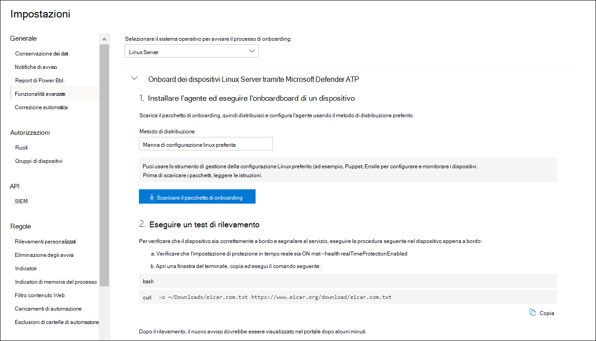

# <a name="deploy-microsoft-defender-for-endpoint-on-linux-with-ansible"></a>Distribuire Microsoft Defender per Endpoint su Linux con Ansible

[!INCLUDE [Microsoft 365 Defender rebranding](../../includes/microsoft-defender.md)]


**Si applica a:**
- [Microsoft Defender per endpoint](https://go.microsoft.com/fwlink/p/?linkid=2154037)
- [Microsoft 365 Defender](https://go.microsoft.com/fwlink/?linkid=2118804)

> Vuoi provare Defender for Endpoint? [Iscriviti per una prova gratuita.](https://www.microsoft.com/microsoft-365/windows/microsoft-defender-atp?ocid=docs-wdatp-investigateip-abovefoldlink)

In questo articolo viene descritto come distribuire Defender for Endpoint su Linux utilizzando Ansible. Una distribuzione riuscita richiede il completamento di tutte le attività seguenti:

- [Scarica il pacchetto onboarding](#download-the-onboarding-package)
- [Creare file YAML ansibili](#create-ansible-yaml-files)
- [Distribuzione](#deployment)
- [Riferimenti](#references)

## <a name="prerequisites-and-system-requirements"></a>Prerequisiti e requisiti di sistema

Prima di iniziare, vedere la [pagina Defender for Endpoint principale su Linux per](microsoft-defender-endpoint-linux.md) una descrizione dei prerequisiti e dei requisiti di sistema per la versione software corrente.

Inoltre, per la distribuzione Ansible, è necessario avere familiarità con le attività di amministrazione ansible, configurare Ansible e sapere come distribuire playbook e attività. Ansible ha molti modi per completare la stessa attività. Queste istruzioni presuppongono la disponibilità di moduli Ansible supportati, *ad esempio apt* *e unarchive per* facilitare la distribuzione del pacchetto. L'organizzazione potrebbe usare un flusso di lavoro diverso. Per ulteriori [informazioni, fare riferimento alla documentazione ansible.](https://docs.ansible.com/)

- Ansible deve essere installato in almeno un computer (Ansible chiama questo nodo di controllo).
- SSH deve essere configurato per un account amministratore tra il nodo di controllo e tutti i nodi gestiti (dispositivi in cui sarà installato Defender for Endpoint) ed è consigliabile configurarlo con l'autenticazione a chiave pubblica.
- In tutti i nodi gestiti deve essere installato il software seguente:
  - ricciolo
  - pitone-apt

- Tutti i nodi gestiti devono essere elencati nel formato seguente nel `/etc/ansible/hosts` file o nel file pertinente:

    ```bash
    [servers]
    host1 ansible_ssh_host=10.171.134.39
    host2 ansible_ssh_host=51.143.50.51
    ```

- Test ping:

    ```bash
    ansible -m ping all
    ```

## <a name="download-the-onboarding-package"></a>Scarica il pacchetto onboarding

Scarica il pacchetto di onboarding da Microsoft Defender Security Center:

1. In Microsoft Defender Security Center passare a **Gestione Impostazioni > dispositivi > onboarding**.
2. Nel primo menu a discesa, selezionare **Linux Server** come sistema operativo. Nel secondo menu a discesa selezionare Lo strumento **di gestione della configurazione Linux preferito** come metodo di distribuzione.
3. Selezionare **Scarica pacchetto onboarding**. Salvare il file come WindowsDefenderATPOnboardingPackage.zip.

    

4. Dal prompt dei comandi verificare di avere il file. Estrarre il contenuto dell'archivio:

    ```bash
    ls -l
    ```
    ```Output
    total 8
    -rw-r--r-- 1 test  staff  4984 Feb 18 11:22 WindowsDefenderATPOnboardingPackage.zip
    ```
    ```bash
    unzip WindowsDefenderATPOnboardingPackage.zip
    ```
    ```Output
    Archive:  WindowsDefenderATPOnboardingPackage.zip
    inflating: mdatp_onboard.json
    ```

## <a name="create-ansible-yaml-files"></a>Creare file YAML ansibili

Creare una sottoattività o file di ruolo che contribuiscano a un playbook o a un'attività.

- Creare l'attività di onboarding: `onboarding_setup.yml`

    ```bash
    - name: Create MDATP directories
      file:
        path: /etc/opt/microsoft/mdatp/
        recurse: true
        state: directory
        mode: 0755
        owner: root
        group: root

    - name: Register mdatp_onboard.json
      stat:
        path: /etc/opt/microsoft/mdatp/mdatp_onboard.json
      register: mdatp_onboard

    - name: Extract WindowsDefenderATPOnboardingPackage.zip into /etc/opt/microsoft/mdatp
      unarchive:
        src: WindowsDefenderATPOnboardingPackage.zip
        dest: /etc/opt/microsoft/mdatp
        mode: 0600
        owner: root
        group: root
      when: not mdatp_onboard.stat.exists
    ```

- Aggiungere il repository e la chiave Defender for `add_apt_repo.yml` Endpoint:

    Defender for Endpoint su Linux può essere distribuito da uno dei seguenti canali (indicato di seguito come *[channel]*): *insiders-fast*, *insiders-slow* o *prod*. Ognuno di questi canali corrisponde a un repository software Linux.

    La scelta del canale determina il tipo e la frequenza degli aggiornamenti offerti al dispositivo. I dispositivi *in tempi privilegiati sono* i primi a ricevere aggiornamenti e nuove funzionalità, seguiti in seguito da *insider-slow* e infine da *prod*.

    Per visualizzare in anteprima le nuove funzionalità e fornire un feedback tempestivo, è consigliabile configurare alcuni dispositivi dell'azienda in modo che *utilizzi insider veloci* o *i partecipanti al programma Insider-slow*.

    > [!WARNING]
    > Il cambio di canale dopo l'installazione iniziale richiede la reinstallazione del prodotto. Per cambiare canale prodotto: disinstallare il pacchetto esistente, riconfigurare il dispositivo per l'utilizzo del nuovo canale e seguire i passaggi descritti in questo documento per installare il pacchetto dal nuovo percorso.

    Prendere nota della distribuzione e della versione e identificare la voce più vicina in `https://packages.microsoft.com/config/` .

    Nei comandi seguenti sostituire *[distro]* *e [version]* con le informazioni identificate.

    > [!NOTE]
    > Nel caso di Oracle Linux, sostituire *[distro]* con "rhel".

  ```bash
  - name: Add Microsoft APT key
    apt_key:
      keyserver: https://packages.microsoft.com/
      id: BC528686B50D79E339D3721CEB3E94ADBE1229CF
    when: ansible_os_family == "Debian"

  - name: Add Microsoft apt repository for MDATP
    apt_repository:
      repo: deb [arch=arm64,armhf,amd64] https://packages.microsoft.com/[distro]/[version]/prod [channel] main
      update_cache: yes
      state: present
      filename: microsoft-[channel].list
    when: ansible_os_family == "Debian"

  - name: Add Microsoft DNF/YUM key
    rpm_key:
      state: present
      key: https://packages.microsoft.com/keys/microsoft.asc
    when: ansible_os_family == "RedHat"

  - name: Add  Microsoft yum repository for MDATP
    yum_repository:
      name: packages-microsoft-com-prod-[channel]
      description: Microsoft Defender for Endpoint
      file: microsoft-[channel]
      baseurl: https://packages.microsoft.com/[distro]/[version]/[channel]/
      gpgcheck: yes
      enabled: Yes
    when: ansible_os_family == "RedHat"
  ```

- Creare i file YAML di installazione e disinstallazione ansible.

    - Per le distribuzioni basate su apt utilizzare il seguente file YAML:

        ```bash
        cat install_mdatp.yml
        ```
        ```Output
        - hosts: servers
          tasks:
            - include: ../roles/onboarding_setup.yml
            - include: ../roles/add_apt_repo.yml
            - name: Install MDATP
              apt:
                name: mdatp
                state: latest
                update_cache: yes
        ```

        ```bash
        cat uninstall_mdatp.yml
        ```
        ```Output
        - hosts: servers
          tasks:
            - name: Uninstall MDATP
              apt:
                name: mdatp
                state: absent
        ```

    - Per le distribuzioni basate su dnf utilizzare il seguente file YAML:

        ```bash
        cat install_mdatp_dnf.yml
        ```
        ```Output
        - hosts: servers
          tasks:
            - include: ../roles/onboarding_setup.yml
            - include: ../roles/add_yum_repo.yml
            - name: Install MDATP
              dnf:
                name: mdatp
                state: latest
                enablerepo: packages-microsoft-com-prod-[channel]
        ```

        ```bash
        cat uninstall_mdatp_dnf.yml
        ```
        ```Output
        - hosts: servers
          tasks:
            - name: Uninstall MDATP
              dnf:
                name: mdatp
                state: absent
        ```

## <a name="deployment"></a>Distribuzione

Ora esegui i file delle attività in `/etc/ansible/playbooks/` o nella directory pertinente.

- installazione:

    ```bash
    ansible-playbook /etc/ansible/playbooks/install_mdatp.yml -i /etc/ansible/hosts
    ```

> [!IMPORTANT]
> Quando il prodotto inizia per la prima volta, scarica le più recenti definizioni di antimalware. A seconda della connessione Internet, possono essere disponibili fino a pochi minuti.

- Convalida/configurazione:

    ```bash
    ansible -m shell -a 'mdatp connectivity test' all
    ```
    ```bash
    ansible -m shell -a 'mdatp health' all
    ```

- Disinstallazione:

    ```bash
    ansible-playbook /etc/ansible/playbooks/uninstall_mdatp.yml -i /etc/ansible/hosts
    ```

## <a name="log-installation-issues"></a>Problemi di installazione dei registri

Per [ulteriori informazioni su](linux-resources.md#log-installation-issues) come trovare il registro generato automaticamente creato dal programma di installazione quando si verifica un errore, vedere Problemi di installazione del registro.

## <a name="operating-system-upgrades"></a>Aggiornamenti del sistema operativo

Quando si aggiorna il sistema operativo a una nuova versione principale, è necessario prima disinstallare Defender for Endpoint su Linux, installare l'aggiornamento e infine riconfigurare Defender for Endpoint su Linux sul dispositivo.

## <a name="references"></a>Riferimenti

- [Aggiungere o rimuovere repository YUM](https://docs.ansible.com/ansible/latest/collections/ansible/builtin/yum_repository_module.html)

- [Gestire i pacchetti con il gestore pacchetti dnf](https://docs.ansible.com/ansible/latest/collections/ansible/builtin/dnf_module.html)

- [Aggiungere e rimuovere repository APT](https://docs.ansible.com/ansible/latest/collections/ansible/builtin/apt_repository_module.html)

- [Gestire i pacchetti apt](https://docs.ansible.com/ansible/latest/collections/ansible/builtin/apt_module.html)

## <a name="see-also"></a>Vedere anche
- [Esaminare i problemi di integrità dell'agente](health-status.md)
