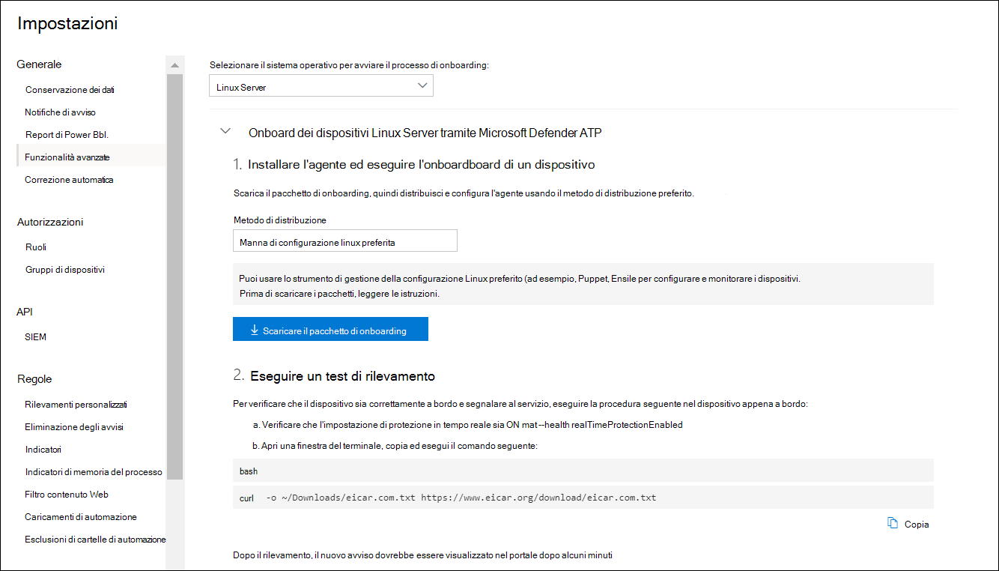

# <a name="deploy-microsoft-defender-for-endpoint-on-linux-with-puppet"></a><span data-ttu-id="b9540-104">Distribuire Microsoft Defender per Endpoint in Linux con Puppet</span><span class="sxs-lookup"><span data-stu-id="b9540-104">Deploy Microsoft Defender for Endpoint on Linux with Puppet</span></span>

[!INCLUDE [Microsoft 365 Defender rebranding](../../includes/microsoft-defender.md)]


<span data-ttu-id="b9540-105">**Si applica a:**</span><span class="sxs-lookup"><span data-stu-id="b9540-105">**Applies to:**</span></span>
- [<span data-ttu-id="b9540-106">Microsoft Defender per endpoint</span><span class="sxs-lookup"><span data-stu-id="b9540-106">Microsoft Defender for Endpoint</span></span>](https://go.microsoft.com/fwlink/p/?linkid=2154037)
- [<span data-ttu-id="b9540-107">Microsoft 365 Defender</span><span class="sxs-lookup"><span data-stu-id="b9540-107">Microsoft 365 Defender</span></span>](https://go.microsoft.com/fwlink/?linkid=2118804)

> <span data-ttu-id="b9540-108">Vuoi provare Defender per Endpoint?</span><span class="sxs-lookup"><span data-stu-id="b9540-108">Want to experience Defender for Endpoint?</span></span> [<span data-ttu-id="b9540-109">Iscriversi per una versione di valutazione gratuita.</span><span class="sxs-lookup"><span data-stu-id="b9540-109">Sign up for a free trial.</span></span>](https://www.microsoft.com/microsoft-365/windows/microsoft-defender-atp?ocid=docs-wdatp-investigateip-abovefoldlink)

<span data-ttu-id="b9540-110">Questo articolo descrive come distribuire Defender for Endpoint in Linux usando Puppet.</span><span class="sxs-lookup"><span data-stu-id="b9540-110">This article describes how to deploy Defender for Endpoint on Linux using Puppet.</span></span> <span data-ttu-id="b9540-111">Una distribuzione corretta richiede il completamento di tutte le attività seguenti:</span><span class="sxs-lookup"><span data-stu-id="b9540-111">A successful deployment requires the completion of all of the following tasks:</span></span>

- [<span data-ttu-id="b9540-112">Scaricare il pacchetto di onboarding</span><span class="sxs-lookup"><span data-stu-id="b9540-112">Download the onboarding package</span></span>](#download-the-onboarding-package)
- [<span data-ttu-id="b9540-113">Creare il manifesto di Pupazzo</span><span class="sxs-lookup"><span data-stu-id="b9540-113">Create Puppet manifest</span></span>](#create-a-puppet-manifest)
- [<span data-ttu-id="b9540-114">Distribuzione</span><span class="sxs-lookup"><span data-stu-id="b9540-114">Deployment</span></span>](#deployment)
- [<span data-ttu-id="b9540-115">Controllare lo stato di onboarding</span><span class="sxs-lookup"><span data-stu-id="b9540-115">Check onboarding status</span></span>](#check-onboarding-status)

## <a name="prerequisites-and-system-requirements"></a><span data-ttu-id="b9540-116">Prerequisiti e requisiti di sistema</span><span class="sxs-lookup"><span data-stu-id="b9540-116">Prerequisites and system requirements</span></span>

 <span data-ttu-id="b9540-117">Per una descrizione dei prerequisiti e dei requisiti di sistema per la versione software corrente, vedi [la pagina principale di Defender per Endpoint su Linux.](microsoft-defender-endpoint-linux.md)</span><span class="sxs-lookup"><span data-stu-id="b9540-117">For a description of prerequisites and system requirements for the current software version, see [the main Defender for Endpoint on Linux page](microsoft-defender-endpoint-linux.md).</span></span>

<span data-ttu-id="b9540-118">Inoltre, per la distribuzione di Puppet, devi avere familiarità con le attività di amministrazione di Puppet, avere Configurato Pupazzo e sapere come distribuire i pacchetti.</span><span class="sxs-lookup"><span data-stu-id="b9540-118">In addition, for Puppet deployment, you need to be familiar with Puppet administration tasks, have Puppet configured, and know how to deploy packages.</span></span> <span data-ttu-id="b9540-119">Puppet ha molti modi per completare la stessa attività.</span><span class="sxs-lookup"><span data-stu-id="b9540-119">Puppet has many ways to complete the same task.</span></span> <span data-ttu-id="b9540-120">Queste istruzioni presuppongono la disponibilità dei moduli di Pupazzo supportati, ad esempio *apt* per facilitare la distribuzione del pacchetto.</span><span class="sxs-lookup"><span data-stu-id="b9540-120">These instructions assume availability of supported Puppet modules, such as *apt* to help deploy the package.</span></span> <span data-ttu-id="b9540-121">L'organizzazione potrebbe utilizzare un flusso di lavoro diverso.</span><span class="sxs-lookup"><span data-stu-id="b9540-121">Your organization might use a different workflow.</span></span> <span data-ttu-id="b9540-122">Per informazioni dettagliate, fai riferimento alla documentazione [di Puppet.](https://puppet.com/docs)</span><span class="sxs-lookup"><span data-stu-id="b9540-122">Refer to the [Puppet documentation](https://puppet.com/docs) for details.</span></span>

## <a name="download-the-onboarding-package"></a><span data-ttu-id="b9540-123">Scaricare il pacchetto di onboarding</span><span class="sxs-lookup"><span data-stu-id="b9540-123">Download the onboarding package</span></span>

<span data-ttu-id="b9540-124">Scaricare il pacchetto di onboarding da Microsoft Defender Security Center:</span><span class="sxs-lookup"><span data-stu-id="b9540-124">Download the onboarding package from Microsoft Defender Security Center:</span></span>

1. <span data-ttu-id="b9540-125">In Microsoft Defender Security Center passare a Gestione **Impostazioni > dispositivi > onboarding**.</span><span class="sxs-lookup"><span data-stu-id="b9540-125">In Microsoft Defender Security Center, go to **Settings > Device Management > Onboarding**.</span></span>
2. <span data-ttu-id="b9540-126">Nel primo menu a discesa seleziona **Linux Server** come sistema operativo.</span><span class="sxs-lookup"><span data-stu-id="b9540-126">In the first drop-down menu, select **Linux Server** as the operating system.</span></span> <span data-ttu-id="b9540-127">Nel secondo menu a discesa seleziona Lo strumento di gestione della **configurazione Linux preferito** come metodo di distribuzione.</span><span class="sxs-lookup"><span data-stu-id="b9540-127">In the second drop-down menu, select **Your preferred Linux configuration management tool** as the deployment method.</span></span>
3. <span data-ttu-id="b9540-128">Seleziona **Scarica pacchetto di onboarding.**</span><span class="sxs-lookup"><span data-stu-id="b9540-128">Select **Download onboarding package**.</span></span> <span data-ttu-id="b9540-129">Salvare il file come WindowsDefenderATPOnboardingPackage.zip.</span><span class="sxs-lookup"><span data-stu-id="b9540-129">Save the file as WindowsDefenderATPOnboardingPackage.zip.</span></span>

    

4. <span data-ttu-id="b9540-131">Da un prompt dei comandi, verificare di disporre del file.</span><span class="sxs-lookup"><span data-stu-id="b9540-131">From a command prompt, verify that you have the file.</span></span> 

    ```bash
    ls -l
    ```
    ```Output
    total 8
    -rw-r--r-- 1 test  staff  4984 Feb 18 11:22 WindowsDefenderATPOnboardingPackage.zip
    ```
5. <span data-ttu-id="b9540-132">Estrarre il contenuto dell'archivio.</span><span class="sxs-lookup"><span data-stu-id="b9540-132">Extract the contents of the archive.</span></span>
    ```bash
    unzip WindowsDefenderATPOnboardingPackage.zip
    ```
    ```Output
    Archive:  WindowsDefenderATPOnboardingPackage.zip
    inflating: mdatp_onboard.json
    ```

## <a name="create-a-puppet-manifest"></a><span data-ttu-id="b9540-133">Creare un manifesto di Pupazzo</span><span class="sxs-lookup"><span data-stu-id="b9540-133">Create a Puppet manifest</span></span>

<span data-ttu-id="b9540-134">Devi creare un manifesto Di pupazzo per distribuire Defender per Endpoint su Linux nei dispositivi gestiti da un server Puppet.</span><span class="sxs-lookup"><span data-stu-id="b9540-134">You need to create a Puppet manifest for deploying Defender for Endpoint on Linux to devices managed by a Puppet server.</span></span> <span data-ttu-id="b9540-135">Questo esempio usa i moduli *apt* e *yumrepo* disponibili da puppetlabs e presuppone che i moduli siano stati installati nel server Puppet.</span><span class="sxs-lookup"><span data-stu-id="b9540-135">This example makes use of the *apt* and *yumrepo* modules available from puppetlabs, and assumes that the modules have been installed on your Puppet server.</span></span>

<span data-ttu-id="b9540-136">Crea le cartelle *install_mdatp/file* *e install_mdatp/manifesti* nella cartella dei moduli dell'installazione di Puppet.</span><span class="sxs-lookup"><span data-stu-id="b9540-136">Create the folders *install_mdatp/files* and *install_mdatp/manifests* under the modules folder of your Puppet installation.</span></span> <span data-ttu-id="b9540-137">Questa cartella si trova in genere in */etc/puppetlabs/code/environments/production/modules* sul server Puppet.</span><span class="sxs-lookup"><span data-stu-id="b9540-137">This folder is typically located in */etc/puppetlabs/code/environments/production/modules* on your Puppet server.</span></span> <span data-ttu-id="b9540-138">Copiare mdatp_onboard.jsfile creato in precedenza *nella cartella install_mdatp/files.*</span><span class="sxs-lookup"><span data-stu-id="b9540-138">Copy the mdatp_onboard.json file created above to the *install_mdatp/files* folder.</span></span> <span data-ttu-id="b9540-139">Creare un *file init.pp*</span><span class="sxs-lookup"><span data-stu-id="b9540-139">Create an *init.pp*</span></span> <span data-ttu-id="b9540-140">contenente le istruzioni di distribuzione:</span><span class="sxs-lookup"><span data-stu-id="b9540-140">file that contains the deployment instructions:</span></span>

```bash
pwd
```
```Output
/etc/puppetlabs/code/environments/production/modules
```

```bash
tree install_mdatp
```
```Output
install_mdatp
├── files
│   └── mdatp_onboard.json
└── manifests
    └── init.pp
```

### <a name="contents-of-install_mdatpmanifestsinitpp"></a><span data-ttu-id="b9540-141">Contenuto di `install_mdatp/manifests/init.pp`</span><span class="sxs-lookup"><span data-stu-id="b9540-141">Contents of `install_mdatp/manifests/init.pp`</span></span>

<span data-ttu-id="b9540-142">Defender per Endpoint su Linux può essere distribuito da uno dei seguenti canali (indicato di seguito come *[canale]*): *insiders-fast,* *insiders-slow* o *prod*. Ognuno di questi canali corrisponde a un archivio software Linux.</span><span class="sxs-lookup"><span data-stu-id="b9540-142">Defender for Endpoint on Linux can be deployed from one of the following channels (denoted below as *[channel]*): *insiders-fast*, *insiders-slow*, or *prod*. Each of these channels corresponds to a Linux software repository.</span></span>

<span data-ttu-id="b9540-143">La scelta del canale determina il tipo e la frequenza degli aggiornamenti offerti al dispositivo.</span><span class="sxs-lookup"><span data-stu-id="b9540-143">The choice of the channel determines the type and frequency of updates that are offered to your device.</span></span> <span data-ttu-id="b9540-144">I dispositivi *in Insiders-fast* sono i primi a ricevere aggiornamenti e nuove funzionalità, seguiti successivamente da *insider lenti* e infine *da prod*.</span><span class="sxs-lookup"><span data-stu-id="b9540-144">Devices in *insiders-fast* are the first ones to receive updates and new features, followed later by *insiders-slow* and lastly by *prod*.</span></span>

<span data-ttu-id="b9540-145">Per visualizzare in anteprima le nuove funzionalità e fornire feedback anticipato, è consigliabile configurare alcuni dispositivi nell'organizzazione per l'uso di *insiders-fast* o *insiders-slow*.</span><span class="sxs-lookup"><span data-stu-id="b9540-145">In order to preview new features and provide early feedback, it is recommended that you configure some devices in your enterprise to use either *insiders-fast* or *insiders-slow*.</span></span>

> [!WARNING]
> <span data-ttu-id="b9540-146">Il cambio di canale dopo l'installazione iniziale richiede la reinstallazione del prodotto.</span><span class="sxs-lookup"><span data-stu-id="b9540-146">Switching the channel after the initial installation requires the product to be reinstalled.</span></span> <span data-ttu-id="b9540-147">Per cambiare il canale del prodotto: disinstalla il pacchetto esistente, ri-configura il dispositivo per l'uso del nuovo canale e segui i passaggi in questo documento per installare il pacchetto dal nuovo percorso.</span><span class="sxs-lookup"><span data-stu-id="b9540-147">To switch the product channel: uninstall the existing package, re-configure your device to use the new channel, and follow the steps in this document to install the package from the new location.</span></span>

<span data-ttu-id="b9540-148">Annotare la distribuzione e la versione e identificare la voce più vicina in `https://packages.microsoft.com/config/` .</span><span class="sxs-lookup"><span data-stu-id="b9540-148">Note your distribution and version and identify the closest entry for it under `https://packages.microsoft.com/config/`.</span></span>

<span data-ttu-id="b9540-149">Nei comandi seguenti sostituisci *[distro]* e *[versione]* con le informazioni identificate:</span><span class="sxs-lookup"><span data-stu-id="b9540-149">In the below commands, replace *[distro]* and *[version]* with the information you've identified:</span></span>

> [!NOTE]
> <span data-ttu-id="b9540-150">Nel caso di RedHat, Oracle EL e CentOS 8, sostituisci *[distro]* con "rhel".</span><span class="sxs-lookup"><span data-stu-id="b9540-150">In case of RedHat, Oracle EL, and CentOS 8, replace *[distro]* with 'rhel'.</span></span>

```puppet
# Puppet manifest to install Microsoft Defender for Endpoint on Linux.
# @param channel The release channel based on your environment, insider-fast or prod.
# @param distro The Linux distribution in lowercase. In case of RedHat, Oracle EL, and CentOS 8, the distro variable should be 'rhel'.
# @param version The Linux distribution release number, e.g. 7.4.

class install_mdatp (
$channel = 'insiders-fast',
$distro = undef,
$version = undef
){
    case $::osfamily {
        'Debian' : {
            apt::source { 'microsoftpackages' :
                location => "https://packages.microsoft.com/${distro}/${version}/prod",
                release  => $channel,
                repos    => 'main',
                key      => {
                    'id'     => 'BC528686B50D79E339D3721CEB3E94ADBE1229CF',
                    'server' => 'keyserver.ubuntu.com',
                },
            }
        }
        'RedHat' : {
            yumrepo { 'microsoftpackages' :
                baseurl  => "https://packages.microsoft.com/${distro}/${version}/${channel}",
                descr    => "packages-microsoft-com-prod-${channel}",
                enabled  => 1,
                gpgcheck => 1,
                gpgkey   => 'https://packages.microsoft.com/keys/microsoft.asc'
            }
        }
        default : { fail("${::osfamily} is currently not supported.") }
    }

    case $::osfamily {
        /(Debian|RedHat)/: {
            file { ['/etc/opt', '/etc/opt/microsoft', '/etc/opt/microsoft/mdatp']:
                ensure => directory,
                owner  => root,
                group  => root,
                mode   => '0755'
            }

            file { '/etc/opt/microsoft/mdatp/mdatp_onboard.json':
                source  => 'puppet:///modules/install_mdatp/mdatp_onboard.json',
                owner   => root,
                group   => root,
                mode    => '0600',
                require => File['/etc/opt/microsoft/mdatp']
            }

            package { 'mdatp':
                ensure  => 'installed',
                require => File['/etc/opt/microsoft/mdatp/mdatp_onboard.json']
            }
        }
        default : { fail("${::osfamily} is currently not supported.") }
    }
}
```

## <a name="deployment"></a><span data-ttu-id="b9540-151">Distribuzione</span><span class="sxs-lookup"><span data-stu-id="b9540-151">Deployment</span></span>

<span data-ttu-id="b9540-152">Includere il manifesto precedente nel sito.pp</span><span class="sxs-lookup"><span data-stu-id="b9540-152">Include the above manifest in your site.pp</span></span> <span data-ttu-id="b9540-153">file:</span><span class="sxs-lookup"><span data-stu-id="b9540-153">file:</span></span>

```bash
cat /etc/puppetlabs/code/environments/production/manifests/site.pp
```
```Output
node "default" {
    include install_mdatp
}
```

<span data-ttu-id="b9540-154">I dispositivi agente registrati esempre periodicamente il polling del server Di pupazzo e installano nuovi profili e criteri di configurazione non appena vengono rilevati.</span><span class="sxs-lookup"><span data-stu-id="b9540-154">Enrolled agent devices periodically poll the Puppet Server and install new configuration profiles and policies as soon as they are detected.</span></span>

## <a name="monitor-puppet-deployment"></a><span data-ttu-id="b9540-155">Monitorare la distribuzione di Puppet</span><span class="sxs-lookup"><span data-stu-id="b9540-155">Monitor Puppet deployment</span></span>

<span data-ttu-id="b9540-156">Nel dispositivo agente puoi anche controllare lo stato di onboarding eseguendo:</span><span class="sxs-lookup"><span data-stu-id="b9540-156">On the agent device, you can also check the onboarding status by running:</span></span>

```bash
mdatp health
```
```Output
...
licensed                                : true
org_id                                  : "[your organization identifier]"
...
```

- <span data-ttu-id="b9540-157">**licensed**: questo conferma che il dispositivo è legato all'organizzazione.</span><span class="sxs-lookup"><span data-stu-id="b9540-157">**licensed**: This confirms that the device is tied to your organization.</span></span>

- <span data-ttu-id="b9540-158">**orgId:** questo è l'identificatore dell'organizzazione Defender for Endpoint.</span><span class="sxs-lookup"><span data-stu-id="b9540-158">**orgId**: This is your Defender for Endpoint organization identifier.</span></span>

## <a name="check-onboarding-status"></a><span data-ttu-id="b9540-159">Controllare lo stato di onboarding</span><span class="sxs-lookup"><span data-stu-id="b9540-159">Check onboarding status</span></span>

<span data-ttu-id="b9540-160">Puoi verificare che i dispositivi siano stati correttamente onboarded creando uno script.</span><span class="sxs-lookup"><span data-stu-id="b9540-160">You can check that devices have been correctly onboarded by creating a script.</span></span> <span data-ttu-id="b9540-161">Ad esempio, lo script seguente controlla lo stato di onboarding nei dispositivi registrati:</span><span class="sxs-lookup"><span data-stu-id="b9540-161">For example, the following script checks enrolled devices for onboarding status:</span></span>

```bash
mdatp health --field healthy
```

<span data-ttu-id="b9540-162">Il comando precedente viene stampato `1` se il prodotto è onboarding e funziona come previsto.</span><span class="sxs-lookup"><span data-stu-id="b9540-162">The above command prints `1` if the product is onboarded and functioning as expected.</span></span>

> [!IMPORTANT]
> <span data-ttu-id="b9540-163">Quando il prodotto viene avviato per la prima volta, scarica le definizioni antimalware più recenti.</span><span class="sxs-lookup"><span data-stu-id="b9540-163">When the product starts for the first time, it downloads the latest antimalware definitions.</span></span> <span data-ttu-id="b9540-164">A seconda della connessione Internet, l'operazione può richiedere alcuni minuti.</span><span class="sxs-lookup"><span data-stu-id="b9540-164">Depending on your Internet connection, this can take up to a few minutes.</span></span> <span data-ttu-id="b9540-165">Durante questo periodo di tempo il comando precedente restituisce il valore `0` .</span><span class="sxs-lookup"><span data-stu-id="b9540-165">During this time the above command returns a value of `0`.</span></span>

<span data-ttu-id="b9540-166">Se il prodotto non è integro, il codice di uscita (che può essere controllato `echo $?` tramite ) indica il problema:</span><span class="sxs-lookup"><span data-stu-id="b9540-166">If the product is not healthy, the exit code (which can be checked through `echo $?`) indicates the problem:</span></span>

- <span data-ttu-id="b9540-167">1 se il dispositivo non è ancora stato onboarded.</span><span class="sxs-lookup"><span data-stu-id="b9540-167">1 if the device isn't onboarded yet.</span></span>
- <span data-ttu-id="b9540-168">3 se non è possibile stabilire la connessione al daemon.</span><span class="sxs-lookup"><span data-stu-id="b9540-168">3 if the connection to the daemon cannot be established.</span></span>

## <a name="log-installation-issues"></a><span data-ttu-id="b9540-169">Registrare i problemi di installazione</span><span class="sxs-lookup"><span data-stu-id="b9540-169">Log installation issues</span></span>

 <span data-ttu-id="b9540-170">Per ulteriori informazioni su come trovare il registro generato automaticamente creato dal programma di installazione quando si verifica un errore, vedere [Log installation issues](linux-resources.md#log-installation-issues).</span><span class="sxs-lookup"><span data-stu-id="b9540-170">For more information on how to find the automatically generated log that is created by the installer when an error occurs, see [Log installation issues](linux-resources.md#log-installation-issues).</span></span>

## <a name="operating-system-upgrades"></a><span data-ttu-id="b9540-171">Aggiornamenti del sistema operativo</span><span class="sxs-lookup"><span data-stu-id="b9540-171">Operating system upgrades</span></span>

<span data-ttu-id="b9540-172">Durante l'aggiornamento del sistema operativo a una nuova versione principale, devi prima disinstallare Defender per Endpoint in Linux, installare l'aggiornamento e infine riconfigurare Defender per Endpoint su Linux nel dispositivo.</span><span class="sxs-lookup"><span data-stu-id="b9540-172">When upgrading your operating system to a new major version, you must first uninstall Defender for Endpoint on Linux, install the upgrade, and finally reconfigure Defender for Endpoint on Linux on your device.</span></span>

## <a name="uninstallation"></a><span data-ttu-id="b9540-173">Disinstallazione</span><span class="sxs-lookup"><span data-stu-id="b9540-173">Uninstallation</span></span>

<span data-ttu-id="b9540-174">Creare un modulo *remove_mdatp* simile *a install_mdatp* con il contenuto seguente in *init.pp*</span><span class="sxs-lookup"><span data-stu-id="b9540-174">Create a module *remove_mdatp* similar to *install_mdatp* with the following contents in *init.pp*</span></span> <span data-ttu-id="b9540-175">file:</span><span class="sxs-lookup"><span data-stu-id="b9540-175">file:</span></span>

```bash
class remove_mdatp {
    package { 'mdatp':
        ensure => 'purged',
    }
}
```
