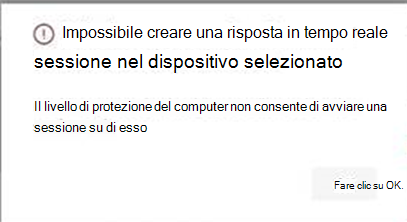

# <a name="investigate-entities-on-devices-using-live-response"></a>Analizzare le entità nei dispositivi che usano la risposta in tempo reale

[!INCLUDE [Microsoft 365 Defender rebranding](../../includes/microsoft-defender.md)]

**Si applica a:**
- [Microsoft Defender per endpoint](https://go.microsoft.com/fwlink/p/?linkid=2154037)
- [Microsoft 365 Defender](https://go.microsoft.com/fwlink/?linkid=2118804)


> Vuoi provare Defender per Endpoint? [Iscriversi per una versione di valutazione gratuita.](https://www.microsoft.com/microsoft-365/windows/microsoft-defender-atp?ocid=docs-wdatp-investigateip-abovefoldlink)

La risposta in tempo reale consente ai team delle operazioni di sicurezza di accedere istantaneamente a un dispositivo (noto anche come computer) utilizzando una connessione shell remota. In questo modo è possibile eseguire un lavoro di indagine approfondito e intraprendere azioni di risposta immediate per contenere prontamente le minacce identificate, in tempo reale. 

La risposta in tempo reale è progettata per migliorare le indagini consentendo al team delle operazioni di sicurezza di raccogliere dati forensi, eseguire script, inviare entità sospette per l'analisi, correggere le minacce e cercare in modo proattivo minacce emergenti.<br/><br/>

> [!VIDEO https://www.microsoft.com/videoplayer/embed/RE4qLUW]

Con la risposta in tempo reale, gli analisti possono eseguire tutte le attività seguenti:
- Esegui comandi di base e avanzati per eseguire attività di indagine su un dispositivo.
- Scaricare file come esempi di malware e risultati degli script di PowerShell.
- Scaricare i file in background (nuovo!).
- Upload uno script di PowerShell o un file eseguibile nella raccolta ed eseguirlo in un dispositivo a livello di tenant.
- Eseguire o annullare azioni di correzione.

## <a name="before-you-begin"></a>Prima di iniziare

Prima di poter avviare una sessione su un dispositivo, assicurati di soddisfare i requisiti seguenti:

- **Verificare che sia in esecuzione una versione supportata** di Windows . <br/>
I dispositivi devono eseguire una delle versioni seguenti di Windows

  - **Windows 10**
    - [Versione 1909](https://docs.microsoft.com/windows/whats-new/whats-new-windows-10-version-1909) o successiva  
    - [Versione 1903](https://docs.microsoft.com/windows/whats-new/whats-new-windows-10-version-1903) con [KB4515384](https://support.microsoft.com/en-us/help/4515384/windows-10-update-kb4515384)
    - [Versione 1809 (RS 5)](https://docs.microsoft.com/windows/whats-new/whats-new-windows-10-version-1809) [con KB4537818](https://support.microsoft.com/help/4537818/windows-10-update-kb4537818)
    - [Versione 1803 (RS 4)](https://docs.microsoft.com/windows/whats-new/whats-new-windows-10-version-1803) con [KB4537795](https://support.microsoft.com/help/4537795/windows-10-update-kb4537795)
    - [Versione 1709 (RS 3)](https://docs.microsoft.com/windows/whats-new/whats-new-windows-10-version-1709) con [KB4537816](https://support.microsoft.com/help/4537816/windows-10-update-kb4537816)
  
  - **Windows Server 2019 - Applicabile solo per l'anteprima pubblica**
    - Versione 1903 o (con [KB4515384](https://support.microsoft.com/en-us/help/4515384/windows-10-update-kb4515384)) più avanti 
    - Versione 1809 (con [KB4537818](https://support.microsoft.com/en-us/help/4537818/windows-10-update-kb4537818))

- **Abilita risposta in tempo reale dalla pagina delle impostazioni avanzate.**<br>
Dovrai abilitare la funzionalità di risposta in tempo reale nella [pagina Impostazioni funzionalità](advanced-features.md) avanzate.

    >[!NOTE]
    >Solo gli utenti con ruoli di amministratore globale o di sicurezza possono modificare queste impostazioni.

- **Abilitare la risposta in tempo reale per i server dalla pagina delle impostazioni avanzate** (scelta consigliata).<br>

    >[!NOTE]
    >Solo gli utenti con ruoli di amministratore globale o di sicurezza possono modificare queste impostazioni.
    
- Assicurati che al dispositivo sia assegnato un livello di **correzione dell'automazione.**<br>
Dovrai abilitare almeno il livello di correzione minimo per un determinato gruppo di dispositivi. In caso contrario, non sarà possibile stabilire una sessione di Risposta in tempo reale a un membro del gruppo.

    Verrà visualizzato l'errore seguente:

    

- **Abilitare l'esecuzione di script non firmati** in risposta attiva (facoltativo). <br>

    >[!WARNING]
    >Consentire l'uso di script non firmati può aumentare l'esposizione alle minacce.
 
  L'esecuzione di script non firmati non è consigliata perché può aumentare l'esposizione alle minacce. Se tuttavia è necessario utilizzarli, è necessario abilitare l'impostazione nella [pagina Impostazioni funzionalità](advanced-features.md) avanzate.
    
- **Assicurarsi di disporre delle autorizzazioni appropriate.**<br>
    Solo gli utenti di cui è stato eseguito il provisioning con le autorizzazioni appropriate possono avviare una sessione. Per ulteriori informazioni sulle assegnazioni di ruolo, vedere [Create and manage roles](user-roles.md). 

    > [!IMPORTANT]
    > L'opzione per caricare un file nella raccolta è disponibile solo per gli utenti con le autorizzazioni RBAC appropriate. Il pulsante è in grigio per gli utenti con solo autorizzazioni delegate.

    A seconda del ruolo che ti è stato concesso, puoi eseguire comandi di risposta in tempo reale di base o avanzati. Le autorizzazioni degli utenti sono controllate dal ruolo personalizzato RBAC. 

## <a name="live-response-dashboard-overview"></a>Panoramica del dashboard di risposta in tempo reale
Quando avvii una sessione di risposta in tempo reale su un dispositivo, viene aperto un dashboard. Il dashboard fornisce informazioni sulla sessione, ad esempio: 

- Who creata la sessione
- All'avvio della sessione
- Durata della sessione

Il dashboard consente inoltre di accedere a:
- Disconnetti sessione
- Upload file nella raccolta 
- Console dei comandi
- Log dei comandi


## <a name="initiate-a-live-response-session-on-a-device"></a>Avviare una sessione di risposta in tempo reale in un dispositivo 

1. Accedi a Microsoft Defender Security Center.

2. Passa alla pagina dell'elenco dei dispositivi e seleziona un dispositivo da analizzare. Viene visualizzata la pagina dei dispositivi.

3. Avviare la sessione di risposta in tempo reale selezionando **Avvia sessione di risposta in tempo reale.** Viene visualizzata una console dei comandi. Attendere che la sessione si connetta al dispositivo.

4. Usa i comandi predefiniti per eseguire attività di indagine. Per ulteriori informazioni, vedere [Comandi di risposta in tempo reale.](#live-response-commands)

5. Dopo aver completato l'indagine, selezionare **Disconnetti sessione** e **quindi** Conferma.

## <a name="live-response-commands"></a>Comandi di risposta in tempo reale

A seconda del ruolo che ti è stato concesso, puoi eseguire comandi di risposta in tempo reale di base o avanzati. Le autorizzazioni utente sono controllate dai ruoli personalizzati RBAC. Per ulteriori informazioni sulle assegnazioni di ruolo, vedere [Create and manage roles](user-roles.md). 


>[!NOTE]
>La risposta in tempo reale è una shell interattiva basata sul cloud, in quanto tale, l'esperienza di comando specifica può variare in base alla qualità della rete e al carico di sistema tra l'utente finale e il dispositivo di destinazione.

### <a name="basic-commands"></a>Comandi di base

I comandi seguenti sono disponibili per i ruoli utente a cui viene concessa la possibilità di eseguire comandi **di risposta** in tempo reale di base. Per ulteriori informazioni sulle assegnazioni di ruolo, vedere [Create and manage roles](user-roles.md). 

| Comando | Descrizione |
|---|---|--- |
|`cd` | Modifica la directory corrente. | 
|`cls` | Cancella la schermata della console.  |
|`connect` | Avvia una sessione di risposta in tempo reale al dispositivo. |
|`connections` | Mostra tutte le connessioni attive. |
|`dir` | Visualizza un elenco di file e sottodirectory in una directory. |
|`drivers` |  Mostra tutti i driver installati nel dispositivo. |
|`fg <command ID>` | Posiziona il processo specificato in primo piano in primo piano, rendendolo il processo corrente. <br> NOTA: fg accetta un "ID comando" disponibile dai processi, non un PID |
|`fileinfo` | Ottenere informazioni su un file. |
|`findfile` | Individua i file con un nome specificato nel dispositivo. |
|`getfile <file_path>` | Scarica un file. |
|`help` | Fornisce informazioni della Guida per i comandi di risposta in tempo reale. |
|`jobs` | Mostra i processi attualmente in esecuzione, il relativo ID e stato. |
|`persistence` | Mostra tutti i metodi di persistenza noti nel dispositivo. |
|`processes` | Mostra tutti i processi in esecuzione nel dispositivo. |
|`registry` | Mostra i valori del Registro di sistema. |
|`scheduledtasks` | Mostra tutte le attività pianificate nel dispositivo. |
|`services` | Mostra tutti i servizi nel dispositivo. |
|`trace` | Imposta la modalità di registrazione del terminale per il debug. |

### <a name="advanced-commands"></a>Comandi avanzati
I comandi seguenti sono disponibili per i ruoli utente a cui viene concessa la possibilità di eseguire **comandi di** risposta in tempo reale avanzati. Per ulteriori informazioni sulle assegnazioni di ruolo, vedere [Create and manage roles](user-roles.md). 

| Comando | Descrizione |
|---|---|
| `analyze` | Analizza l'entità con vari motori di incriminazione per raggiungere un verdetto. |
| `run` | Esegue uno script di PowerShell dalla raccolta nel dispositivo. |
| `library` | Elenca i file caricati nella raccolta di risposte in tempo reale. |
| `putfile` | Inserisce un file dalla raccolta al dispositivo. I file vengono salvati in una cartella di lavoro e vengono eliminati al riavvio del dispositivo per impostazione predefinita. |
| `remediate` | Correzione di un'entità nel dispositivo. L'azione di correzione varia a seconda del tipo di entità:<br>- File: delete<br>- Processo: arrestare, eliminare il file di immagine<br>- Servizio: arrestare, eliminare il file di immagine<br>- Voce del Registro di sistema: delete<br>- Attività pianificata: rimuovere<br>- Elemento cartella di avvio: elimina file <br> NOTA: questo comando ha un comando prerequisito. È possibile utilizzare il `-auto` comando insieme a per eseguire `remediate` automaticamente il comando prerequisito. 
|`undo` | Ripristina un'entità che è stata corretti. |


## <a name="use-live-response-commands"></a>Usare i comandi di risposta in tempo reale

I comandi che è possibile utilizzare nella console seguono principi simili [a quelli Windows Comandi](https://docs.microsoft.com/windows-server/administration/windows-commands/windows-commands#BKMK_c).

I comandi avanzati offrono un set più affidabile di azioni che consentono di eseguire azioni più efficaci, ad esempio scaricare e caricare un file, eseguire script nel dispositivo ed eseguire azioni di correzione su un'entità.

### <a name="get-a-file-from-the-device"></a>Ottenere un file dal dispositivo

Per gli scenari in cui vuoi ottenere un file da un dispositivo che stai analizzando, puoi usare il `getfile` comando. In questo modo è possibile salvare il file dal dispositivo per ulteriori indagini.

>[!NOTE]
>Si applicano i limiti di dimensione dei file seguenti:
>- `getfile` limite: 3 GB
>- `fileinfo` limite: 10 GB
>- `library` limite: 250 MB

### <a name="download-a-file-in-the-background"></a>Scaricare un file in background

Per consentire al team delle operazioni di sicurezza di continuare a analizzare un dispositivo a impatto, i file possono ora essere scaricati in background.

- Per scaricare un file in background, nella console dei comandi di risposta in tempo reale digitare `download <file_path> &` .
- Se si è in attesa del download di un file, è possibile spostarlo in background utilizzando Ctrl + Z.
- Per portare in primo piano il download di un file, nella console dei comandi di risposta in tempo reale digitare `fg <command_id>` .

Di seguito vengono descritti alcuni esempi:


|Comando  |Funzione  |
|---------|---------|
|`getfile "C:\windows\some_file.exe" &`     |Avvia il download di un file *denominatosome_file.exe* in background.         |
|`fg 1234`     |Restituisce un download con ID comando *1234* in primo piano.         |


### <a name="put-a-file-in-the-library"></a>Inserire un file nella raccolta

La risposta in tempo reale include una raccolta in cui è possibile inserire i file. La raccolta archivia i file,ad esempio gli script, che possono essere eseguiti in una sessione di risposta in tempo reale a livello di tenant.

La risposta in tempo reale consente l'esecuzione degli script di PowerShell, tuttavia è necessario innanzitutto inserire i file nella raccolta prima di poterli eseguire. 

Puoi avere una raccolta di script di PowerShell che possono essere eseguiti nei dispositivi con cui avvii sessioni di risposta in tempo reale. 

#### <a name="to-upload-a-file-in-the-library"></a>Per caricare un file nella raccolta

1. Fare **clic Upload file nella raccolta.** 

2. Fare **clic su** Sfoglia e selezionare il file.

3. Fornire una breve descrizione.

4. Specificare se si desidera sovrascrivere un file con lo stesso nome.

5. Se si desidera, sapere quali parametri sono necessari per lo script, selezionare la casella di controllo Parametri script. Nel campo di testo immettere un esempio e una descrizione.

6. Fare clic **su Conferma**. 

7. (Facoltativo) Per verificare che il file sia stato caricato nella raccolta, eseguire il `library` comando.


### <a name="cancel-a-command"></a>Annullare un comando
In qualsiasi momento durante una sessione, è possibile annullare un comando premendo CTRL + C.  

>[!WARNING]
>L'utilizzo di questo collegamento non arresterà il comando sul lato agente. Il comando verrà annullato solo nel portale. Pertanto, le operazioni di modifica come "correzione" potrebbero continuare, mentre il comando viene annullato. 

## <a name="run-a-powershell-script"></a>Eseguire uno script di PowerShell 

Prima di poter eseguire uno script di PowerShell, è necessario caricarlo nella raccolta. 

Dopo aver caricato lo script nella raccolta, utilizzare il `run` comando per eseguire lo script.

Se si prevede di utilizzare uno script non firmato nella sessione, sarà necessario abilitare l'impostazione nella [pagina Impostazioni funzionalità](advanced-features.md) avanzate.

>[!WARNING]
>Consentire l'uso di script non firmati può aumentare l'esposizione alle minacce.

## <a name="apply-command-parameters"></a>Applicare parametri di comando

- Visualizzare la Guida della console per informazioni sui parametri del comando. Per informazioni su un singolo comando, eseguire:
 
    `help <command name>`

- Quando si applicano parametri ai comandi, tenere presente che i parametri vengono gestiti in base a un ordine fisso:
 
    `<command name> param1 param2` 

- Quando si specificano parametri al di fuori dell'ordine fisso, specificare il nome del parametro con un trattino prima di specificare il valore:
 
    `<command name> -param2_name param2`

- Quando si utilizzano comandi che dispongono di comandi prerequisiti, è possibile utilizzare i flag:

    `<command name> -type file -id <file path> - auto` o `remediate file <file path> - auto` .

## <a name="supported-output-types"></a>Tipi di output supportati

La risposta in tempo reale supporta i tipi di output in formato JSON e tabella. Per ogni comando esiste un comportamento di output predefinito. Puoi modificare l'output nel formato di output preferito usando i comandi seguenti:

- `-output json`
- `-output table`

>[!NOTE]
>Un numero inferiore di campi viene visualizzato in formato tabella a causa dello spazio limitato. Per visualizzare altri dettagli nell'output, puoi usare il comando di output JSON in modo da visualizzare altri dettagli.

## <a name="supported-output-pipes"></a>Pipe di output supportate

La risposta in tempo reale supporta l'output piping su CLI e file. CLI è il comportamento di output predefinito. È possibile pipeare l'output in un file utilizzando il comando seguente: [comando] > [nomefile].txt.  

Esempio:

```console
processes > output.txt
```

## <a name="view-the-command-log"></a>Visualizzare il log dei comandi

Seleziona la **scheda Registro** comandi per visualizzare i comandi usati nel dispositivo durante una sessione. Ogni comando viene monitorato con dettagli completi, ad esempio:
- ID
- Riga di comando
- Durata
- Barra laterale di stato e input o output

## <a name="limitations"></a>Limitazioni

- Le sessioni di risposta in tempo reale sono limitate a 25 sessioni di risposta in tempo reale alla volta.
- Il valore di timeout inattiva della sessione di risposta in tempo reale è 30 minuti. 
- Un utente può avviare fino a 10 sessioni simultanee.
- Un dispositivo può essere in una sola sessione alla volta.
- Si applicano i limiti di dimensione dei file seguenti:
   - `getfile` limite: 3 GB
   - `fileinfo` limite: 10 GB
   - `library` limite: 250 MB

## <a name="related-article"></a>Articolo correlato
- [Esempi di comandi di Live response](live-response-command-examples.md)
