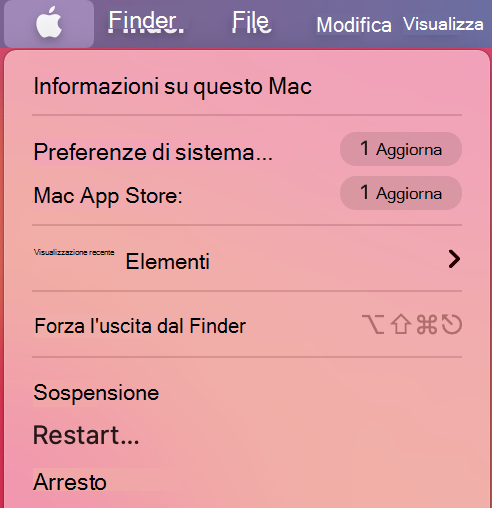
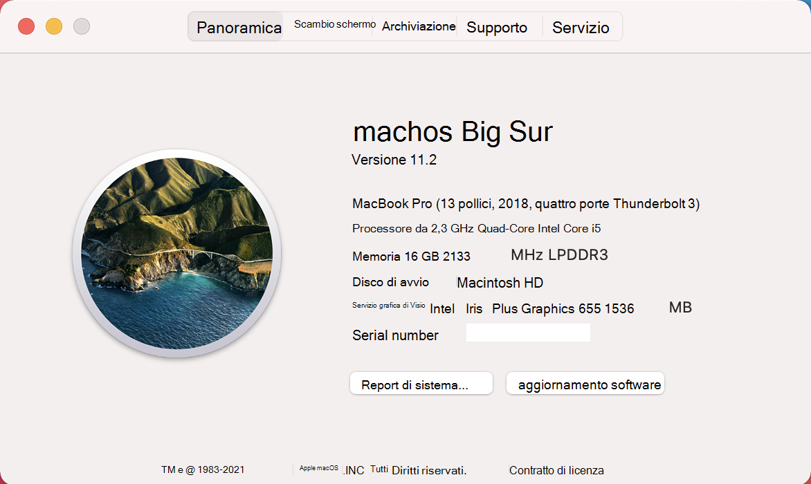

# <a name="device-control-for-macos"></a><span data-ttu-id="41db2-104">Controllo dispositivo per macOS</span><span class="sxs-lookup"><span data-stu-id="41db2-104">Device control for macOS</span></span>

[!INCLUDE [Microsoft 365 Defender rebranding](../../includes/microsoft-defender.md)]

<span data-ttu-id="41db2-105">**Si applica a:**</span><span class="sxs-lookup"><span data-stu-id="41db2-105">**Applies to:**</span></span>
- [<span data-ttu-id="41db2-106">Microsoft Defender per endpoint</span><span class="sxs-lookup"><span data-stu-id="41db2-106">Microsoft Defender for Endpoint</span></span>](https://go.microsoft.com/fwlink/p/?linkid=2154037)
- [<span data-ttu-id="41db2-107">Microsoft 365 Defender</span><span class="sxs-lookup"><span data-stu-id="41db2-107">Microsoft 365 Defender</span></span>](https://go.microsoft.com/fwlink/?linkid=2118804)

> <span data-ttu-id="41db2-108">Vuoi provare Microsoft Defender per Endpoint?</span><span class="sxs-lookup"><span data-stu-id="41db2-108">Want to experience Microsoft Defender for Endpoint?</span></span> [<span data-ttu-id="41db2-109">Iscriversi per una versione di valutazione gratuita.</span><span class="sxs-lookup"><span data-stu-id="41db2-109">Sign up for a free trial.</span></span>](https://www.microsoft.com/microsoft-365/windows/microsoft-defender-atp?ocid=docs-wdatp-exposedapis-abovefoldlink)

[!include[Prerelease information](../../includes/prerelease.md)]

## <a name="requirements"></a><span data-ttu-id="41db2-110">Requisiti</span><span class="sxs-lookup"><span data-stu-id="41db2-110">Requirements</span></span>

<span data-ttu-id="41db2-111">Il controllo del dispositivo per macOS presenta i prerequisiti seguenti:</span><span class="sxs-lookup"><span data-stu-id="41db2-111">Device control for macOS has the following prerequisites:</span></span>

>[!div class="checklist"]
> - <span data-ttu-id="41db2-112">Diritto di Microsoft Defender for Endpoint (può essere di prova)</span><span class="sxs-lookup"><span data-stu-id="41db2-112">Microsoft Defender for Endpoint entitlement (can be trial)</span></span>
> - <span data-ttu-id="41db2-113">Versione minima del sistema operativo: macOS 10.15.4 o versione successiva</span><span class="sxs-lookup"><span data-stu-id="41db2-113">Minimum OS version: macOS 10.15.4 or higher</span></span>
> - <span data-ttu-id="41db2-114">Versione minima del prodotto: 101.24.59</span><span class="sxs-lookup"><span data-stu-id="41db2-114">Minimum product version: 101.24.59</span></span>
> - <span data-ttu-id="41db2-115">Il dispositivo deve essere in esecuzione con estensioni di sistema (questa è l'impostazione predefinita in macOS 11 Big Sur).</span><span class="sxs-lookup"><span data-stu-id="41db2-115">Your device must be running with system extensions (this is the default on macOS 11 Big Sur).</span></span> 
> 
>   <span data-ttu-id="41db2-116">Puoi verificare se il dispositivo è in esecuzione su estensioni di sistema eseguendo il comando seguente e verifica che sia in `endpoint_security_extension` stampa nella console:</span><span class="sxs-lookup"><span data-stu-id="41db2-116">You can check if your device is running on system extensions by running the following command and verify that it is printing `endpoint_security_extension` to the console:</span></span> 
> 
>   ```bash
>   mdatp health --field real_time_protection_subsystem 
>   ```
> - <span data-ttu-id="41db2-117">Il dispositivo deve essere nel `Beta` canale di aggiornamento Microsoft AutoUpdate (denominato in `InsiderFast` precedenza).</span><span class="sxs-lookup"><span data-stu-id="41db2-117">Your device must be in `Beta` (previously called `InsiderFast`) Microsoft AutoUpdate update channel.</span></span> <span data-ttu-id="41db2-118">Per altre informazioni, vedi [Distribuire gli aggiornamenti per Microsoft Defender per Endpoint su Mac.](mac-updates.md)</span><span class="sxs-lookup"><span data-stu-id="41db2-118">For more information, see [Deploy updates for Microsoft Defender for Endpoint on Mac](mac-updates.md).</span></span>
> 
>   <span data-ttu-id="41db2-119">Puoi controllare il canale di aggiornamento usando il comando seguente:</span><span class="sxs-lookup"><span data-stu-id="41db2-119">You can check the update channel using the following command:</span></span> 
> 
>    ```bash
>    mdatp health --field release_ring 
>    ```
>
>    <span data-ttu-id="41db2-120">Se il comando precedente non stampa o `Beta` , eseguire il comando seguente dal `InsiderFast` terminale.</span><span class="sxs-lookup"><span data-stu-id="41db2-120">If the above command does not print either `Beta` or `InsiderFast`, execute the following command from the Terminal.</span></span> <span data-ttu-id="41db2-121">L'aggiornamento del canale ha effetto al successivo avvio del prodotto (quando viene installato il successivo aggiornamento del prodotto o quando il dispositivo viene riavviato).</span><span class="sxs-lookup"><span data-stu-id="41db2-121">The channel update takes effect next time the product starts (when the next product update is installed or when the device is rebooted).</span></span> 
> 
>    ```bash
>    defaults write com.microsoft.autoupdate2 ChannelName -string Beta
>    ```
>
>    <span data-ttu-id="41db2-122">In alternativa, se si è in un ambiente gestito (JAMF o Intune), è possibile configurare il canale di aggiornamento in remoto.</span><span class="sxs-lookup"><span data-stu-id="41db2-122">Alternatively, if you are in a managed environment (JAMF or Intune), you can configure the update channel remotely.</span></span> <span data-ttu-id="41db2-123">Per altre informazioni, vedi [Distribuire gli aggiornamenti per Microsoft Defender per Endpoint su Mac.](mac-updates.md)</span><span class="sxs-lookup"><span data-stu-id="41db2-123">For more information, see [Deploy updates for Microsoft Defender for Endpoint on Mac](mac-updates.md).</span></span> 

## <a name="device-control-policy"></a><span data-ttu-id="41db2-124">Criteri di controllo dei dispositivi</span><span class="sxs-lookup"><span data-stu-id="41db2-124">Device control policy</span></span>

<span data-ttu-id="41db2-125">Per configurare il controllo dei dispositivi per macOS, devi creare un criterio che descriva le restrizioni che vuoi applicare all'interno dell'organizzazione.</span><span class="sxs-lookup"><span data-stu-id="41db2-125">To configure device control for macOS, you must create a policy that describes the restrictions you want to put in place within your organization.</span></span>

<span data-ttu-id="41db2-126">Il criterio di controllo dei dispositivi è incluso nel profilo di configurazione usato per configurare tutte le altre impostazioni del prodotto.</span><span class="sxs-lookup"><span data-stu-id="41db2-126">The device control policy is included in the configuration profile used to configure all other product settings.</span></span> <span data-ttu-id="41db2-127">Per ulteriori informazioni, vedere [Struttura del profilo di configurazione.](mac-preferences.md#configuration-profile-structure)</span><span class="sxs-lookup"><span data-stu-id="41db2-127">For more information, see [Configuration profile structure](mac-preferences.md#configuration-profile-structure).</span></span>

<span data-ttu-id="41db2-128">All'interno del profilo di configurazione, i criteri di controllo dei dispositivi sono definiti nella sezione seguente:</span><span class="sxs-lookup"><span data-stu-id="41db2-128">Within the configuration profile, the device control policy is defined in the following section:</span></span>

|<span data-ttu-id="41db2-129">Sezione</span><span class="sxs-lookup"><span data-stu-id="41db2-129">Section</span></span>|<span data-ttu-id="41db2-130">Valore</span><span class="sxs-lookup"><span data-stu-id="41db2-130">Value</span></span>|
|:---|:---|
| <span data-ttu-id="41db2-131">**Dominio**</span><span class="sxs-lookup"><span data-stu-id="41db2-131">**Domain**</span></span> | `com.microsoft.wdav` |
| <span data-ttu-id="41db2-132">**Chiave**</span><span class="sxs-lookup"><span data-stu-id="41db2-132">**Key**</span></span> | <span data-ttu-id="41db2-133">deviceControl</span><span class="sxs-lookup"><span data-stu-id="41db2-133">deviceControl</span></span> |
| <span data-ttu-id="41db2-134">**Data type**</span><span class="sxs-lookup"><span data-stu-id="41db2-134">**Data type**</span></span> | <span data-ttu-id="41db2-135">Dizionario (preferenza annidata)</span><span class="sxs-lookup"><span data-stu-id="41db2-135">Dictionary (nested preference)</span></span> |
| <span data-ttu-id="41db2-136">**Comments**</span><span class="sxs-lookup"><span data-stu-id="41db2-136">**Comments**</span></span> | <span data-ttu-id="41db2-137">Per una descrizione del contenuto del dizionario, vedi le sezioni seguenti.</span><span class="sxs-lookup"><span data-stu-id="41db2-137">See the following sections for a description of the dictionary contents.</span></span> |

<span data-ttu-id="41db2-138">I criteri di controllo del dispositivo possono essere usati per:</span><span class="sxs-lookup"><span data-stu-id="41db2-138">The device control policy can be used to:</span></span>

- [<span data-ttu-id="41db2-139">Personalizzare la destinazione dell'URL per le notifiche generate dal controllo del dispositivo</span><span class="sxs-lookup"><span data-stu-id="41db2-139">Customize the URL target for notifications raised by device control</span></span>](#customize-url-target-for-notifications-raised-by-device-control)
- [<span data-ttu-id="41db2-140">Consentire o bloccare i dispositivi rimovibili</span><span class="sxs-lookup"><span data-stu-id="41db2-140">Allow or block removable devices</span></span>](#allow-or-block-removable-devices)

### <a name="customize-url-target-for-notifications-raised-by-device-control"></a><span data-ttu-id="41db2-141">Personalizzare la destinazione dell'URL per le notifiche generate dal controllo del dispositivo</span><span class="sxs-lookup"><span data-stu-id="41db2-141">Customize URL target for notifications raised by device control</span></span>

<span data-ttu-id="41db2-142">Quando il criterio di controllo del dispositivo che hai applicato a un dispositivo (ad esempio, l'accesso a un dispositivo multimediale rimovibile è limitato), viene visualizzata una notifica per l'utente.</span><span class="sxs-lookup"><span data-stu-id="41db2-142">When the device control policy that you have put in place is enforced on a device (for example, access to a removable media device is restricted), a notification is displayed to the user.</span></span>


<span data-ttu-id="41db2-144">Quando gli utenti finali selezionano questa notifica, viene aperta una pagina Web nel browser predefinito.</span><span class="sxs-lookup"><span data-stu-id="41db2-144">When end users click this notification, a web page is opened in the default browser.</span></span> <span data-ttu-id="41db2-145">È possibile configurare l'URL aperto quando gli utenti finali selezionano la notifica.</span><span class="sxs-lookup"><span data-stu-id="41db2-145">You can configure the URL that is opened when end users click the notification.</span></span>

|<span data-ttu-id="41db2-146">Sezione</span><span class="sxs-lookup"><span data-stu-id="41db2-146">Section</span></span>|<span data-ttu-id="41db2-147">Valore</span><span class="sxs-lookup"><span data-stu-id="41db2-147">Value</span></span>|
|:---|:---|
| <span data-ttu-id="41db2-148">**Dominio**</span><span class="sxs-lookup"><span data-stu-id="41db2-148">**Domain**</span></span> | `com.microsoft.wdav` |
| <span data-ttu-id="41db2-149">**Chiave**</span><span class="sxs-lookup"><span data-stu-id="41db2-149">**Key**</span></span> | <span data-ttu-id="41db2-150">navigationTarget</span><span class="sxs-lookup"><span data-stu-id="41db2-150">navigationTarget</span></span> |
| <span data-ttu-id="41db2-151">**Data type**</span><span class="sxs-lookup"><span data-stu-id="41db2-151">**Data type**</span></span> | <span data-ttu-id="41db2-152">Stringa</span><span class="sxs-lookup"><span data-stu-id="41db2-152">String</span></span> |
| <span data-ttu-id="41db2-153">**Comments**</span><span class="sxs-lookup"><span data-stu-id="41db2-153">**Comments**</span></span> | <span data-ttu-id="41db2-154">Se non è definito, il prodotto utilizza un URL predefinito che punta a una pagina generica che spiega l'azione eseguita dal prodotto.</span><span class="sxs-lookup"><span data-stu-id="41db2-154">If not defined, the product uses a default URL pointing to a generic page explaining the action taken by the product.</span></span> |

### <a name="allow-or-block-removable-devices"></a><span data-ttu-id="41db2-155">Consentire o bloccare i dispositivi rimovibili</span><span class="sxs-lookup"><span data-stu-id="41db2-155">Allow or block removable devices</span></span>

<span data-ttu-id="41db2-156">La sezione supporti rimovibili del criterio di controllo del dispositivo viene utilizzata per limitare l'accesso ai supporti rimovibili.</span><span class="sxs-lookup"><span data-stu-id="41db2-156">The removable media section of the device control policy is used to restrict access to removable media.</span></span> 

> [!NOTE]
> <span data-ttu-id="41db2-157">I seguenti tipi di supporti rimovibili sono attualmente supportati e possono essere inclusi nel criterio: dispositivi di archiviazione USB.</span><span class="sxs-lookup"><span data-stu-id="41db2-157">The following types of removable media are currently supported and can be included in the policy: USB storage devices.</span></span>

|<span data-ttu-id="41db2-158">Sezione</span><span class="sxs-lookup"><span data-stu-id="41db2-158">Section</span></span>|<span data-ttu-id="41db2-159">Valore</span><span class="sxs-lookup"><span data-stu-id="41db2-159">Value</span></span>|
|:---|:---|
| <span data-ttu-id="41db2-160">**Dominio**</span><span class="sxs-lookup"><span data-stu-id="41db2-160">**Domain**</span></span> | `com.microsoft.wdav` |
| <span data-ttu-id="41db2-161">**Chiave**</span><span class="sxs-lookup"><span data-stu-id="41db2-161">**Key**</span></span> | <span data-ttu-id="41db2-162">removableMediaPolicy</span><span class="sxs-lookup"><span data-stu-id="41db2-162">removableMediaPolicy</span></span> |
| <span data-ttu-id="41db2-163">**Data type**</span><span class="sxs-lookup"><span data-stu-id="41db2-163">**Data type**</span></span> | <span data-ttu-id="41db2-164">Dizionario (preferenza annidata)</span><span class="sxs-lookup"><span data-stu-id="41db2-164">Dictionary (nested preference)</span></span> |
| <span data-ttu-id="41db2-165">**Comments**</span><span class="sxs-lookup"><span data-stu-id="41db2-165">**Comments**</span></span> | <span data-ttu-id="41db2-166">Per una descrizione del contenuto del dizionario, vedi le sezioni seguenti.</span><span class="sxs-lookup"><span data-stu-id="41db2-166">See the following sections for a description of the dictionary contents.</span></span> |

<span data-ttu-id="41db2-167">Questa sezione del criterio è gerarchica, consentendo la massima flessibilità e coprendo un'ampia gamma di casi d'uso.</span><span class="sxs-lookup"><span data-stu-id="41db2-167">This section of the policy is hierarchical, allowing for maximum flexibility and covering a wide range of use cases.</span></span> <span data-ttu-id="41db2-168">Al livello principale sono i fornitori, identificati da un ID fornitore.</span><span class="sxs-lookup"><span data-stu-id="41db2-168">At the top level are vendors, identified by a vendor ID.</span></span> <span data-ttu-id="41db2-169">Per ogni fornitore sono presenti prodotti identificati da un ID prodotto.</span><span class="sxs-lookup"><span data-stu-id="41db2-169">For each vendor, there are products, identified by a product ID.</span></span> <span data-ttu-id="41db2-170">Infine, per ogni prodotto sono presenti numeri di serie che denotano dispositivi specifici.</span><span class="sxs-lookup"><span data-stu-id="41db2-170">Finally, for each product there are serial numbers denoting specific devices.</span></span>

```
|-- policy top level 
    |-- vendor 1 
        |-- product 1 
            |-- serial number 1 
            ...
            |-- serial number N 
        ...
        |-- product N 
    ...
    |-- vendor N
```

<span data-ttu-id="41db2-171">Per informazioni su come trovare gli identificatori di dispositivo, vedi [Cercare gli identificatori di dispositivo.](#look-up-device-identifiers)</span><span class="sxs-lookup"><span data-stu-id="41db2-171">For information on how to find the device identifiers, see [Look up device identifiers](#look-up-device-identifiers).</span></span>

<span data-ttu-id="41db2-172">Il criterio viene valutato dalla voce più specifica a quella più generale.</span><span class="sxs-lookup"><span data-stu-id="41db2-172">The policy is evaluated from the most specific entry to the most general one.</span></span> <span data-ttu-id="41db2-173">Ciò significa che, quando un dispositivo è collegato, il prodotto tenta di trovare la corrispondenza più specifica nel criterio per ogni dispositivo multimediale rimovibile e di applicare le autorizzazioni a tale livello.</span><span class="sxs-lookup"><span data-stu-id="41db2-173">Meaning, when a device is plugged in, the product tries to find the most specific match in the policy for each removable media device and apply the permissions at that level.</span></span> <span data-ttu-id="41db2-174">Se non è presente alcuna corrispondenza, viene applicata la corrispondenza migliore successiva, fino all'autorizzazione specificata al livello superiore, che è l'impostazione predefinita quando un dispositivo non corrisponde ad alcuna altra voce nel criterio.</span><span class="sxs-lookup"><span data-stu-id="41db2-174">If there is no match, then the next best match is applied, all the way to the permission specified at the top level, which is the default when a device does not match any other entry in the policy.</span></span>

#### <a name="policy-enforcement-level"></a><span data-ttu-id="41db2-175">Livello di imposizione dei criteri</span><span class="sxs-lookup"><span data-stu-id="41db2-175">Policy enforcement level</span></span>

<span data-ttu-id="41db2-176">Nella sezione Supporti rimovibili è disponibile un'opzione per impostare il livello di imposizione, che può assumere uno dei valori seguenti:</span><span class="sxs-lookup"><span data-stu-id="41db2-176">Under the removable media section, there is an option to set the enforcement level, which can take one of the following values:</span></span>

- <span data-ttu-id="41db2-177">`audit` - Con questo livello di imposizione, se l'accesso a un dispositivo è limitato, viene visualizzata una notifica all'utente, ma il dispositivo può comunque essere usato.</span><span class="sxs-lookup"><span data-stu-id="41db2-177">`audit` - Under this enforcement level, if access to a device is restricted, a notification is displayed to the user, however the device can still be used.</span></span> <span data-ttu-id="41db2-178">Questo livello di imposizione può essere utile per valutare l'efficacia di un criterio.</span><span class="sxs-lookup"><span data-stu-id="41db2-178">This enforcement level can be useful to evaluate the effectiveness of a policy.</span></span>
- <span data-ttu-id="41db2-179">`block` - In questo livello di imposizione, le operazioni che l'utente può eseguire sul dispositivo sono limitate a quanto definito nel criterio.</span><span class="sxs-lookup"><span data-stu-id="41db2-179">`block` - Under this enforcement level, the operations that the user can perform on the device are limited to what is defined in the policy.</span></span> <span data-ttu-id="41db2-180">Inoltre, viene generata una notifica all'utente.</span><span class="sxs-lookup"><span data-stu-id="41db2-180">Furthermore, a notification is raised to the user.</span></span> 

|<span data-ttu-id="41db2-181">Sezione</span><span class="sxs-lookup"><span data-stu-id="41db2-181">Section</span></span>|<span data-ttu-id="41db2-182">Valore</span><span class="sxs-lookup"><span data-stu-id="41db2-182">Value</span></span>|
|:---|:---|
| <span data-ttu-id="41db2-183">**Dominio**</span><span class="sxs-lookup"><span data-stu-id="41db2-183">**Domain**</span></span> | `com.microsoft.wdav` |
| <span data-ttu-id="41db2-184">**Chiave**</span><span class="sxs-lookup"><span data-stu-id="41db2-184">**Key**</span></span> | <span data-ttu-id="41db2-185">enforcementLevel</span><span class="sxs-lookup"><span data-stu-id="41db2-185">enforcementLevel</span></span> |
| <span data-ttu-id="41db2-186">**Data type**</span><span class="sxs-lookup"><span data-stu-id="41db2-186">**Data type**</span></span> | <span data-ttu-id="41db2-187">Stringa</span><span class="sxs-lookup"><span data-stu-id="41db2-187">String</span></span> |
| <span data-ttu-id="41db2-188">**Valori possibili**</span><span class="sxs-lookup"><span data-stu-id="41db2-188">**Possible values**</span></span> | <span data-ttu-id="41db2-189">audit (impostazione predefinita)</span><span class="sxs-lookup"><span data-stu-id="41db2-189">audit (default)</span></span> <br/> <span data-ttu-id="41db2-190">blocco</span><span class="sxs-lookup"><span data-stu-id="41db2-190">block</span></span> |

#### <a name="default-permission-level"></a><span data-ttu-id="41db2-191">Livello di autorizzazione predefinito</span><span class="sxs-lookup"><span data-stu-id="41db2-191">Default permission level</span></span>

<span data-ttu-id="41db2-192">Al livello superiore della sezione supporti rimovibili, è possibile configurare il livello di autorizzazione predefinito per i dispositivi che non corrispondono ad altri elementi del criterio.</span><span class="sxs-lookup"><span data-stu-id="41db2-192">At the top level of the removable media section, you can configure the default permission level for devices that do not match anything else in the policy.</span></span>

<span data-ttu-id="41db2-193">Questa impostazione può essere impostata su:</span><span class="sxs-lookup"><span data-stu-id="41db2-193">This setting can be set to:</span></span>

- <span data-ttu-id="41db2-194">`none` - Nessuna operazione può essere eseguita sul dispositivo</span><span class="sxs-lookup"><span data-stu-id="41db2-194">`none` - No operations can be performed on the device</span></span>
- <span data-ttu-id="41db2-195">Combinazione dei valori seguenti:</span><span class="sxs-lookup"><span data-stu-id="41db2-195">A combination of the following values:</span></span>
    - <span data-ttu-id="41db2-196">`read` - Le operazioni di lettura sono consentite nel dispositivo</span><span class="sxs-lookup"><span data-stu-id="41db2-196">`read` - Read operations are permitted on the device</span></span>
    - <span data-ttu-id="41db2-197">`write` - Le operazioni di scrittura sono consentite nel dispositivo</span><span class="sxs-lookup"><span data-stu-id="41db2-197">`write` - Write operations are permitted on the device</span></span>
    - <span data-ttu-id="41db2-198">`execute` - Le operazioni di esecuzione sono consentite nel dispositivo</span><span class="sxs-lookup"><span data-stu-id="41db2-198">`execute` - Execute operations are permitted on the device</span></span>

> [!NOTE]
> <span data-ttu-id="41db2-199">Se `none` è presente nel livello di autorizzazione, qualsiasi altra autorizzazione ( , o ) verrà `read` `write` `execute` ignorata.</span><span class="sxs-lookup"><span data-stu-id="41db2-199">If `none` is present in the permission level, any other permissions (`read`, `write`, or `execute`) will be ignored.</span></span>

> [!NOTE]
> <span data-ttu-id="41db2-200">`execute`L'autorizzazione si riferisce solo all'esecuzione di file binari Mach-O.</span><span class="sxs-lookup"><span data-stu-id="41db2-200">The `execute` permission only refers to execution of Mach-O binaries.</span></span> <span data-ttu-id="41db2-201">Non include l'esecuzione di script o altri tipi di payload.</span><span class="sxs-lookup"><span data-stu-id="41db2-201">It does not include execution of scripts or other types of payloads.</span></span>

|<span data-ttu-id="41db2-202">Sezione</span><span class="sxs-lookup"><span data-stu-id="41db2-202">Section</span></span>|<span data-ttu-id="41db2-203">Valore</span><span class="sxs-lookup"><span data-stu-id="41db2-203">Value</span></span>|
|:---|:---|
| <span data-ttu-id="41db2-204">**Dominio**</span><span class="sxs-lookup"><span data-stu-id="41db2-204">**Domain**</span></span> | `com.microsoft.wdav` |
| <span data-ttu-id="41db2-205">**Chiave**</span><span class="sxs-lookup"><span data-stu-id="41db2-205">**Key**</span></span> | <span data-ttu-id="41db2-206">autorizzazione</span><span class="sxs-lookup"><span data-stu-id="41db2-206">permission</span></span> |
| <span data-ttu-id="41db2-207">**Data type**</span><span class="sxs-lookup"><span data-stu-id="41db2-207">**Data type**</span></span> | <span data-ttu-id="41db2-208">Matrice di stringhe</span><span class="sxs-lookup"><span data-stu-id="41db2-208">Array of strings</span></span> |
| <span data-ttu-id="41db2-209">**Valori possibili**</span><span class="sxs-lookup"><span data-stu-id="41db2-209">**Possible values**</span></span> | <span data-ttu-id="41db2-210">nessuno</span><span class="sxs-lookup"><span data-stu-id="41db2-210">none</span></span> <br/> <span data-ttu-id="41db2-211">lettura</span><span class="sxs-lookup"><span data-stu-id="41db2-211">read</span></span> <br/> <span data-ttu-id="41db2-212">scrittura</span><span class="sxs-lookup"><span data-stu-id="41db2-212">write</span></span> <br/> <span data-ttu-id="41db2-213">execute</span><span class="sxs-lookup"><span data-stu-id="41db2-213">execute</span></span> |

#### <a name="restrict-removable-media-by-vendor-product-and-serial-number"></a><span data-ttu-id="41db2-214">Limitare i supporti rimovibili in base al fornitore, al prodotto e al numero di serie</span><span class="sxs-lookup"><span data-stu-id="41db2-214">Restrict removable media by vendor, product, and serial number</span></span>

<span data-ttu-id="41db2-215">Come descritto in [Consentire o bloccare](#allow-or-block-removable-devices)i dispositivi rimovibili, i supporti rimovibili come i dispositivi USB possono essere identificati dall'ID fornitore, dall'ID prodotto e dal numero di serie.</span><span class="sxs-lookup"><span data-stu-id="41db2-215">As described in [Allow or block removable devices](#allow-or-block-removable-devices), removable media such as USB devices can be identified by the vendor ID, product ID, and serial number.</span></span>

<span data-ttu-id="41db2-216">Al livello superiore del criterio di supporto rimovibile, è possibile definire restrizioni più granulari a livello di fornitore.</span><span class="sxs-lookup"><span data-stu-id="41db2-216">At the top level of the removable media policy, you can optionally define more granular restrictions at the vendor level.</span></span> 

<span data-ttu-id="41db2-217">Il dizionario contiene una o più voci, con ogni `vendors` voce identificata dall'ID fornitore.</span><span class="sxs-lookup"><span data-stu-id="41db2-217">The `vendors` dictionary contains one or more entries, with each entry being identified by the vendor ID.</span></span>

|<span data-ttu-id="41db2-218">Sezione</span><span class="sxs-lookup"><span data-stu-id="41db2-218">Section</span></span>|<span data-ttu-id="41db2-219">Valore</span><span class="sxs-lookup"><span data-stu-id="41db2-219">Value</span></span>|
|:---|:---|
| <span data-ttu-id="41db2-220">**Dominio**</span><span class="sxs-lookup"><span data-stu-id="41db2-220">**Domain**</span></span> | `com.microsoft.wdav` |
| <span data-ttu-id="41db2-221">**Chiave**</span><span class="sxs-lookup"><span data-stu-id="41db2-221">**Key**</span></span> | <span data-ttu-id="41db2-222">fornitori</span><span class="sxs-lookup"><span data-stu-id="41db2-222">vendors</span></span> |
| <span data-ttu-id="41db2-223">**Data type**</span><span class="sxs-lookup"><span data-stu-id="41db2-223">**Data type**</span></span> | <span data-ttu-id="41db2-224">Dizionario (preferenza annidata)</span><span class="sxs-lookup"><span data-stu-id="41db2-224">Dictionary (nested preference)</span></span> |

<span data-ttu-id="41db2-225">Per ogni fornitore, puoi specificare il livello di autorizzazione desiderato per i dispositivi di tale fornitore.</span><span class="sxs-lookup"><span data-stu-id="41db2-225">For each vendor, you can specify the desired permission level for devices from that vendor.</span></span>

|<span data-ttu-id="41db2-226">Sezione</span><span class="sxs-lookup"><span data-stu-id="41db2-226">Section</span></span>|<span data-ttu-id="41db2-227">Valore</span><span class="sxs-lookup"><span data-stu-id="41db2-227">Value</span></span>|
|:---|:---|
| <span data-ttu-id="41db2-228">**Dominio**</span><span class="sxs-lookup"><span data-stu-id="41db2-228">**Domain**</span></span> | `com.microsoft.wdav` |
| <span data-ttu-id="41db2-229">**Chiave**</span><span class="sxs-lookup"><span data-stu-id="41db2-229">**Key**</span></span> | <span data-ttu-id="41db2-230">autorizzazione</span><span class="sxs-lookup"><span data-stu-id="41db2-230">permission</span></span> |
| <span data-ttu-id="41db2-231">**Data type**</span><span class="sxs-lookup"><span data-stu-id="41db2-231">**Data type**</span></span> | <span data-ttu-id="41db2-232">Matrice di stringhe</span><span class="sxs-lookup"><span data-stu-id="41db2-232">Array of strings</span></span> |
| <span data-ttu-id="41db2-233">**Valori possibili**</span><span class="sxs-lookup"><span data-stu-id="41db2-233">**Possible values**</span></span> | <span data-ttu-id="41db2-234">Uguale al [livello di autorizzazione predefinito](#default-permission-level)</span><span class="sxs-lookup"><span data-stu-id="41db2-234">Same as [Default permission level](#default-permission-level)</span></span> |

<span data-ttu-id="41db2-235">È inoltre possibile specificare facoltativamente il set di prodotti appartenenti al fornitore per il quale sono definite autorizzazioni più granulari.</span><span class="sxs-lookup"><span data-stu-id="41db2-235">Furthermore, you can optionally specify the set of products belonging to that vendor for which more granular permissions are defined.</span></span> <span data-ttu-id="41db2-236">Il dizionario contiene una o più voci, con ogni `products` voce identificata dall'ID prodotto.</span><span class="sxs-lookup"><span data-stu-id="41db2-236">The `products` dictionary contains one or more entries, with each entry being identified by the product ID.</span></span> 

|<span data-ttu-id="41db2-237">Sezione</span><span class="sxs-lookup"><span data-stu-id="41db2-237">Section</span></span>|<span data-ttu-id="41db2-238">Valore</span><span class="sxs-lookup"><span data-stu-id="41db2-238">Value</span></span>|
|:---|:---|
| <span data-ttu-id="41db2-239">**Dominio**</span><span class="sxs-lookup"><span data-stu-id="41db2-239">**Domain**</span></span> | `com.microsoft.wdav` |
| <span data-ttu-id="41db2-240">**Chiave**</span><span class="sxs-lookup"><span data-stu-id="41db2-240">**Key**</span></span> | <span data-ttu-id="41db2-241">prodotti</span><span class="sxs-lookup"><span data-stu-id="41db2-241">products</span></span> |
| <span data-ttu-id="41db2-242">**Data type**</span><span class="sxs-lookup"><span data-stu-id="41db2-242">**Data type**</span></span> | <span data-ttu-id="41db2-243">Dizionario (preferenza annidata)</span><span class="sxs-lookup"><span data-stu-id="41db2-243">Dictionary (nested preference)</span></span> |

<span data-ttu-id="41db2-244">Per ogni prodotto, è possibile specificare il livello di autorizzazione desiderato per tale prodotto.</span><span class="sxs-lookup"><span data-stu-id="41db2-244">For each product, you can specify the desired permission level for that product.</span></span>

|<span data-ttu-id="41db2-245">Sezione</span><span class="sxs-lookup"><span data-stu-id="41db2-245">Section</span></span>|<span data-ttu-id="41db2-246">Valore</span><span class="sxs-lookup"><span data-stu-id="41db2-246">Value</span></span>|
|:---|:---|
| <span data-ttu-id="41db2-247">**Dominio**</span><span class="sxs-lookup"><span data-stu-id="41db2-247">**Domain**</span></span> | `com.microsoft.wdav` |
| <span data-ttu-id="41db2-248">**Chiave**</span><span class="sxs-lookup"><span data-stu-id="41db2-248">**Key**</span></span> | <span data-ttu-id="41db2-249">autorizzazione</span><span class="sxs-lookup"><span data-stu-id="41db2-249">permission</span></span> |
| <span data-ttu-id="41db2-250">**Data type**</span><span class="sxs-lookup"><span data-stu-id="41db2-250">**Data type**</span></span> | <span data-ttu-id="41db2-251">Matrice di stringhe</span><span class="sxs-lookup"><span data-stu-id="41db2-251">Array of strings</span></span> |
| <span data-ttu-id="41db2-252">**Valori possibili**</span><span class="sxs-lookup"><span data-stu-id="41db2-252">**Possible values**</span></span> | <span data-ttu-id="41db2-253">Uguale al [livello di autorizzazione predefinito](#default-permission-level)</span><span class="sxs-lookup"><span data-stu-id="41db2-253">Same as [Default permission level](#default-permission-level)</span></span> |

<span data-ttu-id="41db2-254">È inoltre possibile specificare un set facoltativo di numeri di serie per i quali sono definite autorizzazioni più granulari.</span><span class="sxs-lookup"><span data-stu-id="41db2-254">Furthermore, you can specify an optional set of serial numbers for which more granular permissions are defined.</span></span>

<span data-ttu-id="41db2-255">Il dizionario contiene una o più voci, con ogni `serialNumbers` voce identificata dal numero di serie.</span><span class="sxs-lookup"><span data-stu-id="41db2-255">The `serialNumbers` dictionary contains one or more entries, with each entry being identified by the serial number.</span></span>

|<span data-ttu-id="41db2-256">Sezione</span><span class="sxs-lookup"><span data-stu-id="41db2-256">Section</span></span>|<span data-ttu-id="41db2-257">Valore</span><span class="sxs-lookup"><span data-stu-id="41db2-257">Value</span></span>|
|:---|:---|
| <span data-ttu-id="41db2-258">**Dominio**</span><span class="sxs-lookup"><span data-stu-id="41db2-258">**Domain**</span></span> | `com.microsoft.wdav` |
| <span data-ttu-id="41db2-259">**Chiave**</span><span class="sxs-lookup"><span data-stu-id="41db2-259">**Key**</span></span> | <span data-ttu-id="41db2-260">serialNumbers</span><span class="sxs-lookup"><span data-stu-id="41db2-260">serialNumbers</span></span> |
| <span data-ttu-id="41db2-261">**Data type**</span><span class="sxs-lookup"><span data-stu-id="41db2-261">**Data type**</span></span> | <span data-ttu-id="41db2-262">Dizionario (preferenza annidata)</span><span class="sxs-lookup"><span data-stu-id="41db2-262">Dictionary (nested preference)</span></span> |

<span data-ttu-id="41db2-263">Per ogni numero di serie, è possibile specificare il livello di autorizzazione desiderato.</span><span class="sxs-lookup"><span data-stu-id="41db2-263">For each serial number, you can specify the desired permission level.</span></span>

|<span data-ttu-id="41db2-264">Sezione</span><span class="sxs-lookup"><span data-stu-id="41db2-264">Section</span></span>|<span data-ttu-id="41db2-265">Valore</span><span class="sxs-lookup"><span data-stu-id="41db2-265">Value</span></span>|
|:---|:---|
| <span data-ttu-id="41db2-266">**Dominio**</span><span class="sxs-lookup"><span data-stu-id="41db2-266">**Domain**</span></span> | `com.microsoft.wdav` |
| <span data-ttu-id="41db2-267">**Chiave**</span><span class="sxs-lookup"><span data-stu-id="41db2-267">**Key**</span></span> | <span data-ttu-id="41db2-268">autorizzazione</span><span class="sxs-lookup"><span data-stu-id="41db2-268">permission</span></span> |
| <span data-ttu-id="41db2-269">**Data type**</span><span class="sxs-lookup"><span data-stu-id="41db2-269">**Data type**</span></span> | <span data-ttu-id="41db2-270">Matrice di stringhe</span><span class="sxs-lookup"><span data-stu-id="41db2-270">Array of strings</span></span> |
| <span data-ttu-id="41db2-271">**Valori possibili**</span><span class="sxs-lookup"><span data-stu-id="41db2-271">**Possible values**</span></span> | <span data-ttu-id="41db2-272">Uguale al [livello di autorizzazione predefinito](#default-permission-level)</span><span class="sxs-lookup"><span data-stu-id="41db2-272">Same as [Default permission level](#default-permission-level)</span></span> |

#### <a name="example-device-control-policy"></a><span data-ttu-id="41db2-273">Criteri di controllo dei dispositivi di esempio</span><span class="sxs-lookup"><span data-stu-id="41db2-273">Example device control policy</span></span>

<span data-ttu-id="41db2-274">L'esempio seguente mostra come tutti i concetti precedenti possono essere combinati in un criterio di controllo del dispositivo.</span><span class="sxs-lookup"><span data-stu-id="41db2-274">The following example shows how all of the above concepts can be combined into a device control policy.</span></span> <span data-ttu-id="41db2-275">Nell'esempio seguente si noti la natura gerarchica del criterio di supporto rimovibile.</span><span class="sxs-lookup"><span data-stu-id="41db2-275">In the following example, note the hierarchical nature of the removable media policy.</span></span>

```xml
<?xml version="1.0" encoding="UTF-8"?> 
<!DOCTYPE plist PUBLIC "-//Apple//DTD PLIST 1.0//EN" "http://www.apple.com/DTDs/PropertyList-1.0.dtd"> 
<plist version="1.0"> 
<dict> 
    <key>deviceControl</key> 
    <dict> 
        <key>navigationTarget</key> 
        <string>[custom URL for notifications]</string> 
        <key>removableMediaPolicy</key> 
        <dict> 
            <key>enforcementLevel</key> 
            <string>[enforcement level]</string> <!-- audit / block --> 
            <key>permission</key> 
            <array> 
                <string>[permission]</string> <!-- none / read / write / execute --> 
                <!-- other permissions -->
            </array> 
            <key>vendors</key> 
            <dict> 
                <key>[vendor id]</key> 
                <dict>
                    <key>permission</key> 
                    <array> 
                        <string>[permission]</string> <!-- none / read / write / execute --> 
                        <!-- other permissions -->
                    </array> 
                    <key>products</key> 
                    <dict> 
                        <key>[product id]</key> 
                        <dict> 
                            <key>permission</key> 
                            <array> 
                                <string>[permission]</string> <!-- none / read / write / execute --> 
                                <!-- other permissions -->
                            </array> 
                            <key>serialNumbers</key> 
                            <dict> 
                                <key>[serial-number]</key> 
                                <array> 
                                    <string>[permission]</string> <!-- none / read / write / execute --> 
                                    <!-- other permissions -->
                                </array> 
                                <!-- other serial numbers --> 
                            </dict> 
                        </dict> 
                        <!-- other products --> 
                    </dict> 
                </dict> 
                <!-- other vendors --> 
            </dict> 
        </dict> 
    </dict> 
</dict> 
</plist> 
```

<span data-ttu-id="41db2-276">Abbiamo incluso altri esempi di criteri di controllo dei dispositivi nei documenti seguenti:</span><span class="sxs-lookup"><span data-stu-id="41db2-276">We have included more examples of device control policies in the following documents:</span></span>

- [<span data-ttu-id="41db2-277">Esempi di criteri di controllo dei dispositivi per Intune</span><span class="sxs-lookup"><span data-stu-id="41db2-277">Examples of device control policies for Intune</span></span>](mac-device-control-intune.md)
- [<span data-ttu-id="41db2-278">Esempi di criteri di controllo dei dispositivi per JAMF</span><span class="sxs-lookup"><span data-stu-id="41db2-278">Examples of device control policies for JAMF</span></span>](mac-device-control-jamf.md)

#### <a name="look-up-device-identifiers"></a><span data-ttu-id="41db2-279">Cercare identificatori di dispositivo</span><span class="sxs-lookup"><span data-stu-id="41db2-279">Look up device identifiers</span></span>

<span data-ttu-id="41db2-280">Per trovare l'ID fornitore, l'ID prodotto e il numero di serie di un dispositivo USB:</span><span class="sxs-lookup"><span data-stu-id="41db2-280">To find the vendor ID, product ID, and serial number of a USB device:</span></span>

1. <span data-ttu-id="41db2-281">Accedi a un dispositivo Mac.</span><span class="sxs-lookup"><span data-stu-id="41db2-281">Log into a Mac device.</span></span>
1. <span data-ttu-id="41db2-282">Collega il dispositivo USB per il quale vuoi cercare gli identificatori.</span><span class="sxs-lookup"><span data-stu-id="41db2-282">Plug in the USB device for which you want to look up the identifiers.</span></span>
1. <span data-ttu-id="41db2-283">Nel menu di primo livello di macOS seleziona **Informazioni su questo Mac.**</span><span class="sxs-lookup"><span data-stu-id="41db2-283">In the top-level menu of macOS, select **About This Mac**.</span></span>

    

1. <span data-ttu-id="41db2-285">Selezionare **Report di sistema**.</span><span class="sxs-lookup"><span data-stu-id="41db2-285">Select **System Report**.</span></span>

    

1. <span data-ttu-id="41db2-287">Nella colonna sinistra seleziona **USB.**</span><span class="sxs-lookup"><span data-stu-id="41db2-287">From the left column, select **USB**.</span></span>

    

1. <span data-ttu-id="41db2-289">In **Albero dispositivi USB** passa al dispositivo USB collegato.</span><span class="sxs-lookup"><span data-stu-id="41db2-289">Under **USB Device Tree**, navigate to the USB device that you plugged in.</span></span>

    

1. <span data-ttu-id="41db2-291">Vengono visualizzati l'ID fornitore, l'ID prodotto e il numero di serie.</span><span class="sxs-lookup"><span data-stu-id="41db2-291">The vendor ID, product ID, and serial number are displayed.</span></span> <span data-ttu-id="41db2-292">Quando si aggiungono l'ID fornitore e l'ID prodotto al criterio del supporto rimovibile, è necessario aggiungere la parte solo dopo `0x` .</span><span class="sxs-lookup"><span data-stu-id="41db2-292">When adding the vendor ID and product ID to the removable media policy, you must only add the part after `0x`.</span></span> <span data-ttu-id="41db2-293">Ad esempio, nell'immagine seguente, l'ID fornitore è `1000` e l'ID prodotto è `090c` .</span><span class="sxs-lookup"><span data-stu-id="41db2-293">For example, in the below image, vendor ID is `1000` and product ID is `090c`.</span></span>

#### <a name="discover-usb-devices-in-your-organization"></a><span data-ttu-id="41db2-294">Individuare i dispositivi USB nell'organizzazione</span><span class="sxs-lookup"><span data-stu-id="41db2-294">Discover USB devices in your organization</span></span>

<span data-ttu-id="41db2-295">Puoi visualizzare gli eventi di montaggio, smontamento e modifica del volume provenienti da dispositivi USB in Microsoft Defender for Endpoint advanced hunting.</span><span class="sxs-lookup"><span data-stu-id="41db2-295">You can view mount, unmount, and volume change events originating from USB devices in Microsoft Defender for Endpoint advanced hunting.</span></span> <span data-ttu-id="41db2-296">Questi eventi possono essere utili per identificare attività di utilizzo sospette o eseguire indagini interne.</span><span class="sxs-lookup"><span data-stu-id="41db2-296">These events can be helpful to identify suspicious usage activity or perform internal investigations.</span></span>

```
DeviceEvents 
    | where ActionType == "UsbDriveMounted" or ActionType == "UsbDriveUnmounted" or ActionType == "UsbDriveDriveLetterChanged"
    | where DeviceId == "<device ID>"
```

## <a name="device-control-policy-deployment"></a><span data-ttu-id="41db2-297">Distribuzione dei criteri di controllo dei dispositivi</span><span class="sxs-lookup"><span data-stu-id="41db2-297">Device control policy deployment</span></span>

<span data-ttu-id="41db2-298">Il criterio di controllo del dispositivo deve essere incluso accanto alle altre impostazioni del prodotto, come descritto in Impostare le preferenze per [Microsoft Defender per Endpoint in macOS.](mac-preferences.md)</span><span class="sxs-lookup"><span data-stu-id="41db2-298">The device control policy must be included next to the other product settings, as described in [Set preferences for Microsoft Defender for Endpoint on macOS](mac-preferences.md).</span></span>

<span data-ttu-id="41db2-299">Questo profilo può essere distribuito usando le istruzioni elencate in [Distribuzione del profilo di configurazione](mac-preferences.md#configuration-profile-deployment).</span><span class="sxs-lookup"><span data-stu-id="41db2-299">This profile can be deployed using the instructions listed in [Configuration profile deployment](mac-preferences.md#configuration-profile-deployment).</span></span>

## <a name="troubleshooting-tips"></a><span data-ttu-id="41db2-300">Suggerimenti per la risoluzione dei problemi</span><span class="sxs-lookup"><span data-stu-id="41db2-300">Troubleshooting tips</span></span>

<span data-ttu-id="41db2-301">Dopo aver eseguito il push del profilo di configurazione tramite Intune o JAMF, puoi verificare se è stato raccolto correttamente dal prodotto eseguendo il comando seguente dal terminale:</span><span class="sxs-lookup"><span data-stu-id="41db2-301">After pushing the configuration profile through Intune or JAMF, you can check if it was successfully picked up by the product by running the following command from the Terminal:</span></span>

```bash
mdatp device-control removable-media policy list
```

<span data-ttu-id="41db2-302">Questo comando stamperà nell'output standard il criterio di controllo del dispositivo utilizzato dal prodotto.</span><span class="sxs-lookup"><span data-stu-id="41db2-302">This command will print to standard output the device control policy that the product is using.</span></span> <span data-ttu-id="41db2-303">In caso di stampa, assicurati che (a) il profilo di configurazione sia stato effettivamente inserito nel dispositivo dalla console di gestione e (b) sia un criterio di controllo del dispositivo valido, come descritto `Policy is empty` in questo documento.</span><span class="sxs-lookup"><span data-stu-id="41db2-303">In case this prints `Policy is empty`, make sure that (a) the configuration profile has indeed been pushed to your device from the management console, and (b) it is a valid device control policy, as described in this document.</span></span>

<span data-ttu-id="41db2-304">In un dispositivo in cui il criterio è stato recapitato correttamente e in cui sono presenti uno o più dispositivi collegati, puoi eseguire il comando seguente per elencare tutti i dispositivi e le autorizzazioni effettive applicate.</span><span class="sxs-lookup"><span data-stu-id="41db2-304">On a device where the policy has been delivered successfully and where there are one or more devices plugged in, you can run the following command to list all devices and the effective permissions applied to them.</span></span>

```bash
mdatp device-control removable-media devices list
```

<span data-ttu-id="41db2-305">Esempio di output:</span><span class="sxs-lookup"><span data-stu-id="41db2-305">Example of output:</span></span>

```Output
.Device(s)
|-o Name: Untitled 1, Permission ["read", "execute"]
| |-o Vendor: General "fff0"
| |-o Product: USB Flash Disk "1000"
| |-o Serial number: "04ZSSMHI2O7WBVOA"
| |-o Mount point: "/Volumes/TESTUSB"
```

<span data-ttu-id="41db2-306">Nell'esempio precedente, è collegato un solo dispositivo multimediale rimovibile e dispone di autorizzazioni e, in base ai criteri di controllo del dispositivo recapitati `read` `execute` al dispositivo.</span><span class="sxs-lookup"><span data-stu-id="41db2-306">In the above example, there is only one removable media device plugged in and it has `read` and `execute` permissions, according to the device control policy that was delivered to the device.</span></span>

## <a name="related-topics"></a><span data-ttu-id="41db2-307">Argomenti correlati</span><span class="sxs-lookup"><span data-stu-id="41db2-307">Related topics</span></span>

- [<span data-ttu-id="41db2-308">Esempi di criteri di controllo dei dispositivi per Intune</span><span class="sxs-lookup"><span data-stu-id="41db2-308">Examples of device control policies for Intune</span></span>](mac-device-control-intune.md)
- [<span data-ttu-id="41db2-309">Esempi di criteri di controllo dei dispositivi per JAMF</span><span class="sxs-lookup"><span data-stu-id="41db2-309">Examples of device control policies for JAMF</span></span>](mac-device-control-jamf.md)
