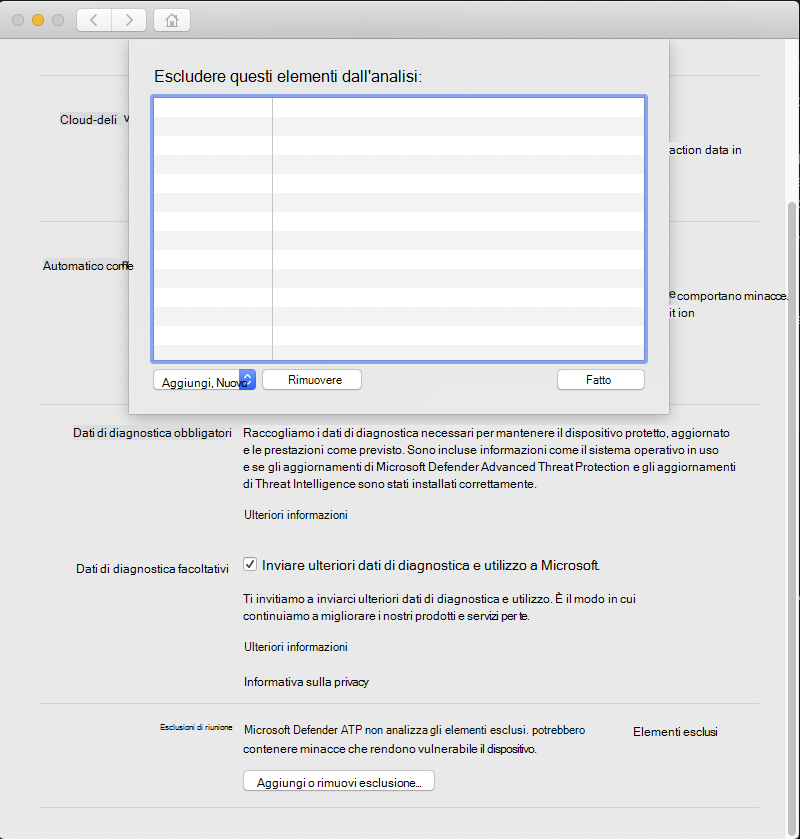

# <a name="configure-and-validate-exclusions-for-microsoft-defender-for-endpoint-on-macos"></a>Configurare e convalidare le esclusioni per Microsoft Defender for Endpoint in macOS

[!INCLUDE [Microsoft 365 Defender rebranding](../../includes/microsoft-defender.md)]


**Si applica a:**
- [Microsoft Defender per endpoint](https://go.microsoft.com/fwlink/p/?linkid=2154037)
- [Microsoft 365 Defender](https://go.microsoft.com/fwlink/?linkid=2118804)

> Vuoi provare Defender per Endpoint? [Iscriversi per una versione di valutazione gratuita.](https://www.microsoft.com/microsoft-365/windows/microsoft-defender-atp?ocid=docs-wdatp-investigateip-abovefoldlink)

In questo articolo vengono fornite informazioni su come definire le esclusioni applicabili alle analisi su richiesta e sulla protezione e il monitoraggio in tempo reale.

>[!IMPORTANT]
>Le esclusioni descritte in questo articolo non si applicano ad altre funzionalità di Defender per Endpoint su Mac, tra cui il rilevamento e la risposta degli endpoint (EDR). I file esclusi utilizzando i metodi descritti in questo articolo possono comunque attivare avvisi EDR e altri rilevamenti.

Puoi escludere determinati file, cartelle, processi e file aperti dal processo da analisi di Defender per Endpoint su Mac.

Le esclusioni possono essere utili per evitare rilevamenti non corretti su file o software univoci o personalizzati per l'organizzazione. Possono anche essere utili per ridurre i problemi di prestazioni causati da Defender per Endpoint su Mac.

>[!WARNING]
>La definizione delle esclusioni riduce la protezione offerta da Defender per Endpoint su Mac. È consigliabile valutare sempre i rischi associati all'implementazione delle esclusioni e escludere solo i file che si è certi non siano dannosi.

## <a name="supported-exclusion-types"></a>Tipi di esclusione supportati

La tabella seguente mostra i tipi di esclusione supportati da Defender per Endpoint su Mac.

Esclusione | Definizione | Esempi
---|---|---
Estensione del file | Tutti i file con estensione, in qualsiasi punto del computer | `.test`
File | Un file specifico identificato dal percorso completo | `/var/log/test.log`<br/>`/var/log/*.log`<br/>`/var/log/install.?.log`
Cartella | Tutti i file nella cartella specificata (in modo ricorsivo) | `/var/log/`<br/>`/var/*/`
Procedura | Un processo specifico (specificato dal percorso completo o dal nome del file) e tutti i file aperti da esso | `/bin/cat`<br/>`cat`<br/>`c?t`

Le esclusioni di file, cartelle e processi supportano i caratteri jolly seguenti:

Carattere jolly | Descrizione | Esempio | Corrispondenze | Non corrisponde
---|---|---|---|---
\* |    Corrisponde a qualsiasi numero di caratteri compresi nessuno (si noti che quando questo carattere jolly viene utilizzato all'interno di un percorso sostituirà una sola cartella) | `/var/*/*.log` | `/var/log/system.log` | `/var/log/nested/system.log`
? | Corrisponde a qualsiasi carattere singolo | `file?.log` | `file1.log`<br/>`file2.log` | `file123.log`

>[!NOTE]
>Il prodotto tenta di risolvere i collegamenti di società durante la valutazione delle esclusioni. La risoluzione firmlink non funziona quando l'esclusione contiene caratteri jolly o il file di destinazione (nel `Data` volume) non esiste.

## <a name="how-to-configure-the-list-of-exclusions"></a>Come configurare l'elenco di esclusioni

### <a name="from-the-management-console"></a>Dalla console di gestione

Per altre informazioni su come configurare le esclusioni da JAMF, Intune o un'altra console di gestione, vedi Impostare le preferenze per [Defender per Endpoint su Mac.](mac-preferences.md)

### <a name="from-the-user-interface"></a>Dall'interfaccia utente

Apri l'applicazione Defender for Endpoint e passa a **Gestisci impostazioni** Aggiungi o  >  **rimuovi esclusione...**, come illustrato nello screenshot seguente:



Selezionare il tipo di esclusione che si desidera aggiungere e seguire le istruzioni visualizzate.

## <a name="validate-exclusions-lists-with-the-eicar-test-file"></a>Convalidare gli elenchi di esclusioni con il file di test EICAR

Puoi verificare che gli elenchi di esclusione funzionino usando `curl` per scaricare un file di test.

Nel frammento di codice Bash seguente, sostituisci `test.txt` con un file conforme alle regole di esclusione. Ad esempio, se l'estensione è `.testing` stata esclusa, sostituire `test.txt` con `test.testing` . Se si sta testando un percorso, assicurarsi di eseguire il comando all'interno di tale percorso.

```bash
curl -o test.txt https://www.eicar.org/download/eicar.com.txt
```

Se Defender per Endpoint sul Mac segnala malware, la regola non funziona. Se non è presente alcun rapporto di malware e il file scaricato esiste, l'esclusione funziona. È possibile aprire il file per verificare che il contenuto sia identico a quello descritto nel sito Web [del file di test EICAR.](http://2016.eicar.org/86-0-Intended-use.html)

Se non si dispone dell'accesso a Internet, è possibile creare un file di test EICAR personalizzato. Scrivi la stringa EICAR in un nuovo file di testo con il comando Bash seguente:

```bash
echo 'X5O!P%@AP[4\PZX54(P^)7CC)7}$EICAR-STANDARD-ANTIVIRUS-TEST-FILE!$H+H*' > test.txt
```

È inoltre possibile copiare la stringa in un file di testo vuoto e tentare di salvarla con il nome del file o nella cartella che si sta tentando di escludere.

## <a name="allow-threats"></a>Consenti minacce

Oltre ad escludere determinati contenuti dall'analisi, puoi anche configurare il prodotto in modo da non rilevare alcune classi di minacce (identificate dal nome della minaccia). È consigliabile prestare attenzione quando si usa questa funzionalità, in quanto può lasciare il dispositivo non protetto.

Per aggiungere un nome di minaccia all'elenco delle minacce consentite, eseguire il comando seguente:

```bash
mdatp threat allowed add --name [threat-name]
```

Il nome della minaccia associato a un rilevamento nel dispositivo può essere ottenuto usando il comando seguente:

```bash
mdatp threat list
```

Ad esempio, per aggiungere (il nome della minaccia associato al rilevamento EICAR) all'elenco delle minacce `EICAR-Test-File (not a virus)` consentite, eseguire il comando seguente:

```bash
mdatp threat allowed add --name "EICAR-Test-File (not a virus)"
```
