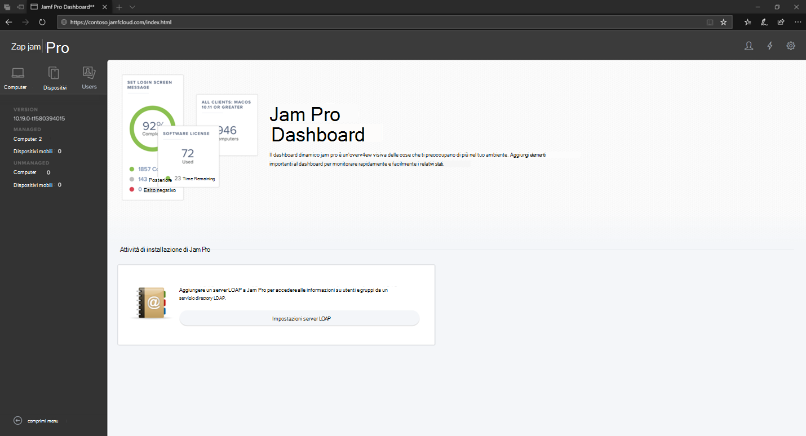
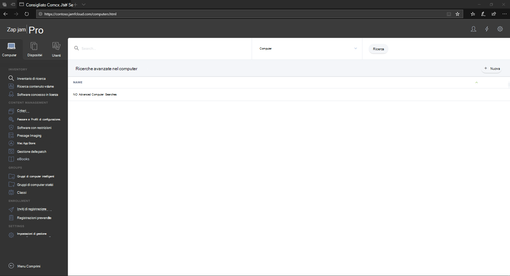

# Accedere a Jamf Pro

[!INCLUDE [Microsoft 365 Defender rebranding](../../includes/microsoft-defender.md)]

**Si applica a:**
- [Microsoft Defender per endpoint](https://go.microsoft.com/fwlink/p/?linkid=2154037)
- [Microsoft 365 Defender](https://go.microsoft.com/fwlink/?linkid=2118804)

> Vuoi provare Defender per Endpoint? [Iscriversi per una versione di valutazione gratuita.](https://www.microsoft.com/microsoft-365/windows/microsoft-defender-atp?ocid=docs-wdatp-investigateip-abovefoldlink)

1. Immettere le credenziali.

    

2. Selezionare **Computer**.

    

3. Verranno visualizzati i criteri disponibili.

     

## Passaggio successivo
[Configurare i gruppi di dispositivi in Jamf Pro](mac-jamfpro-device-groups.md)

