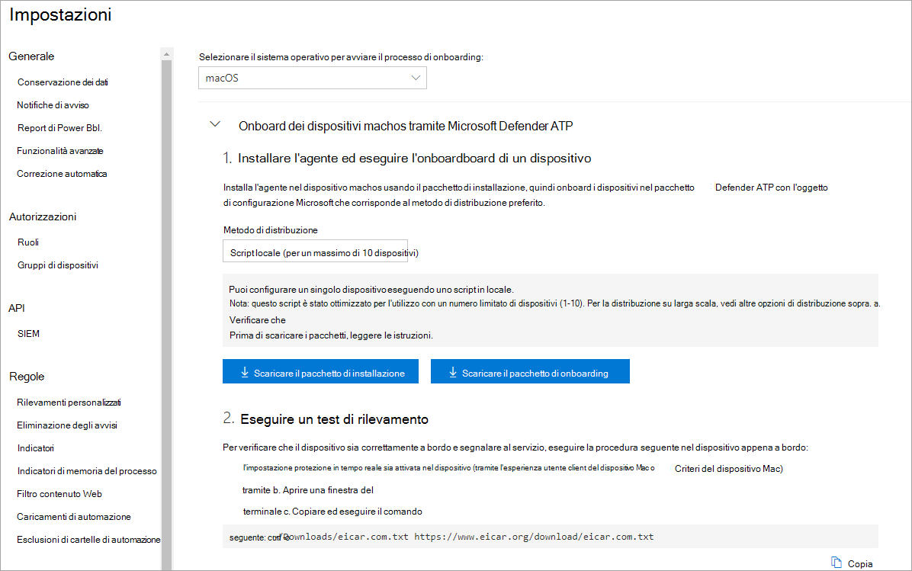
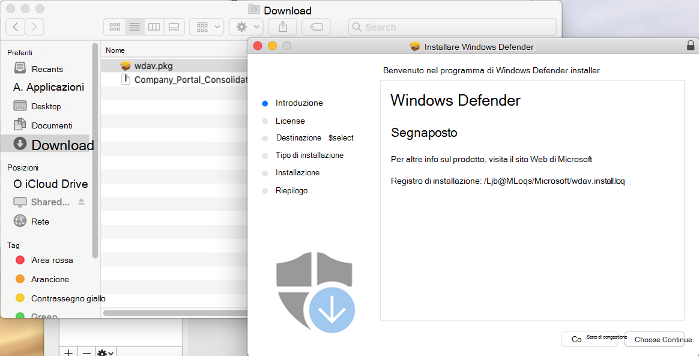
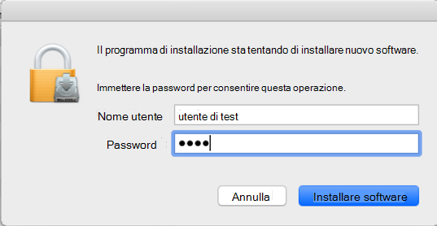
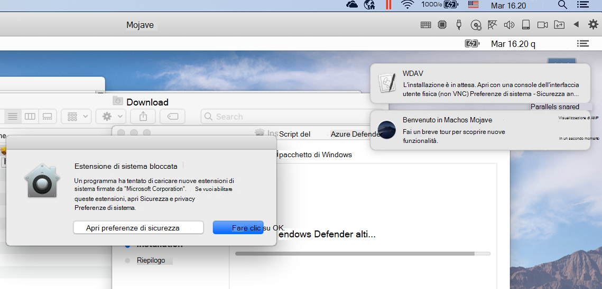
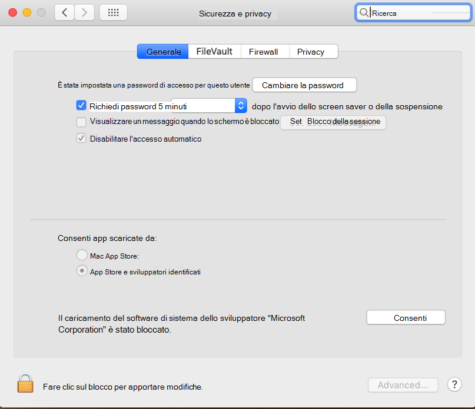
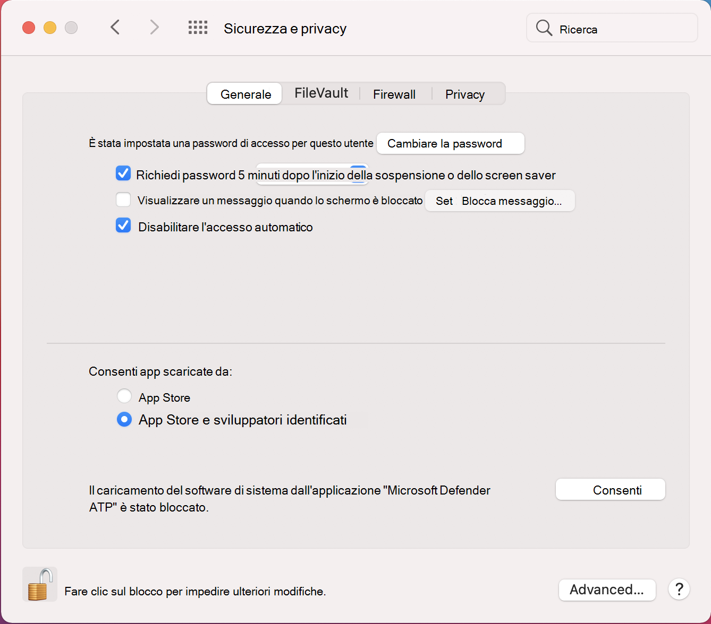
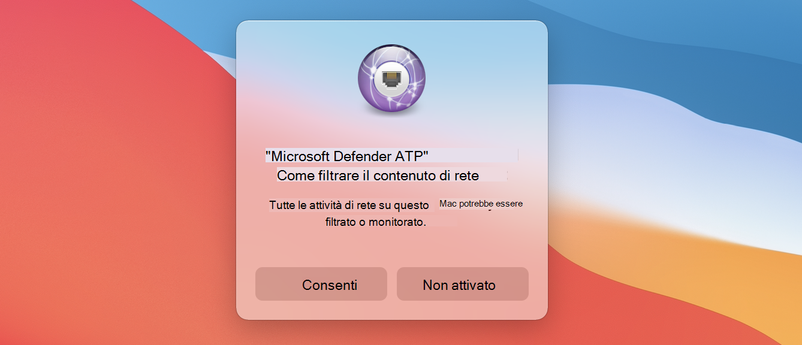
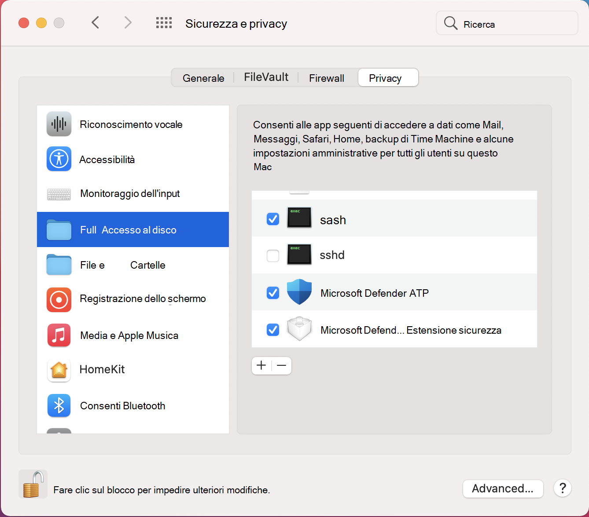

# <a name="manual-deployment-for-microsoft-defender-for-endpoint-for-macos"></a><span data-ttu-id="9ea6d-104">Distribuzione manuale per Microsoft Defender for Endpoint per macOS</span><span class="sxs-lookup"><span data-stu-id="9ea6d-104">Manual deployment for Microsoft Defender for Endpoint for macOS</span></span>

[!INCLUDE [Microsoft 365 Defender rebranding](../../includes/microsoft-defender.md)]

<span data-ttu-id="9ea6d-105">**Si applica a:**</span><span class="sxs-lookup"><span data-stu-id="9ea6d-105">**Applies to:**</span></span>
- [<span data-ttu-id="9ea6d-106">Microsoft Defender ATP</span><span class="sxs-lookup"><span data-stu-id="9ea6d-106">Microsoft Defender for Endpoint</span></span>](https://go.microsoft.com/fwlink/p/?linkid=2154037)
- [<span data-ttu-id="9ea6d-107">Microsoft 365 Defender</span><span class="sxs-lookup"><span data-stu-id="9ea6d-107">Microsoft 365 Defender</span></span>](https://go.microsoft.com/fwlink/?linkid=2118804)

> <span data-ttu-id="9ea6d-108">Vuoi provare Defender per Endpoint?</span><span class="sxs-lookup"><span data-stu-id="9ea6d-108">Want to experience Defender for Endpoint?</span></span> [<span data-ttu-id="9ea6d-109">Iscriversi per una versione di valutazione gratuita.</span><span class="sxs-lookup"><span data-stu-id="9ea6d-109">Sign up for a free trial.</span></span>](https://www.microsoft.com/microsoft-365/windows/microsoft-defender-atp?ocid=docs-wdatp-investigateip-abovefoldlink)

<span data-ttu-id="9ea6d-110">Questo argomento descrive come distribuire Manualmente Microsoft Defender for Endpoint per macOS.</span><span class="sxs-lookup"><span data-stu-id="9ea6d-110">This topic describes how to deploy Microsoft Defender for Endpoint for macOS manually.</span></span> <span data-ttu-id="9ea6d-111">Una distribuzione corretta richiede il completamento di tutti i passaggi seguenti:</span><span class="sxs-lookup"><span data-stu-id="9ea6d-111">A successful deployment requires the completion of all of the following steps:</span></span>
- [<span data-ttu-id="9ea6d-112">Scaricare i pacchetti di installazione e onboarding</span><span class="sxs-lookup"><span data-stu-id="9ea6d-112">Download installation and onboarding packages</span></span>](#download-installation-and-onboarding-packages)
- [<span data-ttu-id="9ea6d-113">Installazione dell'applicazione (macOS 10.15 e versioni precedenti)</span><span class="sxs-lookup"><span data-stu-id="9ea6d-113">Application installation (macOS 10.15 and older versions)</span></span>](#application-installation-macos-1015-and-older-versions)
- [<span data-ttu-id="9ea6d-114">Installazione dell'applicazione (macOS 11 e versioni successive)</span><span class="sxs-lookup"><span data-stu-id="9ea6d-114">Application installation (macOS 11 and newer versions)</span></span>](#application-installation-macos-11-and-newer-versions)
- [<span data-ttu-id="9ea6d-115">Configurazione client</span><span class="sxs-lookup"><span data-stu-id="9ea6d-115">Client configuration</span></span>](#client-configuration)

## <a name="prerequisites-and-system-requirements"></a><span data-ttu-id="9ea6d-116">Prerequisiti e requisiti di sistema</span><span class="sxs-lookup"><span data-stu-id="9ea6d-116">Prerequisites and system requirements</span></span>

<span data-ttu-id="9ea6d-117">Prima di iniziare, vedi la pagina principale di [Microsoft Defender per Endpoint per macOS](microsoft-defender-endpoint-mac.md) per una descrizione dei prerequisiti e dei requisiti di sistema per la versione software corrente.</span><span class="sxs-lookup"><span data-stu-id="9ea6d-117">Before you get started, see [the main Microsoft Defender for Endpoint for macOS page](microsoft-defender-endpoint-mac.md) for a description of prerequisites and system requirements for the current software version.</span></span>

## <a name="download-installation-and-onboarding-packages"></a><span data-ttu-id="9ea6d-118">Scaricare i pacchetti di installazione e onboarding</span><span class="sxs-lookup"><span data-stu-id="9ea6d-118">Download installation and onboarding packages</span></span>

<span data-ttu-id="9ea6d-119">Scaricare i pacchetti di installazione e onboarding da Microsoft Defender Security Center:</span><span class="sxs-lookup"><span data-stu-id="9ea6d-119">Download the installation and onboarding packages from Microsoft Defender Security Center:</span></span>

1. <span data-ttu-id="9ea6d-120">In Microsoft Defender Security Center, vai a **Impostazioni > Gestione dispositivi > onboarding**.</span><span class="sxs-lookup"><span data-stu-id="9ea6d-120">In Microsoft Defender Security Center, go to **Settings > Device Management > Onboarding**.</span></span>
2. <span data-ttu-id="9ea6d-121">Nella sezione 1 della pagina imposta il sistema operativo su **macOS** e il metodo di distribuzione su **Script locale.**</span><span class="sxs-lookup"><span data-stu-id="9ea6d-121">In Section 1 of the page, set operating system to **macOS** and Deployment method to **Local script**.</span></span>
3. <span data-ttu-id="9ea6d-122">Nella sezione 2 della pagina seleziona **Scarica pacchetto di installazione.**</span><span class="sxs-lookup"><span data-stu-id="9ea6d-122">In Section 2 of the page, select **Download installation package**.</span></span> <span data-ttu-id="9ea6d-123">Salvarlo come wdav.pkg in una directory locale.</span><span class="sxs-lookup"><span data-stu-id="9ea6d-123">Save it as wdav.pkg to a local directory.</span></span>
4. <span data-ttu-id="9ea6d-124">Nella sezione 2 della pagina seleziona **Scarica pacchetto di onboarding.**</span><span class="sxs-lookup"><span data-stu-id="9ea6d-124">In Section 2 of the page, select **Download onboarding package**.</span></span> <span data-ttu-id="9ea6d-125">Salvarlo come WindowsDefenderATPOnboardingPackage.zip nella stessa directory.</span><span class="sxs-lookup"><span data-stu-id="9ea6d-125">Save it as WindowsDefenderATPOnboardingPackage.zip to the same directory.</span></span>

    

5. <span data-ttu-id="9ea6d-127">Da un prompt dei comandi, verificare di disporre dei due file.</span><span class="sxs-lookup"><span data-stu-id="9ea6d-127">From a command prompt, verify that you have the two files.</span></span>
    
## <a name="application-installation-macos-1015-and-older-versions"></a><span data-ttu-id="9ea6d-128">Installazione dell'applicazione (macOS 10.15 e versioni precedenti)</span><span class="sxs-lookup"><span data-stu-id="9ea6d-128">Application installation (macOS 10.15 and older versions)</span></span>

<span data-ttu-id="9ea6d-129">Per completare questo processo, devi disporre dei privilegi di amministratore nel dispositivo.</span><span class="sxs-lookup"><span data-stu-id="9ea6d-129">To complete this process, you must have admin privileges on the device.</span></span>

1. <span data-ttu-id="9ea6d-130">Passa al file wdav.pkg scaricato nel Finder e aprilo.</span><span class="sxs-lookup"><span data-stu-id="9ea6d-130">Navigate to the downloaded wdav.pkg in Finder and open it.</span></span>

    

2. <span data-ttu-id="9ea6d-132">Selezionare **Continua**, accettare le condizioni di licenza e immettere la password quando richiesto.</span><span class="sxs-lookup"><span data-stu-id="9ea6d-132">Select **Continue**, agree with the License terms, and enter the password when prompted.</span></span>

    

   > [!IMPORTANT]
   > <span data-ttu-id="9ea6d-134">Ti verrà richiesto di consentire l'installazione di un driver di Microsoft ("Estensione di sistema bloccata" o "L'installazione è in attesa" o entrambe.</span><span class="sxs-lookup"><span data-stu-id="9ea6d-134">You will be prompted to allow a driver from Microsoft to be installed (either "System Extension Blocked" or "Installation is on hold" or both.</span></span> <span data-ttu-id="9ea6d-135">Il driver deve essere autorizzato a essere installato.</span><span class="sxs-lookup"><span data-stu-id="9ea6d-135">The driver must be allowed to be installed.</span></span>

   

3. <span data-ttu-id="9ea6d-137">Seleziona **Apri preferenze di sicurezza** o Apri preferenze di sistema > Sicurezza & **Privacy.**</span><span class="sxs-lookup"><span data-stu-id="9ea6d-137">Select **Open Security Preferences** or **Open System Preferences > Security & Privacy**.</span></span> <span data-ttu-id="9ea6d-138">Selezionare **Consenti**:</span><span class="sxs-lookup"><span data-stu-id="9ea6d-138">Select **Allow**:</span></span>

    

   <span data-ttu-id="9ea6d-140">L'installazione procede.</span><span class="sxs-lookup"><span data-stu-id="9ea6d-140">The installation proceeds.</span></span>

   > [!CAUTION]
   > <span data-ttu-id="9ea6d-141">Se non si seleziona **Consenti,** l'installazione procederà dopo 5 minuti.</span><span class="sxs-lookup"><span data-stu-id="9ea6d-141">If you don't select **Allow**, the installation will proceed after 5 minutes.</span></span> <span data-ttu-id="9ea6d-142">Microsoft Defender for Endpoint verrà caricato, ma alcune funzionalità, ad esempio la protezione in tempo reale, verranno disabilitate.</span><span class="sxs-lookup"><span data-stu-id="9ea6d-142">Microsoft Defender for Endpoint will be loaded, but some features, such as real-time protection, will be disabled.</span></span> <span data-ttu-id="9ea6d-143">Per informazioni su come risolvere [questo problema,](mac-support-kext.md) vedi Risolvere i problemi relativi alle estensioni del kernel.</span><span class="sxs-lookup"><span data-stu-id="9ea6d-143">See [Troubleshoot kernel extension issues](mac-support-kext.md) for information on how to resolve this.</span></span>

> [!NOTE]
> <span data-ttu-id="9ea6d-144">macOS potrebbe richiedere di riavviare il dispositivo alla prima installazione di Microsoft Defender per Endpoint.</span><span class="sxs-lookup"><span data-stu-id="9ea6d-144">macOS may request to reboot the device upon the first installation of Microsoft Defender for Endpoint.</span></span> <span data-ttu-id="9ea6d-145">La protezione in tempo reale non sarà disponibile fino al riavvio del dispositivo.</span><span class="sxs-lookup"><span data-stu-id="9ea6d-145">Real-time protection will not be available until the device is rebooted.</span></span>

## <a name="application-installation-macos-11-and-newer-versions"></a><span data-ttu-id="9ea6d-146">Installazione dell'applicazione (macOS 11 e versioni successive)</span><span class="sxs-lookup"><span data-stu-id="9ea6d-146">Application installation (macOS 11 and newer versions)</span></span>

<span data-ttu-id="9ea6d-147">Per completare questo processo, devi disporre dei privilegi di amministratore nel dispositivo.</span><span class="sxs-lookup"><span data-stu-id="9ea6d-147">To complete this process, you must have admin privileges on the device.</span></span>

1. <span data-ttu-id="9ea6d-148">Passa al file wdav.pkg scaricato nel Finder e aprilo.</span><span class="sxs-lookup"><span data-stu-id="9ea6d-148">Navigate to the downloaded wdav.pkg in Finder and open it.</span></span>

    

2. <span data-ttu-id="9ea6d-150">Selezionare **Continua**, accettare le condizioni di licenza e immettere la password quando richiesto.</span><span class="sxs-lookup"><span data-stu-id="9ea6d-150">Select **Continue**, agree with the License terms, and enter the password when prompted.</span></span>

3. <span data-ttu-id="9ea6d-151">Al termine del processo di installazione, verrà promosso per approvare le estensioni di sistema utilizzate dal prodotto.</span><span class="sxs-lookup"><span data-stu-id="9ea6d-151">At the end of the installation process, you'll be promoted to approve the system extensions used by the product.</span></span> <span data-ttu-id="9ea6d-152">Selezionare **Apri preferenze di sicurezza.**</span><span class="sxs-lookup"><span data-stu-id="9ea6d-152">Select **Open Security Preferences**.</span></span>

    

4. <span data-ttu-id="9ea6d-154">Nella finestra **Sicurezza & Privacy** seleziona **Consenti.**</span><span class="sxs-lookup"><span data-stu-id="9ea6d-154">From the **Security & Privacy** window, select **Allow**.</span></span>

    

5. <span data-ttu-id="9ea6d-156">Ripeti i passaggi 3 & 4 per tutte le estensioni di sistema distribuite con Microsoft Defender per Endpoint per Mac.</span><span class="sxs-lookup"><span data-stu-id="9ea6d-156">Repeat steps 3 & 4 for all system extensions distributed with Microsoft Defender for Endpoint for Mac.</span></span>

6. <span data-ttu-id="9ea6d-157">Come parte delle funzionalità di rilevamento e risposta degli endpoint, Microsoft Defender per Endpoint per Mac esamina il traffico socket e segnala queste informazioni al portale di Microsoft Defender Security Center.</span><span class="sxs-lookup"><span data-stu-id="9ea6d-157">As part of the Endpoint Detection and Response capabilities, Microsoft Defender for Endpoint for Mac inspects socket traffic and reports this information to the Microsoft Defender Security Center portal.</span></span> <span data-ttu-id="9ea6d-158">Quando viene richiesto di concedere a Microsoft Defender le autorizzazioni per Endpoint per filtrare il traffico di rete, selezionare **Consenti**.</span><span class="sxs-lookup"><span data-stu-id="9ea6d-158">When prompted to grant Microsoft Defender for Endpoint permissions to filter network traffic, select **Allow**.</span></span>

    

7. <span data-ttu-id="9ea6d-160">Aprire **Preferenze di** sistema Sicurezza & Privacy e passare alla scheda Privacy. Concedere l'autorizzazione Accesso completo al disco a Microsoft Defender  >   **ATP** e  Microsoft Defender **ATP Endpoint Security Extension**. </span><span class="sxs-lookup"><span data-stu-id="9ea6d-160">Open **System Preferences** > **Security & Privacy** and navigate to the **Privacy** tab. Grant **Full Disk Access** permission to **Microsoft Defender ATP** and **Microsoft Defender ATP Endpoint Security Extension**.</span></span>

    

## <a name="client-configuration"></a><span data-ttu-id="9ea6d-162">Configurazione client</span><span class="sxs-lookup"><span data-stu-id="9ea6d-162">Client configuration</span></span>

1. <span data-ttu-id="9ea6d-163">Copia wdav.pkg e MicrosoftDefenderATPOnboardingMacOs.py nel dispositivo in cui distribuisci Microsoft Defender per Endpoint per macOS.</span><span class="sxs-lookup"><span data-stu-id="9ea6d-163">Copy wdav.pkg and MicrosoftDefenderATPOnboardingMacOs.py to the device where you deploy Microsoft Defender for Endpoint for macOS.</span></span>

    <span data-ttu-id="9ea6d-164">Il dispositivo client non è associato a org_id.</span><span class="sxs-lookup"><span data-stu-id="9ea6d-164">The client device isn't associated with org_id.</span></span> <span data-ttu-id="9ea6d-165">*L'attributo org_id* è vuoto.</span><span class="sxs-lookup"><span data-stu-id="9ea6d-165">Note that the *org_id* attribute is blank.</span></span>

    ```bash
    mdatp health --field org_id
    ```

2. <span data-ttu-id="9ea6d-166">Eseguire lo script Python per installare il file di configurazione:</span><span class="sxs-lookup"><span data-stu-id="9ea6d-166">Run the Python script to install the configuration file:</span></span>

    ```bash
    /usr/bin/python MicrosoftDefenderATPOnboardingMacOs.py
    ```

3. <span data-ttu-id="9ea6d-167">Verifica che il dispositivo sia ora associato all'organizzazione e segnala un ID organizzazione valido:</span><span class="sxs-lookup"><span data-stu-id="9ea6d-167">Verify that the device is now associated with your organization and reports a valid org ID:</span></span>

    ```bash
    mdatp health --field org_id
    ```

    <span data-ttu-id="9ea6d-168">Dopo l'installazione, vedrai l'icona di Microsoft Defender nella barra di stato di macOS nell'angolo in alto a destra.</span><span class="sxs-lookup"><span data-stu-id="9ea6d-168">After installation, you'll see the Microsoft Defender icon in the macOS status bar in the top-right corner.</span></span>
    
    > [!div class="mx-imgBorder"]
    > <span data-ttu-id="9ea6d-169"></span><span class="sxs-lookup"><span data-stu-id="9ea6d-169"></span></span>


## <a name="how-to-allow-full-disk-access"></a><span data-ttu-id="9ea6d-170">Come consentire l'accesso completo al disco</span><span class="sxs-lookup"><span data-stu-id="9ea6d-170">How to Allow Full Disk Access</span></span>

> [!CAUTION]
> <span data-ttu-id="9ea6d-171">macOS 10.15 (Catalina) contiene nuovi miglioramenti alla sicurezza e alla privacy.</span><span class="sxs-lookup"><span data-stu-id="9ea6d-171">macOS 10.15 (Catalina) contains new security and privacy enhancements.</span></span> <span data-ttu-id="9ea6d-172">A partire da questa versione, per impostazione predefinita, le applicazioni non sono in grado di accedere a determinate posizioni sul disco (ad esempio Documenti, Download, Desktop e così via) senza il consenso esplicito.</span><span class="sxs-lookup"><span data-stu-id="9ea6d-172">Beginning with this version, by default, applications are not able to access certain locations on disk (such as Documents, Downloads, Desktop, etc.) without explicit consent.</span></span> <span data-ttu-id="9ea6d-173">In assenza di questo consenso, Microsoft Defender for Endpoint non è in grado di proteggere completamente il dispositivo.</span><span class="sxs-lookup"><span data-stu-id="9ea6d-173">In the absence of this consent, Microsoft Defender for Endpoint is not able to fully protect your device.</span></span>

1. <span data-ttu-id="9ea6d-174">Per concedere il consenso, aprire **Preferenze di** sistema Sicurezza  >  **& Privacy**  >  **Privacy** Accesso  >  **completo al disco**.</span><span class="sxs-lookup"><span data-stu-id="9ea6d-174">To grant consent, open **System Preferences** > **Security & Privacy** > **Privacy** > **Full Disk Access**.</span></span> <span data-ttu-id="9ea6d-175">Fare clic sull'icona di blocco per apportare modifiche nella parte inferiore della finestra di dialogo.</span><span class="sxs-lookup"><span data-stu-id="9ea6d-175">Click the lock icon to make changes (bottom of the dialog box).</span></span> <span data-ttu-id="9ea6d-176">Seleziona Microsoft Defender per Endpoint.</span><span class="sxs-lookup"><span data-stu-id="9ea6d-176">Select Microsoft Defender for Endpoint.</span></span>

2. <span data-ttu-id="9ea6d-177">Eseguire un test di rilevamento av per verificare che il dispositivo sia correttamente onboarded e segnalare al servizio.</span><span class="sxs-lookup"><span data-stu-id="9ea6d-177">Run an AV detection test to verify that the device is properly onboarded and reporting to the service.</span></span> <span data-ttu-id="9ea6d-178">Eseguire la procedura seguente nel dispositivo appena onboarded:</span><span class="sxs-lookup"><span data-stu-id="9ea6d-178">Perform the following steps on the newly onboarded device:</span></span>

    1. <span data-ttu-id="9ea6d-179">Verificare che la protezione in tempo reale sia abilitata (a seguito del risultato 1 dell'esecuzione del comando seguente):</span><span class="sxs-lookup"><span data-stu-id="9ea6d-179">Ensure that real-time protection is enabled (denoted by a result of 1 from running the following command):</span></span>

        ```bash
        mdatp health --field real_time_protection_enabled
        ```

    1. <span data-ttu-id="9ea6d-180">Aprire una finestra terminale.</span><span class="sxs-lookup"><span data-stu-id="9ea6d-180">Open a Terminal window.</span></span> <span data-ttu-id="9ea6d-181">Copiare ed eseguire il comando seguente:</span><span class="sxs-lookup"><span data-stu-id="9ea6d-181">Copy and execute the following command:</span></span>

        ```bash
        curl -o ~/Downloads/eicar.com.txt https://www.eicar.org/download/eicar.com.txt
        ```

    1. <span data-ttu-id="9ea6d-182">Il file dovrebbe essere stato messo in quarantena da Defender per Endpoint per Mac.</span><span class="sxs-lookup"><span data-stu-id="9ea6d-182">The file should have been quarantined by Defender for Endpoint for Mac.</span></span> <span data-ttu-id="9ea6d-183">Utilizzare il comando seguente per elencare tutte le minacce rilevate:</span><span class="sxs-lookup"><span data-stu-id="9ea6d-183">Use the following command to list all the detected threats:</span></span>

        ```bash
        mdatp threat list
        ```

3. <span data-ttu-id="9ea6d-184">Eseguire un test di rilevamento EDR per verificare che il dispositivo sia correttamente onboarded e segnalare al servizio.</span><span class="sxs-lookup"><span data-stu-id="9ea6d-184">Run an EDR detection test to verify that the device is properly onboarded and reporting to the service.</span></span> <span data-ttu-id="9ea6d-185">Eseguire la procedura seguente nel dispositivo appena onboarded:</span><span class="sxs-lookup"><span data-stu-id="9ea6d-185">Perform the following steps on the newly onboarded device:</span></span>

   1. <span data-ttu-id="9ea6d-186">Nel browser, ad esempio Microsoft Edge per Mac o Safari.</span><span class="sxs-lookup"><span data-stu-id="9ea6d-186">In your browser such as Microsoft Edge for Mac or Safari.</span></span>

   1. <span data-ttu-id="9ea6d-187">Scarica MDATP MacOS DIY.zip https://aka.ms/mdatpmacosdiy ed estrai.</span><span class="sxs-lookup"><span data-stu-id="9ea6d-187">Download MDATP MacOS DIY.zip from https://aka.ms/mdatpmacosdiy and extract.</span></span>

      <span data-ttu-id="9ea6d-188">Potrebbe essere richiesto:</span><span class="sxs-lookup"><span data-stu-id="9ea6d-188">You may be prompted:</span></span>

      > <span data-ttu-id="9ea6d-189">Vuoi consentire i download su "mdatpclientanalyzer.blob.core.windows.net"?</span><span class="sxs-lookup"><span data-stu-id="9ea6d-189">Do you want to allow downloads on "mdatpclientanalyzer.blob.core.windows.net"?</span></span><br/>
      > <span data-ttu-id="9ea6d-190">Puoi modificare i siti Web che possono scaricare i file in Preferenze siti Web.</span><span class="sxs-lookup"><span data-stu-id="9ea6d-190">You can change which websites can download files in Websites Preferences.</span></span>

4. <span data-ttu-id="9ea6d-191">Fare clic **su Consenti**.</span><span class="sxs-lookup"><span data-stu-id="9ea6d-191">Click **Allow**.</span></span>

5. <span data-ttu-id="9ea6d-192">Apri **Download**.</span><span class="sxs-lookup"><span data-stu-id="9ea6d-192">Open **Downloads**.</span></span>

6. <span data-ttu-id="9ea6d-193">Dovrebbe essere visualizzato **MDATP MacOS FAI DA TE.**</span><span class="sxs-lookup"><span data-stu-id="9ea6d-193">You should see **MDATP MacOS DIY**.</span></span>

   > [!TIP]
   > <span data-ttu-id="9ea6d-194">Se si fa doppio clic, verrà visualizzato il messaggio seguente:</span><span class="sxs-lookup"><span data-stu-id="9ea6d-194">If you double-click, you will get the following message:</span></span>
   > 
   > > <span data-ttu-id="9ea6d-195">**"MDATP MacOS DIY" non può essere aperto perché lo sviluppatore non può essere verificatore.**</span><span class="sxs-lookup"><span data-stu-id="9ea6d-195">**"MDATP MacOS DIY" cannot be opened because the developer cannot be verifier.**</span></span><br/>
   > > <span data-ttu-id="9ea6d-196">macOS non è in grado di verificare che questa app sia libera da malware.</span><span class="sxs-lookup"><span data-stu-id="9ea6d-196">macOS cannot verify that this app is free from malware.</span></span><br/>
   > > <span data-ttu-id="9ea6d-197">**\[ Sposta nel \] Cestino** **\[ Annulla \]**</span><span class="sxs-lookup"><span data-stu-id="9ea6d-197">**\[Move to Trash\]** **\[Cancel\]**</span></span> 
  
7. <span data-ttu-id="9ea6d-198">Fare clic su **Annulla**.</span><span class="sxs-lookup"><span data-stu-id="9ea6d-198">Click **Cancel**.</span></span>

8. <span data-ttu-id="9ea6d-199">Fare clic con il pulsante destro del mouse su **MDATP MacOS DIY** e quindi scegliere **Apri**.</span><span class="sxs-lookup"><span data-stu-id="9ea6d-199">Right-click **MDATP MacOS DIY**, and then click **Open**.</span></span> 

    <span data-ttu-id="9ea6d-200">Il sistema dovrebbe visualizzare il messaggio seguente:</span><span class="sxs-lookup"><span data-stu-id="9ea6d-200">The system should display the following message:</span></span>

    > <span data-ttu-id="9ea6d-201">**macOS non può verificare lo sviluppatore **di MDATP MacOS FAI DA ME.** Si è certi di volerlo aprire?**</span><span class="sxs-lookup"><span data-stu-id="9ea6d-201">**macOS cannot verify the developer of **MDATP MacOS DIY**. Are you sure you want to open it?**</span></span><br/>
    > <span data-ttu-id="9ea6d-202">Aprendo questa app, sovrascrivi la sicurezza del sistema che può esporre il computer e le informazioni personali a malware che potrebbero danneggiare il Mac o compromettere la privacy.</span><span class="sxs-lookup"><span data-stu-id="9ea6d-202">By opening this app, you will be overriding system security which can expose your computer and personal information to malware that may harm your Mac or compromise your privacy.</span></span>

10. <span data-ttu-id="9ea6d-203">Fare clic su **Apri**. </span><span class="sxs-lookup"><span data-stu-id="9ea6d-203">Click **Open**.</span></span>

    <span data-ttu-id="9ea6d-204">Il sistema dovrebbe visualizzare il messaggio seguente:</span><span class="sxs-lookup"><span data-stu-id="9ea6d-204">The system should display the following message:</span></span>

    > <span data-ttu-id="9ea6d-205">Microsoft Defender ATP - file di test fai da toy macOS EDR</span><span class="sxs-lookup"><span data-stu-id="9ea6d-205">Microsoft Defender ATP - macOS EDR DIY test file</span></span><br/>
    > <span data-ttu-id="9ea6d-206">L'avviso corrispondente sarà disponibile nel portale MDATP.</span><span class="sxs-lookup"><span data-stu-id="9ea6d-206">Corresponding alert will be available in the MDATP portal.</span></span>

11. <span data-ttu-id="9ea6d-207">Fare clic su **Apri**. </span><span class="sxs-lookup"><span data-stu-id="9ea6d-207">Click **Open**.</span></span>

    <span data-ttu-id="9ea6d-208">In pochi minuti dovrebbe essere generato un avviso denominato "macOS EDR Test Alert".</span><span class="sxs-lookup"><span data-stu-id="9ea6d-208">In a few minutes an alert named "macOS EDR Test Alert" should be raised.</span></span>

12. <span data-ttu-id="9ea6d-209">Passare a Microsoft Defender Security Center ( https://SecurityCenter.microsoft.com) .</span><span class="sxs-lookup"><span data-stu-id="9ea6d-209">Go to Microsoft Defender Security Center (https://SecurityCenter.microsoft.com).</span></span>

13. <span data-ttu-id="9ea6d-210">Passare alla coda degli avvisi.</span><span class="sxs-lookup"><span data-stu-id="9ea6d-210">Go to the Alert Queue.</span></span>

    :::image type="content" source="images/b8db76c2-c368-49ad-970f-dcb87534d9be.png" alt-text="Esempio di un avviso di test EDR macOS che mostra gravità, categoria, origine di rilevamento e un menu compresso di azioni.":::
    
    <span data-ttu-id="9ea6d-212">Guarda i dettagli dell'avviso e la sequenza temporale del dispositivo ed esegui i passaggi di indagine regolari.</span><span class="sxs-lookup"><span data-stu-id="9ea6d-212">Look at the alert details and the device timeline, and perform the regular investigation steps.</span></span>

## <a name="logging-installation-issues"></a><span data-ttu-id="9ea6d-213">Registrazione dei problemi di installazione</span><span class="sxs-lookup"><span data-stu-id="9ea6d-213">Logging installation issues</span></span>

<span data-ttu-id="9ea6d-214">Per [ulteriori informazioni su](mac-resources.md#logging-installation-issues) come trovare il registro generato automaticamente creato dal programma di installazione quando si verifica un errore, vedere Registrazione dei problemi di installazione.</span><span class="sxs-lookup"><span data-stu-id="9ea6d-214">See [Logging installation issues](mac-resources.md#logging-installation-issues) for more information on how to find the automatically generated log that is created by the installer when an error occurs.</span></span>

## <a name="uninstallation"></a><span data-ttu-id="9ea6d-215">Disinstallazione</span><span class="sxs-lookup"><span data-stu-id="9ea6d-215">Uninstallation</span></span>

<span data-ttu-id="9ea6d-216">Vedi [Disinstallazione](mac-resources.md#uninstalling) per informazioni dettagliate su come rimuovere Microsoft Defender per Endpoint per macOS dai dispositivi client.</span><span class="sxs-lookup"><span data-stu-id="9ea6d-216">See [Uninstalling](mac-resources.md#uninstalling) for details on how to remove Microsoft Defender for Endpoint for macOS from client devices.</span></span>
