# <a name="intune-based-deployment-for-microsoft-defender-for-endpoint-on-macos"></a>Distribuzione basata su Intune per Microsoft Defender per Endpoint in macOS

[!INCLUDE [Microsoft 365 Defender rebranding](../../includes/microsoft-defender.md)]

**Si applica a:**

- [Microsoft Defender per endpoint su macOS](microsoft-defender-endpoint-mac.md)

Questo argomento descrive come distribuire Microsoft Defender for Endpoint in macOS tramite Intune. Una distribuzione corretta richiede il completamento di tutti i passaggi seguenti:

1. [Scaricare il pacchetto di onboarding](#download-the-onboarding-package)
1. [Configurazione del dispositivo client](#client-device-setup)
1. [Approvare le estensioni di sistema](#approve-system-extensions)
1. [Creare profili di configurazione di sistema](#create-system-configuration-profiles)
1. [Pubblica applicazione](#publish-application)

## <a name="prerequisites-and-system-requirements"></a>Prerequisiti e requisiti di sistema

Prima di iniziare, vedi la pagina principale di [Microsoft Defender per Endpoint su macOS](microsoft-defender-endpoint-mac.md) per una descrizione dei prerequisiti e dei requisiti di sistema per la versione software corrente.

## <a name="overview"></a>Panoramica

Nella tabella seguente sono riepilogati i passaggi da eseguire per distribuire e gestire Microsoft Defender per Endpoint su Mac, tramite Intune. Di seguito sono disponibili passaggi più dettagliati.

| Passaggio | Nomi di file di esempio | BundleIdentifier |
|-|-|-|
| [Scaricare il pacchetto di onboarding](#download-the-onboarding-package) | WindowsDefenderATPOnboarding__MDATP_wdav.atp.xml | com.microsoft.wdav.atp |
| [Approvare l'estensione di sistema per Microsoft Defender per Endpoint](#approve-system-extensions) | MDATP_SysExt.xml | N/D |
| [Approvare l'estensione kernel per Microsoft Defender per Endpoint](#download-the-onboarding-package) | MDATP_KExt.xml | N/D |
| [Concedere l'accesso completo al disco a Microsoft Defender per Endpoint](#full-disk-access) | MDATP_tcc_Catalina_or_newer.xml | com.microsoft.wdav.tcc |
| [Criteri di estensione di rete](#network-filter) | MDATP_NetExt.xml | N/D |
| [Configurare Microsoft AutoUpdate (MAU)](mac-updates.md#intune) | MDATP_Microsoft_AutoUpdate.xml | com.microsoft.autoupdate2 |
| [Impostazioni di configurazione di Microsoft Defender for Endpoint](mac-preferences.md#intune-profile-1)<br/><br/> **Nota:** Se si prevede di eseguire un av di terze parti per macOS, impostare `passiveMode` su `true` . | MDATP_WDAV_and_exclusion_settings_Preferences.xml | com.microsoft.wdav |
| [Configurare Microsoft Defender per le notifiche di Endpoint e MS AutoUpdate (MAU)](mac-updates.md) | MDATP_MDAV_Tray_and_AutoUpdate2.mobileconfig | com.microsoft.autoupdate2 o com.microsoft.wdav.tray |


## <a name="download-the-onboarding-package"></a>Scaricare il pacchetto di onboarding

Scarica i pacchetti di onboarding da Microsoft Defender Security Center:

1. In Microsoft Defender Security Center, vai **a** Impostazioni  >    >  **Onboarding** di Gestione dispositivi .

2. Imposta il sistema operativo su **macOS e** il metodo di distribuzione su Gestione dispositivi mobili **/ Microsoft Intune**.

    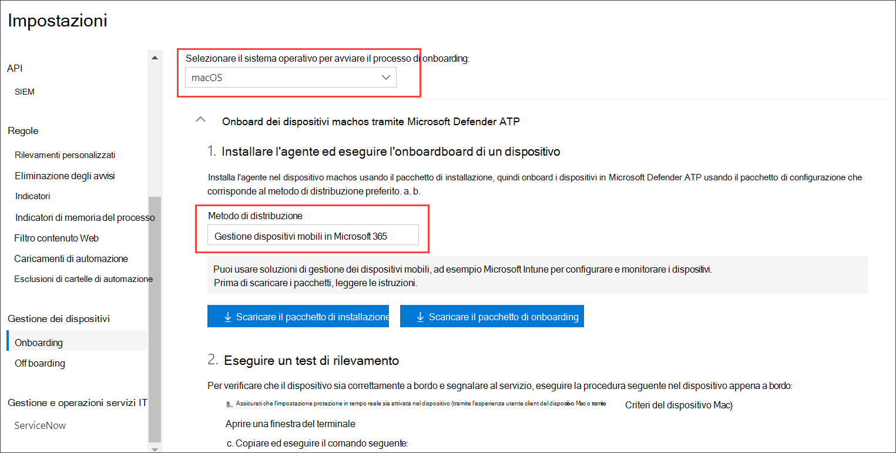

3. Seleziona **Scarica pacchetto di onboarding.** Salvarlo _comeWindowsDefenderATPOnboardingPackage.zip_ nella stessa directory.

4. Estrarre il contenuto del file .zip:

    ```bash
    unzip WindowsDefenderATPOnboardingPackage.zip
    ```
    ```Output
    Archive:  WindowsDefenderATPOnboardingPackage.zip
    warning:  WindowsDefenderATPOnboardingPackage.zip appears to use backslashes as path separators
      inflating: intune/kext.xml
      inflating: intune/WindowsDefenderATPOnboarding.xml
      inflating: jamf/WindowsDefenderATPOnboarding.plist
    ```

## <a name="create-system-configuration-profiles"></a>Creare profili di configurazione di sistema

Il passaggio successivo consiste nel creare profili di configurazione di sistema di cui Microsoft Defender for Endpoint ha bisogno.
[Nell'Microsoft Endpoint Manager di amministrazione,](https://endpoint.microsoft.com/)apri **Profili di** configurazione dei  >  **dispositivi.**

### <a name="onboarding-blob"></a>BLOB di onboarding

Questo profilo contiene informazioni sulla licenza per Microsoft Defender for Endpoint, senza di esso verrà segnalata la non licenza.

1. Selezionare **Crea profilo** in Profili di **configurazione**.
1. Seleziona **Piattaforma** = **macOS**, **Tipo di profilo** = **Modelli**. **Nome modello** = **Personalizzato**. Fare clic su **Crea**.

    > [!div class="mx-imgBorder"]
    > 

1. Scegli un nome per il profilo, ad esempio "MDATP onboarding per macOS". Fare clic su **Avanti**.

    > [!div class="mx-imgBorder"]
    > 

1. Scegli un nome per il nome del profilo di configurazione, ad esempio "MDATP onboarding per macOS".
1. Seleziona intune/WindowsDefenderATPOnboarding.xml estratto dal pacchetto di onboarding precedente come file del profilo di configurazione.

    > [!div class="mx-imgBorder"]
    > 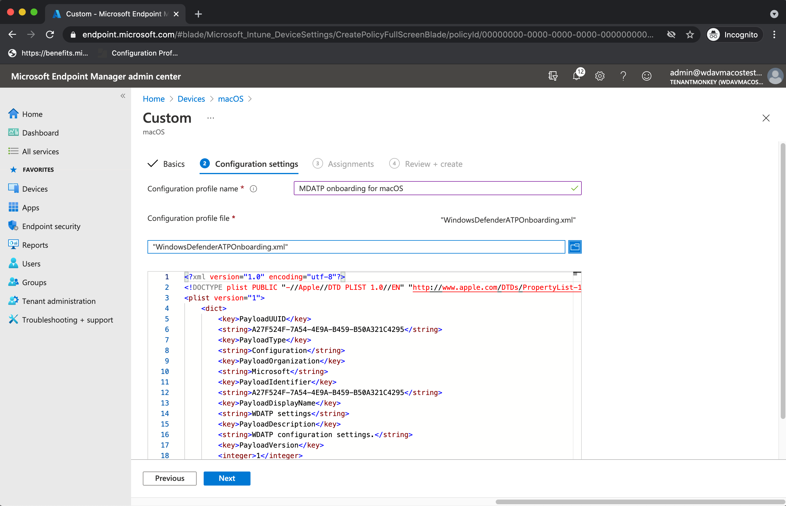

1. Fare clic su **Avanti**.
1. Assegnare dispositivi nella **scheda Assegnazione.** Fare clic su **Avanti.**

    > [!div class="mx-imgBorder"]
    > 

1. Esaminare e **creare**.
1. Aprire **Profili di** configurazione  >  **dei** dispositivi , è possibile visualizzare il profilo creato.

    > [!div class="mx-imgBorder"]
    > 

### <a name="approve-system-extensions"></a>Approvare le estensioni di sistema

Questo profilo è necessario per macOS 10.15 (Catalina) o versione più recente. Verrà ignorato in macOS precedente.

1. Selezionare **Crea profilo** in Profili di **configurazione**.
1. Seleziona **Piattaforma** = **macOS**, **Tipo di profilo** = **Modelli**. **Nome modello** = **Estensioni**. Fare clic su **Crea**.
1. Nella scheda **Nozioni** di base assegnare un nome al nuovo profilo.
1. Nella scheda **Impostazioni di** configurazione espandere **Estensioni di** sistema aggiungere le voci seguenti nella sezione Estensioni **di sistema** consentite:

    Identificatore bundle         | Identificatore del team
    --------------------------|----------------
    com.microsoft.wdav.epsext | UBF8T346G9
    com.microsoft.wdav.netext | UBF8T346G9

    > [!div class="mx-imgBorder"]
    > 

1. Nella scheda **Assegnazioni** assegnare questo profilo a Tutti **gli utenti & Tutti i dispositivi**.
1. Esaminare e creare questo profilo di configurazione.

### <a name="kernel-extensions"></a>Estensioni kernel

Questo profilo è necessario per macOS 10.15 (Catalina) o versioni precedenti. Verrà ignorato in macOS più recente.

> [!CAUTION]
> I dispositivi Apple Silicon (M1) non supportano KEXT. L'installazione di un profilo di configurazione costituito da criteri KEXT avrà esito negativo in questi dispositivi.

1. Selezionare **Crea profilo** in Profili di **configurazione**.
1. Seleziona **Piattaforma** = **macOS**, **Tipo di profilo** = **Modelli**. **Nome modello** = **Estensioni**. Fare clic su **Crea**.
1. Nella scheda **Nozioni** di base assegnare un nome al nuovo profilo.
1. Nella scheda **Impostazioni di** configurazione espandi **Estensioni kernel.**
1. Impostare **l'identificatore del** team **su UBF8T346G9** e fare clic su **Avanti.**

    > [!div class="mx-imgBorder"]
    > 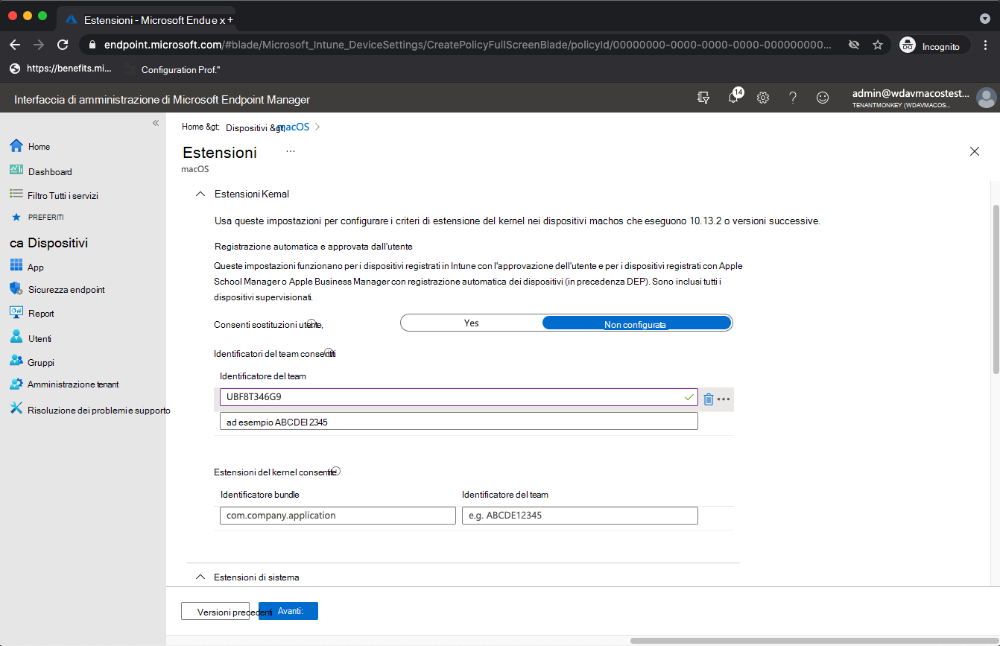

1. Nella scheda **Assegnazioni** assegnare questo profilo a Tutti **gli utenti & Tutti i dispositivi**.
1. Esaminare e creare questo profilo di configurazione.

### <a name="full-disk-access"></a>Accesso completo al disco

   > [!CAUTION]
   > macOS 10.15 (Catalina) contiene nuovi miglioramenti alla sicurezza e alla privacy. A partire da questa versione, per impostazione predefinita, le applicazioni non sono in grado di accedere a determinate posizioni sul disco (ad esempio Documenti, Download, Desktop e così via) senza il consenso esplicito. In assenza di questo consenso, Microsoft Defender for Endpoint non è in grado di proteggere completamente il dispositivo.
   >
   > Questo profilo di configurazione concede l'accesso completo al disco a Microsoft Defender per Endpoint. Se in precedenza è stato configurato Microsoft Defender per Endpoint tramite Intune, è consigliabile aggiornare la distribuzione con questo profilo di configurazione.

Scaricare [**fulldisk.mobileconfig**](https://raw.githubusercontent.com/microsoft/mdatp-xplat/master/macos/mobileconfig/profiles/kext.mobileconfig) dal [repository GitHub.](https://github.com/microsoft/mdatp-xplat/tree/master/macos/mobileconfig/profiles)

Seguire le istruzioni per il BLOB di [onboarding](#onboarding-blob) dall'alto, usando "MDATP Accesso completo al disco" come nome del profilo e scaricando **fulldisk.mobileconfig** come nome del profilo di configurazione.

### <a name="network-filter"></a>Filtro di rete

Come parte delle funzionalità di rilevamento e risposta degli endpoint, Microsoft Defender for Endpoint su macOS esamina il traffico socket e segnala queste informazioni al portale Microsoft Defender Security Center remoto. Il criterio seguente consente all'estensione di rete di eseguire questa funzionalità.

Scaricare [**netfilter.mobileconfig**](https://raw.githubusercontent.com/microsoft/mdatp-xplat/master/macos/mobileconfig/profiles/kext.mobileconfig) dal [repository GitHub .](https://github.com/microsoft/mdatp-xplat/tree/master/macos/mobileconfig/profiles)

Segui le istruzioni per il BLOB di [onboarding](#onboarding-blob) dall'alto, usando "filtro di rete MDATP" come nome del profilo e **scaricando netfilter.mobileconfig** come nome del profilo di configurazione.

### <a name="notifications"></a>Notifiche

Questo profilo viene usato per consentire a Microsoft Defender for Endpoint su macOS e Microsoft Auto Update di visualizzare le notifiche nell'interfaccia utente in macOS 10.15 (Catalina) o versioni più nuove.

Scaricare [**notif.mobileconfig**](https://raw.githubusercontent.com/microsoft/mdatp-xplat/master/macos/mobileconfig/profiles/kext.mobileconfig) dal [repository GitHub .](https://github.com/microsoft/mdatp-xplat/tree/master/macos/mobileconfig/profiles)

Segui le istruzioni per il BLOB di [onboarding](#onboarding-blob) dall'alto, usando "MDATP Network Filter" come nome del profilo e scaricando **notif.mobileconfig** come nome del profilo di configurazione.

### <a name="view-status"></a>Visualizza stato

Una volta propagate le modifiche di Intune ai dispositivi registrati, puoi vederle elencate in **Monitor**  >  **Device status**:

> [!div class="mx-imgBorder"]
> 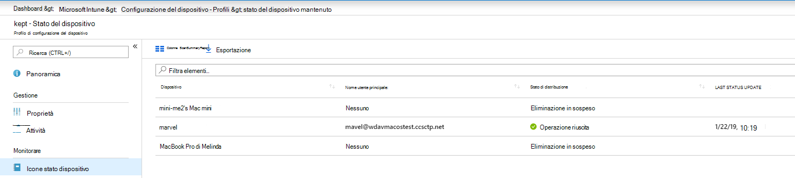

## <a name="publish-application"></a>Pubblica applicazione

Questo passaggio consente di distribuire Microsoft Defender for Endpoint nei computer registrati.

1. [Nell'Microsoft Endpoint Manager di amministrazione,](https://endpoint.microsoft.com/)apri **App.**

    > [!div class="mx-imgBorder"]
    > 

1. Seleziona Per piattaforma > macOS > Aggiungi.
1. Scegli **Tipo di app** = **macOS,** fai clic su **Seleziona.**

    > [!div class="mx-imgBorder"]
    > 

1. Mantenere i valori predefiniti, fare clic **su Avanti.**

    > [!div class="mx-imgBorder"]
    > 

1. Aggiungere assegnazioni, fare clic su **Avanti.**

    > [!div class="mx-imgBorder"]
    > 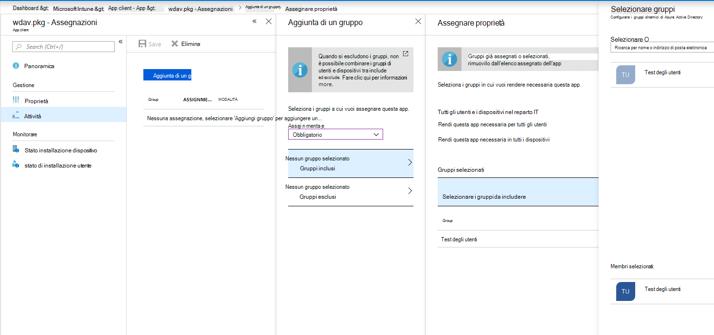

1. Esaminare e **creare**.
1. Puoi visitare **App per**  >  **piattaforma**  >  **macOS** per vedere l'elenco di tutte le applicazioni.

    > [!div class="mx-imgBorder"]
    > 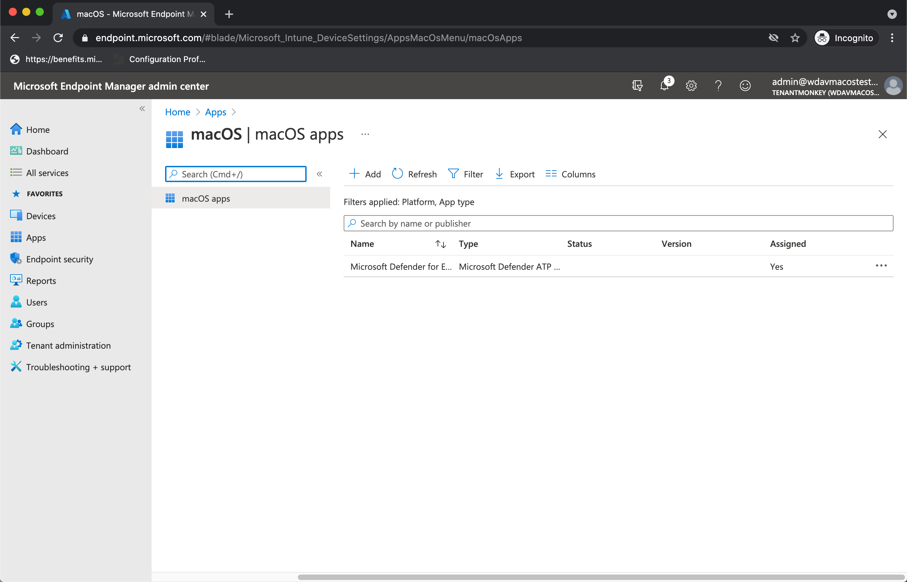

Sono disponibili informazioni dettagliate nella pagina di Intune per [la distribuzione di Defender.](/mem/intune/apps/apps-advanced-threat-protection-macos)

   > [!CAUTION]
   > È necessario creare tutti i profili di configurazione necessari ed eseguire il push in tutti i computer, come illustrato in precedenza.

## <a name="client-device-setup"></a>Configurazione del dispositivo client

Non è necessario alcun provisioning speciale per un dispositivo Mac oltre a [un'installazione Portale aziendale standard.](/intune-user-help/enroll-your-device-in-intune-macos-cp)

1. Confermare la gestione dei dispositivi.

    > [!div class="mx-imgBorder"]
    > 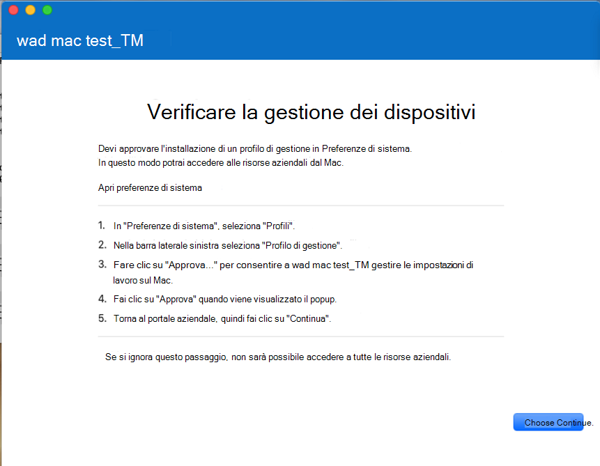

    Selezionare **Apri preferenze di sistema,** individuare Profilo di **gestione** nell'elenco e selezionare **Approva...**. Il profilo di gestione verrà visualizzato come **Verificato:**

    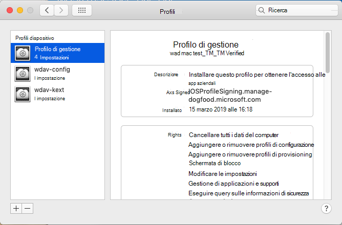

2. Selezionare **Continua** e completare la registrazione.

   È ora possibile registrare altri dispositivi. Puoi anche registrarli in un secondo momento, dopo aver completato il provisioning della configurazione del sistema e dei pacchetti di applicazioni.

3. In Intune apri **Gestisci**  >  **dispositivi Tutti** i  >  **dispositivi.** Qui puoi vedere il dispositivo tra quelli elencati:

   > [!div class="mx-imgBorder"]
   > 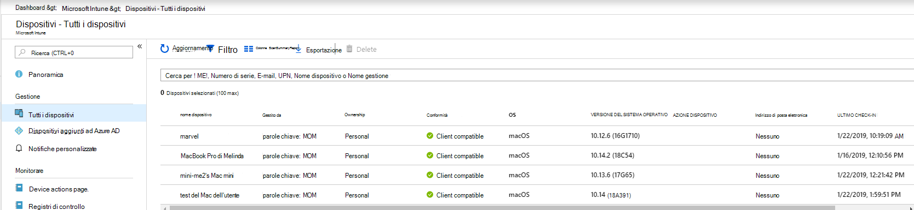

## <a name="verify-client-device-state"></a>Verificare lo stato del dispositivo client

1. Dopo aver distribuito i profili di configurazione nei dispositivi, apri **Profili delle** preferenze  >  **di sistema** nel dispositivo Mac.

    > [!div class="mx-imgBorder"]
    > 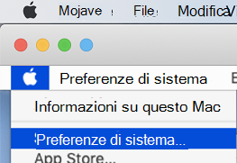

    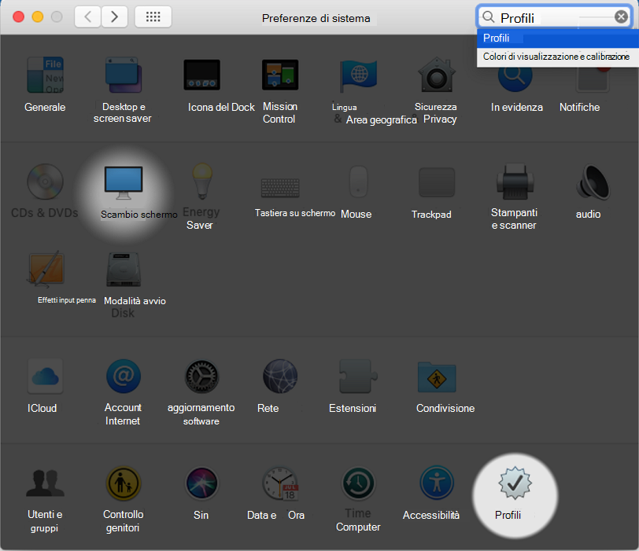

2. Verificare che siano presenti e installati i profili di configurazione seguenti. Il **profilo di gestione** deve essere il profilo di sistema intune. _Wdav-config e_ _wdav-kext_ sono profili di configurazione di sistema aggiunti in Intune:

    

3. Dovresti anche vedere l'icona di Microsoft Defender for Endpoint nell'angolo in alto a destra:

    > [!div class="mx-imgBorder"]
    > 

## <a name="troubleshooting"></a>Risoluzione dei problemi

Problema: nessuna licenza trovata.

Soluzione: seguire i passaggi precedenti per creare un profilo di dispositivo usando WindowsDefenderATPOnboarding.xml.

## <a name="logging-installation-issues"></a>Registrazione dei problemi di installazione

Per ulteriori informazioni su come trovare il registro generato automaticamente creato dal programma di installazione quando si verifica un errore, vedere [Logging installation issues](mac-resources.md#logging-installation-issues).

## <a name="uninstallation"></a>Disinstallazione

Vedi [Disinstallazione](mac-resources.md#uninstalling) per informazioni dettagliate su come rimuovere Microsoft Defender per Endpoint su macOS dai dispositivi client.
