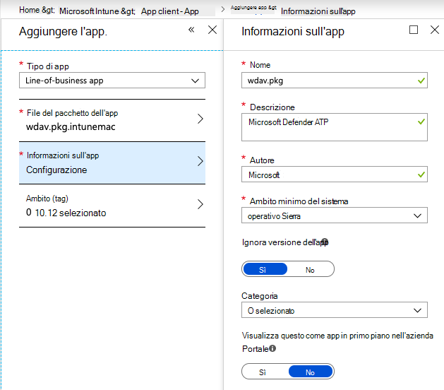
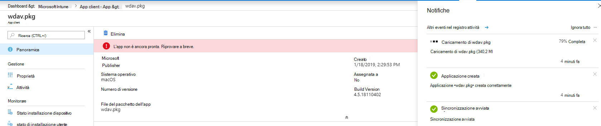
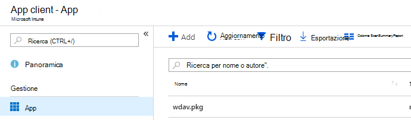
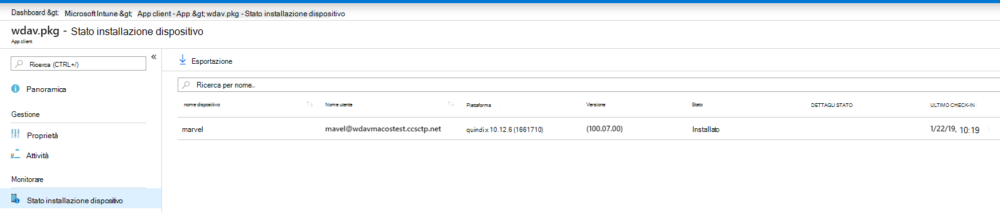

# <a name="intune-based-deployment-for-microsoft-defender-for-endpoint-for-mac"></a>Distribuzione basata su Intune per Microsoft Defender per Endpoint per Mac

[!INCLUDE [Microsoft 365 Defender rebranding](../../includes/microsoft-defender.md)]


> [!NOTE]
> Questa documentazione illustra il metodo legacy per la distribuzione e la configurazione di Microsoft Defender per Endpoint nei dispositivi macOS. L'esperienza nativa è ora disponibile nella console MEM. Il rilascio dell'interfaccia utente nativa nella console MEM offre agli amministratori un modo molto più semplice per configurare e distribuire l'applicazione e inviarla ai dispositivi macOS. <br> <br>
>Il post di blog [MEM semplifica la distribuzione di Microsoft Defender for Endpoint per macOS](https://techcommunity.microsoft.com/t5/microsoft-endpoint-manager-blog/microsoft-endpoint-manager-simplifies-deployment-of-microsoft/ba-p/1322995) spiega le nuove funzionalità. Per configurare l'app, vai a [Impostazioni per Microsoft Defender per Endpoint per Mac in Microsoft InTune.](https://docs.microsoft.com/mem/intune/protect/antivirus-microsoft-defender-settings-macos) Per distribuire l'app, vai a [Aggiungere Microsoft Defender per Endpoint ai dispositivi macOS con Microsoft Intune.](https://docs.microsoft.com/mem/intune/apps/apps-advanced-threat-protection-macos)

**Si applica a:**

- [Microsoft Defender per Endpoint per Mac](microsoft-defender-endpoint-mac.md)

Questo argomento descrive come distribuire Microsoft Defender per Endpoint per Mac tramite Intune. Una distribuzione corretta richiede il completamento di tutti i passaggi seguenti:

1. [Scaricare i pacchetti di installazione e onboarding](#download-installation-and-onboarding-packages)
1. [Configurazione del dispositivo client](#client-device-setup)
1. [Approvare le estensioni di sistema](#approve-system-extensions)
1. [Creare profili di configurazione di sistema](#create-system-configuration-profiles)
1. [Pubblica applicazione](#publish-application)

## <a name="prerequisites-and-system-requirements"></a>Prerequisiti e requisiti di sistema

Prima di iniziare, vedi la pagina principale di [Microsoft Defender per Endpoint per Mac](microsoft-defender-endpoint-mac.md) per una descrizione dei prerequisiti e dei requisiti di sistema per la versione software corrente.

## <a name="overview"></a>Panoramica

Nella tabella seguente sono riepilogati i passaggi da eseguire per distribuire e gestire Microsoft Defender per Endpoint per Mac tramite Intune. Di seguito sono disponibili passaggi più dettagliati.

| Passaggio | Nomi di file di esempio | BundleIdentifier |
|-|-|-|
| [Scaricare i pacchetti di installazione e onboarding](#download-installation-and-onboarding-packages) | WindowsDefenderATPOnboarding__MDATP_wdav.atp.xml | com.microsoft.wdav.atp |
| [Approvare l'estensione di sistema per Microsoft Defender per Endpoint](#approve-system-extensions) | MDATP_SysExt.xml | N/D |
| [Approvare l'estensione kernel per Microsoft Defender per Endpoint](#download-installation-and-onboarding-packages) | MDATP_KExt.xml | N/D |
| [Concedere l'accesso completo al disco a Microsoft Defender per Endpoint](#create-system-configuration-profiles-step-8) | MDATP_tcc_Catalina_or_newer.xml | com.microsoft.wdav.tcc |
| [Criteri di estensione di rete](#create-system-configuration-profiles-step-9) | MDATP_NetExt.xml | N/D |
| [Configurare Microsoft AutoUpdate (MAU)](https://docs.microsoft.com/microsoft-365/security/defender-endpoint/mac-updates#intune) | MDATP_Microsoft_AutoUpdate.xml | com.microsoft.autoupdate2 |
| [Impostazioni di configurazione di Microsoft Defender for Endpoint](https://docs.microsoft.com/microsoft-365/security/defender-endpoint/mac-preferences#intune-profile-1)<br/><br/> **Nota:** Se si prevede di eseguire un av di terze parti per macOS, impostare `passiveMode` su `true` . | MDATP_WDAV_and_exclusion_settings_Preferences.xml | com.microsoft.wdav |
| [Configurare Microsoft Defender per le notifiche di Endpoint e MS AutoUpdate (MAU)](#create-system-configuration-profiles-step-10) | MDATP_MDAV_Tray_and_AutoUpdate2.mobileconfig | com.microsoft.autoupdate2 o com.microsoft.wdav.tray |

## <a name="download-installation-and-onboarding-packages"></a>Scaricare i pacchetti di installazione e onboarding

Scaricare i pacchetti di installazione e onboarding da Microsoft Defender Security Center:

1. In Microsoft Defender Security Center vai a **Impostazioni**  >    >  **Onboarding** gestione dispositivi.

2. Imposta il sistema operativo su **macOS e** il metodo di distribuzione su **Gestione dispositivi mobili / Microsoft Intune.**

    

3. Selezionare **Scarica pacchetto di installazione**. Salvarlo come _wdav.pkg_ in una directory locale.

4. Seleziona **Scarica pacchetto di onboarding.** Salvarlo _comeWindowsDefenderATPOnboardingPackage.zip_ nella stessa directory.

5. Scaricare **IntuneAppUtil** da [https://docs.microsoft.com/intune/lob-apps-macos](https://docs.microsoft.com/intune/lob-apps-macos) .

6. Da un prompt dei comandi, verificare di disporre dei tre file.
  

    ```bash
    ls -l
    ```

    ```Output
    total 721688
    -rw-r--r--  1 test  staff     269280 Mar 15 11:25 IntuneAppUtil
    -rw-r--r--  1 test  staff      11821 Mar 15 09:23 WindowsDefenderATPOnboardingPackage.zip
    -rw-r--r--  1 test  staff  354531845 Mar 13 08:57 wdav.pkg
    ```
7. Estrarre il contenuto dei file ZIP:

    ```bash
    unzip WindowsDefenderATPOnboardingPackage.zip
    ```
    ```Output
    Archive:  WindowsDefenderATPOnboardingPackage.zip
    warning:  WindowsDefenderATPOnboardingPackage.zip appears to use backslashes as path separators
      inflating: intune/kext.xml
      inflating: intune/WindowsDefenderATPOnboarding.xml
      inflating: jamf/WindowsDefenderATPOnboarding.plist
    ```

8. Rendi IntuneAppUtil un eseguibile:

    ```bash
    chmod +x IntuneAppUtil
    ```

9. Crea il pacchetto wdav.pkg.intunemac da wdav.pkg:

    ```bash
    ./IntuneAppUtil -c wdav.pkg -o . -i "com.microsoft.wdav" -n "1.0.0"
    ```
    ```Output
    Microsoft Intune Application Utility for Mac OS X
    Version: 1.0.0.0
    Copyright 2018 Microsoft Corporation

    Creating intunemac file for /Users/test/Downloads/wdav.pkg
    Composing the intunemac file output
    Output written to ./wdav.pkg.intunemac.

    IntuneAppUtil successfully processed "wdav.pkg",
    to deploy refer to the product documentation.
    ```

## <a name="client-device-setup"></a>Configurazione del dispositivo client

Non è necessario alcun provisioning speciale per un dispositivo Mac oltre a un'installazione standard [del portale aziendale.](https://docs.microsoft.com/intune-user-help/enroll-your-device-in-intune-macos-cp)

1. Confermare la gestione dei dispositivi.

   

    Selezionare **Apri preferenze di sistema,** individuare Profilo di **gestione** nell'elenco e selezionare **Approva...**. Il profilo di gestione verrà visualizzato come **Verificato:**

    

2. Selezionare **Continua** e completare la registrazione.

   È ora possibile registrare altri dispositivi. Puoi anche registrarli in un secondo momento, dopo aver completato il provisioning della configurazione del sistema e dei pacchetti di applicazioni.

3. In Intune apri **Gestisci**  >  **dispositivi Tutti** i  >  **dispositivi.** Qui puoi vedere il dispositivo tra quelli elencati:

   > [!div class="mx-imgBorder"]
   > 

## <a name="approve-system-extensions"></a>Approvare le estensioni di sistema

Per approvare le estensioni di sistema:

1. In Intune apri **Gestisci**  >  **configurazione dispositivo.** Selezionare **Gestisci**  >  **profili**  >  **Crea profilo**.

2. Scegliere un nome per il profilo. Modificare **Platform=macOS** in **Profile type=Extensions**. Selezionare **Crea**.

3. Nella scheda **Nozioni** di base assegnare un nome al nuovo profilo.

4. Nella scheda **Impostazioni di** configurazione aggiungere le voci seguenti nella sezione Estensioni **di sistema** consentite:

    Identificatore bundle         | Identificatore del team
    --------------------------|----------------
    com.microsoft.wdav.epsext | UBF8T346G9
    com.microsoft.wdav.netext | UBF8T346G9

    > [!div class="mx-imgBorder"]
    > 

5. Nella scheda **Assegnazioni** assegnare questo profilo a Tutti **gli utenti & Tutti i dispositivi**.

6. Esaminare e creare questo profilo di configurazione.

## <a name="create-system-configuration-profiles"></a>Creare profili di configurazione di sistema

1. In Intune apri **Gestisci**  >  **configurazione dispositivo.** Selezionare **Gestisci**  >  **profili**  >  **Crea profilo**.

2. Scegliere un nome per il profilo. Modificare **Platform=macOS** in **Profile type=Custom**. Selezionare **Configura**.

3. Apri il profilo di configurazione e carica intune/kext.xml. Questo file è stato creato in una delle sezioni precedenti.

4. Selezionare **OK**.

    

5. Selezionare **Gestisci**  >  **assegnazioni**. Nella scheda **Includi** seleziona **Assegna a tutti gli utenti & Tutti i dispositivi**.

6. Ripetere i passaggi da 1 a 5 per altri profili.

7. Crea un altro profilo, assegna un nome e carica il file intune/WindowsDefenderATPOnboarding.xml.

8. Scarica **fulldisk.mobileconfig** [dal repository GitHub](https://raw.githubusercontent.com/microsoft/mdatp-xplat/master/macos/mobileconfig/profiles/fulldisk.mobileconfig) e salvalo come **tcc.xml**. Creare un altro profilo, assegnargli un nome e caricarvi il file.<a name="create-system-configuration-profiles-step-8" id = "create-system-configuration-profiles-step-8"></a>

   > [!CAUTION]
   > macOS 10.15 (Catalina) contiene nuovi miglioramenti alla sicurezza e alla privacy. A partire da questa versione, per impostazione predefinita, le applicazioni non sono in grado di accedere a determinate posizioni sul disco (ad esempio Documenti, Download, Desktop e così via) senza il consenso esplicito. In assenza di questo consenso, Microsoft Defender for Endpoint non è in grado di proteggere completamente il dispositivo.
   >
   > Questo profilo di configurazione concede l'accesso completo al disco a Microsoft Defender per Endpoint. Se in precedenza è stato configurato Microsoft Defender per Endpoint tramite Intune, è consigliabile aggiornare la distribuzione con questo profilo di configurazione.

9. Come parte delle funzionalità di rilevamento e risposta degli endpoint, Microsoft Defender per Endpoint per Mac esamina il traffico socket e segnala queste informazioni al portale di Microsoft Defender Security Center. Il criterio seguente consente all'estensione di rete di eseguire questa funzionalità. Scaricare **netfilter.mobileconfig** dal [repository GitHub,](https://raw.githubusercontent.com/microsoft/mdatp-xplat/master/macos/mobileconfig/profiles/netfilter.mobileconfig)salvarlo come netext.xml e distribuirlo usando gli stessi passaggi delle sezioni precedenti. <a name = "create-system-configuration-profiles-step-9" id = "create-system-configuration-profiles-step-9"></a>

10. Per consentire a Microsoft Defender per Endpoint per Mac e Microsoft Auto Update di visualizzare le notifiche nell'interfaccia utente in macOS 10.15 (Catalina), scarica dal repository GitHub e importalo come `notif.mobileconfig` payload personalizzato. [](https://raw.githubusercontent.com/microsoft/mdatp-xplat/master/macos/mobileconfig/profiles/notif.mobileconfig) <a name = "create-system-configuration-profiles-step-10" id = "create-system-configuration-profiles-step-10"></a>

11. Selezionare **Gestisci > assegnazioni.**  Nella scheda **Includi** seleziona **Assegna a tutti gli utenti & Tutti i dispositivi**.

Una volta propagate le modifiche di Intune ai dispositivi registrati, puoi vederle elencate in **Monitor**  >  **Device status**:

> [!div class="mx-imgBorder"]
> 

## <a name="publish-application"></a>Pubblica applicazione

1. In Intune apri il **pannello Gestisci > app client.** Seleziona **App > Aggiungi**.

2. Seleziona **App type=Other/Line-of-business app**.

3. Selezionare **file=wdav.pkg.intunemac**. Seleziona **OK** per caricare.

4. Selezionare **Configura** e aggiungere le informazioni necessarie.

5. Usa **macOS High Sierra 10.14** come sistema operativo minimo.

6. Imposta *Ignora versione dell'app* su **Sì.** Altre impostazioni possono essere qualsiasi valore arbitrario.

    > [!CAUTION]
    > *L'impostazione di Ignora versione dell'app* su **No** influisce sulla possibilità dell'applicazione di ricevere aggiornamenti tramite Microsoft AutoUpdate. Vedi [Distribuire gli aggiornamenti per Microsoft Defender per Endpoint per Mac](mac-updates.md) per ulteriori informazioni su come viene aggiornato il prodotto.
    >
    > Se la versione caricata da Intune è inferiore alla versione nel dispositivo, verrà installata la versione inferiore, di fatto il downgrade di Microsoft Defender per Endpoint. Ciò potrebbe causare un'applicazione non funzionante. Vedi [Distribuire gli aggiornamenti per Microsoft Defender per Endpoint per Mac](mac-updates.md) per ulteriori informazioni su come viene aggiornato il prodotto. Se hai distribuito Microsoft Defender per Endpoint con *Ignora versione dell'app* impostato su **No,** cambialo in **Sì.** Se Non è ancora possibile installare Microsoft Defender for Endpoint in un dispositivo client, disinstallare Microsoft Defender for Endpoint ed eseguire il push dei criteri aggiornati.
     
    > [!div class="mx-imgBorder"]
    > 

7. Selezionare **OK** e **Aggiungi**.

    > [!div class="mx-imgBorder"]
    > 

8. Il caricamento del pacchetto potrebbe richiedere alcuni minuti. Al termine, seleziona il pacchetto dall'elenco e vai a **Assegnazioni** e **Aggiungi gruppo.**

    > [!div class="mx-imgBorder"]
    > 

9. Modificare **il tipo di assegnazione** in **Obbligatorio**.

10. Selezionare **Gruppi inclusi**. Seleziona **Rendi questa app necessaria per tutti i dispositivi=Sì.** Selezionare **Seleziona gruppo per includere** e aggiungere un gruppo contenente gli utenti di destinazione. Selezionare **OK** e **Salva**.

    > [!div class="mx-imgBorder"]
    > 

11. Dopo un certo periodo di tempo l'applicazione verrà pubblicata in tutti i dispositivi registrati. Puoi vederlo elencato in **Monitor**  >  **Device**, in **Device install status**:

    > [!div class="mx-imgBorder"]
    > 

## <a name="verify-client-device-state"></a>Verificare lo stato del dispositivo client

1. Dopo aver distribuito i profili di configurazione nei dispositivi, apri **Profili delle** preferenze  >  **di sistema** nel dispositivo Mac.

    <br/>
    

2. Verificare che siano presenti e installati i profili di configurazione seguenti. Il **profilo di gestione** deve essere il profilo di sistema intune. _Wdav-config e_ _wdav-kext_ sono profili di configurazione di sistema aggiunti in Intune: screenshot 

3. Dovresti anche vedere l'icona di Microsoft Defender nell'angolo in alto a destra:

    > [!div class="mx-imgBorder"]
    > 

## <a name="troubleshooting"></a>Risoluzione dei problemi

Problema: nessuna licenza trovata

Soluzione: seguire i passaggi precedenti per creare un profilo di dispositivo usando WindowsDefenderATPOnboarding.xml

## <a name="logging-installation-issues"></a>Registrazione dei problemi di installazione

Per ulteriori informazioni su come trovare il registro generato automaticamente creato dal programma di installazione quando si verifica un errore, vedere [Logging installation issues](mac-resources.md#logging-installation-issues).

## <a name="uninstallation"></a>Disinstallazione

Vedi [Disinstallazione](mac-resources.md#uninstalling) per informazioni dettagliate su come rimuovere Microsoft Defender per Endpoint per Mac dai dispositivi client.
