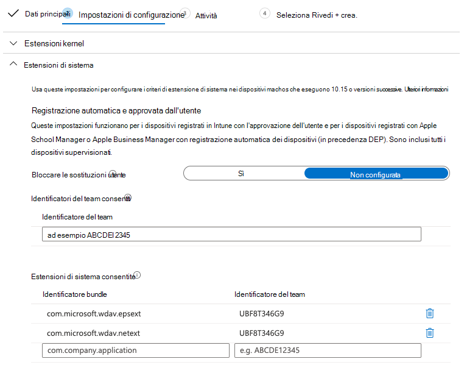

# <a name="intune-based-deployment-for-microsoft-defender-for-endpoint-for-mac"></a><span data-ttu-id="94449-104">Distribuzione basata su Intune per Microsoft Defender per Endpoint per Mac</span><span class="sxs-lookup"><span data-stu-id="94449-104">Intune-based deployment for Microsoft Defender for Endpoint for Mac</span></span>

[!INCLUDE [Microsoft 365 Defender rebranding](../../includes/microsoft-defender.md)]


> [!NOTE]
> <span data-ttu-id="94449-105">Questa documentazione illustra il metodo legacy per la distribuzione e la configurazione di Microsoft Defender per Endpoint nei dispositivi macOS.</span><span class="sxs-lookup"><span data-stu-id="94449-105">This documentation explains the legacy method for deploying and configuring Microsoft Defender for Endpoint on macOS devices.</span></span> <span data-ttu-id="94449-106">L'esperienza nativa è ora disponibile nella console MEM.</span><span class="sxs-lookup"><span data-stu-id="94449-106">The native experience is now available in the MEM console.</span></span> <span data-ttu-id="94449-107">Il rilascio dell'interfaccia utente nativa nella console MEM offre agli amministratori un modo molto più semplice per configurare e distribuire l'applicazione e inviarla ai dispositivi macOS.</span><span class="sxs-lookup"><span data-stu-id="94449-107">The release of the native UI in the MEM console provide admins with a much simpler way to configure and deploy the application and send it down to macOS devices.</span></span> <br> <br>
><span data-ttu-id="94449-108">Il post di blog [MEM semplifica la distribuzione di Microsoft Defender for Endpoint per macOS](https://techcommunity.microsoft.com/t5/microsoft-endpoint-manager-blog/microsoft-endpoint-manager-simplifies-deployment-of-microsoft/ba-p/1322995) spiega le nuove funzionalità.</span><span class="sxs-lookup"><span data-stu-id="94449-108">The blog post [MEM simplifies deployment of Microsoft Defender for Endpoint for macOS](https://techcommunity.microsoft.com/t5/microsoft-endpoint-manager-blog/microsoft-endpoint-manager-simplifies-deployment-of-microsoft/ba-p/1322995) explains the new features.</span></span> <span data-ttu-id="94449-109">Per configurare l'app, vai a [Impostazioni per Microsoft Defender per Endpoint per Mac in Microsoft InTune.](https://docs.microsoft.com/mem/intune/protect/antivirus-microsoft-defender-settings-macos)</span><span class="sxs-lookup"><span data-stu-id="94449-109">To configure the app, go to [Settings for Microsoft Defender for Endpoint for Mac in Microsoft InTune](https://docs.microsoft.com/mem/intune/protect/antivirus-microsoft-defender-settings-macos).</span></span> <span data-ttu-id="94449-110">Per distribuire l'app, vai a [Aggiungere Microsoft Defender per Endpoint ai dispositivi macOS con Microsoft Intune.](https://docs.microsoft.com/mem/intune/apps/apps-advanced-threat-protection-macos)</span><span class="sxs-lookup"><span data-stu-id="94449-110">To deploy the app, go to [Add Microsoft Defender for Endpoint to macOS devices using Microsoft Intune](https://docs.microsoft.com/mem/intune/apps/apps-advanced-threat-protection-macos).</span></span>

<span data-ttu-id="94449-111">**Si applica a:**</span><span class="sxs-lookup"><span data-stu-id="94449-111">**Applies to:**</span></span>

- [<span data-ttu-id="94449-112">Microsoft Defender per Endpoint per Mac</span><span class="sxs-lookup"><span data-stu-id="94449-112">Microsoft Defender for Endpoint for Mac</span></span>](microsoft-defender-endpoint-mac.md)

<span data-ttu-id="94449-113">Questo argomento descrive come distribuire Microsoft Defender per Endpoint per Mac tramite Intune.</span><span class="sxs-lookup"><span data-stu-id="94449-113">This topic describes how to deploy Microsoft Defender for Endpoint for Mac through Intune.</span></span> <span data-ttu-id="94449-114">Una distribuzione corretta richiede il completamento di tutti i passaggi seguenti:</span><span class="sxs-lookup"><span data-stu-id="94449-114">A successful deployment requires the completion of all of the following steps:</span></span>

1. [<span data-ttu-id="94449-115">Scaricare i pacchetti di installazione e onboarding</span><span class="sxs-lookup"><span data-stu-id="94449-115">Download installation and onboarding packages</span></span>](#download-installation-and-onboarding-packages)
1. [<span data-ttu-id="94449-116">Configurazione del dispositivo client</span><span class="sxs-lookup"><span data-stu-id="94449-116">Client device setup</span></span>](#client-device-setup)
1. [<span data-ttu-id="94449-117">Approvare le estensioni di sistema</span><span class="sxs-lookup"><span data-stu-id="94449-117">Approve system extensions</span></span>](#approve-system-extensions)
1. [<span data-ttu-id="94449-118">Creare profili di configurazione di sistema</span><span class="sxs-lookup"><span data-stu-id="94449-118">Create System Configuration profiles</span></span>](#create-system-configuration-profiles)
1. [<span data-ttu-id="94449-119">Pubblica applicazione</span><span class="sxs-lookup"><span data-stu-id="94449-119">Publish application</span></span>](#publish-application)

## <a name="prerequisites-and-system-requirements"></a><span data-ttu-id="94449-120">Prerequisiti e requisiti di sistema</span><span class="sxs-lookup"><span data-stu-id="94449-120">Prerequisites and system requirements</span></span>

<span data-ttu-id="94449-121">Prima di iniziare, vedi la pagina principale di [Microsoft Defender per Endpoint per Mac](microsoft-defender-endpoint-mac.md) per una descrizione dei prerequisiti e dei requisiti di sistema per la versione software corrente.</span><span class="sxs-lookup"><span data-stu-id="94449-121">Before you get started, see [the main Microsoft Defender for Endpoint for Mac page](microsoft-defender-endpoint-mac.md) for a description of prerequisites and system requirements for the current software version.</span></span>

## <a name="overview"></a><span data-ttu-id="94449-122">Panoramica</span><span class="sxs-lookup"><span data-stu-id="94449-122">Overview</span></span>

<span data-ttu-id="94449-123">Nella tabella seguente sono riepilogati i passaggi da eseguire per distribuire e gestire Microsoft Defender per Endpoint per Mac tramite Intune.</span><span class="sxs-lookup"><span data-stu-id="94449-123">The following table summarizes the steps you would need to take to deploy and manage Microsoft Defender for Endpoint for Macs, via Intune.</span></span> <span data-ttu-id="94449-124">Di seguito sono disponibili passaggi più dettagliati.</span><span class="sxs-lookup"><span data-stu-id="94449-124">More detailed steps are available below.</span></span>

| <span data-ttu-id="94449-125">Passaggio</span><span class="sxs-lookup"><span data-stu-id="94449-125">Step</span></span> | <span data-ttu-id="94449-126">Nomi di file di esempio</span><span class="sxs-lookup"><span data-stu-id="94449-126">Sample file names</span></span> | <span data-ttu-id="94449-127">BundleIdentifier</span><span class="sxs-lookup"><span data-stu-id="94449-127">BundleIdentifier</span></span> |
|-|-|-|
| [<span data-ttu-id="94449-128">Scaricare i pacchetti di installazione e onboarding</span><span class="sxs-lookup"><span data-stu-id="94449-128">Download installation and onboarding packages</span></span>](#download-installation-and-onboarding-packages) | <span data-ttu-id="94449-129">WindowsDefenderATPOnboarding__MDATP_wdav.atp.xml</span><span class="sxs-lookup"><span data-stu-id="94449-129">WindowsDefenderATPOnboarding__MDATP_wdav.atp.xml</span></span> | <span data-ttu-id="94449-130">com.microsoft.wdav.atp</span><span class="sxs-lookup"><span data-stu-id="94449-130">com.microsoft.wdav.atp</span></span> |
| [<span data-ttu-id="94449-131">Approvare l'estensione di sistema per Microsoft Defender per Endpoint</span><span class="sxs-lookup"><span data-stu-id="94449-131">Approve System Extension for Microsoft Defender for Endpoint</span></span>](#approve-system-extensions) | <span data-ttu-id="94449-132">MDATP_SysExt.xml</span><span class="sxs-lookup"><span data-stu-id="94449-132">MDATP_SysExt.xml</span></span> | <span data-ttu-id="94449-133">N/D</span><span class="sxs-lookup"><span data-stu-id="94449-133">N/A</span></span> |
| [<span data-ttu-id="94449-134">Approvare l'estensione kernel per Microsoft Defender per Endpoint</span><span class="sxs-lookup"><span data-stu-id="94449-134">Approve Kernel Extension for Microsoft Defender for Endpoint</span></span>](#download-installation-and-onboarding-packages) | <span data-ttu-id="94449-135">MDATP_KExt.xml</span><span class="sxs-lookup"><span data-stu-id="94449-135">MDATP_KExt.xml</span></span> | <span data-ttu-id="94449-136">N/D</span><span class="sxs-lookup"><span data-stu-id="94449-136">N/A</span></span> |
| [<span data-ttu-id="94449-137">Concedere l'accesso completo al disco a Microsoft Defender per Endpoint</span><span class="sxs-lookup"><span data-stu-id="94449-137">Grant full disk access to Microsoft Defender for Endpoint</span></span>](#create-system-configuration-profiles-step-8) | <span data-ttu-id="94449-138">MDATP_tcc_Catalina_or_newer.xml</span><span class="sxs-lookup"><span data-stu-id="94449-138">MDATP_tcc_Catalina_or_newer.xml</span></span> | <span data-ttu-id="94449-139">com.microsoft.wdav.tcc</span><span class="sxs-lookup"><span data-stu-id="94449-139">com.microsoft.wdav.tcc</span></span> |
| [<span data-ttu-id="94449-140">Criteri di estensione di rete</span><span class="sxs-lookup"><span data-stu-id="94449-140">Network Extension policy</span></span>](#create-system-configuration-profiles-step-9) | <span data-ttu-id="94449-141">MDATP_NetExt.xml</span><span class="sxs-lookup"><span data-stu-id="94449-141">MDATP_NetExt.xml</span></span> | <span data-ttu-id="94449-142">N/D</span><span class="sxs-lookup"><span data-stu-id="94449-142">N/A</span></span> |
| [<span data-ttu-id="94449-143">Configurare Microsoft AutoUpdate (MAU)</span><span class="sxs-lookup"><span data-stu-id="94449-143">Configure Microsoft AutoUpdate (MAU)</span></span>](https://docs.microsoft.com/microsoft-365/security/defender-endpoint/mac-updates#intune) | <span data-ttu-id="94449-144">MDATP_Microsoft_AutoUpdate.xml</span><span class="sxs-lookup"><span data-stu-id="94449-144">MDATP_Microsoft_AutoUpdate.xml</span></span> | <span data-ttu-id="94449-145">com.microsoft.autoupdate2</span><span class="sxs-lookup"><span data-stu-id="94449-145">com.microsoft.autoupdate2</span></span> |
| [<span data-ttu-id="94449-146">Impostazioni di configurazione di Microsoft Defender for Endpoint</span><span class="sxs-lookup"><span data-stu-id="94449-146">Microsoft Defender for Endpoint configuration settings</span></span>](https://docs.microsoft.com/microsoft-365/security/defender-endpoint/mac-preferences#intune-profile-1)<br/><br/> <span data-ttu-id="94449-147">**Nota:** Se si prevede di eseguire un av di terze parti per macOS, impostare `passiveMode` su `true` .</span><span class="sxs-lookup"><span data-stu-id="94449-147">**Note:** If you are planning to run a third-party AV for macOS, set `passiveMode` to `true`.</span></span> | <span data-ttu-id="94449-148">MDATP_WDAV_and_exclusion_settings_Preferences.xml</span><span class="sxs-lookup"><span data-stu-id="94449-148">MDATP_WDAV_and_exclusion_settings_Preferences.xml</span></span> | <span data-ttu-id="94449-149">com.microsoft.wdav</span><span class="sxs-lookup"><span data-stu-id="94449-149">com.microsoft.wdav</span></span> |
| [<span data-ttu-id="94449-150">Configurare Microsoft Defender per le notifiche di Endpoint e MS AutoUpdate (MAU)</span><span class="sxs-lookup"><span data-stu-id="94449-150">Configure Microsoft Defender for Endpoint and MS AutoUpdate (MAU) notifications</span></span>](#create-system-configuration-profiles-step-10) | <span data-ttu-id="94449-151">MDATP_MDAV_Tray_and_AutoUpdate2.mobileconfig</span><span class="sxs-lookup"><span data-stu-id="94449-151">MDATP_MDAV_Tray_and_AutoUpdate2.mobileconfig</span></span> | <span data-ttu-id="94449-152">com.microsoft.autoupdate2 o com.microsoft.wdav.tray</span><span class="sxs-lookup"><span data-stu-id="94449-152">com.microsoft.autoupdate2 or com.microsoft.wdav.tray</span></span> |

## <a name="download-installation-and-onboarding-packages"></a><span data-ttu-id="94449-153">Scaricare i pacchetti di installazione e onboarding</span><span class="sxs-lookup"><span data-stu-id="94449-153">Download installation and onboarding packages</span></span>

<span data-ttu-id="94449-154">Scaricare i pacchetti di installazione e onboarding da Microsoft Defender Security Center:</span><span class="sxs-lookup"><span data-stu-id="94449-154">Download the installation and onboarding packages from Microsoft Defender Security Center:</span></span>

1. <span data-ttu-id="94449-155">In Microsoft Defender Security Center vai a **Impostazioni**  >    >  **Onboarding** gestione dispositivi.</span><span class="sxs-lookup"><span data-stu-id="94449-155">In Microsoft Defender Security Center, go to **Settings** > **Device Management** > **Onboarding**.</span></span>

2. <span data-ttu-id="94449-156">Imposta il sistema operativo su **macOS e** il metodo di distribuzione su **Gestione dispositivi mobili / Microsoft Intune.**</span><span class="sxs-lookup"><span data-stu-id="94449-156">Set the operating system to **macOS** and the deployment method to **Mobile Device Management / Microsoft Intune**.</span></span>

    

3. <span data-ttu-id="94449-158">Selezionare **Scarica pacchetto di installazione**.</span><span class="sxs-lookup"><span data-stu-id="94449-158">Select **Download installation package**.</span></span> <span data-ttu-id="94449-159">Salvarlo come _wdav.pkg_ in una directory locale.</span><span class="sxs-lookup"><span data-stu-id="94449-159">Save it as _wdav.pkg_ to a local directory.</span></span>

4. <span data-ttu-id="94449-160">Seleziona **Scarica pacchetto di onboarding.**</span><span class="sxs-lookup"><span data-stu-id="94449-160">Select **Download onboarding package**.</span></span> <span data-ttu-id="94449-161">Salvarlo _comeWindowsDefenderATPOnboardingPackage.zip_ nella stessa directory.</span><span class="sxs-lookup"><span data-stu-id="94449-161">Save it as _WindowsDefenderATPOnboardingPackage.zip_ to the same directory.</span></span>

5. <span data-ttu-id="94449-162">Scaricare **IntuneAppUtil** da [https://docs.microsoft.com/intune/lob-apps-macos](https://docs.microsoft.com/intune/lob-apps-macos) .</span><span class="sxs-lookup"><span data-stu-id="94449-162">Download **IntuneAppUtil** from [https://docs.microsoft.com/intune/lob-apps-macos](https://docs.microsoft.com/intune/lob-apps-macos).</span></span>

6. <span data-ttu-id="94449-163">Da un prompt dei comandi, verificare di disporre dei tre file.</span><span class="sxs-lookup"><span data-stu-id="94449-163">From a command prompt, verify that you have the three files.</span></span>
  

    ```bash
    ls -l
    ```

    ```Output
    total 721688
    -rw-r--r--  1 test  staff     269280 Mar 15 11:25 IntuneAppUtil
    -rw-r--r--  1 test  staff      11821 Mar 15 09:23 WindowsDefenderATPOnboardingPackage.zip
    -rw-r--r--  1 test  staff  354531845 Mar 13 08:57 wdav.pkg
    ```
7. <span data-ttu-id="94449-164">Estrarre il contenuto dei file ZIP:</span><span class="sxs-lookup"><span data-stu-id="94449-164">Extract the contents of the .zip files:</span></span>

    ```bash
    unzip WindowsDefenderATPOnboardingPackage.zip
    ```
    ```Output
    Archive:  WindowsDefenderATPOnboardingPackage.zip
    warning:  WindowsDefenderATPOnboardingPackage.zip appears to use backslashes as path separators
      inflating: intune/kext.xml
      inflating: intune/WindowsDefenderATPOnboarding.xml
      inflating: jamf/WindowsDefenderATPOnboarding.plist
    ```

8. <span data-ttu-id="94449-165">Rendi IntuneAppUtil un eseguibile:</span><span class="sxs-lookup"><span data-stu-id="94449-165">Make IntuneAppUtil an executable:</span></span>

    ```bash
    chmod +x IntuneAppUtil
    ```

9. <span data-ttu-id="94449-166">Crea il pacchetto wdav.pkg.intunemac da wdav.pkg:</span><span class="sxs-lookup"><span data-stu-id="94449-166">Create the wdav.pkg.intunemac package from wdav.pkg:</span></span>

    ```bash
    ./IntuneAppUtil -c wdav.pkg -o . -i "com.microsoft.wdav" -n "1.0.0"
    ```
    ```Output
    Microsoft Intune Application Utility for Mac OS X
    Version: 1.0.0.0
    Copyright 2018 Microsoft Corporation

    Creating intunemac file for /Users/test/Downloads/wdav.pkg
    Composing the intunemac file output
    Output written to ./wdav.pkg.intunemac.

    IntuneAppUtil successfully processed "wdav.pkg",
    to deploy refer to the product documentation.
    ```

## <a name="client-device-setup"></a><span data-ttu-id="94449-167">Configurazione del dispositivo client</span><span class="sxs-lookup"><span data-stu-id="94449-167">Client device setup</span></span>

<span data-ttu-id="94449-168">Non è necessario alcun provisioning speciale per un dispositivo Mac oltre a un'installazione standard [del portale aziendale.](https://docs.microsoft.com/intune-user-help/enroll-your-device-in-intune-macos-cp)</span><span class="sxs-lookup"><span data-stu-id="94449-168">You do not need any special provisioning for a Mac device beyond a standard [Company Portal installation](https://docs.microsoft.com/intune-user-help/enroll-your-device-in-intune-macos-cp).</span></span>

1. <span data-ttu-id="94449-169">Confermare la gestione dei dispositivi.</span><span class="sxs-lookup"><span data-stu-id="94449-169">Confirm device management.</span></span>

    

    <span data-ttu-id="94449-171">Selezionare **Apri preferenze di sistema,** individuare Profilo di **gestione** nell'elenco e selezionare **Approva...**. Il profilo di gestione verrà visualizzato come **Verificato:**</span><span class="sxs-lookup"><span data-stu-id="94449-171">Select **Open System Preferences**, locate **Management Profile** on the list, and select **Approve...**. Your Management Profile would be displayed as **Verified**:</span></span>

    

2. <span data-ttu-id="94449-173">Selezionare **Continua** e completare la registrazione.</span><span class="sxs-lookup"><span data-stu-id="94449-173">Select **Continue** and complete the enrollment.</span></span>

   <span data-ttu-id="94449-174">È ora possibile registrare altri dispositivi.</span><span class="sxs-lookup"><span data-stu-id="94449-174">You may now enroll more devices.</span></span> <span data-ttu-id="94449-175">Puoi anche registrarli in un secondo momento, dopo aver completato il provisioning della configurazione del sistema e dei pacchetti di applicazioni.</span><span class="sxs-lookup"><span data-stu-id="94449-175">You can also enroll them later, after you have finished provisioning system configuration and application packages.</span></span>

3. <span data-ttu-id="94449-176">In Intune apri **Gestisci**  >  **dispositivi Tutti** i  >  **dispositivi.**</span><span class="sxs-lookup"><span data-stu-id="94449-176">In Intune, open **Manage** > **Devices** > **All devices**.</span></span> <span data-ttu-id="94449-177">Qui puoi vedere il dispositivo tra quelli elencati:</span><span class="sxs-lookup"><span data-stu-id="94449-177">Here you can see your device among those listed:</span></span>

   > [!div class="mx-imgBorder"]
   > <span data-ttu-id="94449-178"></span><span class="sxs-lookup"><span data-stu-id="94449-178"></span></span>

## <a name="approve-system-extensions"></a><span data-ttu-id="94449-179">Approvare le estensioni di sistema</span><span class="sxs-lookup"><span data-stu-id="94449-179">Approve System Extensions</span></span>

<span data-ttu-id="94449-180">Per approvare le estensioni di sistema:</span><span class="sxs-lookup"><span data-stu-id="94449-180">To approve the system extensions:</span></span>

1. <span data-ttu-id="94449-181">In Intune apri **Gestisci**  >  **configurazione dispositivo.**</span><span class="sxs-lookup"><span data-stu-id="94449-181">In Intune, open **Manage** > **Device configuration**.</span></span> <span data-ttu-id="94449-182">Selezionare **Gestisci**  >  **profili**  >  **Crea profilo**.</span><span class="sxs-lookup"><span data-stu-id="94449-182">Select **Manage** > **Profiles** > **Create Profile**.</span></span>

2. <span data-ttu-id="94449-183">Scegliere un nome per il profilo.</span><span class="sxs-lookup"><span data-stu-id="94449-183">Choose a name for the profile.</span></span> <span data-ttu-id="94449-184">Modificare **Platform=macOS** in **Profile type=Extensions**.</span><span class="sxs-lookup"><span data-stu-id="94449-184">Change **Platform=macOS** to **Profile type=Extensions**.</span></span> <span data-ttu-id="94449-185">Selezionare **Crea**.</span><span class="sxs-lookup"><span data-stu-id="94449-185">Select **Create**.</span></span>

3. <span data-ttu-id="94449-186">Nella scheda `Basics` assegna un nome al nuovo profilo.</span><span class="sxs-lookup"><span data-stu-id="94449-186">In the `Basics` tab, give a name to this new profile.</span></span>

4. <span data-ttu-id="94449-187">Nella scheda `Configuration settings` aggiungere le voci seguenti nella `Allowed system extensions` sezione:</span><span class="sxs-lookup"><span data-stu-id="94449-187">In the `Configuration settings` tab, add the following entries in the `Allowed system extensions` section:</span></span>

    <span data-ttu-id="94449-188">Identificatore bundle</span><span class="sxs-lookup"><span data-stu-id="94449-188">Bundle identifier</span></span>         | <span data-ttu-id="94449-189">Identificatore del team</span><span class="sxs-lookup"><span data-stu-id="94449-189">Team identifier</span></span>
    --------------------------|----------------
    <span data-ttu-id="94449-190">com.microsoft.wdav.epsext</span><span class="sxs-lookup"><span data-stu-id="94449-190">com.microsoft.wdav.epsext</span></span> | <span data-ttu-id="94449-191">UBF8T346G9</span><span class="sxs-lookup"><span data-stu-id="94449-191">UBF8T346G9</span></span>
    <span data-ttu-id="94449-192">com.microsoft.wdav.netext</span><span class="sxs-lookup"><span data-stu-id="94449-192">com.microsoft.wdav.netext</span></span> | <span data-ttu-id="94449-193">UBF8T346G9</span><span class="sxs-lookup"><span data-stu-id="94449-193">UBF8T346G9</span></span>

    > [!div class="mx-imgBorder"]
    > <span data-ttu-id="94449-194"></span><span class="sxs-lookup"><span data-stu-id="94449-194"></span></span>

5. <span data-ttu-id="94449-195">Nella scheda `Assignments` assegna questo profilo a Tutti gli utenti & Tutti i **dispositivi**.</span><span class="sxs-lookup"><span data-stu-id="94449-195">In the `Assignments` tab, assign this profile to **All Users & All devices**.</span></span>

6. <span data-ttu-id="94449-196">Esaminare e creare questo profilo di configurazione.</span><span class="sxs-lookup"><span data-stu-id="94449-196">Review and create this configuration profile.</span></span>

## <a name="create-system-configuration-profiles"></a><span data-ttu-id="94449-197">Creare profili di configurazione di sistema</span><span class="sxs-lookup"><span data-stu-id="94449-197">Create System Configuration profiles</span></span>

1. <span data-ttu-id="94449-198">In Intune apri **Gestisci**  >  **configurazione dispositivo.**</span><span class="sxs-lookup"><span data-stu-id="94449-198">In Intune, open **Manage** > **Device configuration**.</span></span> <span data-ttu-id="94449-199">Selezionare **Gestisci**  >  **profili**  >  **Crea profilo**.</span><span class="sxs-lookup"><span data-stu-id="94449-199">Select **Manage** > **Profiles** > **Create Profile**.</span></span>

2. <span data-ttu-id="94449-200">Scegliere un nome per il profilo.</span><span class="sxs-lookup"><span data-stu-id="94449-200">Choose a name for the profile.</span></span> <span data-ttu-id="94449-201">Modificare **Platform=macOS** in **Profile type=Custom**.</span><span class="sxs-lookup"><span data-stu-id="94449-201">Change **Platform=macOS** to **Profile type=Custom**.</span></span> <span data-ttu-id="94449-202">Selezionare **Configura**.</span><span class="sxs-lookup"><span data-stu-id="94449-202">Select **Configure**.</span></span>

3. <span data-ttu-id="94449-203">Apri il profilo di configurazione e carica intune/kext.xml.</span><span class="sxs-lookup"><span data-stu-id="94449-203">Open the configuration profile and upload intune/kext.xml.</span></span> <span data-ttu-id="94449-204">Questo file è stato creato in una delle sezioni precedenti.</span><span class="sxs-lookup"><span data-stu-id="94449-204">This file was created in one of the preceding sections.</span></span>

4. <span data-ttu-id="94449-205">Selezionare **OK**.</span><span class="sxs-lookup"><span data-stu-id="94449-205">Select **OK**.</span></span>

    

5. <span data-ttu-id="94449-207">Selezionare **Gestisci**  >  **assegnazioni**.</span><span class="sxs-lookup"><span data-stu-id="94449-207">Select **Manage** > **Assignments**.</span></span> <span data-ttu-id="94449-208">Nella scheda **Includi** seleziona **Assegna a tutti gli utenti & Tutti i dispositivi**.</span><span class="sxs-lookup"><span data-stu-id="94449-208">In the **Include** tab, select **Assign to All Users & All devices**.</span></span>

6. <span data-ttu-id="94449-209">Ripetere i passaggi da 1 a 5 per altri profili.</span><span class="sxs-lookup"><span data-stu-id="94449-209">Repeat steps 1 through 5 for more profiles.</span></span>

7. <span data-ttu-id="94449-210">Crea un altro profilo, assegna un nome e carica il file intune/WindowsDefenderATPOnboarding.xml.</span><span class="sxs-lookup"><span data-stu-id="94449-210">Create another profile, give it a name, and upload the intune/WindowsDefenderATPOnboarding.xml file.</span></span>

8. <span data-ttu-id="94449-211">Scarica `fulldisk.mobileconfig` dal [repository GitHub](https://raw.githubusercontent.com/microsoft/mdatp-xplat/master/macos/mobileconfig/profiles/fulldisk.mobileconfig) e salvalo con nome `tcc.xml` .</span><span class="sxs-lookup"><span data-stu-id="94449-211">Download `fulldisk.mobileconfig` from [our GitHub repository](https://raw.githubusercontent.com/microsoft/mdatp-xplat/master/macos/mobileconfig/profiles/fulldisk.mobileconfig) and save it as `tcc.xml`.</span></span> <span data-ttu-id="94449-212">Creare un altro profilo, assegnargli un nome e caricarvi il file.<a name="create-system-configuration-profiles-step-8" id = "create-system-configuration-profiles-step-8"></a></span><span class="sxs-lookup"><span data-stu-id="94449-212">Create another profile, give it any name and upload this file to it.<a name="create-system-configuration-profiles-step-8" id = "create-system-configuration-profiles-step-8"></a></span></span>

   > [!CAUTION]
   > <span data-ttu-id="94449-213">macOS 10.15 (Catalina) contiene nuovi miglioramenti alla sicurezza e alla privacy.</span><span class="sxs-lookup"><span data-stu-id="94449-213">macOS 10.15 (Catalina) contains new security and privacy enhancements.</span></span> <span data-ttu-id="94449-214">A partire da questa versione, per impostazione predefinita, le applicazioni non sono in grado di accedere a determinate posizioni sul disco (ad esempio Documenti, Download, Desktop e così via) senza il consenso esplicito.</span><span class="sxs-lookup"><span data-stu-id="94449-214">Beginning with this version, by default, applications are not able to access certain locations on disk (such as Documents, Downloads, Desktop, etc.) without explicit consent.</span></span> <span data-ttu-id="94449-215">In assenza di questo consenso, Microsoft Defender for Endpoint non è in grado di proteggere completamente il dispositivo.</span><span class="sxs-lookup"><span data-stu-id="94449-215">In the absence of this consent, Microsoft Defender for Endpoint is not able to fully protect your device.</span></span>
   >
   > <span data-ttu-id="94449-216">Questo profilo di configurazione concede l'accesso completo al disco a Microsoft Defender per Endpoint.</span><span class="sxs-lookup"><span data-stu-id="94449-216">This configuration profile grants Full Disk Access to Microsoft Defender for Endpoint.</span></span> <span data-ttu-id="94449-217">Se in precedenza è stato configurato Microsoft Defender per Endpoint tramite Intune, è consigliabile aggiornare la distribuzione con questo profilo di configurazione.</span><span class="sxs-lookup"><span data-stu-id="94449-217">If you previously configured Microsoft Defender for Endpoint through Intune, we recommend you update the deployment with this configuration profile.</span></span>

9. <span data-ttu-id="94449-218">Come parte delle funzionalità di rilevamento e risposta degli endpoint, Microsoft Defender per Endpoint per Mac esamina il traffico socket e segnala queste informazioni al portale di Microsoft Defender Security Center.</span><span class="sxs-lookup"><span data-stu-id="94449-218">As part of the Endpoint Detection and Response capabilities, Microsoft Defender for Endpoint for Mac inspects socket traffic and reports this information to the Microsoft Defender Security Center portal.</span></span> <span data-ttu-id="94449-219">Il criterio seguente consente all'estensione di rete di eseguire questa funzionalità.</span><span class="sxs-lookup"><span data-stu-id="94449-219">The following policy allows the network extension to perform this functionality.</span></span> <span data-ttu-id="94449-220">Eseguire il download dal repository GitHub, salvarlo con netext.xml e distribuirlo usando gli stessi passaggi delle `netfilter.mobileconfig` sezioni precedenti. [](https://raw.githubusercontent.com/microsoft/mdatp-xplat/master/macos/mobileconfig/profiles/netfilter.mobileconfig)</span><span class="sxs-lookup"><span data-stu-id="94449-220">Download `netfilter.mobileconfig` from [our GitHub repository](https://raw.githubusercontent.com/microsoft/mdatp-xplat/master/macos/mobileconfig/profiles/netfilter.mobileconfig), save it as netext.xml and deploy it using the same steps as in the previous sections.</span></span> <a name = "create-system-configuration-profiles-step-9" id = "create-system-configuration-profiles-step-9"></a>

10. <span data-ttu-id="94449-221">Per consentire a Microsoft Defender per Endpoint per Mac e Microsoft Auto Update di visualizzare le notifiche nell'interfaccia utente in macOS 10.15 (Catalina), scarica dal repository GitHub e importalo come `notif.mobileconfig` payload personalizzato. [](https://raw.githubusercontent.com/microsoft/mdatp-xplat/master/macos/mobileconfig/profiles/notif.mobileconfig)</span><span class="sxs-lookup"><span data-stu-id="94449-221">To allow Microsoft Defender for Endpoint for Mac and Microsoft Auto Update to display notifications in UI on macOS 10.15 (Catalina), download `notif.mobileconfig` from [our GitHub repository](https://raw.githubusercontent.com/microsoft/mdatp-xplat/master/macos/mobileconfig/profiles/notif.mobileconfig) and import it as a custom payload.</span></span> <a name = "create-system-configuration-profiles-step-10" id = "create-system-configuration-profiles-step-10"></a>

11. <span data-ttu-id="94449-222">Selezionare **Gestisci > assegnazioni.**</span><span class="sxs-lookup"><span data-stu-id="94449-222">Select **Manage > Assignments**.</span></span>  <span data-ttu-id="94449-223">Nella scheda **Includi** seleziona **Assegna a tutti gli utenti & Tutti i dispositivi**.</span><span class="sxs-lookup"><span data-stu-id="94449-223">In the **Include** tab, select **Assign to All Users & All devices**.</span></span>

<span data-ttu-id="94449-224">Una volta propagate le modifiche di Intune ai dispositivi registrati, puoi vederle elencate in **Monitor**  >  **Device status**:</span><span class="sxs-lookup"><span data-stu-id="94449-224">Once the Intune changes are propagated to the enrolled devices, you can see them listed under **Monitor** > **Device status**:</span></span>

> [!div class="mx-imgBorder"]
> <span data-ttu-id="94449-225"></span><span class="sxs-lookup"><span data-stu-id="94449-225"></span></span>

## <a name="publish-application"></a><span data-ttu-id="94449-226">Pubblica applicazione</span><span class="sxs-lookup"><span data-stu-id="94449-226">Publish application</span></span>

1. <span data-ttu-id="94449-227">In Intune apri il **pannello Gestisci > app client.**</span><span class="sxs-lookup"><span data-stu-id="94449-227">In Intune, open the **Manage > Client apps** blade.</span></span> <span data-ttu-id="94449-228">Seleziona **App > Aggiungi**.</span><span class="sxs-lookup"><span data-stu-id="94449-228">Select **Apps > Add**.</span></span>

2. <span data-ttu-id="94449-229">Seleziona **App type=Other/Line-of-business app**.</span><span class="sxs-lookup"><span data-stu-id="94449-229">Select **App type=Other/Line-of-business app**.</span></span>

3. <span data-ttu-id="94449-230">Selezionare **file=wdav.pkg.intunemac**.</span><span class="sxs-lookup"><span data-stu-id="94449-230">Select **file=wdav.pkg.intunemac**.</span></span> <span data-ttu-id="94449-231">Seleziona **OK** per caricare.</span><span class="sxs-lookup"><span data-stu-id="94449-231">Select **OK** to upload.</span></span>

4. <span data-ttu-id="94449-232">Selezionare **Configura** e aggiungere le informazioni necessarie.</span><span class="sxs-lookup"><span data-stu-id="94449-232">Select **Configure** and add the required information.</span></span>

5. <span data-ttu-id="94449-233">Usa **macOS High Sierra 10.13** come sistema operativo minimo.</span><span class="sxs-lookup"><span data-stu-id="94449-233">Use **macOS High Sierra 10.13** as the minimum OS.</span></span>

6. <span data-ttu-id="94449-234">Imposta *Ignora versione dell'app* su **Sì.**</span><span class="sxs-lookup"><span data-stu-id="94449-234">Set *Ignore app version* to **Yes**.</span></span> <span data-ttu-id="94449-235">Altre impostazioni possono essere qualsiasi valore arbitrario.</span><span class="sxs-lookup"><span data-stu-id="94449-235">Other settings can be any arbitrary value.</span></span>

    > [!CAUTION]
    > <span data-ttu-id="94449-236">*L'impostazione di Ignora versione dell'app* su **No** influisce sulla possibilità dell'applicazione di ricevere aggiornamenti tramite Microsoft AutoUpdate.</span><span class="sxs-lookup"><span data-stu-id="94449-236">Setting *Ignore app version* to **No** impacts the ability of the application to receive updates through Microsoft AutoUpdate.</span></span> <span data-ttu-id="94449-237">Vedi [Distribuire gli aggiornamenti per Microsoft Defender per Endpoint per Mac](mac-updates.md) per ulteriori informazioni su come viene aggiornato il prodotto.</span><span class="sxs-lookup"><span data-stu-id="94449-237">See [Deploy updates for Microsoft Defender for Endpoint for Mac](mac-updates.md) for additional information about how the product is updated.</span></span>
    >
    > <span data-ttu-id="94449-238">Se la versione caricata da Intune è inferiore alla versione nel dispositivo, verrà installata la versione inferiore, di fatto il downgrade di Microsoft Defender per Endpoint.</span><span class="sxs-lookup"><span data-stu-id="94449-238">If the version uploaded by Intune is lower than the version on the device, then the lower version will be installed, effectively downgrading Microsoft Defender for Endpoint.</span></span> <span data-ttu-id="94449-239">Ciò potrebbe causare un'applicazione non funzionante.</span><span class="sxs-lookup"><span data-stu-id="94449-239">This could result in a non-functioning application.</span></span> <span data-ttu-id="94449-240">Vedi [Distribuire gli aggiornamenti per Microsoft Defender per Endpoint per Mac](mac-updates.md) per ulteriori informazioni su come viene aggiornato il prodotto.</span><span class="sxs-lookup"><span data-stu-id="94449-240">See [Deploy updates for Microsoft Defender for Endpoint for Mac](mac-updates.md) for additional information about how the product is updated.</span></span> <span data-ttu-id="94449-241">Se hai distribuito Microsoft Defender per Endpoint con *Ignora versione dell'app* impostato su **No,** cambialo in **Sì.**</span><span class="sxs-lookup"><span data-stu-id="94449-241">If you deployed Microsoft Defender for Endpoint with *Ignore app version* set to **No**, please change it to **Yes**.</span></span> <span data-ttu-id="94449-242">Se Non è ancora possibile installare Microsoft Defender for Endpoint in un dispositivo client, disinstallare Microsoft Defender for Endpoint ed eseguire il push dei criteri aggiornati.</span><span class="sxs-lookup"><span data-stu-id="94449-242">If Microsoft Defender for Endpoint still cannot be installed on a client device, then uninstall Microsoft Defender for Endpoint and push the updated policy.</span></span>
     
    > [!div class="mx-imgBorder"]
    > <span data-ttu-id="94449-243"></span><span class="sxs-lookup"><span data-stu-id="94449-243"></span></span>

7. <span data-ttu-id="94449-244">Selezionare **OK** e **Aggiungi**.</span><span class="sxs-lookup"><span data-stu-id="94449-244">Select **OK** and **Add**.</span></span>

    > [!div class="mx-imgBorder"]
    > <span data-ttu-id="94449-245"></span><span class="sxs-lookup"><span data-stu-id="94449-245"></span></span>

8. <span data-ttu-id="94449-246">Il caricamento del pacchetto potrebbe richiedere alcuni minuti.</span><span class="sxs-lookup"><span data-stu-id="94449-246">It may take a few moments to upload the package.</span></span> <span data-ttu-id="94449-247">Al termine, seleziona il pacchetto dall'elenco e vai a **Assegnazioni** e **Aggiungi gruppo.**</span><span class="sxs-lookup"><span data-stu-id="94449-247">After it's done, select the package from the list and go to **Assignments** and **Add group**.</span></span>

    > [!div class="mx-imgBorder"]
    > <span data-ttu-id="94449-248"></span><span class="sxs-lookup"><span data-stu-id="94449-248"></span></span>

9. <span data-ttu-id="94449-249">Modificare **il tipo di assegnazione** in **Obbligatorio**.</span><span class="sxs-lookup"><span data-stu-id="94449-249">Change **Assignment type** to **Required**.</span></span>

10. <span data-ttu-id="94449-250">Selezionare **Gruppi inclusi**.</span><span class="sxs-lookup"><span data-stu-id="94449-250">Select **Included Groups**.</span></span> <span data-ttu-id="94449-251">Seleziona **Rendi questa app necessaria per tutti i dispositivi=Sì.**</span><span class="sxs-lookup"><span data-stu-id="94449-251">Select **Make this app required for all devices=Yes**.</span></span> <span data-ttu-id="94449-252">Selezionare **Seleziona gruppo per includere** e aggiungere un gruppo contenente gli utenti di destinazione.</span><span class="sxs-lookup"><span data-stu-id="94449-252">Select **Select group to include** and add a group that contains the users you want to target.</span></span> <span data-ttu-id="94449-253">Selezionare **OK** e **Salva**.</span><span class="sxs-lookup"><span data-stu-id="94449-253">Select **OK** and **Save**.</span></span>

    > [!div class="mx-imgBorder"]
    > <span data-ttu-id="94449-254"></span><span class="sxs-lookup"><span data-stu-id="94449-254"></span></span>

11. <span data-ttu-id="94449-255">Dopo un certo periodo di tempo l'applicazione verrà pubblicata in tutti i dispositivi registrati.</span><span class="sxs-lookup"><span data-stu-id="94449-255">After some time the application will be published to all enrolled devices.</span></span> <span data-ttu-id="94449-256">Puoi vederlo elencato in **Monitor**  >  **Device**, in **Device install status**:</span><span class="sxs-lookup"><span data-stu-id="94449-256">You can see it listed in **Monitor** > **Device**, under **Device install status**:</span></span>

    > [!div class="mx-imgBorder"]
    > <span data-ttu-id="94449-257"></span><span class="sxs-lookup"><span data-stu-id="94449-257"></span></span>

## <a name="verify-client-device-state"></a><span data-ttu-id="94449-258">Verificare lo stato del dispositivo client</span><span class="sxs-lookup"><span data-stu-id="94449-258">Verify client device state</span></span>

1. <span data-ttu-id="94449-259">Dopo aver distribuito i profili di configurazione nei dispositivi, apri **Profili delle** preferenze  >  **di sistema** nel dispositivo Mac.</span><span class="sxs-lookup"><span data-stu-id="94449-259">After the configuration profiles are deployed to your devices, open **System Preferences** > **Profiles** on your Mac device.</span></span>

    <span data-ttu-id="94449-260"></span><span class="sxs-lookup"><span data-stu-id="94449-260"></span></span><br/>
    <span data-ttu-id="94449-261"></span><span class="sxs-lookup"><span data-stu-id="94449-261"></span></span>

2. <span data-ttu-id="94449-262">Verificare che siano presenti e installati i profili di configurazione seguenti.</span><span class="sxs-lookup"><span data-stu-id="94449-262">Verify that the following configuration profiles are present and installed.</span></span> <span data-ttu-id="94449-263">Il **profilo di gestione** deve essere il profilo di sistema intune.</span><span class="sxs-lookup"><span data-stu-id="94449-263">The **Management Profile** should be the Intune system profile.</span></span> <span data-ttu-id="94449-264">_Wdav-config e_ _wdav-kext_ sono profili di configurazione di sistema aggiunti in Intune: screenshot </span><span class="sxs-lookup"><span data-stu-id="94449-264">_Wdav-config_ and _wdav-kext_ are system configuration profiles that were added in Intune: </span></span>

3. <span data-ttu-id="94449-265">Dovresti anche vedere l'icona di Microsoft Defender nell'angolo in alto a destra:</span><span class="sxs-lookup"><span data-stu-id="94449-265">You should also see the Microsoft Defender icon in the top-right corner:</span></span>

    > [!div class="mx-imgBorder"]
    > <span data-ttu-id="94449-266"></span><span class="sxs-lookup"><span data-stu-id="94449-266"></span></span>

## <a name="troubleshooting"></a><span data-ttu-id="94449-267">Risoluzione dei problemi</span><span class="sxs-lookup"><span data-stu-id="94449-267">Troubleshooting</span></span>

<span data-ttu-id="94449-268">Problema: nessuna licenza trovata</span><span class="sxs-lookup"><span data-stu-id="94449-268">Issue: No license found</span></span>

<span data-ttu-id="94449-269">Soluzione: seguire i passaggi precedenti per creare un profilo di dispositivo usando WindowsDefenderATPOnboarding.xml</span><span class="sxs-lookup"><span data-stu-id="94449-269">Solution: Follow the steps above to create a device profile using WindowsDefenderATPOnboarding.xml</span></span>

## <a name="logging-installation-issues"></a><span data-ttu-id="94449-270">Registrazione dei problemi di installazione</span><span class="sxs-lookup"><span data-stu-id="94449-270">Logging installation issues</span></span>

<span data-ttu-id="94449-271">Per ulteriori informazioni su come trovare il registro generato automaticamente creato dal programma di installazione quando si verifica un errore, vedere [Logging installation issues](mac-resources.md#logging-installation-issues).</span><span class="sxs-lookup"><span data-stu-id="94449-271">For more information on how to find the automatically generated log that is created by the installer when an error occurs, see [Logging installation issues](mac-resources.md#logging-installation-issues).</span></span>

## <a name="uninstallation"></a><span data-ttu-id="94449-272">Disinstallazione</span><span class="sxs-lookup"><span data-stu-id="94449-272">Uninstallation</span></span>

<span data-ttu-id="94449-273">Vedi [Disinstallazione](mac-resources.md#uninstalling) per informazioni dettagliate su come rimuovere Microsoft Defender per Endpoint per Mac dai dispositivi client.</span><span class="sxs-lookup"><span data-stu-id="94449-273">See [Uninstalling](mac-resources.md#uninstalling) for details on how to remove Microsoft Defender for Endpoint for Mac from client devices.</span></span>
