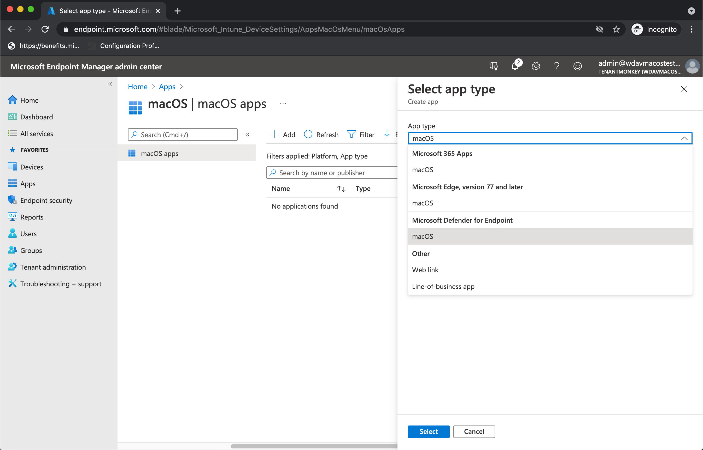

# <a name="intune-based-deployment-for-microsoft-defender-for-endpoint-on-macos"></a><span data-ttu-id="66a1b-104">Distribuzione basata su Intune per Microsoft Defender per Endpoint in macOS</span><span class="sxs-lookup"><span data-stu-id="66a1b-104">Intune-based deployment for Microsoft Defender for Endpoint on macOS</span></span>

[!INCLUDE [Microsoft 365 Defender rebranding](../../includes/microsoft-defender.md)]

<span data-ttu-id="66a1b-105">**Si applica a:**</span><span class="sxs-lookup"><span data-stu-id="66a1b-105">**Applies to:**</span></span>

- [<span data-ttu-id="66a1b-106">Microsoft Defender per endpoint su macOS</span><span class="sxs-lookup"><span data-stu-id="66a1b-106">Microsoft Defender for Endpoint on macOS</span></span>](microsoft-defender-endpoint-mac.md)

<span data-ttu-id="66a1b-107">Questo argomento descrive come distribuire Microsoft Defender for Endpoint in macOS tramite Intune.</span><span class="sxs-lookup"><span data-stu-id="66a1b-107">This topic describes how to deploy Microsoft Defender for Endpoint on macOS through Intune.</span></span> <span data-ttu-id="66a1b-108">Una distribuzione corretta richiede il completamento di tutti i passaggi seguenti:</span><span class="sxs-lookup"><span data-stu-id="66a1b-108">A successful deployment requires the completion of all of the following steps:</span></span>

1. [<span data-ttu-id="66a1b-109">Scaricare il pacchetto di onboarding</span><span class="sxs-lookup"><span data-stu-id="66a1b-109">Download the onboarding package</span></span>](#download-the-onboarding-package)
1. [<span data-ttu-id="66a1b-110">Configurazione del dispositivo client</span><span class="sxs-lookup"><span data-stu-id="66a1b-110">Client device setup</span></span>](#client-device-setup)
1. [<span data-ttu-id="66a1b-111">Approvare le estensioni di sistema</span><span class="sxs-lookup"><span data-stu-id="66a1b-111">Approve system extensions</span></span>](#approve-system-extensions)
1. [<span data-ttu-id="66a1b-112">Creare profili di configurazione di sistema</span><span class="sxs-lookup"><span data-stu-id="66a1b-112">Create System Configuration profiles</span></span>](#create-system-configuration-profiles)
1. [<span data-ttu-id="66a1b-113">Pubblica applicazione</span><span class="sxs-lookup"><span data-stu-id="66a1b-113">Publish application</span></span>](#publish-application)

## <a name="prerequisites-and-system-requirements"></a><span data-ttu-id="66a1b-114">Prerequisiti e requisiti di sistema</span><span class="sxs-lookup"><span data-stu-id="66a1b-114">Prerequisites and system requirements</span></span>

<span data-ttu-id="66a1b-115">Prima di iniziare, vedi la pagina principale di [Microsoft Defender per Endpoint su macOS](microsoft-defender-endpoint-mac.md) per una descrizione dei prerequisiti e dei requisiti di sistema per la versione software corrente.</span><span class="sxs-lookup"><span data-stu-id="66a1b-115">Before you get started, see [the main Microsoft Defender for Endpoint on macOS page](microsoft-defender-endpoint-mac.md) for a description of prerequisites and system requirements for the current software version.</span></span>

## <a name="overview"></a><span data-ttu-id="66a1b-116">Panoramica</span><span class="sxs-lookup"><span data-stu-id="66a1b-116">Overview</span></span>

<span data-ttu-id="66a1b-117">Nella tabella seguente sono riepilogati i passaggi da eseguire per distribuire e gestire Microsoft Defender per Endpoint su Mac, tramite Intune.</span><span class="sxs-lookup"><span data-stu-id="66a1b-117">The following table summarizes the steps you would need to take to deploy and manage Microsoft Defender for Endpoint on Macs, via Intune.</span></span> <span data-ttu-id="66a1b-118">Di seguito sono disponibili passaggi più dettagliati.</span><span class="sxs-lookup"><span data-stu-id="66a1b-118">More detailed steps are available below.</span></span>

| <span data-ttu-id="66a1b-119">Passaggio</span><span class="sxs-lookup"><span data-stu-id="66a1b-119">Step</span></span> | <span data-ttu-id="66a1b-120">Nomi di file di esempio</span><span class="sxs-lookup"><span data-stu-id="66a1b-120">Sample file names</span></span> | <span data-ttu-id="66a1b-121">BundleIdentifier</span><span class="sxs-lookup"><span data-stu-id="66a1b-121">BundleIdentifier</span></span> |
|-|-|-|
| [<span data-ttu-id="66a1b-122">Scaricare il pacchetto di onboarding</span><span class="sxs-lookup"><span data-stu-id="66a1b-122">Download the onboarding package</span></span>](#download-the-onboarding-package) | <span data-ttu-id="66a1b-123">WindowsDefenderATPOnboarding__MDATP_wdav.atp.xml</span><span class="sxs-lookup"><span data-stu-id="66a1b-123">WindowsDefenderATPOnboarding__MDATP_wdav.atp.xml</span></span> | <span data-ttu-id="66a1b-124">com.microsoft.wdav.atp</span><span class="sxs-lookup"><span data-stu-id="66a1b-124">com.microsoft.wdav.atp</span></span> |
| [<span data-ttu-id="66a1b-125">Approvare l'estensione di sistema per Microsoft Defender per Endpoint</span><span class="sxs-lookup"><span data-stu-id="66a1b-125">Approve System Extension for Microsoft Defender for Endpoint</span></span>](#approve-system-extensions) | <span data-ttu-id="66a1b-126">MDATP_SysExt.xml</span><span class="sxs-lookup"><span data-stu-id="66a1b-126">MDATP_SysExt.xml</span></span> | <span data-ttu-id="66a1b-127">N/D</span><span class="sxs-lookup"><span data-stu-id="66a1b-127">N/A</span></span> |
| [<span data-ttu-id="66a1b-128">Approvare l'estensione kernel per Microsoft Defender per Endpoint</span><span class="sxs-lookup"><span data-stu-id="66a1b-128">Approve Kernel Extension for Microsoft Defender for Endpoint</span></span>](#download-the-onboarding-package) | <span data-ttu-id="66a1b-129">MDATP_KExt.xml</span><span class="sxs-lookup"><span data-stu-id="66a1b-129">MDATP_KExt.xml</span></span> | <span data-ttu-id="66a1b-130">N/D</span><span class="sxs-lookup"><span data-stu-id="66a1b-130">N/A</span></span> |
| [<span data-ttu-id="66a1b-131">Concedere l'accesso completo al disco a Microsoft Defender per Endpoint</span><span class="sxs-lookup"><span data-stu-id="66a1b-131">Grant full disk access to Microsoft Defender for Endpoint</span></span>](#full-disk-access) | <span data-ttu-id="66a1b-132">MDATP_tcc_Catalina_or_newer.xml</span><span class="sxs-lookup"><span data-stu-id="66a1b-132">MDATP_tcc_Catalina_or_newer.xml</span></span> | <span data-ttu-id="66a1b-133">com.microsoft.wdav.tcc</span><span class="sxs-lookup"><span data-stu-id="66a1b-133">com.microsoft.wdav.tcc</span></span> |
| [<span data-ttu-id="66a1b-134">Criteri di estensione di rete</span><span class="sxs-lookup"><span data-stu-id="66a1b-134">Network Extension policy</span></span>](#network-filter) | <span data-ttu-id="66a1b-135">MDATP_NetExt.xml</span><span class="sxs-lookup"><span data-stu-id="66a1b-135">MDATP_NetExt.xml</span></span> | <span data-ttu-id="66a1b-136">N/D</span><span class="sxs-lookup"><span data-stu-id="66a1b-136">N/A</span></span> |
| [<span data-ttu-id="66a1b-137">Configurare Microsoft AutoUpdate (MAU)</span><span class="sxs-lookup"><span data-stu-id="66a1b-137">Configure Microsoft AutoUpdate (MAU)</span></span>](mac-updates.md#intune) | <span data-ttu-id="66a1b-138">MDATP_Microsoft_AutoUpdate.xml</span><span class="sxs-lookup"><span data-stu-id="66a1b-138">MDATP_Microsoft_AutoUpdate.xml</span></span> | <span data-ttu-id="66a1b-139">com.microsoft.autoupdate2</span><span class="sxs-lookup"><span data-stu-id="66a1b-139">com.microsoft.autoupdate2</span></span> |
| [<span data-ttu-id="66a1b-140">Impostazioni di configurazione di Microsoft Defender for Endpoint</span><span class="sxs-lookup"><span data-stu-id="66a1b-140">Microsoft Defender for Endpoint configuration settings</span></span>](mac-preferences.md#intune-profile-1)<br/><br/> <span data-ttu-id="66a1b-141">**Nota:** Se si prevede di eseguire un av di terze parti per macOS, impostare `passiveMode` su `true` .</span><span class="sxs-lookup"><span data-stu-id="66a1b-141">**Note:** If you're planning to run a third-party AV for macOS, set `passiveMode` to `true`.</span></span> | <span data-ttu-id="66a1b-142">MDATP_WDAV_and_exclusion_settings_Preferences.xml</span><span class="sxs-lookup"><span data-stu-id="66a1b-142">MDATP_WDAV_and_exclusion_settings_Preferences.xml</span></span> | <span data-ttu-id="66a1b-143">com.microsoft.wdav</span><span class="sxs-lookup"><span data-stu-id="66a1b-143">com.microsoft.wdav</span></span> |
| [<span data-ttu-id="66a1b-144">Configurare Microsoft Defender per le notifiche di Endpoint e MS AutoUpdate (MAU)</span><span class="sxs-lookup"><span data-stu-id="66a1b-144">Configure Microsoft Defender for Endpoint and MS AutoUpdate (MAU) notifications</span></span>](mac-updates.md) | <span data-ttu-id="66a1b-145">MDATP_MDAV_Tray_and_AutoUpdate2.mobileconfig</span><span class="sxs-lookup"><span data-stu-id="66a1b-145">MDATP_MDAV_Tray_and_AutoUpdate2.mobileconfig</span></span> | <span data-ttu-id="66a1b-146">com.microsoft.autoupdate2 o com.microsoft.wdav.tray</span><span class="sxs-lookup"><span data-stu-id="66a1b-146">com.microsoft.autoupdate2 or com.microsoft.wdav.tray</span></span> |


## <a name="download-the-onboarding-package"></a><span data-ttu-id="66a1b-147">Scaricare il pacchetto di onboarding</span><span class="sxs-lookup"><span data-stu-id="66a1b-147">Download the onboarding package</span></span>

<span data-ttu-id="66a1b-148">Scarica i pacchetti di onboarding da Microsoft Defender Security Center:</span><span class="sxs-lookup"><span data-stu-id="66a1b-148">Download the onboarding packages from Microsoft Defender Security Center:</span></span>

1. <span data-ttu-id="66a1b-149">In Microsoft Defender Security Center, vai **a** Impostazioni  >    >  **Onboarding** di Gestione dispositivi .</span><span class="sxs-lookup"><span data-stu-id="66a1b-149">In Microsoft Defender Security Center, go to **Settings** > **Device Management** > **Onboarding**.</span></span>

2. <span data-ttu-id="66a1b-150">Imposta il sistema operativo su **macOS e** il metodo di distribuzione su Gestione dispositivi mobili **/ Microsoft Intune**.</span><span class="sxs-lookup"><span data-stu-id="66a1b-150">Set the operating system to **macOS** and the deployment method to **Mobile Device Management / Microsoft Intune**.</span></span>

    

3. <span data-ttu-id="66a1b-152">Seleziona **Scarica pacchetto di onboarding.**</span><span class="sxs-lookup"><span data-stu-id="66a1b-152">Select **Download onboarding package**.</span></span> <span data-ttu-id="66a1b-153">Salvarlo _comeWindowsDefenderATPOnboardingPackage.zip_ nella stessa directory.</span><span class="sxs-lookup"><span data-stu-id="66a1b-153">Save it as _WindowsDefenderATPOnboardingPackage.zip_ to the same directory.</span></span>

4. <span data-ttu-id="66a1b-154">Estrarre il contenuto del file .zip:</span><span class="sxs-lookup"><span data-stu-id="66a1b-154">Extract the contents of the .zip file:</span></span>

    ```bash
    unzip WindowsDefenderATPOnboardingPackage.zip
    ```
    ```Output
    Archive:  WindowsDefenderATPOnboardingPackage.zip
    warning:  WindowsDefenderATPOnboardingPackage.zip appears to use backslashes as path separators
      inflating: intune/kext.xml
      inflating: intune/WindowsDefenderATPOnboarding.xml
      inflating: jamf/WindowsDefenderATPOnboarding.plist
    ```

## <a name="create-system-configuration-profiles"></a><span data-ttu-id="66a1b-155">Creare profili di configurazione di sistema</span><span class="sxs-lookup"><span data-stu-id="66a1b-155">Create System Configuration profiles</span></span>

<span data-ttu-id="66a1b-156">Il passaggio successivo consiste nel creare profili di configurazione di sistema di cui Microsoft Defender for Endpoint ha bisogno.</span><span class="sxs-lookup"><span data-stu-id="66a1b-156">The next step is to create system configuration profiles that Microsoft Defender for Endpoint needs.</span></span>
<span data-ttu-id="66a1b-157">[Nell'Microsoft Endpoint Manager di amministrazione,](https://endpoint.microsoft.com/)apri **Profili di** configurazione dei  >  **dispositivi.**</span><span class="sxs-lookup"><span data-stu-id="66a1b-157">In the [Microsoft Endpoint Manager admin center](https://endpoint.microsoft.com/), open **Devices** > **Configuration profiles**.</span></span>

### <a name="onboarding-blob"></a><span data-ttu-id="66a1b-158">BLOB di onboarding</span><span class="sxs-lookup"><span data-stu-id="66a1b-158">Onboarding blob</span></span>

<span data-ttu-id="66a1b-159">Questo profilo contiene informazioni sulla licenza per Microsoft Defender for Endpoint, senza di esso verrà segnalata la non licenza.</span><span class="sxs-lookup"><span data-stu-id="66a1b-159">This profile contains a license information for Microsoft Defender for Endpoint, without it it will report that it is not licensed.</span></span>

1. <span data-ttu-id="66a1b-160">Selezionare **Crea profilo** in Profili di **configurazione**.</span><span class="sxs-lookup"><span data-stu-id="66a1b-160">Select **Create Profile** under **Configuration Profiles**.</span></span>
1. <span data-ttu-id="66a1b-161">Seleziona **Piattaforma** = **macOS**, **Tipo di profilo** = **Modelli**.</span><span class="sxs-lookup"><span data-stu-id="66a1b-161">Select **Platform**=**macOS**, **Profile type**=**Templates**.</span></span> <span data-ttu-id="66a1b-162">**Nome modello** = **Personalizzato**.</span><span class="sxs-lookup"><span data-stu-id="66a1b-162">**Template name**=**Custom**.</span></span> <span data-ttu-id="66a1b-163">Fai clic su **Crea**.</span><span class="sxs-lookup"><span data-stu-id="66a1b-163">Click **Create**.</span></span>

    > [!div class="mx-imgBorder"]
    > <span data-ttu-id="66a1b-164"></span><span class="sxs-lookup"><span data-stu-id="66a1b-164"></span></span>

1. <span data-ttu-id="66a1b-165">Scegli un nome per il profilo, ad esempio "MDATP onboarding per macOS".</span><span class="sxs-lookup"><span data-stu-id="66a1b-165">Choose a name for the profile, e.g., "MDATP onboarding for macOS".</span></span> <span data-ttu-id="66a1b-166">Fare clic su **Avanti**.</span><span class="sxs-lookup"><span data-stu-id="66a1b-166">Click **Next**.</span></span>

    > [!div class="mx-imgBorder"]
    > <span data-ttu-id="66a1b-167"></span><span class="sxs-lookup"><span data-stu-id="66a1b-167"></span></span>

1. <span data-ttu-id="66a1b-168">Scegli un nome per il nome del profilo di configurazione, ad esempio "MDATP onboarding per macOS".</span><span class="sxs-lookup"><span data-stu-id="66a1b-168">Choose a name for the configuration profile name, e.g., "MDATP onboarding for macOS".</span></span>
1. <span data-ttu-id="66a1b-169">Seleziona intune/WindowsDefenderATPOnboarding.xml estratto dal pacchetto di onboarding precedente come file del profilo di configurazione.</span><span class="sxs-lookup"><span data-stu-id="66a1b-169">Select intune/WindowsDefenderATPOnboarding.xml that you extracted from the onboarding package above as configuration profile file.</span></span>

    > [!div class="mx-imgBorder"]
    > <span data-ttu-id="66a1b-170"></span><span class="sxs-lookup"><span data-stu-id="66a1b-170"></span></span>

1. <span data-ttu-id="66a1b-171">Fare clic su **Avanti**.</span><span class="sxs-lookup"><span data-stu-id="66a1b-171">Click **Next**.</span></span>
1. <span data-ttu-id="66a1b-172">Assegnare dispositivi nella **scheda Assegnazione.** Fare clic su **Avanti.**</span><span class="sxs-lookup"><span data-stu-id="66a1b-172">Assign devices on the **Assignment** tab. Click **Next**.</span></span>

    > [!div class="mx-imgBorder"]
    > <span data-ttu-id="66a1b-173"></span><span class="sxs-lookup"><span data-stu-id="66a1b-173"></span></span>

1. <span data-ttu-id="66a1b-174">Esaminare e **creare**.</span><span class="sxs-lookup"><span data-stu-id="66a1b-174">Review and **Create**.</span></span>
1. <span data-ttu-id="66a1b-175">Aprire **Profili di** configurazione  >  **dei** dispositivi , è possibile visualizzare il profilo creato.</span><span class="sxs-lookup"><span data-stu-id="66a1b-175">Open **Devices** > **Configuration profiles**, you can see your created profile there.</span></span>

    > [!div class="mx-imgBorder"]
    > <span data-ttu-id="66a1b-176"></span><span class="sxs-lookup"><span data-stu-id="66a1b-176"></span></span>

### <a name="approve-system-extensions"></a><span data-ttu-id="66a1b-177">Approvare le estensioni di sistema</span><span class="sxs-lookup"><span data-stu-id="66a1b-177">Approve System Extensions</span></span>

<span data-ttu-id="66a1b-178">Questo profilo è necessario per macOS 10.15 (Catalina) o versione più recente.</span><span class="sxs-lookup"><span data-stu-id="66a1b-178">This profile is needed for macOS 10.15 (Catalina) or newer.</span></span> <span data-ttu-id="66a1b-179">Verrà ignorato in macOS precedente.</span><span class="sxs-lookup"><span data-stu-id="66a1b-179">It will be ignored on older macOS.</span></span>

1. <span data-ttu-id="66a1b-180">Selezionare **Crea profilo** in Profili di **configurazione**.</span><span class="sxs-lookup"><span data-stu-id="66a1b-180">Select **Create Profile** under **Configuration Profiles**.</span></span>
1. <span data-ttu-id="66a1b-181">Seleziona **Piattaforma** = **macOS**, **Tipo di profilo** = **Modelli**.</span><span class="sxs-lookup"><span data-stu-id="66a1b-181">Select **Platform**=**macOS**, **Profile type**=**Templates**.</span></span> <span data-ttu-id="66a1b-182">**Nome modello** = **Estensioni**.</span><span class="sxs-lookup"><span data-stu-id="66a1b-182">**Template name**=**Extensions**.</span></span> <span data-ttu-id="66a1b-183">Fai clic su **Crea**.</span><span class="sxs-lookup"><span data-stu-id="66a1b-183">Click **Create**.</span></span>
1. <span data-ttu-id="66a1b-184">Nella scheda **Nozioni** di base assegnare un nome al nuovo profilo.</span><span class="sxs-lookup"><span data-stu-id="66a1b-184">In the **Basics** tab, give a name to this new profile.</span></span>
1. <span data-ttu-id="66a1b-185">Nella scheda **Impostazioni di** configurazione espandere **Estensioni di** sistema aggiungere le voci seguenti nella sezione Estensioni **di sistema** consentite:</span><span class="sxs-lookup"><span data-stu-id="66a1b-185">In the **Configuration settings** tab, expand **System Extensions** add the following entries in the **Allowed system extensions** section:</span></span>

    <span data-ttu-id="66a1b-186">Identificatore bundle</span><span class="sxs-lookup"><span data-stu-id="66a1b-186">Bundle identifier</span></span>         | <span data-ttu-id="66a1b-187">Identificatore del team</span><span class="sxs-lookup"><span data-stu-id="66a1b-187">Team identifier</span></span>
    --------------------------|----------------
    <span data-ttu-id="66a1b-188">com.microsoft.wdav.epsext</span><span class="sxs-lookup"><span data-stu-id="66a1b-188">com.microsoft.wdav.epsext</span></span> | <span data-ttu-id="66a1b-189">UBF8T346G9</span><span class="sxs-lookup"><span data-stu-id="66a1b-189">UBF8T346G9</span></span>
    <span data-ttu-id="66a1b-190">com.microsoft.wdav.netext</span><span class="sxs-lookup"><span data-stu-id="66a1b-190">com.microsoft.wdav.netext</span></span> | <span data-ttu-id="66a1b-191">UBF8T346G9</span><span class="sxs-lookup"><span data-stu-id="66a1b-191">UBF8T346G9</span></span>

    > [!div class="mx-imgBorder"]
    > <span data-ttu-id="66a1b-192"></span><span class="sxs-lookup"><span data-stu-id="66a1b-192"></span></span>

1. <span data-ttu-id="66a1b-193">Nella scheda **Assegnazioni** assegnare questo profilo a Tutti **gli utenti & Tutti i dispositivi**.</span><span class="sxs-lookup"><span data-stu-id="66a1b-193">In the **Assignments** tab, assign this profile to **All Users & All devices**.</span></span>
1. <span data-ttu-id="66a1b-194">Esaminare e creare questo profilo di configurazione.</span><span class="sxs-lookup"><span data-stu-id="66a1b-194">Review and create this configuration profile.</span></span>

### <a name="kernel-extensions"></a><span data-ttu-id="66a1b-195">Estensioni kernel</span><span class="sxs-lookup"><span data-stu-id="66a1b-195">Kernel Extensions</span></span>

<span data-ttu-id="66a1b-196">Questo profilo è necessario per macOS 10.15 (Catalina) o versioni precedenti.</span><span class="sxs-lookup"><span data-stu-id="66a1b-196">This profile is needed for macOS 10.15 (Catalina) or older.</span></span> <span data-ttu-id="66a1b-197">Verrà ignorato in macOS più recente.</span><span class="sxs-lookup"><span data-stu-id="66a1b-197">It will be ignored on newer macOS.</span></span>

> [!CAUTION]
> <span data-ttu-id="66a1b-198">I dispositivi Apple Silicon (M1) non supportano KEXT.</span><span class="sxs-lookup"><span data-stu-id="66a1b-198">Apple Silicon (M1) devices do not support KEXT.</span></span> <span data-ttu-id="66a1b-199">L'installazione di un profilo di configurazione costituito da criteri KEXT avrà esito negativo in questi dispositivi.</span><span class="sxs-lookup"><span data-stu-id="66a1b-199">Installation of a configuration profile consisting KEXT policies will fail on these devices.</span></span>

1. <span data-ttu-id="66a1b-200">Selezionare **Crea profilo** in Profili di **configurazione**.</span><span class="sxs-lookup"><span data-stu-id="66a1b-200">Select **Create Profile** under **Configuration Profiles**.</span></span>
1. <span data-ttu-id="66a1b-201">Seleziona **Piattaforma** = **macOS**, **Tipo di profilo** = **Modelli**.</span><span class="sxs-lookup"><span data-stu-id="66a1b-201">Select **Platform**=**macOS**, **Profile type**=**Templates**.</span></span> <span data-ttu-id="66a1b-202">**Nome modello** = **Estensioni**.</span><span class="sxs-lookup"><span data-stu-id="66a1b-202">**Template name**=**Extensions**.</span></span> <span data-ttu-id="66a1b-203">Fai clic su **Crea**.</span><span class="sxs-lookup"><span data-stu-id="66a1b-203">Click **Create**.</span></span>
1. <span data-ttu-id="66a1b-204">Nella scheda **Nozioni** di base assegnare un nome al nuovo profilo.</span><span class="sxs-lookup"><span data-stu-id="66a1b-204">In the **Basics** tab, give a name to this new profile.</span></span>
1. <span data-ttu-id="66a1b-205">Nella scheda **Impostazioni di** configurazione espandi **Estensioni kernel.**</span><span class="sxs-lookup"><span data-stu-id="66a1b-205">In the **Configuration settings** tab, expand **Kernel Extensions**.</span></span>
1. <span data-ttu-id="66a1b-206">Impostare **l'identificatore del** team **su UBF8T346G9** e fare clic su **Avanti.**</span><span class="sxs-lookup"><span data-stu-id="66a1b-206">Set **Team identifier** to **UBF8T346G9** and click **Next**.</span></span>

    > [!div class="mx-imgBorder"]
    > <span data-ttu-id="66a1b-207"></span><span class="sxs-lookup"><span data-stu-id="66a1b-207"></span></span>

1. <span data-ttu-id="66a1b-208">Nella scheda **Assegnazioni** assegnare questo profilo a Tutti **gli utenti & Tutti i dispositivi**.</span><span class="sxs-lookup"><span data-stu-id="66a1b-208">In the **Assignments** tab, assign this profile to **All Users & All devices**.</span></span>
1. <span data-ttu-id="66a1b-209">Esaminare e creare questo profilo di configurazione.</span><span class="sxs-lookup"><span data-stu-id="66a1b-209">Review and create this configuration profile.</span></span>

### <a name="full-disk-access"></a><span data-ttu-id="66a1b-210">Accesso completo al disco</span><span class="sxs-lookup"><span data-stu-id="66a1b-210">Full Disk Access</span></span>

   > [!CAUTION]
   > <span data-ttu-id="66a1b-211">macOS 10.15 (Catalina) contiene nuovi miglioramenti alla sicurezza e alla privacy.</span><span class="sxs-lookup"><span data-stu-id="66a1b-211">macOS 10.15 (Catalina) contains new security and privacy enhancements.</span></span> <span data-ttu-id="66a1b-212">A partire da questa versione, per impostazione predefinita, le applicazioni non sono in grado di accedere a determinate posizioni sul disco (ad esempio Documenti, Download, Desktop e così via) senza il consenso esplicito.</span><span class="sxs-lookup"><span data-stu-id="66a1b-212">Beginning with this version, by default, applications are not able to access certain locations on disk (such as Documents, Downloads, Desktop, etc.) without explicit consent.</span></span> <span data-ttu-id="66a1b-213">In assenza di questo consenso, Microsoft Defender for Endpoint non è in grado di proteggere completamente il dispositivo.</span><span class="sxs-lookup"><span data-stu-id="66a1b-213">In the absence of this consent, Microsoft Defender for Endpoint is not able to fully protect your device.</span></span>
   >
   > <span data-ttu-id="66a1b-214">Questo profilo di configurazione concede l'accesso completo al disco a Microsoft Defender per Endpoint.</span><span class="sxs-lookup"><span data-stu-id="66a1b-214">This configuration profile grants Full Disk Access to Microsoft Defender for Endpoint.</span></span> <span data-ttu-id="66a1b-215">Se in precedenza è stato configurato Microsoft Defender per Endpoint tramite Intune, è consigliabile aggiornare la distribuzione con questo profilo di configurazione.</span><span class="sxs-lookup"><span data-stu-id="66a1b-215">If you previously configured Microsoft Defender for Endpoint through Intune, we recommend you update the deployment with this configuration profile.</span></span>

<span data-ttu-id="66a1b-216">Scaricare [**fulldisk.mobileconfig**](https://raw.githubusercontent.com/microsoft/mdatp-xplat/master/macos/mobileconfig/profiles/fulldisk.mobileconfig) dal [repository GitHub.](https://github.com/microsoft/mdatp-xplat/tree/master/macos/mobileconfig/profiles)</span><span class="sxs-lookup"><span data-stu-id="66a1b-216">Download [**fulldisk.mobileconfig**](https://raw.githubusercontent.com/microsoft/mdatp-xplat/master/macos/mobileconfig/profiles/fulldisk.mobileconfig) from [our GitHub repository](https://github.com/microsoft/mdatp-xplat/tree/master/macos/mobileconfig/profiles).</span></span>

<span data-ttu-id="66a1b-217">Seguire le istruzioni per il BLOB di [onboarding](#onboarding-blob) dall'alto, usando "MDATP Accesso completo al disco" come nome del profilo e scaricando **fulldisk.mobileconfig** come nome del profilo di configurazione.</span><span class="sxs-lookup"><span data-stu-id="66a1b-217">Follow the instructions for [Onboarding blob](#onboarding-blob) from above, using "MDATP Full Disk Access" as profile name, and downloaded **fulldisk.mobileconfig** as Configuration profile name.</span></span>

### <a name="network-filter"></a><span data-ttu-id="66a1b-218">Filtro di rete</span><span class="sxs-lookup"><span data-stu-id="66a1b-218">Network Filter</span></span>

<span data-ttu-id="66a1b-219">Come parte delle funzionalità di rilevamento e risposta degli endpoint, Microsoft Defender for Endpoint su macOS esamina il traffico socket e segnala queste informazioni al portale Microsoft Defender Security Center remoto.</span><span class="sxs-lookup"><span data-stu-id="66a1b-219">As part of the Endpoint Detection and Response capabilities, Microsoft Defender for Endpoint on macOS inspects socket traffic and reports this information to the Microsoft Defender Security Center portal.</span></span> <span data-ttu-id="66a1b-220">Il criterio seguente consente all'estensione di rete di eseguire questa funzionalità.</span><span class="sxs-lookup"><span data-stu-id="66a1b-220">The following policy allows the network extension to perform this functionality.</span></span>

<span data-ttu-id="66a1b-221">Scaricare [**netfilter.mobileconfig**](https://raw.githubusercontent.com/microsoft/mdatp-xplat/master/macos/mobileconfig/profiles/netfilter.mobileconfig) dal [repository GitHub .](https://github.com/microsoft/mdatp-xplat/tree/master/macos/mobileconfig/profiles)</span><span class="sxs-lookup"><span data-stu-id="66a1b-221">Download [**netfilter.mobileconfig**](https://raw.githubusercontent.com/microsoft/mdatp-xplat/master/macos/mobileconfig/profiles/netfilter.mobileconfig) from [our GitHub repository](https://github.com/microsoft/mdatp-xplat/tree/master/macos/mobileconfig/profiles).</span></span>

<span data-ttu-id="66a1b-222">Segui le istruzioni per il BLOB di [onboarding](#onboarding-blob) dall'alto, usando "filtro di rete MDATP" come nome del profilo e **scaricando netfilter.mobileconfig** come nome del profilo di configurazione.</span><span class="sxs-lookup"><span data-stu-id="66a1b-222">Follow the instructions for [Onboarding blob](#onboarding-blob) from above, using "MDATP Network Filter" as profile name, and downloaded **netfilter.mobileconfig** as Configuration profile name.</span></span>

### <a name="notifications"></a><span data-ttu-id="66a1b-223">Notifiche</span><span class="sxs-lookup"><span data-stu-id="66a1b-223">Notifications</span></span>

<span data-ttu-id="66a1b-224">Questo profilo viene usato per consentire a Microsoft Defender for Endpoint su macOS e Microsoft Auto Update di visualizzare le notifiche nell'interfaccia utente in macOS 10.15 (Catalina) o versioni più nuove.</span><span class="sxs-lookup"><span data-stu-id="66a1b-224">This profile is used to allow Microsoft Defender for Endpoint on macOS and Microsoft Auto Update to display notifications in UI on macOS 10.15 (Catalina) or newer.</span></span>

<span data-ttu-id="66a1b-225">Scaricare [**notif.mobileconfig**](https://raw.githubusercontent.com/microsoft/mdatp-xplat/master/macos/mobileconfig/profiles/notif.mobileconfig) dal [repository GitHub .](https://github.com/microsoft/mdatp-xplat/tree/master/macos/mobileconfig/profiles)</span><span class="sxs-lookup"><span data-stu-id="66a1b-225">Download [**notif.mobileconfig**](https://raw.githubusercontent.com/microsoft/mdatp-xplat/master/macos/mobileconfig/profiles/notif.mobileconfig) from [our GitHub repository](https://github.com/microsoft/mdatp-xplat/tree/master/macos/mobileconfig/profiles).</span></span>

<span data-ttu-id="66a1b-226">Segui le istruzioni per il BLOB di [onboarding](#onboarding-blob) dall'alto, usando "MDATP Network Filter" come nome del profilo e scaricando **notif.mobileconfig** come nome del profilo di configurazione.</span><span class="sxs-lookup"><span data-stu-id="66a1b-226">Follow the instructions for [Onboarding blob](#onboarding-blob) from above, using "MDATP Network Filter" as profile name, and downloaded **notif.mobileconfig** as Configuration profile name.</span></span>

### <a name="view-status"></a><span data-ttu-id="66a1b-227">Visualizza stato</span><span class="sxs-lookup"><span data-stu-id="66a1b-227">View Status</span></span>

<span data-ttu-id="66a1b-228">Una volta propagate le modifiche di Intune ai dispositivi registrati, puoi vederle elencate in **Monitor**  >  **Device status**:</span><span class="sxs-lookup"><span data-stu-id="66a1b-228">Once the Intune changes are propagated to the enrolled devices, you can see them listed under **Monitor** > **Device status**:</span></span>

> [!div class="mx-imgBorder"]
> <span data-ttu-id="66a1b-229"></span><span class="sxs-lookup"><span data-stu-id="66a1b-229"></span></span>

## <a name="publish-application"></a><span data-ttu-id="66a1b-230">Pubblica applicazione</span><span class="sxs-lookup"><span data-stu-id="66a1b-230">Publish application</span></span>

<span data-ttu-id="66a1b-231">Questo passaggio consente di distribuire Microsoft Defender for Endpoint nei computer registrati.</span><span class="sxs-lookup"><span data-stu-id="66a1b-231">This step enables deploying Microsoft Defender for Endpoint to enrolled machines.</span></span>

1. <span data-ttu-id="66a1b-232">[Nell'Microsoft Endpoint Manager di amministrazione,](https://endpoint.microsoft.com/)apri **App.**</span><span class="sxs-lookup"><span data-stu-id="66a1b-232">In the [Microsoft Endpoint Manager admin center](https://endpoint.microsoft.com/), open **Apps**.</span></span>

    > [!div class="mx-imgBorder"]
    > <span data-ttu-id="66a1b-233"></span><span class="sxs-lookup"><span data-stu-id="66a1b-233"></span></span>

1. <span data-ttu-id="66a1b-234">Seleziona Per piattaforma > macOS > Aggiungi.</span><span class="sxs-lookup"><span data-stu-id="66a1b-234">Select By platform > macOS > Add.</span></span>
1. <span data-ttu-id="66a1b-235">Scegli **Tipo di app** = **macOS,** fai clic su **Seleziona.**</span><span class="sxs-lookup"><span data-stu-id="66a1b-235">Choose **App type**=**macOS**, click **Select**.</span></span>

    > [!div class="mx-imgBorder"]
    > <span data-ttu-id="66a1b-236"></span><span class="sxs-lookup"><span data-stu-id="66a1b-236"></span></span>

1. <span data-ttu-id="66a1b-237">Mantenere i valori predefiniti, fare clic **su Avanti.**</span><span class="sxs-lookup"><span data-stu-id="66a1b-237">Keep default values, click **Next**.</span></span>

    > [!div class="mx-imgBorder"]
    > <span data-ttu-id="66a1b-238"></span><span class="sxs-lookup"><span data-stu-id="66a1b-238"></span></span>

1. <span data-ttu-id="66a1b-239">Aggiungere assegnazioni, fare clic su **Avanti.**</span><span class="sxs-lookup"><span data-stu-id="66a1b-239">Add assignments, click **Next**.</span></span>

    > [!div class="mx-imgBorder"]
    > <span data-ttu-id="66a1b-240"></span><span class="sxs-lookup"><span data-stu-id="66a1b-240"></span></span>

1. <span data-ttu-id="66a1b-241">Esaminare e **creare**.</span><span class="sxs-lookup"><span data-stu-id="66a1b-241">Review and **Create**.</span></span>
1. <span data-ttu-id="66a1b-242">Puoi visitare **App per**  >  **piattaforma**  >  **macOS** per vedere l'elenco di tutte le applicazioni.</span><span class="sxs-lookup"><span data-stu-id="66a1b-242">You can visit **Apps** > **By platform** > **macOS** to see it on the list of all applications.</span></span>

    > [!div class="mx-imgBorder"]
    > <span data-ttu-id="66a1b-243"></span><span class="sxs-lookup"><span data-stu-id="66a1b-243"></span></span>

<span data-ttu-id="66a1b-244">Sono disponibili informazioni dettagliate nella pagina di Intune per [la distribuzione di Defender.](/mem/intune/apps/apps-advanced-threat-protection-macos)</span><span class="sxs-lookup"><span data-stu-id="66a1b-244">(You can find detailed information on the [Intune's page for Defender deployment](/mem/intune/apps/apps-advanced-threat-protection-macos).)</span></span>

   > [!CAUTION]
   > <span data-ttu-id="66a1b-245">È necessario creare tutti i profili di configurazione necessari ed eseguire il push in tutti i computer, come illustrato in precedenza.</span><span class="sxs-lookup"><span data-stu-id="66a1b-245">You have to create all required configuration profiles and push them to all machines, as explained above.</span></span>

## <a name="client-device-setup"></a><span data-ttu-id="66a1b-246">Configurazione del dispositivo client</span><span class="sxs-lookup"><span data-stu-id="66a1b-246">Client device setup</span></span>

<span data-ttu-id="66a1b-247">Non è necessario alcun provisioning speciale per un dispositivo Mac oltre a [un'installazione Portale aziendale standard.](/intune-user-help/enroll-your-device-in-intune-macos-cp)</span><span class="sxs-lookup"><span data-stu-id="66a1b-247">You don't need any special provisioning for a Mac device beyond a standard [Company Portal installation](/intune-user-help/enroll-your-device-in-intune-macos-cp).</span></span>

1. <span data-ttu-id="66a1b-248">Confermare la gestione dei dispositivi.</span><span class="sxs-lookup"><span data-stu-id="66a1b-248">Confirm device management.</span></span>

    > [!div class="mx-imgBorder"]
    > <span data-ttu-id="66a1b-249"></span><span class="sxs-lookup"><span data-stu-id="66a1b-249"></span></span>

    <span data-ttu-id="66a1b-250">Selezionare **Apri preferenze di sistema,** individuare Profilo di **gestione** nell'elenco e selezionare **Approva...**. Il profilo di gestione verrà visualizzato come **Verificato:**</span><span class="sxs-lookup"><span data-stu-id="66a1b-250">Select **Open System Preferences**, locate **Management Profile** on the list, and select **Approve...**. Your Management Profile would be displayed as **Verified**:</span></span>

    

2. <span data-ttu-id="66a1b-252">Selezionare **Continua** e completare la registrazione.</span><span class="sxs-lookup"><span data-stu-id="66a1b-252">Select **Continue** and complete the enrollment.</span></span>

   <span data-ttu-id="66a1b-253">È ora possibile registrare altri dispositivi.</span><span class="sxs-lookup"><span data-stu-id="66a1b-253">You may now enroll more devices.</span></span> <span data-ttu-id="66a1b-254">Puoi anche registrarli in un secondo momento, dopo aver completato il provisioning della configurazione del sistema e dei pacchetti di applicazioni.</span><span class="sxs-lookup"><span data-stu-id="66a1b-254">You can also enroll them later, after you have finished provisioning system configuration and application packages.</span></span>

3. <span data-ttu-id="66a1b-255">In Intune apri **Gestisci**  >  **dispositivi Tutti** i  >  **dispositivi.**</span><span class="sxs-lookup"><span data-stu-id="66a1b-255">In Intune, open **Manage** > **Devices** > **All devices**.</span></span> <span data-ttu-id="66a1b-256">Qui puoi vedere il dispositivo tra quelli elencati:</span><span class="sxs-lookup"><span data-stu-id="66a1b-256">Here you can see your device among those listed:</span></span>

   > [!div class="mx-imgBorder"]
   > <span data-ttu-id="66a1b-257"></span><span class="sxs-lookup"><span data-stu-id="66a1b-257"></span></span>

## <a name="verify-client-device-state"></a><span data-ttu-id="66a1b-258">Verificare lo stato del dispositivo client</span><span class="sxs-lookup"><span data-stu-id="66a1b-258">Verify client device state</span></span>

1. <span data-ttu-id="66a1b-259">Dopo aver distribuito i profili di configurazione nei dispositivi, apri **Profili delle** preferenze  >  **di sistema** nel dispositivo Mac.</span><span class="sxs-lookup"><span data-stu-id="66a1b-259">After the configuration profiles are deployed to your devices, open **System Preferences** > **Profiles** on your Mac device.</span></span>

    > [!div class="mx-imgBorder"]
    > <span data-ttu-id="66a1b-260"></span><span class="sxs-lookup"><span data-stu-id="66a1b-260"></span></span>

    

2. <span data-ttu-id="66a1b-262">Verificare che siano presenti e installati i profili di configurazione seguenti.</span><span class="sxs-lookup"><span data-stu-id="66a1b-262">Verify that the following configuration profiles are present and installed.</span></span> <span data-ttu-id="66a1b-263">Il **profilo di gestione** deve essere il profilo di sistema intune.</span><span class="sxs-lookup"><span data-stu-id="66a1b-263">The **Management Profile** should be the Intune system profile.</span></span> <span data-ttu-id="66a1b-264">_Wdav-config e_ _wdav-kext_ sono profili di configurazione di sistema aggiunti in Intune:</span><span class="sxs-lookup"><span data-stu-id="66a1b-264">_Wdav-config_ and _wdav-kext_ are system configuration profiles that were added in Intune:</span></span>

    

3. <span data-ttu-id="66a1b-266">Dovresti anche vedere l'icona di Microsoft Defender for Endpoint nell'angolo in alto a destra:</span><span class="sxs-lookup"><span data-stu-id="66a1b-266">You should also see the Microsoft Defender for Endpoint icon in the top-right corner:</span></span>

    > [!div class="mx-imgBorder"]
    > <span data-ttu-id="66a1b-267"></span><span class="sxs-lookup"><span data-stu-id="66a1b-267"></span></span>

## <a name="troubleshooting"></a><span data-ttu-id="66a1b-268">Risoluzione dei problemi</span><span class="sxs-lookup"><span data-stu-id="66a1b-268">Troubleshooting</span></span>

<span data-ttu-id="66a1b-269">Problema: nessuna licenza trovata.</span><span class="sxs-lookup"><span data-stu-id="66a1b-269">Issue: No license found.</span></span>

<span data-ttu-id="66a1b-270">Soluzione: seguire i passaggi precedenti per creare un profilo di dispositivo usando WindowsDefenderATPOnboarding.xml.</span><span class="sxs-lookup"><span data-stu-id="66a1b-270">Solution: Follow the steps above to create a device profile using WindowsDefenderATPOnboarding.xml.</span></span>

## <a name="logging-installation-issues"></a><span data-ttu-id="66a1b-271">Registrazione dei problemi di installazione</span><span class="sxs-lookup"><span data-stu-id="66a1b-271">Logging installation issues</span></span>

<span data-ttu-id="66a1b-272">Per ulteriori informazioni su come trovare il registro generato automaticamente creato dal programma di installazione quando si verifica un errore, vedere [Logging installation issues](mac-resources.md#logging-installation-issues).</span><span class="sxs-lookup"><span data-stu-id="66a1b-272">For more information on how to find the automatically generated log that is created by the installer when an error occurs, see [Logging installation issues](mac-resources.md#logging-installation-issues).</span></span>

## <a name="uninstallation"></a><span data-ttu-id="66a1b-273">Disinstallazione</span><span class="sxs-lookup"><span data-stu-id="66a1b-273">Uninstallation</span></span>

<span data-ttu-id="66a1b-274">Vedi [Disinstallazione](mac-resources.md#uninstalling) per informazioni dettagliate su come rimuovere Microsoft Defender per Endpoint su macOS dai dispositivi client.</span><span class="sxs-lookup"><span data-stu-id="66a1b-274">See [Uninstalling](mac-resources.md#uninstalling) for details on how to remove Microsoft Defender for Endpoint on macOS from client devices.</span></span>
