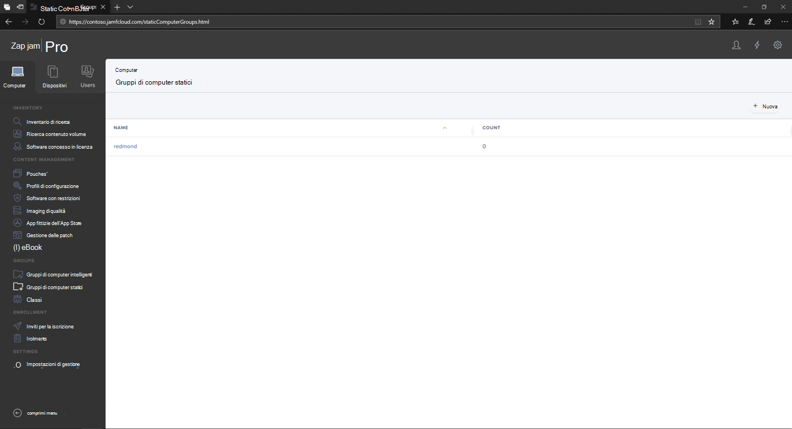

# Configurare Microsoft Defender per Endpoint nei gruppi di dispositivi macOS in Jamf ProSet up Microsoft Defender for Endpoint on macOS device groups in Jamf Pro

[!INCLUDE [Microsoft 365 Defender rebranding](../../includes/microsoft-defender.md)]

**Si applica a:****Applies to:**
- [Microsoft Defender per endpointMicrosoft Defender for Endpoint](https://go.microsoft.com/fwlink/p/?linkid=2154037)
- [Microsoft 365 DefenderMicrosoft 365 Defender](https://go.microsoft.com/fwlink/?linkid=2118804)

> Vuoi provare Defender per Endpoint?Want to experience Defender for Endpoint? [Iscriversi per una versione di valutazione gratuita.Sign up for a free trial.](https://www.microsoft.com/microsoft-365/windows/microsoft-defender-atp?ocid=docs-wdatp-investigateip-abovefoldlink)

Configurare i gruppi di dispositivi in modo simile alle unità organizzative (OU) di Criteri di gruppo, alla raccolta di dispositivi di Microsoft Endpoint Configuration Manager e ai gruppi di dispositivi di Intune.Set up the device groups similar to Group policy  organizational unite (OUs), Microsoft Endpoint Configuration Manager's device collection, and Intune's device groups.

1. Passare a **Gruppi di computer statici**.Navigate to **Static Computer Groups**.

2. Selezionare **Nuovo**.Select **New**. 

    

3. Specificare un nome visualizzato e selezionare **Salva**.Provide a display name and select **Save**.

    

4. A questo punto verrà visualizzato il **gruppo di computer di Contoso** in Gruppi di computer **statici**.Now you will see the **Contoso's Machine Group** under **Static Computer Groups**.

    

## Passaggio successivoNext step
- [Configurare Microsoft Defender per Endpoint nei criteri macOS in Jamf ProSet up Microsoft Defender for Endpoint on macOS policies in Jamf Pro](mac-jamfpro-policies.md)
