# Registrare Microsoft Defender per Endpoint nei dispositivi macOS in Jamf Pro 

[!INCLUDE [Microsoft 365 Defender rebranding](../../includes/microsoft-defender.md)]

**Si applica a:**
- [Microsoft Defender per endpoint](https://go.microsoft.com/fwlink/p/?linkid=2154037)
- [Microsoft 365 Defender](https://go.microsoft.com/fwlink/?linkid=2118804)

> Vuoi provare Defender per Endpoint? [Iscriversi per una versione di valutazione gratuita.](https://www.microsoft.com/microsoft-365/windows/microsoft-defender-atp?ocid=docs-wdatp-investigateip-abovefoldlink)

## Registrare dispositivi macOS

Esistono diversi metodi per la registrazione a JamF.

Questo articolo ti guiderà su due metodi:

- [Metodo 1: Inviti di registrazione](#enrollment-method-1-enrollment-invitations)
- [Metodo 2: Registrazioni prestage](#enrollment-method-2-prestage-enrollments)

Per un elenco completo, vedere [About Computer Enrollment.](https://docs.jamf.com/9.9/casper-suite/administrator-guide/About_Computer_Enrollment.html)

## Metodo di registrazione 1: inviti alla registrazione

1. Nel dashboard di Jamf Pro, accedere a **Inviti di registrazione.**

    

2. Selezionare **+ Nuovo**.

    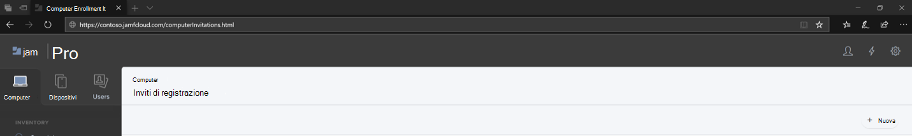

3. In **Specificare i destinatari per il >** in Indirizzi di posta **elettronica** immettere gli indirizzi di posta elettronica dei destinatari.

    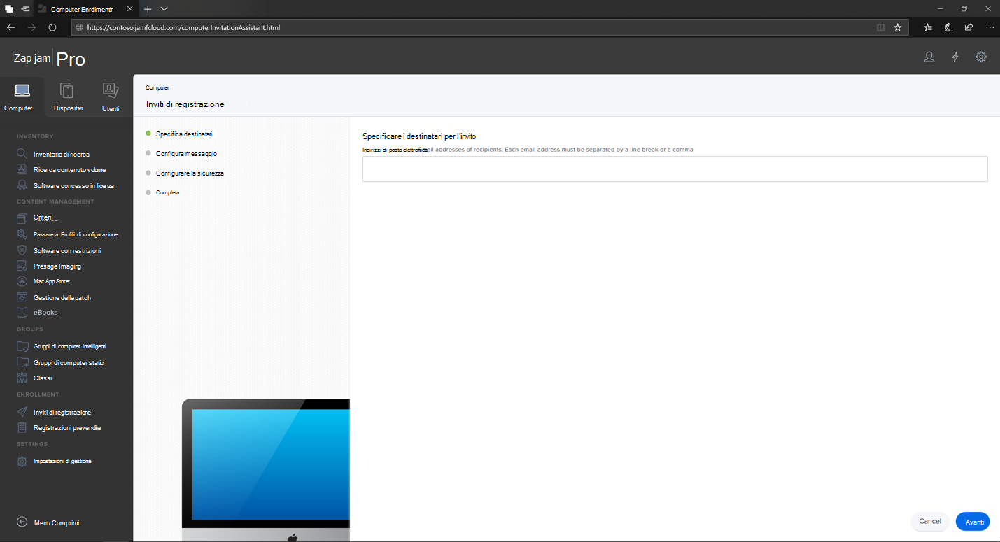

    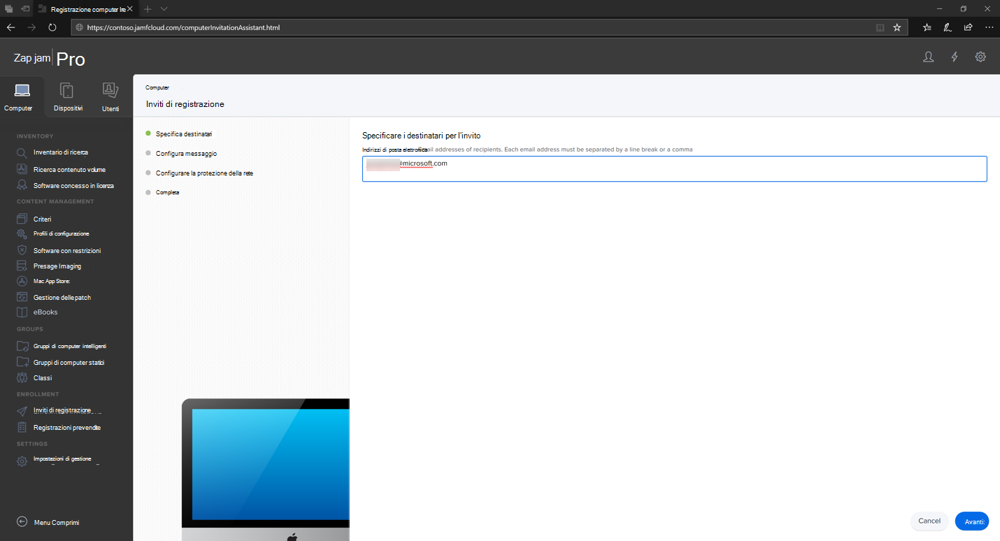

    Ad esempio: janedoe@contoso.com

    

4. Configurare il messaggio per l'invito.

    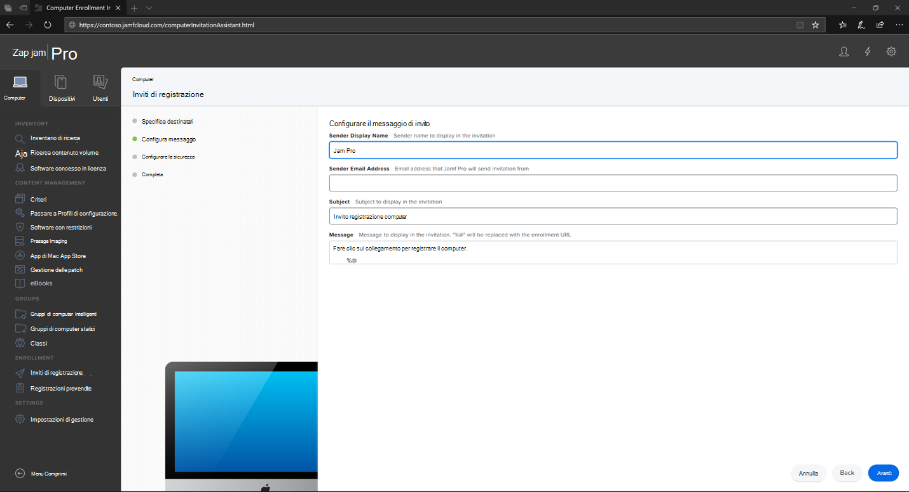

    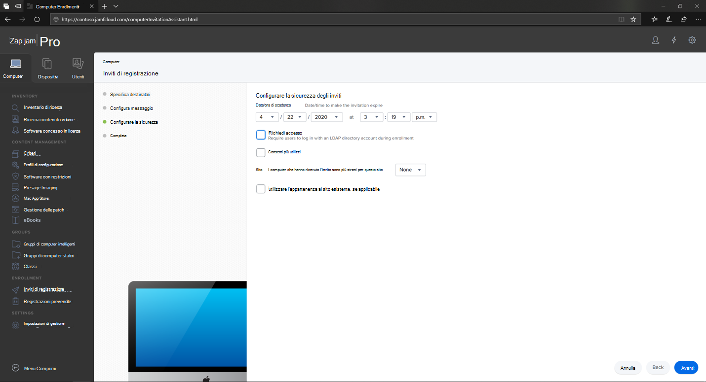

    

    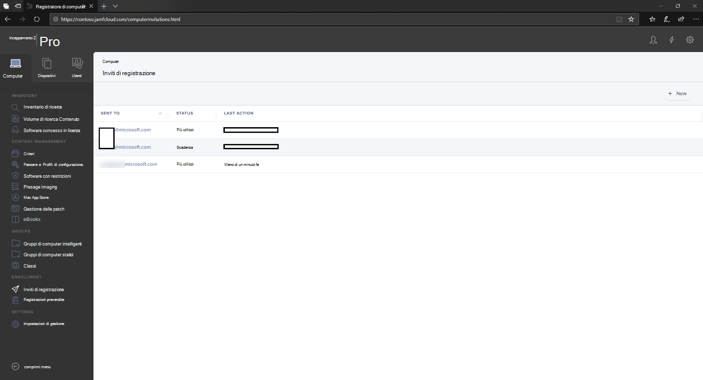

## Enrollment Method 2: Prestage Enrollments

1. Nel dashboard di Jamf Pro, passare a **Registrazioni prestage**.

    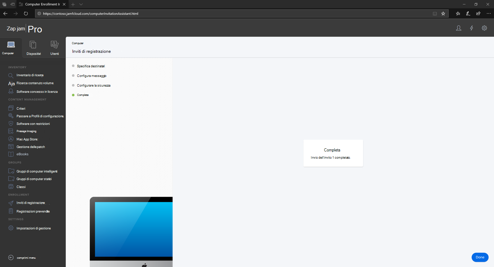

2. Seguire le istruzioni in [Computer PreStage Enrollments](https://docs.jamf.com/9.9/casper-suite/administrator-guide/Computer_PreStage_Enrollments.html).

## Registrare un dispositivo macOS

1. Seleziona **Continua** e installa il certificato CA da una **finestra Preferenze di** sistema.

    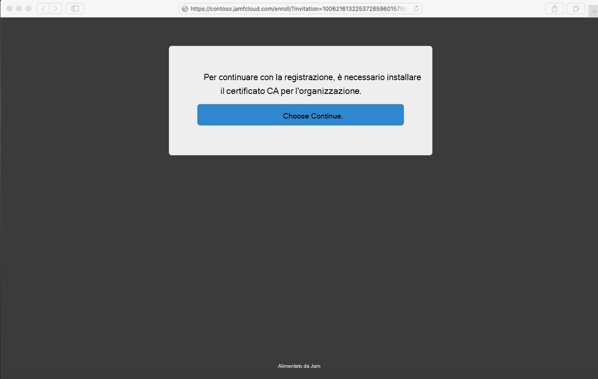

2. Dopo aver installato il certificato CA, torna alla finestra del browser e seleziona **Continua** e installa il profilo MDM. 

    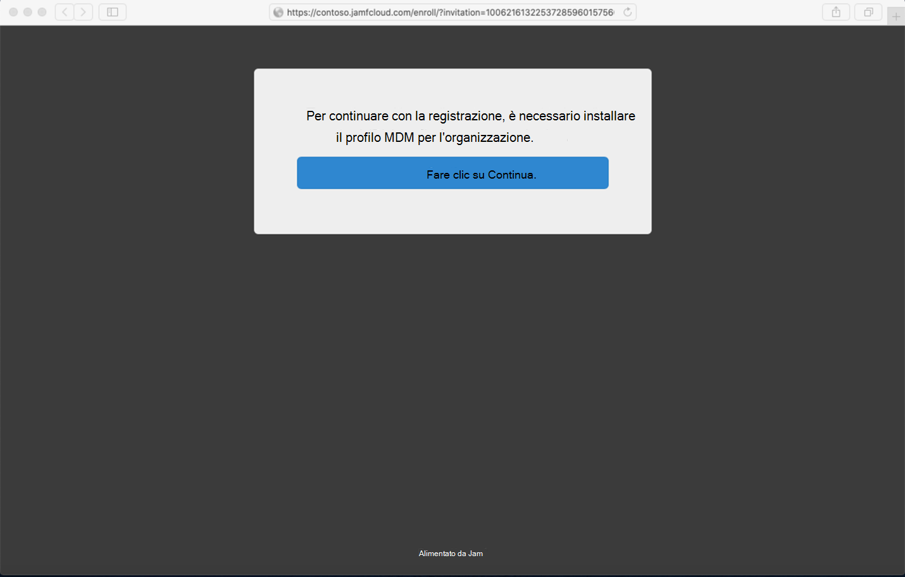

3. Seleziona **Consenti** download da JAMF.

    

4. Seleziona **Continua per** procedere con l'installazione del profilo MDM. 

    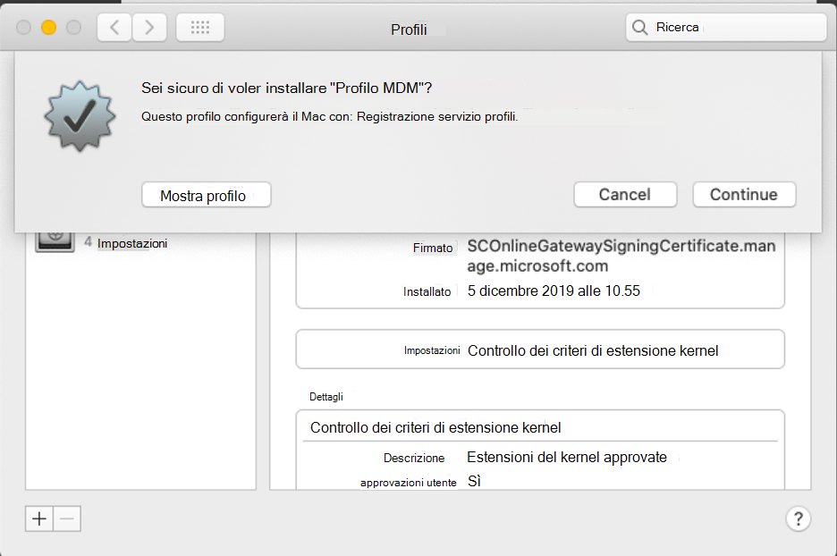

5. Seleziona **Continua** per installare il profilo MDM.

    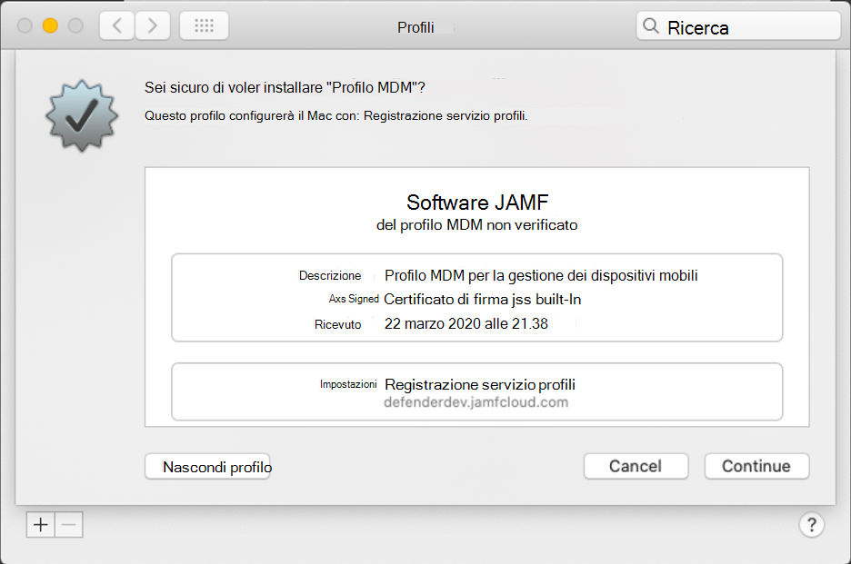

6. Selezionare **Continua**  per completare la configurazione. 

    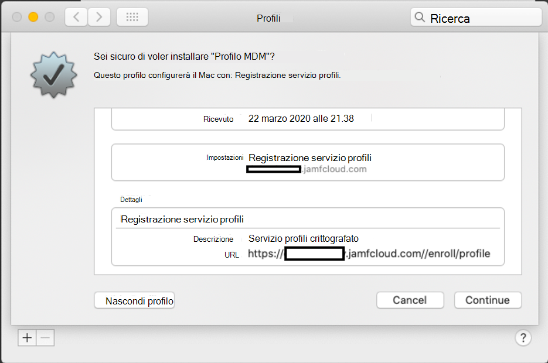
