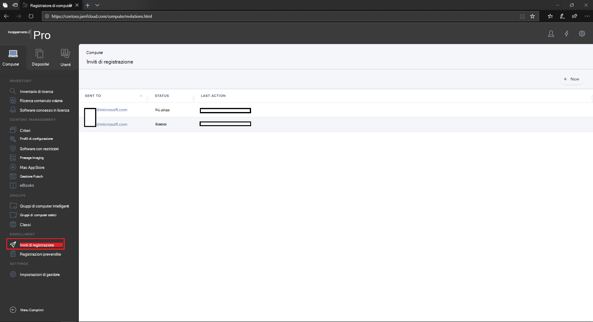
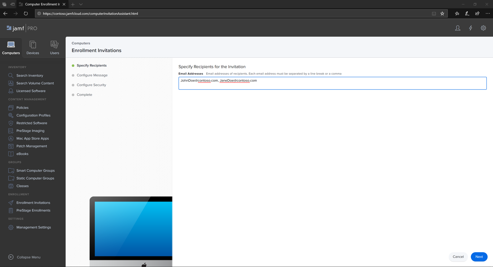

# Registrare Microsoft Defender per Endpoint per i dispositivi macOS in Jamf ProEnroll Microsoft Defender for Endpoint for macOS devices into Jamf Pro 

[!INCLUDE [Microsoft 365 Defender rebranding](../../includes/microsoft-defender.md)]

**Si applica a:****Applies to:**
- [Microsoft Defender per endpointMicrosoft Defender for Endpoint](https://go.microsoft.com/fwlink/p/?linkid=2154037)
- [Microsoft 365 DefenderMicrosoft 365 Defender](https://go.microsoft.com/fwlink/?linkid=2118804)

> Vuoi provare Defender per Endpoint?Want to experience Defender for Endpoint? [Iscriversi per una versione di valutazione gratuita.Sign up for a free trial.](https://www.microsoft.com/microsoft-365/windows/microsoft-defender-atp?ocid=docs-wdatp-investigateip-abovefoldlink)

## Registrare dispositivi macOSEnroll macOS devices

Esistono diversi metodi per la registrazione a JamF.There are multiple methods of getting enrolled to JamF.

Questo articolo ti guiderà su due metodi:This article will guide you on two methods:

- [Metodo 1: Inviti di registrazioneMethod 1:  Enrollment Invitations](#enrollment-method-1-enrollment-invitations)
- [Metodo 2: Registrazioni prestageMethod 2:  Prestage Enrollments](#enrollment-method-2-prestage-enrollments)

Per un elenco completo, vedere [About Computer Enrollment.](https://docs.jamf.com/9.9/casper-suite/administrator-guide/About_Computer_Enrollment.html)For a complete list, see [About Computer Enrollment](https://docs.jamf.com/9.9/casper-suite/administrator-guide/About_Computer_Enrollment.html).

## Metodo di registrazione 1: inviti alla registrazioneEnrollment Method 1: Enrollment Invitations

1. Nel dashboard di Jamf Pro, accedere a **Inviti di registrazione.**In the Jamf Pro dashboard, navigate to **Enrollment invitations**.

    

2. Selezionare **+ Nuovo**.Select **+ New**.

    

3. In **Specificare i destinatari per il >** in Indirizzi di posta **elettronica** immettere gli indirizzi di posta elettronica dei destinatari.In **Specify Recipients for the Invitation** > under **Email Addresses** enter the e-mail address(es) of the recipients.

    

    

    Ad esempio: janedoe@contoso.comFor example: janedoe@contoso.com

    

4. Configurare il messaggio per l'invito.Configure the message for the invitation.

    

    

    

    

## Enrollment Method 2: Prestage EnrollmentsEnrollment Method 2: Prestage Enrollments

1. Nel dashboard di Jamf Pro, passare a **Registrazioni prestage**.In the Jamf Pro dashboard, navigate to **Prestage enrollments**.

    

2. Seguire le istruzioni in [Computer PreStage Enrollments](https://docs.jamf.com/9.9/casper-suite/administrator-guide/Computer_PreStage_Enrollments.html).Follow the instructions in [Computer PreStage Enrollments](https://docs.jamf.com/9.9/casper-suite/administrator-guide/Computer_PreStage_Enrollments.html).

## Registrare un dispositivo macOSEnroll macOS device

1. Seleziona **Continua** e installa il certificato CA da una **finestra Preferenze di** sistema.Select **Continue** and install the CA certificate from a **System Preferences** window.

    

2. Dopo aver installato il certificato CA, torna alla finestra del browser e seleziona **Continua** e installa il profilo MDM.Once CA certificate is installed, return to the browser window and select **Continue** and install the MDM profile. 

    

3. Seleziona **Consenti** download da JAMF.Select **Allow** to downloads from JAMF.

    

4. Seleziona **Continua per** procedere con l'installazione del profilo MDM.Select **Continue** to proceed with the MDM Profile installation. 

    

5. Seleziona **Continua** per installare il profilo MDM.Select **Continue** to install the MDM Profile.

    

6. Selezionare **Continua**  per completare la configurazione.Select **Continue**  to complete the configuration. 

    
