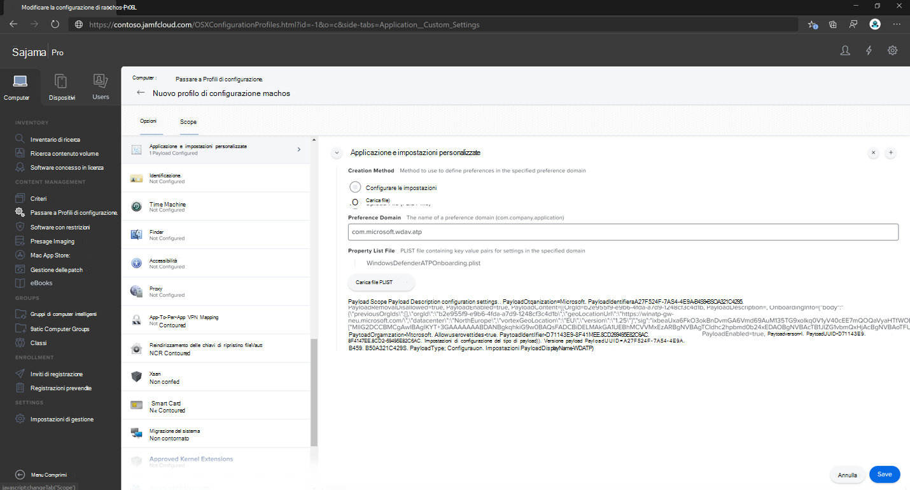
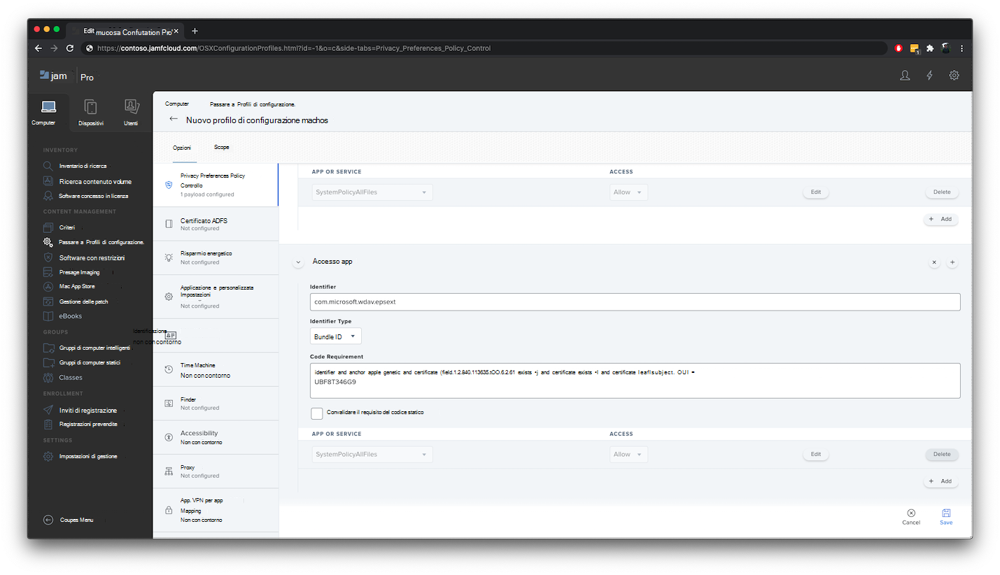

# <a name="set-up-the-microsoft-defender-for-endpoint-on-macos-policies-in-jamf-pro"></a>Configurare i criteri di Microsoft Defender for Endpoint su macOS in Jamf Pro

[!INCLUDE [Microsoft 365 Defender rebranding](../../includes/microsoft-defender.md)]


**Si applica a:**

- [Defender per Endpoint per Mac](microsoft-defender-endpoint-mac.md)

Questa pagina illustra i passaggi da eseguire per configurare i criteri macOS in Jamf Pro.

Dovrai eseguire la procedura seguente:

1. [Ottenere il pacchetto di onboarding di Microsoft Defender for Endpoint](#step-1-get-the-microsoft-defender-for-endpoint-onboarding-package)

2. [Creare un profilo di configurazione in Jamf Pro usando il pacchetto di onboarding](#step-2-create-a-configuration-profile-in-jamf-pro-using-the-onboarding-package)

3. [Configurare le impostazioni di Microsoft Defender per endpoint](#step-3-configure-microsoft-defender-for-endpoint-settings)

4. [Configurare le impostazioni di notifica di Microsoft Defender per endpoint](#step-4-configure-notifications-settings)

5. [Configurare Microsoft AutoUpdate (MAU)](#step-5-configure-microsoft-autoupdate-mau)

6. [Concedere l'accesso completo al disco a Microsoft Defender per Endpoint](#step-6-grant-full-disk-access-to-microsoft-defender-for-endpoint)

7. [Approvare l'estensione kernel per Microsoft Defender for Endpoint](#step-7-approve-kernel-extension-for-microsoft-defender-for-endpoint)

8. [Approvare le estensioni di sistema per Microsoft Defender per Endpoint](#step-8-approve-system-extensions-for-microsoft-defender-for-endpoint)

9. [Configurare l'estensione di rete](#step-9-configure-network-extension)

10. [Pianificare le analisi con Microsoft Defender per Endpoint in macOS](https://docs.microsoft.com/windows/security/threat-protection/microsoft-defender-atp/mac-schedule-scan-atp)

11. [Distribuire Microsoft Defender per Endpoint in macOS](#step-11-deploy-microsoft-defender-for-endpoint-on-macos)


## <a name="step-1-get-the-microsoft-defender-for-endpoint-onboarding-package"></a>Passaggio 1: ottenere il pacchetto di onboarding di Microsoft Defender for Endpoint

1. In [Microsoft Defender Security Center](https://securitycenter.microsoft.com )passare a Impostazioni > **Onboarding.** 

2. Seleziona macOS come sistema operativo e Gestione dispositivi mobili/ Microsoft Intune come metodo di distribuzione.

    

3. Seleziona **Scarica pacchetto di onboarding** (WindowsDefenderATPOnboardingPackage.zip).

4. `WindowsDefenderATPOnboardingPackage.zip`Estrai .

5. Copiare il file nella posizione preferita. Ad esempio,  `C:\Users\JaneDoe_or_JohnDoe.contoso\Downloads\WindowsDefenderATPOnboardingPackage_macOS_MDM_contoso\jamf\WindowsDefenderATPOnboarding.plist`.


## <a name="step-2-create-a-configuration-profile-in-jamf-pro-using-the-onboarding-package"></a>Passaggio 2: Creare un profilo di configurazione in Jamf Pro usando il pacchetto di onboarding

1. Individuare il file `WindowsDefenderATPOnboarding.plist` della sezione precedente.

   

 
2. Nel dashboard di Jamf Pro seleziona **Nuovo**.

    

3. Immettere i dettagli seguenti:

   **Generale**
   - Nome: onboarding MDATP per macOS
   - Descrizione: onboarding edR MDATP per macOS
   - Categoria: Nessuno
   - Metodo di distribuzione: installazione automatica
   - Livello: Livello computer

4. In **Impostazioni & impostazioni personalizzate selezionare** **Configura**.

    

5. Seleziona **Carica file (file PLIST),** quindi in **Dominio preferenza** immetti: `com.microsoft.wdav.atp` . 

    

    

7. Selezionare **Apri** e selezionare il file di onboarding.

    

8. Selezionare **Carica**. 

    


9. Selezionare la **scheda** Ambito.

    

10. Selezionare i computer di destinazione.

    

     

11. Selezionare **Salva**.

    

    

12. Scegliere **Fatto**.

    

    

## <a name="step-3-configure-microsoft-defender-for-endpoint-settings"></a>Passaggio 3: Configurare Le impostazioni di Microsoft Defender per endpoint

1.  Usa le impostazioni di configurazione di Microsoft Defender for Endpoint seguenti:

    - enableRealTimeProtection
    - passiveMode
    
    >[!NOTE]
    >Non attivato per impostazione predefinita, se si prevede di eseguire un av di terze parti per macOS, impostarlo su `true` .

    - esclusioni
    - excludedPath
    - excludedFileExtension
    - excludedFileName
    - exclusionsMergePolicy
    - allowedThreats
    
    >[!NOTE]
    >EICAR è nell'esempio, se si sta passando attraverso un modello di prova, rimuoverlo soprattutto se si sta testando EICAR.
        
    - disallowedThreatActions
    - potentially_unwanted_application
    - archive_bomb
    - cloudService
    - automaticSampleSubmission
    - tag
    - hideStatusMenuIcon
    
     Per informazioni, vedere [Elenco delle proprietà per il profilo di configurazione Jamf.](mac-preferences.md#property-list-for-jamf-configuration-profile)

     ```XML
     <?xml version="1.0" encoding="UTF-8"?>
     <!DOCTYPE plist PUBLIC "-//Apple//DTD PLIST 1.0//EN" "http://www.apple.com/DTDs/PropertyList-1.0.dtd">
     <plist version="1.0">
     <dict>
         <key>antivirusEngine</key>
         <dict>
             <key>enableRealTimeProtection</key>
             <true/>
             <key>passiveMode</key>
             <false/>
             <key>exclusions</key>
             <array>
                 <dict>
                     <key>$type</key>
                     <string>excludedPath</string>
                     <key>isDirectory</key>
                     <false/>
                     <key>path</key>
                     <string>/var/log/system.log</string>
                 </dict>
                 <dict>
                     <key>$type</key>
                     <string>excludedPath</string>
                     <key>isDirectory</key>
                     <true/>
                     <key>path</key>
                     <string>/home</string>
                 </dict>
                 <dict>
                     <key>$type</key>
                     <string>excludedFileExtension</string>
                     <key>extension</key>
                     <string>pdf</string>
                 </dict>
                 <dict>
                     <key>$type</key>
                     <string>excludedFileName</string>
                     <key>name</key>
                     <string>cat</string>
                 </dict>
             </array>
             <key>exclusionsMergePolicy</key>
             <string>merge</string>
             <key>allowedThreats</key>
             <array>
                 <string>EICAR-Test-File (not a virus)</string>
             </array>
             <key>disallowedThreatActions</key>
             <array>
                 <string>allow</string>
                 <string>restore</string>
             </array>
             <key>threatTypeSettings</key>
             <array>
                 <dict>
                     <key>key</key>
                     <string>potentially_unwanted_application</string>
                     <key>value</key>
                     <string>block</string>
                 </dict>
                 <dict>
                     <key>key</key>
                     <string>archive_bomb</string>
                     <key>value</key>
                     <string>audit</string>
                 </dict>
             </array>
             <key>threatTypeSettingsMergePolicy</key>
             <string>merge</string>
         </dict>
         <key>cloudService</key>
         <dict>
             <key>enabled</key>
             <true/>
             <key>diagnosticLevel</key>
             <string>optional</string>
             <key>automaticSampleSubmission</key>
             <true/>
         </dict>
         <key>edr</key>
         <dict>
             <key>tags</key>
             <array>
                 <dict>
                     <key>key</key>
                     <string>GROUP</string>
                     <key>value</key>
                     <string>ExampleTag</string>
                 </dict>
             </array>
         </dict>
         <key>userInterface</key>
         <dict>
             <key>hideStatusMenuIcon</key>
             <false/>
         </dict>
     </dict>
     </plist>
     ```

2. Salvare il file con nome `MDATP_MDAV_configuration_settings.plist` .


3.  Nel dashboard jamf pro selezionare **Generale.**

    

4. Immettere i dettagli seguenti:

    **Generale**
    
    - Nome: Impostazioni di configurazione MDATP MDAV
    - Descrizione:\<blank\>
    - Categoria: Nessuna (impostazione predefinita)
    - Metodo di distribuzione: installa automaticamente (impostazione predefinita)
    - Livello: Livello computer(impostazione predefinita)

    

5. In **Impostazioni & impostazioni personalizzate selezionare** **Configura**.

    

6. Selezionare **Carica file (file PLIST).**

    

7. In **Preferences Domain** immettere , quindi selezionare Upload `com.microsoft.wdav`  **PLIST File**.

    

8. Selezionare **Scegli file**.

    

9. Seleziona il **MDATP_MDAV_configuration_settings.plist** e quindi seleziona **Apri.**

    

10. Selezionare **Carica**.

    

    

    >[!NOTE]
    >Se si carica il file di Intune, verrà visualizzato l'errore seguente:<br>
    >


11. Selezionare **Salva**. 

    

12. Il file viene caricato.

    

    

13. Selezionare la **scheda** Ambito.

    

14. Selezionare **Gruppo di computer di Contoso**. 

15. Seleziona **Aggiungi** e **quindi** Salva.

    

    

16. Scegliere **Fatto**. Verrà visualizzato il nuovo profilo **di configurazione**.

    


## <a name="step-4-configure-notifications-settings"></a>Passaggio 4: Configurare le impostazioni delle notifiche

Questi passaggi sono applicabili a macOS 10.15 (Catalina) o versioni successive.

1. Nel dashboard di Jamf Pro seleziona **Computer**, quindi **Profili di configurazione**.

2. Fare **clic su** Nuovo e immettere i dettagli seguenti per **Opzioni:**
    
    - Scheda **Generale**: 
        - **Name**: MDATP MDAV Notification settings
        - **Descrizione**: macOS 10.15 (Catalina) o versione più recente
        - **Category**: None *(impostazione predefinita)*
        - **Metodo di distribuzione**: Installa *automaticamente (impostazione predefinita)*
        - **Level**: Computer Level *(impostazione predefinita)*

        

    - Scheda **Notifiche**, fare **clic su Aggiungi** e immettere i valori seguenti:
        - **ID bundle**: `com.microsoft.wdav.tray`
        - **Avvisi critici**: fare clic su **Disabilita**
        - **Notifiche**: fare clic su **Abilita**
        - **Tipo di avviso banner:** selezionare **Includi** e **temporaneo** *(impostazione predefinita)*
        - **Notifiche nella schermata di blocco**: fare clic su **Nascondi**
        - **Notifiche nel Centro notifiche**: fare clic **su Visualizza**
        - **Icona dell'app Badge**: fare clic su **Visualizza**

        

    - Scheda **Notifiche,** fare **clic su Aggiungi** ancora una volta, scorrere verso il basso fino a Nuove impostazioni **notifiche**
        - **ID bundle**: `com.microsoft.autoupdate2`
        - Configurare il resto delle impostazioni con gli stessi valori di cui sopra

        

        Tieni presente che ora hai due "tabelle" con configurazioni di notifica, una per **l'ID bundle: com.microsoft.wdav.tray** e un'altra per l'ID **bundle: com.microsoft.autoupdate2.** Sebbene sia possibile configurare le impostazioni degli avvisi in base ai propri requisiti, gli ID bundle devono essere esattamente gli stessi descritti in precedenza e l'opzione **Includi** deve essere **attivata** per le **notifiche.**

3. Seleziona la **scheda Ambito,** quindi seleziona **Aggiungi.**

    

4. Selezionare **Gruppo di computer di Contoso**. 

5. Seleziona **Aggiungi** e **quindi** Salva.
    
    
    
    

6. Scegliere **Fatto**. Verrà visualizzato il nuovo profilo **di configurazione**.
    

## <a name="step-5-configure-microsoft-autoupdate-mau"></a>Passaggio 5: Configurare Microsoft AutoUpdate (MAU)

1. Usa le impostazioni di configurazione di Microsoft Defender for Endpoint seguenti:

      ```XML
   <?xml version="1.0" encoding="UTF-8"?>
   <!DOCTYPE plist PUBLIC "-//Apple//DTD PLIST 1.0//EN" "http://www.apple.com/DTDs/PropertyList-1.0.dtd">
   <plist version="1.0">
   <dict>
    <key>ChannelName</key>
    <string>Current</string>
    <key>HowToCheck</key>
    <string>AutomaticDownload</string>
    <key>EnableCheckForUpdatesButton</key>
    <true/>
    <key>DisableInsiderCheckbox</key>
    <false/>
    <key>SendAllTelemetryEnabled</key>
    <true/>
   </dict>
   </plist>
   ```

2. Salvarlo con nome `MDATP_MDAV_MAU_settings.plist` .

3. Nel dashboard jamf pro selezionare **Generale.** 

    

4. Immettere i dettagli seguenti:

    **Generale** 
    
    - Nome: Impostazioni MDATP MDAV MAU
    - Descrizione: impostazioni di Microsoft AutoUpdate per MDATP per macOS
    - Categoria: Nessuna (impostazione predefinita)
    - Metodo di distribuzione: installa automaticamente (impostazione predefinita)
    - Livello: Livello computer(impostazione predefinita)

5. In **Impostazioni & impostazioni personalizzate selezionare** **Configura**.

    

6. Selezionare **Carica file (file PLIST).**

      

7. In **Dominio preferenza** immettere: , quindi selezionare Carica file `com.microsoft.autoupdate2` **PLIST**.

    

8. Selezionare **Scegli file**.

    

9. Selezionare **MDATP_MDAV_MAU_settings.plist**.

    

10. Selezionare **Carica**.
    

    

11. Selezionare **Salva**.

    

12. Selezionare la **scheda** Ambito.
   
     

13. Selezionare **Aggiungi**.
    
    

    

    

14. Scegliere **Fatto**.
    
    

## <a name="step-6-grant-full-disk-access-to-microsoft-defender-for-endpoint"></a>Passaggio 6: concedere l'accesso completo al disco a Microsoft Defender per Endpoint

1. Nel dashboard di Jamf Pro seleziona **Profili di configurazione.**

    

2. Selezionare **+ Nuovo**. 

3. Immettere i dettagli seguenti:

    **Generale** 
    - Name: MDATP MDAV - grant Full Disk Access to EDR and AV
    - Descrizione: in macOS Catalina o versioni più nuove, il nuovo controllo dei criteri delle preferenze sulla privacy
    - Categoria: Nessuno
    - Metodo di distribuzione: installazione automatica
    - Livello: livello computer


    

4. In **Configure Privacy Preferences Policy Control** selezionare **Configure**.

    

5. In **Privacy Preferences Policy Control** immetti i dettagli seguenti:

    - Identificatore: `com.microsoft.wdav`
    - Tipo di identificatore: ID bundle
    - Requisiti del codice: `identifier "com.microsoft.wdav" and anchor apple generic and certificate 1[field.1.2.840.113635.100.6.2.6] /* exists */ and certificate leaf[field.1.2.840.113635.100.6.1.13] /* exists */ and certificate leaf[subject.OU] = UBF8T346G9`


    

6. Selezionare **+ Aggiungi**.

    

    - In App o servizio: impostata su **SystemPolicyAllFiles**

    - In "accesso": impostata su **Consenti**

7. Seleziona **Salva** (non quello in basso a destra).

    

8. Fare clic `+` sul segno accanto ad Accesso **app** per aggiungere una nuova voce.

    

9. Immettere i dettagli seguenti:

    - Identificatore: `com.microsoft.wdav.epsext`
    - Tipo di identificatore: ID bundle
    - Requisiti del codice: `identifier "com.microsoft.wdav.epsext" and anchor apple generic and certificate 1[field.1.2.840.113635.100.6.2.6] /* exists */ and certificate leaf[field.1.2.840.113635.100.6.1.13] /* exists */ and certificate leaf[subject.OU] = UBF8T346G9`

10. Selezionare **+ Aggiungi**.

    

    - In App o servizio: impostata su **SystemPolicyAllFiles**

    - In "accesso": impostata su **Consenti**

11. Seleziona **Salva** (non quello in basso a destra).

    

12. Selezionare la **scheda** Ambito.

    

13. Selezionare **+ Aggiungi**.

    

14. Selezionare **Gruppi di** computer > in Nome gruppo **>** selezionare **MachineGroup di Contoso.** 

    

15. Selezionare **Aggiungi**. 

16. Selezionare **Salva**. 
    
17. Scegliere **Fatto**.
    
    
    
    

In alternativa, è possibile scaricare [fulldisk.mobileconfig](https://github.com/microsoft/mdatp-xplat/blob/master/macos/mobileconfig/profiles/fulldisk.mobileconfig) e caricarlo nei profili di configurazione JAMF come descritto in [Deploying Custom Configuration Profiles using Jamf Pro| Metodo 2: Caricare un profilo di configurazione in Jamf Pro.](https://www.jamf.com/jamf-nation/articles/648/deploying-custom-configuration-profiles-using-jamf-pro)

## <a name="step-7-approve-kernel-extension-for-microsoft-defender-for-endpoint"></a>Passaggio 7: Approvare l'estensione kernel per Microsoft Defender for Endpoint

> [!CAUTION]
> I dispositivi Apple Silicon (M1) non supportano KEXT. L'installazione di un profilo di configurazione costituito da criteri KEXT avrà esito negativo in questi dispositivi.

1. In **Profili di configurazione** selezionare **+ Nuovo**.

    

2. Immettere i dettagli seguenti:

    **Generale** 
    
    - Nome: MDATP MDAV Kernel Extension
    - Descrizione: estensione del kernel MDATP (kext)
    - Categoria: Nessuno
    - Metodo di distribuzione: installazione automatica
    - Livello: Livello computer

    

3. In **Configura estensioni kernel approvate** selezionare **Configura**.

    

   
4. In **Estensioni kernel approvate** immettere i dettagli seguenti:

    - Nome visualizzato: Microsoft Corp.
    - ID team: UBF8T346G9

    

5. Selezionare la **scheda** Ambito.

    

6. Selezionare **+ Aggiungi**.

7. Selezionare **Gruppi di** > in Nome gruppo **>** selezionare Gruppo di computer **di Contoso**.

8. Selezionare **+ Aggiungi**.

    

9. Selezionare **Salva**.

    

10. Scegliere **Fatto**.

    

In alternativa, è possibile scaricare [kext.mobileconfig](https://github.com/microsoft/mdatp-xplat/blob/master/macos/mobileconfig/profiles/kext.mobileconfig) e caricarlo nei profili di configurazione JAMF come descritto in [Deploying Custom Configuration Profiles using Jamf Pro| Metodo 2: Caricare un profilo di configurazione in Jamf Pro.](https://www.jamf.com/jamf-nation/articles/648/deploying-custom-configuration-profiles-using-jamf-pro)

## <a name="step-8-approve-system-extensions-for-microsoft-defender-for-endpoint"></a>Passaggio 8: Approvare le estensioni di sistema per Microsoft Defender for Endpoint

1. In **Profili di configurazione** selezionare **+ Nuovo**.

    

2. Immettere i dettagli seguenti:

    **Generale**
    
    - Nome: MDATP MDAV System Extensions
    - Descrizione: estensioni di sistema MDATP
    - Categoria: Nessuno
    - Metodo di distribuzione: installazione automatica
    - Livello: Livello computer

    

3. In **Estensioni di sistema** selezionare **Configura**.

   

4. In **Estensioni di sistema** immettere i dettagli seguenti:

   - Nome visualizzato: Microsoft Corp. Estensioni di sistema
   - Tipi di estensioni di sistema: estensioni di sistema consentite
   - Identificatore del team: UBF8T346G9
   - Estensioni di sistema consentite:
     - **com.microsoft.wdav.epsext**
     - **com.microsoft.wdav.netext**

    

5. Selezionare la **scheda** Ambito.

    

6. Selezionare **+ Aggiungi**.

7. Selezionare **Gruppi di** > in Nome gruppo **>** selezionare Gruppo di computer **di Contoso**.

8. Selezionare **+ Aggiungi**.

   

9. Selezionare **Salva**.

   

10. Scegliere **Fatto**.

    

## <a name="step-9-configure-network-extension"></a>Passaggio 9: Configurare l'estensione di rete

Come parte delle funzionalità di rilevamento e risposta degli endpoint, Microsoft Defender for Endpoint su macOS esamina il traffico socket e segnala queste informazioni al portale di Microsoft Defender Security Center. Il criterio seguente consente all'estensione di rete di eseguire questa funzionalità.

Questi passaggi sono applicabili a macOS 10.15 (Catalina) o versioni successive.

1. Nel dashboard di Jamf Pro seleziona **Computer**, quindi **Profili di configurazione**.

2. Fare **clic su** Nuovo e immettere i dettagli seguenti per **Opzioni:**

    - Scheda **Generale**: 
        - **Nome**: Estensione di rete di Microsoft Defender ATP
        - **Descrizione**: macOS 10.15 (Catalina) o versione più recente
        - **Category**: None *(impostazione predefinita)*
        - **Metodo di distribuzione**: Installa *automaticamente (impostazione predefinita)*
        - **Level**: Computer Level *(impostazione predefinita)*

    - Filtro **contenuto scheda**:
        - **Nome filtro**: Filtro contenuto di Microsoft Defender ATP
        - **Identificatore**: `com.microsoft.wdav`
        - Lasciare **vuoto l'indirizzo** **del** servizio, l'organizzazione, **il** nome utente, la **password,** **il** certificato (**Include** *non è* selezionato)
        - **Filter Order**: Inspector
        - **Filtro socket**: `com.microsoft.wdav.netext`
        - **Socket Filter Designated Requirement**: `identifier "com.microsoft.wdav.netext" and anchor apple generic and certificate 1[field.1.2.840.113635.100.6.2.6] /* exists */ and certificate leaf[field.1.2.840.113635.100.6.1.13] /* exists */ and certificate leaf[subject.OU] = UBF8T346G9`
        - Lasciare **vuoti i** campi filtro di rete **(l'opzione** Includi *non è* selezionata)

        Tieni presente **che i valori di Identifier,** Socket **Filter** e Socket **Filter Designated Requirement** sono esattamente come specificato in precedenza.

        

3. Selezionare la **scheda** Ambito.

   

4. Selezionare **+ Aggiungi**.

5. Selezionare **Gruppi di** > in Nome gruppo **>** selezionare Gruppo di computer **di Contoso**.

6. Selezionare **+ Aggiungi**.

    

7. Selezionare **Salva**.

    

8. Scegliere **Fatto**.

    

In alternativa, è possibile scaricare [netfilter.mobileconfig](https://github.com/microsoft/mdatp-xplat/blob/master/macos/mobileconfig/profiles/netfilter.mobileconfig) e caricarlo nei profili di configurazione JAMF come descritto in [Deploying Custom Configuration Profiles using Jamf Pro| Metodo 2: Caricare un profilo di configurazione in Jamf Pro.](https://www.jamf.com/jamf-nation/articles/648/deploying-custom-configuration-profiles-using-jamf-pro)

## <a name="step-10-schedule-scans-with-microsoft-defender-for-endpoint-on-macos"></a>Passaggio 10: pianificare le analisi con Microsoft Defender for Endpoint in macOS
Segui le istruzioni su [Pianifica analisi con Microsoft Defender for Endpoint in macOS.](https://docs.microsoft.com/windows/security/threat-protection/microsoft-defender-atp/mac-schedule-scan-atp)

## <a name="step-11-deploy-microsoft-defender-for-endpoint-on-macos"></a>Passaggio 11: Distribuire Microsoft Defender per Endpoint in macOS

1. Passare al percorso in cui è stato salvato `wdav.pkg` .

    

2. Rinominarlo in `wdav_MDM_Contoso_200329.pkg` .

    

3. Apri il dashboard di Jamf Pro.

    

4. Seleziona il computer e fai clic sull'icona a forma di ingranaggio nella parte superiore, quindi seleziona **Gestione computer.**

    

5. In **Pacchetti** seleziona **+ Nuovo**. 
    

6. In **Nuovo pacchetto** immetti i dettagli seguenti:

    **Scheda Generale**
    - Nome visualizzato: lasciare vuoto per il momento. Perché verrà reimpostato quando scegli il tuo pkg.
    - Categoria: Nessuna (impostazione predefinita)
    - Filename: Choose File

    

    Aprire il file e puntare a `wdav.pkg` o `wdav_MDM_Contoso_200329.pkg` .
    
    

7. Seleziona **Apri**. Imposta il **nome visualizzato su** Microsoft Defender Advanced Threat Protection e Microsoft Defender **Antivirus.**

    **File manifesto** non obbligatorio. Microsoft Defender Advanced Threat Protection funziona senza file manifesto.
    
    **Scheda Opzioni**<br> Mantenere i valori predefiniti.

    **Scheda Limitazioni**<br> Mantenere i valori predefiniti.
    
     
   
8. Selezionare **Salva**. Il pacchetto viene caricato in Jamf Pro. 

   

   La distribuzione del pacchetto può richiedere alcuni minuti.
   
   

9. Passare alla **pagina** Criteri.

    

10. Selezionare **+ Nuovo** per creare un nuovo criterio.

    


11. In **Generale** Immettere i dettagli seguenti:

    - Nome visualizzato: MDATP Onboarding Contoso 200329 v100.86.92 o versione successiva

    

12. Selezionare **Archiviazione ricorrente.** 
    
    

  
13. Selezionare **Salva**. 
 
14. Selezionare **Pacchetti > Configura**.
 
    

15. Seleziona il **pulsante** Aggiungi accanto a **Microsoft Defender Advanced Threat Protection e Microsoft Defender Antivirus.**

    

16. Selezionare **Salva**.

    

17. Selezionare la **scheda** Ambito.  

    

18. Selezionare i computer di destinazione.

    

    **Ambito**
    
    Selezionare **Aggiungi**.
    
    

    

    **Self-Service**
    
    

19. Scegliere **Fatto**. 

    

    


