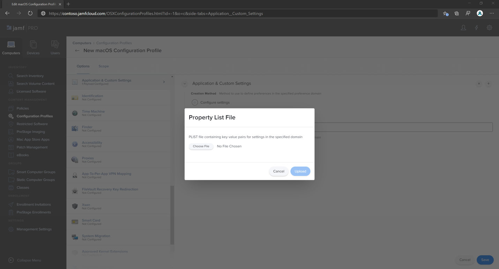

# <a name="set-up-the-microsoft-defender-for-endpoint-on-macos-policies-in-jamf-pro"></a><span data-ttu-id="5a356-104">Configurare i criteri di Microsoft Defender per Endpoint su macOS in Jamf Pro</span><span class="sxs-lookup"><span data-stu-id="5a356-104">Set up the Microsoft Defender for Endpoint on macOS policies in Jamf Pro</span></span>

[!INCLUDE [Microsoft 365 Defender rebranding](../../includes/microsoft-defender.md)]


<span data-ttu-id="5a356-105">**Si applica a:**</span><span class="sxs-lookup"><span data-stu-id="5a356-105">**Applies to:**</span></span>

- [<span data-ttu-id="5a356-106">Defender per Endpoint su Mac</span><span class="sxs-lookup"><span data-stu-id="5a356-106">Defender for Endpoint on Mac</span></span>](microsoft-defender-endpoint-mac.md)

<span data-ttu-id="5a356-107">Questa pagina illustra i passaggi da eseguire per configurare i criteri macOS in Jamf Pro.</span><span class="sxs-lookup"><span data-stu-id="5a356-107">This page will guide you through the steps you need to take to set up macOS policies in Jamf Pro.</span></span>

<span data-ttu-id="5a356-108">Dovrai eseguire la procedura seguente:</span><span class="sxs-lookup"><span data-stu-id="5a356-108">You'll need to take the following steps:</span></span>

1. [<span data-ttu-id="5a356-109">Ottenere il pacchetto di onboarding di Microsoft Defender for Endpoint</span><span class="sxs-lookup"><span data-stu-id="5a356-109">Get the Microsoft Defender for Endpoint onboarding package</span></span>](#step-1-get-the-microsoft-defender-for-endpoint-onboarding-package)

2. [<span data-ttu-id="5a356-110">Creare un profilo di configurazione in Jamf Pro il pacchetto di onboarding</span><span class="sxs-lookup"><span data-stu-id="5a356-110">Create a configuration profile in Jamf Pro using the onboarding package</span></span>](#step-2-create-a-configuration-profile-in-jamf-pro-using-the-onboarding-package)

3. [<span data-ttu-id="5a356-111">Configurare le impostazioni di Microsoft Defender per endpoint</span><span class="sxs-lookup"><span data-stu-id="5a356-111">Configure Microsoft Defender for Endpoint settings</span></span>](#step-3-configure-microsoft-defender-for-endpoint-settings)

4. [<span data-ttu-id="5a356-112">Configurare le impostazioni di notifica di Microsoft Defender per endpoint</span><span class="sxs-lookup"><span data-stu-id="5a356-112">Configure Microsoft Defender for Endpoint notification settings</span></span>](#step-4-configure-notifications-settings)

5. [<span data-ttu-id="5a356-113">Configurare Microsoft AutoUpdate (MAU)</span><span class="sxs-lookup"><span data-stu-id="5a356-113">Configure Microsoft AutoUpdate (MAU)</span></span>](#step-5-configure-microsoft-autoupdate-mau)

6. [<span data-ttu-id="5a356-114">Concedere l'accesso completo al disco a Microsoft Defender per Endpoint</span><span class="sxs-lookup"><span data-stu-id="5a356-114">Grant full disk access to Microsoft Defender for Endpoint</span></span>](#step-6-grant-full-disk-access-to-microsoft-defender-for-endpoint)

7. [<span data-ttu-id="5a356-115">Approvare l'estensione kernel per Microsoft Defender for Endpoint</span><span class="sxs-lookup"><span data-stu-id="5a356-115">Approve Kernel extension for Microsoft Defender for Endpoint</span></span>](#step-7-approve-kernel-extension-for-microsoft-defender-for-endpoint)

8. [<span data-ttu-id="5a356-116">Approvare le estensioni di sistema per Microsoft Defender per Endpoint</span><span class="sxs-lookup"><span data-stu-id="5a356-116">Approve System extensions for Microsoft Defender for Endpoint</span></span>](#step-8-approve-system-extensions-for-microsoft-defender-for-endpoint)

9. [<span data-ttu-id="5a356-117">Configurare l'estensione di rete</span><span class="sxs-lookup"><span data-stu-id="5a356-117">Configure Network Extension</span></span>](#step-9-configure-network-extension)

10. [<span data-ttu-id="5a356-118">Pianificare le analisi con Microsoft Defender per Endpoint in macOS</span><span class="sxs-lookup"><span data-stu-id="5a356-118">Schedule scans with Microsoft Defender for Endpoint on macOS</span></span>](/windows/security/threat-protection/microsoft-defender-atp/mac-schedule-scan-atp)

11. [<span data-ttu-id="5a356-119">Distribuire Microsoft Defender per Endpoint in macOS</span><span class="sxs-lookup"><span data-stu-id="5a356-119">Deploy Microsoft Defender for Endpoint on macOS</span></span>](#step-11-deploy-microsoft-defender-for-endpoint-on-macos)


## <a name="step-1-get-the-microsoft-defender-for-endpoint-onboarding-package"></a><span data-ttu-id="5a356-120">Passaggio 1: ottenere il pacchetto di onboarding di Microsoft Defender for Endpoint</span><span class="sxs-lookup"><span data-stu-id="5a356-120">Step 1: Get the Microsoft Defender for Endpoint onboarding package</span></span>

1. <span data-ttu-id="5a356-121">In [Microsoft Defender Security Center](https://securitycenter.microsoft.com ), passare a **Impostazioni > Onboarding**.</span><span class="sxs-lookup"><span data-stu-id="5a356-121">In [Microsoft Defender Security Center](https://securitycenter.microsoft.com ), navigate to **Settings > Onboarding**.</span></span> 

2. <span data-ttu-id="5a356-122">Seleziona macOS come sistema operativo e Gestione dispositivi mobili /Microsoft Intune come metodo di distribuzione.</span><span class="sxs-lookup"><span data-stu-id="5a356-122">Select macOS as the operating system and Mobile Device Management / Microsoft Intune as the deployment method.</span></span>

    

3. <span data-ttu-id="5a356-124">Seleziona **Scarica pacchetto di onboarding** (WindowsDefenderATPOnboardingPackage.zip).</span><span class="sxs-lookup"><span data-stu-id="5a356-124">Select **Download onboarding package** (WindowsDefenderATPOnboardingPackage.zip).</span></span>

4. <span data-ttu-id="5a356-125">`WindowsDefenderATPOnboardingPackage.zip`Estrai .</span><span class="sxs-lookup"><span data-stu-id="5a356-125">Extract `WindowsDefenderATPOnboardingPackage.zip`.</span></span>

5. <span data-ttu-id="5a356-126">Copiare il file nella posizione preferita.</span><span class="sxs-lookup"><span data-stu-id="5a356-126">Copy the file to your preferred location.</span></span> <span data-ttu-id="5a356-127">Ad esempio,  `C:\Users\JaneDoe_or_JohnDoe.contoso\Downloads\WindowsDefenderATPOnboardingPackage_macOS_MDM_contoso\jamf\WindowsDefenderATPOnboarding.plist`.</span><span class="sxs-lookup"><span data-stu-id="5a356-127">For example,  `C:\Users\JaneDoe_or_JohnDoe.contoso\Downloads\WindowsDefenderATPOnboardingPackage_macOS_MDM_contoso\jamf\WindowsDefenderATPOnboarding.plist`.</span></span>


## <a name="step-2-create-a-configuration-profile-in-jamf-pro-using-the-onboarding-package"></a><span data-ttu-id="5a356-128">Passaggio 2: Creare un profilo di configurazione in Jamf Pro il pacchetto di onboarding</span><span class="sxs-lookup"><span data-stu-id="5a356-128">Step 2: Create a configuration profile in Jamf Pro using the onboarding package</span></span>

1. <span data-ttu-id="5a356-129">Individuare il file `WindowsDefenderATPOnboarding.plist` della sezione precedente.</span><span class="sxs-lookup"><span data-stu-id="5a356-129">Locate the file `WindowsDefenderATPOnboarding.plist` from the previous section.</span></span>

   

 
2. <span data-ttu-id="5a356-131">Nel dashboard jamf Pro selezionare **Nuovo**.</span><span class="sxs-lookup"><span data-stu-id="5a356-131">In the Jamf Pro dashboard, select **New**.</span></span>

    

3. <span data-ttu-id="5a356-133">Immettere i dettagli seguenti:</span><span class="sxs-lookup"><span data-stu-id="5a356-133">Enter the following details:</span></span>

   <span data-ttu-id="5a356-134">**Generale**</span><span class="sxs-lookup"><span data-stu-id="5a356-134">**General**</span></span>
   - <span data-ttu-id="5a356-135">Nome: onboarding MDATP per macOS</span><span class="sxs-lookup"><span data-stu-id="5a356-135">Name: MDATP onboarding for macOS</span></span>
   - <span data-ttu-id="5a356-136">Descrizione: onboarding EDR MDATP per macOS</span><span class="sxs-lookup"><span data-stu-id="5a356-136">Description: MDATP EDR onboarding for macOS</span></span>
   - <span data-ttu-id="5a356-137">Categoria: Nessuno</span><span class="sxs-lookup"><span data-stu-id="5a356-137">Category: None</span></span>
   - <span data-ttu-id="5a356-138">Metodo di distribuzione: installazione automatica</span><span class="sxs-lookup"><span data-stu-id="5a356-138">Distribution Method: Install Automatically</span></span>
   - <span data-ttu-id="5a356-139">Livello: Livello computer</span><span class="sxs-lookup"><span data-stu-id="5a356-139">Level: Computer Level</span></span>

4. <span data-ttu-id="5a356-140">In **Applicazione & personalizzata Impostazioni** selezionare **Configura**.</span><span class="sxs-lookup"><span data-stu-id="5a356-140">In **Application & Custom Settings** select **Configure**.</span></span>

    

5. <span data-ttu-id="5a356-142">Selezionare **Upload File (file PLIST),** quindi in **Dominio preferenza** immettere: `com.microsoft.wdav.atp` .</span><span class="sxs-lookup"><span data-stu-id="5a356-142">Select **Upload File (PLIST file)** then in **Preference Domain** enter: `com.microsoft.wdav.atp`.</span></span> 

    

    

6. <span data-ttu-id="5a356-145">Selezionare **Apri** e selezionare il file di onboarding.</span><span class="sxs-lookup"><span data-stu-id="5a356-145">Select **Open** and select the onboarding file.</span></span>

    

7. <span data-ttu-id="5a356-147">Selezionare **Upload**.</span><span class="sxs-lookup"><span data-stu-id="5a356-147">Select **Upload**.</span></span> 

    

8. <span data-ttu-id="5a356-149">Selezionare la **scheda** Ambito.</span><span class="sxs-lookup"><span data-stu-id="5a356-149">Select the **Scope** tab.</span></span>

    

9. <span data-ttu-id="5a356-151">Selezionare i computer di destinazione.</span><span class="sxs-lookup"><span data-stu-id="5a356-151">Select the target computers.</span></span>

    

     

10. <span data-ttu-id="5a356-154">Seleziona **Salva**.</span><span class="sxs-lookup"><span data-stu-id="5a356-154">Select **Save**.</span></span>

    

    

11. <span data-ttu-id="5a356-157">Scegliere **Fine**.</span><span class="sxs-lookup"><span data-stu-id="5a356-157">Select **Done**.</span></span>

    

    

## <a name="step-3-configure-microsoft-defender-for-endpoint-settings"></a><span data-ttu-id="5a356-160">Passaggio 3: Configurare Le impostazioni di Microsoft Defender per endpoint</span><span class="sxs-lookup"><span data-stu-id="5a356-160">Step 3: Configure Microsoft Defender for Endpoint settings</span></span>

<span data-ttu-id="5a356-161">Puoi usare l'interfaccia utente grafica di JAMF Pro per modificare le singole impostazioni della configurazione di Microsoft Defender oppure utilizzare il metodo legacy creando un Plist di configurazione in un editor di testo e caricandolo in JAMF Pro.</span><span class="sxs-lookup"><span data-stu-id="5a356-161">You can either use JAMF Pro GUI to edit individual settings of the Microsoft Defender configuration, or use the legacy method by creating a configuration Plist in a text editor, and uploading it to JAMF Pro.</span></span>

<span data-ttu-id="5a356-162">Tieni presente che devi usare esattamente come dominio di preferenza , Microsoft Defender usa solo questo nome e `com.microsoft.wdav` per caricare le impostazioni  `com.microsoft.wdav.ext` gestite.</span><span class="sxs-lookup"><span data-stu-id="5a356-162">Note that you must use exact `com.microsoft.wdav` as the **Preference Domain**, Microsoft Defender uses only this name and `com.microsoft.wdav.ext` to load its managed settings!</span></span>

<span data-ttu-id="5a356-163">La versione può essere usata in rari casi quando si preferisce utilizzare il metodo GUI, ma è anche necessario configurare un'impostazione che non è stata ancora aggiunta `com.microsoft.wdav.ext` allo schema.</span><span class="sxs-lookup"><span data-stu-id="5a356-163">(The `com.microsoft.wdav.ext` version may be used in rare cases when you prefer to use GUI method, but also need to configure a setting that has not been added to the schema yet.)</span></span>

### <a name="gui-method"></a><span data-ttu-id="5a356-164">Gui, metodo</span><span class="sxs-lookup"><span data-stu-id="5a356-164">GUI method</span></span>

1. <span data-ttu-id="5a356-165">Scarica schema.jsfile dal [repository](https://github.com/microsoft/mdatp-xplat/tree/master/macos/schema) GitHub Defender e salvalo in un file locale:</span><span class="sxs-lookup"><span data-stu-id="5a356-165">Download schema.json file from [Defender's GitHub repository](https://github.com/microsoft/mdatp-xplat/tree/master/macos/schema) and save it to a local file:</span></span>

    ```bash
    curl -o ~/Documents/schema.json https://raw.githubusercontent.com/microsoft/mdatp-xplat/master/macos/schema/schema.json
    ```

2. <span data-ttu-id="5a356-166">Creare un nuovo profilo di configurazione in Computer -> Profili di configurazione, immettere i dettagli seguenti nella **scheda** Generale:</span><span class="sxs-lookup"><span data-stu-id="5a356-166">Create a new Configuration Profile under Computers -> Configuration Profiles, enter the following details on the **General** tab:</span></span>

    

    - <span data-ttu-id="5a356-168">Nome: Impostazioni di configurazione MDATP MDAV</span><span class="sxs-lookup"><span data-stu-id="5a356-168">Name: MDATP MDAV configuration settings</span></span>
    - <span data-ttu-id="5a356-169">Descrizione:\<blank\></span><span class="sxs-lookup"><span data-stu-id="5a356-169">Description:\<blank\></span></span>
    - <span data-ttu-id="5a356-170">Categoria: Nessuna (impostazione predefinita)</span><span class="sxs-lookup"><span data-stu-id="5a356-170">Category: None (default)</span></span>
    - <span data-ttu-id="5a356-171">Livello: Livello computer (impostazione predefinita)</span><span class="sxs-lookup"><span data-stu-id="5a356-171">Level: Computer Level (default)</span></span>
    - <span data-ttu-id="5a356-172">Metodo di distribuzione: installa automaticamente (impostazione predefinita)</span><span class="sxs-lookup"><span data-stu-id="5a356-172">Distribution Method: Install Automatically (default)</span></span>

3. <span data-ttu-id="5a356-173">Scorrere verso il basso fino alla scheda & personalizzata **Impostazioni,**  selezionare Applicazioni  **esterne,** fare clic su Aggiungi e utilizzare Schema personalizzato come origine da utilizzare per il dominio di preferenza.</span><span class="sxs-lookup"><span data-stu-id="5a356-173">Scroll down to the **Application & Custom Settings** tab, select **External Applications**, click **Add** and use **Custom Schema** as Source to use for the preference domain.</span></span>

    

4. <span data-ttu-id="5a356-175">Enter `com.microsoft.wdav` as the Preference Domain, click on Add **Schema** and **Upload** the schema.json file downloaded on Step 1.</span><span class="sxs-lookup"><span data-stu-id="5a356-175">Enter `com.microsoft.wdav` as the Preference Domain, click on **Add Schema** and **Upload** the schema.json file downloaded on Step 1.</span></span> <span data-ttu-id="5a356-176">Fare clic su **Salva**.</span><span class="sxs-lookup"><span data-stu-id="5a356-176">Click **Save**.</span></span>

    

5. <span data-ttu-id="5a356-178">Puoi vedere tutte le impostazioni di configurazione di Microsoft Defender supportate di seguito, in **Proprietà dominio di preferenza.**</span><span class="sxs-lookup"><span data-stu-id="5a356-178">You can see all supported Microsoft Defender configuration settings below, under **Preference Domain Properties**.</span></span> <span data-ttu-id="5a356-179">Fare **clic su Aggiungi/Rimuovi** proprietà per selezionare le impostazioni che si desidera gestire e fare clic su **OK** per salvare le modifiche.</span><span class="sxs-lookup"><span data-stu-id="5a356-179">Click **Add/Remove properties** to select the settings that you want to be managed, and click **Ok** to save your changes.</span></span> <span data-ttu-id="5a356-180">Se Impostazioni non selezionato non verrà incluso nella configurazione gestita, un utente finale sarà in grado di configurare tali impostazioni nei computer.</span><span class="sxs-lookup"><span data-stu-id="5a356-180">(Settings left unselected will not be included into the managed configuration, an end user will be able to configure those settings on their machines.)</span></span>

    

6. <span data-ttu-id="5a356-182">Modificare i valori delle impostazioni con i valori desiderati.</span><span class="sxs-lookup"><span data-stu-id="5a356-182">Change values of the settings to desired values.</span></span> <span data-ttu-id="5a356-183">È possibile fare **clic su Altre informazioni** per ottenere la documentazione per una determinata impostazione.</span><span class="sxs-lookup"><span data-stu-id="5a356-183">You can click **More information** to get documentation for a particular setting.</span></span> <span data-ttu-id="5a356-184">Puoi fare clic su **Anteprima Plist** per controllare l'aspetto dell'elenco plist di configurazione.</span><span class="sxs-lookup"><span data-stu-id="5a356-184">(You may click **Plist preview** to inspect what the configuration plist will look like.</span></span> <span data-ttu-id="5a356-185">Fare **clic su Editor** di moduli per tornare all'editor visivo.</span><span class="sxs-lookup"><span data-stu-id="5a356-185">Click **Form editor** to return to the visual editor.)</span></span>

    

7. <span data-ttu-id="5a356-187">Selezionare la **scheda** Ambito.</span><span class="sxs-lookup"><span data-stu-id="5a356-187">Select the **Scope** tab.</span></span>

    

8. <span data-ttu-id="5a356-189">Selezionare **Gruppo di computer di Contoso**.</span><span class="sxs-lookup"><span data-stu-id="5a356-189">Select **Contoso's Machine Group**.</span></span>

9. <span data-ttu-id="5a356-190">Seleziona **Aggiungi** e **quindi** Salva.</span><span class="sxs-lookup"><span data-stu-id="5a356-190">Select **Add**, then select **Save**.</span></span>

    

    

10. <span data-ttu-id="5a356-193">Scegliere **Fine**.</span><span class="sxs-lookup"><span data-stu-id="5a356-193">Select **Done**.</span></span> <span data-ttu-id="5a356-194">Verrà visualizzato il nuovo profilo **di configurazione**.</span><span class="sxs-lookup"><span data-stu-id="5a356-194">You'll see the new **Configuration profile**.</span></span>

    

<span data-ttu-id="5a356-196">Microsoft Defender aggiunge nuove impostazioni nel tempo.</span><span class="sxs-lookup"><span data-stu-id="5a356-196">Microsoft Defender adds new settings over time.</span></span> <span data-ttu-id="5a356-197">Queste nuove impostazioni verranno aggiunte allo schema e una nuova versione verrà pubblicata su Github.</span><span class="sxs-lookup"><span data-stu-id="5a356-197">These new settings will be added to the schema, and a new version will be published to Github.</span></span>
<span data-ttu-id="5a356-198">Per ottenere gli aggiornamenti è necessario scaricare uno schema aggiornato, modificare il profilo di configurazione esistente e Modificare **lo schema** nella scheda Applicazione & **personalizzata Impostazioni** modifica.</span><span class="sxs-lookup"><span data-stu-id="5a356-198">All you need to do to have updates is to download an updated schema, edit existing configuration profile, and **Edit schema** at the **Application & Custom Settings** tab.</span></span>

### <a name="legacy-method"></a><span data-ttu-id="5a356-199">Legacy, metodo</span><span class="sxs-lookup"><span data-stu-id="5a356-199">Legacy method</span></span>

1. <span data-ttu-id="5a356-200">Usa le impostazioni di configurazione di Microsoft Defender for Endpoint seguenti:</span><span class="sxs-lookup"><span data-stu-id="5a356-200">Use the following Microsoft Defender for Endpoint configuration settings:</span></span>

    - <span data-ttu-id="5a356-201">enableRealTimeProtection</span><span class="sxs-lookup"><span data-stu-id="5a356-201">enableRealTimeProtection</span></span>
    - <span data-ttu-id="5a356-202">passiveMode</span><span class="sxs-lookup"><span data-stu-id="5a356-202">passiveMode</span></span>

    >[!NOTE]
    ><span data-ttu-id="5a356-203">Non attivato per impostazione predefinita, se si prevede di eseguire un av di terze parti per macOS, impostarlo su `true` .</span><span class="sxs-lookup"><span data-stu-id="5a356-203">Not turned on by default, if you are planning to run a third-party AV for macOS, set it to `true`.</span></span>

    - <span data-ttu-id="5a356-204">esclusioni</span><span class="sxs-lookup"><span data-stu-id="5a356-204">exclusions</span></span>
    - <span data-ttu-id="5a356-205">excludedPath</span><span class="sxs-lookup"><span data-stu-id="5a356-205">excludedPath</span></span>
    - <span data-ttu-id="5a356-206">excludedFileExtension</span><span class="sxs-lookup"><span data-stu-id="5a356-206">excludedFileExtension</span></span>
    - <span data-ttu-id="5a356-207">excludedFileName</span><span class="sxs-lookup"><span data-stu-id="5a356-207">excludedFileName</span></span>
    - <span data-ttu-id="5a356-208">exclusionsMergePolicy</span><span class="sxs-lookup"><span data-stu-id="5a356-208">exclusionsMergePolicy</span></span>
    - <span data-ttu-id="5a356-209">allowedThreats</span><span class="sxs-lookup"><span data-stu-id="5a356-209">allowedThreats</span></span>

    >[!NOTE]
    ><span data-ttu-id="5a356-210">EICAR è nell'esempio, se si sta passando attraverso un modello di prova, rimuoverlo soprattutto se si sta testando EICAR.</span><span class="sxs-lookup"><span data-stu-id="5a356-210">EICAR is on the sample, if you are going through a proof-of-concept, remove it especially if you are testing EICAR.</span></span>

    - <span data-ttu-id="5a356-211">disallowedThreatActions</span><span class="sxs-lookup"><span data-stu-id="5a356-211">disallowedThreatActions</span></span>
    - <span data-ttu-id="5a356-212">potentially_unwanted_application</span><span class="sxs-lookup"><span data-stu-id="5a356-212">potentially_unwanted_application</span></span>
    - <span data-ttu-id="5a356-213">archive_bomb</span><span class="sxs-lookup"><span data-stu-id="5a356-213">archive_bomb</span></span>
    - <span data-ttu-id="5a356-214">cloudService</span><span class="sxs-lookup"><span data-stu-id="5a356-214">cloudService</span></span>
    - <span data-ttu-id="5a356-215">automaticSampleSubmission</span><span class="sxs-lookup"><span data-stu-id="5a356-215">automaticSampleSubmission</span></span>
    - <span data-ttu-id="5a356-216">tag</span><span class="sxs-lookup"><span data-stu-id="5a356-216">tags</span></span>
    - <span data-ttu-id="5a356-217">hideStatusMenuIcon</span><span class="sxs-lookup"><span data-stu-id="5a356-217">hideStatusMenuIcon</span></span>

     <span data-ttu-id="5a356-218">Per informazioni, vedere [Elenco delle proprietà per il profilo di configurazione Jamf.](mac-preferences.md#property-list-for-jamf-configuration-profile)</span><span class="sxs-lookup"><span data-stu-id="5a356-218">For information, see [Property list for Jamf configuration profile](mac-preferences.md#property-list-for-jamf-configuration-profile).</span></span>

     ```XML
     <?xml version="1.0" encoding="UTF-8"?>
     <!DOCTYPE plist PUBLIC "-//Apple//DTD PLIST 1.0//EN" "http://www.apple.com/DTDs/PropertyList-1.0.dtd">
     <plist version="1.0">
     <dict>
         <key>antivirusEngine</key>
         <dict>
             <key>enableRealTimeProtection</key>
             <true/>
             <key>passiveMode</key>
             <false/>
             <key>exclusions</key>
             <array>
                 <dict>
                     <key>$type</key>
                     <string>excludedPath</string>
                     <key>isDirectory</key>
                     <false/>
                     <key>path</key>
                     <string>/var/log/system.log</string>
                 </dict>
                 <dict>
                     <key>$type</key>
                     <string>excludedPath</string>
                     <key>isDirectory</key>
                     <true/>
                     <key>path</key>
                     <string>/home</string>
                 </dict>
                 <dict>
                     <key>$type</key>
                     <string>excludedFileExtension</string>
                     <key>extension</key>
                     <string>pdf</string>
                 </dict>
                 <dict>
                     <key>$type</key>
                     <string>excludedFileName</string>
                     <key>name</key>
                     <string>cat</string>
                 </dict>
             </array>
             <key>exclusionsMergePolicy</key>
             <string>merge</string>
             <key>allowedThreats</key>
             <array>
                 <string>EICAR-Test-File (not a virus)</string>
             </array>
             <key>disallowedThreatActions</key>
             <array>
                 <string>allow</string>
                 <string>restore</string>
             </array>
             <key>threatTypeSettings</key>
             <array>
                 <dict>
                     <key>key</key>
                     <string>potentially_unwanted_application</string>
                     <key>value</key>
                     <string>block</string>
                 </dict>
                 <dict>
                     <key>key</key>
                     <string>archive_bomb</string>
                     <key>value</key>
                     <string>audit</string>
                 </dict>
             </array>
             <key>threatTypeSettingsMergePolicy</key>
             <string>merge</string>
         </dict>
         <key>cloudService</key>
         <dict>
             <key>enabled</key>
             <true/>
             <key>diagnosticLevel</key>
             <string>optional</string>
             <key>automaticSampleSubmission</key>
             <true/>
         </dict>
         <key>edr</key>
         <dict>
             <key>tags</key>
             <array>
                 <dict>
                     <key>key</key>
                     <string>GROUP</string>
                     <key>value</key>
                     <string>ExampleTag</string>
                 </dict>
             </array>
         </dict>
         <key>userInterface</key>
         <dict>
             <key>hideStatusMenuIcon</key>
             <false/>
         </dict>
     </dict>
     </plist>
     ```

2. <span data-ttu-id="5a356-219">Salvare il file con nome `MDATP_MDAV_configuration_settings.plist` .</span><span class="sxs-lookup"><span data-stu-id="5a356-219">Save the file as `MDATP_MDAV_configuration_settings.plist`.</span></span>

3. <span data-ttu-id="5a356-220">Nel dashboard di Pro jamf, aprire **Computer** e quindi **Profili di configurazione.**</span><span class="sxs-lookup"><span data-stu-id="5a356-220">In the Jamf Pro dashboard, open **Computers**, and there **Configuration Profiles**.</span></span> <span data-ttu-id="5a356-221">Fare clic *su \* Nuovo(* e passare alla **scheda** Generale.</span><span class="sxs-lookup"><span data-stu-id="5a356-221">Click \**New(* and switch to the **General** tab.</span></span>

    

4. <span data-ttu-id="5a356-223">Immettere i dettagli seguenti:</span><span class="sxs-lookup"><span data-stu-id="5a356-223">Enter the following details:</span></span>

    <span data-ttu-id="5a356-224">**Generale**</span><span class="sxs-lookup"><span data-stu-id="5a356-224">**General**</span></span>
    
    - <span data-ttu-id="5a356-225">Nome: Impostazioni di configurazione MDATP MDAV</span><span class="sxs-lookup"><span data-stu-id="5a356-225">Name: MDATP MDAV configuration settings</span></span>
    - <span data-ttu-id="5a356-226">Descrizione:\<blank\></span><span class="sxs-lookup"><span data-stu-id="5a356-226">Description:\<blank\></span></span>
    - <span data-ttu-id="5a356-227">Categoria: Nessuna (impostazione predefinita)</span><span class="sxs-lookup"><span data-stu-id="5a356-227">Category: None (default)</span></span>
    - <span data-ttu-id="5a356-228">Metodo di distribuzione: installa automaticamente (impostazione predefinita)</span><span class="sxs-lookup"><span data-stu-id="5a356-228">Distribution Method: Install Automatically(default)</span></span>
    - <span data-ttu-id="5a356-229">Livello: Livello computer(impostazione predefinita)</span><span class="sxs-lookup"><span data-stu-id="5a356-229">Level: Computer Level(default)</span></span>

    

5. <span data-ttu-id="5a356-231">In **Applicazione & personalizzata Impostazioni** selezionare **Configura**.</span><span class="sxs-lookup"><span data-stu-id="5a356-231">In **Application & Custom Settings** select **Configure**.</span></span>

    

6. <span data-ttu-id="5a356-233">Selezionare **Upload file (file PLIST)**.</span><span class="sxs-lookup"><span data-stu-id="5a356-233">Select **Upload File (PLIST file)**.</span></span>

    

7. <span data-ttu-id="5a356-235">In **Preferences Domain** immettere , quindi selezionare Upload `com.microsoft.wdav` **PLIST File**.</span><span class="sxs-lookup"><span data-stu-id="5a356-235">In **Preferences Domain**, enter `com.microsoft.wdav`, then select  **Upload PLIST File**.</span></span>

    

8. <span data-ttu-id="5a356-237">Selezionare **Scegli file**.</span><span class="sxs-lookup"><span data-stu-id="5a356-237">Select **Choose File**.</span></span>

    

9. <span data-ttu-id="5a356-239">Seleziona il **MDATP_MDAV_configuration_settings.plist** e quindi seleziona **Apri.**</span><span class="sxs-lookup"><span data-stu-id="5a356-239">Select the **MDATP_MDAV_configuration_settings.plist**, then select **Open**.</span></span>

    

10. <span data-ttu-id="5a356-241">Selezionare **Upload**.</span><span class="sxs-lookup"><span data-stu-id="5a356-241">Select **Upload**.</span></span>

    

    

    >[!NOTE]
    ><span data-ttu-id="5a356-244">Se si carica il file di Intune, verrà visualizzato l'errore seguente:</span><span class="sxs-lookup"><span data-stu-id="5a356-244">If you happen to upload the Intune file, you'll get the following error:</span></span><br>
    ><span data-ttu-id="5a356-245"></span><span class="sxs-lookup"><span data-stu-id="5a356-245"></span></span>


11. <span data-ttu-id="5a356-246">Seleziona **Salva**.</span><span class="sxs-lookup"><span data-stu-id="5a356-246">Select **Save**.</span></span> 

    

12. <span data-ttu-id="5a356-248">Il file viene caricato.</span><span class="sxs-lookup"><span data-stu-id="5a356-248">The file is uploaded.</span></span>

    

    

13. <span data-ttu-id="5a356-251">Selezionare la **scheda** Ambito.</span><span class="sxs-lookup"><span data-stu-id="5a356-251">Select the **Scope** tab.</span></span>

    

14. <span data-ttu-id="5a356-253">Selezionare **Gruppo di computer di Contoso**.</span><span class="sxs-lookup"><span data-stu-id="5a356-253">Select **Contoso's Machine Group**.</span></span> 

15. <span data-ttu-id="5a356-254">Seleziona **Aggiungi** e **quindi** Salva.</span><span class="sxs-lookup"><span data-stu-id="5a356-254">Select **Add**, then select **Save**.</span></span>

    

    

16. <span data-ttu-id="5a356-257">Scegliere **Fine**.</span><span class="sxs-lookup"><span data-stu-id="5a356-257">Select **Done**.</span></span> <span data-ttu-id="5a356-258">Verrà visualizzato il nuovo profilo **di configurazione**.</span><span class="sxs-lookup"><span data-stu-id="5a356-258">You'll see the new **Configuration profile**.</span></span>

    

## <a name="step-4-configure-notifications-settings"></a><span data-ttu-id="5a356-260">Passaggio 4: Configurare le impostazioni delle notifiche</span><span class="sxs-lookup"><span data-stu-id="5a356-260">Step 4: Configure notifications settings</span></span>

<span data-ttu-id="5a356-261">Questi passaggi sono applicabili a macOS 10.15 (Catalina) o versioni successive.</span><span class="sxs-lookup"><span data-stu-id="5a356-261">These steps are applicable of macOS 10.15 (Catalina) or newer.</span></span>

1. <span data-ttu-id="5a356-262">Nel dashboard jamf Pro, selezionare **Computer**, quindi **Profili di configurazione**.</span><span class="sxs-lookup"><span data-stu-id="5a356-262">In the Jamf Pro dashboard, select **Computers**, then **Configuration Profiles**.</span></span>

2. <span data-ttu-id="5a356-263">Fare **clic su** Nuovo e immettere i dettagli seguenti per **Opzioni:**</span><span class="sxs-lookup"><span data-stu-id="5a356-263">Click **New**, and enter the following details for **Options**:</span></span>
    
    - <span data-ttu-id="5a356-264">Scheda **Generale**:</span><span class="sxs-lookup"><span data-stu-id="5a356-264">Tab **General**:</span></span> 
        - <span data-ttu-id="5a356-265">**Name**: MDATP MDAV Notification settings</span><span class="sxs-lookup"><span data-stu-id="5a356-265">**Name**: MDATP MDAV Notification settings</span></span>
        - <span data-ttu-id="5a356-266">**Descrizione**: macOS 10.15 (Catalina) o versione più recente</span><span class="sxs-lookup"><span data-stu-id="5a356-266">**Description**: macOS 10.15 (Catalina) or newer</span></span>
        - <span data-ttu-id="5a356-267">**Category**: None *(impostazione predefinita)*</span><span class="sxs-lookup"><span data-stu-id="5a356-267">**Category**: None *(default)*</span></span>
        - <span data-ttu-id="5a356-268">**Metodo di distribuzione**: Installa *automaticamente (impostazione predefinita)*</span><span class="sxs-lookup"><span data-stu-id="5a356-268">**Distribution Method**: Install Automatically *(default)*</span></span>
        - <span data-ttu-id="5a356-269">**Level**: Computer Level *(impostazione predefinita)*</span><span class="sxs-lookup"><span data-stu-id="5a356-269">**Level**: Computer Level *(default)*</span></span>

        

    - <span data-ttu-id="5a356-271">Scheda **Notifiche**, fare **clic su Aggiungi** e immettere i valori seguenti:</span><span class="sxs-lookup"><span data-stu-id="5a356-271">Tab **Notifications**, click **Add**, and enter the following values:</span></span>
        - <span data-ttu-id="5a356-272">**ID bundle**: `com.microsoft.wdav.tray`</span><span class="sxs-lookup"><span data-stu-id="5a356-272">**Bundle ID**: `com.microsoft.wdav.tray`</span></span>
        - <span data-ttu-id="5a356-273">**Avvisi critici**: fare clic su **Disabilita**</span><span class="sxs-lookup"><span data-stu-id="5a356-273">**Critical Alerts**: Click **Disable**</span></span>
        - <span data-ttu-id="5a356-274">**Notifiche**: fare clic su **Abilita**</span><span class="sxs-lookup"><span data-stu-id="5a356-274">**Notifications**: Click **Enable**</span></span>
        - <span data-ttu-id="5a356-275">**Tipo di avviso banner:** selezionare **Includi** e **temporaneo** *(impostazione predefinita)*</span><span class="sxs-lookup"><span data-stu-id="5a356-275">**Banner alert type**: Select **Include** and **Temporary** *(default)*</span></span>
        - <span data-ttu-id="5a356-276">**Notifiche nella schermata di blocco**: fare clic su **Nascondi**</span><span class="sxs-lookup"><span data-stu-id="5a356-276">**Notifications on lock screen**: Click **Hide**</span></span>
        - <span data-ttu-id="5a356-277">**Notifiche nel Centro notifiche**: fare clic **su Visualizza**</span><span class="sxs-lookup"><span data-stu-id="5a356-277">**Notifications in Notification Center**: Click **Display**</span></span>
        - <span data-ttu-id="5a356-278">**Icona dell'app Badge**: fare clic su **Visualizza**</span><span class="sxs-lookup"><span data-stu-id="5a356-278">**Badge app icon**: Click **Display**</span></span>

        

    - <span data-ttu-id="5a356-280">Scheda **Notifiche**, fare **clic su Aggiungi** ancora una volta, scorrere verso il basso fino a Nuove notifiche **Impostazioni**</span><span class="sxs-lookup"><span data-stu-id="5a356-280">Tab **Notifications**, click **Add** one more time, scroll down to **New Notifications Settings**</span></span>
        - <span data-ttu-id="5a356-281">**ID bundle**: `com.microsoft.autoupdate2`</span><span class="sxs-lookup"><span data-stu-id="5a356-281">**Bundle ID**: `com.microsoft.autoupdate2`</span></span>
        - <span data-ttu-id="5a356-282">Configurare il resto delle impostazioni con gli stessi valori di cui sopra</span><span class="sxs-lookup"><span data-stu-id="5a356-282">Configure the rest of the settings to the same values as above</span></span>

        

        <span data-ttu-id="5a356-284">Tieni presente che ora hai due "tabelle" con configurazioni di notifica, una per **l'ID bundle: com.microsoft.wdav.tray** e un'altra per l'ID **bundle: com.microsoft.autoupdate2.**</span><span class="sxs-lookup"><span data-stu-id="5a356-284">Note that now you have two 'tables' with notification configurations, one for **Bundle ID: com.microsoft.wdav.tray**, and another for **Bundle ID: com.microsoft.autoupdate2**.</span></span> <span data-ttu-id="5a356-285">Sebbene sia possibile configurare le impostazioni degli avvisi in base ai propri requisiti, gli ID bundle devono essere esattamente gli stessi descritti in precedenza e l'opzione **Includi** deve essere **attivata** per le **notifiche.**</span><span class="sxs-lookup"><span data-stu-id="5a356-285">While you can configure alert settings per your requirements, Bundle IDs must be exactly the same as described before, and **Include** switch must be **On** for **Notifications**.</span></span>

3. <span data-ttu-id="5a356-286">Seleziona la **scheda Ambito,** quindi seleziona **Aggiungi.**</span><span class="sxs-lookup"><span data-stu-id="5a356-286">Select the **Scope** tab, then select **Add**.</span></span>

    

4. <span data-ttu-id="5a356-288">Selezionare **Gruppo di computer di Contoso**.</span><span class="sxs-lookup"><span data-stu-id="5a356-288">Select **Contoso's Machine Group**.</span></span> 

5. <span data-ttu-id="5a356-289">Seleziona **Aggiungi** e **quindi** Salva.</span><span class="sxs-lookup"><span data-stu-id="5a356-289">Select **Add**, then select **Save**.</span></span>
    
    
    
    

6. <span data-ttu-id="5a356-292">Scegliere **Fine**.</span><span class="sxs-lookup"><span data-stu-id="5a356-292">Select **Done**.</span></span> <span data-ttu-id="5a356-293">Verrà visualizzato il nuovo profilo **di configurazione**.</span><span class="sxs-lookup"><span data-stu-id="5a356-293">You'll see the new **Configuration profile**.</span></span>
    <span data-ttu-id="5a356-294"></span><span class="sxs-lookup"><span data-stu-id="5a356-294"></span></span>

## <a name="step-5-configure-microsoft-autoupdate-mau"></a><span data-ttu-id="5a356-295">Passaggio 5: Configurare Microsoft AutoUpdate (MAU)</span><span class="sxs-lookup"><span data-stu-id="5a356-295">Step 5: Configure Microsoft AutoUpdate (MAU)</span></span>

1. <span data-ttu-id="5a356-296">Usa le impostazioni di configurazione di Microsoft Defender for Endpoint seguenti:</span><span class="sxs-lookup"><span data-stu-id="5a356-296">Use the following Microsoft Defender for Endpoint configuration settings:</span></span>

      ```XML
   <?xml version="1.0" encoding="UTF-8"?>
   <!DOCTYPE plist PUBLIC "-//Apple//DTD PLIST 1.0//EN" "http://www.apple.com/DTDs/PropertyList-1.0.dtd">
   <plist version="1.0">
   <dict>
    <key>ChannelName</key>
    <string>Current</string>
    <key>HowToCheck</key>
    <string>AutomaticDownload</string>
    <key>EnableCheckForUpdatesButton</key>
    <true/>
    <key>DisableInsiderCheckbox</key>
    <false/>
    <key>SendAllTelemetryEnabled</key>
    <true/>
   </dict>
   </plist>
   ```

2. <span data-ttu-id="5a356-297">Salvarlo con nome `MDATP_MDAV_MAU_settings.plist` .</span><span class="sxs-lookup"><span data-stu-id="5a356-297">Save it as `MDATP_MDAV_MAU_settings.plist`.</span></span>

3. <span data-ttu-id="5a356-298">Nel dashboard jamf Pro selezionare **Generale.**</span><span class="sxs-lookup"><span data-stu-id="5a356-298">In the Jamf Pro dashboard, select **General**.</span></span> 

    

4. <span data-ttu-id="5a356-300">Immettere i dettagli seguenti:</span><span class="sxs-lookup"><span data-stu-id="5a356-300">Enter the following details:</span></span>

    <span data-ttu-id="5a356-301">**Generale**</span><span class="sxs-lookup"><span data-stu-id="5a356-301">**General**</span></span> 
    
    - <span data-ttu-id="5a356-302">Nome: Impostazioni MDATP MDAV MAU</span><span class="sxs-lookup"><span data-stu-id="5a356-302">Name: MDATP MDAV MAU settings</span></span>
    - <span data-ttu-id="5a356-303">Descrizione: impostazioni di Microsoft AutoUpdate per MDATP per macOS</span><span class="sxs-lookup"><span data-stu-id="5a356-303">Description: Microsoft AutoUpdate settings for MDATP for macOS</span></span>
    - <span data-ttu-id="5a356-304">Categoria: Nessuna (impostazione predefinita)</span><span class="sxs-lookup"><span data-stu-id="5a356-304">Category: None (default)</span></span>
    - <span data-ttu-id="5a356-305">Metodo di distribuzione: installa automaticamente (impostazione predefinita)</span><span class="sxs-lookup"><span data-stu-id="5a356-305">Distribution Method: Install Automatically(default)</span></span>
    - <span data-ttu-id="5a356-306">Livello: Livello computer(impostazione predefinita)</span><span class="sxs-lookup"><span data-stu-id="5a356-306">Level: Computer Level(default)</span></span>

5. <span data-ttu-id="5a356-307">In **Applicazione & personalizzata Impostazioni** selezionare **Configura**.</span><span class="sxs-lookup"><span data-stu-id="5a356-307">In **Application & Custom Settings** select **Configure**.</span></span>

    

6. <span data-ttu-id="5a356-309">Selezionare **Upload file (file PLIST)**.</span><span class="sxs-lookup"><span data-stu-id="5a356-309">Select **Upload File (PLIST file)**.</span></span>

      

7. <span data-ttu-id="5a356-311">In **Dominio preferenza** immettere: , quindi selezionare Upload file `com.microsoft.autoupdate2` **PLIST**.</span><span class="sxs-lookup"><span data-stu-id="5a356-311">In **Preference Domain** enter: `com.microsoft.autoupdate2`, then select **Upload PLIST File**.</span></span>

    

8. <span data-ttu-id="5a356-313">Selezionare **Scegli file**.</span><span class="sxs-lookup"><span data-stu-id="5a356-313">Select **Choose File**.</span></span>

    

9. <span data-ttu-id="5a356-315">Selezionare **MDATP_MDAV_MAU_settings.plist**.</span><span class="sxs-lookup"><span data-stu-id="5a356-315">Select **MDATP_MDAV_MAU_settings.plist**.</span></span>

    

10. <span data-ttu-id="5a356-317">Selezionare **Upload**.</span><span class="sxs-lookup"><span data-stu-id="5a356-317">Select **Upload**.</span></span>
    <span data-ttu-id="5a356-318"></span><span class="sxs-lookup"><span data-stu-id="5a356-318"></span></span>

    

11. <span data-ttu-id="5a356-320">Seleziona **Salva**.</span><span class="sxs-lookup"><span data-stu-id="5a356-320">Select **Save**.</span></span>

    

12. <span data-ttu-id="5a356-322">Selezionare la **scheda** Ambito.</span><span class="sxs-lookup"><span data-stu-id="5a356-322">Select the **Scope** tab.</span></span>
   
     

13. <span data-ttu-id="5a356-324">Selezionare **Aggiungi**.</span><span class="sxs-lookup"><span data-stu-id="5a356-324">Select **Add**.</span></span>
    
    

    

    

14. <span data-ttu-id="5a356-328">Scegliere **Fine**.</span><span class="sxs-lookup"><span data-stu-id="5a356-328">Select **Done**.</span></span>
    
    

## <a name="step-6-grant-full-disk-access-to-microsoft-defender-for-endpoint"></a><span data-ttu-id="5a356-330">Passaggio 6: concedere l'accesso completo al disco a Microsoft Defender per Endpoint</span><span class="sxs-lookup"><span data-stu-id="5a356-330">Step 6: Grant full disk access to Microsoft Defender for Endpoint</span></span>

1. <span data-ttu-id="5a356-331">Nel dashboard jamf Pro, selezionare **Configuration Profiles**.</span><span class="sxs-lookup"><span data-stu-id="5a356-331">In the Jamf Pro dashboard, select **Configuration Profiles**.</span></span>

    

2. <span data-ttu-id="5a356-333">Selezionare **+ Nuovo**.</span><span class="sxs-lookup"><span data-stu-id="5a356-333">Select **+ New**.</span></span> 

3. <span data-ttu-id="5a356-334">Immettere i dettagli seguenti:</span><span class="sxs-lookup"><span data-stu-id="5a356-334">Enter the following details:</span></span>

    <span data-ttu-id="5a356-335">**Generale**</span><span class="sxs-lookup"><span data-stu-id="5a356-335">**General**</span></span> 
    - <span data-ttu-id="5a356-336">Name: MDATP MDAV - Grant Full Disk Access to EDR and AV</span><span class="sxs-lookup"><span data-stu-id="5a356-336">Name: MDATP MDAV - grant Full Disk Access to EDR and AV</span></span>
    - <span data-ttu-id="5a356-337">Descrizione: in macOS Catalina o versioni più nuove, il nuovo controllo dei criteri delle preferenze sulla privacy</span><span class="sxs-lookup"><span data-stu-id="5a356-337">Description: On macOS Catalina or newer, the new Privacy Preferences Policy Control</span></span>
    - <span data-ttu-id="5a356-338">Categoria: Nessuno</span><span class="sxs-lookup"><span data-stu-id="5a356-338">Category: None</span></span>
    - <span data-ttu-id="5a356-339">Metodo di distribuzione: installazione automatica</span><span class="sxs-lookup"><span data-stu-id="5a356-339">Distribution method: Install Automatically</span></span>
    - <span data-ttu-id="5a356-340">Livello: livello computer</span><span class="sxs-lookup"><span data-stu-id="5a356-340">Level: Computer level</span></span>


    

4. <span data-ttu-id="5a356-342">In **Configure Privacy Preferences Policy Control** selezionare **Configure**.</span><span class="sxs-lookup"><span data-stu-id="5a356-342">In **Configure Privacy Preferences Policy Control** select **Configure**.</span></span>

    

5. <span data-ttu-id="5a356-344">In **Privacy Preferences Policy Control** immetti i dettagli seguenti:</span><span class="sxs-lookup"><span data-stu-id="5a356-344">In **Privacy Preferences Policy Control**, enter the following details:</span></span>

    - <span data-ttu-id="5a356-345">Identificatore: `com.microsoft.wdav`</span><span class="sxs-lookup"><span data-stu-id="5a356-345">Identifier: `com.microsoft.wdav`</span></span>
    - <span data-ttu-id="5a356-346">Tipo di identificatore: ID bundle</span><span class="sxs-lookup"><span data-stu-id="5a356-346">Identifier Type: Bundle ID</span></span>
    - <span data-ttu-id="5a356-347">Requisiti del codice: `identifier "com.microsoft.wdav" and anchor apple generic and certificate 1[field.1.2.840.113635.100.6.2.6] /* exists */ and certificate leaf[field.1.2.840.113635.100.6.1.13] /* exists */ and certificate leaf[subject.OU] = UBF8T346G9`</span><span class="sxs-lookup"><span data-stu-id="5a356-347">Code Requirement: `identifier "com.microsoft.wdav" and anchor apple generic and certificate 1[field.1.2.840.113635.100.6.2.6] /* exists */ and certificate leaf[field.1.2.840.113635.100.6.1.13] /* exists */ and certificate leaf[subject.OU] = UBF8T346G9`</span></span>


    

6. <span data-ttu-id="5a356-349">Selezionare **+ Aggiungi**.</span><span class="sxs-lookup"><span data-stu-id="5a356-349">Select **+ Add**.</span></span>

    

    - <span data-ttu-id="5a356-351">In App o servizio: impostata su **SystemPolicyAllFiles**</span><span class="sxs-lookup"><span data-stu-id="5a356-351">Under App or service: Set to **SystemPolicyAllFiles**</span></span>

    - <span data-ttu-id="5a356-352">In "accesso": impostata su **Consenti**</span><span class="sxs-lookup"><span data-stu-id="5a356-352">Under "access": Set to **Allow**</span></span>

7. <span data-ttu-id="5a356-353">Seleziona **Salva** (non quello in basso a destra).</span><span class="sxs-lookup"><span data-stu-id="5a356-353">Select **Save** (not the one at the bottom right).</span></span>

    

8. <span data-ttu-id="5a356-355">Fare clic `+` sul segno accanto ad Accesso **app** per aggiungere una nuova voce.</span><span class="sxs-lookup"><span data-stu-id="5a356-355">Click the `+` sign next to **App Access** to add a new entry.</span></span>

    

9. <span data-ttu-id="5a356-357">Immettere i dettagli seguenti:</span><span class="sxs-lookup"><span data-stu-id="5a356-357">Enter the following details:</span></span>

    - <span data-ttu-id="5a356-358">Identificatore: `com.microsoft.wdav.epsext`</span><span class="sxs-lookup"><span data-stu-id="5a356-358">Identifier: `com.microsoft.wdav.epsext`</span></span>
    - <span data-ttu-id="5a356-359">Tipo di identificatore: ID bundle</span><span class="sxs-lookup"><span data-stu-id="5a356-359">Identifier Type: Bundle ID</span></span>
    - <span data-ttu-id="5a356-360">Requisiti del codice: `identifier "com.microsoft.wdav.epsext" and anchor apple generic and certificate 1[field.1.2.840.113635.100.6.2.6] /* exists */ and certificate leaf[field.1.2.840.113635.100.6.1.13] /* exists */ and certificate leaf[subject.OU] = UBF8T346G9`</span><span class="sxs-lookup"><span data-stu-id="5a356-360">Code Requirement: `identifier "com.microsoft.wdav.epsext" and anchor apple generic and certificate 1[field.1.2.840.113635.100.6.2.6] /* exists */ and certificate leaf[field.1.2.840.113635.100.6.1.13] /* exists */ and certificate leaf[subject.OU] = UBF8T346G9`</span></span>

10. <span data-ttu-id="5a356-361">Selezionare **+ Aggiungi**.</span><span class="sxs-lookup"><span data-stu-id="5a356-361">Select **+ Add**.</span></span>

    

    - <span data-ttu-id="5a356-363">In App o servizio: impostata su **SystemPolicyAllFiles**</span><span class="sxs-lookup"><span data-stu-id="5a356-363">Under App or service: Set to **SystemPolicyAllFiles**</span></span>

    - <span data-ttu-id="5a356-364">In "accesso": impostata su **Consenti**</span><span class="sxs-lookup"><span data-stu-id="5a356-364">Under "access": Set to **Allow**</span></span>

11. <span data-ttu-id="5a356-365">Seleziona **Salva** (non quello in basso a destra).</span><span class="sxs-lookup"><span data-stu-id="5a356-365">Select **Save** (not the one at the bottom right).</span></span>

    

12. <span data-ttu-id="5a356-367">Selezionare la **scheda** Ambito.</span><span class="sxs-lookup"><span data-stu-id="5a356-367">Select the **Scope** tab.</span></span>

    

13. <span data-ttu-id="5a356-369">Selezionare **+ Aggiungi**.</span><span class="sxs-lookup"><span data-stu-id="5a356-369">Select **+ Add**.</span></span>

    

14. <span data-ttu-id="5a356-371">Selezionare **Gruppi di** computer > in Nome gruppo **>** selezionare **MachineGroup di Contoso.**</span><span class="sxs-lookup"><span data-stu-id="5a356-371">Select **Computer Groups** > under **Group Name** > select **Contoso's MachineGroup**.</span></span> 

    

15. <span data-ttu-id="5a356-373">Selezionare **Aggiungi**.</span><span class="sxs-lookup"><span data-stu-id="5a356-373">Select **Add**.</span></span> 

16. <span data-ttu-id="5a356-374">Seleziona **Salva**.</span><span class="sxs-lookup"><span data-stu-id="5a356-374">Select **Save**.</span></span> 
    
17. <span data-ttu-id="5a356-375">Scegliere **Fine**.</span><span class="sxs-lookup"><span data-stu-id="5a356-375">Select **Done**.</span></span>
    
    
    
    

<span data-ttu-id="5a356-378">In alternativa, è possibile scaricare [fulldisk.mobileconfig](https://github.com/microsoft/mdatp-xplat/blob/master/macos/mobileconfig/profiles/fulldisk.mobileconfig) e caricarlo nei profili di configurazione JAMF come descritto in [Deploying Custom Configuration Profiles using Jamf Pro| Metodo 2: Upload un profilo di configurazione a Jamf Pro](https://www.jamf.com/jamf-nation/articles/648/deploying-custom-configuration-profiles-using-jamf-pro).</span><span class="sxs-lookup"><span data-stu-id="5a356-378">Alternatively, you can download [fulldisk.mobileconfig](https://github.com/microsoft/mdatp-xplat/blob/master/macos/mobileconfig/profiles/fulldisk.mobileconfig) and upload it to JAMF Configuration Profiles as described in [Deploying Custom Configuration Profiles using Jamf Pro|Method 2: Upload a Configuration Profile to Jamf Pro](https://www.jamf.com/jamf-nation/articles/648/deploying-custom-configuration-profiles-using-jamf-pro).</span></span>

## <a name="step-7-approve-kernel-extension-for-microsoft-defender-for-endpoint"></a><span data-ttu-id="5a356-379">Passaggio 7: Approvare l'estensione kernel per Microsoft Defender for Endpoint</span><span class="sxs-lookup"><span data-stu-id="5a356-379">Step 7: Approve Kernel extension for Microsoft Defender for Endpoint</span></span>

> [!CAUTION]
> <span data-ttu-id="5a356-380">I dispositivi Apple Silicon (M1) non supportano KEXT.</span><span class="sxs-lookup"><span data-stu-id="5a356-380">Apple Silicon (M1) devices do not support KEXT.</span></span> <span data-ttu-id="5a356-381">L'installazione di un profilo di configurazione costituito da criteri KEXT avrà esito negativo in questi dispositivi.</span><span class="sxs-lookup"><span data-stu-id="5a356-381">Installation of a configuration profile consisting KEXT policies will fail on these devices.</span></span>

1. <span data-ttu-id="5a356-382">In **Profili di configurazione** selezionare **+ Nuovo**.</span><span class="sxs-lookup"><span data-stu-id="5a356-382">In the **Configuration Profiles**, select **+ New**.</span></span>

    

2. <span data-ttu-id="5a356-384">Immettere i dettagli seguenti:</span><span class="sxs-lookup"><span data-stu-id="5a356-384">Enter the following details:</span></span>

    <span data-ttu-id="5a356-385">**Generale**</span><span class="sxs-lookup"><span data-stu-id="5a356-385">**General**</span></span> 
    
    - <span data-ttu-id="5a356-386">Nome: MDATP MDAV Kernel Extension</span><span class="sxs-lookup"><span data-stu-id="5a356-386">Name: MDATP MDAV Kernel Extension</span></span>
    - <span data-ttu-id="5a356-387">Descrizione: estensione del kernel MDATP (kext)</span><span class="sxs-lookup"><span data-stu-id="5a356-387">Description: MDATP kernel extension (kext)</span></span>
    - <span data-ttu-id="5a356-388">Categoria: Nessuno</span><span class="sxs-lookup"><span data-stu-id="5a356-388">Category: None</span></span>
    - <span data-ttu-id="5a356-389">Metodo di distribuzione: installazione automatica</span><span class="sxs-lookup"><span data-stu-id="5a356-389">Distribution Method: Install Automatically</span></span>
    - <span data-ttu-id="5a356-390">Livello: Livello computer</span><span class="sxs-lookup"><span data-stu-id="5a356-390">Level: Computer Level</span></span>

    

3. <span data-ttu-id="5a356-392">In **Configura estensioni kernel approvate** selezionare **Configura**.</span><span class="sxs-lookup"><span data-stu-id="5a356-392">In **Configure Approved Kernel Extensions** select **Configure**.</span></span>

    

   
4. <span data-ttu-id="5a356-394">In **Estensioni kernel approvate** immettere i dettagli seguenti:</span><span class="sxs-lookup"><span data-stu-id="5a356-394">In **Approved Kernel Extensions** Enter the following details:</span></span>

    - <span data-ttu-id="5a356-395">Nome visualizzato: Microsoft Corp.</span><span class="sxs-lookup"><span data-stu-id="5a356-395">Display Name: Microsoft Corp.</span></span>
    - <span data-ttu-id="5a356-396">ID team: UBF8T346G9</span><span class="sxs-lookup"><span data-stu-id="5a356-396">Team ID: UBF8T346G9</span></span>

    

5. <span data-ttu-id="5a356-398">Selezionare la **scheda** Ambito.</span><span class="sxs-lookup"><span data-stu-id="5a356-398">Select the **Scope** tab.</span></span>

    

6. <span data-ttu-id="5a356-400">Selezionare **+ Aggiungi**.</span><span class="sxs-lookup"><span data-stu-id="5a356-400">Select **+ Add**.</span></span>

7. <span data-ttu-id="5a356-401">Selezionare **Gruppi di** > in Nome gruppo **>** selezionare Gruppo di computer **di Contoso**.</span><span class="sxs-lookup"><span data-stu-id="5a356-401">Select **Computer Groups** > under **Group Name** > select **Contoso's Machine Group**.</span></span>

8. <span data-ttu-id="5a356-402">Selezionare **+ Aggiungi**.</span><span class="sxs-lookup"><span data-stu-id="5a356-402">Select **+ Add**.</span></span>

    

9. <span data-ttu-id="5a356-404">Seleziona **Salva**.</span><span class="sxs-lookup"><span data-stu-id="5a356-404">Select **Save**.</span></span>

    

10. <span data-ttu-id="5a356-406">Scegliere **Fine**.</span><span class="sxs-lookup"><span data-stu-id="5a356-406">Select **Done**.</span></span>

    

<span data-ttu-id="5a356-408">In alternativa, è possibile scaricare [kext.mobileconfig](https://github.com/microsoft/mdatp-xplat/blob/master/macos/mobileconfig/profiles/kext.mobileconfig) e caricarlo nei profili di configurazione JAMF come descritto in [Deploying Custom Configuration Profiles using Jamf Pro| Metodo 2: Upload un profilo di configurazione a Jamf Pro](https://www.jamf.com/jamf-nation/articles/648/deploying-custom-configuration-profiles-using-jamf-pro).</span><span class="sxs-lookup"><span data-stu-id="5a356-408">Alternatively, you can download [kext.mobileconfig](https://github.com/microsoft/mdatp-xplat/blob/master/macos/mobileconfig/profiles/kext.mobileconfig) and upload it to JAMF Configuration Profiles as described in [Deploying Custom Configuration Profiles using Jamf Pro|Method 2: Upload a Configuration Profile to Jamf Pro](https://www.jamf.com/jamf-nation/articles/648/deploying-custom-configuration-profiles-using-jamf-pro).</span></span>

## <a name="step-8-approve-system-extensions-for-microsoft-defender-for-endpoint"></a><span data-ttu-id="5a356-409">Passaggio 8: Approvare le estensioni di sistema per Microsoft Defender for Endpoint</span><span class="sxs-lookup"><span data-stu-id="5a356-409">Step 8: Approve System extensions for Microsoft Defender for Endpoint</span></span>

1. <span data-ttu-id="5a356-410">In **Profili di configurazione** selezionare **+ Nuovo**.</span><span class="sxs-lookup"><span data-stu-id="5a356-410">In the **Configuration Profiles**, select **+ New**.</span></span>

    

2. <span data-ttu-id="5a356-412">Immettere i dettagli seguenti:</span><span class="sxs-lookup"><span data-stu-id="5a356-412">Enter the following details:</span></span>

    <span data-ttu-id="5a356-413">**Generale**</span><span class="sxs-lookup"><span data-stu-id="5a356-413">**General**</span></span>
    
    - <span data-ttu-id="5a356-414">Nome: MDATP MDAV System Extensions</span><span class="sxs-lookup"><span data-stu-id="5a356-414">Name: MDATP MDAV System Extensions</span></span>
    - <span data-ttu-id="5a356-415">Descrizione: estensioni di sistema MDATP</span><span class="sxs-lookup"><span data-stu-id="5a356-415">Description: MDATP system extensions</span></span>
    - <span data-ttu-id="5a356-416">Categoria: Nessuno</span><span class="sxs-lookup"><span data-stu-id="5a356-416">Category: None</span></span>
    - <span data-ttu-id="5a356-417">Metodo di distribuzione: installazione automatica</span><span class="sxs-lookup"><span data-stu-id="5a356-417">Distribution Method: Install Automatically</span></span>
    - <span data-ttu-id="5a356-418">Livello: Livello computer</span><span class="sxs-lookup"><span data-stu-id="5a356-418">Level: Computer Level</span></span>

    

3. <span data-ttu-id="5a356-420">In **Estensioni di sistema** selezionare **Configura**.</span><span class="sxs-lookup"><span data-stu-id="5a356-420">In **System Extensions** select **Configure**.</span></span>

   

4. <span data-ttu-id="5a356-422">In **Estensioni di sistema** immettere i dettagli seguenti:</span><span class="sxs-lookup"><span data-stu-id="5a356-422">In **System Extensions** enter the following details:</span></span>

   - <span data-ttu-id="5a356-423">Nome visualizzato: Microsoft Corp. Estensioni di sistema</span><span class="sxs-lookup"><span data-stu-id="5a356-423">Display Name: Microsoft Corp. System Extensions</span></span>
   - <span data-ttu-id="5a356-424">Tipi di estensioni di sistema: estensioni di sistema consentite</span><span class="sxs-lookup"><span data-stu-id="5a356-424">System Extension Types: Allowed System Extensions</span></span>
   - <span data-ttu-id="5a356-425">Identificatore del team: UBF8T346G9</span><span class="sxs-lookup"><span data-stu-id="5a356-425">Team Identifier: UBF8T346G9</span></span>
   - <span data-ttu-id="5a356-426">Estensioni di sistema consentite:</span><span class="sxs-lookup"><span data-stu-id="5a356-426">Allowed System Extensions:</span></span>
     - <span data-ttu-id="5a356-427">**com.microsoft.wdav.epsext**</span><span class="sxs-lookup"><span data-stu-id="5a356-427">**com.microsoft.wdav.epsext**</span></span>
     - <span data-ttu-id="5a356-428">**com.microsoft.wdav.netext**</span><span class="sxs-lookup"><span data-stu-id="5a356-428">**com.microsoft.wdav.netext**</span></span>

    

5. <span data-ttu-id="5a356-430">Selezionare la **scheda** Ambito.</span><span class="sxs-lookup"><span data-stu-id="5a356-430">Select the **Scope** tab.</span></span>

    

6. <span data-ttu-id="5a356-432">Selezionare **+ Aggiungi**.</span><span class="sxs-lookup"><span data-stu-id="5a356-432">Select **+ Add**.</span></span>

7. <span data-ttu-id="5a356-433">Selezionare **Gruppi di** > in Nome gruppo **>** selezionare Gruppo di computer **di Contoso**.</span><span class="sxs-lookup"><span data-stu-id="5a356-433">Select **Computer Groups** > under **Group Name** > select **Contoso's Machine Group**.</span></span>

8. <span data-ttu-id="5a356-434">Selezionare **+ Aggiungi**.</span><span class="sxs-lookup"><span data-stu-id="5a356-434">Select **+ Add**.</span></span>

   

9. <span data-ttu-id="5a356-436">Seleziona **Salva**.</span><span class="sxs-lookup"><span data-stu-id="5a356-436">Select **Save**.</span></span>

   

10. <span data-ttu-id="5a356-438">Scegliere **Fine**.</span><span class="sxs-lookup"><span data-stu-id="5a356-438">Select **Done**.</span></span>

    

## <a name="step-9-configure-network-extension"></a><span data-ttu-id="5a356-440">Passaggio 9: Configurare l'estensione di rete</span><span class="sxs-lookup"><span data-stu-id="5a356-440">Step 9: Configure Network Extension</span></span>

<span data-ttu-id="5a356-441">Come parte delle funzionalità di rilevamento e risposta degli endpoint, Microsoft Defender for Endpoint su macOS esamina il traffico socket e segnala queste informazioni al portale Microsoft Defender Security Center remoto.</span><span class="sxs-lookup"><span data-stu-id="5a356-441">As part of the Endpoint Detection and Response capabilities, Microsoft Defender for Endpoint on macOS inspects socket traffic and reports this information to the Microsoft Defender Security Center portal.</span></span> <span data-ttu-id="5a356-442">Il criterio seguente consente all'estensione di rete di eseguire questa funzionalità.</span><span class="sxs-lookup"><span data-stu-id="5a356-442">The following policy allows the network extension to perform this functionality.</span></span>

<span data-ttu-id="5a356-443">Questi passaggi sono applicabili a macOS 10.15 (Catalina) o versioni successive.</span><span class="sxs-lookup"><span data-stu-id="5a356-443">These steps are applicable of macOS 10.15 (Catalina) or newer.</span></span>

1. <span data-ttu-id="5a356-444">Nel dashboard jamf Pro, selezionare **Computer**, quindi **Profili di configurazione**.</span><span class="sxs-lookup"><span data-stu-id="5a356-444">In the Jamf Pro dashboard, select **Computers**, then **Configuration Profiles**.</span></span>

2. <span data-ttu-id="5a356-445">Fare **clic su** Nuovo e immettere i dettagli seguenti per **Opzioni:**</span><span class="sxs-lookup"><span data-stu-id="5a356-445">Click **New**, and enter the following details for **Options**:</span></span>

    - <span data-ttu-id="5a356-446">Scheda **Generale**:</span><span class="sxs-lookup"><span data-stu-id="5a356-446">Tab **General**:</span></span> 
        - <span data-ttu-id="5a356-447">**Nome**: Estensione di rete di Microsoft Defender ATP</span><span class="sxs-lookup"><span data-stu-id="5a356-447">**Name**: Microsoft Defender ATP Network Extension</span></span>
        - <span data-ttu-id="5a356-448">**Descrizione**: macOS 10.15 (Catalina) o versione più recente</span><span class="sxs-lookup"><span data-stu-id="5a356-448">**Description**: macOS 10.15 (Catalina) or newer</span></span>
        - <span data-ttu-id="5a356-449">**Category**: None *(impostazione predefinita)*</span><span class="sxs-lookup"><span data-stu-id="5a356-449">**Category**: None *(default)*</span></span>
        - <span data-ttu-id="5a356-450">**Metodo di distribuzione**: Installa *automaticamente (impostazione predefinita)*</span><span class="sxs-lookup"><span data-stu-id="5a356-450">**Distribution Method**: Install Automatically *(default)*</span></span>
        - <span data-ttu-id="5a356-451">**Level**: Computer Level *(impostazione predefinita)*</span><span class="sxs-lookup"><span data-stu-id="5a356-451">**Level**: Computer Level *(default)*</span></span>

    - <span data-ttu-id="5a356-452">Filtro **contenuto scheda**:</span><span class="sxs-lookup"><span data-stu-id="5a356-452">Tab **Content Filter**:</span></span>
        - <span data-ttu-id="5a356-453">**Nome filtro**: Filtro contenuto di Microsoft Defender ATP</span><span class="sxs-lookup"><span data-stu-id="5a356-453">**Filter Name**: Microsoft Defender ATP Content Filter</span></span>
        - <span data-ttu-id="5a356-454">**Identificatore**: `com.microsoft.wdav`</span><span class="sxs-lookup"><span data-stu-id="5a356-454">**Identifier**: `com.microsoft.wdav`</span></span>
        - <span data-ttu-id="5a356-455">Lasciare **vuoto l'indirizzo** **del** servizio, l'organizzazione, **il** nome utente, la **password,** **il** certificato (**Include** *non è* selezionato)</span><span class="sxs-lookup"><span data-stu-id="5a356-455">Leave **Service Address**, **Organization**, **User Name**, **Password**, **Certificate** blank (**Include** is *not* selected)</span></span>
        - <span data-ttu-id="5a356-456">**Filter Order**: Inspector</span><span class="sxs-lookup"><span data-stu-id="5a356-456">**Filter Order**: Inspector</span></span>
        - <span data-ttu-id="5a356-457">**Filtro socket**: `com.microsoft.wdav.netext`</span><span class="sxs-lookup"><span data-stu-id="5a356-457">**Socket Filter**: `com.microsoft.wdav.netext`</span></span>
        - <span data-ttu-id="5a356-458">**Socket Filter Designated Requirement**: `identifier "com.microsoft.wdav.netext" and anchor apple generic and certificate 1[field.1.2.840.113635.100.6.2.6] /* exists */ and certificate leaf[field.1.2.840.113635.100.6.1.13] /* exists */ and certificate leaf[subject.OU] = UBF8T346G9`</span><span class="sxs-lookup"><span data-stu-id="5a356-458">**Socket Filter Designated Requirement**: `identifier "com.microsoft.wdav.netext" and anchor apple generic and certificate 1[field.1.2.840.113635.100.6.2.6] /* exists */ and certificate leaf[field.1.2.840.113635.100.6.1.13] /* exists */ and certificate leaf[subject.OU] = UBF8T346G9`</span></span>
        - <span data-ttu-id="5a356-459">Lasciare **vuoti i** campi filtro di rete **(l'opzione** Includi *non è* selezionata)</span><span class="sxs-lookup"><span data-stu-id="5a356-459">Leave **Network Filter** fields blank (**Include** is *not* selected)</span></span>

        <span data-ttu-id="5a356-460">Tieni presente **che i valori di Identifier,** Socket **Filter** e Socket **Filter Designated Requirement** sono esattamente come specificato in precedenza.</span><span class="sxs-lookup"><span data-stu-id="5a356-460">Note that **Identifier**, **Socket Filter** and **Socket Filter Designated Requirement** exact values as specified above.</span></span>

        

3. <span data-ttu-id="5a356-462">Selezionare la **scheda** Ambito.</span><span class="sxs-lookup"><span data-stu-id="5a356-462">Select the **Scope** tab.</span></span>

   

4. <span data-ttu-id="5a356-464">Selezionare **+ Aggiungi**.</span><span class="sxs-lookup"><span data-stu-id="5a356-464">Select **+ Add**.</span></span>

5. <span data-ttu-id="5a356-465">Selezionare **Gruppi di** > in Nome gruppo **>** selezionare Gruppo di computer **di Contoso**.</span><span class="sxs-lookup"><span data-stu-id="5a356-465">Select **Computer Groups** > under **Group Name** > select **Contoso's Machine Group**.</span></span>

6. <span data-ttu-id="5a356-466">Selezionare **+ Aggiungi**.</span><span class="sxs-lookup"><span data-stu-id="5a356-466">Select **+ Add**.</span></span>

    

7. <span data-ttu-id="5a356-468">Seleziona **Salva**.</span><span class="sxs-lookup"><span data-stu-id="5a356-468">Select **Save**.</span></span>

    

8. <span data-ttu-id="5a356-470">Scegliere **Fine**.</span><span class="sxs-lookup"><span data-stu-id="5a356-470">Select **Done**.</span></span>

    

<span data-ttu-id="5a356-472">In alternativa, è possibile scaricare [netfilter.mobileconfig](https://github.com/microsoft/mdatp-xplat/blob/master/macos/mobileconfig/profiles/netfilter.mobileconfig) e caricarlo nei profili di configurazione JAMF come descritto in [Deploying Custom Configuration Profiles using Jamf Pro| Metodo 2: Upload un profilo di configurazione a Jamf Pro](https://www.jamf.com/jamf-nation/articles/648/deploying-custom-configuration-profiles-using-jamf-pro).</span><span class="sxs-lookup"><span data-stu-id="5a356-472">Alternatively, you can download [netfilter.mobileconfig](https://github.com/microsoft/mdatp-xplat/blob/master/macos/mobileconfig/profiles/netfilter.mobileconfig) and upload it to JAMF Configuration Profiles as described in [Deploying Custom Configuration Profiles using Jamf Pro|Method 2: Upload a Configuration Profile to Jamf Pro](https://www.jamf.com/jamf-nation/articles/648/deploying-custom-configuration-profiles-using-jamf-pro).</span></span>


## <a name="step-10-schedule-scans-with-microsoft-defender-for-endpoint-on-macos"></a><span data-ttu-id="5a356-473">Passaggio 10: pianificare le analisi con Microsoft Defender for Endpoint in macOS</span><span class="sxs-lookup"><span data-stu-id="5a356-473">Step 10: Schedule scans with Microsoft Defender for Endpoint on macOS</span></span>
<span data-ttu-id="5a356-474">Segui le istruzioni su [Pianifica analisi con Microsoft Defender for Endpoint in macOS.](/windows/security/threat-protection/microsoft-defender-atp/mac-schedule-scan-atp)</span><span class="sxs-lookup"><span data-stu-id="5a356-474">Follow the instructions on [Schedule scans with Microsoft Defender for Endpoint on macOS](/windows/security/threat-protection/microsoft-defender-atp/mac-schedule-scan-atp).</span></span>


## <a name="step-11-deploy-microsoft-defender-for-endpoint-on-macos"></a><span data-ttu-id="5a356-475">Passaggio 11: Distribuire Microsoft Defender per Endpoint in macOS</span><span class="sxs-lookup"><span data-stu-id="5a356-475">Step 11: Deploy Microsoft Defender for Endpoint on macOS</span></span>

1. <span data-ttu-id="5a356-476">Passare al percorso in cui è stato salvato `wdav.pkg` .</span><span class="sxs-lookup"><span data-stu-id="5a356-476">Navigate to where you saved `wdav.pkg`.</span></span>

    

2. <span data-ttu-id="5a356-478">Rinominarlo in `wdav_MDM_Contoso_200329.pkg` .</span><span class="sxs-lookup"><span data-stu-id="5a356-478">Rename it to `wdav_MDM_Contoso_200329.pkg`.</span></span>

    

3. <span data-ttu-id="5a356-480">Aprire il dashboard di Pro Jamf.</span><span class="sxs-lookup"><span data-stu-id="5a356-480">Open the Jamf Pro dashboard.</span></span>

    

4. <span data-ttu-id="5a356-482">Seleziona il computer e fai clic sull'icona a forma di ingranaggio nella parte superiore, quindi seleziona **Gestione computer.**</span><span class="sxs-lookup"><span data-stu-id="5a356-482">Select your computer and click the gear icon at the top, then select **Computer Management**.</span></span>

    

5. <span data-ttu-id="5a356-484">In **Pacchetti** seleziona **+ Nuovo**.</span><span class="sxs-lookup"><span data-stu-id="5a356-484">In **Packages**, select **+ New**.</span></span> 
    <span data-ttu-id="5a356-485"></span><span class="sxs-lookup"><span data-stu-id="5a356-485"></span></span>

6. <span data-ttu-id="5a356-486">In **Nuovo pacchetto** immetti i dettagli seguenti:</span><span class="sxs-lookup"><span data-stu-id="5a356-486">In **New Package** Enter the following details:</span></span>

    <span data-ttu-id="5a356-487">**Scheda Generale**</span><span class="sxs-lookup"><span data-stu-id="5a356-487">**General tab**</span></span>
    - <span data-ttu-id="5a356-488">Nome visualizzato: lasciare vuoto per il momento.</span><span class="sxs-lookup"><span data-stu-id="5a356-488">Display Name: Leave it blank for now.</span></span> <span data-ttu-id="5a356-489">Perché verrà reimpostato quando scegli il tuo pkg.</span><span class="sxs-lookup"><span data-stu-id="5a356-489">Because it will be reset when you choose your pkg.</span></span>
    - <span data-ttu-id="5a356-490">Categoria: Nessuna (impostazione predefinita)</span><span class="sxs-lookup"><span data-stu-id="5a356-490">Category: None (default)</span></span>
    - <span data-ttu-id="5a356-491">Filename: Choose File</span><span class="sxs-lookup"><span data-stu-id="5a356-491">Filename: Choose File</span></span>

    

    <span data-ttu-id="5a356-493">Aprire il file e puntare a `wdav.pkg` o `wdav_MDM_Contoso_200329.pkg` .</span><span class="sxs-lookup"><span data-stu-id="5a356-493">Open the file and point it to `wdav.pkg` or `wdav_MDM_Contoso_200329.pkg`.</span></span>
    
    

7. <span data-ttu-id="5a356-495">Seleziona **Apri**.</span><span class="sxs-lookup"><span data-stu-id="5a356-495">Select **Open**.</span></span> <span data-ttu-id="5a356-496">Imposta il **nome visualizzato su** Microsoft Defender Advanced Threat Protection e **Antivirus Microsoft Defender**.</span><span class="sxs-lookup"><span data-stu-id="5a356-496">Set the **Display Name** to **Microsoft Defender Advanced Threat Protection and Microsoft Defender Antivirus**.</span></span>

    <span data-ttu-id="5a356-497">**File manifesto** non obbligatorio.</span><span class="sxs-lookup"><span data-stu-id="5a356-497">**Manifest File** is not required.</span></span> <span data-ttu-id="5a356-498">Microsoft Defender for Endpoint funziona senza file manifesto.</span><span class="sxs-lookup"><span data-stu-id="5a356-498">Microsoft Defender for Endpoint works without Manifest File.</span></span>
    
    <span data-ttu-id="5a356-499">**Scheda Opzioni**</span><span class="sxs-lookup"><span data-stu-id="5a356-499">**Options tab**</span></span><br> <span data-ttu-id="5a356-500">Mantenere i valori predefiniti.</span><span class="sxs-lookup"><span data-stu-id="5a356-500">Keep default values.</span></span>

    <span data-ttu-id="5a356-501">**Scheda Limitazioni**</span><span class="sxs-lookup"><span data-stu-id="5a356-501">**Limitations tab**</span></span><br> <span data-ttu-id="5a356-502">Mantenere i valori predefiniti.</span><span class="sxs-lookup"><span data-stu-id="5a356-502">Keep default values.</span></span>
    
     
   
8. <span data-ttu-id="5a356-504">Seleziona **Salva**.</span><span class="sxs-lookup"><span data-stu-id="5a356-504">Select **Save**.</span></span> <span data-ttu-id="5a356-505">Il pacchetto viene caricato in Jamf Pro.</span><span class="sxs-lookup"><span data-stu-id="5a356-505">The package is uploaded to Jamf Pro.</span></span> 

   

   <span data-ttu-id="5a356-507">La distribuzione del pacchetto può richiedere alcuni minuti.</span><span class="sxs-lookup"><span data-stu-id="5a356-507">It can take a few minutes for the package to be available for deployment.</span></span>
   
   

9. <span data-ttu-id="5a356-509">Passare alla **pagina** Criteri.</span><span class="sxs-lookup"><span data-stu-id="5a356-509">Navigate to the **Policies** page.</span></span>

    

10. <span data-ttu-id="5a356-511">Selezionare **+ Nuovo** per creare un nuovo criterio.</span><span class="sxs-lookup"><span data-stu-id="5a356-511">Select **+ New** to create a new policy.</span></span>

    


11. <span data-ttu-id="5a356-513">In **Generale** Immettere i dettagli seguenti:</span><span class="sxs-lookup"><span data-stu-id="5a356-513">In **General** Enter the following details:</span></span>

    - <span data-ttu-id="5a356-514">Nome visualizzato: MDATP Onboarding Contoso 200329 v100.86.92 o versione successiva</span><span class="sxs-lookup"><span data-stu-id="5a356-514">Display name: MDATP Onboarding Contoso 200329 v100.86.92 or later</span></span>

    

12. <span data-ttu-id="5a356-516">Selezionare **Archiviazione ricorrente.**</span><span class="sxs-lookup"><span data-stu-id="5a356-516">Select **Recurring Check-in**.</span></span> 
    
    

  
13. <span data-ttu-id="5a356-518">Seleziona **Salva**.</span><span class="sxs-lookup"><span data-stu-id="5a356-518">Select **Save**.</span></span> 
 
14. <span data-ttu-id="5a356-519">Selezionare **Pacchetti > Configura**.</span><span class="sxs-lookup"><span data-stu-id="5a356-519">Select **Packages > Configure**.</span></span>
 
    

15. <span data-ttu-id="5a356-521">Seleziona il **pulsante** Aggiungi accanto a **Microsoft Defender Advanced Threat Protection e Antivirus Microsoft Defender**.</span><span class="sxs-lookup"><span data-stu-id="5a356-521">Select the **Add** button next to **Microsoft Defender Advanced Threat Protection and Microsoft Defender Antivirus**.</span></span>

    

16. <span data-ttu-id="5a356-523">Seleziona **Salva**.</span><span class="sxs-lookup"><span data-stu-id="5a356-523">Select **Save**.</span></span>

    

17. <span data-ttu-id="5a356-525">Selezionare la **scheda** Ambito.</span><span class="sxs-lookup"><span data-stu-id="5a356-525">Select the **Scope** tab.</span></span>  

    

18. <span data-ttu-id="5a356-527">Selezionare i computer di destinazione.</span><span class="sxs-lookup"><span data-stu-id="5a356-527">Select the target computers.</span></span>

    

    <span data-ttu-id="5a356-529">**Ambito**</span><span class="sxs-lookup"><span data-stu-id="5a356-529">**Scope**</span></span>
    
    <span data-ttu-id="5a356-530">Selezionare **Aggiungi**.</span><span class="sxs-lookup"><span data-stu-id="5a356-530">Select **Add**.</span></span>
    
    

    

    <span data-ttu-id="5a356-533">**Self-Service**</span><span class="sxs-lookup"><span data-stu-id="5a356-533">**Self-Service**</span></span>
    
    

19. <span data-ttu-id="5a356-535">Scegliere **Fine**.</span><span class="sxs-lookup"><span data-stu-id="5a356-535">Select **Done**.</span></span> 

    

    


