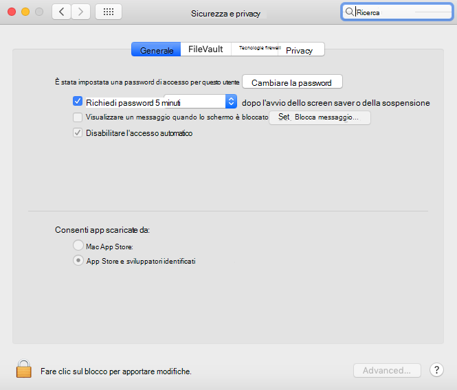

# <a name="troubleshoot-kernel-extension-issues-in-microsoft-defender-for-endpoint-on-macos"></a><span data-ttu-id="98b06-104">Risolvere i problemi di estensione del kernel in Microsoft Defender per Endpoint in macOS</span><span class="sxs-lookup"><span data-stu-id="98b06-104">Troubleshoot kernel extension issues in Microsoft Defender for Endpoint on macOS</span></span>

[!INCLUDE [Microsoft 365 Defender rebranding](../../includes/microsoft-defender.md)]


<span data-ttu-id="98b06-105">**Si applica a:**</span><span class="sxs-lookup"><span data-stu-id="98b06-105">**Applies to:**</span></span>

- [<span data-ttu-id="98b06-106">Microsoft Defender per endpoint su macOS</span><span class="sxs-lookup"><span data-stu-id="98b06-106">Microsoft Defender for Endpoint on macOS</span></span>](microsoft-defender-endpoint-mac.md)
- [<span data-ttu-id="98b06-107">Microsoft Defender per endpoint</span><span class="sxs-lookup"><span data-stu-id="98b06-107">Microsoft Defender for Endpoint</span></span>](https://go.microsoft.com/fwlink/p/?linkid=2154037)
- [<span data-ttu-id="98b06-108">Microsoft 365 Defender</span><span class="sxs-lookup"><span data-stu-id="98b06-108">Microsoft 365 Defender</span></span>](https://go.microsoft.com/fwlink/?linkid=2118804)

> <span data-ttu-id="98b06-109">Vuoi provare Microsoft Defender per Endpoint?</span><span class="sxs-lookup"><span data-stu-id="98b06-109">Want to experience Microsoft Defender for Endpoint?</span></span> [<span data-ttu-id="98b06-110">Iscriversi per una versione di valutazione gratuita.</span><span class="sxs-lookup"><span data-stu-id="98b06-110">Sign up for a free trial.</span></span>](https://www.microsoft.com/microsoft-365/windows/microsoft-defender-atp?ocid=docs-wdatp-exposedapis-abovefoldlink)

<span data-ttu-id="98b06-111">Questo articolo fornisce informazioni su come risolvere i problemi relativi all'estensione del kernel installata come parte di Microsoft Defender for Endpoint in macOS.</span><span class="sxs-lookup"><span data-stu-id="98b06-111">This article provides information on how to troubleshoot issues with the kernel extension that is installed as part of Microsoft Defender for Endpoint on macOS.</span></span>

<span data-ttu-id="98b06-112">A partire da macOS High Sierra (10.13), macOS richiede che tutte le estensioni del kernel siano approvate in modo esplicito prima di poter essere eseguite nel dispositivo.</span><span class="sxs-lookup"><span data-stu-id="98b06-112">Starting with macOS High Sierra (10.13), macOS requires all kernel extensions to be explicitly approved before they're allowed to run on the device.</span></span>

<span data-ttu-id="98b06-113">Se non hai approvato l'estensione del kernel durante la distribuzione/installazione di Microsoft Defender for Endpoint in macOS, l'applicazione visualizza un banner in cui viene richiesto di abilitarla:</span><span class="sxs-lookup"><span data-stu-id="98b06-113">If you didn't approve the kernel extension during the deployment/installation of Microsoft Defender for Endpoint on macOS, the application displays a banner prompting you to enable it:</span></span>

   

<span data-ttu-id="98b06-115">È inoltre possibile eseguire ```mdatp health``` .</span><span class="sxs-lookup"><span data-stu-id="98b06-115">You can also run ```mdatp health```.</span></span> <span data-ttu-id="98b06-116">Segnala se la protezione in tempo reale è abilitata ma non disponibile.</span><span class="sxs-lookup"><span data-stu-id="98b06-116">It reports if real-time protection is enabled but not available.</span></span> <span data-ttu-id="98b06-117">Questo indica che l'estensione del kernel non è approvata per l'esecuzione nel dispositivo.</span><span class="sxs-lookup"><span data-stu-id="98b06-117">This indicates that the kernel extension isn't approved to run on your device.</span></span>

```bash
mdatp health
```
```Output
...
real_time_protection_enabled                : false
real_time_protection_available              : true
...
```

<span data-ttu-id="98b06-118">Le sezioni seguenti forniscono indicazioni su come risolvere questo problema, a seconda del metodo usato per distribuire Microsoft Defender per Endpoint in macOS.</span><span class="sxs-lookup"><span data-stu-id="98b06-118">The following sections provide guidance on how to address this issue, depending on the method that you used to deploy Microsoft Defender for Endpoint on macOS.</span></span>

## <a name="managed-deployment"></a><span data-ttu-id="98b06-119">Distribuzione gestita</span><span class="sxs-lookup"><span data-stu-id="98b06-119">Managed deployment</span></span>

<span data-ttu-id="98b06-120">Vedi le istruzioni corrispondenti al tool di gestione usato per distribuire il prodotto:</span><span class="sxs-lookup"><span data-stu-id="98b06-120">See the instructions corresponding to the management tool that you used to deploy the product:</span></span>

- [<span data-ttu-id="98b06-121">Distribuzione basata su JAMF</span><span class="sxs-lookup"><span data-stu-id="98b06-121">JAMF-based deployment</span></span>](mac-install-with-jamf.md)
- [<span data-ttu-id="98b06-122">Distribuzione basata su Microsoft Intune</span><span class="sxs-lookup"><span data-stu-id="98b06-122">Microsoft Intune-based deployment</span></span>](mac-install-with-intune.md#create-system-configuration-profiles)

## <a name="manual-deployment"></a><span data-ttu-id="98b06-123">Distribuzione manuale</span><span class="sxs-lookup"><span data-stu-id="98b06-123">Manual deployment</span></span>

<span data-ttu-id="98b06-124">Se sono trascorsi meno di 30 minuti dall'installazione del prodotto, passare a Preferenze di sistema Sicurezza & Privacy , dove è necessario consentire il software di sistema dagli sviluppatori  >  "Microsoft Corporation". </span><span class="sxs-lookup"><span data-stu-id="98b06-124">If less than 30 minutes have passed since the product was installed, navigate to **System Preferences** > **Security & Privacy**, where you have to **Allow** system software from developers "Microsoft Corporation".</span></span>

<span data-ttu-id="98b06-125">Se non viene visualizzato questo prompt, significa che sono trascorsi 30 o più minuti e che l'estensione del kernel non è ancora stata approvata per l'esecuzione nel dispositivo:</span><span class="sxs-lookup"><span data-stu-id="98b06-125">If you don't see this prompt, it means that 30 or more minutes have passed, and the kernel extension still not been approved to run on your device:</span></span>



<span data-ttu-id="98b06-127">In questo caso, è necessario eseguire i passaggi seguenti per attivare di nuovo il flusso di approvazione.</span><span class="sxs-lookup"><span data-stu-id="98b06-127">In this case, you need to perform the following steps to trigger the approval flow again.</span></span>

1. <span data-ttu-id="98b06-128">In Terminale, tentare di installare il driver.</span><span class="sxs-lookup"><span data-stu-id="98b06-128">In Terminal, attempt to install the driver.</span></span> <span data-ttu-id="98b06-129">L'operazione seguente avrà esito negativo perché l'estensione del kernel non è stata approvata per l'esecuzione nel dispositivo.</span><span class="sxs-lookup"><span data-stu-id="98b06-129">The following operation will fail, because the kernel extension wasn't approved to run on the device.</span></span> <span data-ttu-id="98b06-130">Tuttavia, attiverà di nuovo il flusso di approvazione.</span><span class="sxs-lookup"><span data-stu-id="98b06-130">However, it will trigger the approval flow again.</span></span>

    ```bash
    sudo kextutil /Library/Extensions/wdavkext.kext
    ```
    
    ```Output
    Kext rejected due to system policy: <OSKext 0x7fc34d528390 [0x7fffa74aa8e0]> { URL = "file:///Library/StagedExtensions/Library/Extensions/wdavkext.kext/", ID = "com.microsoft.wdavkext" }
    Kext rejected due to system policy: <OSKext 0x7fc34d528390 [0x7fffa74aa8e0]> { URL = "file:///Library/StagedExtensions/Library/Extensions/wdavkext.kext/", ID = "com.microsoft.wdavkext" }
    Diagnostics for /Library/Extensions/wdavkext.kext:
    ```

2. <span data-ttu-id="98b06-131">Apri **Preferenze di** sistema Sicurezza &  >  **Privacy** dal menu.</span><span class="sxs-lookup"><span data-stu-id="98b06-131">Open **System Preferences** > **Security & Privacy** from the menu.</span></span> <span data-ttu-id="98b06-132">Chiuderlo prima, se aperto.</span><span class="sxs-lookup"><span data-stu-id="98b06-132">(Close it first, if it's opened.)</span></span>

3. <span data-ttu-id="98b06-133">**Consenti** software di sistema dagli sviluppatori "Microsoft Corporation"</span><span class="sxs-lookup"><span data-stu-id="98b06-133">**Allow** system software from developers "Microsoft Corporation"</span></span>

4. <span data-ttu-id="98b06-134">In Terminale, installare di nuovo il driver.</span><span class="sxs-lookup"><span data-stu-id="98b06-134">In Terminal, install the driver again.</span></span> <span data-ttu-id="98b06-135">Questa volta l'operazione avrà esito positivo:</span><span class="sxs-lookup"><span data-stu-id="98b06-135">This time the operation will succeed:</span></span>

    ```bash
    sudo kextutil /Library/Extensions/wdavkext.kext
    ```

    <span data-ttu-id="98b06-136">Il banner dovrebbe scomparire dall'applicazione Defender e dovrebbe ora segnalare che la protezione in tempo reale ```mdatp health``` è sia abilitata che disponibile:</span><span class="sxs-lookup"><span data-stu-id="98b06-136">The banner should disappear from the Defender application, and ```mdatp health``` should now report that real-time protection is both enabled and available:</span></span>

    ```bash
    mdatp health
    ```

    ```Output
    ...
    real_time_protection_enabled                : true
    real_time_protection_available              : true
    ...
    ```
