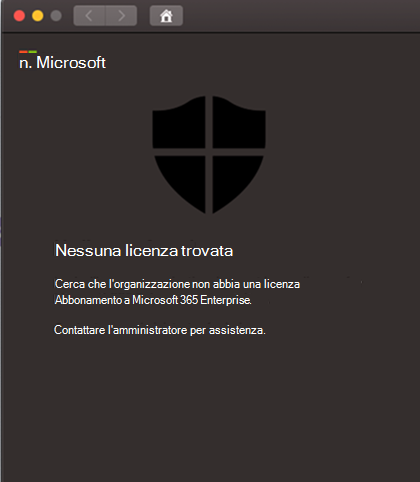

# Risolvere i problemi di licenza per Microsoft Defender per Endpoint per MacTroubleshoot license issues for Microsoft Defender for Endpoint for Mac

[!INCLUDE [Microsoft 365 Defender rebranding](../../includes/microsoft-defender.md)]

**Si applica a:****Applies to:**

- [Microsoft Defender per Endpoint per MacMicrosoft Defender for Endpoint for Mac](microsoft-defender-endpoint-mac.md)
- [Microsoft Defender per endpointMicrosoft Defender for Endpoint](https://go.microsoft.com/fwlink/p/?linkid=2154037)
- [Microsoft 365 DefenderMicrosoft 365 Defender](https://go.microsoft.com/fwlink/?linkid=2118804)

> Vuoi provare Microsoft Defender per Endpoint?Want to experience Microsoft Defender for Endpoint? [Iscriversi per una versione di valutazione gratuita.Sign up for a free trial.](https://www.microsoft.com/microsoft-365/windows/microsoft-defender-atp?ocid=docs-wdatp-exposedapis-abovefoldlink)

Mentre stai passando a [Microsoft Defender per Endpoint per Mac](microsoft-defender-endpoint-mac.md) e al test di distribuzione manuale o a un modello di prova (PoC), potresti ricevere l'errore seguente: While you are going through [Microsoft Defender for Endpoint for Mac](microsoft-defender-endpoint-mac.md) and [Manual deployment](mac-install-manually.md) testing or a Proof Of Concept (PoC), you might get the following error:

**Messaggio:****Message:** 

Nessuna licenza trovataNo license found

Sembra che l'organizzazione non abbia una licenza per l'abbonamento a Microsoft 365 Enterprise.Looks like your organization does not have a license for Microsoft 365 Enterprise subscription.

Contattare l'amministratore per assistenza.Contact your administrator for help.

**Causa:****Cause:** 

Hai distribuito e/o installato il pacchetto Microsoft Defender for Endpoint per macOS ("Scarica pacchetto di installazione") ma potresti aver eseguito lo script di configurazione ("Scarica pacchetto di onboarding").You deployed and/or installed the Microsoft Defender for Endpoint for macOS package ("Download installation package") but you might have run the configuration script ("Download onboarding package").

**Soluzione:****Solution:**

Seguire le MicrosoftDefenderATPOnboardingMacOs.py seguenti: Configurazione [client](mac-install-manually.md#client-configuration)Follow the MicrosoftDefenderATPOnboardingMacOs.py instructions documented here: [Client configuration](mac-install-manually.md#client-configuration)

