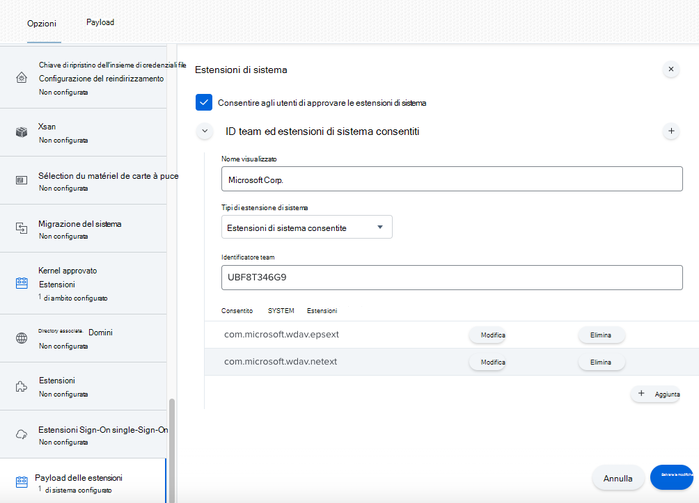
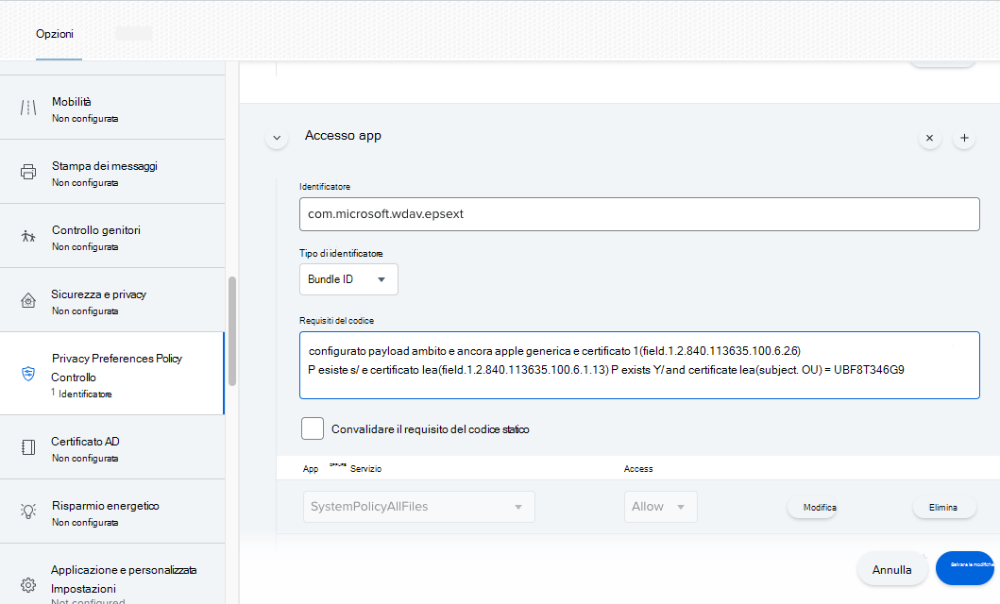
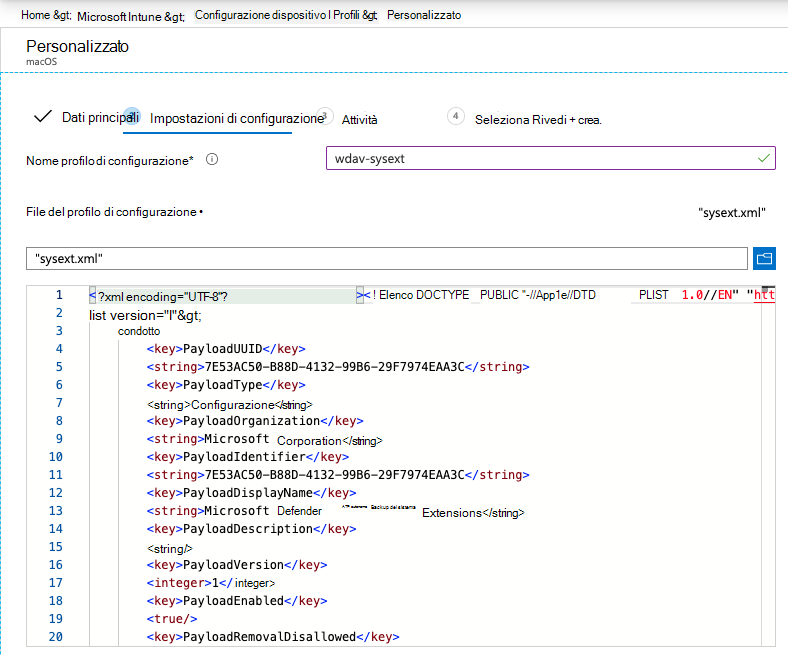

# <a name="new-configuration-profiles-for-macos-catalina-and-newer-versions-of-macos"></a>Nuovi profili di configurazione per macOS Catalina e versioni più recenti di macOS

[!INCLUDE [Microsoft 365 Defender rebranding](../../includes/microsoft-defender.md)]

**Si applica a:**
- [Microsoft Defender ATP](https://go.microsoft.com/fwlink/p/?linkid=2146631)
- [Microsoft 365 Defender](https://go.microsoft.com/fwlink/?linkid=2118804)

> Vuoi provare Microsoft Defender per Endpoint? [Iscriversi per una versione di valutazione gratuita.](https://www.microsoft.com/microsoft-365/windows/microsoft-defender-atp?ocid=docs-wdatp-exposedapis-abovefoldlink)

In linea con l'evoluzione di macOS, stiamo preparando un aggiornamento di Microsoft Defender per Endpoint per Mac che sfrutta le estensioni di sistema anziché le estensioni del kernel. Questo aggiornamento sarà applicabile solo a macOS Catalina (10.15.4) e alle versioni più recenti di macOS.

Se hai distribuito Microsoft Defender per Endpoint per Mac in un ambiente gestito (tramite JAMF, Intune o un'altra soluzione MDM), devi distribuire nuovi profili di configurazione. Se non si esegue questa procedura, gli utenti riceveranno richieste di approvazione per eseguire questi nuovi componenti.

## <a name="jamf"></a>JAMF

### <a name="system-extensions-policy"></a>Criteri estensioni di sistema

Per approvare le estensioni di sistema, crea il payload seguente:

1. In **Computers > Configuration Profiles selezionare** Options > System **Extensions**.
2. Selezionare **Estensioni di sistema consentite** nell'elenco a discesa **Tipi** di estensione di sistema.
3. Usa **UBF8T346G9** per l'ID team.
4. Aggiungere gli identificatori bundle seguenti **all'elenco Estensioni di sistema** consentite:

    - **com.microsoft.wdav.epsext**
    - **com.microsoft.wdav.netext**

    

### <a name="privacy-preferences-policy-control"></a>Privacy Preferences Policy Control

Aggiungi il payload JAMF seguente per concedere l'accesso completo al disco a Microsoft Defender for Endpoint Endpoint Security Extension. Questo criterio è un requisito preliminare per l'esecuzione dell'estensione nel dispositivo.

1. Seleziona **Opzioni**  >  **Privacy Preferenze Controllo criteri**.
2. Utilizzare `com.microsoft.wdav.epsext` come **identificatore** e come `Bundle ID` tipo **bundle**.
3. Imposta requisito di codice su `identifier "com.microsoft.wdav.epsext" and anchor apple generic and certificate 1[field.1.2.840.113635.100.6.2.6] /* exists */ and certificate leaf[field.1.2.840.113635.100.6.1.13] /* exists */ and certificate leaf[subject.OU] = UBF8T346G9`
4. Imposta **App o servizio** su **SystemPolicyAllFiles e** accedi a **Allow**.

    

### <a name="network-extension-policy"></a>Criteri di estensione di rete

Come parte delle funzionalità di rilevamento e risposta degli endpoint, Microsoft Defender per Endpoint per Mac esamina il traffico socket e segnala queste informazioni al portale di Microsoft Defender Security Center. Il criterio seguente consente all'estensione di rete di eseguire questa funzionalità.

>[!NOTE]
>JAMF non dispone del supporto incorporato per i criteri di filtro dei contenuti, che sono un requisito preliminare per l'abilitazione delle estensioni di rete installate da Microsoft Defender per Endpoint per Mac nel dispositivo. Inoltre, JAMF a volte modifica il contenuto dei criteri distribuiti.
>Di conseguenza, i passaggi seguenti forniscono una soluzione alternativa che implica la firma del profilo di configurazione.

1. Salva il contenuto seguente nel dispositivo con `com.microsoft.network-extension.mobileconfig` un editor di testo:

    ```xml
    <?xml version="1.0" encoding="UTF-8"?><!DOCTYPE plist PUBLIC "-//Apple//DTD PLIST 1.0//EN" "http://www.apple.com/DTDs/PropertyList-1.0.dtd">
    <plist version="1">
        <dict>
            <key>PayloadUUID</key>
            <string>DA2CC794-488B-4AFF-89F7-6686A7E7B8AB</string>
            <key>PayloadType</key>
            <string>Configuration</string>
            <key>PayloadOrganization</key>
            <string>Microsoft Corporation</string>
            <key>PayloadIdentifier</key>
            <string>DA2CC794-488B-4AFF-89F7-6686A7E7B8AB</string>
            <key>PayloadDisplayName</key>
            <string>Microsoft Defender ATP Network Extension</string>
            <key>PayloadDescription</key>
            <string/>
            <key>PayloadVersion</key>
            <integer>1</integer>
            <key>PayloadEnabled</key>
            <true/>
            <key>PayloadRemovalDisallowed</key>
            <true/>
            <key>PayloadScope</key>
            <string>System</string>
            <key>PayloadContent</key>
            <array>
                <dict>
                    <key>PayloadUUID</key>
                    <string>2BA070D9-2233-4827-AFC1-1F44C8C8E527</string>
                    <key>PayloadType</key>
                    <string>com.apple.webcontent-filter</string>
                    <key>PayloadOrganization</key>
                    <string>Microsoft Corporation</string>
                    <key>PayloadIdentifier</key>
                    <string>CEBF7A71-D9A1-48BD-8CCF-BD9D18EC155A</string>
                    <key>PayloadDisplayName</key>
                    <string>Approved Network Extension</string>
                    <key>PayloadDescription</key>
                    <string/>
                    <key>PayloadVersion</key>
                    <integer>1</integer>
                    <key>PayloadEnabled</key>
                    <true/>
                    <key>FilterType</key>
                    <string>Plugin</string>
                    <key>UserDefinedName</key>
                    <string>Microsoft Defender ATP Network Extension</string>
                    <key>PluginBundleID</key>
                    <string>com.microsoft.wdav</string>
                    <key>FilterSockets</key>
                    <true/>
                    <key>FilterDataProviderBundleIdentifier</key>
                    <string>com.microsoft.wdav.netext</string>
                    <key>FilterDataProviderDesignatedRequirement</key>
                    <string>identifier "com.microsoft.wdav.netext" and anchor apple generic and certificate 1[field.1.2.840.113635.100.6.2.6] /* exists */ and certificate leaf[field.1.2.840.113635.100.6.1.13] /* exists */ and certificate leaf[subject.OU] = UBF8T346G9</string>
                </dict>
            </array>
        </dict>
    </plist>
    ```

2. Verificare che il file precedente sia stato copiato correttamente eseguendo `plutil` l'utilità nel terminale:

    ```bash
    $ plutil -lint <PathToFile>/com.microsoft.network-extension.mobileconfig
    ```

    Ad esempio, se il file è stato archiviato in Documenti:

    ```bash
    $ plutil -lint ~/Documents/com.microsoft.network-extension.mobileconfig
    ```
    
    Verificare che il comando esere `OK` .
        
    ```bash
    <PathToFile>/com.microsoft.network-extension.mobileconfig: OK
    ```
    
3. Seguire le istruzioni in [questa pagina](https://www.jamf.com/jamf-nation/articles/649/creating-a-signing-certificate-using-jamf-pro-s-built-in-certificate-authority) per creare un certificato di firma utilizzando l'autorità di certificazione predefinita di JAMF.

4. Dopo aver creato e installato il certificato nel dispositivo, esegui il comando seguente dal terminale per firmare il file:

    ```bash
    $ security cms -S -N "<CertificateName>" -i <PathToFile>/com.microsoft.network-extension.mobileconfig -o <PathToSignedFile>/com.microsoft.network-extension.signed.mobileconfig
    ```
    
    Ad esempio, se il nome del certificato è **SigningCertificate** e il file firmato verrà archiviato in Documenti:
    
    ```bash
    $ security cms -S -N "SigningCertificate" -i ~/Documents/com.microsoft.network-extension.mobileconfig -o ~/Documents/com.microsoft.network-extension.signed.mobileconfig
    ```
    
5. Dal portale JAMF, accedere a **Profili di configurazione e** fare clic sul pulsante **Carica.** Selezionare `com.microsoft.network-extension.signed.mobileconfig` quando richiesto per il file.

## <a name="intune"></a>Intune

### <a name="system-extensions-policy"></a>Criteri estensioni di sistema

Per approvare le estensioni di sistema:

1. In Intune apri **Gestisci**  >  **configurazione dispositivo.** Selezionare **Gestisci**  >  **profili**  >  **Crea profilo**.
2. Scegliere un nome per il profilo. Modificare **Platform=macOS** in **Profile type=Extensions**. Selezionare **Crea**.
3. Nella scheda `Basics` assegna un nome al nuovo profilo.
4. Nella scheda `Configuration settings` aggiungere le voci seguenti nella `Allowed system extensions` sezione:

    Identificatore bundle         | Identificatore del team
    --------------------------|----------------
    com.microsoft.wdav.epsext | UBF8T346G9
    com.microsoft.wdav.netext | UBF8T346G9

    

5. Nella scheda `Assignments` assegna questo profilo a Tutti gli utenti & Tutti i **dispositivi**.
6. Esaminare e creare questo profilo di configurazione.

### <a name="create-and-deploy-the-custom-configuration-profile"></a>Creare e distribuire il profilo di configurazione personalizzato

Il profilo di configurazione seguente abilita l'estensione di rete e concede l'accesso completo al disco all'estensione di sistema Endpoint Security. 

Salvare il contenuto seguente in un file denominato **sysext.xml**:

```xml
<?xml version="1.0" encoding="UTF-8"?><!DOCTYPE plist PUBLIC "-//Apple//DTD PLIST 1.0//EN" "http://www.apple.com/DTDs/PropertyList-1.0.dtd">
<plist version="1">
    <dict>
        <key>PayloadUUID</key>
        <string>7E53AC50-B88D-4132-99B6-29F7974EAA3C</string>
        <key>PayloadType</key>
        <string>Configuration</string>
        <key>PayloadOrganization</key>
        <string>Microsoft Corporation</string>
        <key>PayloadIdentifier</key>
        <string>7E53AC50-B88D-4132-99B6-29F7974EAA3C</string>
        <key>PayloadDisplayName</key>
        <string>Microsoft Defender ATP System Extensions</string>
        <key>PayloadDescription</key>
        <string/>
        <key>PayloadVersion</key>
        <integer>1</integer>
        <key>PayloadEnabled</key>
        <true/>
        <key>PayloadRemovalDisallowed</key>
        <true/>
        <key>PayloadScope</key>
        <string>System</string>
        <key>PayloadContent</key>
        <array>
            <dict>
                <key>PayloadUUID</key>
                <string>2BA070D9-2233-4827-AFC1-1F44C8C8E527</string>
                <key>PayloadType</key>
                <string>com.apple.webcontent-filter</string>
                <key>PayloadOrganization</key>
                <string>Microsoft Corporation</string>
                <key>PayloadIdentifier</key>
                <string>CEBF7A71-D9A1-48BD-8CCF-BD9D18EC155A</string>
                <key>PayloadDisplayName</key>
                <string>Approved Network Extension</string>
                <key>PayloadDescription</key>
                <string/>
                <key>PayloadVersion</key>
                <integer>1</integer>
                <key>PayloadEnabled</key>
                <true/>
                <key>FilterType</key>
                <string>Plugin</string>
                <key>UserDefinedName</key>
                <string>Microsoft Defender ATP Network Extension</string>
                <key>PluginBundleID</key>
                <string>com.microsoft.wdav</string>
                <key>FilterSockets</key>
                <true/>
                <key>FilterDataProviderBundleIdentifier</key>
                <string>com.microsoft.wdav.netext</string>
                <key>FilterDataProviderDesignatedRequirement</key>
                <string>identifier &quot;com.microsoft.wdav.netext&quot; and anchor apple generic and certificate 1[field.1.2.840.113635.100.6.2.6] /* exists */ and certificate leaf[field.1.2.840.113635.100.6.1.13] /* exists */ and certificate leaf[subject.OU] = UBF8T346G9</string>
            </dict>
            <dict>
                <key>PayloadUUID</key>
                <string>56105E89-C7C8-4A95-AEE6-E11B8BEA0366</string>
                <key>PayloadType</key>
                <string>com.apple.TCC.configuration-profile-policy</string>
                <key>PayloadOrganization</key>
                <string>Microsoft Corporation</string>
                <key>PayloadIdentifier</key>
                <string>56105E89-C7C8-4A95-AEE6-E11B8BEA0366</string>
                <key>PayloadDisplayName</key>
                <string>Privacy Preferences Policy Control</string>
                <key>PayloadDescription</key>
                <string/>
                <key>PayloadVersion</key>
                <integer>1</integer>
                <key>PayloadEnabled</key>
                <true/>
                <key>Services</key>
                <dict>
                    <key>SystemPolicyAllFiles</key>
                    <array>
                        <dict>
                            <key>Identifier</key>
                            <string>com.microsoft.wdav.epsext</string>
                            <key>CodeRequirement</key>
                            <string>identifier "com.microsoft.wdav.epsext" and anchor apple generic and certificate 1[field.1.2.840.113635.100.6.2.6] /* exists */ and certificate leaf[field.1.2.840.113635.100.6.1.13] /* exists */ and certificate leaf[subject.OU] = UBF8T346G9</string>
                            <key>IdentifierType</key>
                            <string>bundleID</string>
                            <key>StaticCode</key>
                            <integer>0</integer>
                            <key>Allowed</key>
                            <integer>1</integer>
                        </dict>
                    </array>
                </dict>
            </dict>
        </array>
    </dict>
</plist>
```

Verificare che il file precedente sia stato copiato correttamente. Dal terminale, eseguire il comando seguente e verificare che esere `OK` :

```bash
$ plutil -lint sysext.xml
sysext.xml: OK
```

Per distribuire questo profilo di configurazione personalizzato:

1.  In Intune apri **Gestisci**  >  **configurazione dispositivo.** Selezionare **Gestisci**  >  **profili**  >  **Crea profilo.**
2. Scegliere un nome per il profilo. Modificare **Platform=macOS** e **Profile type=Custom**. Selezionare **Configura**.
3.  Apri il profilo di configurazione e carica **sysext.xml**. Questo file è stato creato nel passaggio precedente.
4.  Selezionare **OK**.

    

5. Nella scheda `Assignments` assegna questo profilo a Tutti gli utenti & Tutti i **dispositivi**.
6. Esaminare e creare questo profilo di configurazione.
