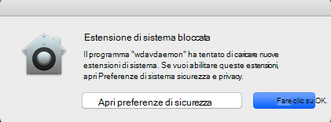
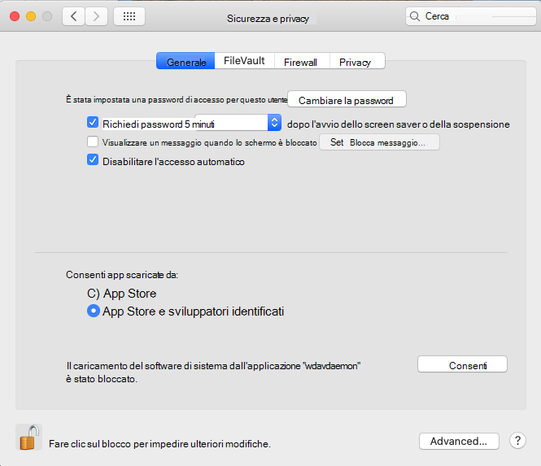
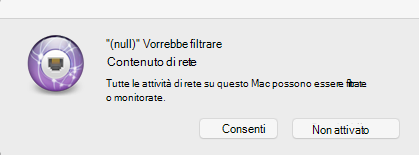
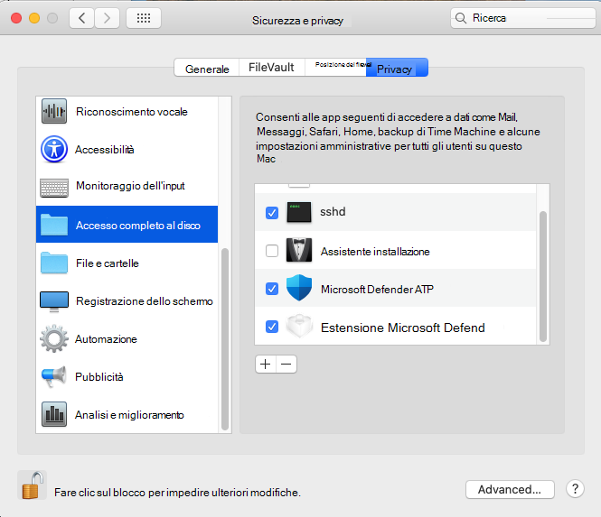

# <a name="microsoft-defender-for-endpoint-for-mac---system-extensions-public-preview"></a>Microsoft Defender per Endpoint per Mac - anteprima pubblica delle estensioni di sistema)

**Si applica a:**
- [Microsoft Defender ATP](https://go.microsoft.com/fwlink/p/?linkid=2146631)
- [Microsoft 365 Defender](https://go.microsoft.com/fwlink/?linkid=2118804)

> Vuoi provare Microsoft Defender per Endpoint? [Iscriversi per una versione di valutazione gratuita.](https://www.microsoft.com/microsoft-365/windows/microsoft-defender-atp?ocid=docs-wdatp-exposedapis-abovefoldlink)

In linea con l'evoluzione di macOS, stiamo preparando un aggiornamento defender per Endpoint per Mac che sfrutta le estensioni di sistema anziché le estensioni del kernel. Questo aggiornamento si applica solo a macOS Catalina (10.15.4) e alle versioni successive di macOS.

Questa funzionalità è attualmente in anteprima pubblica. Questo articolo descrive come abilitare questa funzionalità nel dispositivo. Puoi provare questa funzionalità localmente nel tuo dispositivo o configurarla in remoto tramite uno strumento di gestione.

Questi passaggi presuppongono che Defender for Endpoint sia già in esecuzione nel dispositivo. Per ulteriori informazioni, vedere [questa pagina](microsoft-defender-endpoint-mac.md).

## <a name="known-issues"></a>Problemi noti

- Abbiamo ricevuto segnalazioni dell'estensione di rete che interferisce con l'estensione Kerberos SSO apple.
- La versione corrente del prodotto installa ancora un'estensione del kernel. L'estensione del kernel viene usata solo come meccanismo di fallback e verrà rimossa prima che questa funzionalità raggiunga l'anteprima pubblica.
- Stiamo ancora lavorando a una versione del prodotto che distribuisce e funziona correttamente su macOS 11 Big Sur.

## <a name="deployment-prerequisites"></a>Prerequisiti di distribuzione

- Versione minima del sistema operativo macOS: **10.15.4**
- Versione minima del prodotto: **101.03.73**
- Il dispositivo deve essere nel **canale di aggiornamento rapido Insider.** È possibile controllare il canale di aggiornamento utilizzando il comando seguente:

  ```bash
  mdatp health --field release_ring
  ```

  Se il dispositivo non è già nel canale di aggiornamento Insider Fast, esegui il comando seguente dal Terminale. L'aggiornamento del canale ha effetto al successivo avvio del prodotto (quando viene installato il successivo aggiornamento del prodotto o quando il dispositivo viene riavviato).

  ```bash
  defaults write com.microsoft.autoupdate2 ChannelName -string Beta
  ```

  In alternativa, se si è in un ambiente gestito (JAMF o Intune), è possibile configurare il canale di aggiornamento in remoto. Per altre informazioni, vedi [Distribuire gli aggiornamenti per Microsoft Defender ATP per Mac: Impostare il nome del canale.](mac-updates.md#set-the-channel-name)

## <a name="deployment-steps"></a>Fasi di distribuzione

Seguire i passaggi di distribuzione corrispondenti all'ambiente e al metodo preferito per provare questa funzionalità.

### <a name="manual-deployment"></a>Distribuzione manuale

#### <a name="approve-the-system-extensions-and-enable-the-network-extension"></a>Approvare le estensioni di sistema e abilitare l'estensione di rete

1. Dopo aver soddisfatto tutti i prerequisiti di distribuzione, riavvia il dispositivo per avviare il processo di approvazione e attivazione dell'estensione di sistema.

   Vedrai una serie di istruzioni di sistema per approvare le estensioni di sistema di Defender for Endpoint. Devi **approvare tutti** i prompt della serie, perché macOS richiede un'approvazione esplicita per ogni estensione che Defender per Endpoint per Mac installa nel dispositivo.
   
   Per ogni approvazione, seleziona **Apri preferenze di sicurezza** e quindi seleziona **Consenti** per consentire l'esecuzione dell'estensione di sistema.

   > [!IMPORTANT]
   > È necessario chiudere e riaprire la finestra Sicurezza & preferenze di sistema  >  **tra** le approvazioni successive. In caso contrario, macOS non visualizza l'approvazione successiva.

   > [!IMPORTANT]
   > C'è un timeout di un minuto prima che il prodotto torni all'estensione del kernel. In questo modo si garantisce che il dispositivo sia protetto.
   >
   > Se è trascorso più di un minuto, riavviare il daemon riavviando il dispositivo o utilizzando per attivare di nuovo il flusso `sudo killall -9 wdavdaemon` di approvazione.

   

   

1. Dopo l'approvazione delle estensioni di sistema, macOS richiede un'approvazione per consentire il filtro del traffico di rete. Fare clic **su Consenti**.

   

#### <a name="grant-full-disk-access-to-the-endpoint-security-system-extension"></a>Concedere l'accesso completo al disco all'estensione di sistema endpoint Security

Apri la **scheda Preferenze di** sistema Sicurezza & Privacy privacy e concedi Accesso completo al  >    >   **disco** all'estensione microsoft Defender **Endpoint Security.**



#### <a name="reboot-your-device"></a>Riavviare il dispositivo

Per l'applicazione delle modifiche, devi riavviare il dispositivo.

#### <a name="verify-that-the-system-extensions-are-running"></a>Verificare che le estensioni di sistema siano in esecuzione

Dal terminale, eseguire il comando seguente:

```bash
mdatp health --field real_time_protection_subsystem
```

L'output `endpoint_security_extension` del terminale indica che il prodotto utilizza la funzionalità delle estensioni di sistema.

### <a name="managed-deployment"></a>Distribuzione gestita

Fai riferimento a Nuovi profili di configurazione per macOS Catalina e alle versioni più recenti di [macOS: JAMF](mac-sysext-policies.md#jamf) per i nuovi profili di configurazione che devi distribuire per questa nuova funzionalità.

Oltre a questi profili, assicurati di configurare i dispositivi di destinazione per il canale di aggiornamento veloce Insider, come descritto in [Prerequisiti per la distribuzione](#deployment-prerequisites).

In un dispositivo in cui vengono soddisfatti tutti i prerequisiti e sono stati distribuiti i nuovi profili di configurazione, eseguire il comando seguente:

```bash
$ mdatp health --field real_time_protection_subsystem
```

Se questo comando stampa `endpoint_security_extension` , il prodotto utilizza la funzionalità delle estensioni di sistema.

## <a name="validate-basic-scenarios"></a>Convalidare gli scenari di base

1. Testare il rilevamento EICAR (European Institute for Computer Antivirus Research). Da una finestra del terminale, eseguire il comando seguente:

   ```bash
   curl -o eicar.txt https://secure.eicar.org/eicar.com.txt
   ```

   Verificare che il file EICAR sia in quarantena. È possibile verificare lo stato del file nella pagina Cronologia protezione nell'interfaccia utente o da una riga di comando utilizzando il comando seguente:

    ```bash
    mdatp threat list
    ```

2. Testare lo scenario di rilevamento e risposta degli endpoint (EDR). Da una finestra del terminale, eseguire il comando seguente:

   ```bash
   curl -o "MDATP MacOS DIY.zip" https://aka.ms/mdatpmacosdiy
   ```

   Verificare che nel portale della pagina del computer per gli scenari EICAR ed EDR FAI-da-ti sia stato visualizzato due avvisi.

## <a name="frequently-asked-questions"></a>Domande frequenti

- D: Perché viene ancora visualizzato `kernel_extension` quando si esegue `mdatp health --field real_time_protection_subsystem` ?

    A: Fare riferimento alla sezione [Prerequisiti di](#deployment-prerequisites) distribuzione e verificare che tutti i prerequisiti siano soddisfatti. Se tutti i prerequisiti sono soddisfatti, riavvia il dispositivo e controlla di nuovo.

- D: Quando sarà supportato macOS 11 Big Sur?

    A: Stiamo lavorando attivamente per aggiungere il supporto per macOS 11. Verranno poste ulteriori informazioni nella [pagina Novità.](mac-whatsnew.md)
