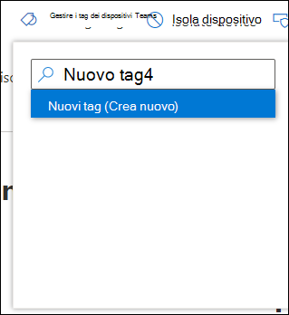
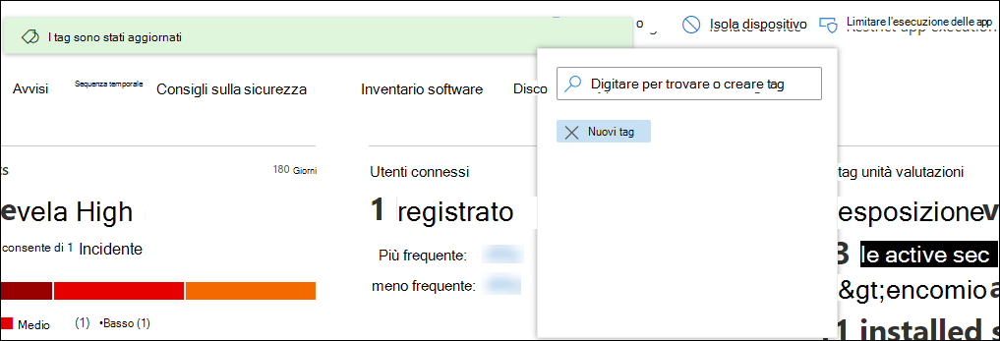

# Creare e gestire tag di dispositiviCreate and manage device tags

[!INCLUDE [Microsoft 365 Defender rebranding](../../includes/microsoft-defender.md)]

**Si applica a:****Applies to:**
- [Microsoft Defender per endpointMicrosoft Defender for Endpoint](https://go.microsoft.com/fwlink/p/?linkid=2154037)
- [Microsoft 365 DefenderMicrosoft 365 Defender](https://go.microsoft.com/fwlink/?linkid=2118804)

> Vuoi provare Microsoft Defender per Endpoint?Want to experience Microsoft Defender for Endpoint? [Iscriversi per una versione di valutazione gratuita.Sign up for a free trial.](https://www.microsoft.com/microsoft-365/windows/microsoft-defender-atp?ocid=docs-wdatp-exposedapis-abovefoldlink)

Aggiungere tag nei dispositivi per creare un'affiliazione a un gruppo logico.Add tags on devices to create a logical group affiliation. I tag del dispositivo supportano la mappatura corretta della rete, consentendo di collegare tag diversi per acquisire il contesto e consentire la creazione di elenchi dinamici come parte di un incidente.Device tags support proper mapping of the network, enabling you to attach different tags to capture context and to enable dynamic list creation as part of an incident. I tag possono essere usati come filtro nella **visualizzazione elenco** Dispositivi o per raggruppare i dispositivi.Tags can be used as a filter in **Devices list** view, or to group devices. Per altre informazioni sul raggruppamento dei dispositivi, vedi [Creare e gestire gruppi di dispositivi.](machine-groups.md)For more information on device grouping, see [Create and manage device groups](machine-groups.md).

Puoi aggiungere tag nei dispositivi usando i modi seguenti:You can add tags on devices using the following ways:

- Usando il portaleUsing the portal
- Impostando un valore della chiave del Registro di sistemaSetting a registry key value

> [!NOTE]
> Potrebbe verificarsi una latenza tra il momento in cui un tag viene aggiunto a un dispositivo e la relativa disponibilità nell'elenco dei dispositivi e nella pagina del dispositivo.There may be some latency between the time a tag is added to a device and its availability in the devices list and device page.  

Per aggiungere tag del dispositivo usando l'API, vedere [Aggiungere o rimuovere l'API dei tag del dispositivo](add-or-remove-machine-tags.md).To add device tags using API, see [Add or remove device tags API](add-or-remove-machine-tags.md).

## Aggiungere e gestire i tag per i dispositivi tramite il portaleAdd and manage device tags using the portal

1. Selezionare il dispositivo in cui gestire i tag.Select the device that you want to manage tags on. È possibile selezionare o cercare un dispositivo in una delle seguenti visualizzazioni:You can select or search for a device from any of the following views:

   - **Dashboard delle operazioni di** sicurezza: selezionare il nome del dispositivo nella sezione Dispositivi principali con avvisi attivi.**Security operations dashboard** - Select the device name from the Top devices with active alerts section.
   - **Coda degli avvisi**: selezionare il nome del dispositivo accanto all'icona del dispositivo dalla coda degli avvisi.**Alerts queue** - Select the device name beside the device icon from the alerts queue.
   - **Elenco dispositivi**: selezionare il nome del dispositivo nell'elenco dei dispositivi.**Devices list** - Select the device name from the list of devices.
   - **Casella di ricerca**: selezionare Dispositivo dal menu a discesa e inserire il nome del dispositivo.**Search box** - Select Device from the drop-down menu and enter the device name.

     È anche possibile accedere alla pagina di avviso tramite le visualizzazioni file e IP.You can also get to the alert page through the file and IP views.

2. Selezionare **Gestisci tag** dalla riga Azioni di risposta.Select **Manage Tags** from the row of Response actions.

    

3. Digitare per trovare o creare tagType to find or create tags

    

I tag vengono aggiunti alla visualizzazione del dispositivo e verranno visualizzati anche nella **visualizzazione elenco** Dispositivi.Tags are added to the device view and will also be reflected on the **Devices list** view. Puoi quindi usare il filtro **Tag** per visualizzare l'elenco pertinente dei dispositivi.You can then use the **Tags** filter to see the relevant list of devices.

>[!NOTE]
> Il filtro potrebbe non funzionare sui nomi di tag che contengono parentesi.Filtering might not work on tag names that contain parenthesis. 
> Quando si crea un nuovo tag, viene visualizzato un elenco di tag esistenti.When you create a new tag, a list of existing tags are displayed. L'elenco mostra solo i tag creati tramite il portale.The list only shows tags created through the portal. I tag esistenti creati dai dispositivi client non verranno visualizzati.Existing tags created from client devices will not be displayed.

È inoltre possibile eliminare i tag da questa visualizzazione.You can also delete tags from this view.

## Aggiungere tag dispositivo impostando un valore di chiave del Registro di sistemaAdd device tags by setting a registry key value

>[!NOTE]
> Applicabile solo nei dispositivi seguenti:Applicable only on the following devices:
>- Windows 10 versione 1709 o successivaWindows 10, version 1709 or later
>- Windows Server, versione 1803 o successivaWindows Server, version 1803 or later
>- Windows Server 2016Windows Server 2016
>- Windows Server 2012 R2Windows Server 2012 R2
>- Windows Server 2008 R2 SP1Windows Server 2008 R2 SP1
>- Windows 8.1Windows 8.1
>- Windows 7 SP1Windows 7 SP1

> [!NOTE] 
> Il numero massimo di caratteri che è possibile impostare in un tag è 200.The maximum number of characters that can be set in a tag is 200.

I dispositivi con tag simili possono essere utili quando devi applicare un'azione contestuale a un elenco specifico di dispositivi.Devices with similar tags can be handy when you need to apply contextual action on a specific list of devices.

Usa la seguente voce della chiave del Registro di sistema per aggiungere un tag in un dispositivo:Use the following registry key entry to add a tag on a device:

- Chiave del Registro di sistema: `HKEY_LOCAL_MACHINE\SOFTWARE\Policies\Microsoft\Windows Advanced Threat Protection\DeviceTagging\`Registry key: `HKEY_LOCAL_MACHINE\SOFTWARE\Policies\Microsoft\Windows Advanced Threat Protection\DeviceTagging\`
- Valore della chiave del Registro di sistema (REG_SZ): `Group`Registry key value (REG_SZ): `Group`
- Dati chiave del Registro di sistema: `Name of the tag you want to set`Registry key data: `Name of the tag you want to set`

>[!NOTE]
>Il tag del dispositivo fa parte del report delle informazioni sul dispositivo generato una volta al giorno.The device tag is part of the device information report that's generated once a day. In alternativa, puoi scegliere di riavviare l'endpoint che trasferirebbe un nuovo report di informazioni sul dispositivo.As an alternative, you may choose to restart the endpoint that would transfer a new device information report.
> 
> Se devi rimuovere un tag aggiunto usando la chiave del Registro di sistema precedente, cancella il contenuto dei dati della chiave del Registro di sistema invece di rimuovere la chiave "Group".If you need to remove a tag that was added using the above Registry key, clear the contents of the Registry key data instead of removing the 'Group' key.
