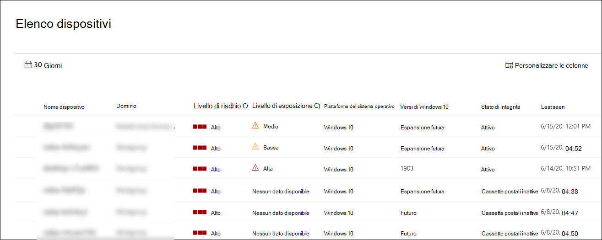

# Visualizzare e organizzare l'elenco di Microsoft Defender per dispositivi endpointView and organize the Microsoft Defender for Endpoint Devices list

[!INCLUDE [Microsoft 365 Defender rebranding](../../includes/microsoft-defender.md)]

**Si applica a:****Applies to:**
- [Microsoft Defender per endpointMicrosoft Defender for Endpoint](https://go.microsoft.com/fwlink/p/?linkid=2154037)
- [Microsoft 365 DefenderMicrosoft 365 Defender](https://go.microsoft.com/fwlink/?linkid=2118804)

> Vuoi provare Defender per Endpoint?Want to experience Defender for Endpoint? [Iscriversi per una versione di valutazione gratuita.Sign up for a free trial.](https://www.microsoft.com/microsoft-365/windows/microsoft-defender-atp?ocid=docs-wdatp-machinesview-abovefoldlink)

**L'elenco Dispositivi** mostra un elenco dei dispositivi nella rete in cui sono stati generati gli avvisi.The **Devices list** shows a list of the devices in your network where alerts were generated. Per impostazione predefinita, la coda visualizza i dispositivi visualizzati negli ultimi 30 giorni.By default, the queue displays devices seen in the last 30 days.  

A colpo d'occhio vedrai informazioni quali dominio, livello di rischio, piattaforma del sistema operativo e altri dettagli per una facile identificazione dei dispositivi più a rischio.At a glance you'll see information such as domain, risk level, OS platform, and other details for easy identification of devices most at risk.

Puoi scegliere tra diverse opzioni per personalizzare la visualizzazione elenco dei dispositivi.There are several options you can choose from to customize the devices list view. Nella barra di spostamento superiore è possibile:On the top navigation you can:

- Aggiungere o rimuovere colonneAdd or remove columns
- Esportare l'intero elenco in formato CSVExport the entire list in CSV format
- Selezionare il numero di elementi da visualizzare per paginaSelect the number of items to show per page
- Applicazione di filtriApply filters

Durante il processo di onboarding, **l'elenco Dispositivi** viene gradualmente popolato con i dispositivi quando iniziano a segnalare i dati del sensore.During the onboarding process, the **Devices list** is gradually populated with devices as they begin to report sensor data. Usa questa visualizzazione per tenere traccia degli endpoint onboarded quando vengono online o scarica l'elenco completo degli endpoint come file CSV per l'analisi offline.Use this view to track your onboarded endpoints as they come online, or download the complete endpoint list as a CSV file for offline analysis.

>[!NOTE]
> Se esporti l'elenco dei dispositivi, conterrà tutti i dispositivi dell'organizzazione.If you export the device list, it will contain every device in your organization. Il download potrebbe richiedere molto tempo, a seconda delle dimensioni dell'organizzazione.It might take a significant amount of time to download, depending on how large your organization is. L'esportazione dell'elenco in formato CSV consente di visualizzare i dati in modo non filtrato.Exporting the list in CSV format displays the data in an unfiltered manner. Il file CSV includerà tutti i dispositivi nell'organizzazione, indipendentemente dal filtro applicato nella visualizzazione stessa.The CSV file will include all devices in the organization, regardless of any filtering applied in the view itself.

## Ordinare e filtrare l'elenco dei dispositiviSort and filter the device list

È possibile applicare i filtri seguenti per limitare l'elenco degli avvisi e ottenere una visualizzazione più mirata.You can apply the following filters to limit the list of alerts and get a more focused view.

### Livello di rischioRisk level

Il livello di rischio riflette la valutazione complessiva dei rischi del dispositivo in base a una combinazione di fattori, inclusi i tipi e la gravità degli avvisi attivi nel dispositivo.The risk level reflects the overall risk assessment of the device based on a combination of factors, including the types and severity of active alerts on the device. La risoluzione degli avvisi attivi, l'approvazione delle attività di correzione e l'eliminazione degli avvisi successivi possono ridurre il livello di rischio.Resolving active alerts, approving remediation activities, and suppressing subsequent alerts can lower the risk level.

### Livello di esposizioneExposure level

Il livello di esposizione riflette l'esposizione corrente del dispositivo in base all'impatto cumulativo delle raccomandazioni di sicurezza in sospeso.The exposure level reflects the current exposure of the device based on the cumulative impact of its pending security recommendations. I livelli possibili sono basso, medio e alto.The possible levels are low, medium, and high. Un'esposizione bassa significa che i dispositivi sono meno vulnerabili dallo sfruttamento.Low exposure means your devices are less vulnerable from exploitation.

Se il livello di esposizione indica "Nessun dato disponibile", esistono alcuni motivi per cui questo può essere il caso:If the exposure level says "No data available," there are a few reasons why this may be the case:

- Il dispositivo ha interrotto la segnalazione per più di 30 giorni, in questo caso è considerato inattivo e l'esposizione non viene calcolataDevice stopped reporting for more than 30 days – in that case it is considered inactive, and the exposure isn't computed
- Sistema operativo del dispositivo non supportato: vedi [i requisiti minimi per Microsoft Defender per Endpoint](minimum-requirements.md)Device OS not supported - see [minimum requirements for Microsoft Defender for Endpoint](minimum-requirements.md)
- Dispositivo con agente obsoleto (molto improbabile)Device with stale agent (very unlikely)

### Piattaforma del sistema operativoOS Platform

Seleziona solo le piattaforme del sistema operativo che vuoi analizzare.Select only the OS platforms you're interested in investigating.

### Stato di integritàHealth state

Filtra in base ai seguenti stati di integrità del dispositivo:Filter by the following device health states:

- **Attivo:** dispositivi che segnalano attivamente i dati del sensore al servizio.**Active** – Devices that are actively reporting sensor data to the service.
- **Inattivo:** dispositivi che hanno interrotto completamente l'invio di segnali per più di 7 giorni.**Inactive** – Devices that have completely stopped sending signals for more than 7 days.
- **Configurazione errata: i dispositivi** che hanno problemi di comunicazione con il servizio o non sono in grado di inviare dati del sensore.**Misconfigured** – Devices that have impaired communications with service or are unable to send sensor data. I dispositivi non configurati correttamente possono essere ulteriormente classificati in:Misconfigured devices can further be classified to:
  - Nessun dato sensoreNo sensor data
  - Comunicazioni con problemiImpaired communications

  Per altre informazioni su come risolvere i problemi relativi ai dispositivi non configurati correttamente, vedi Risolvere i sensori [non integri.](fix-unhealthy-sensors.md)For more information on how to address issues on misconfigured devices see, [Fix unhealthy sensors](fix-unhealthy-sensors.md).

### Stato antivirusAntivirus status

Filtrare i dispositivi in base allo stato antivirus.Filter devices by antivirus status. Si applica solo ai dispositivi Windows 10 attivi.Applies to active Windows 10 devices only.

- **Disabilitato:** la protezione da & virus è disattivata.**Disabled** - Virus & threat protection is turned off.
- **Not reporting** - Virus & threat protection is not reporting.**Not reporting** - Virus & threat protection is not reporting.
- **Non aggiornato:** la protezione da & virus non è aggiornata.**Not updated** - Virus & threat protection is not up to date.

Per ulteriori informazioni, vedere [View the Threat & Vulnerability Management dashboard](tvm-dashboard-insights.md).For more information, see [View the Threat & Vulnerability Management dashboard](tvm-dashboard-insights.md).

### Stato di mitigazione delle minacceThreat mitigation status

Per visualizzare i dispositivi che potrebbero essere interessati da una determinata minaccia, seleziona la minaccia dal menu a discesa e quindi seleziona l'aspetto di vulnerabilità da mitigare.To view devices that may be affected by a certain threat, select the threat from the dropdown menu, and then select what vulnerability aspect needs to be mitigated.

Per ulteriori informazioni su alcune minacce, vedere [Analisi delle minacce](threat-analytics.md).To learn more about certain threats, see [Threat analytics](threat-analytics.md). Per informazioni sulla mitigazione, vedere [Threat & Vulnerability Management](next-gen-threat-and-vuln-mgt.md).For mitigation information, see [Threat & Vulnerability Management](next-gen-threat-and-vuln-mgt.md).

### Versione di Windows 10Windows 10 version

Seleziona solo le versioni di Windows 10 che vuoi analizzare.Select only the Windows 10 versions you're interested in investigating.

### Tag & gruppiTags & Groups

Filtra l'elenco in base al raggruppamento e al tagging che hai aggiunto ai singoli dispositivi.Filter the list based on the grouping and tagging that you've added to individual devices. Vedi [Creare e gestire tag dispositivo](machine-tags.md) e Creare e gestire gruppi di [dispositivi.](machine-groups.md)See [Create and manage device tags](machine-tags.md) and [Create and manage device groups](machine-groups.md).

## Argomenti correlatiRelated topics

- [Analizzare i dispositivi nell'elenco Di Microsoft Defender per dispositivi endpointInvestigate devices in the Microsoft Defender for Endpoint Devices list](investigate-machines.md)
