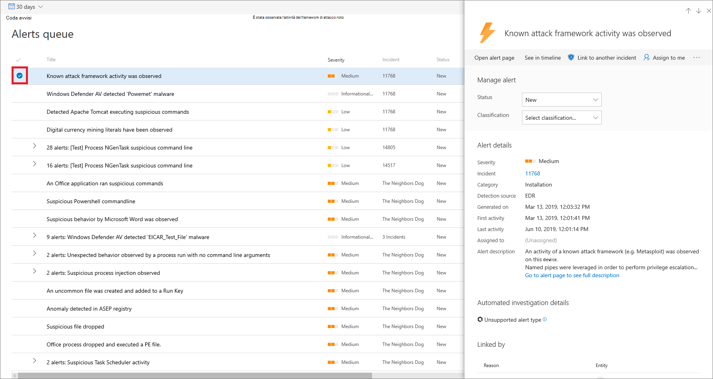

# Gestire gli avvisi di Microsoft Defender for Endpoint

[!INCLUDE [Microsoft 365 Defender rebranding](../../includes/microsoft-defender.md)]

**Si applica a:**
- [Microsoft Defender ATP](https://go.microsoft.com/fwlink/p/?linkid=2146631)
- [Microsoft 365 Defender](https://go.microsoft.com/fwlink/?linkid=2118804)

> Vuoi provare Defender per Endpoint? [Iscriversi per una versione di valutazione gratuita.](https://www.microsoft.com/microsoft-365/windows/microsoft-defender-atp?ocid=docs-wdatp-managealerts-abovefoldlink)

Defender for Endpoint ti informa di possibili eventi dannosi, attributi e informazioni contestuali tramite avvisi. Un riepilogo dei nuovi avvisi viene visualizzato nel **dashboard Operazioni** di sicurezza ed è possibile accedere a tutti gli avvisi nella **coda avvisi.**

Puoi gestire gli avvisi selezionando un avviso nella coda **avvisi** o nella scheda **Avvisi** della pagina Dispositivo per un singolo dispositivo.

Se si seleziona un avviso in una di queste posizioni, verrà visualizzato il **riquadro Gestione avvisi.**

## Collegamento a un altro evento imprevisto
È possibile creare un nuovo evento imprevisto dall'avviso o dal collegamento a un evento imprevisto esistente. 

## Assegnare avvisi
Se non è ancora stato assegnato un avviso, è possibile selezionare Assegna a **me** per assegnare l'avviso a se stessi.

## Eliminare gli avvisi
Potrebbero essere presenti scenari in cui è necessario eliminare la visualizzazione degli avvisi in Microsoft Defender Security Center. Defender for Endpoint consente di creare regole di eliminazione per avvisi specifici noti come innocui, ad esempio strumenti o processi noti nell'organizzazione.

Le regole di eliminazione possono essere create da un avviso esistente. Possono essere disabilitati e rienabledati, se necessario.

Quando viene creata, una regola di eliminazione avrà effetto dal momento in cui viene creata la regola. La regola non influirà sugli avvisi esistenti già presenti nella coda, prima della creazione della regola. La regola verrà applicata solo agli avvisi che soddisfano le condizioni impostate dopo la creazione della regola.

Per una regola di eliminazione è possibile scegliere tra due contesti:

- **Elimina avviso in questo dispositivo**
- **Eliminare l'avviso nell'organizzazione**

Il contesto della regola consente di personalizzare gli elementi che vengono visualizzati nel portale e di verificare che nel portale siano visualizzati solo avvisi di sicurezza reali.

È possibile utilizzare gli esempi riportati nella tabella seguente per scegliere il contesto per una regola di eliminazione:

| **Contesto**                           | **Definizione**                                                                                                                                              | **Scenari di esempio**                                                                                                                                                                                                  |
|:--------------------------------------|:------------------------------------------------------------------------------------------------------------------------------------------------------------|:-----------------------------------------------------------------------------------------------------------------------------------------------------------------------------------------------------------------------|
| **Elimina avviso in questo dispositivo**    | Gli avvisi con lo stesso titolo di avviso e solo su quel dispositivo specifico verranno eliminati.   Tutti gli altri avvisi sul dispositivo non verranno eliminati. | <ul><li>Un ricercatore di sicurezza sta analizzando uno script dannoso usato per attaccare altri dispositivi nell'organizzazione.</li><li>Uno sviluppatore crea regolarmente script di PowerShell per il proprio team.</li></ul> |
| **Eliminare l'avviso nell'organizzazione** | Gli avvisi con lo stesso titolo di avviso su qualsiasi dispositivo verranno eliminati.                                                                                         | <ul><li>Uno strumento di amministrazione benigno viene utilizzato da tutti gli utenti dell'organizzazione.</li></ul>                                                                                                                               |

### Eliminare un avviso e creare una nuova regola di eliminazione:
Creare regole personalizzate per controllare quando gli avvisi vengono eliminati o risolti. È possibile controllare il contesto per l'eliminazione di un avviso specificando il titolo dell'avviso, l'indicatore di compromissione e le condizioni. Dopo aver specificato il contesto, sarà possibile configurare l'azione e l'ambito dell'avviso. 

1. Seleziona l'avviso che vuoi eliminare. Verrà visualizzato il **riquadro Gestione** avvisi.

2.  Selezionare **Crea una regola di eliminazione.**

    Puoi creare una condizione di eliminazione usando questi attributi. Un operatore AND viene applicato tra ogni condizione, pertanto l'eliminazione viene eseguita solo se vengono soddisfatte tutte le condizioni.
    
    * File SHA1
    * Nome file - Caratteri jolly supportati
    * Percorso cartella - Caratteri jolly supportati
    * Indirizzo IP
    * URL - Caratteri jolly supportati
    * Riga di comando - Caratteri jolly supportati

3. Selezionare **l'attivazione di IOC**.
    
4. Specificare l'azione e l'ambito dell'avviso.  
   È possibile risolvere automaticamente un avviso o nasconderlo dal portale. Gli avvisi risolti automaticamente verranno visualizzati nella sezione risolta della coda degli avvisi, della pagina di avviso e della sequenza temporale del dispositivo e verranno visualizzati come risolti nelle API defender per endpoint.    Gli avvisi contrassegnati come nascosti verranno eliminati dall'intero sistema, sia dagli avvisi associati al dispositivo che dal dashboard e non verranno trasmessi tra le API di Defender for Endpoint.

5. Immettere un nome di regola e un commento.

6. Fare clic su **Salva**.

#### Visualizzare l'elenco delle regole di eliminazione

1. Nel riquadro di spostamento selezionare **Impostazioni**  >  **Eliminazione avviso.**

2. L'elenco delle regole di eliminazione mostra tutte le regole create dagli utenti dell'organizzazione.

Per ulteriori informazioni sulla gestione delle regole di eliminazione, vedere [Manage suppression rules](manage-suppression-rules.md)

## Modificare lo stato di un avviso

È possibile categorizzare gli avvisi (come **Nuovo,** **In corso** o **Risolto)** modificandone lo stato durante l'avanzamento dell'indagine. Ciò consente di organizzare e gestire il modo in cui il team può rispondere agli avvisi.

Ad esempio, un responsabile del team può esaminare tutti **i nuovi** avvisi e decidere di assegnarli alla **coda In** corso per un'ulteriore analisi.

In alternativa, il responsabile del team  potrebbe assegnare l'avviso alla coda Risolta se sa che l'avviso è benigno, proveniente da un dispositivo irrilevante (ad esempio un utente appartenente a un amministratore della sicurezza) o gestito tramite un avviso precedente.

## Classificazione degli avvisi
È possibile scegliere di non impostare una classificazione o di specificare se un avviso è un avviso vero o falso. È importante fornire la classificazione del vero positivo/falso positivo. Questa classificazione viene utilizzata per monitorare la qualità degli avvisi e rendere gli avvisi più accurati. Il campo "determinazione" definisce una fedeltà aggiuntiva per una classificazione "vero positivo". 

## Aggiungere commenti e visualizzare la cronologia di un avviso
È possibile aggiungere commenti e visualizzare eventi cronologici relativi a un avviso per visualizzare le modifiche precedenti apportate all'avviso.

Ogni volta che viene apportata una modifica o un commento a un avviso, questa viene registrata nella sezione Commenti **e** cronologia.

I commenti aggiunti vengono visualizzati istantaneamente nel pannello.

## Argomenti correlati
- [Gestire le regole di eliminazione](manage-suppression-rules.md)
- [Visualizzare e organizzare la coda di Microsoft Defender for Endpoint Alerts](alerts-queue.md)
- [Analizzare gli avvisi di Microsoft Defender for Endpoint](investigate-alerts.md)
- [Analizzare un file associato a un avviso di Microsoft Defender for Endpoint](investigate-files.md)
- [Analizzare i dispositivi nell'elenco Di Microsoft Defender per dispositivi endpoint](investigate-machines.md)
- [Analizzare un indirizzo IP associato a un avviso di Microsoft Defender for Endpoint](investigate-ip.md)
- [Analizzare un dominio associato a un avviso di Microsoft Defender for Endpoint](investigate-domain.md)
- [Analizzare un account utente in Microsoft Defender for Endpoint](investigate-user.md)
