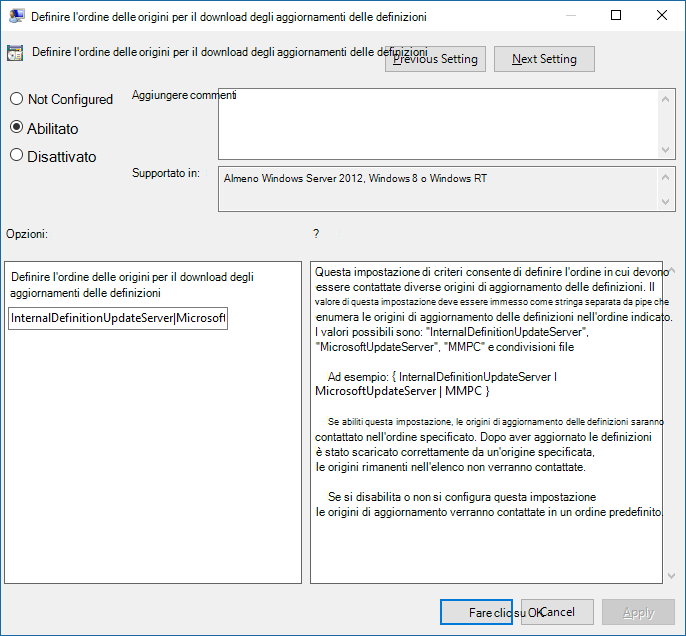

# <a name="manage-the-sources-for-microsoft-defender-antivirus-protection-updates"></a><span data-ttu-id="67082-104">Gestire le origini per gli aggiornamenti di protezione di Microsoft Defender Antivirus</span><span class="sxs-lookup"><span data-stu-id="67082-104">Manage the sources for Microsoft Defender Antivirus protection updates</span></span>

[!INCLUDE [Microsoft 365 Defender rebranding](../../includes/microsoft-defender.md)]


<span data-ttu-id="67082-105">**Si applica a:**</span><span class="sxs-lookup"><span data-stu-id="67082-105">**Applies to:**</span></span>

- [<span data-ttu-id="67082-106">Microsoft Defender per endpoint</span><span class="sxs-lookup"><span data-stu-id="67082-106">Microsoft Defender for Endpoint</span></span>](https://go.microsoft.com/fwlink/p/?linkid=22154037)

<a id="protection-updates"></a>
<!-- this has been used as anchor in VDI content -->

<span data-ttu-id="67082-107">Mantenere aggiornata la protezione antivirus è fondamentale.</span><span class="sxs-lookup"><span data-stu-id="67082-107">Keeping your antivirus protection up to date is critical.</span></span> <span data-ttu-id="67082-108">Esistono due componenti per la gestione degli aggiornamenti di protezione per Microsoft Defender Antivirus:</span><span class="sxs-lookup"><span data-stu-id="67082-108">There are two components to managing protection updates for Microsoft Defender Antivirus:</span></span> 
- <span data-ttu-id="67082-109">*Da* dove vengono scaricati gli aggiornamenti; e</span><span class="sxs-lookup"><span data-stu-id="67082-109">*Where* the updates are downloaded from; and</span></span> 
- <span data-ttu-id="67082-110">*Quando* gli aggiornamenti vengono scaricati e applicati.</span><span class="sxs-lookup"><span data-stu-id="67082-110">*When* updates are downloaded and applied.</span></span> 

<span data-ttu-id="67082-111">In questo articolo viene descritto come specificare da dove scaricare gli aggiornamenti (questo è noto anche come ordine di fallback).</span><span class="sxs-lookup"><span data-stu-id="67082-111">This article describes how to specify from where updates should be downloaded (this is also known as the fallback order).</span></span> <span data-ttu-id="67082-112">Vedi l'argomento Gestire gli aggiornamenti di [Microsoft Defender Antivirus](manage-updates-baselines-microsoft-defender-antivirus.md) e applicare le linee di base per una panoramica sul funzionamento degli aggiornamenti e su come configurare altri aspetti degli aggiornamenti (ad esempio la pianificazione degli aggiornamenti).</span><span class="sxs-lookup"><span data-stu-id="67082-112">See [Manage Microsoft Defender Antivirus updates and apply baselines](manage-updates-baselines-microsoft-defender-antivirus.md) topic for an overview on how updates work, and how to configure other aspects of updates (such as scheduling updates).</span></span>

> [!IMPORTANT]
> <span data-ttu-id="67082-113">Gli aggiornamenti dell'intelligence per la sicurezza di Microsoft Defender Antivirus vengono recapitati tramite Windows Update e a partire da lunedì 21 ottobre 2019, tutti gli aggiornamenti di intelligence per la sicurezza saranno firmati esclusivamente con SHA-2.</span><span class="sxs-lookup"><span data-stu-id="67082-113">Microsoft Defender Antivirus Security intelligence updates are delivered through Windows Update and starting Monday, October 21, 2019, all security intelligence updates will be SHA-2 signed exclusively.</span></span> <span data-ttu-id="67082-114">I dispositivi devono essere aggiornati per supportare SHA-2 per aggiornare le informazioni di sicurezza.</span><span class="sxs-lookup"><span data-stu-id="67082-114">Your devices must be updated to support SHA-2 in order to update your security intelligence.</span></span> <span data-ttu-id="67082-115">Per altre informazioni, vedi Requisiti di supporto per la firma del codice [SHA-2 per Windows e WSUS 2019.](https://support.microsoft.com/help/4472027/2019-sha-2-code-signing-support-requirement-for-windows-and-wsus)</span><span class="sxs-lookup"><span data-stu-id="67082-115">To learn more, see [2019 SHA-2 Code Signing Support requirement for Windows and WSUS](https://support.microsoft.com/help/4472027/2019-sha-2-code-signing-support-requirement-for-windows-and-wsus).</span></span>  


<a id="fallback-order"></a>

## <a name="fallback-order"></a><span data-ttu-id="67082-116">Ordine di fallback</span><span class="sxs-lookup"><span data-stu-id="67082-116">Fallback order</span></span>

<span data-ttu-id="67082-117">In genere, si configurano gli endpoint per scaricare singolarmente gli aggiornamenti da un'origine principale seguita da altre origini in ordine di priorità, in base alla configurazione di rete.</span><span class="sxs-lookup"><span data-stu-id="67082-117">Typically, you configure endpoints to individually download updates from a primary source followed by other sources in order of priority, based on your network configuration.</span></span> <span data-ttu-id="67082-118">Gli aggiornamenti vengono ottenuti dalle origini nell'ordine specificato.</span><span class="sxs-lookup"><span data-stu-id="67082-118">Updates are obtained from sources in the order you specify.</span></span> <span data-ttu-id="67082-119">Se non è disponibile un'origine, viene utilizzata immediatamente l'origine successiva nell'elenco.</span><span class="sxs-lookup"><span data-stu-id="67082-119">If a source is not available, the next source in the list is used immediately.</span></span>

<span data-ttu-id="67082-120">Quando vengono pubblicati gli aggiornamenti, viene applicata una logica per ridurre al minimo le dimensioni dell'aggiornamento.</span><span class="sxs-lookup"><span data-stu-id="67082-120">When updates are published, some logic is applied to minimize the size of the update.</span></span> <span data-ttu-id="67082-121">Nella maggior parte dei casi, vengono scaricate e applicate solo le differenze tra l'aggiornamento più recente e l'aggiornamento attualmente installato (denominato delta).</span><span class="sxs-lookup"><span data-stu-id="67082-121">In most cases, only the differences between the latest update and the update that is currently installed (this is referred to as the delta) on the device is downloaded and applied.</span></span> <span data-ttu-id="67082-122">Tuttavia, le dimensioni del delta dipendono da due fattori principali:</span><span class="sxs-lookup"><span data-stu-id="67082-122">However, the size of the delta depends on two main factors:</span></span>
- <span data-ttu-id="67082-123">Validità dell'ultimo aggiornamento nel dispositivo; e</span><span class="sxs-lookup"><span data-stu-id="67082-123">The age of the last update on the device; and</span></span> 
- <span data-ttu-id="67082-124">Origine utilizzata per scaricare e applicare gli aggiornamenti.</span><span class="sxs-lookup"><span data-stu-id="67082-124">The source used to download and apply updates.</span></span> 

<span data-ttu-id="67082-125">Più vecchi sono gli aggiornamenti in un endpoint, più grande sarà il download.</span><span class="sxs-lookup"><span data-stu-id="67082-125">The older the updates on an endpoint, the larger the download will be.</span></span> <span data-ttu-id="67082-126">Tuttavia, è necessario considerare anche la frequenza di download.</span><span class="sxs-lookup"><span data-stu-id="67082-126">However, you must also consider download frequency as well.</span></span> <span data-ttu-id="67082-127">Una pianificazione di aggiornamento più frequente può comportare un maggiore utilizzo della rete, mentre una pianificazione meno frequente può comportare dimensioni di file più grandi per download.</span><span class="sxs-lookup"><span data-stu-id="67082-127">A more frequent update schedule can result in more network usage, whereas a less-frequent schedule can result in larger file sizes per download.</span></span> 

<span data-ttu-id="67082-128">Esistono cinque posizioni in cui è possibile specificare dove un endpoint deve ottenere gli aggiornamenti:</span><span class="sxs-lookup"><span data-stu-id="67082-128">There are five locations where you can specify where an endpoint should obtain updates:</span></span> 

- [<span data-ttu-id="67082-129">Microsoft Update</span><span class="sxs-lookup"><span data-stu-id="67082-129">Microsoft Update</span></span>](https://support.microsoft.com/help/12373/windows-update-faq)
- [<span data-ttu-id="67082-130">Windows Server Update Service</span><span class="sxs-lookup"><span data-stu-id="67082-130">Windows Server Update Service</span></span>](/windows-server/administration/windows-server-update-services/get-started/windows-server-update-services-wsus)
- [<span data-ttu-id="67082-131">Microsoft Endpoint Configuration Manager</span><span class="sxs-lookup"><span data-stu-id="67082-131">Microsoft Endpoint Configuration Manager</span></span>](/configmgr/core/servers/manage/updates)
- [<span data-ttu-id="67082-132">Condivisione file di rete</span><span class="sxs-lookup"><span data-stu-id="67082-132">Network file share</span></span>](#unc-share)
- <span data-ttu-id="67082-133">Aggiornamenti di intelligence per la sicurezza per Microsoft Defender Antivirus e altri [antimalware Microsoft](https://www.microsoft.com/en-us/wdsi/defenderupdates) (i criteri e il Registro di sistema potrebbero essere elencati come intelligence di sicurezza Microsoft Malware Protection Center (MMPC), il suo nome precedente.</span><span class="sxs-lookup"><span data-stu-id="67082-133">[Security intelligence updates for Microsoft Defender Antivirus and other Microsoft antimalware](https://www.microsoft.com/en-us/wdsi/defenderupdates) (Your policy and registry might have this listed as Microsoft Malware Protection Center (MMPC) security intelligence, its former name.)</span></span>

<span data-ttu-id="67082-134">Per garantire il miglior livello di protezione, Microsoft Update consente rilasci rapidi, ovvero download più piccoli su base frequente.</span><span class="sxs-lookup"><span data-stu-id="67082-134">To ensure the best level of protection, Microsoft Update allows for rapid releases, which means smaller downloads on a frequent basis.</span></span> <span data-ttu-id="67082-135">Le origini degli aggiornamenti di Windows Server Update Service, Microsoft Endpoint Configuration Manager e Microsoft Security Intelligence offrono aggiornamenti meno frequenti.</span><span class="sxs-lookup"><span data-stu-id="67082-135">The Windows Server Update Service, Microsoft Endpoint Configuration Manager, and Microsoft security intelligence updates sources deliver less frequent updates.</span></span> <span data-ttu-id="67082-136">Di conseguenza, il delta può essere più grande, con conseguente download più grandi.</span><span class="sxs-lookup"><span data-stu-id="67082-136">Thus, the delta can be larger, resulting in larger downloads.</span></span> 

> [!IMPORTANT]
> <span data-ttu-id="67082-137">Se gli aggiornamenti delle pagine di Intelligence per la sicurezza [Microsoft](https://www.microsoft.com/security/portal/definitions/adl.aspx) sono stati impostati come origine di fallback dopo Windows Server Update Service o Microsoft Update, gli aggiornamenti vengono scaricati solo dagli aggiornamenti delle funzionalità di intelligence per la sicurezza quando l'aggiornamento corrente viene considerato non aggiornato.</span><span class="sxs-lookup"><span data-stu-id="67082-137">If you have set [Microsoft Security intelligence page](https://www.microsoft.com/security/portal/definitions/adl.aspx) updates as a fallback source after Windows Server Update Service or Microsoft Update, updates are only downloaded from security intelligence updates when the current update is considered out-of-date.</span></span> <span data-ttu-id="67082-138">Per impostazione predefinita, si tratta di sette giorni consecutivi in cui non è possibile applicare gli aggiornamenti dal servizio Windows Server Update o dai servizi Microsoft Update.</span><span class="sxs-lookup"><span data-stu-id="67082-138">(By default, this is seven consecutive days of not being able to apply updates from the Windows Server Update Service or Microsoft Update services).</span></span>
> <span data-ttu-id="67082-139">È tuttavia possibile impostare il numero di giorni prima che la protezione venga segnalata come [non aggiornata.](/windows/threat-protection/microsoft-defender-antivirus/manage-outdated-endpoints-microsoft-defender-antivirus#set-the-number-of-days-before-protection-is-reported-as-out-of-date)</span><span class="sxs-lookup"><span data-stu-id="67082-139">You can, however, [set the number of days before protection is reported as out-of-date](/windows/threat-protection/microsoft-defender-antivirus/manage-outdated-endpoints-microsoft-defender-antivirus#set-the-number-of-days-before-protection-is-reported-as-out-of-date).</span></span><p>
> <span data-ttu-id="67082-140">A partire da lunedì 21 ottobre 2019, gli aggiornamenti dell'intelligence per la sicurezza saranno firmati in esclusiva con SHA-2.</span><span class="sxs-lookup"><span data-stu-id="67082-140">Starting Monday, October 21, 2019, security intelligence updates will be SHA-2 signed exclusively.</span></span> <span data-ttu-id="67082-141">I dispositivi devono essere aggiornati per supportare SHA-2 per ottenere gli aggiornamenti più recenti delle funzionalità di intelligence per la sicurezza.</span><span class="sxs-lookup"><span data-stu-id="67082-141">Devices must be updated to support SHA-2 in order to get the latest security intelligence updates.</span></span> <span data-ttu-id="67082-142">Per altre informazioni, vedi Requisiti di supporto per la firma del codice [SHA-2 per Windows e WSUS 2019.](https://support.microsoft.com/help/4472027/2019-sha-2-code-signing-support-requirement-for-windows-and-wsus)</span><span class="sxs-lookup"><span data-stu-id="67082-142">To learn more, see [2019 SHA-2 Code Signing Support requirement for Windows and WSUS](https://support.microsoft.com/help/4472027/2019-sha-2-code-signing-support-requirement-for-windows-and-wsus).</span></span>

<span data-ttu-id="67082-143">Ogni origine presenta scenari tipici che dipendono dalla configurazione della rete, oltre alla frequenza con cui pubblicano gli aggiornamenti, come descritto nella tabella seguente:</span><span class="sxs-lookup"><span data-stu-id="67082-143">Each source has typical scenarios that depend on how your network is configured, in addition to how often they publish updates, as described in the following table:</span></span>

|<span data-ttu-id="67082-144">Posizione</span><span class="sxs-lookup"><span data-stu-id="67082-144">Location</span></span> | <span data-ttu-id="67082-145">Scenario di esempio</span><span class="sxs-lookup"><span data-stu-id="67082-145">Sample scenario</span></span> |
|---|---|
|<span data-ttu-id="67082-146">Windows Server Update Service</span><span class="sxs-lookup"><span data-stu-id="67082-146">Windows Server Update Service</span></span> | <span data-ttu-id="67082-147">Si utilizza Windows Server Update Service per gestire gli aggiornamenti per la rete.</span><span class="sxs-lookup"><span data-stu-id="67082-147">You are using Windows Server Update Service to manage updates for your network.</span></span>|
|<span data-ttu-id="67082-148">Microsoft Update</span><span class="sxs-lookup"><span data-stu-id="67082-148">Microsoft Update</span></span> | <span data-ttu-id="67082-149">Vuoi che gli endpoint si connettano direttamente a Microsoft Update.</span><span class="sxs-lookup"><span data-stu-id="67082-149">You want your endpoints to connect directly to Microsoft Update.</span></span> <span data-ttu-id="67082-150">Ciò può essere utile per gli endpoint che si connettono in modo irregolare alla rete aziendale o se non si utilizza Windows Server Update Service per gestire gli aggiornamenti.</span><span class="sxs-lookup"><span data-stu-id="67082-150">This can be useful for endpoints that irregularly connect to your enterprise network, or if you do not use Windows Server Update Service to manage your updates.</span></span>|
|<span data-ttu-id="67082-151">Condivisione file</span><span class="sxs-lookup"><span data-stu-id="67082-151">File share</span></span> | <span data-ttu-id="67082-152">Si dispone di dispositivi non connessi a Internet ,ad esempio macchine virtuali.</span><span class="sxs-lookup"><span data-stu-id="67082-152">You have non-Internet-connected devices (such as VMs).</span></span> <span data-ttu-id="67082-153">È possibile usare l'host vm connesso a Internet per scaricare gli aggiornamenti in una condivisione di rete, da cui le macchine virtuali possono ottenere gli aggiornamenti.</span><span class="sxs-lookup"><span data-stu-id="67082-153">You can use your Internet-connected VM host to download the updates to a network share, from which the VMs can obtain the updates.</span></span> <span data-ttu-id="67082-154">Vedi la [guida alla distribuzione di VDI](deployment-vdi-microsoft-defender-antivirus.md) per informazioni su come usare le condivisioni file in ambienti VDI (Virtual Desktop Infrastructure).</span><span class="sxs-lookup"><span data-stu-id="67082-154">See the [VDI deployment guide](deployment-vdi-microsoft-defender-antivirus.md) for how file shares can be used in virtual desktop infrastructure (VDI) environments.</span></span>|
|<span data-ttu-id="67082-155">Microsoft Endpoint Manager</span><span class="sxs-lookup"><span data-stu-id="67082-155">Microsoft Endpoint Manager</span></span> | <span data-ttu-id="67082-156">Si utilizza Microsoft Endpoint Manager per aggiornare gli endpoint.</span><span class="sxs-lookup"><span data-stu-id="67082-156">You are using Microsoft Endpoint Manager to update your endpoints.</span></span>|
|<span data-ttu-id="67082-157">Aggiornamenti di intelligence per la sicurezza per Microsoft Defender Antivirus e altri antimalware Microsoft (in precedenza noto come MMPC)</span><span class="sxs-lookup"><span data-stu-id="67082-157">Security intelligence updates for Microsoft Defender Antivirus and other Microsoft antimalware (formerly referred to as MMPC)</span></span> |<span data-ttu-id="67082-158">[Assicurati che i dispositivi siano aggiornati per supportare SHA-2.](https://support.microsoft.com/help/4472027/2019-sha-2-code-signing-support-requirement-for-windows-and-wsus)</span><span class="sxs-lookup"><span data-stu-id="67082-158">[Make sure your devices are updated to support SHA-2](https://support.microsoft.com/help/4472027/2019-sha-2-code-signing-support-requirement-for-windows-and-wsus).</span></span> <span data-ttu-id="67082-159">Gli aggiornamenti di Intelligence per la sicurezza di Microsoft Defender Antivirus vengono recapitati tramite Windows Update e a partire da lunedì 21 ottobre 2019 gli aggiornamenti di intelligence per la sicurezza saranno firmati esclusivamente da SHA-2.</span><span class="sxs-lookup"><span data-stu-id="67082-159">Microsoft Defender Antivirus Security intelligence updates are delivered through Windows Update, and starting Monday October 21, 2019 security intelligence updates will be SHA-2 signed exclusively.</span></span> <br/><span data-ttu-id="67082-160">Scaricare gli aggiornamenti di protezione più recenti a causa di un'infezione recente o per fornire un'immagine di base avanzata per [la distribuzione VDI.](deployment-vdi-microsoft-defender-antivirus.md)</span><span class="sxs-lookup"><span data-stu-id="67082-160">Download the latest protection updates because of a recent infection or to help provision a strong, base image for [VDI deployment](deployment-vdi-microsoft-defender-antivirus.md).</span></span> <span data-ttu-id="67082-161">Questa opzione in genere deve essere utilizzata solo come origine di fallback finale e non come origine primaria.</span><span class="sxs-lookup"><span data-stu-id="67082-161">This option should generally be used only as a final fallback source, and not the primary source.</span></span> <span data-ttu-id="67082-162">Verrà utilizzato solo se non è possibile scaricare gli aggiornamenti da Windows Server Update Service o Microsoft Update per [un numero di giorni specificato.](/windows/threat-protection/microsoft-defender-antivirus/manage-outdated-endpoints-microsoft-defender-antivirus#set-the-number-of-days-before-protection-is-reported-as-out-of-date)</span><span class="sxs-lookup"><span data-stu-id="67082-162">It will only be used if updates cannot be downloaded from Windows Server Update Service or Microsoft Update for [a specified number of days](/windows/threat-protection/microsoft-defender-antivirus/manage-outdated-endpoints-microsoft-defender-antivirus#set-the-number-of-days-before-protection-is-reported-as-out-of-date).</span></span>|

<span data-ttu-id="67082-163">È possibile gestire l'ordine in cui le origini di aggiornamento vengono utilizzate con Criteri di gruppo, Microsoft Endpoint Configuration Manager, cmdlet di PowerShell e WMI.</span><span class="sxs-lookup"><span data-stu-id="67082-163">You can manage the order in which update sources are used with Group Policy, Microsoft Endpoint Configuration Manager, PowerShell cmdlets, and WMI.</span></span>

> [!IMPORTANT]
> <span data-ttu-id="67082-164">Se si imposta Windows Server Update Service come percorso di download, è necessario approvare gli aggiornamenti, indipendentemente dello strumento di gestione utilizzato per specificare il percorso.</span><span class="sxs-lookup"><span data-stu-id="67082-164">If you set Windows Server Update Service as a download location, you must approve the updates, regardless of the management tool you use to specify the location.</span></span> <span data-ttu-id="67082-165">È possibile configurare una regola di approvazione automatica con Windows Server Update Service, che potrebbe essere utile in quanto gli aggiornamenti arrivano almeno una volta al giorno.</span><span class="sxs-lookup"><span data-stu-id="67082-165">You can set up an automatic approval rule with Windows Server Update Service, which might be useful as updates arrive at least once a day.</span></span> <span data-ttu-id="67082-166">Per altre informazioni, vedi [sincronizzare gli aggiornamenti di Endpoint Protection in Windows Server Update Service autonomo.](/configmgr/protect/deploy-use/endpoint-definitions-wsus#to-synchronize-endpoint-protection-definition-updates-in-standalone-wsus)</span><span class="sxs-lookup"><span data-stu-id="67082-166">To learn more, see [synchronize endpoint protection updates in standalone Windows Server Update Service](/configmgr/protect/deploy-use/endpoint-definitions-wsus#to-synchronize-endpoint-protection-definition-updates-in-standalone-wsus).</span></span>

<span data-ttu-id="67082-167">Le procedure descritte in questo articolo descrivono innanzitutto come impostare l'ordine e quindi come configurare l'opzione **Condivisione file,** se è stata abilitata.</span><span class="sxs-lookup"><span data-stu-id="67082-167">The procedures in this article first describe how to set the order, and then how to set up the **File share** option if you have enabled it.</span></span>

## <a name="use-group-policy-to-manage-the-update-location"></a><span data-ttu-id="67082-168">Utilizzare Criteri di gruppo per gestire il percorso di aggiornamento</span><span class="sxs-lookup"><span data-stu-id="67082-168">Use Group Policy to manage the update location</span></span>

1. <span data-ttu-id="67082-169">Nel computer di gestione di Criteri di gruppo, aprire Console Gestione Criteri di [gruppo,](/previous-versions/windows/it-pro/windows-server-2008-R2-and-2008/cc731212(v=ws.11))fare clic con il pulsante destro del mouse sull'oggetto Criteri di gruppo che si desidera configurare e scegliere **Modifica**.</span><span class="sxs-lookup"><span data-stu-id="67082-169">On your Group Policy management machine, open the [Group Policy Management Console](/previous-versions/windows/it-pro/windows-server-2008-R2-and-2008/cc731212(v=ws.11)), right-click the Group Policy Object you want to configure and click **Edit**.</span></span>

2. <span data-ttu-id="67082-170">**Nell'Editor Gestione Criteri di gruppo** passare a Configurazione **computer**.</span><span class="sxs-lookup"><span data-stu-id="67082-170">In the **Group Policy Management Editor** go to **Computer configuration**.</span></span>

3. <span data-ttu-id="67082-171">Fare **clic su Criteri** e quindi su Modelli **amministrativi.**</span><span class="sxs-lookup"><span data-stu-id="67082-171">Click **Policies** then **Administrative templates**.</span></span>

4. <span data-ttu-id="67082-172">Espandi l'albero **fino ai componenti di Windows > Windows Defender > aggiornamenti delle firme** e configura le impostazioni seguenti:</span><span class="sxs-lookup"><span data-stu-id="67082-172">Expand the tree to **Windows components > Windows Defender > Signature updates** and configure the following settings:</span></span>

   1.  <span data-ttu-id="67082-173">Fare doppio clic **sull'impostazione Definisci l'ordine** delle origini per il download degli aggiornamenti delle funzionalità di intelligence per la sicurezza e impostare l'opzione su **Abilitato.**</span><span class="sxs-lookup"><span data-stu-id="67082-173">Double-click the **Define the order of sources for downloading security intelligence updates** setting and set the option to **Enabled**.</span></span>

   2.  <span data-ttu-id="67082-174">Immettere l'ordine delle origini, separato da una singola pipe, ad esempio: `InternalDefinitionUpdateServer|MicrosoftUpdateServer|MMPC` , come illustrato nello screenshot seguente.</span><span class="sxs-lookup"><span data-stu-id="67082-174">Enter the order of sources, separated by a single pipe, for example: `InternalDefinitionUpdateServer|MicrosoftUpdateServer|MMPC`, as shown in the following screenshot.</span></span>

   

   3. <span data-ttu-id="67082-176">Fare clic su **OK**.</span><span class="sxs-lookup"><span data-stu-id="67082-176">Click **OK**.</span></span> <span data-ttu-id="67082-177">In questo modo verrà impostato l'ordine delle origini degli aggiornamenti di protezione.</span><span class="sxs-lookup"><span data-stu-id="67082-177">This will set the order of protection update sources.</span></span>

   4. <span data-ttu-id="67082-178">Fare doppio clic **sull'impostazione Definisci condivisioni file per il download degli aggiornamenti di Security Intelligence** e impostare l'opzione su **Abilitato.**</span><span class="sxs-lookup"><span data-stu-id="67082-178">Double-click the **Define file shares for downloading security intelligence updates** setting and set the option to **Enabled**.</span></span>

   5. <span data-ttu-id="67082-179">Immettere l'origine della condivisione file.</span><span class="sxs-lookup"><span data-stu-id="67082-179">Enter the file share source.</span></span> <span data-ttu-id="67082-180">Se si dispone di più origini, immettere ogni origine nell'ordine in cui devono essere utilizzate, separate da una singola pipe.</span><span class="sxs-lookup"><span data-stu-id="67082-180">If you have multiple sources, enter each source in the order they should be used, separated by a single pipe.</span></span> <span data-ttu-id="67082-181">Utilizzare [la notazione UNC standard](/openspecs/windows_protocols/ms-dtyp/62e862f4-2a51-452e-8eeb-dc4ff5ee33cc) per denotare il percorso, ad esempio: `\\host-name1\share-name\object-name|\\host-name2\share-name\object-name` .</span><span class="sxs-lookup"><span data-stu-id="67082-181">Use [standard UNC notation](/openspecs/windows_protocols/ms-dtyp/62e862f4-2a51-452e-8eeb-dc4ff5ee33cc) for denoting the path, for example: `\\host-name1\share-name\object-name|\\host-name2\share-name\object-name`.</span></span>  <span data-ttu-id="67082-182">Se non si immette alcun percorso, questa origine verrà ignorata quando la macchina virtuale scarica gli aggiornamenti.</span><span class="sxs-lookup"><span data-stu-id="67082-182">If you do not enter any paths, then this source will be skipped when the VM downloads updates.</span></span>

   6. <span data-ttu-id="67082-183">Fare clic su **OK**.</span><span class="sxs-lookup"><span data-stu-id="67082-183">Click **OK**.</span></span> <span data-ttu-id="67082-184">In questo modo verrà impostato l'ordine delle  condivisioni file quando viene fatto riferimento a tale origine nell'impostazione di Criteri di gruppo Definisci l'ordine delle origini.</span><span class="sxs-lookup"><span data-stu-id="67082-184">This will set the order of file shares when that source is referenced in the **Define the order of sources...** group policy setting.</span></span>

> [!NOTE]
> <span data-ttu-id="67082-185">Per Windows 10, versioni 1703 fino a e incluso 1809, il percorso dei criteri è Componenti di **Windows > Microsoft Defender Antivirus > Aggiornamenti** delle firme per Windows 10 versione 1903, il percorso dei criteri è Componenti di Windows > Microsoft Defender Antivirus > Security Intelligence **Updates**</span><span class="sxs-lookup"><span data-stu-id="67082-185">For Windows 10, versions 1703 up to and including 1809, the policy path is **Windows Components > Microsoft Defender Antivirus > Signature Updates** For Windows 10, version 1903, the policy path is **Windows Components > Microsoft Defender Antivirus > Security Intelligence Updates**</span></span>

## <a name="use-configuration-manager-to-manage-the-update-location"></a><span data-ttu-id="67082-186">Usare Configuration Manager per gestire il percorso di aggiornamento</span><span class="sxs-lookup"><span data-stu-id="67082-186">Use Configuration Manager to manage the update location</span></span>

<span data-ttu-id="67082-187">Per informazioni dettagliate sulla configurazione di Microsoft Endpoint Manager (current branch), vedere [Configure Security intelligence Updates for Endpoint Protection.](/configmgr/protect/deploy-use/endpoint-definition-updates)</span><span class="sxs-lookup"><span data-stu-id="67082-187">See [Configure Security intelligence Updates for Endpoint Protection](/configmgr/protect/deploy-use/endpoint-definition-updates) for details on configuring Microsoft Endpoint Manager (current branch).</span></span>


## <a name="use-powershell-cmdlets-to-manage-the-update-location"></a><span data-ttu-id="67082-188">Utilizzare i cmdlet di PowerShell per gestire il percorso di aggiornamento</span><span class="sxs-lookup"><span data-stu-id="67082-188">Use PowerShell cmdlets to manage the update location</span></span>

<span data-ttu-id="67082-189">Utilizzare i cmdlet di PowerShell seguenti per impostare l'ordine di aggiornamento.</span><span class="sxs-lookup"><span data-stu-id="67082-189">Use the following PowerShell cmdlets to set the update order.</span></span>

```PowerShell
Set-MpPreference -SignatureFallbackOrder {LOCATION|LOCATION|LOCATION|LOCATION}
Set-MpPreference -SignatureDefinitionUpdateFileSharesSource {\\UNC SHARE PATH|\\UNC SHARE PATH}
```
<span data-ttu-id="67082-190">Per ulteriori informazioni, vedere gli articoli seguenti:</span><span class="sxs-lookup"><span data-stu-id="67082-190">See the following articles for more information:</span></span>
- [<span data-ttu-id="67082-191">Set-MpPreference -SignatureFallbackOrder</span><span class="sxs-lookup"><span data-stu-id="67082-191">Set-MpPreference -SignatureFallbackOrder</span></span>](/powershell/module/defender/set-mppreference)
- [<span data-ttu-id="67082-192">Set-MpPreference -SignatureDefinitionUpdateFileSharesSource</span><span class="sxs-lookup"><span data-stu-id="67082-192">Set-MpPreference -SignatureDefinitionUpdateFileSharesSource</span></span>](/powershell/module/defender/set-mppreference#-signaturedefinitionupdatefilesharessources)
- [<span data-ttu-id="67082-193">Utilizzare i cmdlet di PowerShell per configurare ed eseguire Microsoft Defender Antivirus</span><span class="sxs-lookup"><span data-stu-id="67082-193">Use PowerShell cmdlets to configure and run Microsoft Defender Antivirus</span></span>](use-powershell-cmdlets-microsoft-defender-antivirus.md)
- [<span data-ttu-id="67082-194">Cmdlet defender</span><span class="sxs-lookup"><span data-stu-id="67082-194">Defender cmdlets</span></span>](/powershell/module/defender/index)

## <a name="use-windows-management-instruction-wmi-to-manage-the-update-location"></a><span data-ttu-id="67082-195">Utilizzare Windows Management Instruction (WMI) per gestire il percorso di aggiornamento</span><span class="sxs-lookup"><span data-stu-id="67082-195">Use Windows Management Instruction (WMI) to manage the update location</span></span>

<span data-ttu-id="67082-196">Utilizzare il [ **metodo Set** della **classe MSFT_MpPreference**](/previous-versions/windows/desktop/legacy/dn455323(v=vs.85)) per le proprietà seguenti:</span><span class="sxs-lookup"><span data-stu-id="67082-196">Use the [**Set** method of the **MSFT_MpPreference**](/previous-versions/windows/desktop/legacy/dn455323(v=vs.85)) class for the following properties:</span></span>

```WMI
SignatureFallbackOrder
SignatureDefinitionUpdateFileSharesSource
```

<span data-ttu-id="67082-197">Per ulteriori informazioni, vedere gli articoli seguenti:</span><span class="sxs-lookup"><span data-stu-id="67082-197">See the following articles for more information:</span></span>
- [<span data-ttu-id="67082-198">Windows Defender API WMIv2</span><span class="sxs-lookup"><span data-stu-id="67082-198">Windows Defender WMIv2 APIs</span></span>](/previous-versions/windows/desktop/defender/windows-defender-wmiv2-apis-portal)

## <a name="use-mobile-device-management-mdm-to-manage-the-update-location"></a><span data-ttu-id="67082-199">Usare Gestione dispositivi mobili (MDM) per gestire la posizione di aggiornamento</span><span class="sxs-lookup"><span data-stu-id="67082-199">Use Mobile Device Management (MDM) to manage the update location</span></span>

<span data-ttu-id="67082-200">Vedi [CSP criteri - Defender/SignatureUpdateFallbackOrder](/windows/client-management/mdm/policy-csp-defender#defender-signatureupdatefallbackorder) per informazioni dettagliate sulla configurazione di MDM.</span><span class="sxs-lookup"><span data-stu-id="67082-200">See [Policy CSP - Defender/SignatureUpdateFallbackOrder](/windows/client-management/mdm/policy-csp-defender#defender-signatureupdatefallbackorder) for details on configuring MDM.</span></span>

## <a name="what-if-were-using-a-third-party-vendor"></a><span data-ttu-id="67082-201">Cosa succede se si utilizza un fornitore di terze parti?</span><span class="sxs-lookup"><span data-stu-id="67082-201">What if we're using a third-party vendor?</span></span>

<span data-ttu-id="67082-202">Questo articolo descrive come configurare e gestire gli aggiornamenti per Microsoft Defender Antivirus.</span><span class="sxs-lookup"><span data-stu-id="67082-202">This article describes how to configure and manage updates for Microsoft Defender Antivirus.</span></span> <span data-ttu-id="67082-203">Tuttavia, è possibile utilizzare fornitori di terze parti per eseguire queste attività.</span><span class="sxs-lookup"><span data-stu-id="67082-203">However, third-party vendors can be used to perform these tasks.</span></span> 

<span data-ttu-id="67082-204">Si supponga, ad esempio, che Contoso abbia assunto Fabrikam per gestire la soluzione di sicurezza, che include Microsoft Defender Antivirus.</span><span class="sxs-lookup"><span data-stu-id="67082-204">For example, suppose that Contoso has hired Fabrikam to manage their security solution, which includes Microsoft Defender Antivirus.</span></span> <span data-ttu-id="67082-205">Fabrikam in [genere utilizza Strumentazione](./use-wmi-microsoft-defender-antivirus.md)gestione Windows, i cmdlet di [PowerShell](./use-powershell-cmdlets-microsoft-defender-antivirus.md)o la riga di comando di [Windows](./command-line-arguments-microsoft-defender-antivirus.md) per distribuire patch e aggiornamenti.</span><span class="sxs-lookup"><span data-stu-id="67082-205">Fabrikam typically uses [Windows Management Instrumentation](./use-wmi-microsoft-defender-antivirus.md), [PowerShell cmdlets](./use-powershell-cmdlets-microsoft-defender-antivirus.md), or [Windows command-line](./command-line-arguments-microsoft-defender-antivirus.md) to deploy patches and updates.</span></span> 

> [!NOTE]
> <span data-ttu-id="67082-206">Microsoft non testa soluzioni di terze parti per la gestione di Microsoft Defender Antivirus.</span><span class="sxs-lookup"><span data-stu-id="67082-206">Microsoft does not test third-party solutions for managing Microsoft Defender Antivirus.</span></span>

<a id="unc-share"></a>
## <a name="create-a-unc-share-for-security-intelligence-updates"></a><span data-ttu-id="67082-207">Creare una condivisione UNC per gli aggiornamenti delle funzionalità di intelligence per la sicurezza</span><span class="sxs-lookup"><span data-stu-id="67082-207">Create a UNC share for security intelligence updates</span></span>

<span data-ttu-id="67082-208">Configurare una condivisione file di rete (unità UNC/mappata) per scaricare gli aggiornamenti delle informazioni di sicurezza dal sito MMPC utilizzando un'attività pianificata.</span><span class="sxs-lookup"><span data-stu-id="67082-208">Set up a network file share (UNC/mapped drive) to download security intelligence updates from the MMPC site by using a scheduled task.</span></span>

1. <span data-ttu-id="67082-209">Nel sistema in cui si desidera effettuare il provisioning della condivisione e scaricare gli aggiornamenti, creare una cartella in cui salvare lo script.</span><span class="sxs-lookup"><span data-stu-id="67082-209">On the system on which you want to provision the share and download the updates, create a folder to which you will save the script.</span></span>
    ```DOS
    Start, CMD (Run as admin)
    MD C:\Tool\PS-Scripts\
    ```

2. <span data-ttu-id="67082-210">Creare la cartella in cui si salveranno gli aggiornamenti delle firme.</span><span class="sxs-lookup"><span data-stu-id="67082-210">Create the folder to which you will save the signature updates.</span></span>
    ```DOS
    MD C:\Temp\TempSigs\x64
    MD C:\Temp\TempSigs\x86
    ```

3. <span data-ttu-id="67082-211">Scaricare lo script di PowerShell [da www.powershellgallery.com/packages/SignatureDownloadCustomTask/1.4](https://www.powershellgallery.com/packages/SignatureDownloadCustomTask/1.4).</span><span class="sxs-lookup"><span data-stu-id="67082-211">Download the PowerShell script from [www.powershellgallery.com/packages/SignatureDownloadCustomTask/1.4](https://www.powershellgallery.com/packages/SignatureDownloadCustomTask/1.4).</span></span>

4. <span data-ttu-id="67082-212">Fare clic **su Download manuale**.</span><span class="sxs-lookup"><span data-stu-id="67082-212">Click **Manual Download**.</span></span>

5. <span data-ttu-id="67082-213">Fare **clic su Scarica il file nupkg non elaborato.**</span><span class="sxs-lookup"><span data-stu-id="67082-213">Click **Download the raw nupkg file**.</span></span>

6. <span data-ttu-id="67082-214">Estrarre il file.</span><span class="sxs-lookup"><span data-stu-id="67082-214">Extract the file.</span></span>

7. <span data-ttu-id="67082-215">Copiare il SignatureDownloadCustomTask.ps1 file nella cartella creata in precedenza, C:\Tool\PS-Scripts\ .</span><span class="sxs-lookup"><span data-stu-id="67082-215">Copy the file SignatureDownloadCustomTask.ps1 to the folder you previously created, C:\Tool\PS-Scripts\ .</span></span>

8. <span data-ttu-id="67082-216">Utilizzare la riga di comando per configurare l'attività pianificata.</span><span class="sxs-lookup"><span data-stu-id="67082-216">Use the command line to set up the scheduled task.</span></span>
    > [!NOTE]
    > <span data-ttu-id="67082-217">Esistono due tipi di aggiornamenti: completo e delta.</span><span class="sxs-lookup"><span data-stu-id="67082-217">There are two types of updates: full and delta.</span></span>
   - <span data-ttu-id="67082-218">Per delta x64:</span><span class="sxs-lookup"><span data-stu-id="67082-218">For x64 delta:</span></span>

       ```DOS
       Powershell (Run as admin)
    
       C:\Tool\PS-Scripts\
    
       “.\SignatureDownloadCustomTask.ps1 -action create -arch x64 -isDelta $true -destDir C:\Temp\TempSigs\x64 -scriptPath C:\Tool\PS-Scripts\SignatureDownloadCustomTask.ps1 -daysInterval 1”
       ```

   - <span data-ttu-id="67082-219">Per x64 completo:</span><span class="sxs-lookup"><span data-stu-id="67082-219">For x64 full:</span></span>

       ```DOS
       Powershell (Run as admin)
    
       C:\Tool\PS-Scripts\
    
       “.\SignatureDownloadCustomTask.ps1 -action create -arch x64 -isDelta $false -destDir C:\Temp\TempSigs\x64 -scriptPath C:\Tool\PS-Scripts\SignatureDownloadCustomTask.ps1 -daysInterval 1”
       ```

   - <span data-ttu-id="67082-220">Per delta x86:</span><span class="sxs-lookup"><span data-stu-id="67082-220">For x86 delta:</span></span>

       ```DOS
       Powershell (Run as admin)
    
       C:\Tool\PS-Scripts\
    
       “.\SignatureDownloadCustomTask.ps1 -action create -arch x86 -isDelta $true -destDir C:\Temp\TempSigs\x86 -scriptPath C:\Tool\PS-Scripts\SignatureDownloadCustomTask.ps1 -daysInterval 1”
       ```

   - <span data-ttu-id="67082-221">Per x86 completo:</span><span class="sxs-lookup"><span data-stu-id="67082-221">For x86 full:</span></span>

       ```DOS
       Powershell (Run as admin)
    
       C:\Tool\PS-Scripts\
    
       “.\SignatureDownloadCustomTask.ps1 -action create -arch x86 -isDelta $false -destDir C:\Temp\TempSigs\x86 -scriptPath C:\Tool\PS-Scripts\SignatureDownloadCustomTask.ps1 -daysInterval 1”
       ```

    > [!NOTE]
    > <span data-ttu-id="67082-222">Quando vengono create le attività pianificate, è possibile trovarle nell'Utilità di pianificazione in Microsoft\Windows\Windows Defender</span><span class="sxs-lookup"><span data-stu-id="67082-222">When the scheduled tasks are created, you can find these in the Task Scheduler under Microsoft\Windows\Windows Defender</span></span>
9. <span data-ttu-id="67082-223">Eseguire ogni attività manualmente e verificare di disporre di dati (mpam-d.exe, mpam-fe.exe e nis_full.exe) nelle cartelle seguenti (è possibile che siano state scelte posizioni diverse):</span><span class="sxs-lookup"><span data-stu-id="67082-223">Run each task manually and verify that you have data (mpam-d.exe, mpam-fe.exe, and nis_full.exe) in the following folders (you might have chosen different locations):</span></span>

   - <span data-ttu-id="67082-224">C:\Temp\TempSigs\x86</span><span class="sxs-lookup"><span data-stu-id="67082-224">C:\Temp\TempSigs\x86</span></span>
   - <span data-ttu-id="67082-225">C:\Temp\TempSigs\x64</span><span class="sxs-lookup"><span data-stu-id="67082-225">C:\Temp\TempSigs\x64</span></span>

   <span data-ttu-id="67082-226">Se l'attività pianificata ha esito negativo, eseguire i comandi seguenti:</span><span class="sxs-lookup"><span data-stu-id="67082-226">If the scheduled task fails, run the following commands:</span></span>

    ```DOS
    C:\windows\system32\windowspowershell\v1.0\powershell.exe -NoProfile -executionpolicy allsigned -command “&\”C:\Tool\PS-Scripts\SignatureDownloadCustomTask.ps1\” -action run -arch x64 -isDelta $False -destDir C:\Temp\TempSigs\x64″
    
    C:\windows\system32\windowspowershell\v1.0\powershell.exe -NoProfile -executionpolicy allsigned -command “&\”C:\Tool\PS-Scripts\SignatureDownloadCustomTask.ps1\” -action run -arch x64 -isDelta $True -destDir C:\Temp\TempSigs\x64″
    
    C:\windows\system32\windowspowershell\v1.0\powershell.exe -NoProfile -executionpolicy allsigned -command “&\”C:\Tool\PS-Scripts\SignatureDownloadCustomTask.ps1\” -action run -arch x86 -isDelta $False -destDir C:\Temp\TempSigs\x86″
    
    C:\windows\system32\windowspowershell\v1.0\powershell.exe -NoProfile -executionpolicy allsigned -command “&\”C:\Tool\PS-Scripts\SignatureDownloadCustomTask.ps1\” -action run -arch x86 -isDelta $True -destDir C:\Temp\TempSigs\x86″
    ```
    > [!NOTE]
    > <span data-ttu-id="67082-227">I problemi potrebbero essere dovuti anche ai criteri di esecuzione.</span><span class="sxs-lookup"><span data-stu-id="67082-227">Issues could also be due to execution policy.</span></span>
    
10. <span data-ttu-id="67082-228">Creare una condivisione che punti a C:\Temp\TempSigs (ad \\ esempio, server\aggiornamenti).</span><span class="sxs-lookup"><span data-stu-id="67082-228">Create a share pointing to C:\Temp\TempSigs (e.g. \\server\updates).</span></span>
    > [!NOTE]
    > <span data-ttu-id="67082-229">Come minimo, gli utenti autenticati devono disporre dell'accesso "Lettura".</span><span class="sxs-lookup"><span data-stu-id="67082-229">At a minimum, authenticated users must have “Read” access.</span></span>
11. <span data-ttu-id="67082-230">Imposta il percorso di condivisione nel criterio sulla condivisione.</span><span class="sxs-lookup"><span data-stu-id="67082-230">Set the share location in the policy to the share.</span></span>

    > [!NOTE]
    > <span data-ttu-id="67082-231">Non aggiungere la cartella x64 (o x86) nel percorso.</span><span class="sxs-lookup"><span data-stu-id="67082-231">Do not add the x64 (or x86) folder in the path.</span></span> <span data-ttu-id="67082-232">Il mpcmdrun.exe viene aggiunto automaticamente.</span><span class="sxs-lookup"><span data-stu-id="67082-232">The mpcmdrun.exe process adds it automatically.</span></span>

## <a name="related-articles"></a><span data-ttu-id="67082-233">Articoli correlati</span><span class="sxs-lookup"><span data-stu-id="67082-233">Related articles</span></span>

- [<span data-ttu-id="67082-234">Distribuire Microsoft Defender Antivirus</span><span class="sxs-lookup"><span data-stu-id="67082-234">Deploy Microsoft Defender Antivirus</span></span>](deploy-manage-report-microsoft-defender-antivirus.md)
- [<span data-ttu-id="67082-235">Gestire gli aggiornamenti di Microsoft Defender Antivirus e applicare le linee di base</span><span class="sxs-lookup"><span data-stu-id="67082-235">Manage Microsoft Defender Antivirus updates and apply baselines</span></span>](manage-updates-baselines-microsoft-defender-antivirus.md)
- [<span data-ttu-id="67082-236">Gestire gli aggiornamenti per gli endpoint non aggiornati</span><span class="sxs-lookup"><span data-stu-id="67082-236">Manage updates for endpoints that are out of date</span></span>](manage-outdated-endpoints-microsoft-defender-antivirus.md)
- [<span data-ttu-id="67082-237">Gestire gli aggiornamenti forzati basati su eventi</span><span class="sxs-lookup"><span data-stu-id="67082-237">Manage event-based forced updates</span></span>](manage-event-based-updates-microsoft-defender-antivirus.md)
- [<span data-ttu-id="67082-238">Gestire gli aggiornamenti per dispositivi mobili e macchine virtuali</span><span class="sxs-lookup"><span data-stu-id="67082-238">Manage updates for mobile devices and VMs</span></span>](manage-updates-mobile-devices-vms-microsoft-defender-antivirus.md)
- [<span data-ttu-id="67082-239">Microsoft Defender Antivirus in Windows 10</span><span class="sxs-lookup"><span data-stu-id="67082-239">Microsoft Defender Antivirus in Windows 10</span></span>](microsoft-defender-antivirus-in-windows-10.md)