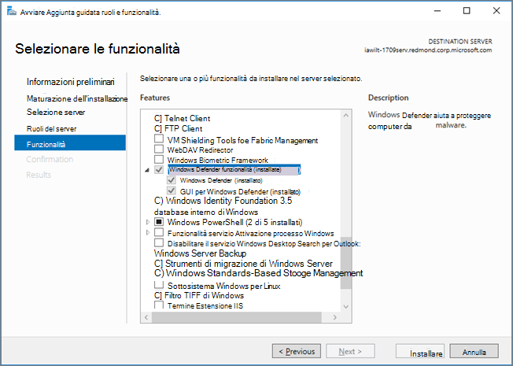

# <a name="microsoft-defender-antivirus-on-windows-server"></a><span data-ttu-id="2dd7c-104">Microsoft Defender Antivirus su Windows Server</span><span class="sxs-lookup"><span data-stu-id="2dd7c-104">Microsoft Defender Antivirus on Windows Server</span></span>

[!INCLUDE [Microsoft 365 Defender rebranding](../../includes/microsoft-defender.md)]

<span data-ttu-id="2dd7c-105">**Si applica a:**</span><span class="sxs-lookup"><span data-stu-id="2dd7c-105">**Applies to:**</span></span>

- [<span data-ttu-id="2dd7c-106">Microsoft Defender per endpoint</span><span class="sxs-lookup"><span data-stu-id="2dd7c-106">Microsoft Defender for Endpoint</span></span>](/microsoft-365/security/defender-endpoint/)

<span data-ttu-id="2dd7c-107">Antivirus Microsoft Defender è disponibile nelle seguenti edizioni/versioni di Windows Server:</span><span class="sxs-lookup"><span data-stu-id="2dd7c-107">Microsoft Defender Antivirus is available on the following editions/versions of Windows Server:</span></span>
- <span data-ttu-id="2dd7c-108">Windows Server 2019</span><span class="sxs-lookup"><span data-stu-id="2dd7c-108">Windows Server 2019</span></span>
- <span data-ttu-id="2dd7c-109">Windows Server, versione 1803 o successiva</span><span class="sxs-lookup"><span data-stu-id="2dd7c-109">Windows Server, version  1803 or later</span></span>
- <span data-ttu-id="2dd7c-110">Windows Server 2016.</span><span class="sxs-lookup"><span data-stu-id="2dd7c-110">Windows Server 2016.</span></span> 

<span data-ttu-id="2dd7c-111">In alcuni casi, Antivirus Microsoft Defender viene definito *Endpoint Protection*; tuttavia, il motore di protezione è lo stesso.</span><span class="sxs-lookup"><span data-stu-id="2dd7c-111">In some instances, Microsoft Defender Antivirus is referred to as *Endpoint Protection*; however, the protection engine is the same.</span></span> <span data-ttu-id="2dd7c-112">Sebbene le funzionalità, la configurazione e la gestione siano in gran parte le stesse per Antivirus Microsoft Defender [in Windows 10](microsoft-defender-antivirus-in-windows-10.md), esistono alcune differenze chiave in Windows Server:</span><span class="sxs-lookup"><span data-stu-id="2dd7c-112">Although the functionality, configuration, and management are largely the same for [Microsoft Defender Antivirus on Windows 10](microsoft-defender-antivirus-in-windows-10.md), there are a few key differences on Windows Server:</span></span>

- <span data-ttu-id="2dd7c-113">In Windows Server le [esclusioni](configure-server-exclusions-microsoft-defender-antivirus.md) automatiche vengono applicate in base al ruolo del server definito.</span><span class="sxs-lookup"><span data-stu-id="2dd7c-113">On Windows Server, [automatic exclusions](configure-server-exclusions-microsoft-defender-antivirus.md) are applied based on your defined Server Role.</span></span>
 
- <span data-ttu-id="2dd7c-114">In Windows Server, se si esegue una soluzione antivirus/antimalware non Microsoft, Antivirus Microsoft Defender non passa automaticamente alla modalità passiva o disabilitata.</span><span class="sxs-lookup"><span data-stu-id="2dd7c-114">On Windows Server, if you are running a non-Microsoft antivirus/antimalware solution, Microsoft Defender Antivirus does not go into either passive mode or disabled mode automatically.</span></span> <span data-ttu-id="2dd7c-115">Tuttavia, puoi impostare manualmente Antivirus Microsoft Defender modalità passiva o disabilitata.</span><span class="sxs-lookup"><span data-stu-id="2dd7c-115">However, you can set Microsoft Defender Antivirus to passive or disabled mode manually.</span></span>

## <a name="setting-up-microsoft-defender-antivirus-on-windows-server"></a><span data-ttu-id="2dd7c-116">Configurazione di Antivirus Microsoft Defender in Windows Server</span><span class="sxs-lookup"><span data-stu-id="2dd7c-116">Setting up Microsoft Defender Antivirus on Windows Server</span></span>

<span data-ttu-id="2dd7c-117">Il processo di configurazione ed esecuzione Antivirus Microsoft Defender su una piattaforma server prevede diversi passaggi:</span><span class="sxs-lookup"><span data-stu-id="2dd7c-117">The process of setting up and running Microsoft Defender Antivirus on a server platform includes several steps:</span></span>

1. <span data-ttu-id="2dd7c-118">[Abilitare l'interfaccia](#enable-the-user-interface-on-windows-server).</span><span class="sxs-lookup"><span data-stu-id="2dd7c-118">[Enable the interface](#enable-the-user-interface-on-windows-server).</span></span>
2. <span data-ttu-id="2dd7c-119">[Installare Antivirus Microsoft Defender](#install-microsoft-defender-antivirus-on-windows-server).</span><span class="sxs-lookup"><span data-stu-id="2dd7c-119">[Install Microsoft Defender Antivirus](#install-microsoft-defender-antivirus-on-windows-server).</span></span>
3. <span data-ttu-id="2dd7c-120">[Verificare Antivirus Microsoft Defender sia in esecuzione](#verify-microsoft-defender-antivirus-is-running).</span><span class="sxs-lookup"><span data-stu-id="2dd7c-120">[Verify Microsoft Defender Antivirus is running](#verify-microsoft-defender-antivirus-is-running).</span></span>
4. <span data-ttu-id="2dd7c-121">[Aggiornare l'antimalware Security intelligence](#update-antimalware-security-intelligence).</span><span class="sxs-lookup"><span data-stu-id="2dd7c-121">[Update your antimalware Security intelligence](#update-antimalware-security-intelligence).</span></span>
5. <span data-ttu-id="2dd7c-122">(In base alle esigenze) [Inviare esempi](#submit-samples).</span><span class="sxs-lookup"><span data-stu-id="2dd7c-122">(As needed) [Submit samples](#submit-samples).</span></span>
6. <span data-ttu-id="2dd7c-123">(In base alle esigenze) [Configurare le esclusioni automatiche](#configure-automatic-exclusions).</span><span class="sxs-lookup"><span data-stu-id="2dd7c-123">(As needed) [Configure automatic exclusions](#configure-automatic-exclusions).</span></span>
7. <span data-ttu-id="2dd7c-124">(Solo se necessario) [Imposta Antivirus Microsoft Defender modalità passiva](#need-to-set-microsoft-defender-antivirus-to-passive-mode).</span><span class="sxs-lookup"><span data-stu-id="2dd7c-124">(Only if necessary) [Set Microsoft Defender Antivirus to passive mode](#need-to-set-microsoft-defender-antivirus-to-passive-mode).</span></span>

## <a name="enable-the-user-interface-on-windows-server"></a><span data-ttu-id="2dd7c-125">Abilitare l'interfaccia utente in Windows Server</span><span class="sxs-lookup"><span data-stu-id="2dd7c-125">Enable the user interface on Windows Server</span></span>

<span data-ttu-id="2dd7c-126">Per impostazione predefinita, Antivirus Microsoft Defender è installato e funzionante in Windows Server.</span><span class="sxs-lookup"><span data-stu-id="2dd7c-126">By default, Microsoft Defender Antivirus is installed and functional on Windows Server.</span></span> <span data-ttu-id="2dd7c-127">A volte, l'interfaccia utente (GUI) viene installata per impostazione predefinita, ma l'interfaccia utente grafica non è necessaria.</span><span class="sxs-lookup"><span data-stu-id="2dd7c-127">Sometimes, the user interface (GUI) is installed by default, but the GUI is not required.</span></span> <span data-ttu-id="2dd7c-128">Puoi usare PowerShell, Criteri di gruppo o altri metodi per gestire Antivirus Microsoft Defender.</span><span class="sxs-lookup"><span data-stu-id="2dd7c-128">You can use PowerShell, Group Policy, or other methods to manage Microsoft Defender Antivirus.</span></span> 

<span data-ttu-id="2dd7c-129">Se l'interfaccia utente grafica non è installata nel server  e si desidera installarla, la procedura guidata Aggiungi ruoli e funzionalità o i cmdlet di PowerShell.</span><span class="sxs-lookup"><span data-stu-id="2dd7c-129">If the GUI is not installed on your server, and you want to install it, either the **Add Roles and Features** wizard or PowerShell cmdlets.</span></span>

### <a name="turn-on-the-gui-using-the-add-roles-and-features-wizard"></a><span data-ttu-id="2dd7c-130">Attivare l'interfaccia utente grafica tramite l'Aggiunta guidata ruoli e funzionalità</span><span class="sxs-lookup"><span data-stu-id="2dd7c-130">Turn on the GUI using the Add Roles and Features Wizard</span></span>

1. <span data-ttu-id="2dd7c-131">Vedere [Install roles, role services, and features by using the add Roles and Features Wizard](/windows-server/administration/server-manager/install-or-uninstall-roles-role-services-or-features#install-roles-role-services-and-features-by-using-the-add-roles-and-features-wizard)e use the Add Roles and Features **Wizard.**</span><span class="sxs-lookup"><span data-stu-id="2dd7c-131">See [Install roles, role services, and features by using the add Roles and Features Wizard](/windows-server/administration/server-manager/install-or-uninstall-roles-role-services-or-features#install-roles-role-services-and-features-by-using-the-add-roles-and-features-wizard), and use the **Add Roles and Features Wizard**.</span></span>

2. <span data-ttu-id="2dd7c-132">Quando si arriva al passaggio **Funzionalità** della procedura guidata, in Windows Defender **funzionalità** selezionare l'opzione **GUI per Windows Defender** funzionalità.</span><span class="sxs-lookup"><span data-stu-id="2dd7c-132">When you get to the **Features** step of the wizard, under **Windows Defender Features**, select the **GUI for Windows Defender** option.</span></span>

   <span data-ttu-id="2dd7c-133">In Windows Server 2016, **l'Aggiunta guidata ruoli e funzionalità** è simile alla seguente:</span><span class="sxs-lookup"><span data-stu-id="2dd7c-133">In Windows Server 2016, the **Add Roles and Features Wizard** looks like this:</span></span>

   

   <span data-ttu-id="2dd7c-135">In Windows Server 2019, **l'Aggiunta guidata** ruoli e funzionalità è simile.</span><span class="sxs-lookup"><span data-stu-id="2dd7c-135">In Windows Server 2019, the **Add Roles and Feature Wizard** is similar.</span></span>

### <a name="turn-on-the-gui-using-powershell"></a><span data-ttu-id="2dd7c-136">Attivare l'interfaccia utente grafica con PowerShell</span><span class="sxs-lookup"><span data-stu-id="2dd7c-136">Turn on the GUI using PowerShell</span></span>

<span data-ttu-id="2dd7c-137">Il cmdlet PowerShell seguente abiliterà l'interfaccia:</span><span class="sxs-lookup"><span data-stu-id="2dd7c-137">The following PowerShell cmdlet will enable the interface:</span></span> 

```PowerShell
Install-WindowsFeature -Name Windows-Defender-GUI
```

## <a name="install-microsoft-defender-antivirus-on-windows-server"></a><span data-ttu-id="2dd7c-138">Installare Antivirus Microsoft Defender in Windows Server</span><span class="sxs-lookup"><span data-stu-id="2dd7c-138">Install Microsoft Defender Antivirus on Windows Server</span></span>

<span data-ttu-id="2dd7c-139">Se è necessario installare o reinstallare Antivirus Microsoft Defender in Windows Server, è possibile farlo utilizzando l'Aggiunta guidata ruoli e funzionalità **o** PowerShell.</span><span class="sxs-lookup"><span data-stu-id="2dd7c-139">If you need to install or reinstall Microsoft Defender Antivirus on Windows Server, you can do that using either the **Add Roles and Features Wizard** or PowerShell.</span></span>

### <a name="use-the-add-roles-and-features-wizard-to-install-microsoft-defender-antivirus"></a><span data-ttu-id="2dd7c-140">Utilizzare l'Aggiunta guidata ruoli e funzionalità per installare Antivirus Microsoft Defender</span><span class="sxs-lookup"><span data-stu-id="2dd7c-140">Use the Add Roles and Features Wizard to install Microsoft Defender Antivirus</span></span>

1. <span data-ttu-id="2dd7c-141">Fare riferimento [a questo articolo](/windows-server/administration/server-manager/install-or-uninstall-roles-role-services-or-features#install-roles-role-services-and-features-by-using-the-add-roles-and-features-wizard)e utilizzare l'Aggiunta guidata ruoli e **funzionalità.**</span><span class="sxs-lookup"><span data-stu-id="2dd7c-141">Refer to [this article](/windows-server/administration/server-manager/install-or-uninstall-roles-role-services-or-features#install-roles-role-services-and-features-by-using-the-add-roles-and-features-wizard), and use the **Add Roles and Features Wizard**.</span></span>

2. <span data-ttu-id="2dd7c-142">Quando si arriva al passaggio **Funzionalità** della procedura guidata, selezionare l'opzione Antivirus Microsoft Defender.</span><span class="sxs-lookup"><span data-stu-id="2dd7c-142">When you get to the **Features** step of the wizard, select the Microsoft Defender Antivirus option.</span></span> <span data-ttu-id="2dd7c-143">Seleziona anche **l'opzione GUI per Windows Defender.**</span><span class="sxs-lookup"><span data-stu-id="2dd7c-143">Also select the **GUI for Windows Defender** option.</span></span>

### <a name="use-powershell-to-install-microsoft-defender-antivirus"></a><span data-ttu-id="2dd7c-144">Usare PowerShell per installare Antivirus Microsoft Defender</span><span class="sxs-lookup"><span data-stu-id="2dd7c-144">Use PowerShell to install Microsoft Defender Antivirus</span></span>

<span data-ttu-id="2dd7c-145">Per utilizzare PowerShell per installare Antivirus Microsoft Defender, eseguire il cmdlet seguente:</span><span class="sxs-lookup"><span data-stu-id="2dd7c-145">To use PowerShell to install Microsoft Defender Antivirus, run the following cmdlet:</span></span>

```PowerShell
Install-WindowsFeature -Name Windows-Defender
```

<span data-ttu-id="2dd7c-146">I messaggi di evento per il motore antimalware incluso in Antivirus Microsoft Defender sono disponibili in [Microsoft Defender AV Events.](troubleshoot-microsoft-defender-antivirus.md)</span><span class="sxs-lookup"><span data-stu-id="2dd7c-146">Event messages for the antimalware engine included with Microsoft Defender Antivirus can be found in [Microsoft Defender AV Events](troubleshoot-microsoft-defender-antivirus.md).</span></span>


## <a name="verify-microsoft-defender-antivirus-is-running"></a><span data-ttu-id="2dd7c-147">Verificare Antivirus Microsoft Defender in esecuzione</span><span class="sxs-lookup"><span data-stu-id="2dd7c-147">Verify Microsoft Defender Antivirus is running</span></span>

<span data-ttu-id="2dd7c-148">Dopo Antivirus Microsoft Defender installazione, il passaggio successivo consiste nel verificare che sia in esecuzione.</span><span class="sxs-lookup"><span data-stu-id="2dd7c-148">Once Microsoft Defender Antivirus is installed, your next step is to verify that it's running.</span></span> <span data-ttu-id="2dd7c-149">Nell'endpoint Windows Server eseguire il cmdlet PowerShell seguente:</span><span class="sxs-lookup"><span data-stu-id="2dd7c-149">On your Windows Server endpoint, run the following PowerShell cmdlet:</span></span>

```PowerShell
Get-Service -Name windefend
```

<span data-ttu-id="2dd7c-150">Per verificare che la protezione firewall sia attivata, eseguire il cmdlet PowerShell seguente:</span><span class="sxs-lookup"><span data-stu-id="2dd7c-150">To verify that firewall protection is turned on, run the following PowerShell cmdlet:</span></span>

```PowerShell 
Get-Service -Name mpssvc
```

<span data-ttu-id="2dd7c-151">In alternativa a PowerShell, è possibile utilizzare il prompt dei comandi per verificare che Antivirus Microsoft Defender sia in esecuzione.</span><span class="sxs-lookup"><span data-stu-id="2dd7c-151">As an alternative to PowerShell, you can use Command Prompt to verify that Microsoft Defender Antivirus is running.</span></span> <span data-ttu-id="2dd7c-152">A tale scopo, eseguire il comando seguente da un prompt dei comandi:</span><span class="sxs-lookup"><span data-stu-id="2dd7c-152">To do that, run the following command from a command prompt:</span></span> 

```console
sc query Windefend
```

<span data-ttu-id="2dd7c-153">Il `sc query` comando restituisce informazioni sul servizio Antivirus Microsoft Defender servizio.</span><span class="sxs-lookup"><span data-stu-id="2dd7c-153">The `sc query` command returns information about the Microsoft Defender Antivirus service.</span></span> <span data-ttu-id="2dd7c-154">Quando Antivirus Microsoft Defender è in esecuzione, il `STATE` valore visualizza `RUNNING` .</span><span class="sxs-lookup"><span data-stu-id="2dd7c-154">When Microsoft Defender Antivirus is running, the `STATE` value displays `RUNNING`.</span></span>

## <a name="update-antimalware-security-intelligence"></a><span data-ttu-id="2dd7c-155">Aggiornare antimalware Security intelligence</span><span class="sxs-lookup"><span data-stu-id="2dd7c-155">Update antimalware Security intelligence</span></span> 

<span data-ttu-id="2dd7c-156">Per ottenere informazioni aggiornate sulla sicurezza antimalware, è necessario che il Windows Update sia in esecuzione.</span><span class="sxs-lookup"><span data-stu-id="2dd7c-156">To get updated antimalware security intelligence, you must have the Windows Update service running.</span></span> <span data-ttu-id="2dd7c-157">Se usi un servizio di gestione degli aggiornamenti, come Windows Server Update Services (WSUS), assicurati che gli aggiornamenti per Antivirus Microsoft Defender Security intelligence siano approvati per i computer gestiti.</span><span class="sxs-lookup"><span data-stu-id="2dd7c-157">If you use an update management service, like Windows Server Update Services (WSUS), make sure that updates for Microsoft Defender Antivirus Security intelligence are approved for the computers you manage.</span></span>

<span data-ttu-id="2dd7c-158">Per impostazione predefinita, Windows Update non scarica e installa automaticamente gli aggiornamenti Windows Server 2019 o Windows Server 2016.</span><span class="sxs-lookup"><span data-stu-id="2dd7c-158">By default, Windows Update does not download and install updates automatically on Windows Server 2019 or Windows Server 2016.</span></span> <span data-ttu-id="2dd7c-159">È possibile modificare questa configurazione utilizzando uno dei metodi seguenti:</span><span class="sxs-lookup"><span data-stu-id="2dd7c-159">You can change this configuration by using one of the following methods:</span></span>


|<span data-ttu-id="2dd7c-160">Metodo</span><span class="sxs-lookup"><span data-stu-id="2dd7c-160">Method</span></span>  |<span data-ttu-id="2dd7c-161">Descrizione</span><span class="sxs-lookup"><span data-stu-id="2dd7c-161">Description</span></span>  |
|---------|---------|
|<span data-ttu-id="2dd7c-162">**Windows aggiornamento nel** Pannello di controllo</span><span class="sxs-lookup"><span data-stu-id="2dd7c-162">**Windows Update** in Control Panel</span></span>     | <span data-ttu-id="2dd7c-163">**L'installazione automatica** degli aggiornamenti comporta l'installazione automatica di tutti gli aggiornamenti, Windows Defender aggiornamenti di Security intelligence.</span><span class="sxs-lookup"><span data-stu-id="2dd7c-163">**Install updates automatically** results in all updates being automatically installed, including Windows Defender Security intelligence updates.</span></span> <p><span data-ttu-id="2dd7c-164">**Scaricare gli aggiornamenti ma consentirmi di** scegliere se installarli consente Windows Defender scaricare e installare automaticamente gli aggiornamenti di Security Intelligence, ma altri aggiornamenti non vengono installati automaticamente.</span><span class="sxs-lookup"><span data-stu-id="2dd7c-164">**Download updates but let me choose whether to install them** allows Windows Defender to download and install Security intelligence updates automatically, but other updates are not automatically installed.</span></span>       |
|<span data-ttu-id="2dd7c-165">**Criteri di gruppo**</span><span class="sxs-lookup"><span data-stu-id="2dd7c-165">**Group Policy**</span></span>     | <span data-ttu-id="2dd7c-166">È possibile configurare e gestire Windows Update utilizzando le impostazioni disponibili in Criteri di gruppo nel percorso seguente: **Administrative Templates\Windows Components\Windows Update\Configure Automatic Updates**</span><span class="sxs-lookup"><span data-stu-id="2dd7c-166">You can set up and manage Windows Update by using the settings available in Group Policy, in the following path: **Administrative Templates\Windows Components\Windows Update\Configure Automatic Updates**</span></span>         |
|<span data-ttu-id="2dd7c-167">Chiave **del Registro di sistema AUOptions**</span><span class="sxs-lookup"><span data-stu-id="2dd7c-167">The **AUOptions** registry key</span></span>     | <span data-ttu-id="2dd7c-168">I due valori seguenti consentono a Windows Update di scaricare e installare automaticamente gli aggiornamenti di Security Intelligence:</span><span class="sxs-lookup"><span data-stu-id="2dd7c-168">The following two values allow Windows Update to automatically download and install Security intelligence updates:</span></span> <p><span data-ttu-id="2dd7c-169">**4**  -  **Installare automaticamente gli aggiornamenti**.</span><span class="sxs-lookup"><span data-stu-id="2dd7c-169">**4** - **Install updates automatically**.</span></span> <span data-ttu-id="2dd7c-170">Questo valore determina l'installazione automatica di tutti gli aggiornamenti, Windows Defender aggiornamenti di Security Intelligence.</span><span class="sxs-lookup"><span data-stu-id="2dd7c-170">This value results in all updates being automatically installed, including Windows Defender Security intelligence updates.</span></span> <p><span data-ttu-id="2dd7c-171">**3**  -  **Scarica gli aggiornamenti ma consentimi di scegliere se installarli**.</span><span class="sxs-lookup"><span data-stu-id="2dd7c-171">**3** - **Download updates but let me choose whether to install them**.</span></span>  <span data-ttu-id="2dd7c-172">Questo valore consente Windows Defender scaricare e installare automaticamente gli aggiornamenti di Security Intelligence, ma altri aggiornamenti non vengono installati automaticamente.</span><span class="sxs-lookup"><span data-stu-id="2dd7c-172">This value allows Windows Defender to download and install Security intelligence updates automatically, but other updates are not automatically installed.</span></span>         |

<span data-ttu-id="2dd7c-173">Per garantire che la protezione da malware sia mantenuta, è consigliabile abilitare i servizi seguenti:</span><span class="sxs-lookup"><span data-stu-id="2dd7c-173">To ensure that protection from malware is maintained, we recommend that you enable the following services:</span></span>

- <span data-ttu-id="2dd7c-174">Segnalazione errori Windows servizio</span><span class="sxs-lookup"><span data-stu-id="2dd7c-174">Windows Error Reporting service</span></span>

- <span data-ttu-id="2dd7c-175">Windows Servizio di aggiornamento</span><span class="sxs-lookup"><span data-stu-id="2dd7c-175">Windows Update service</span></span>

<span data-ttu-id="2dd7c-176">Nella tabella seguente sono elencati i servizi per Antivirus Microsoft Defender e i servizi dipendenti.</span><span class="sxs-lookup"><span data-stu-id="2dd7c-176">The following table lists the services for Microsoft Defender Antivirus and the dependent services.</span></span>

|<span data-ttu-id="2dd7c-177">Nome servizio</span><span class="sxs-lookup"><span data-stu-id="2dd7c-177">Service Name</span></span>|<span data-ttu-id="2dd7c-178">Percorso file</span><span class="sxs-lookup"><span data-stu-id="2dd7c-178">File Location</span></span>|<span data-ttu-id="2dd7c-179">Descrizione</span><span class="sxs-lookup"><span data-stu-id="2dd7c-179">Description</span></span>|
|--------|---------|--------|
|<span data-ttu-id="2dd7c-180">Windows Defender Servizio (WinDefend)</span><span class="sxs-lookup"><span data-stu-id="2dd7c-180">Windows Defender Service (WinDefend)</span></span>|`C:\Program Files\Windows Defender\MsMpEng.exe`|<span data-ttu-id="2dd7c-181">Questo è il servizio Antivirus Microsoft Defender principale che deve essere sempre in esecuzione.</span><span class="sxs-lookup"><span data-stu-id="2dd7c-181">This is the main Microsoft Defender Antivirus service that needs to be running at all times.</span></span>|
|<span data-ttu-id="2dd7c-182">Segnalazione errori Windows Servizio (Wersvc)</span><span class="sxs-lookup"><span data-stu-id="2dd7c-182">Windows Error Reporting Service (Wersvc)</span></span>|`C:\WINDOWS\System32\svchost.exe -k WerSvcGroup`|<span data-ttu-id="2dd7c-183">Questo servizio invia le segnalazioni errori a Microsoft.</span><span class="sxs-lookup"><span data-stu-id="2dd7c-183">This service sends error reports back to Microsoft.</span></span>|
|<span data-ttu-id="2dd7c-184">Windows Defender Firewall (MpsSvc)</span><span class="sxs-lookup"><span data-stu-id="2dd7c-184">Windows Defender Firewall (MpsSvc)</span></span>|`C:\WINDOWS\system32\svchost.exe -k LocalServiceNoNetwork`|<span data-ttu-id="2dd7c-185">È consigliabile lasciare abilitato Windows Defender Firewall servizio.</span><span class="sxs-lookup"><span data-stu-id="2dd7c-185">We recommend leaving the Windows Defender Firewall service enabled.</span></span>|
|<span data-ttu-id="2dd7c-186">Windows Aggiornamento (Wuauserv)</span><span class="sxs-lookup"><span data-stu-id="2dd7c-186">Windows Update (Wuauserv)</span></span>|`C:\WINDOWS\system32\svchost.exe -k netsvcs`|<span data-ttu-id="2dd7c-187">Windows L'aggiornamento è necessario per ottenere gli aggiornamenti di Security Intelligence e gli aggiornamenti del motore antimalware</span><span class="sxs-lookup"><span data-stu-id="2dd7c-187">Windows Update is needed to get Security intelligence updates and antimalware engine updates</span></span>|

## <a name="submit-samples"></a><span data-ttu-id="2dd7c-188">Inviare esempi</span><span class="sxs-lookup"><span data-stu-id="2dd7c-188">Submit samples</span></span>

<span data-ttu-id="2dd7c-189">L'invio di esempio consente a Microsoft di raccogliere campioni di software potenzialmente dannoso.</span><span class="sxs-lookup"><span data-stu-id="2dd7c-189">Sample submission allows Microsoft to collect samples of potentially malicious software.</span></span> <span data-ttu-id="2dd7c-190">Per garantire una protezione continua e aggiornata, i ricercatori Microsoft usano questi esempi per analizzare le attività sospette e produrre informazioni aggiornate sulla sicurezza antimalware.</span><span class="sxs-lookup"><span data-stu-id="2dd7c-190">To help provide continued and up-to-date protection, Microsoft researchers use these samples to analyze suspicious activities and produce updated antimalware Security intelligence.</span></span> <span data-ttu-id="2dd7c-191">Raccogliamo file eseguibili di programma, ad esempio .exe file e .dll file.</span><span class="sxs-lookup"><span data-stu-id="2dd7c-191">We collect program executable files, such as .exe files and .dll files.</span></span> <span data-ttu-id="2dd7c-192">Non raccogliamo file che contengono dati personali, come Microsoft Word documenti e file PDF.</span><span class="sxs-lookup"><span data-stu-id="2dd7c-192">We do not collect files that contain personal data, like Microsoft Word documents and PDF files.</span></span>

### <a name="submit-a-file"></a><span data-ttu-id="2dd7c-193">Inviare un file</span><span class="sxs-lookup"><span data-stu-id="2dd7c-193">Submit a file</span></span>

1. <span data-ttu-id="2dd7c-194">Consultare la [guida all'invio](/windows/security/threat-protection/intelligence/submission-guide).</span><span class="sxs-lookup"><span data-stu-id="2dd7c-194">Review the [submission guide](/windows/security/threat-protection/intelligence/submission-guide).</span></span>

2. <span data-ttu-id="2dd7c-195">Visita il [portale di invio di esempio](https://www.microsoft.com/wdsi/filesubmission)e invia il file.</span><span class="sxs-lookup"><span data-stu-id="2dd7c-195">Visit the [sample submission portal](https://www.microsoft.com/wdsi/filesubmission), and submit your file.</span></span>


### <a name="enable-automatic-sample-submission"></a><span data-ttu-id="2dd7c-196">Abilitare l'invio automatico di esempi</span><span class="sxs-lookup"><span data-stu-id="2dd7c-196">Enable automatic sample submission</span></span>

<span data-ttu-id="2dd7c-197">Per abilitare l'invio automatico di esempi, avviare una console di Windows PowerShell come amministratore e impostare i dati del valore **SubmitSamplesConsent** in base a una delle impostazioni seguenti:</span><span class="sxs-lookup"><span data-stu-id="2dd7c-197">To enable automatic sample submission, start a Windows PowerShell console as an administrator, and set the **SubmitSamplesConsent** value data according to one of the following settings:</span></span>

|<span data-ttu-id="2dd7c-198">Impostazione</span><span class="sxs-lookup"><span data-stu-id="2dd7c-198">Setting</span></span>  |<span data-ttu-id="2dd7c-199">Descrizione</span><span class="sxs-lookup"><span data-stu-id="2dd7c-199">Description</span></span>  |
|---------|---------|
|<span data-ttu-id="2dd7c-200">**0**  -  **Chiedi sempre conferma**</span><span class="sxs-lookup"><span data-stu-id="2dd7c-200">**0** - **Always prompt**</span></span>     |<span data-ttu-id="2dd7c-201">Il Antivirus Microsoft Defender richiede di confermare l'invio di tutti i file necessari.</span><span class="sxs-lookup"><span data-stu-id="2dd7c-201">The Microsoft Defender Antivirus service prompts you to confirm submission of all required files.</span></span> <span data-ttu-id="2dd7c-202">Questa è l'impostazione predefinita per Antivirus Microsoft Defender, ma non è consigliata per le installazioni in Windows Server 2016 o 2019 senza gui.</span><span class="sxs-lookup"><span data-stu-id="2dd7c-202">This is the default setting for Microsoft Defender Antivirus, but is not recommended for installations on Windows Server 2016 or 2019 without a GUI.</span></span>         |
|<span data-ttu-id="2dd7c-203">**1**   -  **Inviare automaticamente campioni sicuri**</span><span class="sxs-lookup"><span data-stu-id="2dd7c-203">**1**  - **Send safe samples automatically**</span></span>     |<span data-ttu-id="2dd7c-204">Il Antivirus Microsoft Defender invia tutti i file contrassegnati come "sicuri" e richiede il resto dei file.</span><span class="sxs-lookup"><span data-stu-id="2dd7c-204">The Microsoft Defender Antivirus service sends all files marked as "safe" and prompts for the remainder of the files.</span></span>         |
|<span data-ttu-id="2dd7c-205">**2**  -  **Non inviare mai**</span><span class="sxs-lookup"><span data-stu-id="2dd7c-205">**2** - **Never send**</span></span>      |<span data-ttu-id="2dd7c-206">Il Antivirus Microsoft Defender non richiede conferma e non invia alcun file.</span><span class="sxs-lookup"><span data-stu-id="2dd7c-206">The Microsoft Defender Antivirus service does not prompt and does not send any files.</span></span>         |
|<span data-ttu-id="2dd7c-207">**3**  -  **Inviare automaticamente tutti i campioni**</span><span class="sxs-lookup"><span data-stu-id="2dd7c-207">**3** - **Send all samples automatically**</span></span>     |<span data-ttu-id="2dd7c-208">Il Antivirus Microsoft Defender invia tutti i file senza una richiesta di conferma.</span><span class="sxs-lookup"><span data-stu-id="2dd7c-208">The Microsoft Defender Antivirus service sends all files without a prompt for confirmation.</span></span>         |

## <a name="configure-automatic-exclusions"></a><span data-ttu-id="2dd7c-209">Configurare le esclusioni automatiche</span><span class="sxs-lookup"><span data-stu-id="2dd7c-209">Configure automatic exclusions</span></span>

<span data-ttu-id="2dd7c-210">Per garantire sicurezza e prestazioni, alcune esclusioni vengono aggiunte automaticamente in base ai ruoli e alle funzionalità installate quando si usa Antivirus Microsoft Defender in Windows Server 2016 o 2019.</span><span class="sxs-lookup"><span data-stu-id="2dd7c-210">To help ensure security and performance, certain exclusions are automatically added based on the roles and features you install when using Microsoft Defender Antivirus on Windows Server 2016 or 2019.</span></span>

<span data-ttu-id="2dd7c-211">Vedere [Configure exclusions in Antivirus Microsoft Defender on Windows Server](configure-server-exclusions-microsoft-defender-antivirus.md).</span><span class="sxs-lookup"><span data-stu-id="2dd7c-211">See [Configure exclusions in Microsoft Defender Antivirus on Windows Server](configure-server-exclusions-microsoft-defender-antivirus.md).</span></span> 

## <a name="need-to-set-microsoft-defender-antivirus-to-passive-mode"></a><span data-ttu-id="2dd7c-212">È necessario impostare Antivirus Microsoft Defender modalità passiva?</span><span class="sxs-lookup"><span data-stu-id="2dd7c-212">Need to set Microsoft Defender Antivirus to passive mode?</span></span>

<span data-ttu-id="2dd7c-213">Se si utilizza un prodotto antivirus non Microsoft come soluzione antivirus principale in Windows Server, è necessario impostare Antivirus Microsoft Defender modalità passiva o disabilitata.</span><span class="sxs-lookup"><span data-stu-id="2dd7c-213">If you are using a non-Microsoft antivirus product as your primary antivirus solution on Windows Server, you must set Microsoft Defender Antivirus to passive mode or disabled mode.</span></span>

- <span data-ttu-id="2dd7c-214">In Windows Server, versione 1803 o successiva o Windows Server 2019, è possibile impostare Antivirus Microsoft Defender modalità passiva.</span><span class="sxs-lookup"><span data-stu-id="2dd7c-214">On Windows Server, version 1803 or newer, or Windows Server 2019, you can set Microsoft Defender Antivirus to passive mode.</span></span>  

- <span data-ttu-id="2dd7c-215">In Windows Server 2016, Antivirus Microsoft Defender non è supportato insieme a un prodotto antivirus/antimalware non Microsoft.</span><span class="sxs-lookup"><span data-stu-id="2dd7c-215">On Windows Server 2016, Microsoft Defender Antivirus is not supported alongside a non-Microsoft antivirus/antimalware product.</span></span> <span data-ttu-id="2dd7c-216">In questi casi, devi impostare Antivirus Microsoft Defender modalità disabilitata.</span><span class="sxs-lookup"><span data-stu-id="2dd7c-216">In these cases, you must set Microsoft Defender Antivirus to disabled mode.</span></span>

### <a name="set-microsoft-defender-antivirus-to-passive-mode-using-a-registry-key"></a><span data-ttu-id="2dd7c-217">Impostare Antivirus Microsoft Defender modalità passiva usando una chiave del Registro di sistema</span><span class="sxs-lookup"><span data-stu-id="2dd7c-217">Set Microsoft Defender Antivirus to passive mode using a registry key</span></span>

<span data-ttu-id="2dd7c-218">Se si utilizza Windows Server versione 1803 o Windows Server 2019, è possibile impostare Antivirus Microsoft Defender sulla modalità passiva impostando la chiave del Registro di sistema seguente:</span><span class="sxs-lookup"><span data-stu-id="2dd7c-218">If you are using Windows Server, version 1803 or Windows Server 2019, you can set Microsoft Defender Antivirus to passive mode by setting the following registry key:</span></span>
- <span data-ttu-id="2dd7c-219">Percorso: `HKLM\SOFTWARE\Policies\Microsoft\Windows Advanced Threat Protection`</span><span class="sxs-lookup"><span data-stu-id="2dd7c-219">Path: `HKLM\SOFTWARE\Policies\Microsoft\Windows Advanced Threat Protection`</span></span>
- <span data-ttu-id="2dd7c-220">Nome: `ForceDefenderPassiveMode`</span><span class="sxs-lookup"><span data-stu-id="2dd7c-220">Name: `ForceDefenderPassiveMode`</span></span>
- <span data-ttu-id="2dd7c-221">Digitare: `REG_DWORD`</span><span class="sxs-lookup"><span data-stu-id="2dd7c-221">Type: `REG_DWORD`</span></span>
- <span data-ttu-id="2dd7c-222">Valore: `1`</span><span class="sxs-lookup"><span data-stu-id="2dd7c-222">Value: `1`</span></span>

### <a name="disable-microsoft-defender-antivirus-using-the-remove-roles-and-features-wizard"></a><span data-ttu-id="2dd7c-223">Disabilitare Antivirus Microsoft Defender tramite la procedura guidata Rimuovi ruoli e funzionalità</span><span class="sxs-lookup"><span data-stu-id="2dd7c-223">Disable Microsoft Defender Antivirus using the Remove Roles and Features wizard</span></span>

1. <span data-ttu-id="2dd7c-224">Vedere [Installare o disinstallare ruoli, servizi ruolo](/windows-server/administration/server-manager/install-or-uninstall-roles-role-services-or-features#remove-roles-role-services-and-features-by-using-the-remove-roles-and-features-wizard)o funzionalità e utilizzare la Rimozione guidata ruoli e **funzionalità.**</span><span class="sxs-lookup"><span data-stu-id="2dd7c-224">See [Install or Uninstall Roles, Role Services, or Features](/windows-server/administration/server-manager/install-or-uninstall-roles-role-services-or-features#remove-roles-role-services-and-features-by-using-the-remove-roles-and-features-wizard), and use the **Remove Roles and Features Wizard**.</span></span> 

2. <span data-ttu-id="2dd7c-225">Quando si arriva al passaggio **Funzionalità** della procedura guidata, deselezionare l'opzione **Windows Defender funzionalità.**</span><span class="sxs-lookup"><span data-stu-id="2dd7c-225">When you get to the **Features** step of the wizard, clear the **Windows Defender Features** option.</span></span> 

    <span data-ttu-id="2dd7c-226">Se si deseleziona **Windows Defender** nella sezione Funzionalità di **Windows Defender,** verrà richiesto di rimuovere l'opzione gui dell'interfaccia per **Windows Defender**.</span><span class="sxs-lookup"><span data-stu-id="2dd7c-226">If you clear **Windows Defender** by itself under the **Windows Defender Features** section, you will be prompted to remove the interface option **GUI for Windows Defender**.</span></span> 
    
    <span data-ttu-id="2dd7c-227">Antivirus Microsoft Defender verrà comunque eseguita normalmente senza l'interfaccia utente, ma l'interfaccia utente non può essere abilitata se si disabilita la funzionalità di Windows Defender **di** base.</span><span class="sxs-lookup"><span data-stu-id="2dd7c-227">Microsoft Defender Antivirus will still run normally without the user interface, but the user interface cannot be enabled if you disable the core **Windows Defender** feature.</span></span>

### <a name="turn-off-the-microsoft-defender-antivirus-user-interface-using-powershell"></a><span data-ttu-id="2dd7c-228">Disattivare l'Antivirus Microsoft Defender utente con PowerShell</span><span class="sxs-lookup"><span data-stu-id="2dd7c-228">Turn off the Microsoft Defender Antivirus user interface using PowerShell</span></span>

<span data-ttu-id="2dd7c-229">Per disattivare l'Antivirus Microsoft Defender gui, utilizzare il cmdlet PowerShell seguente:</span><span class="sxs-lookup"><span data-stu-id="2dd7c-229">To turn off the Microsoft Defender Antivirus GUI, use the following PowerShell cmdlet:</span></span>

```PowerShell
Uninstall-WindowsFeature -Name Windows-Defender-GUI
```

### <a name="are-you-using-windows-server-2016"></a><span data-ttu-id="2dd7c-230">Si sta usando Windows Server 2016?</span><span class="sxs-lookup"><span data-stu-id="2dd7c-230">Are you using Windows Server 2016?</span></span>

<span data-ttu-id="2dd7c-231">Se si utilizza Windows Server 2016 e un prodotto antimalware/antivirus di terze parti non offerto o sviluppato da Microsoft, è necessario disabilitare/disinstallare Antivirus Microsoft Defender.</span><span class="sxs-lookup"><span data-stu-id="2dd7c-231">If you are using Windows Server 2016 and a third-party antimalware/antivirus product that is not offered or developed by Microsoft, you'll need to disable/uninstall Microsoft Defender Antivirus.</span></span> 

> [!NOTE]
> <span data-ttu-id="2dd7c-232">Non puoi disinstallare l'app Sicurezza di Windows, ma puoi disabilitare l'interfaccia con queste istruzioni.</span><span class="sxs-lookup"><span data-stu-id="2dd7c-232">You can't uninstall the Windows Security app, but you can disable the interface with these instructions.</span></span>

<span data-ttu-id="2dd7c-233">Il cmdlet PowerShell seguente disinstalla Antivirus Microsoft Defender in Windows Server 2016:</span><span class="sxs-lookup"><span data-stu-id="2dd7c-233">The following PowerShell cmdlet uninstalls Microsoft Defender Antivirus on Windows Server 2016:</span></span>

```PowerShell
Uninstall-WindowsFeature -Name Windows-Defender
```

<span data-ttu-id="2dd7c-234">Per disabilitare Antivirus Microsoft Defender in Windows Server 2016, utilizzare il cmdlet PowerShell seguente:</span><span class="sxs-lookup"><span data-stu-id="2dd7c-234">To disable Microsoft Defender Antivirus on Windows Server 2016, use the following PowerShell cmdlet:</span></span>

```PowerShell
Set-MpPreference -DisableRealtimeMonitoring $true
```

## <a name="see-also"></a><span data-ttu-id="2dd7c-235">Vedere anche</span><span class="sxs-lookup"><span data-stu-id="2dd7c-235">See also</span></span>

- [<span data-ttu-id="2dd7c-236">Antivirus Microsoft Defender in Windows 10</span><span class="sxs-lookup"><span data-stu-id="2dd7c-236">Microsoft Defender Antivirus in Windows 10</span></span>](microsoft-defender-antivirus-in-windows-10.md)
- [<span data-ttu-id="2dd7c-237">Antivirus Microsoft Defender compatibilità</span><span class="sxs-lookup"><span data-stu-id="2dd7c-237">Microsoft Defender Antivirus compatibility</span></span>](microsoft-defender-antivirus-compatibility.md)
