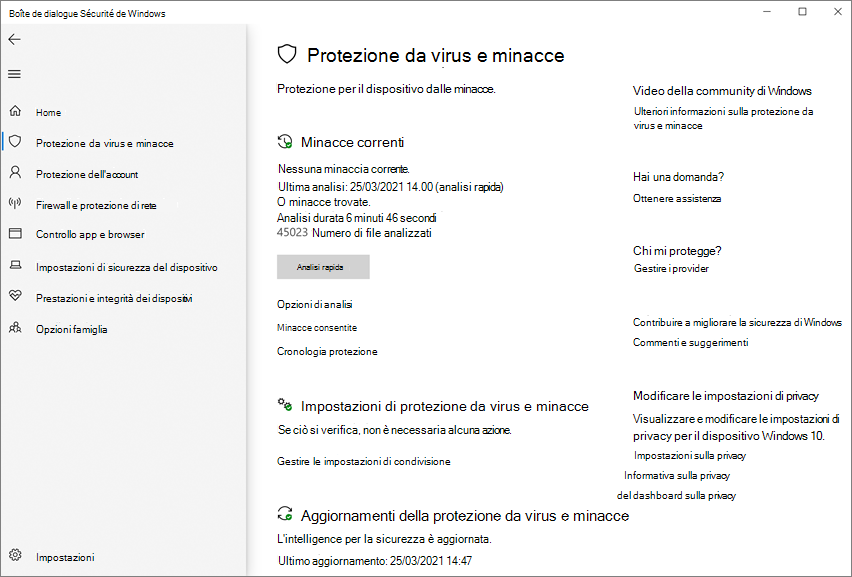

# Antivirus Microsoft Defender nell'app Sicurezza di Windows appMicrosoft Defender Antivirus in the Windows Security app

[!INCLUDE [Microsoft 365 Defender rebranding](../../includes/microsoft-defender.md)]

**Si applica a:****Applies to:**

- [Microsoft Defender per endpointMicrosoft Defender for Endpoint](/microsoft-365/security/defender-endpoint/)

In Windows 10 versione 1703 e successive, l'app Windows Defender app fa parte del Sicurezza di Windows.In Windows 10, version 1703 and later, the Windows Defender app is part of the Windows Security.

Impostazioni che in precedenza erano parte del client Windows Defender e del Windows Impostazioni principale sono stati combinati e spostati nella nuova app, che viene installata per impostazione predefinita come parte di Windows 10, versione 1703.Settings that were previously part of the Windows Defender client and main Windows Settings have been combined and moved to the new app, which is installed by default as part of Windows 10, version 1703.

> [!IMPORTANT]
> La disabilitazione del Sicurezza di Windows Center non disabilita Antivirus Microsoft Defender o [Windows Defender Firewall](/windows/security/threat-protection/windows-firewall/windows-firewall-with-advanced-security).Disabling the Windows Security Center service does not disable Microsoft Defender Antivirus or [Windows Defender Firewall](/windows/security/threat-protection/windows-firewall/windows-firewall-with-advanced-security). Questi vengono disabilitati automaticamente quando viene installato e mantenuto aggiornato un prodotto firewall o antivirus di terze parti.These are disabled automatically when a third-party antivirus or firewall product is installed and kept up to date.
>
> Se disabiliti il servizio Sicurezza di Windows Center o ne configura le impostazioni associate per impedirne l'avvio o l'esecuzione, l'app Sicurezza di Windows potrebbe visualizzare informazioni non aggiornate o imprecise su eventuali prodotti antivirus o firewall installati nel dispositivo.If you do disable the Windows Security Center service, or configure its associated Group Policy settings to prevent it from starting or running, the Windows Security app might display stale or inaccurate information about any antivirus or firewall products you have installed on the device.
> Potrebbe anche impedire a Antivirus Microsoft Defender di abilitarsi se si dispone di un antivirus di terze parti precedente o obsoleto o se si disinstallano prodotti antivirus di terze parti che potrebbero essere stati installati in precedenza.It might also prevent Microsoft Defender Antivirus from enabling itself if you have an old or outdated third-party antivirus, or if you uninstall any third-party antivirus products you might have previously installed.
> In questo modo si riduce notevolmente la protezione del dispositivo e potrebbe causare un'infezione da malware.This will significantly lower the protection of your device and could lead to malware infection.

Vedi [l'Sicurezza di Windows per](/windows/threat-protection/windows-defender-security-center/windows-defender-security-center) altre informazioni su altre Windows di sicurezza che possono essere monitorate nell'app.See the [Windows Security article](/windows/threat-protection/windows-defender-security-center/windows-defender-security-center) for more information on other Windows security features that can be monitored in the app.

L Sicurezza di Windows app è un'interfaccia client Windows 10 versione 1703 e successive.The Windows Security app is a client interface on Windows 10, version 1703 and later. Non è il portale Microsoft Defender Security Center web utilizzato per esaminare e gestire [Microsoft Defender for Endpoint.](/microsoft-365/security/defender-endpoint/microsoft-defender-endpoint)It is not the Microsoft Defender Security Center web portal that is used to review and manage [Microsoft Defender for Endpoint](/microsoft-365/security/defender-endpoint/microsoft-defender-endpoint).

## Esaminare le impostazioni di protezione da virus e minacce nell Sicurezza di Windows appReview virus and threat protection settings in the Windows Security app

1. Apri l Sicurezza di Windows app facendo clic sull'icona scudo nella barra delle applicazioni o cercando Defender nel menu **Start.**Open the Windows Security app by clicking the shield icon in the task bar or searching the start menu for **Defender**.

2. Seleziona il **riquadro Protezione da &** virus (o l'icona scudo sulla barra dei menu sinistra).Select the **Virus & threat protection** tile (or the shield icon on the left menu bar).
   
Le sezioni seguenti descrivono come eseguire alcune delle attività più comuni durante la revisione o l'interazione con la protezione dalle minacce fornita da Antivirus Microsoft Defender nell'app Sicurezza di Windows sicurezza.The following sections describe how to perform some of the most common tasks when reviewing or interacting with the threat protection provided by Microsoft Defender Antivirus in the Windows Security app.

> [!NOTE]
> Se queste impostazioni vengono configurate e distribuite tramite Criteri di gruppo, le impostazioni descritte in questa sezione saranno disattivate e non saranno disponibili per l'utilizzo nei singoli endpoint.If these settings are configured and deployed using Group Policy, the settings described in this section will be greyed-out and unavailable for use on individual endpoints. Le modifiche apportate tramite un oggetto Criteri di gruppo devono prima essere distribuite a singoli endpoint prima che l'impostazione venga aggiornata in Windows Impostazioni.Changes made through a Group Policy Object must first be deployed to individual endpoints before the setting will be updated in Windows Settings. [L'argomento Configure end-user interaction with Antivirus Microsoft Defender](configure-end-user-interaction-microsoft-defender-antivirus.md) descrive come configurare le impostazioni di sostituzione dei criteri locali.The [Configure end-user interaction with Microsoft Defender Antivirus](configure-end-user-interaction-microsoft-defender-antivirus.md) topic describes how local policy override settings can be configured.

## Eseguire un'analisi con l Sicurezza di Windows appRun a scan with the Windows Security app

1. Apri l Sicurezza di Windows app cercando Sicurezza nel menu Start **e** quindi selezionando **Sicurezza di Windows**.Open the Windows Security app by searching the start menu for **Security**, and then selecting **Windows Security**.

2. Seleziona il **riquadro Protezione da &** virus (o l'icona scudo sulla barra dei menu sinistra).Select the **Virus & threat protection** tile (or the shield icon on the left menu bar).

3. Selezionare **Analisi rapida**.Select **Quick scan**. In caso contrario, per eseguire un'analisi completa, selezionare **Opzioni di** analisi e quindi selezionare un'opzione, ad esempio **Analisi completa.**Or, to run a full scan, select **Scan options**, and then select an option, such as **Full scan**.

## Esaminare la versione dell'aggiornamento della sicurezza intelligence e scaricare gli aggiornamenti più recenti nell'app Sicurezza di Windows sicurezzaReview the security intelligence update version and download the latest updates in the Windows Security app

1. Apri l Sicurezza di Windows app cercando Sicurezza nel menu Start *e* quindi selezionando **Sicurezza di Windows**.Open the Windows Security app by searching the start menu for *Security*, and then selecting **Windows Security**.

2. Seleziona il **riquadro Protezione da &** virus (o l'icona scudo sulla barra dei menu sinistra).Select the **Virus & threat protection** tile (or the shield icon on the left menu bar).

3. Selezionare **Virus & threat protection updates**.Select **Virus & threat protection updates**. La versione attualmente installata viene visualizzata insieme ad alcune informazioni sul momento in cui è stata scaricata.The currently installed version is displayed along with some information about when it was downloaded. È possibile verificare la versione corrente rispetto alla versione più recente disponibile per il download manuale oppure esaminare il registro delle modifiche per tale versione.You can check your current against the latest version available for manual download, or review the change log for that version. Vedi [Aggiornamenti di Intelligence per la sicurezza Antivirus Microsoft Defender e altri antimalware Microsoft.](https://www.microsoft.com/en-us/wdsi/defenderupdates)See [Security intelligence updates for Microsoft Defender Antivirus and other Microsoft antimalware](https://www.microsoft.com/en-us/wdsi/defenderupdates).

4. Selezionare **Controlla disponibilità aggiornamenti** per scaricare nuovi aggiornamenti di protezione (se disponibili).Select **Check for updates** to download new protection updates (if there are any).

## Assicurati Antivirus Microsoft Defender abilitata nell'app Sicurezza di Windows appEnsure Microsoft Defender Antivirus is enabled in the Windows Security app

1. Apri l Sicurezza di Windows app cercando Sicurezza nel menu Start *e* quindi selezionando **Sicurezza di Windows**.Open the Windows Security app by searching the start menu for *Security*, and then selecting **Windows Security**.

2. Seleziona il **riquadro Protezione da &** virus (o l'icona scudo sulla barra dei menu sinistra).Select the **Virus & threat protection** tile (or the shield icon on the left menu bar).

3. Selezionare **Impostazioni protezione da & virus**.Select **Virus & threat protection settings**.

4. Attiva **l'opzione Protezione in tempo** **reale.**Toggle the **Real-time protection** switch to **On**.

    > [!NOTE]
    > Se si disattiva **la protezione in tempo** reale, la protezione verrà automaticamente attivata dopo un breve ritardo.If you switch **Real-time protection** off, it will automatically turn back on after a short delay. Ciò consente di garantire la protezione da malware e minacce.This is to ensure you are protected from malware and threats.
    > Se installi un altro prodotto antivirus, Antivirus Microsoft Defender automaticamente si disabilita e viene indicato come tale nell'app Sicurezza di Windows.If you install another antivirus product, Microsoft Defender Antivirus automatically disables itself and is indicated as such in the Windows Security app. Verrà visualizzata un'impostazione che consente di abilitare [l'analisi periodica limitata.](limited-periodic-scanning-microsoft-defender-antivirus.md)A setting will appear that will allow you to enable [limited periodic scanning](limited-periodic-scanning-microsoft-defender-antivirus.md).

## Aggiungere esclusioni per Antivirus Microsoft Defender nell'app Sicurezza di Windows appAdd exclusions for Microsoft Defender Antivirus in the Windows Security app

1. Apri l Sicurezza di Windows app cercando Sicurezza nel menu Start *e* quindi selezionando **Sicurezza di Windows**.Open the Windows Security app by searching the start menu for *Security*, and then selecting **Windows Security**.

2. Seleziona il **riquadro Protezione da &** virus (o l'icona scudo sulla barra dei menu sinistra).Select the **Virus & threat protection** tile (or the shield icon on the left menu bar).

3. In **Gestisci impostazioni selezionare** Impostazioni protezione da **& virus**.Under the **Manage settings**, select **Virus & threat protection settings**.

4. **Nell'impostazione Esclusioni** seleziona **Aggiungi o rimuovi esclusioni.**Under the **Exclusions** setting, select **Add or remove exclusions**. 

5. Selezionare l'icona più ( **+** ) per scegliere il tipo e impostare le opzioni per ogni esclusione.Select the plus icon (**+**) to choose the type and set the options for each exclusion. 

Nella tabella seguente sono riepilogati i tipi di esclusione e cosa accade:The following table summarizes exclusion types and what happens:

|Tipo di esclusioneExclusion type  |Definito daDefined by  |EffettoWhat happens  |
|---------|---------|---------|
|**File****File** |PosizioneLocation  Esempio: `c:\sample\sample.test`Example: `c:\sample\sample.test` |Il file specifico viene ignorato da Antivirus Microsoft Defender.The specific file is skipped by Microsoft Defender Antivirus. |
|**Cartella****Folder**    |PosizioneLocation  Esempio: `c:\test\sample`Example: `c:\test\sample`       |Tutti gli elementi nella cartella specificata vengono ignorati da Antivirus Microsoft Defender.All items in the specified folder are skipped by Microsoft Defender Antivirus.         |
|**Tipo file****File type**   |Estensione del fileFile extension  Esempio: `.test`Example: `.test` |Tutti i file con `.test` estensione in qualsiasi punto del dispositivo vengono ignorati da Antivirus Microsoft Defender.All files with the `.test` extension anywhere on your device are skipped by Microsoft Defender Antivirus.         |
|**Procedura****Process**     |Percorso file eseguibileExecutable file path  Esempio: `c:\test\process.exe`Example: `c:\test\process.exe`         |Il processo specifico e tutti i file aperti da tale processo vengono ignorati da Antivirus Microsoft Defender.The specific process and any files that are opened by that process are skipped by Microsoft Defender Antivirus.         |

Per altre informazioni, vedere le risorse seguenti:To learn more, see the following resources:
- [Configurare e convalidare le esclusioni in base all'estensione di file e al percorso della cartellaConfigure and validate exclusions based on file extension and folder location](./configure-extension-file-exclusions-microsoft-defender-antivirus.md) 
- [Configurare le esclusioni per i file aperti dai processiConfigure exclusions for files opened by processes](./configure-process-opened-file-exclusions-microsoft-defender-antivirus.md)

## Esaminare la cronologia del rilevamento delle minacce nell'app centro sicurezza Windows Defender sicurezzaReview threat detection history in the Windows Defender Security Center app

1. Apri l Sicurezza di Windows app cercando Sicurezza nel menu Start *e* quindi selezionando **Sicurezza di Windows**.Open the Windows Security app by searching the start menu for *Security*, and then selecting **Windows Security**.

2. Seleziona il **riquadro Protezione da &** virus (o l'icona scudo sulla barra dei menu sinistra).Select the **Virus & threat protection** tile (or the shield icon on the left menu bar).

3. Selezionare **Cronologia protezione**.Select **Protection history**. Vengono elencati tutti gli elementi recenti.Any recent items are listed.

## Impostare le opzioni di protezione e ripristino ransomwareSet ransomware protection and recovery options

1. Apri l Sicurezza di Windows app cercando Sicurezza nel menu Start *e* quindi selezionando **Sicurezza di Windows**.Open the Windows Security app by searching the start menu for *Security*, and then selecting **Windows Security**.

2. Seleziona il **riquadro Protezione da &** virus (o l'icona scudo sulla barra dei menu sinistra).Select the **Virus & threat protection** tile (or the shield icon on the left menu bar).

3. In **Protezione ransomware** seleziona Gestisci protezione **ransomware.**Under **Ransomware protection**, select **Manage ransomware protection**.

4. Per modificare le **impostazioni di accesso controllato** alle cartelle, vedere Protect important folders with Controlled folder [access](/microsoft-365/security/defender-endpoint/controlled-folders).To change **Controlled folder access** settings, see [Protect important folders with Controlled folder access](/microsoft-365/security/defender-endpoint/controlled-folders).

5. Per configurare le opzioni  di ripristino ransomware, selezionare Configura in Ripristino dati **ransomware** e seguire le istruzioni per collegare o configurare l'account OneDrive in modo da poter eseguire facilmente il ripristino da un attacco ransomware.To set up ransomware recovery options, select **Set up** under **Ransomware data recovery** and follow the instructions for linking or setting up your OneDrive account so you can easily recover from a ransomware attack.

## Vedere ancheSee also
- [Antivirus Microsoft DefenderMicrosoft Defender Antivirus](microsoft-defender-antivirus-in-windows-10.md)