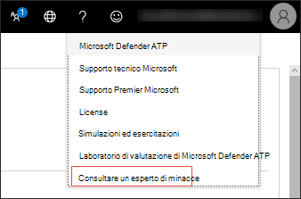
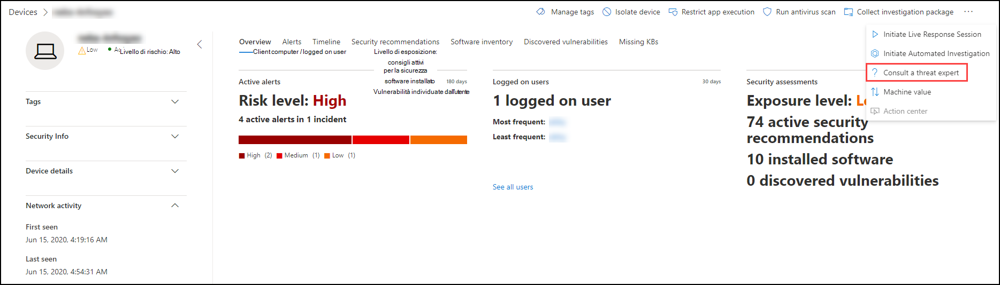
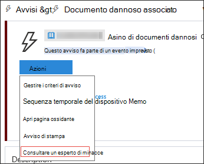
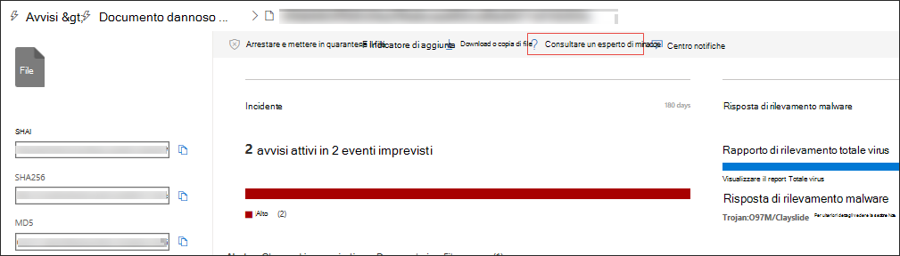

# Microsoft Threat Experts

[!INCLUDE [Microsoft 365 Defender rebranding](../../includes/microsoft-defender.md)]

**Si applica a:**
- [Microsoft Defender per endpoint](https://go.microsoft.com/fwlink/p/?linkid=2154037)
- [Microsoft 365 Defender](https://go.microsoft.com/fwlink/?linkid=2118804)

> Vuoi provare Microsoft Defender per Endpoint? [Iscriversi per una versione di valutazione gratuita.](https://www.microsoft.com/microsoft-365/windows/microsoft-defender-atp?ocid=docs-wdatp-exposedapis-abovefoldlink)

Microsoft Threat Experts è un servizio di ricerca delle minacce gestito che fornisce ai Centri operativi per la sicurezza (SOC) un monitoraggio e un'analisi a livello di esperti per garantire che le minacce critiche negli ambienti specifici non si perdino.
  
Questo servizio di ricerca delle minacce gestite fornisce informazioni e dati guidati da esperti attraverso queste due funzionalità: notifica di attacchi mirati e accesso a esperti su richiesta.

## Prima di iniziare 
> [!NOTE]
> Discutere i requisiti di idoneità con il provider di servizi tecnici Microsoft e il team dell'account prima di applicare il servizio di ricerca delle minacce gestite.

Se sei un cliente di Microsoft Defender for Endpoint, devi richiedere Microsoft Threat Experts **- Notifiche** di attacco mirato per ottenere informazioni e analisi speciali che consentono di identificare le minacce più critiche nell'ambiente in modo da poterle rispondere rapidamente

Per iscriverti a Microsoft Threat Experts - Vantaggi delle notifiche di **attacco** mirate, vai a Impostazioni Funzionalità avanzate Microsoft Threat Experts - Notifiche di attacco  >    >    >   mirate da applicare. Una volta accettato, si otterrà i vantaggi delle notifiche di attacco mirato.

Contattare il team dell'account o il rappresentante Microsoft per sottoscrivere **Microsoft Threat Experts - Esperti** su richiesta per consultare i nostri esperti di minacce sui rilevamenti e gli avversari rilevanti che l'organizzazione sta affrontando.

Per [informazioni dettagliate, vedere Configure Microsoft Threat Experts capabilities.](/microsoft-365/security/defender-endpoint/configure-microsoft-threat-experts#before-you-begin) 

## Microsoft Threat Experts - Notifica di attacco mirato 
Microsoft Threat Experts - La notifica di attacco mirato offre una ricerca proattiva delle minacce più importanti per la rete, tra cui intrusioni umane, attacchi tramite tastiera o attacchi avanzati come lo spionaggio informatico. Queste notifiche vengono visualizzate come nuovo avviso. Il servizio di ricerca gestito include:  
- Monitoraggio e analisi delle minacce, riducendo tempi di attività e rischi per l'azienda 
- Intelligenza artificiale addestrata da Hunter per individuare e assegnare priorità agli attacchi noti e sconosciuti  
- Identificare i rischi più importanti, aiutando i SOC a ottimizzare tempo ed energia 
- Ambito di compromissione e contesto che possono essere rapidamente recapitati per consentire una risposta SOC veloce. 
 
## Microsoft Threat Experts - Esperti su richiesta
I clienti possono coinvolgere i nostri esperti di sicurezza direttamente dall'Microsoft Defender Security Center per una risposta accurata e immediata. Gli esperti forniscono informazioni dettagliate necessarie per comprendere meglio le minacce complesse che interessano l'organizzazione, dalle richieste di informazioni sugli avvisi, ai dispositivi potenzialmente compromessi, alla causa principale di una connessione di rete sospetta, a un'ulteriore intelligence sulle minacce per quanto riguarda le campagne di minacce persistenti avanzate in corso. Con questa funzionalità, è possibile:
- Ottenere ulteriori chiarimenti sugli avvisi, inclusa la causa radice o l'ambito dell'evento imprevisto 
- Acquisire chiarezza nel comportamento sospetto dei dispositivi e nei passaggi successivi se si trova di fronte a un utente malintenzionato avanzato  
- Determinare i rischi e la protezione relativi a minacce, campagne o tecniche di attacco emergenti 

L'opzione **Consulta un esperto** di minacce è disponibile in diversi punti del portale in modo da poter interagire con esperti nel contesto dell'indagine:

- <i>**Menu Guida e supporto tecnico**</i> 

- <i>**Menu Azioni pagina dispositivo**</i> 

- <i>**Menu Azioni pagina avvisi**</i> 

- <i>**Menu Azioni pagina file**</i> 

> [!NOTE]
> Se si desidera tenere traccia dello stato dei casi esperti su richiesta tramite Hub dei servizi Microsoft, contattare il technical account manager. 

Guarda questo video per una breve panoramica dell'hub dei servizi Microsoft.

>[!VIDEO https://www.microsoft.com/videoplayer/embed/RE4pk9f] 

   
## Argomento correlato
- [Configurare Microsoft Threat Experts funzionalità](configure-microsoft-threat-experts.md)
