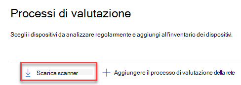
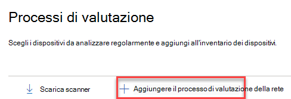
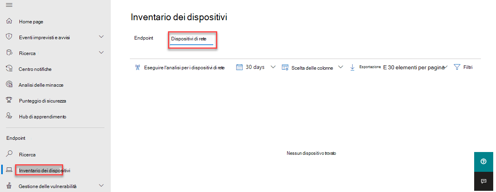

# Individuazione dei dispositivi di rete e gestione delle vulnerabilità

[!INCLUDE [Microsoft 365 Defender rebranding](../../includes/microsoft-defender.md)]

**Si applica a:**

- [Microsoft Defender per endpoint](https://go.microsoft.com/fwlink/?linkid=2154037)
- [Gestione di minacce e vulnerabilità](next-gen-threat-and-vuln-mgt.md)
- [Microsoft 365 Defender](https://go.microsoft.com/fwlink/?linkid=2118804)

> [!IMPORTANT]
> **L'analisi e la gestione dei dispositivi di rete sono attualmente in anteprima pubblica** 
> Questa versione di anteprima viene fornita senza un contratto di servizio e non è consigliata per i carichi di lavoro di produzione. Alcune funzionalità potrebbero non essere supportate o avere funzionalità vincolate.
> Per altre informazioni, vedi [Funzionalità di anteprima di Microsoft Defender per Endpoint.](preview.md)

>Vuoi provare Microsoft Defender per Endpoint? [Iscriversi per una versione di valutazione gratuita.](https://www.microsoft.com/microsoft-365/windows/microsoft-defender-atp?ocid=docs-wdatp-portaloverview-abovefoldlink)

Le funzionalità di individuazione della rete sono disponibili nella sezione **Inventario** dispositivi del Centro sicurezza Microsoft 365 e delle console di Microsoft Defender Security Center.  

Un dispositivo Microsoft Defender for Endpoint designato verrà usato in ogni segmento di rete per eseguire analisi periodiche autenticate di dispositivi di rete preconfigurati. Una volta individuate, le funzionalità di gestione delle minacce e delle vulnerabilità di Defender for Endpoint forniscono flussi di lavoro integrati per proteggere commutatori, router, controller WLAN, firewall e gateway VPN individuati.  

Una volta individuati e classificati i dispositivi di rete, gli amministratori della sicurezza saranno in grado di ricevere i consigli più recenti sulla sicurezza ed esaminare le vulnerabilità individuate di recente nei dispositivi di rete distribuiti nelle organizzazioni.

## Approccio

I dispositivi di rete non vengono gestiti come endpoint standard poiché Defender for Endpoint non dispone di un sensore incorporato nei dispositivi di rete stessi. Questi tipi di dispositivi richiedono un approccio senza agenti in cui un'analisi remota oquisterà le informazioni necessarie dai dispositivi. A seconda della topologia e delle caratteristiche di rete, un singolo dispositivo o alcuni dispositivi onboarded in Microsoft Defender for Endpoint eseguiranno analisi autenticate dei dispositivi di rete utilizzando SNMP (sola lettura).

Ci saranno due tipi di dispositivi da tenere presenti:

- **Dispositivo di valutazione:** un dispositivo già onboarded che userai per analizzare i dispositivi di rete.
- **Dispositivi di rete:** i dispositivi di rete che si prevede di analizzare e eseguire l'onboard.

### Gestione delle vulnerabilità per i dispositivi di rete 

Una volta individuati e classificati i dispositivi di rete, gli amministratori della sicurezza saranno in grado di ricevere i consigli più recenti sulla sicurezza ed esaminare le vulnerabilità individuate di recente nei dispositivi di rete distribuiti nelle organizzazioni.  

## Sistemi operativi supportati

Attualmente sono supportati i seguenti sistemi operativi:

- Cisco IOS, IOS-XE, NX-OS
- Juniper JUNOS
- HPE ArubaOS, software di commutazione di procura
- Palo Alto Networks PAN-OS

Nel tempo verranno aggiunti altri fornitori di rete e sistema operativo, in base ai dati raccolti dall'utilizzo dei clienti. Pertanto, si consiglia di configurare tutti i dispositivi di rete, anche se non sono specificati in questo elenco.

## Come iniziare

Il primo passaggio consiste nel selezionare un dispositivo che eseguirà le analisi di rete autenticate.

1. Decidi un dispositivo defender per endpoint onboarded (client o server) che dispone di una connessione di rete alla porta di gestione per i dispositivi di rete che vuoi analizzare. 

2. Il traffico SNMP tra il dispositivo di valutazione Defender for Endpoint e i dispositivi di rete di destinazione deve essere consentito (ad esempio, dal firewall).

3. Decidi quali dispositivi di rete verranno valutati per le vulnerabilità (ad esempio, un commutatore Cisco o un firewall Palo Alto Networks).  

4. Assicurati che la sola lettura SNMP sia abilitata in tutti i dispositivi di rete configurati per consentire al dispositivo di valutazione Defender for Endpoint di eseguire query sui dispositivi di rete configurati. La scrittura SNMP non è necessaria per le funzionalità appropriate di questa funzionalità.

5. Ottenere gli indirizzi IP dei dispositivi di rete da analizzare (o le subnet in cui questi dispositivi vengono distribuiti).

6. Ottenere le credenziali SNMP dei dispositivi di rete (ad esempio: Community String, noAuthNoPriv, authNoPriv, authPriv). Sarà necessario fornire le credenziali durante la configurazione di un nuovo processo di valutazione.  

7. Configurazione del client proxy: non è necessaria alcuna configurazione aggiuntiva oltre ai requisiti di Defender per il proxy del dispositivo endpoint.

8. Per consentire l'autenticazione e il corretto funzionamento dello scanner di rete, è essenziale aggiungere i domini/URL seguenti:

    - login.windows.net  
    - *.securitycenter.windows.com
    - login.microsoftonline.com
    - *.blob.core.windows.net/networkscannerstable/ *

    Nota: non tutti gli URL sono specificati nell'elenco documentato di Defender for Endpoint della raccolta dati consentita.

## Autorizzazioni

Per configurare i processi di valutazione, è necessaria l'opzione di autorizzazione utente seguente: **Gestire le impostazioni di sicurezza nel Centro sicurezza.** Per trovare l'autorizzazione, accedere a **Impostazioni**  >  **Ruoli.** Per ulteriori informazioni, vedere [Create and manage roles for role-based access control](user-roles.md)

## Installare lo scanner di rete

1. Passare a **Impostazioni di sicurezza di Microsoft 365** Processi di valutazione degli  >    >  **endpoint**  >   (in "Valutazioni di rete").
    1. In Microsoft Defender Security Center passare a Impostazioni > processi di valutazione.

2. Scarica lo scanner di rete e installalo nel dispositivo di valutazione Defender for Endpoint designato.

## Installazione scanner di rete & registrazione

Il processo di accesso può essere completato sul dispositivo di valutazione designato stesso o su qualsiasi altro dispositivo (ad esempio, il dispositivo client personale).

Per completare il processo di registrazione dello scanner di rete:

1. Copiare e seguire l'URL visualizzato nella riga di comando e utilizzare il codice di installazione fornito per completare il processo di registrazione.
    - Nota: potrebbe essere necessario modificare le impostazioni del prompt dei comandi per poter copiare l'URL.

2. Immetti il codice e accedi con un account Microsoft con l'autorizzazione Defender for Endpoint denominata "Gestire le impostazioni di sicurezza nel Centro sicurezza".

3. Al termine, verrà visualizzato un messaggio di conferma dell'accesso.

## Configurare un nuovo processo di valutazione  

Nella pagina Processi di valutazione in **Impostazioni** selezionare **Aggiungi processo di valutazione di rete.** Segui il processo di configurazione per scegliere i dispositivi di rete da analizzare regolarmente e aggiungere all'inventario dei dispositivi.

Per impedire la duplicazione dei dispositivi nell'inventario dei dispositivi di rete, assicurati che ogni indirizzo IP sia configurato una sola volta tra più dispositivi di valutazione.

Aggiunta dei passaggi di un processo di valutazione della rete:

1. Scegliere il nome di un processo di valutazione e il "dispositivo di valutazione" in cui è stato installato lo scanner di rete. Questo dispositivo eseguirà le analisi periodiche autenticate. 
2. Aggiungere gli indirizzi IP dei dispositivi di rete di destinazione da analizzare (o le subnet in cui questi dispositivi vengono distribuiti). 
3. Aggiungere le credenziali SNMP necessarie dei dispositivi di rete di destinazione. 
4. Salvare il processo di valutazione della rete appena configurato per avviare l'analisi periodica della rete. 

### Analizzare e aggiungere dispositivi di rete

Durante il processo di configurazione, è possibile eseguire un'analisi di test una sola volta per verificare che:

- Esiste una connettività tra il dispositivo di valutazione Defender for Endpoint e i dispositivi di rete di destinazione configurati.
- Le credenziali SNMP configurate sono corrette.

Ogni dispositivo di valutazione può supportare fino a 1.500 analisi degli indirizzi IP riusciti. Ad esempio, se si analizzano 10 subnet diverse in cui solo 100 indirizzi IP restituiscono risultati positivi, sarà possibile analizzare 1.400 indirizzi IP aggiuntivi da altre subnet sullo stesso dispositivo di valutazione.  

Se sono presenti più intervalli di indirizzi IP/subnet da analizzare, la visualizzazione dei risultati dell'analisi di test avrà alcuni minuti. Sarà disponibile un'analisi di test per un massimo di 1.024 indirizzi.

Una volta visualizzati i risultati, puoi scegliere quali dispositivi verranno inclusi nell'analisi periodica. Se si ignora la visualizzazione dei risultati dell'analisi, tutti gli indirizzi IP configurati verranno aggiunti al processo di valutazione della rete (indipendentemente dalla risposta del dispositivo). È inoltre possibile esportare i risultati dell'analisi.

## Inventario dei dispositivi

I nuovi dispositivi individuati verranno visualizzati nella nuova **scheda Dispositivi di** rete nella pagina **Inventario** dispositivi. L'aggiunta di un processo di valutazione può richiedere fino a due ore prima dell'aggiornamento dei dispositivi.

## Risoluzione dei problemi

### Installazione scanner di rete non riuscita

Verificare che gli URL necessari siano aggiunti ai domini consentiti nelle impostazioni del firewall. Verificare inoltre che le impostazioni proxy siano configurate come descritto in [Configure device proxy and Internet connectivity settings](configure-proxy-internet.md)

### La Microsoft.com/devicelogin web non è stata visualizzata

Verificare che gli URL necessari siano aggiunti ai domini consentiti nel firewall. Verificare inoltre che le impostazioni proxy siano configurate come descritto in [Configure device proxy and Internet connectivity settings](configure-proxy-internet.md).

### I dispositivi di rete non vengono visualizzati nell'inventario dei dispositivi dopo diverse ore

I risultati dell'analisi devono essere aggiornati alcune ore dopo l'analisi iniziale eseguita dopo il completamento della configurazione del processo di valutazione.

Se i dispositivi non sono ancora visualizzati, verificare che il servizio 'MdatpNetworkScanService' sia in esecuzione nei dispositivi di valutazione, in cui è stato installato lo scanner di rete, ed eseguire un'analisi "Esegui" nella configurazione del processo di valutazione pertinente.  

Se non si ottengono ancora risultati dopo 5 minuti, riavviare il servizio.  

### L'ora dell'ultima volta per i dispositivi è più lunga di 24 ore

Verificare che lo scanner sia in esecuzione correttamente. Passare quindi alla definizione di analisi e selezionare "Esegui test". Controllare quali messaggi di errore vengono restituiti dagli indirizzi IP pertinenti.

### Autorizzazione utente necessaria per la gestione delle minacce e delle vulnerabilità

Registrazione completata con un errore: "Sembra che non si disponga di autorizzazioni sufficienti per l'aggiunta di un nuovo agente. L'autorizzazione necessaria è "Gestire le impostazioni di sicurezza nel Centro sicurezza".

Premere un tasto qualsiasi per uscire.

Chiedere all'amministratore di sistema di assegnare le autorizzazioni necessarie. In alternativa, chiedere a un altro membro rilevante di aiutarti con il processo di accesso fornendo loro il codice di accesso e il collegamento.

### Il processo di registrazione non riesce utilizzando il collegamento fornito nella riga di comando nel processo di registrazione

Prova un browser diverso o copia il collegamento e il codice di accesso in un altro dispositivo.

### Testo troppo piccolo o non in grado di copiare testo dalla riga di comando

Modifica le impostazioni della riga di comando nel dispositivo per consentire la copia e la modifica delle dimensioni del testo.

## Articoli correlati

- [Inventario dei dispositivi](machines-view-overview.md)
- [Configurare le funzionalità avanzate](advanced-features.md)
