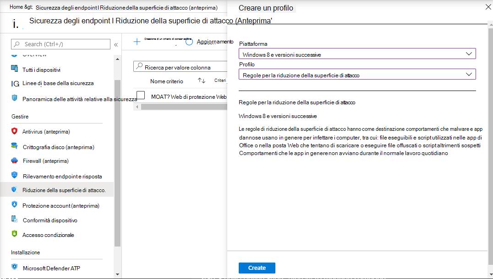

# Onboarding con Microsoft Endpoint ManagerOnboarding using Microsoft Endpoint Manager

[!INCLUDE [Microsoft 365 Defender rebranding](../../includes/microsoft-defender.md)]

**Si applica a:****Applies to:**
- [Microsoft Defender per endpointMicrosoft Defender for Endpoint](https://go.microsoft.com/fwlink/p/?linkid=2154037)
- [Microsoft 365 DefenderMicrosoft 365 Defender](https://go.microsoft.com/fwlink/?linkid=2118804)

> Vuoi provare Microsoft Defender per Endpoint?Want to experience Microsoft Defender for Endpoint? [Iscriversi per una versione di valutazione gratuita.Sign up for a free trial.](https://www.microsoft.com/microsoft-365/windows/microsoft-defender-atp?ocid=docs-wdatp-exposedapis-abovefoldlink)

Questo articolo fa parte della guida alla distribuzione e funge da esempio di metodo di onboarding.This article is part of the Deployment guide and acts as an example onboarding method. 

[Nell'argomento Pianificazione](deployment-strategy.md) sono stati forniti diversi metodi per l'onboard dei dispositivi al servizio.In the [Planning](deployment-strategy.md) topic, there were several methods provided to onboard devices to the service. In questo argomento viene illustrata l'architettura nativa del cloud.This topic covers the cloud-native architecture. 

 *Diagramma delle architetture di ambiente*
*Diagram of environment architectures*

Mentre Defender for Endpoint supporta l'onboarding di diversi endpoint e strumenti, questo articolo non li copre.While Defender for Endpoint supports onboarding of various endpoints and tools, this article does not cover them. Per informazioni sull'onboarding generale con altri strumenti e metodi di distribuzione supportati, vedere [Panoramica dell'onboarding.](onboarding.md)For information on general onboarding using other supported deployment tools and methods, see [Onboarding overview](onboarding.md).

[Microsoft Endpoint Manager](/mem/endpoint-manager-overview) è una piattaforma di soluzioni che unifica diversi servizi.[Microsoft Endpoint Manager](/mem/endpoint-manager-overview) is a solution platform that unifies several services. Include le [Microsoft Intune](/mem/intune/fundamentals/what-is-intune) per la gestione dei dispositivi basati sul cloud.It includes [Microsoft Intune](/mem/intune/fundamentals/what-is-intune) for cloud-based device management.

In questo argomento vengono guidati gli utenti in:This topic guides users in:
- Passaggio 1: onboarding dei dispositivi al servizio creando un gruppo in Microsoft Endpoint Manager (MEM) in cui assegnare le configurazioniStep 1: Onboarding devices to the service by creating a group in Microsoft Endpoint Manager (MEM) to assign configurations on
- Passaggio 2: Configurazione delle funzionalità di Defender for Endpoint con Microsoft Endpoint ManagerStep 2: Configuring Defender for Endpoint capabilities using Microsoft Endpoint Manager

Queste indicazioni sull'onboarding illustrano i passaggi di base seguenti da eseguire quando si usa Microsoft Endpoint Manager:This onboarding guidance will walk you through the following basic steps that you need to take when using Microsoft Endpoint Manager:

-   [Identificazione dei dispositivi o degli utenti di destinazioneIdentifying target devices or users](#identify-target-devices-or-users)

    -   Creazione di Azure Active Directory gruppo (utente o dispositivo)Creating an Azure Active Directory group (User or Device)

-   [Creazione di un profilo di configurazioneCreating a Configuration Profile](#step-2-create-configuration-policies-to-configure-microsoft-defender-for-endpoint-capabilities)

    -   In Microsoft Endpoint Manager, ti guideremo nella creazione di un criterio separato per ogni funzionalità.In Microsoft Endpoint Manager, we'll guide you in creating a separate policy for each capability.

## RisorseResources

Ecco i collegamenti necessari per il resto del processo:Here are the links you'll need for the rest of the process:

-   [Portale MEMMEM portal](https://aka.ms/memac)

-   [Centro sicurezza PCSecurity Center](https://securitycenter.windows.com/)

-   [Linee di base della sicurezza di IntuneIntune Security baselines](/mem/intune/protect/security-baseline-settings-defender-atp#microsoft-defender)

Per ulteriori informazioni sulle Microsoft Endpoint Manager, vedere queste risorse:For more information about Microsoft Endpoint Manager, check out these resources:
- [Microsoft Endpoint Manager paginaMicrosoft Endpoint Manager page](/mem/)
- [Post di blog sulla convergenza di Intune e ConfigMgrBlog post on convergence of Intune and ConfigMgr](https://www.microsoft.com/microsoft-365/blog/2019/11/04/use-the-power-of-cloud-intelligence-to-simplify-and-accelerate-it-and-the-move-to-a-modern-workplace/)
- [Video introduttivo su MEMIntroduction video on MEM](https://www.microsoft.com/microsoft-365/blog/2019/11/04/use-the-power-of-cloud-intelligence-to-simplify-and-accelerate-it-and-the-move-to-a-modern-workplace)

## Passaggio 1: onboardare i dispositivi creando un gruppo in MEM su cui assegnare le configurazioniStep 1: Onboard devices by creating a group in MEM to assign configurations on
### Identificare i dispositivi o gli utenti di destinazioneIdentify target devices or users
In questa sezione verrà creato un gruppo di test a cui assegnare le configurazioni.In this section, we will create a test group to assign your configurations on.

>[!NOTE]
>Intune usa Azure Active Directory (Azure AD) per gestire dispositivi e utenti.Intune uses Azure Active Directory (Azure AD) groups to manage devices and users. Gli amministratori di Intune possono configurare i gruppi in base alle esigenze dell'organizzazione.As an Intune admin, you can set up groups to suit your organizational needs. 
Per altre informazioni, vedi [Aggiungere gruppi per organizzare utenti e dispositivi.](/mem/intune/fundamentals/groups-add)For more information, see [Add groups to organize users and devices](/mem/intune/fundamentals/groups-add).

### Creare un gruppoCreate a group

1.  Aprire il portale MEM.Open the MEM portal.

2.  Aprire **Gruppi > Nuovo gruppo**.Open **Groups > New Group**.

    > [!div class="mx-imgBorder"]
    > 

3.  Immettere i dettagli e creare un nuovo gruppo.Enter details and create a new group.

    > [!div class="mx-imgBorder"]
    > 

4.  Aggiungi l'utente o il dispositivo di test.Add your test user or device.

5.  Dal riquadro **Gruppi > Tutti i** gruppi, aprire il nuovo gruppo.From the **Groups > All groups** pane, open your new group.

6.  Selezionare  **Membri > Aggiungi membri**.Select  **Members > Add members**.

7.  Trova l'utente o il dispositivo di test e selezionalo.Find your test user or device and select it.

    > [!div class="mx-imgBorder"]
    > 

8.  Il gruppo di test ora dispone di un membro da testare.Your testing group now has a member to test.

## Passaggio 2: Creare criteri di configurazione per configurare Le funzionalità di Microsoft Defender per endpointStep 2: Create configuration policies to configure Microsoft Defender for Endpoint capabilities
Nella sezione seguente verranno creati diversi criteri di configurazione.In the following section, you'll create a number of configuration policies.

In primo luogo, un criterio di configurazione consente di selezionare i gruppi di utenti o dispositivi di cui eseguire l'onboarded in Defender for Endpoint:First is a configuration policy to select which groups of users or devices will be onboarded to Defender for Endpoint:

- [Rilevamento e risposta di endpointEndpoint detection and response](#endpoint-detection-and-response) 

Si continuerà quindi creando diversi tipi di criteri di sicurezza degli endpoint:Then you will continue by creating several different types of endpoint security policies:

- [Protezione di nuova generazioneNext-generation protection](#next-generation-protection)
- [Riduzione della superficie di attaccoAttack surface reduction](#attack-surface-reduction--attack-surface-reduction-rules)

### Rilevamento endpoint e rispostaEndpoint detection and response

1.  Aprire il portale MEM.Open the MEM portal.

2.  Passare a **Endpoint security > Endpoint detection and response**.Navigate to **Endpoint security > Endpoint detection and response**. Fare clic **su Crea profilo**.Click on **Create Profile**.

    > [!div class="mx-imgBorder"]
    > 

3.  In Piattaforma seleziona Windows 10 e versioni **successive, Profilo -** Rilevamento e risposta endpoint > Crea .Under **Platform, select Windows 10 and Later, Profile - Endpoint detection and response > Create**.

4.  Immettere un nome e una descrizione, quindi selezionare **Avanti.**Enter a name and description, then select  **Next**.

    > [!div class="mx-imgBorder"]
    > 

5.  Selezionare le impostazioni in base alle esigenze, quindi **selezionare Avanti.**Select settings as required, then select  **Next**.

    > [!div class="mx-imgBorder"]
    > 

    > [!NOTE]
    > In questo caso, questo è stato popolato automaticamente come Defender per Endpoint è già stato integrato con Intune.In this instance, this has been auto populated as Defender for Endpoint has already been integrated with Intune. Per altre informazioni sull'integrazione, vedi [Abilitare Microsoft Defender per Endpoint in Intune.](/mem/intune/protect/advanced-threat-protection-configure#to-enable-microsoft-defender-atp)For more information on the integration, see [Enable Microsoft Defender for Endpoint in Intune](/mem/intune/protect/advanced-threat-protection-configure#to-enable-microsoft-defender-atp).
    > 
    > L'immagine seguente è un esempio di ciò che vedrai quando Microsoft Defender per Endpoint NON è integrato con Intune:The following image is an example of what you'll see when Microsoft Defender for Endpoint is NOT integrated with Intune:
    >
    > 

6.  Aggiungere i tag di ambito, se necessario, quindi **selezionare Avanti.**Add scope tags if necessary, then select  **Next**.

    > [!div class="mx-imgBorder"]
    > 

7.  Aggiungere un gruppo di test facendo clic su **Seleziona gruppi da includere** e scegliere il gruppo, quindi selezionare **Avanti.**Add test group by clicking on **Select groups to include** and choose your group, then select  **Next**.

    > [!div class="mx-imgBorder"]
    > 

8.  Rivedere e accettare, quindi selezionare  **Crea**.Review and accept, then select  **Create**.

    > [!div class="mx-imgBorder"]
    > 

9.  È possibile visualizzare i criteri completati.You can view your completed policy.

    > [!div class="mx-imgBorder"]
    > 

### Protezione di nuova generazioneNext-generation protection

1.  Aprire il portale MEM.Open the MEM portal.

2.  Passare a **Endpoint security > Antivirus > Create Policy**.Navigate to **Endpoint security > Antivirus > Create Policy**.

    > [!div class="mx-imgBorder"]
    > 

3.  Seleziona **Piattaforma - Windows 10 e versioni successive - Windows e profilo - Antivirus Microsoft Defender > Crea**.Select **Platform - Windows 10 and Later - Windows and Profile – Microsoft Defender Antivirus > Create**.

4.  Immetti nome e descrizione, quindi seleziona **Avanti.**Enter name and description, then select  **Next**.

    > [!div class="mx-imgBorder"]
    > 

5.  Nella pagina **Impostazioni di configurazione:** imposta le configurazioni necessarie per Antivirus Microsoft Defender (Protezione cloud, Esclusioni, Real-Time Protezione e Correzione).In the **Configuration settings page**: Set the configurations you require for Microsoft Defender Antivirus (Cloud Protection, Exclusions, Real-Time Protection, and Remediation).

    > [!div class="mx-imgBorder"]
    > 

6.  Aggiungere i tag di ambito, se necessario, quindi **selezionare Avanti.**Add scope tags if necessary, then select  **Next**.

    > [!div class="mx-imgBorder"]
    > 

7.  Selezionare i gruppi da includere, assegnarli al gruppo di test, quindi selezionare **Avanti.**Select groups to include, assign to your test group, then select  **Next**.

    > [!div class="mx-imgBorder"]
    > 

8.  Rivedere e creare, quindi selezionare  **Crea**.Review and create, then select  **Create**.

    > [!div class="mx-imgBorder"]
    > 

9.  Verrà visualizzato il criterio di configurazione creato.You'll see the configuration policy you created.

    > [!div class="mx-imgBorder"]
    > 

### Riduzione della superficie di attacco - Regole di riduzione della superficie di attaccoAttack Surface Reduction – Attack surface reduction rules

1.  Aprire il portale MEM.Open the MEM portal.

2.  Passare a **Endpoint security > Attack surface reduction**.Navigate to **Endpoint security > Attack surface reduction**.

3.  Selezionare  **Crea criterio**.Select  **Create Policy**.

4.  Seleziona **Piattaforma - Windows 10 e versioni successive - Profilo - Regole di** riduzione della superficie di > Crea .Select **Platform - Windows 10 and Later – Profile - Attack surface reduction rules > Create**.

    > [!div class="mx-imgBorder"]
    > 

5.  Immettere un nome e una descrizione, quindi selezionare **Avanti.**Enter a name and description, then select  **Next**.

    > [!div class="mx-imgBorder"]
    > 

6.  Nella pagina **Impostazioni di configurazione**: Imposta le configurazioni necessarie per le regole di riduzione della superficie di attacco, quindi seleziona **Avanti.**In the **Configuration settings page**: Set the configurations you require for Attack surface reduction rules, then select  **Next**.

    > [!NOTE]
    > We will be configuring all of the Attack surface reduction rules to Audit.We will be configuring all of the Attack surface reduction rules to Audit.
    > 
    > Per ulteriori informazioni, vedere [Regole di riduzione della superficie di attacco.](attack-surface-reduction.md)For more information, see [Attack surface reduction rules](attack-surface-reduction.md).

    > [!div class="mx-imgBorder"]
    > 

7.  Aggiungi tag ambito in base alle esigenze, quindi seleziona **Avanti.**Add Scope Tags as required, then select  **Next**.

    > [!div class="mx-imgBorder"]
    > 

8.  Selezionare i gruppi da includere e assegnare al gruppo di test, quindi selezionare **Avanti.**Select groups to include and assign to test group, then select  **Next**.

    > [!div class="mx-imgBorder"]
    > 

9. Esaminare i dettagli, quindi selezionare  **Crea**.Review the details, then select  **Create**.

    > [!div class="mx-imgBorder"]
    > 

10. Visualizzare il criterio.View the policy.

    > [!div class="mx-imgBorder"]
    > 

### Riduzione della superficie di attacco - Protezione WebAttack Surface Reduction – Web Protection

1.  Aprire il portale MEM.Open the MEM portal.

2.  Passare a **Endpoint security > Attack surface reduction**.Navigate to **Endpoint security > Attack surface reduction**.

3.  Selezionare  **Crea criterio**.Select  **Create Policy**.

4.  Selezionare **Windows 10 e versioni successive - Protezione Web > Crea**.Select **Windows 10 and Later – Web protection > Create**.

    > [!div class="mx-imgBorder"]
    > 

5.  Immettere un nome e una descrizione, quindi selezionare **Avanti.**Enter a name and description, then select  **Next**.

    > [!div class="mx-imgBorder"]
    > 

6.  Nella pagina **Impostazioni di configurazione**: Impostare le configurazioni necessarie per Protezione Web, quindi selezionare **Avanti.**In the **Configuration settings page**: Set the configurations you require for Web Protection, then select  **Next**.

    > [!NOTE]
    > È in esecuzione la configurazione di Protezione Web per il blocco.We are configuring Web Protection to Block.
    > 
    > Per ulteriori informazioni, vedere [Protezione Web](web-protection-overview.md).For more information, see [Web Protection](web-protection-overview.md).

    > [!div class="mx-imgBorder"]
    > 

7.  Aggiungere **tag di ambito come richiesto > Avanti**.Add **Scope Tags as required > Next**.

    > [!div class="mx-imgBorder"]
    > 

8.  Selezionare **Assegna al gruppo di test > Avanti**.Select **Assign to test group > Next**.

    > [!div class="mx-imgBorder"]
    > 

9.  Seleziona **Revisione e crea > crea**.Select **Review and Create > Create**.

    > [!div class="mx-imgBorder"]
    > 

10. Visualizzare il criterio.View the policy.

    > [!div class="mx-imgBorder"]
    > 

## Convalidare le impostazioni di configurazioneValidate configuration settings

### Verificare che i criteri siano stati applicatiConfirm Policies have been applied

Dopo l'assegnazione del criterio di configurazione, l'applicazione del criterio di configurazione avrà un certo tempo.Once the Configuration policy has been assigned, it will take some time to apply.

Per informazioni sulla tempistica, vedere [Informazioni sulla configurazione di Intune.](/mem/intune/configuration/device-profile-troubleshoot#how-long-does-it-take-for-devices-to-get-a-policy-profile-or-app-after-they-are-assigned)For information on timing, see [Intune configuration information](/mem/intune/configuration/device-profile-troubleshoot#how-long-does-it-take-for-devices-to-get-a-policy-profile-or-app-after-they-are-assigned).

Per verificare che il criterio di configurazione sia stato applicato al dispositivo di test, seguire la procedura seguente per ogni criterio di configurazione.To confirm that the configuration policy has been applied to your test device, follow the following process for each configuration policy.

1.  Apri il portale MEM e passa al criterio pertinente, come illustrato nei passaggi precedenti.Open the MEM portal and navigate to the relevant policy as shown in the steps above. L'esempio seguente mostra le impostazioni di protezione di nuova generazione.The following example shows the next generation protection settings.

    > [!div class="mx-imgBorder"]
    > 

2.  Selezionare Il **criterio di configurazione** per visualizzare lo stato dei criteri.Select  the **Configuration Policy** to view the policy status.

    > [!div class="mx-imgBorder"]
    > 

3.  Seleziona  **Stato dispositivo** per visualizzare lo stato.Select  **Device Status** to see the status.

    > [!div class="mx-imgBorder"]
    > 

4.  Selezionare  **Stato utente** per visualizzare lo stato.Select  **User Status** to see the status.

    > [!div class="mx-imgBorder"]
    > 

5.  Seleziona  **Stato per impostazione** per visualizzare lo stato.Select  **Per-setting status** to see the status.

    >[!TIP]
    >Questa visualizzazione è molto utile per identificare eventuali impostazioni in conflitto con un altro criterio.This view is very useful to identify any settings that conflict with another policy.

    > [!div class="mx-imgBorder"]
    > 

### Rilevamento endpoint e rispostaEndpoint detection and response

1.  Prima di applicare la configurazione, il servizio Defender per Endpoint Protection non deve essere avviato.Before applying the configuration, the Defender for Endpoint Protection service should not be started.

    > [!div class="mx-imgBorder"]
    > 

2.  Dopo l'applicazione della configurazione, è necessario Endpoint Protection Defender for Endpoint Protection Service.After the configuration has been applied, the Defender for Endpoint Protection Service should be started.

    > [!div class="mx-imgBorder"]
    > 

3.  Dopo l'esecuzione dei servizi nel dispositivo, il dispositivo viene visualizzato in Microsoft Defender Security Center.After the services are running on the device, the device appears in Microsoft Defender Security Center.

    > [!div class="mx-imgBorder"]
    > 

### Protezione di nuova generazioneNext-generation protection

1.  Prima di applicare il criterio in un dispositivo di test, dovresti essere in grado di gestire manualmente le impostazioni, come illustrato di seguito.Before applying the policy on a test device, you should be able to manually manage the settings as shown below.

    > [!div class="mx-imgBorder"]
    > 

2.  Dopo l'applicazione del criterio, non dovrebbe essere possibile gestire manualmente le impostazioni.After the policy has been applied, you should not be able to manually manage the settings.

    > [!NOTE]
    > Nell'immagine seguente **Attivare la protezione** con distribuzione cloud e **Attivare** la protezione in tempo reale vengono visualizzati come gestiti.In the following image **Turn on cloud-delivered protection** and **Turn on real-time protection** are being shown as managed.

    > [!div class="mx-imgBorder"]
    > 

### Riduzione della superficie di attacco - Regole di riduzione della superficie di attaccoAttack Surface Reduction – Attack surface reduction rules

1.  Prima di applicare il criterio su un dispositivo di test, penna una finestra di PowerShell e digita `Get-MpPreference` .Before applying the policy on a test device, pen a PowerShell Window and type `Get-MpPreference`.

2.  Questo dovrebbe rispondere con le righe seguenti senza contenuto:This should respond with the following lines with no content:

    > AttackSurfaceReductionOnlyExclusions:AttackSurfaceReductionOnlyExclusions:
    > 
    > AttackSurfaceReductionRules_Actions:AttackSurfaceReductionRules_Actions:
    > 
    > AttackSurfaceReductionRules_Ids:AttackSurfaceReductionRules_Ids:

    

3.  Dopo aver applicato il criterio in un dispositivo di test, apri un Windows PowerShell e digita `Get-MpPreference` .After applying the policy on a test device, open a PowerShell Windows and type `Get-MpPreference`.

4.  Questo dovrebbe rispondere con le righe seguenti con il contenuto come illustrato di seguito:This should respond with the following lines with content as shown below:

    

### Riduzione della superficie di attacco - Protezione WebAttack Surface Reduction – Web Protection

1.  Nel dispositivo di test, aprire un Windows PowerShell e digitare `(Get-MpPreference).EnableNetworkProtection` .On the test device, open a PowerShell Windows and type `(Get-MpPreference).EnableNetworkProtection`.

2.  Dovrebbe rispondere con uno 0, come illustrato di seguito.This should respond with a 0 as shown below.

    

3.  Dopo aver applicato il criterio, aprire un Windows PowerShell e digitare `(Get-MpPreference).EnableNetworkProtection` .After applying the policy, open a PowerShell Windows and type `(Get-MpPreference).EnableNetworkProtection`.

4.  Dovrebbe rispondere con un valore 1, come illustrato di seguito.This should respond with a 1 as shown below.

    
