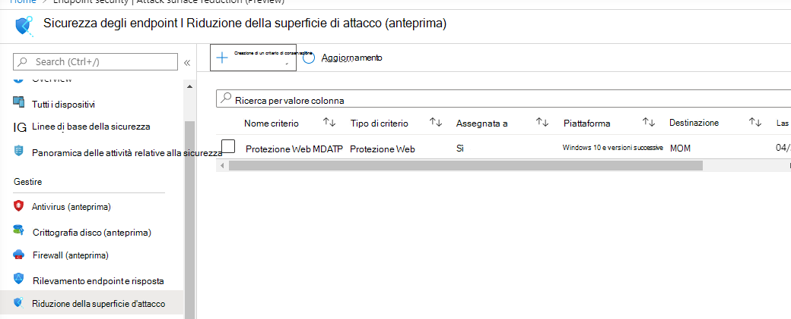

# Onboarding con Microsoft Endpoint Manager

[!INCLUDE [Microsoft 365 Defender rebranding](../../includes/microsoft-defender.md)]

**Si applica a:**
- [Microsoft Defender per endpoint](https://go.microsoft.com/fwlink/p/?linkid=2154037)
- [Microsoft 365 Defender](https://go.microsoft.com/fwlink/?linkid=2118804)

> Vuoi provare Microsoft Defender per Endpoint? [Iscriversi per una versione di valutazione gratuita.](https://www.microsoft.com/microsoft-365/windows/microsoft-defender-atp?ocid=docs-wdatp-exposedapis-abovefoldlink)

Questo articolo fa parte della guida alla distribuzione e funge da esempio di metodo di onboarding. 

[Nell'argomento Pianificazione](deployment-strategy.md) sono stati forniti diversi metodi per l'onboard dei dispositivi al servizio. In questo argomento viene illustrata l'architettura nativa del cloud. 

 *Diagramma delle architetture di ambiente*

Mentre Defender for Endpoint supporta l'onboarding di diversi endpoint e strumenti, questo articolo non li copre. Per informazioni sull'onboarding generale con altri strumenti e metodi di distribuzione supportati, vedere [Panoramica dell'onboarding.](onboarding.md)

[Microsoft Endpoint Manager è](https://docs.microsoft.com/mem/endpoint-manager-overview) una piattaforma di soluzioni che unifica diversi servizi. Include [Microsoft Intune per](https://docs.microsoft.com/mem/intune/fundamentals/what-is-intune) la gestione dei dispositivi basata su cloud.

In questo argomento vengono guidati gli utenti in:
- Passaggio 1: Onboarding dei dispositivi al servizio creando un gruppo in Microsoft Endpoint Manager (MEM) su cui assegnare le configurazioni
- Passaggio 2: Configurazione delle funzionalità di Defender for Endpoint tramite Microsoft Endpoint Manager

Queste indicazioni sull'onboarding illustrano i passaggi di base seguenti da eseguire quando si usa Microsoft Endpoint Manager:

-   [Identificazione dei dispositivi o degli utenti di destinazione](#identify-target-devices-or-users)

    -   Creazione di un gruppo di Azure Active Directory (utente o dispositivo)

-   [Creazione di un profilo di configurazione](#step-2-create-configuration-policies-to-configure-microsoft-defender-for-endpoint-capabilities)

    -   In Microsoft Endpoint Manager ti guideremo nella creazione di un criterio separato per ogni funzionalità.

## Risorse

Ecco i collegamenti necessari per il resto del processo:

-   [Portale MEM](https://aka.ms/memac)

-   [Centro sicurezza PC](https://securitycenter.windows.com/)

-   [Linee di base della sicurezza di Intune](https://docs.microsoft.com/mem/intune/protect/security-baseline-settings-defender-atp#microsoft-defender)

Per ulteriori informazioni su Microsoft Endpoint Manager, vedere queste risorse:
- [Pagina Di Microsoft Endpoint Manager](https://docs.microsoft.com/mem/)
- [Post di blog sulla convergenza di Intune e ConfigMgr](https://www.microsoft.com/microsoft-365/blog/2019/11/04/use-the-power-of-cloud-intelligence-to-simplify-and-accelerate-it-and-the-move-to-a-modern-workplace/)
- [Video introduttivo su MEM](https://www.microsoft.com/microsoft-365/blog/2019/11/04/use-the-power-of-cloud-intelligence-to-simplify-and-accelerate-it-and-the-move-to-a-modern-workplace)

## Passaggio 1: onboardare i dispositivi creando un gruppo in MEM su cui assegnare le configurazioni
### Identificare i dispositivi o gli utenti di destinazione
In questa sezione verrà creato un gruppo di test a cui assegnare le configurazioni.

>[!NOTE]
>Intune usa i gruppi di Azure Active Directory (Azure AD) per gestire dispositivi e utenti. Gli amministratori di Intune possono configurare i gruppi in base alle esigenze dell'organizzazione. 
Per altre informazioni, vedi [Aggiungere gruppi per organizzare utenti e dispositivi.](https://docs.microsoft.com/mem/intune/fundamentals/groups-add)

### Creare un gruppo

1.  Aprire il portale MEM.

2.  Aprire **Gruppi > Nuovo gruppo**.

    > [!div class="mx-imgBorder"]
    > 

3.  Immettere i dettagli e creare un nuovo gruppo.

    > [!div class="mx-imgBorder"]
    > 

4.  Aggiungi l'utente o il dispositivo di test.

5.  Dal riquadro **Gruppi > Tutti i** gruppi, aprire il nuovo gruppo.

6.  Selezionare  **Membri > Aggiungi membri**.

7.  Trova l'utente o il dispositivo di test e selezionalo.

    > [!div class="mx-imgBorder"]
    > 

8.  Il gruppo di test ora dispone di un membro da testare.

## Passaggio 2: Creare criteri di configurazione per configurare Le funzionalità di Microsoft Defender per endpoint
Nella sezione seguente verranno creati diversi criteri di configurazione.

In primo luogo, un criterio di configurazione consente di selezionare i gruppi di utenti o dispositivi di cui eseguire l'onboarded in Defender for Endpoint:

- [Rilevamento endpoint e risposta](#endpoint-detection-and-response) 

Si continuerà quindi creando diversi tipi di criteri di sicurezza degli endpoint:

- [Protezione di nuova generazione](#next-generation-protection)
- [Riduzione della superficie d'attacco](#attack-surface-reduction--attack-surface-reduction-rules)

### Rilevamento endpoint e risposta

1.  Aprire il portale MEM.

2.  Passare a **Endpoint security > Endpoint detection and response**. Fare clic **su Crea profilo**.

    > [!div class="mx-imgBorder"]
    > 

3.  In **Piattaforma seleziona Windows 10** e versioni successive, Profilo - Rilevamento e risposta endpoint > Crea .

4.  Immettere un nome e una descrizione, quindi selezionare **Avanti.**

    > [!div class="mx-imgBorder"]
    > 

5.  Selezionare le impostazioni in base alle esigenze, quindi **selezionare Avanti.**

    > [!div class="mx-imgBorder"]
    > 

    > [!NOTE]
    > In questo caso, questo è stato popolato automaticamente come Defender per Endpoint è già stato integrato con Intune. Per altre informazioni sull'integrazione, vedi [Abilitare Microsoft Defender per Endpoint in Intune.](https://docs.microsoft.com/mem/intune/protect/advanced-threat-protection-configure#to-enable-microsoft-defender-atp)
    > 
    > L'immagine seguente è un esempio di ciò che vedrai quando Microsoft Defender per Endpoint NON è integrato con Intune:
    >
    > 

6.  Aggiungere i tag di ambito, se necessario, quindi **selezionare Avanti.**

    > [!div class="mx-imgBorder"]
    > 

7.  Aggiungere un gruppo di test facendo clic su **Seleziona gruppi da includere** e scegliere il gruppo, quindi selezionare **Avanti.**

    > [!div class="mx-imgBorder"]
    > 

8.  Rivedere e accettare, quindi selezionare  **Crea**.

    > [!div class="mx-imgBorder"]
    > 

9.  È possibile visualizzare i criteri completati.

    > [!div class="mx-imgBorder"]
    > 

### Protezione di nuova generazione

1.  Aprire il portale MEM.

2.  Passare a **Endpoint security > Antivirus > Create Policy**.

    > [!div class="mx-imgBorder"]
    > 

3.  Seleziona **Piattaforma - Windows 10 e versioni successive - Windows e profilo - Microsoft Defender Antivirus > Crea**.

4.  Immetti nome e descrizione, quindi seleziona **Avanti.**

    > [!div class="mx-imgBorder"]
    > 

5.  Nella pagina **Impostazioni di configurazione:** imposta le configurazioni necessarie per Microsoft Defender Antivirus (Protezione cloud, esclusioni, Real-Time Protection e correzione).

    > [!div class="mx-imgBorder"]
    > 

6.  Aggiungere i tag di ambito, se necessario, quindi **selezionare Avanti.**

    > [!div class="mx-imgBorder"]
    > 

7.  Selezionare i gruppi da includere, assegnarli al gruppo di test, quindi selezionare **Avanti.**

    > [!div class="mx-imgBorder"]
    > 

8.  Rivedere e creare, quindi selezionare  **Crea**.

    > [!div class="mx-imgBorder"]
    > 

9.  Verrà visualizzato il criterio di configurazione creato.

    > [!div class="mx-imgBorder"]
    > 

### Riduzione della superficie di attacco - Regole di riduzione della superficie di attacco

1.  Aprire il portale MEM.

2.  Passare a **Endpoint security > Attack surface reduction**.

3.  Selezionare  **Crea criterio**.

4.  Seleziona **Piattaforma - Windows 10 e versioni successive - Profilo - Regole di** riduzione della superficie > Crea .

    > [!div class="mx-imgBorder"]
    > 

5.  Immettere un nome e una descrizione, quindi selezionare **Avanti.**

    > [!div class="mx-imgBorder"]
    > 

6.  Nella pagina **Impostazioni di configurazione**: Imposta le configurazioni necessarie per le regole di riduzione della superficie di attacco, quindi seleziona **Avanti.**

    > [!NOTE]
    > We will be configuring all of the Attack surface reduction rules to Audit.
    > 
    > Per ulteriori informazioni, vedere [Regole di riduzione della superficie di attacco.](attack-surface-reduction.md)

    > [!div class="mx-imgBorder"]
    > 

7.  Aggiungi tag ambito in base alle esigenze, quindi seleziona **Avanti.**

    > [!div class="mx-imgBorder"]
    > 

8.  Selezionare i gruppi da includere e assegnare al gruppo di test, quindi selezionare **Avanti.**

    > [!div class="mx-imgBorder"]
    > 

9. Esaminare i dettagli, quindi selezionare  **Crea**.

    > [!div class="mx-imgBorder"]
    > 

10. Visualizzare il criterio.

    > [!div class="mx-imgBorder"]
    > 

### Riduzione della superficie di attacco - Protezione Web

1.  Aprire il portale MEM.

2.  Passare a **Endpoint security > Attack surface reduction**.

3.  Selezionare  **Crea criterio**.

4.  Selezionare **Windows 10 e versioni successive - Protezione Web > Crea**.

    > [!div class="mx-imgBorder"]
    > 

5.  Immettere un nome e una descrizione, quindi selezionare **Avanti.**

    > [!div class="mx-imgBorder"]
    > 

6.  Nella pagina **Impostazioni di configurazione**: Impostare le configurazioni necessarie per Protezione Web, quindi selezionare **Avanti.**

    > [!NOTE]
    > È in esecuzione la configurazione di Protezione Web per il blocco.
    > 
    > Per ulteriori informazioni, vedere [Protezione Web](web-protection-overview.md).

    > [!div class="mx-imgBorder"]
    > 

7.  Aggiungere **tag di ambito come richiesto > Avanti**.

    > [!div class="mx-imgBorder"]
    > 

8.  Selezionare **Assegna al gruppo di test > Avanti**.

    > [!div class="mx-imgBorder"]
    > 

9.  Seleziona **Revisione e crea > crea**.

    > [!div class="mx-imgBorder"]
    > 

10. Visualizzare il criterio.

    > [!div class="mx-imgBorder"]
    > 

## Convalidare le impostazioni di configurazione

### Verificare che i criteri siano stati applicati

Dopo l'assegnazione del criterio di configurazione, l'applicazione del criterio di configurazione avrà un certo tempo.

Per informazioni sulla tempistica, vedere [Informazioni sulla configurazione di Intune.](https://docs.microsoft.com/mem/intune/configuration/device-profile-troubleshoot#how-long-does-it-take-for-devices-to-get-a-policy-profile-or-app-after-they-are-assigned)

Per verificare che il criterio di configurazione sia stato applicato al dispositivo di test, seguire la procedura seguente per ogni criterio di configurazione.

1.  Apri il portale MEM e passa al criterio pertinente, come illustrato nei passaggi precedenti. L'esempio seguente mostra le impostazioni di protezione di nuova generazione.

    > [!div class="mx-imgBorder"]
    > 

2.  Selezionare Il **criterio di configurazione** per visualizzare lo stato dei criteri.

    > [!div class="mx-imgBorder"]
    > 

3.  Seleziona  **Stato dispositivo** per visualizzare lo stato.

    > [!div class="mx-imgBorder"]
    > 

4.  Selezionare  **Stato utente** per visualizzare lo stato.

    > [!div class="mx-imgBorder"]
    > 

5.  Seleziona  **Stato per impostazione** per visualizzare lo stato.

    >[!TIP]
    >Questa visualizzazione è molto utile per identificare eventuali impostazioni in conflitto con un altro criterio.

    > [!div class="mx-imgBorder"]
    > 

### Rilevamento endpoint e risposta

1.  Prima di applicare la configurazione, il servizio Defender for Endpoint Protection non deve essere avviato.

    > [!div class="mx-imgBorder"]
    > 

2.  Dopo l'applicazione della configurazione, il servizio Defender for Endpoint Protection deve essere avviato.

    > [!div class="mx-imgBorder"]
    > 

3.  Dopo l'esecuzione dei servizi nel dispositivo, il dispositivo viene visualizzato in Microsoft Defender Security Center.

    > [!div class="mx-imgBorder"]
    > 

### Protezione di nuova generazione

1.  Prima di applicare il criterio in un dispositivo di test, dovresti essere in grado di gestire manualmente le impostazioni, come illustrato di seguito.

    > [!div class="mx-imgBorder"]
    > 

2.  Dopo l'applicazione del criterio, non dovrebbe essere possibile gestire manualmente le impostazioni.

    > [!NOTE]
    > Nell'immagine seguente **Attivare la protezione** con distribuzione cloud e **Attivare** la protezione in tempo reale vengono visualizzati come gestiti.

    > [!div class="mx-imgBorder"]
    > 

### Riduzione della superficie di attacco - Regole di riduzione della superficie di attacco

1.  Prima di applicare il criterio su un dispositivo di test, penna una finestra di PowerShell e digita `Get-MpPreference` .

2.  Questo dovrebbe rispondere con le righe seguenti senza contenuto:

    > AttackSurfaceReductionOnlyExclusions:
    > 
    > AttackSurfaceReductionRules_Actions:
    > 
    > AttackSurfaceReductionRules_Ids:

    

3.  Dopo aver applicato il criterio in un dispositivo di test, apri windows PowerShell e digita `Get-MpPreference` .

4.  Questo dovrebbe rispondere con le righe seguenti con il contenuto come illustrato di seguito:

    

### Riduzione della superficie di attacco - Protezione Web

1.  Nel dispositivo di test, aprire una finestra di PowerShell e digitare `(Get-MpPreference).EnableNetworkProtection` .

2.  Dovrebbe rispondere con uno 0, come illustrato di seguito.

    

3.  Dopo aver applicato il criterio, apri un Windows PowerShell e digita `(Get-MpPreference).EnableNetworkProtection` .

4.  Dovrebbe rispondere con un valore 1, come illustrato di seguito.

    
