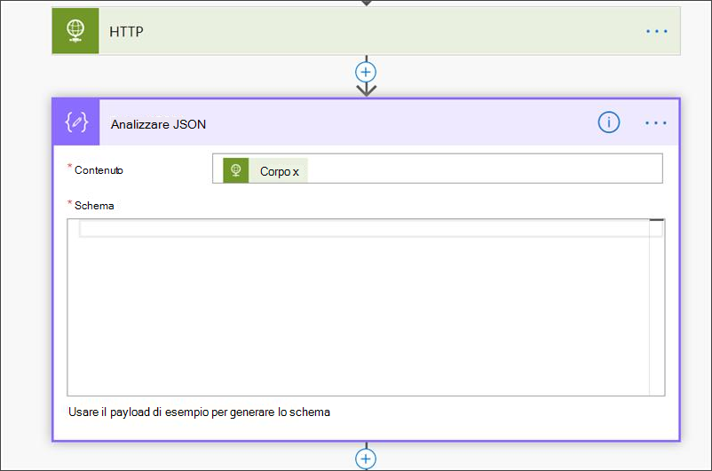
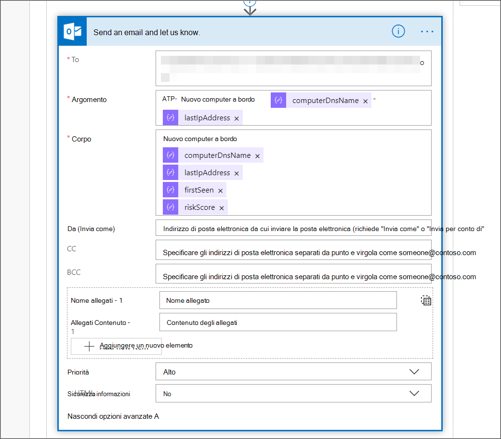

# <a name="create-a-notification-rule-when-a-local-onboarding-or-offboarding-script-is-used"></a>Creare una regola di notifica quando viene utilizzato uno script di onboarding o offboarding locale

[!INCLUDE [Microsoft 365 Defender rebranding](../../includes/microsoft-defender.md)]


**Si applica a:**
- [Microsoft Defender per endpoint](https://go.microsoft.com/fwlink/p/?linkid=2154037)
- [Microsoft 365 Defender](https://go.microsoft.com/fwlink/?linkid=2118804)


> Vuoi provare Microsoft Defender per Endpoint? [Iscriversi per una versione di valutazione gratuita.](https://www.microsoft.com/microsoft-365/windows/microsoft-defender-atp?ocid=docs-wdatp-exposedapis-abovefoldlink)

[!include[Microsoft Defender for Endpoint API URIs for US Government](../../includes/microsoft-defender-api-usgov.md)]

[!include[Improve request performance](../../includes/improve-request-performance.md)]


Creare una regola di notifica in modo che quando viene utilizzato uno script di onboarding o offboarding locale, verrà inviata una notifica. 

## <a name="before-you-begin"></a>Prima di iniziare
Dovrai avere accesso a:
 - Microsoft Flow (Flow piano 1 come minimo). Per ulteriori informazioni, vedere Flow [prezzi.](https://flow.microsoft.com/pricing/)
 - Azure Table o SharePoint list or Library /SQL DB

## <a name="create-the-notification-flow"></a>Creare il flusso di notifica

1. In [flow.microsoft.com](https://flow.microsoft.com/).

2. Passare a **Flussi > nuovo > programmato - da vuoto**. 

    


3. Creare un flusso pianificato.
   1. Immettere un nome di flusso.
   2. Specificare l'inizio e l'ora.
   3. Specificare la frequenza. Ad esempio, ogni 5 minuti.

    

4. Seleziona il pulsante + per aggiungere una nuova azione. La nuova azione sarà una richiesta HTTP all'API del Centro sicurezza Defender per endpoint. Puoi anche sostituirlo con il "connettore WDATP&quot; (azione: &quot;Machines - Get list of machines"). 

    


5. Immettere i campi HTTP seguenti:

   - Metodo: "GET" come valore per ottenere l'elenco dei dispositivi.
   - URI: immettere `https://api.securitycenter.microsoft.com/api/machines` .
   - Autenticazione: selezionare "Active Directory OAuth".
   - Tenant: accedi a e https://portal.azure.com passa a Azure Active Directory > app **e** ottieni il valore ID tenant.
   - Gruppo di destinatari: `https://securitycenter.onmicrosoft.com/windowsatpservice\`
   - ID client: accedi a e passa a Azure Active Directory > https://portal.azure.com **app e** ottieni il valore ID client.
   - Tipo di credenziale: selezionare "Segreto".
   - Segreto: accedi a e https://portal.azure.com passa a Azure Active Directory > **registrazioni app** e ottieni il valore id tenant.

    


6. Aggiungi un nuovo passaggio selezionando **Aggiungi nuova azione,** quindi cerca **Operazioni dati** e seleziona **Analizza JSON.**

    

7. Aggiungere Corpo nel **campo** Contenuto.

    

8. Selezionare il **collegamento Usa payload di esempio per generare lo schema.**

    

9. Copiare e incollare il frammento JSON seguente:

    ```
    {
        "type": "object",
        "properties": {
            "@@odata.context": {
                "type": "string"
            },
            "value": {
                "type": "array",
                "items": {
                    "type": "object",
                    "properties": {
                        "id": {
                            "type": "string"
                        },
                        "computerDnsName": {
                            "type": "string"
                        },
                        "firstSeen": {
                            "type": "string"
                        },
                        "lastSeen": {
                            "type": "string"
                        },
                        "osPlatform": {
                            "type": "string"
                        },
                        "osVersion": {},
                        "lastIpAddress": {
                            "type": "string"
                        },
                        "lastExternalIpAddress": {
                            "type": "string"
                        },
                        "agentVersion": {
                            "type": "string"
                        },
                        "osBuild": {
                            "type": "integer"
                        },
                        "healthStatus": {
                            "type": "string"
                        },
                        "riskScore": {
                            "type": "string"
                        },
                        "exposureScore": {
                            "type": "string"
                        },
                        "aadDeviceId": {},
                        "machineTags": {
                            "type": "array"
                        }
                    },
                    "required": [
                        "id",
                        "computerDnsName",
                        "firstSeen",
                        "lastSeen",
                        "osPlatform",
                        "osVersion",
                        "lastIpAddress",
                        "lastExternalIpAddress",
                        "agentVersion",
                        "osBuild",
                        "healthStatus",
                        "rbacGroupId",
                        "rbacGroupName",
                        "riskScore",
                        "exposureScore",
                        "aadDeviceId",
                        "machineTags"
                    ]
                }
            }
        }
    }

    ```

10.  Estrai i valori dalla chiamata JSON e verifica se i dispositivi onboarded sono già registrati nell'elenco SharePoint come esempio:
- In caso affermativa, non verrà attivata alcuna notifica
- In caso contrario, registrerà i nuovi dispositivi onboarded nell'elenco SharePoint e verrà inviata una notifica al Defender per l'amministratore dell'endpoint

    

    

11. In **Condizione** aggiungere l'espressione seguente: "length(body('Get_items')?[' value'])" e impostare la condizione su uguale a 0.

      
     
       
    

## <a name="alert-notification"></a>Notifica di avviso
L'immagine seguente è un esempio di notifica tramite posta elettronica.


## <a name="tips"></a>Suggerimenti 

- Puoi filtrare qui usando solo lastSeen:
    - Ogni 60 minuti:
      - Prendere tutti i dispositivi visti per l'ultima volta negli ultimi 7 giorni. 

- Per ogni dispositivo: 
    - Se l'ultima proprietà vista si trova nell'intervallo di un'ora di [-7 giorni, -7 giorni + 60 minuti ] -> Avviso per la possibilità di offboarding.
    - Se viene visualizzato per la prima volta nell'ultima > avviso per l'onboarding.

In questa soluzione non saranno presenti avvisi duplicati: esistono tenant con numerosi dispositivi. Ottenere tutti questi dispositivi potrebbe essere molto costoso e potrebbe richiedere il paging.

È possibile suddividerlo in due query: 
1.  Per l'offboarding prendere solo questo intervallo utilizzando il $filter OData e notificare solo se le condizioni sono soddisfatte.
2.  Prendi tutti i dispositivi visti per l'ultima volta nell'ultima ora e controlla la proprietà first seen per loro (se la prima proprietà vista è nell'ultima ora, deve essere presente anche l'ultima proprietà vista). 

