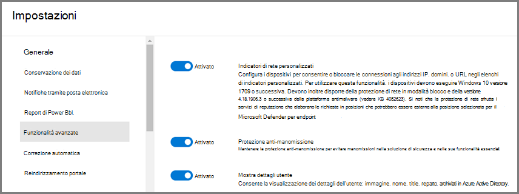
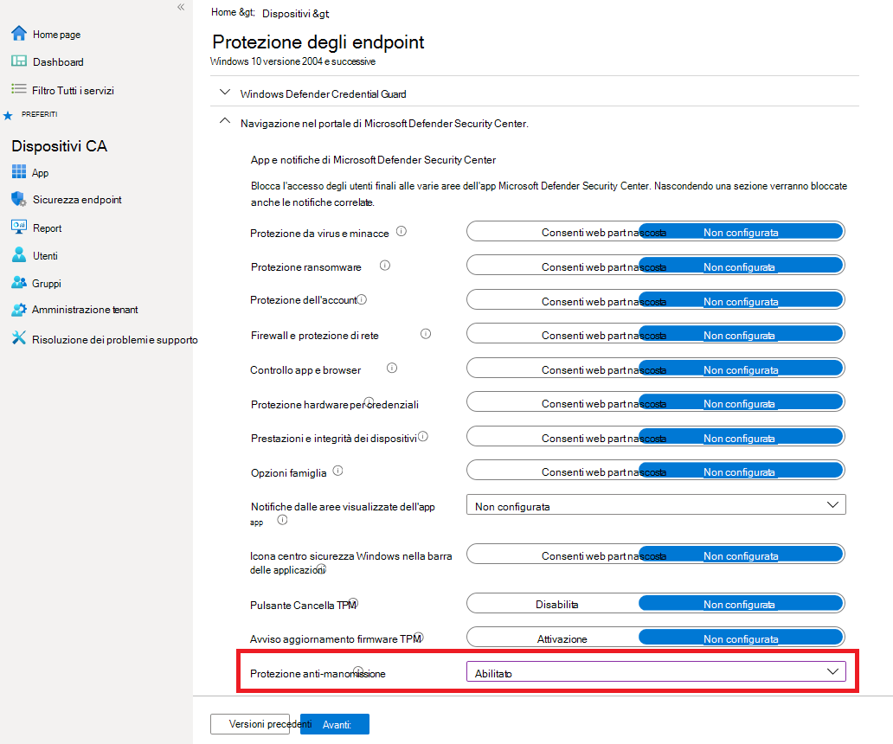
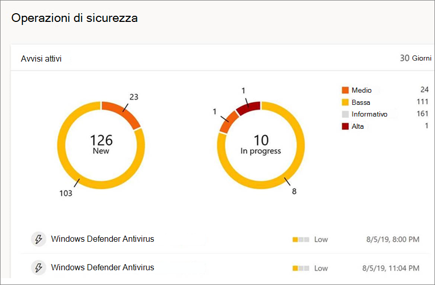
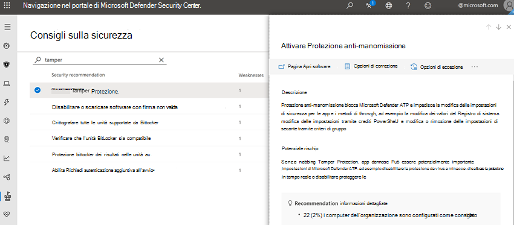

# Proteggere le impostazioni di sicurezza con protezione antimanomissioneProtect security settings with tamper protection

**Si applica a:****Applies to:**

- [Microsoft Defender per endpointMicrosoft Defender for Endpoint](/microsoft-365/security/defender-endpoint/)

La protezione anti-manomissione è disponibile per i dispositivi che eseguono una delle seguenti versioni di Windows:Tamper protection is available for devices that are running one of the following versions of Windows:

- Windows 10Windows 10
- Windows Server 2019Windows Server 2019
- Windows Server, versione 1803 o successivaWindows Server, version 1803 or later
- Windows Server 2016Windows Server 2016

## PanoramicaOverview

Durante alcuni tipi di attacchi informatici, i malinti tentano di disabilitare le funzionalità di sicurezza, ad esempio la protezione antivirus, nei computer.During some kinds of cyber attacks, bad actors try to disable security features, such as anti-virus protection, on your machines. Gli utenti malintenzionati desiderano disabilitare le funzionalità di sicurezza per ottenere un accesso più semplice ai dati, installare malware o sfruttare in altro modo i dati, l'identità e i dispositivi.Bad actors like to disable your security features to get easier access to your data, to install malware, or to otherwise exploit your data, identity, and devices. La protezione anti-manomissione consente di evitare che si verifichino questi tipi di operazioni.Tamper protection helps prevent these kinds of things from occurring.

Con la protezione dalle manomissioni, alle app dannose non viene impedito di eseguire azioni quali:With tamper protection, malicious apps are prevented from taking actions such as:

- Disabilitazione della protezione da virus e minacceDisabling virus and threat protection
- Disabilitazione della protezione in tempo realeDisabling real-time protection
- Disattivazione del monitoraggio del comportamentoTurning off behavior monitoring
- Disabilitazione dell'antivirus (ad esempio IOfficeAntivirus (IOAV))Disabling antivirus (such as IOfficeAntivirus (IOAV))
- Disabilitazione della protezione recapitata nel cloudDisabling cloud-delivered protection
- Rimozione degli aggiornamenti delle funzionalità di intelligence per la sicurezzaRemoving security intelligence updates

### Come funzionaHow it works

La protezione anti-manomissione blocca essenzialmente Antivirus Microsoft Defender ai relativi valori predefiniti e sicuri e impedisce che le impostazioni di sicurezza vengano modificate tramite app e metodi come:Tamper protection essentially locks Microsoft Defender Antivirus to its secure, default values, and prevents your security settings from being changed through apps and methods such as:

- Configurazione delle impostazioni nell'Editor del Registro di sistema nel Windows dispositivoConfiguring settings in Registry Editor on your Windows device
- Modifica delle impostazioni tramite i cmdlet di PowerShellChanging settings through PowerShell cmdlets
- Modifica o rimozione delle impostazioni di sicurezza tramite Criteri di gruppoEditing or removing security settings through Group Policy

La protezione anti-manomissione non impedisce la visualizzazione delle impostazioni di sicurezza.Tamper protection doesn't prevent you from viewing your security settings. La protezione anti-manomissione non influisce sul modo in cui le app antivirus di terze parti si registrano nell'app Sicurezza di Windows sicurezza.And, tamper protection doesn't affect how third-party antivirus apps register with the Windows Security app. Se l'organizzazione usa Windows 10 Enterprise E5, i singoli utenti non possono modificare l'impostazione di protezione da manomissione. in questi casi, la protezione dalle manomissioni è gestita dal team di sicurezza.If your organization is using Windows 10 Enterprise E5, individual users can't change the tamper protection setting; in those cases, tamper protection is managed by your security team.

### Operazione desiderataWhat do you want to do?

| Per eseguire questa attività...To perform this task... | Vedi questa sezione...See this section... |
|:---|:---|
| Gestire la protezione contro le manomissioni nel tenantManage tamper protection across your tenant 
Utilizzare il Microsoft Defender Security Center per attivare o disattivare la protezione da manomissioneUse the Microsoft Defender Security Center to turn tamper protection on or off | [Gestire la protezione da manomissioni per l'organizzazione usando il Microsoft Defender Security CenterManage tamper protection for your organization using the Microsoft Defender Security Center](#manage-tamper-protection-for-your-organization-using-the-microsoft-defender-security-center) |
| Ottimizzare le impostazioni di protezione delle manomissioni nell'organizzazioneFine-tune tamper protection settings in your organization 
Usa Intune (Microsoft Endpoint Manager) per attivare o disattivare la protezione da manomissione.Use Intune (Microsoft Endpoint Manager) to turn tamper protection on or off. Con questo metodo è possibile configurare la protezione da manomissione per alcuni o tutti gli utenti.You can configure tamper protection for some or all users with this method. | [Gestire la protezione contro le manomissioni per l'organizzazione con IntuneManage tamper protection for your organization using Intune](#manage-tamper-protection-for-your-organization-using-intune) |
| Attivare o disattivare la protezione da manomissione per l'organizzazione con Configuration ManagerTurn tamper protection on (or off) for your organization with Configuration Manager | [Gestire la protezione anti-manomissione per l'organizzazione usando il collegamento del tenant con Configuration Manager, versione 2006Manage tamper protection for your organization using tenant attach with Configuration Manager, version 2006](#manage-tamper-protection-for-your-organization-with-configuration-manager-version-2006) |
| Attivare o disattivare la protezione da manomissione per un singolo dispositivoTurn tamper protection on (or off) for an individual device | [Gestire la protezione contro le manomissioni in un singolo dispositivoManage tamper protection on an individual device](#manage-tamper-protection-on-an-individual-device) |
| Visualizzare i dettagli sui tentativi di manomissione nei dispositiviView details about tampering attempts on devices | [Visualizzare informazioni sui tentativi di manomissioneView information about tampering attempts](#view-information-about-tampering-attempts) |
| Esaminare i suggerimenti per la sicurezzaReview your security recommendations | [Esaminare i suggerimenti per la sicurezzaReview security recommendations](#review-your-security-recommendations) |
| Esaminare l'elenco delle domande frequenti (domande frequenti)Review the list of frequently asked questions (FAQs) | [Sfoglia le domande frequentiBrowse the FAQs](#view-information-about-tampering-attempts) |

A seconda del metodo o dello strumento di gestione utilizzato per abilitare la protezione dalle manomissioni, potrebbe esserci una dipendenza dalla protezione consegnata dal cloud.Depending on the method or management tool you use to enable tamper protection, there might be a dependency on cloud-delivered protection. 

Nella tabella seguente vengono fornite informazioni dettagliate su metodi, strumenti e dipendenze.The following table provides details on the methods, tools, and dependencies.

| Come è abilitata la protezione da manomissioneHow tamper protection is enabled  | Dipendenza dalla protezione basata sul cloud (MAPS)Dependency on cloud-delivered protection (MAPS)    |
|:----|:----|
| Microsoft IntuneMicrosoft Intune  | NoNo |
| Microsoft Endpoint Configuration Manager + Tenant AttachMicrosoft Endpoint Configuration Manager + Tenant Attach  |     NoNo  |
| Microsoft Defender Security Center ( [https://securitycenter.windows.com](https://securitycenter.windows.com) )Microsoft Defender Security Center ([https://securitycenter.windows.com](https://securitycenter.windows.com))    |     SìYes |
| Microsoft 365 Defender portale ( [https://security.microsoft.com](https://security.microsoft.com) )Microsoft 365 Defender portal ([https://security.microsoft.com](https://security.microsoft.com))  |     SìYes  |

## Gestire la protezione da manomissioni per l'organizzazione usando il Microsoft Defender Security CenterManage tamper protection for your organization using the Microsoft Defender Security Center

La protezione anti-manomissione può essere attivata o disattivata per il tenant usando il Microsoft Defender Security Center ( [https://securitycenter.windows.com](https://securitycenter.windows.com) ).Tamper protection can be turned on or off for your tenant using the Microsoft Defender Security Center ([https://securitycenter.windows.com](https://securitycenter.windows.com)). Ecco alcuni punti da tenere presenti:Here are a few points to keep in mind:

- Attualmente, l'opzione per gestire la protezione dalle manomissioni nel Microsoft Defender Security Center è attivata per impostazione predefinita per le nuove distribuzioni.Currently, the option to manage tamper protection in the Microsoft Defender Security Center is on by default for new deployments. Per le distribuzioni esistenti, la protezione da manomissione è disponibile in base al consenso esplicito, con l'intenzione di optare per il metodo predefinito nel prossimo futuro.For existing deployments, tamper protection is available on an opt-in basis, with plans to make opting in the default method in the near future. Per acconsentire esplicitamente, Microsoft Defender Security Center scegliere **Impostazioni**  >  **Funzionalità avanzate**  >  **Protezione anti-manomissione.)**(To opt in, in the Microsoft Defender Security Center, choose **Settings** > **Advanced features** > **Tamper protection**.) 

- Quando si usa il Microsoft Defender Security Center per gestire la protezione da manomissione, non è necessario usare Intune o il metodo di collegamento del tenant.When you use the Microsoft Defender Security Center to manage tamper protection, you do not have to use either Intune or the tenant attach method.

- Quando si gestisce la protezione contro le manomissioni nel Microsoft Defender Security Center, l'impostazione viene applicata a livello di tenant, interessando tutti i dispositivi che eseguono Windows 10, Windows Server 2016 o Windows Server 2019.When you manage tamper protection in the Microsoft Defender Security Center, the setting is applied tenant wide, affecting all of your devices that are running Windows 10, Windows Server 2016, or Windows Server 2019. Per ottimizzare la protezione da manomissione (ad esempio, avere la protezione manomissione attivata per alcuni dispositivi, ma disattivata per altri), usa [Intune](#manage-tamper-protection-for-your-organization-using-intune) o Configuration Manager con il [collegamento del tenant.](#manage-tamper-protection-for-your-organization-with-configuration-manager-version-2006)To fine-tune tamper protection (such as having tamper protection on for some devices but off for others), use either [Intune](#manage-tamper-protection-for-your-organization-using-intune) or [Configuration Manager with tenant attach](#manage-tamper-protection-for-your-organization-with-configuration-manager-version-2006).

- Se si dispone di un ambiente ibrido, le impostazioni di protezione delle manomissioni configurate in Intune hanno la precedenza sulle impostazioni configurate nel Microsoft Defender Security Center.If you have a hybrid environment, tamper protection settings configured in Intune take precedence over settings configured in the Microsoft Defender Security Center. 

### Requisiti per la gestione della protezione da manomissione nell'Microsoft Defender Security CenterRequirements for managing tamper protection in the Microsoft Defender Security Center

- È necessario disporre delle autorizzazioni [appropriate,](/microsoft-365/security/defender-endpoint/assign-portal-access)ad esempio l'amministratore globale, l'amministratore della sicurezza o le operazioni di sicurezza.You must have appropriate [permissions](/microsoft-365/security/defender-endpoint/assign-portal-access), such as global admin, security admin, or security operations.

- I Windows devono eseguire una delle seguenti versioni di Windows:Your Windows devices must be running one of the following versions of Windows:

   - Windows 10Windows 10
   - [Windows Server 2019Windows Server 2019](/windows-server/get-started-19/whats-new-19)
   - Windows Server, versione [1803](/windows/release-health/status-windows-10-1803) o successivaWindows Server, version [1803](/windows/release-health/status-windows-10-1803) or later
   - [Windows Server 2016Windows Server 2016](/windows-server/get-started/whats-new-in-windows-server-2016)
   - Per ulteriori informazioni sui rilasci, [vedere Windows 10 release .](/windows/release-health/release-information)For more information about releases, see [Windows 10 release information](/windows/release-health/release-information).

- I dispositivi devono [essere onboarded in Microsoft Defender for Endpoint.](/microsoft-365/security/defender-endpoint/onboarding)Your devices must be [onboarded to Microsoft Defender for Endpoint](/microsoft-365/security/defender-endpoint/onboarding).

- I dispositivi devono usare la piattaforma antimalware versione 4.18.2010.7 (o superiore) e la versione del motore antimalware 1.1.17600.5 (o superiore).Your devices must be using anti-malware platform version 4.18.2010.7 (or above) and anti-malware engine version 1.1.17600.5 (or above). ([Gestire Antivirus Microsoft Defender aggiornamenti e applicare linee di base.](manage-updates-baselines-microsoft-defender-antivirus.md)([Manage Microsoft Defender Antivirus updates and apply baselines](manage-updates-baselines-microsoft-defender-antivirus.md).)

- [La protezione con distribuzione cloud](enable-cloud-protection-microsoft-defender-antivirus.md) deve essere attivata.[Cloud-delivered protection](enable-cloud-protection-microsoft-defender-antivirus.md) must be turned on.

### Attivare o disattivare la protezione da manomissione nella Microsoft Defender Security CenterTurn tamper protection on (or off) in the Microsoft Defender Security Center 

1. Vai al Microsoft Defender Security Center ( [https://securitycenter.windows.com](https://securitycenter.windows.com) ) e accedi.Go to the Microsoft Defender Security Center ([https://securitycenter.windows.com](https://securitycenter.windows.com)) and sign in.

2. Scegliere **Impostazioni**.Choose **Settings**.

3. Vai a **Funzionalità**  >  **avanzate generali** e quindi attiva la protezione anti-manomissione.Go to **General** > **Advanced features**, and then turn tamper protection on.

## Gestire la protezione contro le manomissioni per l'organizzazione con IntuneManage tamper protection for your organization using Intune

Se si fa parte del team di sicurezza dell'organizzazione e la sottoscrizione include [Intune,](/intune/fundamentals/what-is-intune)è possibile attivare o disattivare la protezione da manomissione per l'organizzazione nell'interfaccia di amministrazione di Microsoft Endpoint Manager ( [https://endpoint.microsoft.com](https://endpoint.microsoft.com) ).If you are part of your organization's security team, and your subscription includes [Intune](/intune/fundamentals/what-is-intune), you can turn tamper protection on (or off) for your organization in the Microsoft Endpoint Manager admin center ([https://endpoint.microsoft.com](https://endpoint.microsoft.com)). Usare Intune quando si desidera ottimizzare le impostazioni di protezione delle manomissioni.Use Intune when you want to fine-tune tamper protection settings. Ad esempio, se vuoi abilitare la protezione anti-manomissione in alcuni dispositivi, ma non tutti, usa Intune.For example, if you want to enable tamper protection on some devices, but not all, use Intune.

### Requisiti per la gestione della protezione contro le manomissioni in IntuneRequirements for managing tamper protection in Intune

- È necessario disporre delle autorizzazioni [appropriate,](/microsoft-365/security/defender-endpoint/assign-portal-access)ad esempio l'amministratore globale, l'amministratore della sicurezza o le operazioni di sicurezza.You must have appropriate [permissions](/microsoft-365/security/defender-endpoint/assign-portal-access), such as global admin, security admin, or security operations.

- L'organizzazione usa [Intune per gestire i dispositivi](/intune/fundamentals/what-is-device-management).Your organization uses [Intune to manage devices](/intune/fundamentals/what-is-device-management). ( Sono necessarie licenze di[Intune;](/intune/fundamentals/licenses) Intune è incluso in Microsoft 365 E5.)([Intune licenses](/intune/fundamentals/licenses) are required; Intune is included in Microsoft 365 E5.)

- I Windows devono essere in esecuzione Windows 10 OS [1709,](/windows/release-health/status-windows-10-1709) [1803,](/windows/release-health/status-windows-10-1803) [1809](/windows/release-health/status-windows-10-1809-and-windows-server-2019) o versioni successive.Your Windows devices must be running Windows 10 OS [1709](/windows/release-health/status-windows-10-1709), [1803](/windows/release-health/status-windows-10-1803), [1809](/windows/release-health/status-windows-10-1809-and-windows-server-2019) or later. Per ulteriori informazioni sui rilasci, [vedere Windows 10 sulle versioni.](/windows/release-health/release-information)(For more information about releases, see [Windows 10 release information](/windows/release-health/release-information).)

- Devi usare la sicurezza Windows sicurezza con [security intelligence](https://www.microsoft.com/wdsi/definitions) aggiornata alla versione 1.287.60.0 (o superiore).You must be using Windows security with [security intelligence](https://www.microsoft.com/wdsi/definitions) updated to version 1.287.60.0 (or above).

- I dispositivi devono usare la piattaforma antimalware versione 4.18.1906.3 (o superiore) e la versione del motore antimalware 1.1.15500.X (o versione successiva).Your devices must be using anti-malware platform version 4.18.1906.3 (or above) and anti-malware engine version 1.1.15500.X (or above). ([Gestire Antivirus Microsoft Defender aggiornamenti e applicare linee di base.](manage-updates-baselines-microsoft-defender-antivirus.md)([Manage Microsoft Defender Antivirus updates and apply baselines](manage-updates-baselines-microsoft-defender-antivirus.md).)

### Attivare o disattivare la protezione da manomissione in IntuneTurn tamper protection on (or off) in Intune

1. Accedere [all'interfaccia Microsoft Endpoint Manager di amministrazione](https://endpoint.microsoft.com) e accedere con l'account aziendale o dell'istituto di istruzione.Go to the [Microsoft Endpoint Manager admin center](https://endpoint.microsoft.com) and sign in with your work or school account.

2. Selezionare **Profili di** configurazione dei  >  **dispositivi**.Select **Devices** > **Configuration Profiles**.

3. Creare un profilo che includa le impostazioni seguenti:Create a profile that includes the following settings:

    - **Piattaforma: Windows 10 e versioni successive****Platform: Windows 10 and later**
    - **Tipo di profilo: Endpoint protection****Profile type: Endpoint protection**
    - **Categoria: Microsoft Defender Security Center****Category: Microsoft Defender Security Center**
    - **Protezione manomissione: abilitata****Tamper Protection: Enabled**

4. Assegnare il profilo a uno o più gruppi.Assign the profile to one or more groups.

### Si utilizza Windows Server 2016 o Windows versione 1709, 1803 o 1809?Are you using Windows Server 2016, or Windows version 1709, 1803, or 1809?

Se si usa Windows Server 2016, Windows 10 versione 1709, 1803 o [1809,](/windows/release-health/status-windows-10-1809-and-windows-server-2019)non verrà visualizzato **Protezione** da manomissione nell'app Sicurezza di Windows.If you are using Windows Server 2016, Windows 10 version 1709, 1803, or [1809](/windows/release-health/status-windows-10-1809-and-windows-server-2019), you won't see **Tamper Protection** in the Windows Security app. È invece possibile utilizzare PowerShell per determinare se la protezione da manomissione è abilitata.Instead, you can use PowerShell to determine whether tamper protection is enabled. 
   
In Windows Server 2016, l'app Impostazioni non riflette in modo accurato lo stato della protezione in tempo reale quando è abilitata la protezione da manomissioni.On Windows Server 2016, the Settings app will not accurately reflect the status of real-time protection when tamper protection is enabled.
   
#### Usare PowerShell per determinare se la protezione da manomissioni e/o la protezione in tempo reale sono attivateUse PowerShell to determine whether tamper protection and/or real-time protection are turned on

1. Apri l'Windows PowerShell app.Open the Windows PowerShell app.

2. Utilizzare il cmdlet [Di PowerShell Get-MpComputerStatus.](/powershell/module/defender/get-mpcomputerstatus?preserve-view=true&view=win10-ps)Use the [Get-MpComputerStatus](/powershell/module/defender/get-mpcomputerstatus?preserve-view=true&view=win10-ps) PowerShell cmdlet.

3. Nell'elenco dei risultati cercare `IsTamperProtected` o `RealTimeProtectionEnabled` .In the list of results, look for `IsTamperProtected` or `RealTimeProtectionEnabled`. Il valore *true indica* che è abilitata la protezione da manomissione.(A value of *true* means tamper protection is enabled.)

## Gestire la protezione da manomissione per l'organizzazione con Configuration Manager versione 2006Manage tamper protection for your organization with Configuration Manager, version 2006

Se si utilizza la [versione 2006](/mem/configmgr/core/plan-design/changes/whats-new-in-version-2006)di Configuration Manager, è possibile gestire le impostazioni di protezione dalle manomissioni in Windows 10, Windows Server 2016 e Windows Server 2019 utilizzando un metodo denominato *collegamento tenant*.If you're using [version 2006 of Configuration Manager](/mem/configmgr/core/plan-design/changes/whats-new-in-version-2006), you can manage tamper protection settings on Windows 10, Windows Server 2016, and Windows Server 2019 by using a method called *tenant attach*. Il collegamento tenant consente di sincronizzare i dispositivi di Configuration Manager solo locali nell'interfaccia di amministrazione di Microsoft Endpoint Manager e quindi di distribuire i criteri di configurazione della sicurezza degli endpoint alle raccolte locali & dispositivi.Tenant attach enables you to sync your on-premises-only Configuration Manager devices into the Microsoft Endpoint Manager admin center, and then deliver endpoint security configuration policies to on-premises collections & devices.

:::image type="content" source="images/win-security- exp-policy-endpt-security.png" alt-text="Sicurezza di Windows'esperienza in Endpoint Manager":::

> [!NOTE]
> La procedura può essere utilizzata per estendere la protezione contro le manomissioni ai dispositivi che eseguono Windows 10 e Windows Server 2019.The procedure can be used to extend tamper protection to devices running Windows 10 and Windows Server 2019. Verificare i prerequisiti e altre informazioni nelle risorse indicate in questa procedura.Make sure to review the prerequisites and other information in the resources mentioned in this procedure.

1. Configurare il collegamento del tenant.Set up tenant attach. Per altre informazioni, vedi Microsoft Endpoint Manager [tenant: Sincronizzazione del dispositivo e azioni del dispositivo.](/mem/configmgr/tenant-attach/device-sync-actions)To learn more, see [Microsoft Endpoint Manager tenant attach: Device sync and device actions](/mem/configmgr/tenant-attach/device-sync-actions).

2. [Nell'Microsoft Endpoint Manager di amministrazione,](https://go.microsoft.com/fwlink/?linkid=2109431)passare a **Endpoint security**  >  **Antivirus** e quindi scegliere **+ Create Policy**.In the [Microsoft Endpoint Manager admin center](https://go.microsoft.com/fwlink/?linkid=2109431), go to **Endpoint security** > **Antivirus**, and then choose **+ Create Policy**. 

   - **Nell'elenco Piattaforma** selezionare **Windows 10 e Windows Server (ConfigMgr)**.In the **Platform** list, select **Windows 10 and Windows Server (ConfigMgr)**.  
   - **Nell'elenco Profilo** selezionare Sicurezza di Windows **(anteprima)**.In the **Profile** list, select **Windows Security experience (preview)**.  

3. Distribuisci il criterio nella raccolta di dispositivi.Deploy the policy to your device collection.

### Serve aiuto per questo metodo?Need help with this method? 

Vedere le risorse seguenti:See the following resources:

- [Impostazioni per il profilo Sicurezza di Windows'esperienza utente in Microsoft IntuneSettings for the Windows Security experience profile in Microsoft Intune](/mem/intune/protect/antivirus-security-experience-windows-settings)
- [Blog Community tech: Annuncio della protezione anti-manomissione per i client di collegamento tenant di Configuration ManagerTech Community Blog: Announcing Tamper Protection for Configuration Manager Tenant Attach clients](https://techcommunity.microsoft.com/t5/microsoft-endpoint-manager-blog/announcing-tamper-protection-for-configuration-manager-tenant/ba-p/1700246#.X3QLR5Ziqq8.linkedin)

## Gestire la protezione contro le manomissioni in un singolo dispositivoManage tamper protection on an individual device

> [!NOTE]
> La protezione anti-manomissione blocca i tentativi di Antivirus Microsoft Defender impostazioni tramite il Registro di sistema.Tamper protection blocks attempts to modify Microsoft Defender Antivirus settings through the registry.
>
> Per garantire che la protezione da manomissione non interferisca con i prodotti di sicurezza di terze parti o gli script di installazione aziendale che modificano queste impostazioni, passare **a Sicurezza di Windows** e aggiornare **Security Intelligence** alla versione 1.287.60.0 o successiva.To help ensure that tamper protection doesn’t interfere with third-party security products or enterprise installation scripts that modify these settings, go to **Windows Security** and update **Security intelligence** to version 1.287.60.0 or later. (Vedere [Aggiornamenti di Intelligence per la sicurezza](https://www.microsoft.com/wdsi/definitions).)(See [Security intelligence updates](https://www.microsoft.com/wdsi/definitions).)
>
> Dopo aver eseguito questo aggiornamento, la protezione da manomissione continua a proteggere le impostazioni del Registro di sistema e i registri tentano di modificarle senza restituire errori.Once you’ve made this update, tamper protection continues to protect your registry settings, and logs attempts to modify them without returning errors.

Se sei un utente principale o non sei soggetto alle impostazioni gestite da un team di sicurezza, puoi usare l'app Sicurezza di Windows per gestire la protezione dalle manomissioni.If you are a home user, or you are not subject to settings managed by a security team, you can use the Windows Security app to manage tamper protection. Per modificare le impostazioni di sicurezza, ad esempio la protezione anti-manomissione, devi disporre delle autorizzazioni di amministratore appropriate nel dispositivo.You must have appropriate admin permissions on your device to do change security settings, such as tamper protection.

Ecco cosa vedi nell'app Sicurezza di Windows app:Here's what you see in the Windows Security app:

1. Seleziona **Start** e inizia a digitare *Sicurezza.*Select **Start**, and start typing *Security*. Nei risultati della ricerca selezionare **Sicurezza di Windows**.In the search results, select **Windows Security**.

2. Selezionare **Protezione da virus & protezione da** virus & protezione dalle  >  **minacce.**Select **Virus & threat protection** > **Virus & threat protection settings**.

3. Impostare **Protezione manomissione** su **On** o **Off**.Set **Tamper Protection** to **On** or **Off**.

## Visualizzare informazioni sui tentativi di manomissioneView information about tampering attempts

I tentativi di manomissione indicano in genere attacchi informatici più grandi.Tampering attempts typically indicate bigger cyberattacks. Gli interessati malinti tentano di modificare le impostazioni di sicurezza per mantenere e rimanere inosservati.Bad actors try to change security settings as a way to persist and stay undetected. Se si fa parte del team di sicurezza dell'organizzazione, è possibile visualizzare informazioni su tali tentativi e quindi intraprendere le azioni appropriate per ridurre le minacce.If you're part of your organization's security team, you can view information about such attempts, and then take appropriate actions to mitigate threats.

Quando viene rilevato un tentativo di manomissione, viene generato un avviso nel Microsoft Defender Security Center [(](/microsoft-365/security/defender-endpoint/portal-overview) [https://securitycenter.windows.com](https://securitycenter.windows.com) ).When a tampering attempt is detected, an alert is raised in the [Microsoft Defender Security Center](/microsoft-365/security/defender-endpoint/portal-overview) ([https://securitycenter.windows.com](https://securitycenter.windows.com)).

Usando le funzionalità  di rilevamento e risposta degli [endpoint](/microsoft-365/security/defender-endpoint/overview-endpoint-detection-response) e la ricerca avanzata in Microsoft Defender for Endpoint, il team delle operazioni di sicurezza può analizzare e affrontare tali tentativi.Using [endpoint detection and response](/microsoft-365/security/defender-endpoint/overview-endpoint-detection-response) and [advanced hunting](/microsoft-365/security/defender-endpoint/advanced-hunting-overview) capabilities in Microsoft Defender for Endpoint, your security operations team can investigate and address such attempts.

## Esaminare i suggerimenti per la sicurezzaReview your security recommendations

La protezione anti-manomissione si integra con [le funzionalità di gestione delle & delle](/microsoft-365/security/defender-endpoint/next-gen-threat-and-vuln-mgt) minacce.Tamper protection integrates with [Threat & Vulnerability Management](/microsoft-365/security/defender-endpoint/next-gen-threat-and-vuln-mgt) capabilities. [I suggerimenti per la](/microsoft-365/security/defender-endpoint/tvm-security-recommendation) sicurezza includono l'accertarsi che la protezione contro le manomissioni sia attivata.[Security recommendations](/microsoft-365/security/defender-endpoint/tvm-security-recommendation) include making sure tamper protection is turned on. Ad esempio, è possibile cercare in *manomissione*.For example, you can search on *tamper*. Nei risultati puoi selezionare **Attiva protezione** manomissione per saperne di più e attivarla.In the results, you can select **Turn on Tamper Protection** to learn more and turn it on.

Per ulteriori informazioni sulla gestione delle & delle minacce, vedere [Threat & Vulnerability Management in Microsoft Defender Security Center](/microsoft-365/security/defender-endpoint/tvm-dashboard-insights#threat--vulnerability-management-in-microsoft-defender-security-center).To learn more about Threat & Vulnerability Management, see [Threat & Vulnerability Management in Microsoft Defender Security Center](/microsoft-365/security/defender-endpoint/tvm-dashboard-insights#threat--vulnerability-management-in-microsoft-defender-security-center).

## Domande frequentiFrequently asked questions

### A quali Windows del sistema operativo è applicabile la protezione da manomissione?To which Windows OS versions is configuring tamper protection is applicable?

Windows 10 OS [1709,](/windows/release-health/status-windows-10-1709) [1803,](/windows/release-health/status-windows-10-1803) [1809](/windows/release-health/status-windows-10-1809-and-windows-server-2019)o versioni successive insieme a [Microsoft Defender for Endpoint.](/microsoft-365/security/defender-endpoint)Windows 10 OS [1709](/windows/release-health/status-windows-10-1709), [1803](/windows/release-health/status-windows-10-1803), [1809](/windows/release-health/status-windows-10-1809-and-windows-server-2019), or later together with [Microsoft Defender for Endpoint](/microsoft-365/security/defender-endpoint).

Se si utilizza Configuration Manager, versione 2006, con il collegamento del tenant, la protezione da manomissione può essere estesa a Windows Server 2019.If you are using Configuration Manager, version 2006, with tenant attach, tamper protection can be extended to Windows Server 2019. Vedere [Tenant attach: Create and deploy endpoint security Antivirus policy from the admin center (preview)](/mem/configmgr/tenant-attach/deploy-antivirus-policy).See [Tenant attach: Create and deploy endpoint security Antivirus policy from the admin center (preview)](/mem/configmgr/tenant-attach/deploy-antivirus-policy).

### La protezione da manomissione avrà un impatto sulla registrazione antivirus di terze parti?Will tamper protection have any impact on third-party antivirus registration?

No.No. Le offerte antivirus di terze parti continueranno a registrarsi con l Sicurezza di Windows appliezione.Third-party antivirus offerings will continue to register with the Windows Security application.

### Cosa succede se Antivirus Microsoft Defender non è attivo in un dispositivo?What happens if Microsoft Defender Antivirus is not active on a device?

I dispositivi onboarded in Microsoft Defender for Endpoint Antivirus Microsoft Defender in esecuzione in modalità passiva.Devices that are onboarded to Microsoft Defender for Endpoint will have Microsoft Defender Antivirus running in passive mode. La protezione anti-manomissione continuerà a proteggere il servizio e le relative funzionalità.Tamper protection will continue to protect the service and its features. 

### Come posso attivare/disattivare la protezione da manomissione?How can I turn tamper protection on/off?

Se sei un utente principale, vedi [Gestire la protezione da manomissione in un singolo dispositivo.](#manage-tamper-protection-on-an-individual-device)If you are a home user, see [Manage tamper protection on an individual device](#manage-tamper-protection-on-an-individual-device).

Se si è un'organizzazione che usa [Microsoft Defender for Endpoint,](/microsoft-365/security/defender-endpoint)dovrebbe essere possibile gestire la protezione da manomissione in Intune in modo analogo a come si gestiscono altre funzionalità di protezione degli endpoint.If you are an organization using [Microsoft Defender for Endpoint](/microsoft-365/security/defender-endpoint), you should be able to manage tamper protection in Intune similar to how you manage other endpoint protection features. Vedere le sezioni seguenti di questo articolo:See the following sections of this article: 

- [Gestire la protezione contro le manomissioni con IntuneManage tamper protection using Intune](#manage-tamper-protection-for-your-organization-using-intune)
- [Gestire la protezione contro le manomissioni con Configuration Manager, versione 2006Manage tamper protection using Configuration Manager, version 2006](#manage-tamper-protection-for-your-organization-with-configuration-manager-version-2006)
- [Gestire la protezione contro le manomissioni con il Microsoft Defender Security CenterManage tamper protection using the Microsoft Defender Security Center](#manage-tamper-protection-for-your-organization-using-the-microsoft-defender-security-center) 

### In che modo la configurazione della protezione da manomissioni in Intune influisce sulla modalità di gestione Antivirus Microsoft Defender tramite i criteri di gruppo?How does configuring tamper protection in Intune affect how I manage Microsoft Defender Antivirus through my group policy?

I criteri di gruppo normali non si applicano alla protezione da manomissione e le modifiche alle impostazioni Antivirus Microsoft Defender vengono ignorate quando la protezione da manomissione è impostata.Your regular group policy doesn’t apply to tamper protection, and changes to Microsoft Defender Antivirus settings are ignored when tamper protection is on. 

### Per Microsoft Defender per Endpoint, la configurazione della protezione da manomissione in Intune è destinata solo all'intera organizzazione?For Microsoft Defender for Endpoint, is configuring tamper protection in Intune targeted to the entire organization only?

La configurazione della protezione contro le manomissioni in Intune o Microsoft Endpoint Manager può essere destinata all'intera organizzazione e a dispositivi e gruppi di utenti specifici.Configuring tamper protection in Intune or Microsoft Endpoint Manager can be targeted to your entire organization and to specific devices and user groups.

### È possibile configurare Protezione da manomissione in Microsoft Endpoint Configuration Manager?Can I configure Tamper Protection in Microsoft Endpoint Configuration Manager?

Se si utilizza il collegamento del tenant, è possibile usare Microsoft Endpoint Configuration Manager.If you are using tenant attach, you can use Microsoft Endpoint Configuration Manager. Vedere le risorse seguenti:See the following resources:
- [Gestire la protezione da manomissione per l'organizzazione con Configuration Manager versione 2006Manage tamper protection for your organization with Configuration Manager, version 2006](#manage-tamper-protection-for-your-organization-with-configuration-manager-version-2006)
- [Blog Community tech: Annuncio della protezione anti-manomissione per i client di collegamento tenant di Configuration ManagerTech Community blog: Announcing Tamper Protection for Configuration Manager Tenant Attach clients](https://techcommunity.microsoft.com/t5/microsoft-endpoint-manager-blog/announcing-tamper-protection-for-configuration-manager-tenant/ba-p/1700246#.X3QLR5Ziqq8.linkedin)

### Ho la registrazione Windows E3.I have the Windows E3 enrollment. È possibile usare la configurazione della protezione contro le manomissioni in Intune?Can I use configuring tamper protection in Intune?

Attualmente, la configurazione della protezione anti-manomissione in Intune è disponibile solo per i clienti che dispongono di [Microsoft Defender per Endpoint.](/microsoft-365/security/defender-endpoint)Currently, configuring tamper protection in Intune is only available for customers who have [Microsoft Defender for Endpoint](/microsoft-365/security/defender-endpoint).

### Cosa succede se si tenta di modificare le impostazioni di Microsoft Defender for Endpoint in Intune, Microsoft Endpoint Configuration Manager e Strumentazione gestione Windows quando protezione da manomissione è abilitata in un dispositivo?What happens if I try to change Microsoft Defender for Endpoint settings in Intune, Microsoft Endpoint Configuration Manager, and Windows Management Instrumentation when Tamper Protection is enabled on a device?

Non sarà possibile modificare le funzionalità protette dalla protezione da manomissione. tali richieste di modifica vengono ignorate.You won’t be able to change the features that are protected by tamper protection; such change requests are ignored.

### Sono un cliente aziendale.I’m an enterprise customer. Gli amministratori locali possono modificare la protezione dalle manomissioni nei propri dispositivi?Can local admins change tamper protection on their devices?

No.No. Gli amministratori locali non possono modificare o modificare le impostazioni di protezione da manomissione.Local admins cannot change or modify tamper protection settings.

### Cosa succede se il dispositivo viene onboarded con Microsoft Defender for Endpoint e quindi passa allo stato off-boarded?What happens if my device is onboarded with Microsoft Defender for Endpoint and then goes into an off-boarded state?

Se un dispositivo è fuori bordo da Microsoft Defender for Endpoint, la protezione anti-manomissione è attivata, che è lo stato predefinito per i dispositivi non gestiti.If a device is off-boarded from Microsoft Defender for Endpoint, tamper protection is turned on, which is the default state for unmanaged devices. 

### Verrà visualizzato un avviso in caso di modifica dello stato di protezione da manomissione nel Microsoft Defender Security Center?Will there be an alert about tamper protection status changing in the Microsoft Defender Security Center?

Sì.Yes. L'avviso viene visualizzato in [https://securitycenter.microsoft.com](https://securitycenter.microsoft.com) **Avvisi**.The alert is shown in [https://securitycenter.microsoft.com](https://securitycenter.microsoft.com) under **Alerts**.

Il team delle operazioni di sicurezza può inoltre utilizzare query di ricerca, ad esempio l'esempio seguente:Your security operations team can also use hunting queries, such as the following example:

`DeviceAlertEvents | where Title == "Tamper Protection bypass"`

[Visualizzare informazioni sui tentativi di manomissione.](#view-information-about-tampering-attempts)[View information about tampering attempts](#view-information-about-tampering-attempts).

## Vedere ancheSee also

[Proteggere i Windows pc con Endpoint Protection per Microsoft IntuneHelp secure Windows PCs with Endpoint Protection for Microsoft Intune](/intune/help-secure-windows-pcs-with-endpoint-protection-for-microsoft-intune)

[Panoramica di Microsoft Defender for EndpointGet an overview of Microsoft Defender for Endpoint](/microsoft-365/security/defender-endpoint)

[Insieme è meglio: Microsoft Defender Antivirus e Microsoft Defender per EndpointBetter together: Microsoft Defender Antivirus and Microsoft Defender for Endpoint](why-use-microsoft-defender-antivirus.md)
