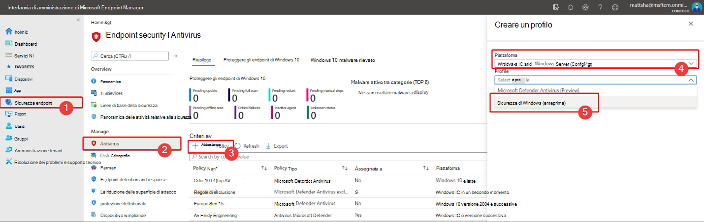

# Proteggere le impostazioni di sicurezza con protezione anti-manomissione

[!INCLUDE [Microsoft 365 Defender rebranding](../../includes/microsoft-defender.md)]

**Si applica a:**

- [Microsoft Defender per endpoint](/microsoft-365/security/defender-endpoint/)

La protezione anti-manomissione è disponibile per i dispositivi che eseguono una delle seguenti versioni di Windows:

- Windows 10
- Windows Server 2019
- Windows Server, versione 1803 o successiva
- Windows Server 2016

## Panoramica

Durante alcuni tipi di attacchi informatici, i malinti tentano di disabilitare le funzionalità di sicurezza, ad esempio la protezione antivirus, nei computer. Gli utenti malintenzionati desiderano disabilitare le funzionalità di sicurezza per ottenere un accesso più semplice ai dati, installare malware o sfruttare in altro modo i dati, l'identità e i dispositivi. La protezione anti-manomissione consente di evitare che si verifichino questi tipi di operazioni.

Con la protezione dalle manomissioni, alle app dannose non viene impedito di eseguire azioni quali:

- Disabilitazione della protezione da virus e minacce
- Disabilitazione della protezione in tempo reale
- Disattivazione del monitoraggio del comportamento
- Disabilitazione dell'antivirus (ad esempio IOfficeAntivirus (IOAV))
- Disabilitazione della protezione recapitata nel cloud
- Rimozione degli aggiornamenti delle funzionalità di intelligence per la sicurezza

### Funzionamento

La protezione anti-manomissione blocca essenzialmente Microsoft Defender Antivirus e impedisce che le impostazioni di sicurezza vengano modificate tramite app e metodi come:

- Configurazione delle impostazioni nell'Editor del Registro di sistema nel dispositivo Windows
- Modifica delle impostazioni tramite i cmdlet di PowerShell
- Modifica o rimozione delle impostazioni di sicurezza tramite criteri di gruppo

La protezione anti-manomissione non impedisce la visualizzazione delle impostazioni di sicurezza. La protezione anti-manomissione non influisce sul modo in cui le app antivirus di terze parti si registrano con l'app Sicurezza di Windows. Se l'organizzazione usa Windows 10 Enterprise E5, i singoli utenti non possono modificare l'impostazione di protezione da manomissione; in questi casi, la protezione dalle manomissioni è gestita dal team di sicurezza.

### Operazione desiderata

| Per eseguire questa attività... | Vedi questa sezione... |
|:---|:---|
| Attivare o disattivare la protezione da manomissione in Microsoft Defender Security Center 
Gestire la protezione contro le manomissioni nel tenant | [Gestire la protezione da manomissione per l'organizzazione tramite Microsoft Defender Security Center](#manage-tamper-protection-for-your-organization-using-the-microsoft-defender-security-center) |
| Attivare o disattivare la protezione da manomissioni per tutta o parte dell'organizzazione tramite Intune 
Ottimizzare le impostazioni di protezione delle manomissioni nell'organizzazione | [Gestire la protezione contro le manomissioni per l'organizzazione con Intune](#manage-tamper-protection-for-your-organization-using-intune) |
| Attivare o disattivare la protezione da manomissione per l'organizzazione con Configuration Manager | [Gestire la protezione anti-manomissione per l'organizzazione usando il collegamento del tenant con Configuration Manager, versione 2006](#manage-tamper-protection-for-your-organization-with-configuration-manager-version-2006) |
| Attivare o disattivare la protezione da manomissione per un singolo dispositivo | [Gestire la protezione contro le manomissioni in un singolo dispositivo](#manage-tamper-protection-on-an-individual-device) |
| Visualizzare i dettagli sui tentativi di manomissione nei dispositivi | [Visualizzare informazioni sui tentativi di manomissione](#view-information-about-tampering-attempts) |
| Esaminare i suggerimenti per la sicurezza | [Esaminare i suggerimenti per la sicurezza](#review-your-security-recommendations) |
| Esaminare l'elenco delle domande frequenti (domande frequenti) | [Sfoglia le domande frequenti](#view-information-about-tampering-attempts) |

## Gestire la protezione da manomissione per l'organizzazione tramite Microsoft Defender Security Center

La protezione anti-manomissione può essere attivata o disattivata per il tenant tramite Microsoft Defender Security Center ( [https://securitycenter.windows.com](https://securitycenter.windows.com) ). Ecco alcuni punti da tenere presenti:

- Attualmente, l'opzione per gestire la protezione dalle manomissioni in Microsoft Defender Security Center è attivata per impostazione predefinita per le nuove distribuzioni. Per le distribuzioni esistenti, la protezione contro le manomissioni è disponibile in base al consenso esplicito, con l'intenzione di renderlo il metodo predefinito nel prossimo futuro. Per acconsentire esplicitamente, in Microsoft Defender Security Center scegliere **Impostazioni**  >  **Funzionalità avanzate**  >  **Protezione anti-manomissione.)** 

- Quando usi Microsoft Defender Security Center per gestire la protezione da manomissione, non devi usare Intune o il metodo di collegamento del tenant.

- Quando gestisci la protezione anti-manomissione in Microsoft Defender Security Center, l'impostazione viene applicata a livello di tenant, interessando tutti i dispositivi che eseguono Windows 10, Windows Server 2016 o Windows Server 2019. Per ottimizzare la protezione da manomissione (ad esempio, avere la protezione manomissione attivata per alcuni dispositivi, ma disattivata per altri), usa [Intune](#manage-tamper-protection-for-your-organization-using-intune) o Configuration Manager con il [collegamento del tenant.](#manage-tamper-protection-for-your-organization-with-configuration-manager-version-2006)

- Se si dispone di un ambiente ibrido, le impostazioni di protezione delle manomissioni configurate in Intune hanno la precedenza sulle impostazioni configurate in Microsoft Defender Security Center. 

### Requisiti per la gestione della protezione da manomissione in Microsoft Defender Security Center

- È necessario disporre delle autorizzazioni [appropriate,](/microsoft-365/security/defender-endpoint/assign-portal-access)ad esempio l'amministratore globale, l'amministratore della sicurezza o le operazioni di sicurezza.

- I dispositivi Windows devono eseguire una delle versioni seguenti di Windows:
   - Windows 10
   - [Windows Server 2019](/windows-server/get-started-19/whats-new-19)
   - Windows Server, versione [1803](/windows/release-health/status-windows-10-1803) o successiva
   - [Windows Server 2016](/windows-server/get-started/whats-new-in-windows-server-2016)
   - Per altre informazioni sulle versioni, vedi [Informazioni sulla versione di Windows 10.](/windows/release-health/release-information)

- I dispositivi devono [essere onboarded in Microsoft Defender for Endpoint.](/microsoft-365/security/defender-endpoint/onboarding)

- I dispositivi devono usare la piattaforma antimalware versione 4.18.2010.7 (o superiore) e la versione del motore antimalware 1.1.17600.5 (o superiore). ([Gestire gli aggiornamenti di Microsoft Defender Antivirus e applicare le linee di base](manage-updates-baselines-microsoft-defender-antivirus.md).)

- [La protezione con distribuzione cloud](enable-cloud-protection-microsoft-defender-antivirus.md) deve essere attivata.

### Attivare o disattivare la protezione da manomissione in Microsoft Defender Security Center 

1. Vai a Microsoft Defender Security Center ( [https://securitycenter.windows.com](https://securitycenter.windows.com) ) e accedi.

2. Scegliere **Impostazioni**.

3. Vai a **Funzionalità**  >  **avanzate generali** e quindi attiva la protezione anti-manomissione.

## Gestire la protezione contro le manomissioni per l'organizzazione con Intune

Se si fa parte del team di sicurezza dell'organizzazione e la sottoscrizione include [Intune,](/intune/fundamentals/what-is-intune)è possibile attivare o disattivare la protezione da manomissione per l'organizzazione nel portale dell'interfaccia di amministrazione di [Microsoft Endpoint Manager.](https://endpoint.microsoft.com) Usare Intune quando si desidera ottimizzare le impostazioni di protezione delle manomissioni. Ad esempio, se vuoi abilitare la protezione anti-manomissione in alcuni dispositivi, ma non tutti, usa Intune.

### Requisiti per la gestione della protezione contro le manomissioni in Intune

- È necessario disporre delle autorizzazioni [appropriate,](/microsoft-365/security/defender-endpoint/assign-portal-access)ad esempio l'amministratore globale, l'amministratore della sicurezza o le operazioni di sicurezza.

- L'organizzazione usa [Intune per gestire i dispositivi](/intune/fundamentals/what-is-device-management). ( Sono necessarie licenze di[Intune;](/intune/fundamentals/licenses) Intune è incluso in Microsoft 365 E5.

- I dispositivi Windows devono eseguire Windows 10 OS [1709,](/windows/release-health/status-windows-10-1709) [1803,](/windows/release-health/status-windows-10-1803) [1809](/windows/release-health/status-windows-10-1809-and-windows-server-2019) o versioni successive. Per altre informazioni sulle versioni, vedi Informazioni [sulla versione di Windows 10.](/windows/release-health/release-information)

- Devi usare la sicurezza di Windows con [security intelligence](https://www.microsoft.com/wdsi/definitions) aggiornata alla versione 1.287.60.0 (o superiore).

- I dispositivi devono usare la piattaforma antimalware versione 4.18.1906.3 (o superiore) e la versione del motore antimalware 1.1.15500.X (o versione successiva). ([Gestire gli aggiornamenti di Microsoft Defender Antivirus e applicare le linee di base](manage-updates-baselines-microsoft-defender-antivirus.md).)

### Attivare o disattivare la protezione da manomissione in Intune

1. Accedere [all'interfaccia di amministrazione di Microsoft Endpoint Manager](https://endpoint.microsoft.com) e accedere con l'account aziendale o dell'istituto di istruzione.

2. Selezionare **Profili di** configurazione dei  >  **dispositivi**.

3. Creare un profilo che includa le impostazioni seguenti:
    - **Piattaforma: Windows 10 e versioni successive**
    - **Tipo di profilo: Endpoint protection**
    - **Categoria: Microsoft Defender Security Center**
    - **Protezione manomissione: abilitata**

4. Assegnare il profilo a uno o più gruppi.

### Si usa Windows OS 1709, 1803 o 1809?

Se si usa Windows 10 OS [1709,](/windows/release-health/status-windows-10-1709) [1803](/windows/release-health/status-windows-10-1803)o [1809,](/windows/release-health/status-windows-10-1809-and-windows-server-2019)non verrà visualizzato **Protezione** manomissione nell'app Sicurezza di Windows. È invece possibile utilizzare PowerShell per determinare se la protezione da manomissione è abilitata.

#### Utilizzare PowerShell per determinare se la protezione da manomissione è attivata

1. Apri l Windows PowerShell app.

2. Utilizzare il cmdlet [Di PowerShell Get-MpComputerStatus.](/powershell/module/defender/get-mpcomputerstatus?preserve-view=true&view=win10-ps)

3. Nell'elenco dei risultati cercare `IsTamperProtected` . Il valore *true indica* che è abilitata la protezione da manomissione.

## Gestire la protezione da manomissione per l'organizzazione con Configuration Manager versione 2006

Se si usa la [versione 2006](/mem/configmgr/core/plan-design/changes/whats-new-in-version-2006)di Configuration Manager, è possibile gestire le impostazioni di protezione dalle manomissioni in Windows 10, Windows Server 2016 e Windows Server 2019 utilizzando un metodo denominato *collegamento tenant.* Il collegamento tenant consente di sincronizzare i dispositivi di Configuration Manager solo locali nell'interfaccia di amministrazione di Microsoft Endpoint Manager e quindi di distribuire i criteri di configurazione della sicurezza degli endpoint alle raccolte locali & dispositivi.

> [!NOTE]
> La procedura può essere usata per estendere la protezione contro le manomissioni ai dispositivi che eseguono Windows 10 e Windows Server 2019. Verificare i prerequisiti e altre informazioni nelle risorse indicate in questa procedura.

1. Configurare il collegamento del tenant. Per ottenere assistenza, vedi Collegamento del tenant di [Microsoft Endpoint Manager: Sincronizzazione dei dispositivi e azioni del dispositivo.](/mem/configmgr/tenant-attach/device-sync-actions)

2. [Nell'interfaccia di amministrazione di Microsoft Endpoint Manager,](https://go.microsoft.com/fwlink/?linkid=2109431)passare a Endpoint **security**  >  **Antivirus** e quindi scegliere **+ Create Policy**.  
   - **Nell'elenco** Piattaforma seleziona **Windows 10 e Windows Server (ConfigMgr).**  
   - **Nell'elenco Profilo** seleziona **Esperienza di sicurezza di Windows (anteprima).**  

3. Distribuisci il criterio nella raccolta di dispositivi.

### Serve aiuto per questo metodo? 

Vedere le risorse seguenti:

- [Impostazioni per il profilo dell'esperienza di sicurezza di Windows in Microsoft Intune](/mem/intune/protect/antivirus-security-experience-windows-settings)
- [Blog della community tech: Annuncio della protezione anti-manomissione per i client di collegamento tenant di Configuration Manager](https://techcommunity.microsoft.com/t5/microsoft-endpoint-manager-blog/announcing-tamper-protection-for-configuration-manager-tenant/ba-p/1700246#.X3QLR5Ziqq8.linkedin)

## Gestire la protezione contro le manomissioni in un singolo dispositivo

> [!NOTE]
> La protezione anti-manomissione blocca i tentativi di modifica delle impostazioni di Microsoft Defender Antivirus tramite il Registro di sistema.
>
> Per garantire che la protezione da manomissione non interferisca con i prodotti di sicurezza di terze parti o gli script di installazione aziendale che modificano queste impostazioni, passare a Sicurezza di **Windows** e aggiornare Security **intelligence** alla versione 1.287.60.0 o successiva. (Vedere [Aggiornamenti di Intelligence per la sicurezza](https://www.microsoft.com/wdsi/definitions).)
>
> Dopo aver eseguito questo aggiornamento, la protezione da manomissione continua a proteggere le impostazioni del Registro di sistema e i registri tentano di modificarle senza restituire errori.

Se sei un utente principale o non sei soggetto alle impostazioni gestite da un team di sicurezza, puoi usare l'app Sicurezza di Windows per gestire la protezione dalle manomissioni. Per modificare le impostazioni di sicurezza, ad esempio la protezione anti-manomissione, devi disporre delle autorizzazioni di amministratore appropriate nel dispositivo.

Ecco cosa vedi nell'app Sicurezza di Windows:

1. Seleziona **Start** e inizia a digitare *Sicurezza.* Nei risultati della ricerca seleziona **Sicurezza di Windows.**

2. Selezionare **Protezione da virus & protezione da** virus & protezione dalle  >  **minacce.**

3. Impostare **Protezione manomissione** su **On** o **Off**.

## Visualizzare informazioni sui tentativi di manomissione

I tentativi di manomissione indicano in genere attacchi informatici più grandi. Gli interessati malinti tentano di modificare le impostazioni di sicurezza per mantenere e rimanere inosservati. Se si fa parte del team di sicurezza dell'organizzazione, è possibile visualizzare informazioni su tali tentativi e quindi intraprendere le azioni appropriate per ridurre le minacce.

Quando viene rilevato un tentativo di manomissione, viene generato un avviso in [Microsoft Defender Security Center](/microsoft-365/security/defender-endpoint/portal-overview) ( [https://securitycenter.windows.com](https://securitycenter.windows.com) ).

Usando le funzionalità  di rilevamento e risposta degli [endpoint](/microsoft-365/security/defender-endpoint/overview-endpoint-detection-response) e la ricerca avanzata in Microsoft Defender for Endpoint, il team delle operazioni di sicurezza può analizzare e affrontare tali tentativi.

## Esaminare i suggerimenti per la sicurezza

La protezione anti-manomissione si integra con [le funzionalità di gestione delle & delle](/microsoft-365/security/defender-endpoint/next-gen-threat-and-vuln-mgt) minacce. [I suggerimenti per la](/microsoft-365/security/defender-endpoint/tvm-security-recommendation) sicurezza includono l'accertarsi che la protezione contro le manomissioni sia attivata. Ad esempio, è possibile eseguire una ricerca in caso di *manomissione,* come illustrato nell'immagine seguente:

Nei risultati puoi selezionare **Attiva protezione** manomissione per saperne di più e attivarla.

Per ulteriori informazioni sulla gestione delle & delle minacce, vedere [Threat & Vulnerability Management in Microsoft Defender Security Center.](/microsoft-365/security/defender-endpoint/tvm-dashboard-insights#threat--vulnerability-management-in-microsoft-defender-security-center)

## Domande frequenti

### A quali versioni del sistema operativo Windows è applicabile la protezione contro le manomissioni?

Windows 10 OS [1709,](/windows/release-health/status-windows-10-1709) [1803,](/windows/release-health/status-windows-10-1803) [1809](/windows/release-health/status-windows-10-1809-and-windows-server-2019)o versioni successive insieme a [Microsoft Defender for Endpoint.](/microsoft-365/security/defender-endpoint)

Se si usa Configuration Manager, versione 2006, con il collegamento del tenant, la protezione da manomissione può essere estesa a Windows Server 2019. Vedere [Tenant attach: Create and deploy endpoint security Antivirus policy from the admin center (preview)](/mem/configmgr/tenant-attach/deploy-antivirus-policy).

### La protezione da manomissione avrà un impatto sulla registrazione antivirus di terze parti?

No. Le offerte antivirus di terze parti continueranno a registrarsi con l'applicazione di sicurezza di Windows.

### Cosa succede se Microsoft Defender Antivirus non è attivo in un dispositivo?

I dispositivi onboarded in Microsoft Defender for Endpoint avranno Microsoft Defender Antivirus in esecuzione in modalità passiva. La protezione anti-manomissione continuerà a proteggere il servizio e le relative funzionalità. 

### Come posso attivare/disattivare la protezione da manomissione?

Se sei un utente principale, vedi [Gestire la protezione da manomissione in un singolo dispositivo.](#manage-tamper-protection-on-an-individual-device)

Se si è un'organizzazione che usa [Microsoft Defender for Endpoint,](/microsoft-365/security/defender-endpoint)dovrebbe essere possibile gestire la protezione da manomissione in Intune in modo analogo a come si gestiscono altre funzionalità di protezione degli endpoint. Vedere le sezioni seguenti di questo articolo: 

- [Gestire la protezione contro le manomissioni con Intune](#manage-tamper-protection-for-your-organization-using-intune)
- [Gestire la protezione contro le manomissioni con Configuration Manager, versione 2006](#manage-tamper-protection-for-your-organization-with-configuration-manager-version-2006)
- [Gestire la protezione da manomissione con Microsoft Defender Security Center](#manage-tamper-protection-for-your-organization-using-the-microsoft-defender-security-center) (attualmente in anteprima)

### In che modo la configurazione della protezione contro le manomissioni in Intune influisce sulla gestione di Microsoft Defender Antivirus tramite i criteri di gruppo?

I criteri di gruppo normali non si applicano alla protezione da manomissione e le modifiche alle impostazioni di Microsoft Defender Antivirus vengono ignorate quando la protezione da manomissione è impostata. 

### Per Microsoft Defender per Endpoint, la configurazione della protezione da manomissione in Intune è destinata solo all'intera organizzazione?

La configurazione della protezione contro le manomissioni in Intune o Microsoft Endpoint Manager può essere destinata all'intera organizzazione e a dispositivi e gruppi di utenti specifici.

### È possibile configurare Tamper Protection in Microsoft Endpoint Configuration Manager?

Se si usa il collegamento tenant, è possibile usare Microsoft Endpoint Configuration Manager. Vedere le risorse seguenti:
- [Gestire la protezione da manomissione per l'organizzazione con Configuration Manager versione 2006](#manage-tamper-protection-for-your-organization-with-configuration-manager-version-2006)
- [Blog della community tech: Annuncio della protezione anti-manomissione per i client di collegamento tenant di Configuration Manager](https://techcommunity.microsoft.com/t5/microsoft-endpoint-manager-blog/announcing-tamper-protection-for-configuration-manager-tenant/ba-p/1700246#.X3QLR5Ziqq8.linkedin)

### Ho la registrazione di Windows E3. È possibile usare la configurazione della protezione contro le manomissioni in Intune?

Attualmente, la configurazione della protezione anti-manomissione in Intune è disponibile solo per i clienti che dispongono di [Microsoft Defender per Endpoint.](/microsoft-365/security/defender-endpoint)

### Cosa succede se si tenta di modificare le impostazioni di Microsoft Defender for Endpoint in Intune, Microsoft Endpoint Configuration Manager e Strumentazione gestione Windows quando protezione da manomissione è abilitata in un dispositivo?

Non sarà possibile modificare le funzionalità protette dalla protezione da manomissione. tali richieste di modifica vengono ignorate.

### Sono un cliente aziendale. Gli amministratori locali possono modificare la protezione dalle manomissioni nei propri dispositivi?

No. Gli amministratori locali non possono modificare o modificare le impostazioni di protezione da manomissione.

### Cosa succede se il dispositivo viene onboarded con Microsoft Defender for Endpoint e quindi passa allo stato off-boarded?

Se un dispositivo è fuori bordo da Microsoft Defender for Endpoint, la protezione anti-manomissione è attivata, che è lo stato predefinito per i dispositivi non gestiti. 

### Verrà visualizzato un avviso sulla modifica dello stato di protezione delle manomissioni in Microsoft Defender Security Center?

Sì. L'avviso viene visualizzato in [https://securitycenter.microsoft.com](https://securitycenter.microsoft.com) **Avvisi**.

Il team delle operazioni di sicurezza può inoltre utilizzare query di ricerca, ad esempio l'esempio seguente:

`DeviceAlertEvents | where Title == "Tamper Protection bypass"`

[Visualizzare informazioni sui tentativi di manomissione.](#view-information-about-tampering-attempts)

## Vedere anche

[Proteggere i PC Windows con Endpoint Protection per Microsoft Intune](/intune/help-secure-windows-pcs-with-endpoint-protection-for-microsoft-intune)

[Panoramica di Microsoft Defender for Endpoint](/microsoft-365/security/defender-endpoint)

[Insieme: Microsoft Defender Antivirus e Microsoft Defender for Endpoint](why-use-microsoft-defender-antivirus.md)