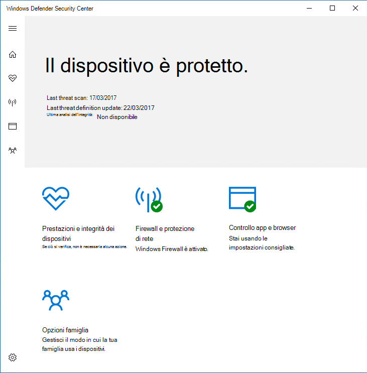
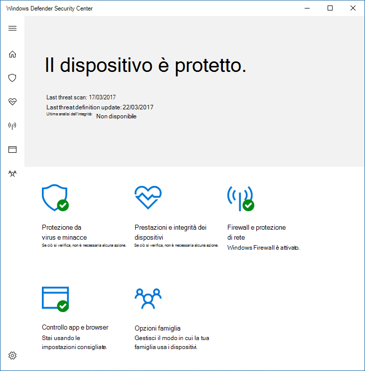
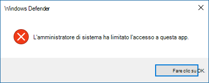

# Impedire agli utenti di visualizzare o interagire con l'interfaccia utente di Microsoft Defender Antivirus

[!INCLUDE [Microsoft 365 Defender rebranding](../../includes/microsoft-defender.md)]

**Si applica a:**

- [Microsoft Defender per endpoint](/microsoft-365/security/defender-endpoint/)

Puoi usare Criteri di gruppo per impedire agli utenti degli endpoint di visualizzare l'interfaccia di Microsoft Defender Antivirus. È inoltre possibile impedire loro di sospendere le analisi.

## Nascondere l'interfaccia di Microsoft Defender Antivirus

In Windows 10, versione 1703, nascondere l'interfaccia nasconde le notifiche di Microsoft Defender Antivirus e impedire la visualizzazione del riquadro Protezione dalle minacce di Virus & nell'app Sicurezza di Windows.

Con l'impostazione impostata su **Abilitato**:

Con l'impostazione impostata **su Disabilitato** o non configurata:

>[!NOTE]
>Nascondere l'interfaccia impedirà anche la visualizzazione delle notifiche di Microsoft Defender Antivirus nell'endpoint. Verranno comunque visualizzate le notifiche di Microsoft Defender for Endpoint. Puoi anche configurare [singolarmente le notifiche visualizzate sugli endpoint](configure-notifications-microsoft-defender-antivirus.md)

Nelle versioni precedenti di Windows 10, l'impostazione nasconde l'Windows Defender client. Se l'utente tenta di aprirla, riceverà un avviso che indica che l'amministratore di sistema ha limitato l'accesso a questa app.

## Usare Criteri di gruppo per nascondere l'interfaccia di Microsoft Defender AV agli utenti

1. Nel computer di gestione di Criteri di gruppo, aprire Console Gestione Criteri di [gruppo,](/previous-versions/windows/desktop/gpmc/group-policy-management-console-portal)fare clic con il pulsante destro del mouse sull'oggetto Criteri di gruppo che si desidera configurare e scegliere **Modifica**.

2. Utilizzando **l'Editor Gestione Criteri di gruppo** passare a Configurazione **computer**.

3. Fare clic **su Modelli amministrativi**.

4. Espandi l'albero **fino a visualizzare i componenti di Windows >'interfaccia > Client di Microsoft Defender Antivirus.**

5. Fai doppio clic sull'impostazione Abilita modalità interfaccia utente **headless** e imposta l'opzione su **Abilitato.** Fare clic su **OK**. 

Vedi [Impedire agli utenti di modificare localmente le impostazioni dei criteri](configure-local-policy-overrides-microsoft-defender-antivirus.md) per altre opzioni su come impedire agli utenti di modificare la protezione nei propri PC.

## Impedire agli utenti di sospendere un'analisi

È possibile impedire agli utenti di sospendere le analisi, il che può essere utile per garantire che le analisi pianificate o su richiesta non siano interrotte dagli utenti.

> [!NOTE]
> Questa impostazione non è supportata in Windows 10.

### Utilizzare Criteri di gruppo per impedire agli utenti di sospendere un'analisi

1. Nel computer di gestione di Criteri di gruppo, aprire Console Gestione Criteri di [gruppo,](/previous-versions/windows/desktop/gpmc/group-policy-management-console-portal)fare clic con il pulsante destro del mouse sull'oggetto Criteri di gruppo che si desidera configurare e scegliere **Modifica**.

2. Utilizzando **l'Editor Gestione Criteri di gruppo** passare a Configurazione **computer**.

3. Fare clic **su Modelli amministrativi**.

4. Espandere l'albero fino **ai componenti di Windows** Microsoft Defender  >  **Antivirus**  >  **Scan.**

5. Fare doppio clic **sull'impostazione Consenti agli utenti di sospendere l'analisi** e impostare l'opzione su **Disabilitato.** Fare clic su **OK**. 

## Articoli correlati

- [Configurare le notifiche visualizzate sugli endpoint](configure-notifications-microsoft-defender-antivirus.md)

- [Configurare l'interazione dell'utente finale con Microsoft Defender Antivirus](configure-end-user-interaction-microsoft-defender-antivirus.md)

- [Microsoft Defender Antivirus in Windows 10](microsoft-defender-antivirus-in-windows-10.md)