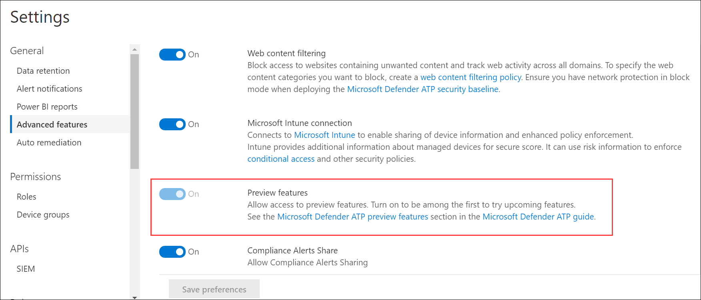

# Attivare l'esperienza di anteprima in Microsoft Defender per EndpointTurn on the preview experience in Microsoft Defender for Endpoint

[!INCLUDE [Microsoft 365 Defender rebranding](../../includes/microsoft-defender.md)]

**Si applica a:****Applies to:**
- [Microsoft Defender per endpointMicrosoft Defender for Endpoint](https://go.microsoft.com/fwlink/p/?linkid=2154037)
- [Microsoft 365 DefenderMicrosoft 365 Defender](https://go.microsoft.com/fwlink/?linkid=2118804)

>Vuoi provare Defender per Endpoint?Want to experience Defender for Endpoint? [Iscriversi per una versione di valutazione gratuita.Sign up for a free trial.](https://www.microsoft.com/microsoft-365/windows/microsoft-defender-atp?ocid=docs-wdatp-previewsettings-abovefoldlink)

Attivare l'opzione esperienza di anteprima per essere tra i primi a provare le funzionalità che saranno introdotte.Turn on the preview experience setting to be among the first to try upcoming features.

1. Nel riquadro di spostamento selezionare **Impostazioni**  >  **Funzionalità avanzate**.In the navigation pane, select **Settings** > **Advanced features**.

    

2. Attiva o disattiva **l'impostazione** **e** seleziona Salva **preferenze.**Toggle the setting between **On** and **Off** and select **Save preferences**.

## Argomenti correlatiRelated topics
- [Aggiornare le impostazioni generali in Microsoft Defender for EndpointUpdate general settings in Microsoft Defender for Endpoint](data-retention-settings.md)
- [Attivare le funzionalità avanzate in Microsoft Defender per EndpointTurn on advanced features in Microsoft Defender for Endpoint](advanced-features.md)
- [Configurare le notifiche di posta elettronica in Microsoft Defender per EndpointConfigure email notifications in Microsoft Defender for Endpoint](configure-email-notifications.md)
- [Abilitare l'integrazione SIEM in Microsoft Defender for EndpointEnable SIEM integration in Microsoft Defender for Endpoint](enable-siem-integration.md)

