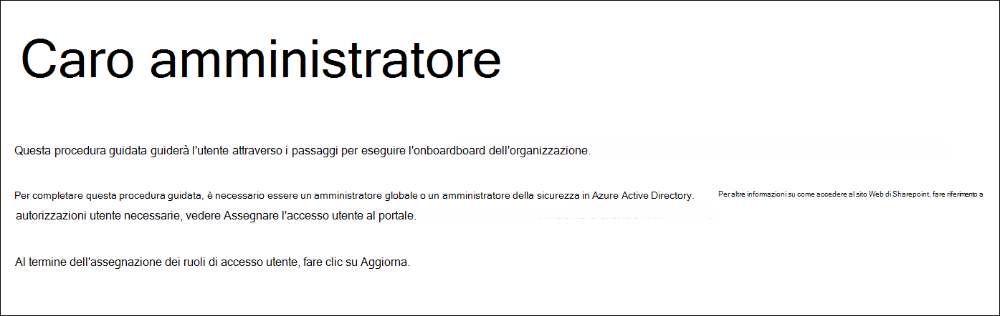
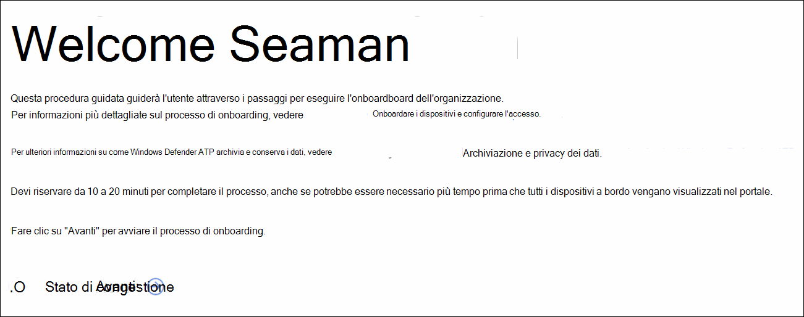
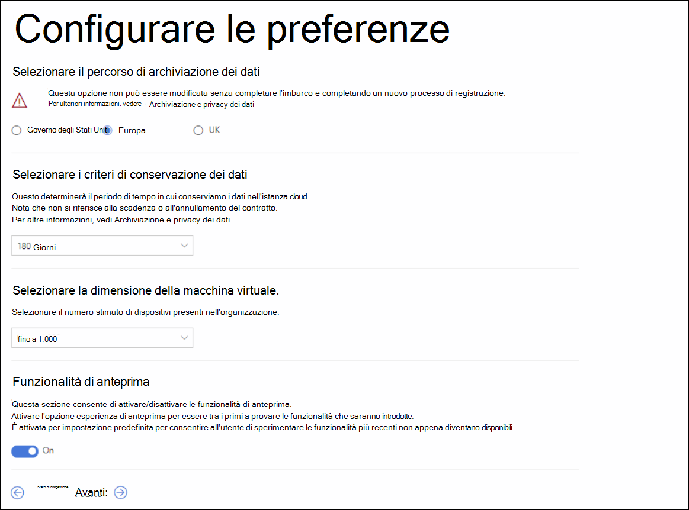
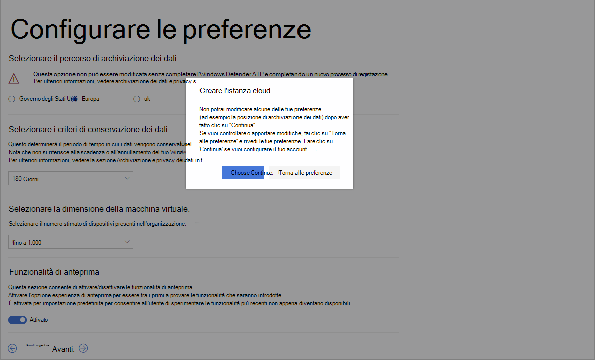

# <a name="set-up-microsoft-defender-for-endpoint-deployment"></a><span data-ttu-id="30424-104">Configurare Microsoft Defender per la distribuzione degli endpoint</span><span class="sxs-lookup"><span data-stu-id="30424-104">Set up Microsoft Defender for Endpoint deployment</span></span>

[!INCLUDE [Microsoft 365 Defender rebranding](../../includes/microsoft-defender.md)]


<span data-ttu-id="30424-105">**Si applica a:**</span><span class="sxs-lookup"><span data-stu-id="30424-105">**Applies to:**</span></span>
- [<span data-ttu-id="30424-106">Microsoft Defender per endpoint</span><span class="sxs-lookup"><span data-stu-id="30424-106">Microsoft Defender for Endpoint</span></span>](https://go.microsoft.com/fwlink/p/?linkid=2154037)
- [<span data-ttu-id="30424-107">Microsoft 365 Defender</span><span class="sxs-lookup"><span data-stu-id="30424-107">Microsoft 365 Defender</span></span>](https://go.microsoft.com/fwlink/?linkid=2118804)

> <span data-ttu-id="30424-108">Vuoi provare Microsoft Defender per Endpoint?</span><span class="sxs-lookup"><span data-stu-id="30424-108">Want to experience Microsoft Defender for Endpoint?</span></span> [<span data-ttu-id="30424-109">Iscriversi per una versione di valutazione gratuita.</span><span class="sxs-lookup"><span data-stu-id="30424-109">Sign up for a free trial.</span></span>](https://www.microsoft.com/microsoft-365/windows/microsoft-defender-atp?ocid=docs-wdatp-exposedapis-abovefoldlink)

<span data-ttu-id="30424-110">La distribuzione di Defender per Endpoint è un processo in tre fasi:</span><span class="sxs-lookup"><span data-stu-id="30424-110">Deploying Defender for Endpoint is a three-phase process:</span></span>

| <span data-ttu-id="30424-111">[](prepare-deployment.md)</span><span class="sxs-lookup"><span data-stu-id="30424-111">[](prepare-deployment.md)</span></span><br>[<span data-ttu-id="30424-112">Fase 1: preparare</span><span class="sxs-lookup"><span data-stu-id="30424-112">Phase 1: Prepare</span></span>](prepare-deployment.md) | <br><span data-ttu-id="30424-114">Fase 2: installazione</span><span class="sxs-lookup"><span data-stu-id="30424-114">Phase 2: Setup</span></span> | <span data-ttu-id="30424-115">[](onboarding.md)</span><span class="sxs-lookup"><span data-stu-id="30424-115">[](onboarding.md)</span></span><br>[<span data-ttu-id="30424-116">Fase 3: onboard</span><span class="sxs-lookup"><span data-stu-id="30424-116">Phase 3: Onboard</span></span>](onboarding.md) |
| ----- | ----- | ----- |
| | <span data-ttu-id="30424-117">*Sei qui!*</span><span class="sxs-lookup"><span data-stu-id="30424-117">*You are here!*</span></span>||

<span data-ttu-id="30424-118">Si è attualmente in fase di configurazione.</span><span class="sxs-lookup"><span data-stu-id="30424-118">You are currently in the set-up phase.</span></span>

<span data-ttu-id="30424-119">In questo scenario di distribuzione verrà illustrata la procedura seguente:</span><span class="sxs-lookup"><span data-stu-id="30424-119">In this deployment scenario, you'll be guided through the steps on:</span></span>
- <span data-ttu-id="30424-120">Convalida delle licenze</span><span class="sxs-lookup"><span data-stu-id="30424-120">Licensing validation</span></span>
- <span data-ttu-id="30424-121">Configurazione tenant</span><span class="sxs-lookup"><span data-stu-id="30424-121">Tenant configuration</span></span>
- <span data-ttu-id="30424-122">Configurazione di rete</span><span class="sxs-lookup"><span data-stu-id="30424-122">Network configuration</span></span>


>[!NOTE]
><span data-ttu-id="30424-123">Allo scopo di guidare l'utente attraverso una distribuzione tipica, questo scenario copre solo l'uso di Microsoft Endpoint Configuration Manager.</span><span class="sxs-lookup"><span data-stu-id="30424-123">For the purpose of guiding you through a typical deployment, this scenario will only cover the use of Microsoft Endpoint Configuration Manager.</span></span> <span data-ttu-id="30424-124">Defender for Endpoint supporta l'uso di altri strumenti di onboarding, ma non copre questi scenari nella guida alla distribuzione.</span><span class="sxs-lookup"><span data-stu-id="30424-124">Defender for Endpoint supports the use of other onboarding tools but will not cover those scenarios in the deployment guide.</span></span> <span data-ttu-id="30424-125">Per altre informazioni, vedi [Onboard di dispositivi a Microsoft Defender per Endpoint.](onboard-configure.md)</span><span class="sxs-lookup"><span data-stu-id="30424-125">For more information, see [Onboard devices to Microsoft Defender for Endpoint](onboard-configure.md).</span></span>

## <a name="check-license-state"></a><span data-ttu-id="30424-126">Controllare lo stato della licenza</span><span class="sxs-lookup"><span data-stu-id="30424-126">Check license state</span></span>

<span data-ttu-id="30424-127">Il controllo dello stato della licenza e del provisioning corretto può essere eseguito tramite l'interfaccia di amministrazione o il portale **di Microsoft Azure.**</span><span class="sxs-lookup"><span data-stu-id="30424-127">Checking for the license state and whether it got properly provisioned, can be done through the admin center or through the **Microsoft Azure portal**.</span></span>

1. <span data-ttu-id="30424-128">Per visualizzare le licenze, accedere al portale **di Microsoft Azure** e passare alla sezione Relativa alle licenze del portale di Microsoft [Azure.](https://portal.azure.com/#blade/Microsoft_AAD_IAM/LicensesMenuBlade/Products)</span><span class="sxs-lookup"><span data-stu-id="30424-128">To view your licenses, go to the **Microsoft Azure portal** and navigate to the [Microsoft Azure portal license section](https://portal.azure.com/#blade/Microsoft_AAD_IAM/LicensesMenuBlade/Products).</span></span>

   

1. <span data-ttu-id="30424-130">In alternativa, nell'interfaccia di amministrazione passare a **Fatturazione**  >  **Abbonamenti.**</span><span class="sxs-lookup"><span data-stu-id="30424-130">Alternately, in the admin center, navigate to **Billing** > **Subscriptions**.</span></span>

    <span data-ttu-id="30424-131">Sullo schermo verranno visualizzate tutte le licenze di cui è stato eseguito il provisioning e il relativo **stato corrente.**</span><span class="sxs-lookup"><span data-stu-id="30424-131">On the screen, you will see all the provisioned licenses and their current **Status**.</span></span>

    


## <a name="cloud-service-provider-validation"></a><span data-ttu-id="30424-133">Convalida del provider di servizi cloud</span><span class="sxs-lookup"><span data-stu-id="30424-133">Cloud Service Provider validation</span></span>

<span data-ttu-id="30424-134">Per ottenere l'accesso alle licenze di cui viene eseguito il provisioning per l'azienda e per controllare lo stato delle licenze, passare all'interfaccia di amministrazione.</span><span class="sxs-lookup"><span data-stu-id="30424-134">To gain access into which licenses are provisioned to your company, and to check the state of the licenses, go to the admin center.</span></span>

1. <span data-ttu-id="30424-135">Nel **portale per i partner** selezionare **Amministra servizi > Office 365**.</span><span class="sxs-lookup"><span data-stu-id="30424-135">From the **Partner portal**, select **Administer services > Office 365**.</span></span>

2. <span data-ttu-id="30424-136">Facendo clic sul **collegamento Portale per i** partner verrà aperta l'opzione Amministratore per conto **di** e si avrà accesso all'interfaccia di amministrazione del cliente.</span><span class="sxs-lookup"><span data-stu-id="30424-136">Clicking on the **Partner portal** link will open the **Admin on behalf** option and will give you access to the customer admin center.</span></span>

   


## <a name="tenant-configuration"></a><span data-ttu-id="30424-138">Configurazione tenant</span><span class="sxs-lookup"><span data-stu-id="30424-138">Tenant Configuration</span></span>

<span data-ttu-id="30424-139">Quando accedi a Microsoft Defender Security Center per la prima volta, una procedura guidata che ti guiderà attraverso alcuni passaggi iniziali.</span><span class="sxs-lookup"><span data-stu-id="30424-139">When accessing Microsoft Defender Security Center for the first time, a wizard that will guide you through some initial steps.</span></span> <span data-ttu-id="30424-140">Al termine della configurazione guidata, verrà creata un'istanza cloud dedicata di Defender per Endpoint.</span><span class="sxs-lookup"><span data-stu-id="30424-140">At the end of the setup wizard, there will be a dedicated cloud instance of Defender for Endpoint created.</span></span> <span data-ttu-id="30424-141">Il metodo più semplice è eseguire questi passaggi da un dispositivo client Windows 10.</span><span class="sxs-lookup"><span data-stu-id="30424-141">The easiest method is to perform these steps from a Windows 10 client device.</span></span>

1. <span data-ttu-id="30424-142">Da un Web browser passare a <https://securitycenter.windows.com> .</span><span class="sxs-lookup"><span data-stu-id="30424-142">From a web browser, navigate to <https://securitycenter.windows.com>.</span></span>

    

2. <span data-ttu-id="30424-144">Se si passa a una licenza trial, passare al collegamento ( <https://signup.microsoft.com/Signup?OfferId=6033e4b5-c320-4008-a936-909c2825d83c&dl=WIN_DEF_ATP&pc=xxxxxxx-xxxxxx-xxx-x> )</span><span class="sxs-lookup"><span data-stu-id="30424-144">If going through a TRIAL license, go to the link (<https://signup.microsoft.com/Signup?OfferId=6033e4b5-c320-4008-a936-909c2825d83c&dl=WIN_DEF_ATP&pc=xxxxxxx-xxxxxx-xxx-x>)</span></span>

    <span data-ttu-id="30424-145">Una volta completato il passaggio di autorizzazione, **verrà** visualizzata la schermata iniziale.</span><span class="sxs-lookup"><span data-stu-id="30424-145">Once the authorization step is completed, the **Welcome** screen will be displayed.</span></span>
3. <span data-ttu-id="30424-146">Eseguire i passaggi di autorizzazione.</span><span class="sxs-lookup"><span data-stu-id="30424-146">Go through the authorization steps.</span></span>

    

4. <span data-ttu-id="30424-148">Configurare le preferenze.</span><span class="sxs-lookup"><span data-stu-id="30424-148">Set up preferences.</span></span>

   <span data-ttu-id="30424-149">**Posizione di archiviazione dei** dati: è importante configurarla correttamente.</span><span class="sxs-lookup"><span data-stu-id="30424-149">**Data storage location** - It's important to set this up correctly.</span></span> <span data-ttu-id="30424-150">Determinare dove il cliente vuole essere ospitato principalmente: Stati Uniti, Ue o Regno Unito.</span><span class="sxs-lookup"><span data-stu-id="30424-150">Determine where the customer wants to be primarily hosted: US, EU, or UK.</span></span> <span data-ttu-id="30424-151">Non è possibile modificare la posizione dopo questa configurazione e Microsoft non trasferirà i dati dalla georilevazione specificata.</span><span class="sxs-lookup"><span data-stu-id="30424-151">You cannot change the location after this set up and Microsoft will not transfer the data from the specified geolocation.</span></span> 

    <span data-ttu-id="30424-152">**Conservazione dei dati:** il valore predefinito è sei mesi.</span><span class="sxs-lookup"><span data-stu-id="30424-152">**Data retention** - The default is six months.</span></span>

    <span data-ttu-id="30424-153">**Abilita funzionalità di anteprima:** l'impostazione predefinita è attivata e può essere modificata in un secondo momento.</span><span class="sxs-lookup"><span data-stu-id="30424-153">**Enable preview features** - The default is on, can be changed later.</span></span>

    

5. <span data-ttu-id="30424-155">Selezionare **Avanti**.</span><span class="sxs-lookup"><span data-stu-id="30424-155">Select **Next**.</span></span>

     

6. <span data-ttu-id="30424-157">Selezionare **Continua.**</span><span class="sxs-lookup"><span data-stu-id="30424-157">Select **Continue**.</span></span>


## <a name="network-configuration"></a><span data-ttu-id="30424-158">Configurazione di rete</span><span class="sxs-lookup"><span data-stu-id="30424-158">Network configuration</span></span>
<span data-ttu-id="30424-159">Se l'organizzazione non richiede agli endpoint di utilizzare un proxy per accedere a Internet, ignorare questa sezione.</span><span class="sxs-lookup"><span data-stu-id="30424-159">If the organization does not require the endpoints to use a Proxy to access the Internet, skip this section.</span></span>

<span data-ttu-id="30424-160">Il sensore Microsoft Defender per endpoint richiede che Microsoft Windows HTTP (WinHTTP) segnali dati dei sensori e comunichi con il servizio Microsoft Defender per endpoint.</span><span class="sxs-lookup"><span data-stu-id="30424-160">The Microsoft Defender for Endpoint sensor requires Microsoft Windows HTTP (WinHTTP) to report sensor data and communicate with the Microsoft Defender for Endpoint service.</span></span> <span data-ttu-id="30424-161">Il sensore incorporato di Microsoft Defender for Endpoint viene eseguito nel contesto di sistema usando l'account LocalSystem.</span><span class="sxs-lookup"><span data-stu-id="30424-161">The embedded Microsoft Defender for Endpoint sensor runs in the system context using the LocalSystem account.</span></span> <span data-ttu-id="30424-162">Il sensore usa i servizi HTTP di Microsoft Windows (WinHTTP) per abilitare le comunicazioni con il servizio cloud Microsoft Defender per endpoint.</span><span class="sxs-lookup"><span data-stu-id="30424-162">The sensor uses Microsoft Windows HTTP Services (WinHTTP) to enable communication with the Microsoft Defender for Endpoint cloud service.</span></span> <span data-ttu-id="30424-163">L'impostazione di configurazione WinHTTP è indipendente dalle impostazioni del proxy di esplorazione Internet di Windows (WinINet) e può individuare un server proxy solo utilizzando i metodi di individuazione seguenti:</span><span class="sxs-lookup"><span data-stu-id="30424-163">The WinHTTP configuration setting is independent of the Windows Internet (WinINet) internet browsing proxy settings and can only discover a proxy server by using the following discovery methods:</span></span>

<span data-ttu-id="30424-164">**Metodi di individuazione automatica:**</span><span class="sxs-lookup"><span data-stu-id="30424-164">**Autodiscovery methods:**</span></span>

-   <span data-ttu-id="30424-165">Proxy trasparente</span><span class="sxs-lookup"><span data-stu-id="30424-165">Transparent proxy</span></span>

-   <span data-ttu-id="30424-166">WPAD (Web Proxy Autodiscovery Protocol)</span><span class="sxs-lookup"><span data-stu-id="30424-166">Web Proxy Autodiscovery Protocol (WPAD)</span></span>

<span data-ttu-id="30424-167">Se nella topologia di rete è stato implementato un proxy Trasparente o WPAD, non è necessario disporre di impostazioni di configurazione speciali.</span><span class="sxs-lookup"><span data-stu-id="30424-167">If a Transparent proxy or WPAD has been implemented in the network topology, there is no need for special configuration settings.</span></span> <span data-ttu-id="30424-168">Per ulteriori informazioni sulle esclusioni di URL di Microsoft Defender for Endpoint nel proxy, vedi la sezione Appendice in questo documento per l'elenco url consentiti o in [Documenti Microsoft.](https://docs.microsoft.com/windows/security/threat-protection/windows-defender-atp/configure-proxy-internet-windows-defender-advanced-threat-protection#enable-access-to-windows-defender-atp-service-urls-in-the-proxy-server)</span><span class="sxs-lookup"><span data-stu-id="30424-168">For more information on Microsoft Defender for Endpoint URL exclusions in the proxy, see the Appendix section in this document for the URLs allow list or on [Microsoft Docs](https://docs.microsoft.com/windows/security/threat-protection/windows-defender-atp/configure-proxy-internet-windows-defender-advanced-threat-protection#enable-access-to-windows-defender-atp-service-urls-in-the-proxy-server).</span></span>

> [!NOTE]
> <span data-ttu-id="30424-169">Per un elenco dettagliato degli URL che devono essere consentiti, vedere [questo articolo](https://docs.microsoft.com/windows/security/threat-protection/microsoft-defender-antivirus/configure-network-connections-microsoft-defender-antivirus).</span><span class="sxs-lookup"><span data-stu-id="30424-169">For a detailed list of URLs that need to be allowed, please see [this article](https://docs.microsoft.com/windows/security/threat-protection/microsoft-defender-antivirus/configure-network-connections-microsoft-defender-antivirus).</span></span>

<span data-ttu-id="30424-170">**Configurazione manuale del proxy statico:**</span><span class="sxs-lookup"><span data-stu-id="30424-170">**Manual static proxy configuration:**</span></span>

-   <span data-ttu-id="30424-171">Configurazione basata sul Registro di sistema</span><span class="sxs-lookup"><span data-stu-id="30424-171">Registry-based configuration</span></span>

-   <span data-ttu-id="30424-172">WinHTTP configurato con il comando netsh</span><span class="sxs-lookup"><span data-stu-id="30424-172">WinHTTP configured using netsh command</span></span> <br> <span data-ttu-id="30424-173">Adatto solo per i desktop in una topologia stabile (ad esempio, un desktop in una rete aziendale dietro lo stesso proxy)</span><span class="sxs-lookup"><span data-stu-id="30424-173">Suitable only for desktops in a stable topology (for example: a desktop in a corporate network behind the same proxy)</span></span>

### <a name="configure-the-proxy-server-manually-using-a-registry-based-static-proxy"></a><span data-ttu-id="30424-174">Configurare manualmente il server proxy con un proxy statico basato sul registro</span><span class="sxs-lookup"><span data-stu-id="30424-174">Configure the proxy server manually using a registry-based static proxy</span></span>

<span data-ttu-id="30424-175">Configurare un proxy statico basato sul Registro di sistema per consentire solo al sensore Microsoft Defender for Endpoint di segnalare i dati di diagnostica e comunicare con Microsoft Defender per i servizi endpoint se un computer non è autorizzato a connettersi a Internet.</span><span class="sxs-lookup"><span data-stu-id="30424-175">Configure a registry-based static proxy to allow only Microsoft Defender for Endpoint sensor to report diagnostic data and communicate with Microsoft Defender for Endpoint services if a computer is not permitted to connect to the Internet.</span></span> <span data-ttu-id="30424-176">Il proxy statico è configurabile tramite Criteri di gruppo.</span><span class="sxs-lookup"><span data-stu-id="30424-176">The static proxy is configurable through Group Policy (GP).</span></span> <span data-ttu-id="30424-177">I criteri di gruppo sono disponibili in:</span><span class="sxs-lookup"><span data-stu-id="30424-177">The group policy can be found under:</span></span>

 - <span data-ttu-id="30424-178">Modelli amministrativi Raccolte dati e anteprime componenti di Windows Configurare l'utilizzo del proxy autenticato per il servizio Esperienza \> \> utente \> connessa e telemetria</span><span class="sxs-lookup"><span data-stu-id="30424-178">Administrative Templates \> Windows Components \> Data Collection and Preview Builds \> Configure Authenticated Proxy usage for the Connected User Experience and Telemetry Service</span></span>
     - <span data-ttu-id="30424-179">Impostarlo su **Abilitato e** selezionare Disabilita utilizzo **proxy autenticato**</span><span class="sxs-lookup"><span data-stu-id="30424-179">Set it to **Enabled** and select **Disable Authenticated Proxy usage**</span></span>

1. <span data-ttu-id="30424-180">Aprire la console Gestione Criteri di gruppo.</span><span class="sxs-lookup"><span data-stu-id="30424-180">Open the Group Policy Management Console.</span></span>
2. <span data-ttu-id="30424-181">Creare un criterio o modificare un criterio esistente in base alle procedure dell'organizzazione.</span><span class="sxs-lookup"><span data-stu-id="30424-181">Create a policy or edit an existing policy based off the organizational practices.</span></span>
3. <span data-ttu-id="30424-182">Modificare i Criteri di gruppo e passare a Modelli amministrativi Raccolta dati componenti di Windows e Build di anteprima Configurare l'utilizzo del proxy autenticato per il servizio Esperienza **\> utente \> \> connessa e telemetria**.</span><span class="sxs-lookup"><span data-stu-id="30424-182">Edit the Group Policy and navigate to **Administrative Templates \> Windows Components \> Data Collection and Preview Builds \> Configure Authenticated Proxy usage for the Connected User Experience and Telemetry Service**.</span></span> 
    <span data-ttu-id="30424-183"></span><span class="sxs-lookup"><span data-stu-id="30424-183"></span></span>

4. <span data-ttu-id="30424-184">Selezionare **Abilitato**.</span><span class="sxs-lookup"><span data-stu-id="30424-184">Select **Enabled**.</span></span>
5. <span data-ttu-id="30424-185">Selezionare **Disabilita utilizzo proxy autenticato**.</span><span class="sxs-lookup"><span data-stu-id="30424-185">Select **Disable Authenticated Proxy usage**.</span></span>
   
6. <span data-ttu-id="30424-186">Passare a **Modelli amministrativi Raccolta dati componenti di Windows e \> \> Anteprime Build Configura esperienze utente connesse \> e telemetria.**</span><span class="sxs-lookup"><span data-stu-id="30424-186">Navigate to **Administrative Templates \> Windows Components \> Data Collection and Preview Builds \> Configure connected user experiences and telemetry**.</span></span>
    <span data-ttu-id="30424-187"></span><span class="sxs-lookup"><span data-stu-id="30424-187"></span></span>
7. <span data-ttu-id="30424-188">Selezionare **Abilitato**.</span><span class="sxs-lookup"><span data-stu-id="30424-188">Select **Enabled**.</span></span>
8. <span data-ttu-id="30424-189">Immettere il **nome del server proxy**.</span><span class="sxs-lookup"><span data-stu-id="30424-189">Enter the **Proxy Server Name**.</span></span>

<span data-ttu-id="30424-190">Il criterio imposta due valori di registro`TelemetryProxyServer` come REG_SZ e `DisableEnterpriseAuthProxy` REG_DWORD nella chiave di registro`HKLM\Software\Policies\Microsoft\Windows\DataCollection`.</span><span class="sxs-lookup"><span data-stu-id="30424-190">The policy sets two registry values `TelemetryProxyServer` as REG_SZ and `DisableEnterpriseAuthProxy` as REG_DWORD under the registry key `HKLM\Software\Policies\Microsoft\Windows\DataCollection`.</span></span>

<span data-ttu-id="30424-191">Il valore del Registro `TelemetryProxyServer` di sistema assume il formato stringa seguente:</span><span class="sxs-lookup"><span data-stu-id="30424-191">The registry value `TelemetryProxyServer` takes the following string format:</span></span>

```text
<server name or ip>:<port>
```

<span data-ttu-id="30424-192">Ad esempio: 10.0.0.6:8080</span><span class="sxs-lookup"><span data-stu-id="30424-192">For example: 10.0.0.6:8080</span></span>

<span data-ttu-id="30424-193">Il valore del registro `DisableEnterpriseAuthProxy` deve essere impostato su 1.</span><span class="sxs-lookup"><span data-stu-id="30424-193">The registry value `DisableEnterpriseAuthProxy` should be set to 1.</span></span>

###  <a name="configure-the-proxy-server-manually-using-netsh-command"></a><span data-ttu-id="30424-194">Configurare manualmente il server proxy utilizzando il comando netsh</span><span class="sxs-lookup"><span data-stu-id="30424-194">Configure the proxy server manually using netsh command</span></span>

<span data-ttu-id="30424-195">Usare netsh per configurare un proxy statico a livello di sistema.</span><span class="sxs-lookup"><span data-stu-id="30424-195">Use netsh to configure a system-wide static proxy.</span></span>

> [!NOTE]
> - <span data-ttu-id="30424-196">Questa operazione avrà effetto su tutte le applicazioni, inclusi i servizi di Windows che usano WinHTTP con proxy predefinito.</span><span class="sxs-lookup"><span data-stu-id="30424-196">This will affect all applications including Windows services which use WinHTTP with default proxy.</span></span></br>
> - <span data-ttu-id="30424-197">I portatili che cambiano topologia (ad esempio, da ufficio a casa) non funzionano correttamente con netsh.</span><span class="sxs-lookup"><span data-stu-id="30424-197">Laptops that are changing topology (for example: from office to home) will malfunction with netsh.</span></span> <span data-ttu-id="30424-198">È consigliabile usare la configurazione del proxy statico basata sul registro.</span><span class="sxs-lookup"><span data-stu-id="30424-198">Use the registry-based static proxy configuration.</span></span>

1. <span data-ttu-id="30424-199">Aprire una riga di comando con privilegi elevati:</span><span class="sxs-lookup"><span data-stu-id="30424-199">Open an elevated command line:</span></span>

    1. <span data-ttu-id="30424-200">Passare a **Start** e digitare **cmd**.</span><span class="sxs-lookup"><span data-stu-id="30424-200">Go to **Start** and type **cmd**.</span></span>

    1. <span data-ttu-id="30424-201">Fare clic con il pulsante destro del mouse su **Prompt dei comandi** e scegliere **Esegui come amministratore**.</span><span class="sxs-lookup"><span data-stu-id="30424-201">Right-click **Command prompt** and select **Run as administrator**.</span></span>

2. <span data-ttu-id="30424-202">Immettere il comando indicato di seguito e premere **INVIO**:</span><span class="sxs-lookup"><span data-stu-id="30424-202">Enter the following command and press **Enter**:</span></span>

   ```PowerShell
   netsh winhttp set proxy <proxy>:<port>
   ```

   <span data-ttu-id="30424-203">Ad esempio: netsh winhttp set proxy 10.0.0.6:8080</span><span class="sxs-lookup"><span data-stu-id="30424-203">For example: netsh winhttp set proxy 10.0.0.6:8080</span></span>


###  <a name="proxy-configuration-for-down-level-devices"></a><span data-ttu-id="30424-204">Configurazione proxy per i dispositivi di livello inferiore</span><span class="sxs-lookup"><span data-stu-id="30424-204">Proxy Configuration for down-level devices</span></span>

<span data-ttu-id="30424-205">I dispositivi Down-Level includono workstation Windows 7 SP1 e Windows 8.1, nonché Windows Server 2008 R2, Windows Server 2012, Windows Server 2012 R2 e versioni di Windows Server 2016 precedenti a Windows Server CB 1803.</span><span class="sxs-lookup"><span data-stu-id="30424-205">Down-Level devices include Windows 7 SP1 and Windows 8.1 workstations as well as Windows Server 2008 R2, Windows Server 2012, Windows Server 2012 R2, and versions of Windows Server 2016 prior to Windows Server CB 1803.</span></span> <span data-ttu-id="30424-206">Questi sistemi operativi avranno il proxy configurato come parte di Microsoft Management Agent per gestire le comunicazioni dall'endpoint ad Azure.</span><span class="sxs-lookup"><span data-stu-id="30424-206">These operating systems will have the proxy configured as part of the Microsoft Management Agent to handle communication from the endpoint to Azure.</span></span> <span data-ttu-id="30424-207">Per informazioni sulla configurazione di un proxy in questi dispositivi, fare riferimento alla Guida alla distribuzione rapida di Microsoft Management Agent.</span><span class="sxs-lookup"><span data-stu-id="30424-207">Refer to the Microsoft Management Agent Fast Deployment Guide for information on how a proxy is configured on these devices.</span></span>

### <a name="proxy-service-urls"></a><span data-ttu-id="30424-208">URL del servizio proxy</span><span class="sxs-lookup"><span data-stu-id="30424-208">Proxy Service URLs</span></span>
<span data-ttu-id="30424-209">Gli URL che includono v20 in essi sono necessari solo se hai dispositivi Windows 10 versione 1803 o successiva.</span><span class="sxs-lookup"><span data-stu-id="30424-209">URLs that include v20 in them are only needed if you have Windows 10, version 1803 or later devices.</span></span> <span data-ttu-id="30424-210">Ad esempio, ```us-v20.events.data.microsoft.com``` è necessario solo se il dispositivo è in Windows 10 versione 1803 o successiva.</span><span class="sxs-lookup"><span data-stu-id="30424-210">For example, ```us-v20.events.data.microsoft.com``` is only needed if the device is on Windows 10, version 1803 or later.</span></span>
 

<span data-ttu-id="30424-211">Se un proxy o un firewall blocca il traffico anonimo, poiché il sensore Microsoft Defender for Endpoint si connette dal contesto di sistema, assicurati che il traffico anonimo sia consentito negli URL elencati.</span><span class="sxs-lookup"><span data-stu-id="30424-211">If a proxy or firewall is blocking anonymous traffic, as Microsoft Defender for Endpoint sensor is connecting from system context, make sure anonymous traffic is permitted in the listed URLs.</span></span>

<span data-ttu-id="30424-212">Nel seguente foglio di calcolo scaricabile sono elencati i servizi e gli URL associati a cui la rete deve essere in grado di connettersi.</span><span class="sxs-lookup"><span data-stu-id="30424-212">The following downloadable spreadsheet lists the services and their associated URLs that your network must be able to connect to.</span></span> <span data-ttu-id="30424-213">Verificare che non siano presenti regole di filtro firewall o di rete che negherebbero l'accesso *a* questi URL oppure potrebbe essere necessario creare una regola di autorizzazione specifica per tali URL.</span><span class="sxs-lookup"><span data-stu-id="30424-213">Ensure that there are no firewall or network filtering rules that would deny access to these URLs, or you may need to create an *allow* rule specifically for them.</span></span>

|<span data-ttu-id="30424-214">**Foglio di calcolo dell'elenco dei domini**</span><span class="sxs-lookup"><span data-stu-id="30424-214">**Spreadsheet of domains list**</span></span>|<span data-ttu-id="30424-215">**Descrizione**</span><span class="sxs-lookup"><span data-stu-id="30424-215">**Description**</span></span>|
|:-----|:-----|
|<br/>  | <span data-ttu-id="30424-217">Foglio di calcolo di record DNS specifici per le posizioni dei servizi, le posizioni geografiche e il sistema operativo.</span><span class="sxs-lookup"><span data-stu-id="30424-217">Spreadsheet of specific DNS records for service locations, geographic locations, and OS.</span></span> <br><br>[<span data-ttu-id="30424-218">Scaricare il foglio di calcolo qui.</span><span class="sxs-lookup"><span data-stu-id="30424-218">Download the spreadsheet here.</span></span>](https://download.microsoft.com/download/8/a/5/8a51eee5-cd02-431c-9d78-a58b7f77c070/mde-urls.xlsx) 


###  <a name="microsoft-defender-for-endpoint-service-backend-ip-range"></a><span data-ttu-id="30424-219">Intervallo IP back-end del servizio Microsoft Defender for Endpoint</span><span class="sxs-lookup"><span data-stu-id="30424-219">Microsoft Defender for Endpoint service backend IP range</span></span>

<span data-ttu-id="30424-220">Se i dispositivi di rete non supportano gli URL elencati nella sezione precedente, puoi usare le informazioni seguenti.</span><span class="sxs-lookup"><span data-stu-id="30424-220">If you network devices don't support the URLs listed in the prior section, you can use the following information.</span></span>

<span data-ttu-id="30424-221">Defender for Endpoint si basa sul cloud di Azure, distribuito nelle aree geografiche seguenti:</span><span class="sxs-lookup"><span data-stu-id="30424-221">Defender for Endpoint is built on Azure cloud, deployed in the following regions:</span></span>

- \+\<Region Name="uswestcentral">
- \+\<Region Name="useast2">
- \+\<Region Name="useast">
- \+\<Region Name="europenorth">
- \+\<Region Name="europewest">
- \+\<Region Name="uksouth">
- \+\<Region Name="ukwest">

<span data-ttu-id="30424-222">È possibile trovare l'intervallo IP di Azure in [Microsoft Azure Datacenter IP Ranges](https://www.microsoft.com/en-us/download/details.aspx?id=41653).</span><span class="sxs-lookup"><span data-stu-id="30424-222">You can find the Azure IP range on [Microsoft Azure Datacenter IP Ranges](https://www.microsoft.com/en-us/download/details.aspx?id=41653).</span></span>

> [!NOTE]
> <span data-ttu-id="30424-223">Come soluzione basata sul cloud, l'intervallo di indirizzi IP può cambiare.</span><span class="sxs-lookup"><span data-stu-id="30424-223">As a cloud-based solution, the IP address range can change.</span></span> <span data-ttu-id="30424-224">È consigliabile passare all'impostazione di risoluzione DNS.</span><span class="sxs-lookup"><span data-stu-id="30424-224">It's recommended you move to DNS resolving setting.</span></span>

## <a name="next-step"></a><span data-ttu-id="30424-225">Passaggio successivo</span><span class="sxs-lookup"><span data-stu-id="30424-225">Next step</span></span>

<span data-ttu-id="30424-226"></span><span class="sxs-lookup"><span data-stu-id="30424-226"></span></span> <br><span data-ttu-id="30424-227">[Fase 3: onboard: onboard](onboarding.md)dei dispositivi al servizio in modo che il servizio Microsoft Defender for Endpoint possa ottenere i dati del sensore da essi.</span><span class="sxs-lookup"><span data-stu-id="30424-227">[Phase 3: Onboard](onboarding.md): Onboard devices to the service so that the Microsoft Defender for Endpoint service can get sensor data from them.</span></span> 
