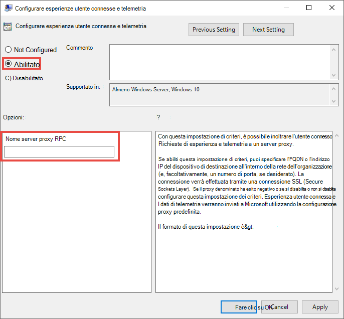

# <a name="set-up-microsoft-defender-for-endpoint-deployment"></a>Configurare Microsoft Defender per la distribuzione degli endpoint

[!INCLUDE [Microsoft 365 Defender rebranding](../../includes/microsoft-defender.md)]


**Si applica a:**
- [Microsoft Defender per endpoint](https://go.microsoft.com/fwlink/p/?linkid=2154037)
- [Microsoft 365 Defender](https://go.microsoft.com/fwlink/?linkid=2118804)

> Vuoi provare Microsoft Defender per Endpoint? [Iscriversi per una versione di valutazione gratuita.](https://www.microsoft.com/microsoft-365/windows/microsoft-defender-atp?ocid=docs-wdatp-exposedapis-abovefoldlink)

La distribuzione di Defender per Endpoint è un processo in tre fasi:

| [](prepare-deployment.md)<br>[Fase 1: preparazione](prepare-deployment.md) | <br>Fase 2: configurazione | [](onboarding.md)<br>[Fase 3: onboarding](onboarding.md) |
| ----- | ----- | ----- |
| | *Sei qui!*||

Si è attualmente in fase di configurazione.

In questo scenario di distribuzione verrà illustrata la procedura seguente:
- Convalida delle licenze
- Configurazione tenant
- Configurazione di rete


>[!NOTE]
>Allo scopo di guidare l'utente attraverso una distribuzione tipica, questo scenario copre solo l'uso di Microsoft Endpoint Configuration Manager. Defender for Endpoint supporta l'uso di altri strumenti di onboarding, ma non copre questi scenari nella guida alla distribuzione. Per altre informazioni, vedi [Onboard di dispositivi a Microsoft Defender per Endpoint.](onboard-configure.md)

## <a name="check-license-state"></a>Controllare lo stato della licenza

Il controllo dello stato della licenza e del provisioning corretto può essere eseguito tramite l'interfaccia di amministrazione o tramite il **portale Microsoft Azure .**

1. Per visualizzare le licenze, passare al **portale di Microsoft Azure** e passare alla Microsoft Azure licenza del [portale.](https://portal.azure.com/#blade/Microsoft_AAD_IAM/LicensesMenuBlade/Products)

   

1. In alternativa, nell'interfaccia di amministrazione passare a **Fatturazione**  >  **Abbonamenti.**

    Sullo schermo verranno visualizzate tutte le licenze di cui è stato eseguito il provisioning e il relativo **stato corrente.**

    


## <a name="cloud-service-provider-validation"></a>Convalida del provider di servizi cloud

Per ottenere l'accesso alle licenze di cui viene eseguito il provisioning per l'azienda e per controllare lo stato delle licenze, passare all'interfaccia di amministrazione.

1. Nel **portale per i partner** selezionare **Amministra servizi > Office 365**.

2. Facendo clic sul **collegamento Portale per i** partner verrà aperta l'opzione Amministratore per conto **di** e si avrà accesso all'interfaccia di amministrazione del cliente.

   


## <a name="tenant-configuration"></a>Configurazione tenant
L'onboarding in Microsoft Defender per Endpoint è facile. Dal menu di spostamento seleziona qualsiasi elemento nella sezione Endpoint o qualsiasi funzionalità di Microsoft 365 Defender, ad esempio Eventi imprevisti, Ricerca, Centro notifiche o Analisi delle minacce per avviare il processo di onboarding.

Da un Web browser passare al Centro [sicurezza Microsoft 365 sicurezza](https://security.microsoft.com).

## <a name="network-configuration"></a>Configurazione di rete
Se l'organizzazione non richiede agli endpoint di utilizzare un proxy per accedere a Internet, ignorare questa sezione.

Il sensore Microsoft Defender per endpoint richiede che Microsoft Windows HTTP (WinHTTP) segnali dati dei sensori e comunichi con il servizio Microsoft Defender per endpoint. Il sensore incorporato di Microsoft Defender for Endpoint viene eseguito nel contesto di sistema usando l'account LocalSystem. Il sensore usa i servizi HTTP di Microsoft Windows (WinHTTP) per abilitare le comunicazioni con il servizio cloud Microsoft Defender per endpoint. L'impostazione di configurazione WinHTTP è indipendente dalle impostazioni del proxy di esplorazione Internet di Windows Internet (WinINet) e può individuare un server proxy solo utilizzando i metodi di individuazione seguenti:

**Metodi di individuazione automatica:**

-   Proxy trasparente

-   WPAD (Web Proxy Autodiscovery Protocol)

Se nella topologia di rete è stato implementato un proxy Trasparente o WPAD, non è necessario disporre di impostazioni di configurazione speciali. Per ulteriori informazioni sulle esclusioni di URL di Microsoft Defender for Endpoint nel proxy, vedere la sezione URL del servizio [proxy](production-deployment.md#proxy-service-urls) in questo documento per l'elenco url consentiti o in Configurare le impostazioni di connettività Internet e [proxy del dispositivo.](configure-proxy-internet.md#enable-access-to-microsoft-defender-for-endpoint-service-urls-in-the-proxy-server)

**Configurazione manuale del proxy statico:**

-   Configurazione basata sul registro

-   WinHTTP configurato con il comando netsh <br> Adatto solo per i desktop in una topologia stabile (ad esempio, un desktop in una rete aziendale dietro lo stesso proxy)

### <a name="configure-the-proxy-server-manually-using-a-registry-based-static-proxy"></a>Configurare manualmente il server proxy con un proxy statico basato sul registro

Configurare un proxy statico basato sul Registro di sistema per consentire solo al sensore Microsoft Defender for Endpoint di segnalare i dati di diagnostica e comunicare con Microsoft Defender per i servizi endpoint se un computer non è autorizzato a connettersi a Internet. Il proxy statico è configurabile tramite Criteri di gruppo. I criteri di gruppo sono disponibili in:

 - Modelli amministrativi Windows componenti di raccolta dati e build di anteprima Configurare l'utilizzo del proxy autenticato per il servizio Esperienza \> \> utente \> connessa e telemetria
     - Impostarlo su **Abilitato e** selezionare Disabilita utilizzo **proxy autenticato**

1. Avviare la Console Gestione Criteri di gruppo.
2. Creare un criterio o modificare un criterio esistente in base alle procedure dell'organizzazione.
3. Modificare i Criteri di gruppo e passare a Modelli amministrativi Windows componenti Raccolta dati e build di anteprima Configurare l'utilizzo del proxy autenticato per il servizio Esperienza utente **\> \> \> connessa** e telemetria . 
    

4. Selezionare **Abilitato**.
5. Selezionare **Disabilita utilizzo proxy autenticato**.
   
6. Passare a Modelli amministrativi Windows componenti Raccolta dati e Build di anteprima **Configurare esperienze utente connesse e \> \> \> telemetria.**
    
7. Selezionare **Abilitato**.
8. Immettere il **nome del server proxy**.

Il criterio imposta due valori di registro`TelemetryProxyServer` come REG_SZ e `DisableEnterpriseAuthProxy` REG_DWORD nella chiave di registro`HKLM\Software\Policies\Microsoft\Windows\DataCollection`.

Il valore del Registro `TelemetryProxyServer` di sistema assume il formato stringa seguente:

```text
<server name or ip>:<port>
```

Ad esempio: 10.0.0.6:8080

Il valore del registro `DisableEnterpriseAuthProxy` deve essere impostato su 1.

###  <a name="configure-the-proxy-server-manually-using-netsh-command"></a>Configurare manualmente il server proxy utilizzando il comando netsh

Usare netsh per configurare un proxy statico a livello di sistema.

> [!NOTE]
> - Questa operazione avrà effetto su tutte le applicazioni, inclusi i servizi di Windows che usano WinHTTP con proxy predefinito.</br>
> - I portatili che cambiano topologia (ad esempio, da ufficio a casa) non funzionano correttamente con netsh. È consigliabile usare la configurazione del proxy statico basata sul registro.

1. Aprire un prompt dei comandi con privilegi elevati:

    1. Passare a **Start** e digitare **cmd**.

    1. Fare clic con il pulsante destro del mouse su **Prompt dei comandi** e scegliere **Esegui come amministratore**.

2. Immettere il comando indicato di seguito e premere **INVIO**:

   ```PowerShell
   netsh winhttp set proxy <proxy>:<port>
   ```

   Ad esempio: netsh winhttp set proxy 10.0.0.6:8080


###  <a name="proxy-configuration-for-down-level-devices"></a>Configurazione proxy per i dispositivi di livello inferiore

i dispositivi Down-Level includono workstation Windows 7 SP1 e Windows 8.1, Windows Server 2008 R2, Windows Server 2012, Windows Server 2012 R2 e versioni di Windows Server 2016 precedenti a Windows Server CB 1803. Questi sistemi operativi avranno il proxy configurato come parte di Microsoft Management Agent per gestire le comunicazioni dall'endpoint ad Azure. Per informazioni sulla configurazione di un proxy in questi dispositivi, fare riferimento alla Guida alla distribuzione rapida di Microsoft Management Agent.

### <a name="proxy-service-urls"></a>URL del servizio proxy
Gli URL che includono v20 in essi sono necessari solo se hai dispositivi Windows 10 versione 1803 o successiva. Ad esempio, è necessario solo se il dispositivo è ```us-v20.events.data.microsoft.com``` Windows 10 versione 1803 o successiva.
 

Se un proxy o un firewall blocca il traffico anonimo, poiché il sensore Microsoft Defender for Endpoint si connette dal contesto di sistema, assicurati che il traffico anonimo sia consentito negli URL elencati.

Nel seguente foglio di calcolo scaricabile sono elencati i servizi e gli URL associati a cui la rete deve essere in grado di connettersi. Verificare che non siano presenti regole di filtro di rete o firewall che negherebbero l'accesso *a* questi URL oppure potrebbe essere necessario creare una regola di autorizzazione specifica per tali URL.

|**Foglio di calcolo dell'elenco dei domini**|**Descrizione**|
|:-----|:-----|
|<br/>  | Foglio di calcolo di record DNS specifici per le posizioni dei servizi, le posizioni geografiche e il sistema operativo. <br><br>[Scaricare il foglio di calcolo qui.](https://download.microsoft.com/download/8/a/5/8a51eee5-cd02-431c-9d78-a58b7f77c070/mde-urls.xlsx) 


###  <a name="microsoft-defender-for-endpoint-service-backend-ip-ranges"></a>Intervalli IP back-end di Microsoft Defender for Endpoint Service

Se i dispositivi di rete non supportano le regole basate su DNS, usa invece intervalli IP.

Defender for Endpoint è creato nel cloud di Azure, distribuito nelle aree geografiche seguenti:

- AzureCloud.eastus
- AzureCloud.eastus2
- AzureCloud.westcentralus
- AzureCloud.northeurope
- AzureCloud.westeurope
- AzureCloud.uksouth
- AzureCloud.ukwest

Gli intervalli IP di Azure sono disponibili in [Intervalli IP di Azure e tag di servizio - Cloud pubblico.](https://www.microsoft.com/download/details.aspx?id=56519)

> [!NOTE]
> Come soluzione basata sul cloud, gli intervalli di indirizzi IP possono cambiare. È consigliabile passare a regole basate su DNS.

> [!NOTE]
> If you are a US Government customer, please see the corresponding section in the [Defender for Endpoint for US Government](gov.md#service-backend-ip-ranges) page.

## <a name="next-step"></a>Passaggio successivo

 <br>[Fase 3: onboard: onboard](onboarding.md)dei dispositivi al servizio in modo che il servizio Microsoft Defender for Endpoint possa ottenere i dati del sensore da essi. 
