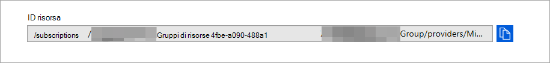

# <a name="configure-microsoft-defender-for-endpoint-to-stream-advanced-hunting-events-to-your-azure-event-hubs"></a>Configurare Microsoft Defender per Endpoint per trasmettere gli eventi di ricerca avanzata agli hub eventi di Azure

[!INCLUDE [Microsoft 365 Defender rebranding](../../includes/microsoft-defender.md)]


**Si applica a:**

- [Microsoft Defender per endpoint](https://go.microsoft.com/fwlink/?linkid=2154037)

> Vuoi provare Defender per Endpoint? [Iscriversi per una versione di valutazione gratuita.](https://www.microsoft.com/microsoft-365/windows/microsoft-defender-atp?ocid=docs-wdatp-configuresiem-abovefoldlink) 

## <a name="before-you-begin"></a>Prima di iniziare

1. Creare un [hub eventi](/azure/event-hubs/) nel tenant.

2. Accedere al [tenant di Azure,](https://ms.portal.azure.com/)passare a **Sottoscrizioni > La sottoscrizione > Provider di risorse > Registrarsi a **Microsoft.insights*****.

## <a name="enable-raw-data-streaming"></a>Abilitare lo streaming di dati non elaborati

1. Accedere al Microsoft Defender Security Center [come](https://securitycenter.windows.com) ***Amministratore** globale _ o _* Amministratore della _sicurezza_**.

2. Passare alla pagina [Impostazioni esportazione dati in](https://securitycenter.windows.com/interoperability/dataexport) Microsoft Defender Security Center.

3. Fare clic **su Aggiungi impostazioni di esportazione dati**.

4. Scegliere un nome per le nuove impostazioni.

5. Scegliere **Inoltra eventi a Hub eventi di Azure**.

6. Digitare il **nome degli hub eventi e** l'ID risorsa Hub **eventi**.

   Per ottenere **l'ID** risorsa Hub eventi, passare alla pagina dello spazio dei nomi Hub eventi di Azure nella scheda Proprietà di [Azure](https://ms.portal.azure.com/) > > copiare il testo in **ID risorsa**:

   

7. Scegli gli eventi che vuoi trasmettere e fai clic su **Salva.**

## <a name="the-schema-of-the-events-in-azure-event-hubs"></a>Schema degli eventi in Hub eventi di Azure

```
{
    "records": [
                    {
                        "time": "<The time WDATP received the event>"
                        "tenantId": "<The Id of the tenant that the event belongs to>"
                        "category": "<The Advanced Hunting table name with 'AdvancedHunting-' prefix>"
                        "properties": { <WDATP Advanced Hunting event as Json> }
                    }
                    ...
                ]
}
```

- Ogni messaggio dell'hub eventi in Hub eventi di Azure contiene un elenco di record.

- Ogni record contiene il nome dell'evento, l'ora in cui Microsoft Defender for Endpoint ha ricevuto l'evento, il tenant a cui appartiene (si otterrà solo gli eventi dal tenant) e l'evento in formato JSON in una proprietà denominata "**properties**".

- Per altre informazioni sullo schema degli eventi di Microsoft Defender for Endpoint, vedi [Panoramica di Advanced Hunting.](advanced-hunting-overview.md)

- In Ricerca avanzata, la **tabella DeviceInfo** contiene una colonna denominata **MachineGroup** che contiene il gruppo del dispositivo. Anche qui ogni evento verrà decorato con questa colonna. Per [altre informazioni, vedi Gruppi](machine-groups.md) di dispositivi.

## <a name="data-types-mapping"></a>Mapping dei tipi di dati

Per ottenere i tipi di dati per le proprietà dell'evento, eseguire le operazioni seguenti:

1. Accedi a [Microsoft Defender Security Center](https://securitycenter.windows.com) e vai alla [pagina Ricerca avanzata.](https://securitycenter.windows.com/hunting-package)

2. Eseguire la query seguente per ottenere il mapping dei tipi di dati per ogni evento:
 
   ```
   {EventType}
   | getschema
   | project ColumnName, ColumnType 
   ```

- Ecco un esempio di evento Info dispositivo: 

  

## <a name="related-topics"></a>Argomenti correlati
- [Panoramica della ricerca avanzata](advanced-hunting-overview.md)
- [Microsoft Defender for Endpoint streaming API](raw-data-export.md)
- [Trasmettere gli eventi di Microsoft Defender for Endpoint al tuo account di archiviazione di Azure](raw-data-export-storage.md)
- [Documentazione di Azure Event Hubs](/azure/event-hubs/)
- [Risolvere i problemi di connettività - Hub eventi di Azure](/azure/event-hubs/troubleshooting-guide)