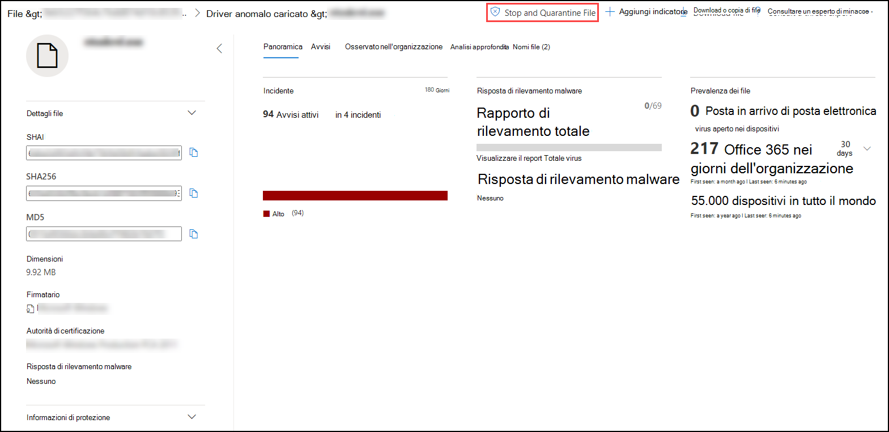
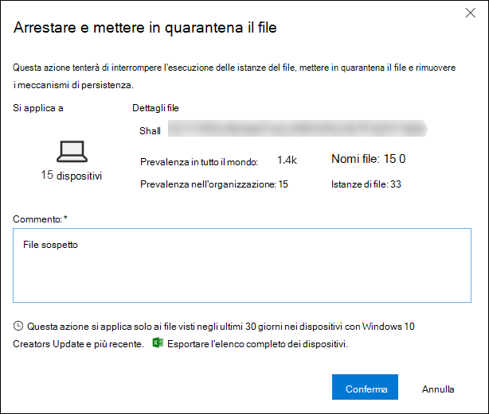
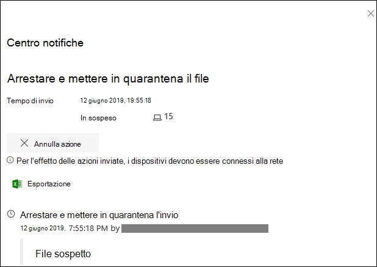
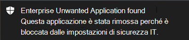

# <a name="take-response-actions-on-a-file"></a><span data-ttu-id="af6b9-104">Intraprendere azioni di risposta su un file</span><span class="sxs-lookup"><span data-stu-id="af6b9-104">Take response actions on a file</span></span>

[!INCLUDE [Microsoft 365 Defender rebranding](../../includes/microsoft-defender.md)]


<span data-ttu-id="af6b9-105">**Si applica a:**</span><span class="sxs-lookup"><span data-stu-id="af6b9-105">**Applies to:**</span></span>
- [<span data-ttu-id="af6b9-106">Microsoft Defender per endpoint</span><span class="sxs-lookup"><span data-stu-id="af6b9-106">Microsoft Defender for Endpoint</span></span>](https://go.microsoft.com/fwlink/?linkid=2154037)

[!include[Prerelease information](../../includes/prerelease.md)]

> <span data-ttu-id="af6b9-107">Vuoi provare Defender per Endpoint?</span><span class="sxs-lookup"><span data-stu-id="af6b9-107">Want to experience Defender for Endpoint?</span></span> [<span data-ttu-id="af6b9-108">Iscriversi per una versione di valutazione gratuita.</span><span class="sxs-lookup"><span data-stu-id="af6b9-108">Sign up for a free trial.</span></span>](https://www.microsoft.com/microsoft-365/windows/microsoft-defender-atp?ocid=docs-wdatp-responddile-abovefoldlink)

<span data-ttu-id="af6b9-109">Rispondere rapidamente agli attacchi rilevati arrestando e quarantinando i file o bloccando un file.</span><span class="sxs-lookup"><span data-stu-id="af6b9-109">Quickly respond to detected attacks by stopping and quarantining files or blocking a file.</span></span> <span data-ttu-id="af6b9-110">Dopo aver fatto un'azione sui file, puoi controllare i dettagli dell'attività nel centro notifiche.</span><span class="sxs-lookup"><span data-stu-id="af6b9-110">After taking action on files, you can check activity details in the Action center.</span></span>

<span data-ttu-id="af6b9-111">Le azioni di risposta sono disponibili nella pagina dettagliata del profilo di un file.</span><span class="sxs-lookup"><span data-stu-id="af6b9-111">Response actions are available on a file's detailed profile page.</span></span> <span data-ttu-id="af6b9-112">Una volta visualizzata questa pagina, è possibile passare dal layout di pagina nuovo a quello precedente passando alla **nuova pagina File.**</span><span class="sxs-lookup"><span data-stu-id="af6b9-112">Once on this page, you can switch between the new and old page layouts by toggling **new File page**.</span></span> <span data-ttu-id="af6b9-113">Il resto di questo articolo descrive il layout di pagina più recente.</span><span class="sxs-lookup"><span data-stu-id="af6b9-113">The rest of this article describes the newer page layout.</span></span>

<span data-ttu-id="af6b9-114">Le azioni di risposta vengono eseguite nella parte superiore della pagina del file e includono:</span><span class="sxs-lookup"><span data-stu-id="af6b9-114">Response actions run along the top of the file page, and include:</span></span>

- <span data-ttu-id="af6b9-115">Arrestare e mettere in quarantena il file</span><span class="sxs-lookup"><span data-stu-id="af6b9-115">Stop and Quarantine File</span></span>
- <span data-ttu-id="af6b9-116">Aggiungi indicatore</span><span class="sxs-lookup"><span data-stu-id="af6b9-116">Add Indicator</span></span>
- <span data-ttu-id="af6b9-117">Scarica file</span><span class="sxs-lookup"><span data-stu-id="af6b9-117">Download file</span></span>
- <span data-ttu-id="af6b9-118">Consultare un esperto di minacce</span><span class="sxs-lookup"><span data-stu-id="af6b9-118">Consult a threat expert</span></span>
- <span data-ttu-id="af6b9-119">Centro notifiche</span><span class="sxs-lookup"><span data-stu-id="af6b9-119">Action center</span></span>

<span data-ttu-id="af6b9-120">Puoi anche inviare file per analisi approfondite, per eseguire il file in una sandbox cloud sicura.</span><span class="sxs-lookup"><span data-stu-id="af6b9-120">You can also submit files for deep analysis, to run the file in a secure cloud sandbox.</span></span> <span data-ttu-id="af6b9-121">Al termine dell'analisi, si otterrà un report dettagliato che fornisce informazioni sul comportamento del file.</span><span class="sxs-lookup"><span data-stu-id="af6b9-121">When the analysis is complete, you'll get a detailed report that provides information about the behavior of the file.</span></span> <span data-ttu-id="af6b9-122">È possibile inviare file per l'analisi approfondita e leggere i report passati selezionando la **scheda Analisi** approfondita. Si trova sotto le schede di informazioni sui file.</span><span class="sxs-lookup"><span data-stu-id="af6b9-122">You can submit files for deep analysis and read past reports by selecting the **Deep analysis** tab. It's located below the file information cards.</span></span>

<span data-ttu-id="af6b9-123">Alcune azioni richiedono determinate autorizzazioni.</span><span class="sxs-lookup"><span data-stu-id="af6b9-123">Some actions require certain permissions.</span></span> <span data-ttu-id="af6b9-124">Nella tabella seguente vengono descritte le azioni che determinate autorizzazioni possono eseguire sui file eseguibili portabili (PE) e non PE:</span><span class="sxs-lookup"><span data-stu-id="af6b9-124">The following table describes what action certain permissions can take on portable executable (PE) and non-PE files:</span></span>

| <span data-ttu-id="af6b9-125">Autorizzazione</span><span class="sxs-lookup"><span data-stu-id="af6b9-125">Permission</span></span>             | <span data-ttu-id="af6b9-126">File PE</span><span class="sxs-lookup"><span data-stu-id="af6b9-126">PE files</span></span> | <span data-ttu-id="af6b9-127">File non PE</span><span class="sxs-lookup"><span data-stu-id="af6b9-127">Non-PE files</span></span> |
| :--------------------- | :------: | :----------: |
| <span data-ttu-id="af6b9-128">Visualizzare i dati</span><span class="sxs-lookup"><span data-stu-id="af6b9-128">View data</span></span>              |     <span data-ttu-id="af6b9-129">X</span><span class="sxs-lookup"><span data-stu-id="af6b9-129">X</span></span>    |       <span data-ttu-id="af6b9-130">X</span><span class="sxs-lookup"><span data-stu-id="af6b9-130">X</span></span>      |
| <span data-ttu-id="af6b9-131">Analisi degli avvisi</span><span class="sxs-lookup"><span data-stu-id="af6b9-131">Alerts investigation</span></span>   | <span data-ttu-id="af6b9-132">&#x2611;</span><span class="sxs-lookup"><span data-stu-id="af6b9-132">&#x2611;</span></span> |       <span data-ttu-id="af6b9-133">X</span><span class="sxs-lookup"><span data-stu-id="af6b9-133">X</span></span>      |
| <span data-ttu-id="af6b9-134">Base della risposta in tempo reale</span><span class="sxs-lookup"><span data-stu-id="af6b9-134">Live response basic</span></span>    |     <span data-ttu-id="af6b9-135">X</span><span class="sxs-lookup"><span data-stu-id="af6b9-135">X</span></span>    |       <span data-ttu-id="af6b9-136">X</span><span class="sxs-lookup"><span data-stu-id="af6b9-136">X</span></span>      |
| <span data-ttu-id="af6b9-137">Risposta in tempo reale avanzata</span><span class="sxs-lookup"><span data-stu-id="af6b9-137">Live response advanced</span></span> | <span data-ttu-id="af6b9-138">&#x2611;</span><span class="sxs-lookup"><span data-stu-id="af6b9-138">&#x2611;</span></span> |   <span data-ttu-id="af6b9-139">&#x2611;</span><span class="sxs-lookup"><span data-stu-id="af6b9-139">&#x2611;</span></span>   |

<span data-ttu-id="af6b9-140">Per ulteriori informazioni sui ruoli, vedere [Create and manage roles for role-based access control](user-roles.md).</span><span class="sxs-lookup"><span data-stu-id="af6b9-140">For more information on roles, see [Create and manage roles for role-based access control](user-roles.md).</span></span>

## <a name="stop-and-quarantine-files-in-your-network"></a><span data-ttu-id="af6b9-141">Interrompere e mettere in quarantena i file nella rete</span><span class="sxs-lookup"><span data-stu-id="af6b9-141">Stop and quarantine files in your network</span></span>

<span data-ttu-id="af6b9-142">È possibile contenere un attacco nell'organizzazione interrompendo il processo dannoso e la messa in quaranta del file in cui è stato osservato.</span><span class="sxs-lookup"><span data-stu-id="af6b9-142">You can contain an attack in your organization by stopping the malicious process and quarantining the file where it was observed.</span></span>

> [!IMPORTANT]
> <span data-ttu-id="af6b9-143">È possibile eseguire questa azione solo se:</span><span class="sxs-lookup"><span data-stu-id="af6b9-143">You can only take this action if:</span></span>
>
> - <span data-ttu-id="af6b9-144">Il dispositivo su cui stai eseguendo l'azione Windows 10 versione 1703 o successiva</span><span class="sxs-lookup"><span data-stu-id="af6b9-144">The device you're taking the action on is running Windows 10, version 1703 or later</span></span>
> - <span data-ttu-id="af6b9-145">Il file non appartiene a autori di terze parti attendibili o non è firmato da Microsoft</span><span class="sxs-lookup"><span data-stu-id="af6b9-145">The file does not belong to trusted third-party publishers or not signed by Microsoft</span></span>
> - <span data-ttu-id="af6b9-146">Antivirus Microsoft Defender deve essere almeno in esecuzione in modalità passiva.</span><span class="sxs-lookup"><span data-stu-id="af6b9-146">Microsoft Defender Antivirus must at least be running on Passive mode.</span></span> <span data-ttu-id="af6b9-147">Per ulteriori informazioni, vedere [Antivirus Microsoft Defender compatibilità.](/windows/security/threat-protection/microsoft-defender-antivirus/microsoft-defender-antivirus-compatibility)</span><span class="sxs-lookup"><span data-stu-id="af6b9-147">For more information, see [Microsoft Defender Antivirus compatibility](/windows/security/threat-protection/microsoft-defender-antivirus/microsoft-defender-antivirus-compatibility).</span></span>

<span data-ttu-id="af6b9-148">**L'azione Interrompi e metti** in quarantena i file include l'interruzione dei processi in esecuzione, la messa in quarantena dei file e l'eliminazione di dati permanenti come le chiavi del Registro di sistema.</span><span class="sxs-lookup"><span data-stu-id="af6b9-148">The **Stop and Quarantine File** action includes stopping running processes, quarantining the files, and deleting persistent data such as registry keys.</span></span>

<span data-ttu-id="af6b9-149">Questa azione ha effetto sui dispositivi con Windows 10 versione 1703 o successiva, in cui il file è stato osservato negli ultimi 30 giorni.</span><span class="sxs-lookup"><span data-stu-id="af6b9-149">This action takes effect on devices with Windows 10, version 1703 or later, where the file was observed in the last 30 days.</span></span>

> [!NOTE]
> <span data-ttu-id="af6b9-150">Potrai ripristinare il file dalla quarantena in qualsiasi momento.</span><span class="sxs-lookup"><span data-stu-id="af6b9-150">You’ll be able to restore the file from quarantine at any time.</span></span>

### <a name="stop-and-quarantine-files"></a><span data-ttu-id="af6b9-151">Arrestare e mettere in quarantena i file</span><span class="sxs-lookup"><span data-stu-id="af6b9-151">Stop and quarantine files</span></span>

1. <span data-ttu-id="af6b9-152">Selezionare il file che si desidera arrestare e mettere in quarantena.</span><span class="sxs-lookup"><span data-stu-id="af6b9-152">Select the file you want to stop and quarantine.</span></span> <span data-ttu-id="af6b9-153">È possibile selezionare un file da una delle visualizzazioni seguenti o utilizzare la casella Di ricerca:</span><span class="sxs-lookup"><span data-stu-id="af6b9-153">You can select a file from any of the following views or use the Search box:</span></span>

   - <span data-ttu-id="af6b9-154">**Avvisi:** fare clic sui collegamenti corrispondenti nella descrizione o dettagli nella sequenza temporale artefatto</span><span class="sxs-lookup"><span data-stu-id="af6b9-154">**Alerts** - click the corresponding links from the Description or Details in the Artifact timeline</span></span>
   - <span data-ttu-id="af6b9-155">**Casella di ricerca:** selezionare **File** dal menu a discesa e immettere il nome del file</span><span class="sxs-lookup"><span data-stu-id="af6b9-155">**Search box** - select **File** from the drop–down menu and enter the file name</span></span>

   > [!NOTE]
   > <span data-ttu-id="af6b9-156">L'azione di arresto e quarantena dei file è limitata a un massimo di 1000 dispositivi.</span><span class="sxs-lookup"><span data-stu-id="af6b9-156">The stop and quarantine file action is limited to a maximum of 1000 devices.</span></span> <span data-ttu-id="af6b9-157">Per arrestare un file su un numero maggiore di dispositivi, vedi Aggiungere un [indicatore per bloccare o consentire il file.](#add-indicator-to-block-or-allow-a-file)</span><span class="sxs-lookup"><span data-stu-id="af6b9-157">To stop a file on a larger number of devices, see [Add indicator to block or allow file](#add-indicator-to-block-or-allow-a-file).</span></span>

2. <span data-ttu-id="af6b9-158">Vai alla barra superiore e seleziona **Interrompi e quarantena file.**</span><span class="sxs-lookup"><span data-stu-id="af6b9-158">Go to the top bar and select **Stop and Quarantine File**.</span></span>

   

3. <span data-ttu-id="af6b9-160">Specificare un motivo, quindi selezionare **Conferma**.</span><span class="sxs-lookup"><span data-stu-id="af6b9-160">Specify a reason, then select **Confirm**.</span></span>

   

   <span data-ttu-id="af6b9-162">Il centro notifiche mostra le informazioni sull'invio:</span><span class="sxs-lookup"><span data-stu-id="af6b9-162">The Action center shows the submission information:</span></span>
   
   

   - <span data-ttu-id="af6b9-164">**Tempo invio** - Indica quando l'azione è stata inviata.</span><span class="sxs-lookup"><span data-stu-id="af6b9-164">**Submission time** - Shows when the action was submitted.</span></span>
   - <span data-ttu-id="af6b9-165">**Operazione** riuscita: indica il numero di dispositivi in cui il file è stato arrestato e messo in quarantena.</span><span class="sxs-lookup"><span data-stu-id="af6b9-165">**Success** - Shows the number of devices where the file has been stopped and quarantined.</span></span>
   - <span data-ttu-id="af6b9-166">**Failed** - Mostra il numero di dispositivi in cui l'azione non è riuscita e i dettagli sull'errore.</span><span class="sxs-lookup"><span data-stu-id="af6b9-166">**Failed** - Shows the number of devices where the action failed and details about the failure.</span></span>
   - <span data-ttu-id="af6b9-167">**In** sospeso: mostra il numero di dispositivi da cui il file deve ancora essere arrestato e messo in quarantena.</span><span class="sxs-lookup"><span data-stu-id="af6b9-167">**Pending** - Shows the number of devices where the file is yet to be stopped and quarantined from.</span></span> <span data-ttu-id="af6b9-168">Questa operazione può richiedere tempo nei casi in cui il dispositivo è offline o non è connesso alla rete.</span><span class="sxs-lookup"><span data-stu-id="af6b9-168">This can take time for cases when the device is offline or not connected to the network.</span></span>

4. <span data-ttu-id="af6b9-169">Selezionare uno degli indicatori di stato per visualizzare ulteriori informazioni sull'azione.</span><span class="sxs-lookup"><span data-stu-id="af6b9-169">Select any of the status indicators to view more information about the action.</span></span> <span data-ttu-id="af6b9-170">Ad esempio, selezionare **Non riuscito** per vedere dove l'azione non è riuscita.</span><span class="sxs-lookup"><span data-stu-id="af6b9-170">For example, select **Failed** to see where the action failed.</span></span>

<span data-ttu-id="af6b9-171">**Notifica sull'utente del dispositivo**:</span><span class="sxs-lookup"><span data-stu-id="af6b9-171">**Notification on device user**:</span></span></br>
<span data-ttu-id="af6b9-172">Quando il file viene rimosso da un dispositivo, viene visualizzata la notifica seguente:</span><span class="sxs-lookup"><span data-stu-id="af6b9-172">When the file is being removed from a device, the following notification is shown:</span></span>



<span data-ttu-id="af6b9-174">Nella sequenza temporale del dispositivo viene aggiunto un nuovo evento per ogni dispositivo in cui un file è stato arrestato e messo in quarantena.</span><span class="sxs-lookup"><span data-stu-id="af6b9-174">In the device timeline, a new event is added for each device where a file was stopped and quarantined.</span></span>

<span data-ttu-id="af6b9-175">Prima dell'implementazione dell'azione per i file ampiamente utilizzati in un'organizzazione, viene visualizzato un avviso.</span><span class="sxs-lookup"><span data-stu-id="af6b9-175">A warning is shown before the action is implemented for files widely used throughout an organization.</span></span> <span data-ttu-id="af6b9-176">È necessario verificare che l'operazione sia progettata.</span><span class="sxs-lookup"><span data-stu-id="af6b9-176">It's to validate that the operation is intended.</span></span>

## <a name="restore-file-from-quarantine"></a><span data-ttu-id="af6b9-177">Ripristinare un file dalla quarantena</span><span class="sxs-lookup"><span data-stu-id="af6b9-177">Restore file from quarantine</span></span>

<span data-ttu-id="af6b9-178">È possibile eseguire il rollback e rimuovere un file dalla quarantena se si è stabilito che è pulito dopo un'indagine.</span><span class="sxs-lookup"><span data-stu-id="af6b9-178">You can roll back and remove a file from quarantine if you’ve determined that it’s clean after an investigation.</span></span> <span data-ttu-id="af6b9-179">Esegui il comando seguente in ogni dispositivo in cui il file è stato messo in quarantena.</span><span class="sxs-lookup"><span data-stu-id="af6b9-179">Run the following command on each device where the file was quarantined.</span></span>

1. <span data-ttu-id="af6b9-180">Apri un prompt della riga di comando con privilegi elevati nel dispositivo:</span><span class="sxs-lookup"><span data-stu-id="af6b9-180">Open an elevated command–line prompt on the device:</span></span>

   1. <span data-ttu-id="af6b9-181">Passare a **Start** e digitare _cmd_.</span><span class="sxs-lookup"><span data-stu-id="af6b9-181">Go to **Start** and type _cmd_.</span></span>

   1. <span data-ttu-id="af6b9-182">Fai clic con il **pulsante destro del mouse** su Prompt dei comandi e scegli Esegui come **amministratore.**</span><span class="sxs-lookup"><span data-stu-id="af6b9-182">Right–click **Command prompt** and select **Run as administrator**.</span></span>

2. <span data-ttu-id="af6b9-183">Immettere il comando seguente e premere **INVIO**:</span><span class="sxs-lookup"><span data-stu-id="af6b9-183">Enter the following command, and press **Enter**:</span></span>

   ```powershell
   “%ProgramFiles%\Windows Defender\MpCmdRun.exe” –Restore –Name EUS:Win32/CustomEnterpriseBlock –All
   ```

> [!NOTE]
> <span data-ttu-id="af6b9-184">In alcuni scenari, **ThreatName** può essere visualizzato come: EUS:Win32/CustomEnterpriseBlock!cl.</span><span class="sxs-lookup"><span data-stu-id="af6b9-184">In some scenarios, the **ThreatName** may appear as: EUS:Win32/CustomEnterpriseBlock!cl.</span></span>
>
> <span data-ttu-id="af6b9-185">Defender for Endpoint ripristini tutti i file bloccati personalizzati messi in quarantena su questo dispositivo negli ultimi 30 giorni.</span><span class="sxs-lookup"><span data-stu-id="af6b9-185">Defender for Endpoint will restore all custom blocked files that were quarantined on this device in the last 30 days.</span></span>

> [!IMPORTANT]
> <span data-ttu-id="af6b9-186">Un file messo in quarantena come potenziale minaccia di rete potrebbe non essere recuperabile.</span><span class="sxs-lookup"><span data-stu-id="af6b9-186">A file that was quarantined as a potential network threat might not be recoverable.</span></span> <span data-ttu-id="af6b9-187">Se un utente tenta di ripristinare il file dopo la quarantena, tale file potrebbe non essere accessibile.</span><span class="sxs-lookup"><span data-stu-id="af6b9-187">If a user attempts to restore the file after quarantine, that file might not be accessible.</span></span> <span data-ttu-id="af6b9-188">Ciò può essere dovuto al fatto che il sistema non ha più credenziali di rete per accedere al file.</span><span class="sxs-lookup"><span data-stu-id="af6b9-188">This can be due to the system no longer having network credentials to access the file.</span></span> <span data-ttu-id="af6b9-189">In genere, questo è il risultato di un accesso temporaneo a una cartella condivisa o di sistema e i token di accesso sono scaduti.</span><span class="sxs-lookup"><span data-stu-id="af6b9-189">Typically, this is a result of a temporary log on to a system or shared folder and the access tokens expired.</span></span>

## <a name="download-or-collect-file"></a><span data-ttu-id="af6b9-190">Scaricare o raccogliere file</span><span class="sxs-lookup"><span data-stu-id="af6b9-190">Download or collect file</span></span>

<span data-ttu-id="af6b9-191">Se **si seleziona Scarica file** dalle azioni di risposta, è possibile scaricare un archivio locale protetto da password .zip contenente il file.</span><span class="sxs-lookup"><span data-stu-id="af6b9-191">Selecting **Download file** from the response actions allows you to download a local, password-protected .zip archive containing your file.</span></span> <span data-ttu-id="af6b9-192">Verrà visualizzato un riquadro a comparsa in cui è possibile registrare un motivo per il download del file e impostare una password.</span><span class="sxs-lookup"><span data-stu-id="af6b9-192">A flyout will appear where you can record a reason for downloading the file, and set a password.</span></span>

<span data-ttu-id="af6b9-193">Per impostazione predefinita, non sarà possibile scaricare i file in quarantena.</span><span class="sxs-lookup"><span data-stu-id="af6b9-193">By default, you will not be able to download files that are in quarantine.</span></span>


### <a name="collect-files"></a><span data-ttu-id="af6b9-195">Raccogliere file</span><span class="sxs-lookup"><span data-stu-id="af6b9-195">Collect files</span></span>

<span data-ttu-id="af6b9-196">Se un file non è già archiviato da Microsoft Defender for Endpoint, non puoi scaricarlo.</span><span class="sxs-lookup"><span data-stu-id="af6b9-196">If a file is not already stored by Microsoft Defender for Endpoint, you can't download it.</span></span> <span data-ttu-id="af6b9-197">Al contrario, vedrai un **pulsante Raccogli file** nello stesso percorso.</span><span class="sxs-lookup"><span data-stu-id="af6b9-197">Instead, you'll see a **Collect file** button in the same location.</span></span> <span data-ttu-id="af6b9-198">Se un file non è stato visualizzato nell'organizzazione negli ultimi 30 giorni, La raccolta **file** verrà disabilitata.</span><span class="sxs-lookup"><span data-stu-id="af6b9-198">If a file hasn't been seen in the organization in the past 30 days, **Collect file** will be disabled.</span></span>
> [!Important]
> <span data-ttu-id="af6b9-199">Un file messo in quarantena come potenziale minaccia di rete potrebbe non essere recuperabile.</span><span class="sxs-lookup"><span data-stu-id="af6b9-199">A file that was quarantined as a potential network threat might not be recoverable.</span></span> <span data-ttu-id="af6b9-200">Se un utente tenta di ripristinare il file dopo la quarantena, tale file potrebbe non essere accessibile.</span><span class="sxs-lookup"><span data-stu-id="af6b9-200">If a user attempts to restore the file after quarantine, that file might not be accessible.</span></span> <span data-ttu-id="af6b9-201">Ciò può essere dovuto al fatto che il sistema non ha più credenziali di rete per accedere al file.</span><span class="sxs-lookup"><span data-stu-id="af6b9-201">This can be due to the system no longer having network credentials to access the file.</span></span> <span data-ttu-id="af6b9-202">In genere, questo è il risultato di un accesso temporaneo a una cartella condivisa o di sistema e i token di accesso sono scaduti.</span><span class="sxs-lookup"><span data-stu-id="af6b9-202">Typically, this is a result of a temporary log on to a system or shared folder and the access tokens expired.</span></span>

## <a name="add-indicator-to-block-or-allow-a-file"></a><span data-ttu-id="af6b9-203">Aggiungere un indicatore per bloccare o consentire un file</span><span class="sxs-lookup"><span data-stu-id="af6b9-203">Add indicator to block or allow a file</span></span>

<span data-ttu-id="af6b9-204">Impedire l'ulteriore propagazione di un attacco nell'organizzazione vietando file potenzialmente dannosi o malware sospetto.</span><span class="sxs-lookup"><span data-stu-id="af6b9-204">Prevent further propagation of an attack in your organization by banning potentially malicious files or suspected malware.</span></span> <span data-ttu-id="af6b9-205">Se si conosce un file pe (Portable Executable) potenzialmente dannoso, è possibile bloccarlo.</span><span class="sxs-lookup"><span data-stu-id="af6b9-205">If you know a potentially malicious portable executable (PE) file, you can block it.</span></span> <span data-ttu-id="af6b9-206">Questa operazione ne impedirà la lettura, la scrittura o l'esecuzione nei dispositivi dell'organizzazione.</span><span class="sxs-lookup"><span data-stu-id="af6b9-206">This operation will prevent it from being read, written, or executed on devices in your organization.</span></span>

> [!IMPORTANT]
>
> - <span data-ttu-id="af6b9-207">Questa funzionalità è disponibile se l'organizzazione usa Antivirus Microsoft Defender e la protezione consegnata dal cloud è abilitata.</span><span class="sxs-lookup"><span data-stu-id="af6b9-207">This feature is available if your organization uses Microsoft Defender Antivirus and Cloud–delivered protection is enabled.</span></span> <span data-ttu-id="af6b9-208">Per ulteriori informazioni, vedere [Manage cloud-delivered protection](/windows/security/threat-protection/microsoft-defender-antivirus/deploy-manage-report-microsoft-defender-antivirus).</span><span class="sxs-lookup"><span data-stu-id="af6b9-208">For more information, see [Manage cloud–delivered protection](/windows/security/threat-protection/microsoft-defender-antivirus/deploy-manage-report-microsoft-defender-antivirus).</span></span>
>
> - <span data-ttu-id="af6b9-209">La versione del client Antimalware deve essere 4.18.1901.x o successiva.</span><span class="sxs-lookup"><span data-stu-id="af6b9-209">The Antimalware client version must be 4.18.1901.x or later.</span></span>
> - <span data-ttu-id="af6b9-210">Questa funzionalità è progettata per impedire il download di malware sospetti (o file potenzialmente dannosi) dal Web.</span><span class="sxs-lookup"><span data-stu-id="af6b9-210">This feature is designed to prevent suspected malware (or potentially malicious files) from being downloaded from the web.</span></span> <span data-ttu-id="af6b9-211">Attualmente supporta file eseguibili portabili (PE), _inclusi_.exee _.dll_ file.</span><span class="sxs-lookup"><span data-stu-id="af6b9-211">It currently supports portable executable (PE) files, including _.exe_ and _.dll_ files.</span></span> <span data-ttu-id="af6b9-212">La copertura verrà estesa nel tempo.</span><span class="sxs-lookup"><span data-stu-id="af6b9-212">The coverage will be extended over time.</span></span>
> - <span data-ttu-id="af6b9-213">Questa azione di risposta è disponibile per i dispositivi Windows 10 versione 1703 o successiva.</span><span class="sxs-lookup"><span data-stu-id="af6b9-213">This response action is available for devices on Windows 10, version 1703 or later.</span></span>
> - <span data-ttu-id="af6b9-214">La funzione consenti o blocca non può essere eseguita sui file se la classificazione del file esiste nella cache del dispositivo prima dell'azione consenti o blocca.</span><span class="sxs-lookup"><span data-stu-id="af6b9-214">The allow or block function cannot be done on files if the file's classification exists on the device's cache prior to the allow or block action.</span></span>

> [!NOTE]
> <span data-ttu-id="af6b9-215">Il file PE deve essere nella sequenza temporale del dispositivo per poter eseguire questa azione.</span><span class="sxs-lookup"><span data-stu-id="af6b9-215">The PE file needs to be in the device timeline for you to be able to take this action.</span></span>
>
> <span data-ttu-id="af6b9-216">Potrebbe esserci un paio di minuti di latenza tra il momento in cui viene eseguita l'azione e il file effettivo bloccato.</span><span class="sxs-lookup"><span data-stu-id="af6b9-216">There may be a couple of minutes of latency between the time the action is taken and the actual file being blocked.</span></span>

### <a name="enable-the-block-file-feature"></a><span data-ttu-id="af6b9-217">Abilitare la funzionalità blocca file</span><span class="sxs-lookup"><span data-stu-id="af6b9-217">Enable the block file feature</span></span>

<span data-ttu-id="af6b9-218">Per iniziare a bloccare i file, devi prima attivare [la **funzionalità**](advanced-features.md) Blocca o consenti in Impostazioni.</span><span class="sxs-lookup"><span data-stu-id="af6b9-218">To start blocking files, you first need to [turn the **Block or allow** feature on](advanced-features.md) in Settings.</span></span>
### <a name="allow-or-block-file"></a><span data-ttu-id="af6b9-219">Consenti o blocca file</span><span class="sxs-lookup"><span data-stu-id="af6b9-219">Allow or block file</span></span>

<span data-ttu-id="af6b9-220">Quando aggiungi un hash indicatore per un file, puoi scegliere di generare un avviso e bloccare il file ogni volta che un dispositivo dell'organizzazione tenta di eseguirlo.</span><span class="sxs-lookup"><span data-stu-id="af6b9-220">When you add an indicator hash for a file, you can choose to raise an alert and block the file whenever a device in your organization attempts to run it.</span></span>

<span data-ttu-id="af6b9-221">I file bloccati automaticamente da un indicatore non verranno visualizzati nel centro notifiche del file, ma gli avvisi saranno comunque visibili nella coda avvisi.</span><span class="sxs-lookup"><span data-stu-id="af6b9-221">Files automatically blocked by an indicator won't show up in the file's Action center, but the alerts will still be visible in the Alerts queue.</span></span>

<span data-ttu-id="af6b9-222">Vedi [gestire gli indicatori](manage-indicators.md) per ulteriori dettagli sul blocco e la generazione di avvisi sui file.</span><span class="sxs-lookup"><span data-stu-id="af6b9-222">See [manage indicators](manage-indicators.md) for more details on blocking and raising alerts on files.</span></span>

<span data-ttu-id="af6b9-223">Per interrompere il blocco di un file, rimuovi l'indicatore.</span><span class="sxs-lookup"><span data-stu-id="af6b9-223">To stop blocking a file, remove the indicator.</span></span> <span data-ttu-id="af6b9-224">Puoi farlo tramite **l'azione Modifica** indicatore nella pagina del profilo del file.</span><span class="sxs-lookup"><span data-stu-id="af6b9-224">You can do so via the **Edit Indicator** action on the file's profile page.</span></span> <span data-ttu-id="af6b9-225">Questa azione sarà visibile nella stessa posizione **dell'azione** Aggiungi indicatore, prima di aggiungere l'indicatore.</span><span class="sxs-lookup"><span data-stu-id="af6b9-225">This action will be visible in the same position as the **Add Indicator** action, before you added the indicator.</span></span>

<span data-ttu-id="af6b9-226">È inoltre possibile modificare gli indicatori dalla pagina **Impostazioni,** in **Indicatori**  >  **regole**.</span><span class="sxs-lookup"><span data-stu-id="af6b9-226">You can also edit indicators from  the **Settings** page, under **Rules** > **Indicators**.</span></span> <span data-ttu-id="af6b9-227">Gli indicatori sono elencati in quest'area in base all'hash del file.</span><span class="sxs-lookup"><span data-stu-id="af6b9-227">Indicators are listed in this area by their file's hash.</span></span>

## <a name="consult-a-threat-expert"></a><span data-ttu-id="af6b9-228">Consultare un esperto di minacce</span><span class="sxs-lookup"><span data-stu-id="af6b9-228">Consult a threat expert</span></span>

<span data-ttu-id="af6b9-229">Consultare un esperto di minacce Microsoft per ulteriori informazioni su un dispositivo potenzialmente compromesso o su dispositivi già compromessi.</span><span class="sxs-lookup"><span data-stu-id="af6b9-229">Consult a Microsoft threat expert for more insights on a potentially compromised device, or already compromised devices.</span></span> <span data-ttu-id="af6b9-230">Microsoft Threat Experts sono impegnati direttamente dall'interno del Microsoft Defender Security Center per una risposta accurata e immediata.</span><span class="sxs-lookup"><span data-stu-id="af6b9-230">Microsoft Threat Experts are engaged directly from within the Microsoft Defender Security Center for timely and accurate response.</span></span> <span data-ttu-id="af6b9-231">Gli esperti forniscono informazioni dettagliate su un dispositivo potenzialmente compromesso e consentono di comprendere minacce complesse e notifiche di attacchi mirati.</span><span class="sxs-lookup"><span data-stu-id="af6b9-231">Experts provide insights on a potentially compromised device and help you understand complex threats and targeted attack notifications.</span></span> <span data-ttu-id="af6b9-232">Possono inoltre fornire informazioni sugli avvisi o su un contesto di intelligence per le minacce visualizzato nel dashboard del portale.</span><span class="sxs-lookup"><span data-stu-id="af6b9-232">They can also provide information about the alerts or a threat intelligence context that you see on your portal dashboard.</span></span>

<span data-ttu-id="af6b9-233">Per [informazioni dettagliate, vedere Consultare un esperto](/microsoft-365/security/defender-endpoint/configure-microsoft-threat-experts#consult-a-microsoft-threat-expert-about-suspicious-cybersecurity-activities-in-your-organization) delle minacce Microsoft.</span><span class="sxs-lookup"><span data-stu-id="af6b9-233">See [Consult a Microsoft Threat Expert](/microsoft-365/security/defender-endpoint/configure-microsoft-threat-experts#consult-a-microsoft-threat-expert-about-suspicious-cybersecurity-activities-in-your-organization) for details.</span></span>

## <a name="check-activity-details-in-action-center"></a><span data-ttu-id="af6b9-234">Controllare i dettagli delle attività nel Centro operativo</span><span class="sxs-lookup"><span data-stu-id="af6b9-234">Check activity details in Action center</span></span>

<span data-ttu-id="af6b9-235">Il **centro notifiche** fornisce informazioni sulle azioni eseguite su un dispositivo o un file.</span><span class="sxs-lookup"><span data-stu-id="af6b9-235">The **Action center** provides information on actions that were taken on a device or file.</span></span> <span data-ttu-id="af6b9-236">È possibile visualizzare i dettagli seguenti:</span><span class="sxs-lookup"><span data-stu-id="af6b9-236">You can view the following details:</span></span>

- <span data-ttu-id="af6b9-237">Raccolta pacchetti di analisi</span><span class="sxs-lookup"><span data-stu-id="af6b9-237">Investigation package collection</span></span>
- <span data-ttu-id="af6b9-238">Analisi antivirus</span><span class="sxs-lookup"><span data-stu-id="af6b9-238">Antivirus scan</span></span>
- <span data-ttu-id="af6b9-239">Restrizione app</span><span class="sxs-lookup"><span data-stu-id="af6b9-239">App restriction</span></span>
- <span data-ttu-id="af6b9-240">Isolamento del dispositivo</span><span class="sxs-lookup"><span data-stu-id="af6b9-240">Device isolation</span></span>

<span data-ttu-id="af6b9-241">Vengono visualizzati anche tutti gli altri dettagli correlati, ad esempio data/ora di invio, invio utente e se l'azione ha avuto esito positivo o negativo.</span><span class="sxs-lookup"><span data-stu-id="af6b9-241">All other related details are also shown, such as submission date/time, submitting user, and if the action succeeded or failed.</span></span>


## <a name="deep-analysis"></a><span data-ttu-id="af6b9-243">Analisi approfondita</span><span class="sxs-lookup"><span data-stu-id="af6b9-243">Deep analysis</span></span>

<span data-ttu-id="af6b9-244">Le indagini sulla sicurezza informatica vengono in genere attivate da un avviso.</span><span class="sxs-lookup"><span data-stu-id="af6b9-244">Cyber security investigations are typically triggered by an alert.</span></span> <span data-ttu-id="af6b9-245">Gli avvisi sono correlati a uno o più file osservati spesso nuovi o sconosciuti.</span><span class="sxs-lookup"><span data-stu-id="af6b9-245">Alerts are related to one or more observed files that are often new or unknown.</span></span> <span data-ttu-id="af6b9-246">La selezione di un file consente di accedere alla visualizzazione dei file in cui è possibile visualizzare i metadati del file.</span><span class="sxs-lookup"><span data-stu-id="af6b9-246">Selecting a file takes you to the file view where you can see the file's metadata.</span></span> <span data-ttu-id="af6b9-247">Per arricchire i dati relativi al file, è possibile inviare il file per un'analisi approfondita.</span><span class="sxs-lookup"><span data-stu-id="af6b9-247">To enrich the data related to the file, you can submit the file for deep analysis.</span></span>

<span data-ttu-id="af6b9-248">La funzionalità di analisi approfondita esegue un file in un ambiente cloud sicuro e completamente instrumentato.</span><span class="sxs-lookup"><span data-stu-id="af6b9-248">The Deep analysis feature executes a file in a secure, fully instrumented cloud environment.</span></span> <span data-ttu-id="af6b9-249">I risultati dell'analisi approfondita mostrano le attività, i comportamenti osservati e gli elementi associati del file, ad esempio i file eliminati, le modifiche al Registro di sistema e la comunicazione con gli IP.</span><span class="sxs-lookup"><span data-stu-id="af6b9-249">Deep analysis results show the file's activities, observed behaviors, and associated artifacts, such as dropped files, registry modifications, and communication with IPs.</span></span>
<span data-ttu-id="af6b9-250">L'analisi approfondita attualmente supporta un'analisi approfondita dei file eseguibili portabili (PE, Portable Executable) (inclusi.exe _e_ _.dll_ file).</span><span class="sxs-lookup"><span data-stu-id="af6b9-250">Deep analysis currently supports extensive analysis of portable executable (PE) files (including _.exe_ and _.dll_ files).</span></span>

<span data-ttu-id="af6b9-251">L'analisi approfondita di un file richiede alcuni minuti.</span><span class="sxs-lookup"><span data-stu-id="af6b9-251">Deep analysis of a file takes several minutes.</span></span> <span data-ttu-id="af6b9-252">Al termine dell'analisi dei file, la scheda Analisi approfondita verrà aggiornata per visualizzare un riepilogo e la data e l'ora degli ultimi risultati disponibili.</span><span class="sxs-lookup"><span data-stu-id="af6b9-252">Once the file analysis is complete, the Deep Analysis tab will update to display a summary and the date and time of the latest available results.</span></span>

<span data-ttu-id="af6b9-253">Il riepilogo dell'analisi approfondita include un elenco dei comportamenti osservati, alcuni dei quali possono indicare attività dannose e oggetti osservabili, inclusi gli INDIRIZZI IP contattati e i file creati sul disco.</span><span class="sxs-lookup"><span data-stu-id="af6b9-253">The deep analysis summary includes a list of observed *behaviors*, some of which can indicate malicious activity, and *observables*, including contacted IPs and files created on the disk.</span></span> <span data-ttu-id="af6b9-254">Se non viene trovato alcun elemento, in queste sezioni verrà visualizzato un breve messaggio.</span><span class="sxs-lookup"><span data-stu-id="af6b9-254">If nothing was found, these sections will display a brief message.</span></span>

<span data-ttu-id="af6b9-255">I risultati dell'analisi approfondita vengono abbinati all'intelligence per le minacce e qualsiasi corrispondenza genererà avvisi appropriati.</span><span class="sxs-lookup"><span data-stu-id="af6b9-255">Results of deep analysis are matched against threat intelligence and any matches will generate appropriate alerts.</span></span>

<span data-ttu-id="af6b9-256">Utilizzare la funzionalità di analisi approfondita per analizzare i dettagli di qualsiasi file, in genere durante un'indagine di un avviso o per qualsiasi altro motivo in cui si sospetta un comportamento dannoso.</span><span class="sxs-lookup"><span data-stu-id="af6b9-256">Use the deep analysis feature to investigate the details of any file, usually during an investigation of an alert or for any other reason where you suspect malicious behavior.</span></span> <span data-ttu-id="af6b9-257">Questa funzionalità è disponibile nella **scheda Analisi** approfondita nella pagina del profilo del file.</span><span class="sxs-lookup"><span data-stu-id="af6b9-257">This feature is available within the **Deep analysis** tab, on the file's profile page.</span></span><br/>
<br/>

> [!VIDEO https://www.microsoft.com/en-us/videoplayer/embed/RE4aAYy?rel=0]

<span data-ttu-id="af6b9-258">**L'invio** per l'analisi approfondita è abilitato quando il file è disponibile nella raccolta di esempi back-end Defender for Endpoint o se è stato osservato in un dispositivo Windows 10 che supporta l'invio all'analisi approfondita.</span><span class="sxs-lookup"><span data-stu-id="af6b9-258">**Submit for deep analysis** is enabled when the file is available in the Defender for Endpoint backend sample collection, or if it was observed on a Windows 10 device that supports submitting to deep analysis.</span></span>

> [!NOTE]
> <span data-ttu-id="af6b9-259">Solo i file Windows 10 possono essere raccolti automaticamente.</span><span class="sxs-lookup"><span data-stu-id="af6b9-259">Only files from Windows 10 can be automatically collected.</span></span>

<span data-ttu-id="af6b9-260">Puoi anche inviare un esempio tramite il portale del Centro sicurezza [Microsoft](https://www.microsoft.com/security/portal/submission/submit.aspx) se il file  non è stato osservato in un dispositivo Windows 10 e attendere che il pulsante Invia per analisi approfondita diventi disponibile.</span><span class="sxs-lookup"><span data-stu-id="af6b9-260">You can also submit a sample through the [Microsoft Security Center Portal](https://www.microsoft.com/security/portal/submission/submit.aspx) if the file wasn't observed on a Windows 10 device, and wait for **Submit for deep analysis** button to become available.</span></span>

> [!NOTE]
> <span data-ttu-id="af6b9-261">A causa dei flussi di elaborazione back-end nel portale del Centro sicurezza Microsoft, potrebbero essere presenti fino a 10 minuti di latenza tra l'invio di file e la disponibilità della funzionalità di analisi approfondita in Defender for Endpoint.</span><span class="sxs-lookup"><span data-stu-id="af6b9-261">Due to backend processing flows in the Microsoft Security Center Portal, there could be up to 10 minutes of latency between file submission and availability of the deep analysis feature in Defender for Endpoint.</span></span>

<span data-ttu-id="af6b9-262">Quando l'esempio viene raccolto, Defender for Endpoint esegue il file in un ambiente sicuro.</span><span class="sxs-lookup"><span data-stu-id="af6b9-262">When the sample is collected, Defender for Endpoint runs the file in a secure environment.</span></span> <span data-ttu-id="af6b9-263">Crea quindi un report dettagliato dei comportamenti osservati e degli artefatti associati, ad esempio i file rilasciati nei dispositivi, la comunicazione con gli IP e le modifiche al Registro di sistema.</span><span class="sxs-lookup"><span data-stu-id="af6b9-263">It then creates a detailed report of observed behaviors and associated artifacts, such as files dropped on devices, communication to IPs, and registry modifications.</span></span>

### <a name="submit-files-for-deep-analysis"></a><span data-ttu-id="af6b9-264">Inviare file per l'analisi approfondita</span><span class="sxs-lookup"><span data-stu-id="af6b9-264">Submit files for deep analysis</span></span>

1. <span data-ttu-id="af6b9-265">Selezionare il file che si desidera inviare per l'analisi approfondita.</span><span class="sxs-lookup"><span data-stu-id="af6b9-265">Select the file that you want to submit for deep analysis.</span></span> <span data-ttu-id="af6b9-266">È possibile selezionare o cercare un file da una delle visualizzazioni seguenti:</span><span class="sxs-lookup"><span data-stu-id="af6b9-266">You can select or search a file from any of the following views:</span></span>

    - <span data-ttu-id="af6b9-267">Avvisi: selezionare i collegamenti ai file da **Descrizione** **o Dettagli** nella sequenza temporale artefatto</span><span class="sxs-lookup"><span data-stu-id="af6b9-267">Alerts - select the file links from the **Description** or **Details** in the Artifact timeline</span></span>
    - <span data-ttu-id="af6b9-268">**Elenco Dispositivi:** selezionare i collegamenti ai file dalla sezione **Descrizione** o **Dettagli** nella **sezione Dispositivo nell'organizzazione**</span><span class="sxs-lookup"><span data-stu-id="af6b9-268">**Devices list** - select the file links from the **Description** or **Details** in the **Device in organization** section</span></span>
    - <span data-ttu-id="af6b9-269">Casella di ricerca: selezionare **File** dal menu a discesa e immettere il nome del file</span><span class="sxs-lookup"><span data-stu-id="af6b9-269">Search box - select **File** from the drop–down menu and enter the file name</span></span>

2. <span data-ttu-id="af6b9-270">Nella scheda **Analisi approfondita** della visualizzazione file selezionare **Invia.**</span><span class="sxs-lookup"><span data-stu-id="af6b9-270">In the **Deep analysis** tab of the file view, select **Submit**.</span></span>

   

   > [!NOTE]
   > <span data-ttu-id="af6b9-272">Sono supportati solo i file PE, _inclusi.exe_ e _.dll_ file.</span><span class="sxs-lookup"><span data-stu-id="af6b9-272">Only PE files are supported, including _.exe_ and _.dll_ files.</span></span>

<span data-ttu-id="af6b9-273">Viene visualizzata una barra di stato e vengono fornite informazioni sulle diverse fasi dell'analisi.</span><span class="sxs-lookup"><span data-stu-id="af6b9-273">A progress bar is displayed and provides information on the different stages of the analysis.</span></span> <span data-ttu-id="af6b9-274">È quindi possibile visualizzare il report al termine dell'analisi.</span><span class="sxs-lookup"><span data-stu-id="af6b9-274">You can then view the report when the analysis is done.</span></span>

> [!NOTE]
> <span data-ttu-id="af6b9-275">A seconda della disponibilità del dispositivo, il tempo di raccolta dei campioni può variare.</span><span class="sxs-lookup"><span data-stu-id="af6b9-275">Depending on device availability, sample collection time can vary.</span></span> <span data-ttu-id="af6b9-276">È presente un timeout di 3 ore per la raccolta di campioni.</span><span class="sxs-lookup"><span data-stu-id="af6b9-276">There is a 3–hour timeout for sample collection.</span></span> <span data-ttu-id="af6b9-277">La raccolta avrà esito negativo e l'operazione verrà interrotta se non è disponibile Windows 10 dei dispositivi online in quel momento.</span><span class="sxs-lookup"><span data-stu-id="af6b9-277">The collection will fail and the operation will abort if there is no online Windows 10 device reporting at that time.</span></span> <span data-ttu-id="af6b9-278">È possibile inviare di nuovo i file per l'analisi approfondita per ottenere dati nuovi nel file.</span><span class="sxs-lookup"><span data-stu-id="af6b9-278">You can re–submit files for deep analysis to get fresh data on the file.</span></span>

### <a name="view-deep-analysis-reports"></a><span data-ttu-id="af6b9-279">Visualizzare report di analisi approfondita</span><span class="sxs-lookup"><span data-stu-id="af6b9-279">View deep analysis reports</span></span>

<span data-ttu-id="af6b9-280">Visualizza il report di analisi approfondita fornito per visualizzare informazioni più approfondite sul file inviato.</span><span class="sxs-lookup"><span data-stu-id="af6b9-280">View the provided deep analysis report to see more in-depth insights on the file you submitted.</span></span> <span data-ttu-id="af6b9-281">Questa funzionalità è disponibile nel contesto di visualizzazione file.</span><span class="sxs-lookup"><span data-stu-id="af6b9-281">This feature is available in the file view context.</span></span>

<span data-ttu-id="af6b9-282">È possibile visualizzare il report completo che fornisce informazioni dettagliate sulle sezioni seguenti:</span><span class="sxs-lookup"><span data-stu-id="af6b9-282">You can view the comprehensive report that provides details on the following sections:</span></span>

- <span data-ttu-id="af6b9-283">Comportamenti</span><span class="sxs-lookup"><span data-stu-id="af6b9-283">Behaviors</span></span>
- <span data-ttu-id="af6b9-284">Observables</span><span class="sxs-lookup"><span data-stu-id="af6b9-284">Observables</span></span>

<span data-ttu-id="af6b9-285">I dettagli forniti consentono di analizzare se sono presenti indicazioni su un potenziale attacco.</span><span class="sxs-lookup"><span data-stu-id="af6b9-285">The details provided can help you investigate if there are indications of a potential attack.</span></span>

1. <span data-ttu-id="af6b9-286">Selezionare il file inviato per l'analisi approfondita.</span><span class="sxs-lookup"><span data-stu-id="af6b9-286">Select the file you submitted for deep analysis.</span></span>
2. <span data-ttu-id="af6b9-287">Selezionare la **scheda Analisi** approfondita. Se sono presenti report precedenti, il riepilogo del report verrà visualizzato in questa scheda.</span><span class="sxs-lookup"><span data-stu-id="af6b9-287">Select the **Deep analysis** tab. If there are any previous reports, the report summary will appear in this tab.</span></span>

    

#### <a name="troubleshoot-deep-analysis"></a><span data-ttu-id="af6b9-289">Risolvere i problemi relativi all'analisi approfondita</span><span class="sxs-lookup"><span data-stu-id="af6b9-289">Troubleshoot deep analysis</span></span>

<span data-ttu-id="af6b9-290">Se si verifica un problema durante il tentativo di inviare un file, provare a eseguire una delle operazioni seguenti per la risoluzione dei problemi.</span><span class="sxs-lookup"><span data-stu-id="af6b9-290">If you come across a problem when trying to submit a file, try each of the following troubleshooting steps.</span></span>

1. <span data-ttu-id="af6b9-291">Verificare che il file in questione sia un file PE.</span><span class="sxs-lookup"><span data-stu-id="af6b9-291">Ensure that the file in question is a PE file.</span></span> <span data-ttu-id="af6b9-292">I file PE in _genere.exe_ _o.dll_ (applicazioni o programmi eseguibili).</span><span class="sxs-lookup"><span data-stu-id="af6b9-292">PE files typically have _.exe_ or _.dll_ extensions (executable programs or applications).</span></span>
2. <span data-ttu-id="af6b9-293">Verificare che il servizio abbia accesso al file, che esista ancora e che non sia stato danneggiato o modificato.</span><span class="sxs-lookup"><span data-stu-id="af6b9-293">Ensure the service has access to the file, that it still exists, and hasn't been corrupted or modified.</span></span>
3. <span data-ttu-id="af6b9-294">Attendere un breve periodo di tempo e provare a inviare di nuovo il file.</span><span class="sxs-lookup"><span data-stu-id="af6b9-294">Wait a short while and try to submit the file again.</span></span> <span data-ttu-id="af6b9-295">La coda potrebbe essere piena o si è verificato un errore di connessione o di comunicazione temporaneo.</span><span class="sxs-lookup"><span data-stu-id="af6b9-295">The queue may be full, or there was a temporary connection or communication error.</span></span>
4. <span data-ttu-id="af6b9-296">Se il criterio di raccolta di esempio non è configurato, il comportamento predefinito è consentire la raccolta di esempi.</span><span class="sxs-lookup"><span data-stu-id="af6b9-296">If the sample collection policy isn't configured, then the default behavior is to allow sample collection.</span></span> <span data-ttu-id="af6b9-297">Se è configurato, verificare che l'impostazione dei criteri consenta la raccolta di campioni prima di inviare di nuovo il file.</span><span class="sxs-lookup"><span data-stu-id="af6b9-297">If it's configured, then verify the policy setting allows sample collection before submitting the file again.</span></span> <span data-ttu-id="af6b9-298">Quando è configurata la raccolta di esempi, controllare il valore del Registro di sistema seguente:</span><span class="sxs-lookup"><span data-stu-id="af6b9-298">When sample collection is configured, then check the following registry value:</span></span>

    ```powershell
    Path: HKLM\SOFTWARE\Policies\Microsoft\Windows Advanced Threat Protection
    Name: AllowSampleCollection
    Type: DWORD
    Hexadecimal value :
      Value = 0 – block sample collection
      Value = 1 – allow sample collection
    ```

1. <span data-ttu-id="af6b9-299">Modificare l'unità organizzativa tramite Criteri di gruppo.</span><span class="sxs-lookup"><span data-stu-id="af6b9-299">Change the organizational unit through the Group Policy.</span></span> <span data-ttu-id="af6b9-300">Per ulteriori informazioni, vedere [Configure with Group Policy.](configure-endpoints-gp.md)</span><span class="sxs-lookup"><span data-stu-id="af6b9-300">For more information, see [Configure with Group Policy](configure-endpoints-gp.md).</span></span>
1. <span data-ttu-id="af6b9-301">Se questi passaggi non risolvono il problema, [contattare winatp@microsoft.com](mailto:winatp@microsoft.com).</span><span class="sxs-lookup"><span data-stu-id="af6b9-301">If these steps do not resolve the issue, contact [winatp@microsoft.com](mailto:winatp@microsoft.com).</span></span>

## <a name="related-topics"></a><span data-ttu-id="af6b9-302">Argomenti correlati</span><span class="sxs-lookup"><span data-stu-id="af6b9-302">Related topics</span></span>

- [<span data-ttu-id="af6b9-303">Intraprendere azioni di risposta su un dispositivo</span><span class="sxs-lookup"><span data-stu-id="af6b9-303">Take response actions on a device</span></span>](respond-machine-alerts.md)
- [<span data-ttu-id="af6b9-304">Esaminare i file</span><span class="sxs-lookup"><span data-stu-id="af6b9-304">Investigate files</span></span>](investigate-files.md)
