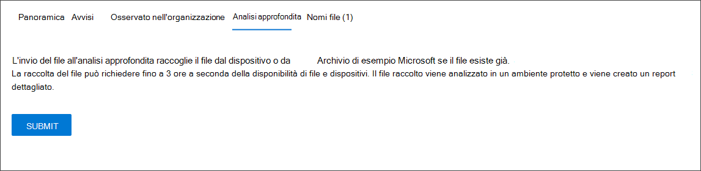

# <a name="take-response-actions-on-a-file"></a>Intraprendere azioni di risposta su un file

[!INCLUDE [Microsoft 365 Defender rebranding](../../includes/microsoft-defender.md)]


**Si applica a:**
- [Microsoft Defender per endpoint](https://go.microsoft.com/fwlink/?linkid=2154037)

[!include[Prerelease information](../../includes/prerelease.md)]

> Vuoi provare Defender per Endpoint? [Iscriversi per una versione di valutazione gratuita.](https://www.microsoft.com/microsoft-365/windows/microsoft-defender-atp?ocid=docs-wdatp-responddile-abovefoldlink)

Rispondere rapidamente agli attacchi rilevati arrestando e quarantinando i file o bloccando un file. Dopo aver fatto un'azione sui file, puoi controllare i dettagli dell'attività nel centro notifiche.

Le azioni di risposta sono disponibili nella pagina dettagliata del profilo di un file. Una volta visualizzata questa pagina, è possibile passare dal layout di pagina nuovo a quello precedente passando alla **nuova pagina File.** Il resto di questo articolo descrive il layout di pagina più recente.

Le azioni di risposta vengono eseguite nella parte superiore della pagina del file e includono:

- Arrestare e mettere in quarantena il file
- Aggiungi indicatore
- Scarica file
- Consultare un esperto di minacce
- Centro notifiche

Puoi anche inviare file per analisi approfondite, per eseguire il file in una sandbox cloud sicura. Al termine dell'analisi, si otterrà un report dettagliato che fornisce informazioni sul comportamento del file. È possibile inviare file per l'analisi approfondita e leggere i report passati selezionando la **scheda Analisi** approfondita. Si trova sotto le schede di informazioni sui file.

Alcune azioni richiedono determinate autorizzazioni. Nella tabella seguente vengono descritte le azioni che determinate autorizzazioni possono eseguire sui file eseguibili portabili (PE) e non PE:

| Autorizzazione             | File PE | File non PE |
| :--------------------- | :------: | :----------: |
| Visualizzare i dati              |     X    |       X      |
| Analisi degli avvisi   | &#x2611; |       X      |
| Base della risposta in tempo reale    |     X    |       X      |
| Risposta in tempo reale avanzata | &#x2611; |   &#x2611;   |

Per ulteriori informazioni sui ruoli, vedere [Create and manage roles for role-based access control](user-roles.md).

## <a name="stop-and-quarantine-files-in-your-network"></a>Interrompere e mettere in quarantena i file nella rete

È possibile contenere un attacco nell'organizzazione interrompendo il processo dannoso e la messa in quaranta del file in cui è stato osservato.

> [!IMPORTANT]
> È possibile eseguire questa azione solo se:
>
> - Il dispositivo su cui stai eseguendo l'azione Windows 10 versione 1703 o successiva
> - Il file non appartiene a editori di terze parti attendibili o non è firmato da Microsoft
> - Antivirus Microsoft Defender deve essere almeno in esecuzione in modalità passiva. Per ulteriori informazioni, vedere [Antivirus Microsoft Defender compatibilità.](/windows/security/threat-protection/microsoft-defender-antivirus/microsoft-defender-antivirus-compatibility)

**L'azione Interrompi e metti** in quarantena i file include l'interruzione dei processi in esecuzione, la messa in quarantena dei file e l'eliminazione di dati permanenti come le chiavi del Registro di sistema.

Questa azione ha effetto sui dispositivi con Windows 10 versione 1703 o successiva, in cui il file è stato osservato negli ultimi 30 giorni.

> [!NOTE]
> Potrai ripristinare il file dalla quarantena in qualsiasi momento.

### <a name="stop-and-quarantine-files"></a>Arrestare e mettere in quarantena i file

1. Selezionare il file che si desidera arrestare e mettere in quarantena. È possibile selezionare un file da una delle visualizzazioni seguenti o utilizzare la casella Di ricerca:

   - **Avvisi:** fai clic sui collegamenti corrispondenti nella descrizione o dettagli nella sequenza temporale della storia di avviso
   - **Casella di ricerca:** selezionare **File** dal menu a discesa e immettere il nome del file

   > [!NOTE]
   > L'azione di arresto e quarantena dei file è limitata a un massimo di 1000 dispositivi. Per arrestare un file su un numero maggiore di dispositivi, vedi Aggiungere un [indicatore per bloccare o consentire il file.](#add-indicator-to-block-or-allow-a-file)

2. Vai alla barra superiore e seleziona **Interrompi e quarantena file.**

   

3. Specificare un motivo, quindi selezionare **Conferma**.

   

   Il centro notifiche mostra le informazioni sull'invio:
   
   

   - **Tempo invio** - Indica quando l'azione è stata inviata.
   - **Operazione** riuscita: indica il numero di dispositivi in cui il file è stato arrestato e messo in quarantena.
   - **Failed** - Mostra il numero di dispositivi in cui l'azione non è riuscita e i dettagli sull'errore.
   - **In** sospeso: mostra il numero di dispositivi da cui il file deve ancora essere arrestato e messo in quarantena. Questa operazione può richiedere tempo nei casi in cui il dispositivo è offline o non è connesso alla rete.

4. Selezionare uno degli indicatori di stato per visualizzare ulteriori informazioni sull'azione. Ad esempio, selezionare **Non riuscito** per vedere dove l'azione non è riuscita.

**Notifica sull'utente del dispositivo**:</br>
Quando il file viene rimosso da un dispositivo, viene visualizzata la notifica seguente:


Nella sequenza temporale del dispositivo viene aggiunto un nuovo evento per ogni dispositivo in cui un file è stato arrestato e messo in quarantena.

Prima dell'implementazione dell'azione per i file ampiamente utilizzati in un'organizzazione, viene visualizzato un avviso. È necessario verificare che l'operazione sia progettata.

## <a name="restore-file-from-quarantine"></a>Ripristinare un file dalla quarantena

È possibile eseguire il rollback e rimuovere un file dalla quarantena se si è stabilito che è pulito dopo un'indagine. Esegui il comando seguente in ogni dispositivo in cui il file è stato messo in quarantena.

1. Apri un prompt della riga di comando con privilegi elevati nel dispositivo:

   1. Passare a **Start** e digitare _cmd_.

   1. Fai clic con il **pulsante destro del mouse** su Prompt dei comandi e scegli Esegui come **amministratore.**

2. Immettere il comando seguente e premere **INVIO**:

   ```console
   “%ProgramFiles%\Windows Defender\MpCmdRun.exe” –Restore –Name EUS:Win32/CustomEnterpriseBlock –All
   ```

   > [!NOTE]
   > In alcuni scenari, **ThreatName** può essere visualizzato come: EUS:Win32/CustomEnterpriseBlock!cl.
   >
   > Defender for Endpoint ripristini tutti i file bloccati personalizzati messi in quarantena su questo dispositivo negli ultimi 30 giorni.

> [!IMPORTANT]
> Un file messo in quarantena come potenziale minaccia di rete potrebbe non essere recuperabile. Se un utente tenta di ripristinare il file dopo la quarantena, tale file potrebbe non essere accessibile. Ciò può essere dovuto al fatto che il sistema non ha più credenziali di rete per accedere al file. In genere, questo è il risultato di un accesso temporaneo a una cartella condivisa o di sistema e i token di accesso sono scaduti.

## <a name="download-or-collect-file"></a>Scaricare o raccogliere file

Se **si seleziona Scarica file** dalle azioni di risposta, è possibile scaricare un archivio locale protetto da password .zip contenente il file. Verrà visualizzato un riquadro a comparsa in cui è possibile registrare un motivo per il download del file e impostare una password.

Per impostazione predefinita, non sarà possibile scaricare i file in quarantena.


### <a name="collect-files"></a>Raccogliere file

Se un file non è già archiviato da Microsoft Defender for Endpoint, non puoi scaricarlo. Al contrario, vedrai un **pulsante Raccogli file** nello stesso percorso. Se un file non è stato visualizzato nell'organizzazione negli ultimi 30 giorni, La raccolta **file** verrà disabilitata.
> [!Important]
> Un file messo in quarantena come potenziale minaccia di rete potrebbe non essere recuperabile. Se un utente tenta di ripristinare il file dopo la quarantena, tale file potrebbe non essere accessibile. Ciò può essere dovuto al fatto che il sistema non ha più credenziali di rete per accedere al file. In genere, questo è il risultato di un accesso temporaneo a una cartella condivisa o di sistema e i token di accesso sono scaduti.

## <a name="add-indicator-to-block-or-allow-a-file"></a>Aggiungere un indicatore per bloccare o consentire un file

Impedire l'ulteriore propagazione di un attacco nell'organizzazione vietando file potenzialmente dannosi o malware sospetto. Se si conosce un file pe (Portable Executable) potenzialmente dannoso, è possibile bloccarlo. Questa operazione ne impedirà la lettura, la scrittura o l'esecuzione nei dispositivi dell'organizzazione.

> [!IMPORTANT]
>
> - Questa funzionalità è disponibile se l'organizzazione usa Antivirus Microsoft Defender e la protezione consegnata dal cloud è abilitata. Per ulteriori informazioni, vedere [Manage cloud-delivered protection](/windows/security/threat-protection/microsoft-defender-antivirus/deploy-manage-report-microsoft-defender-antivirus).
>
> - La versione del client Antimalware deve essere 4.18.1901.x o successiva.
> - Questa funzionalità è progettata per impedire il download di malware sospetti (o file potenzialmente dannosi) dal Web. Attualmente supporta file eseguibili portabili (PE), _inclusi_.exee _.dll_ file. La copertura verrà estesa nel tempo.
> - Questa azione di risposta è disponibile per i dispositivi Windows 10 versione 1703 o successiva.
> - La funzione consenti o blocca non può essere eseguita sui file se la classificazione del file esiste nella cache del dispositivo prima dell'azione consenti o blocca.

> [!NOTE]
> Il file PE deve essere nella sequenza temporale del dispositivo per poter eseguire questa azione.
>
> Potrebbe esserci un paio di minuti di latenza tra il momento in cui viene eseguita l'azione e il file effettivo bloccato.

### <a name="enable-the-block-file-feature"></a>Abilitare la funzionalità blocca file

Per iniziare a bloccare i file, devi prima attivare [la **funzionalità**](advanced-features.md) Blocca o consenti in Impostazioni.
### <a name="allow-or-block-file"></a>Consenti o blocca file

Quando aggiungi un hash indicatore per un file, puoi scegliere di generare un avviso e bloccare il file ogni volta che un dispositivo dell'organizzazione tenta di eseguirlo.

I file bloccati automaticamente da un indicatore non verranno visualizzati nel centro notifiche del file, ma gli avvisi saranno comunque visibili nella coda avvisi.

Vedi [gestire gli indicatori](manage-indicators.md) per ulteriori dettagli sul blocco e la generazione di avvisi sui file.

Per interrompere il blocco di un file, rimuovi l'indicatore. Puoi farlo tramite **l'azione Modifica** indicatore nella pagina del profilo del file. Questa azione sarà visibile nella stessa posizione **dell'azione** Aggiungi indicatore, prima di aggiungere l'indicatore.

È inoltre possibile modificare gli indicatori dalla pagina **Impostazioni,** in **Indicatori**  >  **regole**. Gli indicatori sono elencati in quest'area in base all'hash del file.

## <a name="consult-a-threat-expert"></a>Consultare un esperto di minacce

Consultare un esperto di minacce Microsoft per ulteriori informazioni su un dispositivo potenzialmente compromesso o su dispositivi già compromessi. Microsoft Threat Experts sono impegnati direttamente dall'interno del Microsoft Defender Security Center per una risposta accurata e immediata. Gli esperti forniscono informazioni dettagliate su un dispositivo potenzialmente compromesso e consentono di comprendere minacce complesse e notifiche di attacchi mirati. Possono inoltre fornire informazioni sugli avvisi o su un contesto di intelligence per le minacce visualizzato nel dashboard del portale.

Per [informazioni dettagliate, vedere Consultare un esperto](/microsoft-365/security/defender-endpoint/configure-microsoft-threat-experts#consult-a-microsoft-threat-expert-about-suspicious-cybersecurity-activities-in-your-organization) delle minacce Microsoft.

## <a name="check-activity-details-in-action-center"></a>Controllare i dettagli delle attività nel Centro operativo

Il **centro notifiche** fornisce informazioni sulle azioni eseguite su un dispositivo o un file. È possibile visualizzare i dettagli seguenti:

- Raccolta pacchetti di analisi
- Analisi antivirus
- Restrizione app
- Isolamento del dispositivo

Vengono visualizzati anche tutti gli altri dettagli correlati, ad esempio data/ora di invio, invio utente e se l'azione ha avuto esito positivo o negativo.


## <a name="deep-analysis"></a>Analisi approfondita

Le indagini sulla sicurezza informatica vengono in genere attivate da un avviso. Gli avvisi sono correlati a uno o più file osservati spesso nuovi o sconosciuti. La selezione di un file consente di accedere alla visualizzazione dei file in cui è possibile visualizzare i metadati del file. Per arricchire i dati relativi al file, è possibile inviare il file per un'analisi approfondita.

La funzionalità di analisi approfondita esegue un file in un ambiente cloud sicuro e completamente instrumentato. I risultati dell'analisi approfondita mostrano le attività, i comportamenti osservati e gli elementi associati del file, ad esempio i file eliminati, le modifiche al Registro di sistema e la comunicazione con gli IP.
L'analisi approfondita attualmente supporta un'analisi approfondita dei file eseguibili portabili (PE, Portable Executable) (inclusi.exe _e_ _.dll_ file).

L'analisi approfondita di un file richiede alcuni minuti. Al termine dell'analisi dei file, la scheda Analisi approfondita verrà aggiornata per visualizzare un riepilogo e la data e l'ora degli ultimi risultati disponibili.

Il riepilogo dell'analisi approfondita include un elenco dei comportamenti osservati, alcuni dei quali possono indicare attività dannose e oggetti osservabili, inclusi gli INDIRIZZI IP contattati e i file creati sul disco. Se non viene trovato alcun elemento, in queste sezioni verrà visualizzato un breve messaggio.

I risultati dell'analisi approfondita vengono abbinati all'intelligence per le minacce e qualsiasi corrispondenza genererà avvisi appropriati.

Utilizzare la funzionalità di analisi approfondita per analizzare i dettagli di qualsiasi file, in genere durante un'indagine di un avviso o per qualsiasi altro motivo in cui si sospetta un comportamento dannoso. Questa funzionalità è disponibile nella **scheda Analisi** approfondita nella pagina del profilo del file.<br/>
<br/>

> [!VIDEO https://www.microsoft.com/en-us/videoplayer/embed/RE4aAYy?rel=0]

**L'invio** per l'analisi approfondita è abilitato quando il file è disponibile nella raccolta di esempi back-end Defender for Endpoint o se è stato osservato in un dispositivo Windows 10 che supporta l'invio all'analisi approfondita.

> [!NOTE]
> Solo i file Windows 10 possono essere raccolti automaticamente.

Puoi anche inviare un esempio tramite il portale del Centro sicurezza [Microsoft](https://www.microsoft.com/security/portal/submission/submit.aspx) se il file  non è stato osservato in un dispositivo Windows 10 e attendere che il pulsante Invia per analisi approfondita diventi disponibile.

> [!NOTE]
> A causa dei flussi di elaborazione back-end nel portale del Centro sicurezza Microsoft, potrebbero essere presenti fino a 10 minuti di latenza tra l'invio di file e la disponibilità della funzionalità di analisi approfondita in Defender for Endpoint.

### <a name="submit-files-for-deep-analysis"></a>Inviare file per l'analisi approfondita

1. Selezionare il file che si desidera inviare per l'analisi approfondita. È possibile selezionare o cercare un file da una delle visualizzazioni seguenti:

    - **Avvisi:** selezionare i collegamenti ai file nella **sequenza temporale Descrizione** **o** Dettagli
    - **Elenco Dispositivi:** selezionare i collegamenti ai file dalla sezione **Descrizione** o **Dettagli** nella **sezione Dispositivo nell'organizzazione**
    - **Casella di ricerca:** selezionare **File** dal menu a discesa e immettere il nome del file

2. Nella scheda **Analisi approfondita** della visualizzazione file selezionare **Invia.**

   

   > [!NOTE]
   > Sono supportati solo i file PE, _inclusi.exe_ e _.dll_ file.

   Viene visualizzata una barra di stato e vengono fornite informazioni sulle diverse fasi dell'analisi. È quindi possibile visualizzare il report al termine dell'analisi.

> [!NOTE]
> A seconda della disponibilità del dispositivo, il tempo di raccolta dei campioni può variare. È presente un timeout di 3 ore per la raccolta di campioni. La raccolta avrà esito negativo e l'operazione verrà interrotta se non è disponibile Windows 10 dei dispositivi online in quel momento. È possibile inviare di nuovo i file per l'analisi approfondita per ottenere dati nuovi nel file.

### <a name="view-deep-analysis-reports"></a>Visualizzare report di analisi approfondita

Visualizza il report di analisi approfondita fornito per visualizzare informazioni più approfondite sul file inviato. Questa funzionalità è disponibile nel contesto di visualizzazione file.

È possibile visualizzare il report completo che fornisce informazioni dettagliate sulle sezioni seguenti:

- Comportamenti
- Observables

I dettagli forniti consentono di analizzare se sono presenti indicazioni su un potenziale attacco.

1. Selezionare il file inviato per l'analisi approfondita.
2. Selezionare la **scheda Analisi** approfondita. Se sono presenti report precedenti, il riepilogo del report verrà visualizzato in questa scheda.

    

#### <a name="troubleshoot-deep-analysis"></a>Risolvere i problemi relativi all'analisi approfondita

Se si verifica un problema durante il tentativo di inviare un file, provare a eseguire una delle operazioni seguenti per la risoluzione dei problemi.

1. Verificare che il file in questione sia un file PE. I file PE in _genere.exe_ _o.dll_ (applicazioni o programmi eseguibili).

2. Verificare che il servizio abbia accesso al file, che esista ancora e che non sia stato danneggiato o modificato.

3. Attendere un breve periodo di tempo e provare a inviare di nuovo il file. La coda potrebbe essere piena o si è verificato un errore di connessione o di comunicazione temporaneo.

4. Se il criterio di raccolta di esempio non è configurato, il comportamento predefinito è consentire la raccolta di esempi. Se è configurato, verificare che l'impostazione dei criteri consenta la raccolta di campioni prima di inviare di nuovo il file. Quando è configurata la raccolta di esempi, controllare il valore del Registro di sistema seguente:

    ```console
    Path: HKLM\SOFTWARE\Policies\Microsoft\Windows Advanced Threat Protection
    Name: AllowSampleCollection
    Type: DWORD
    Hexadecimal value :
      Value = 0 – block sample collection
      Value = 1 – allow sample collection
    ```

1. Modificare l'unità organizzativa tramite Criteri di gruppo. Per ulteriori informazioni, vedere [Configure with Group Policy.](configure-endpoints-gp.md)

1. Se questi passaggi non risolvono il problema, [contattare winatp@microsoft.com](mailto:winatp@microsoft.com).

## <a name="related-topics"></a>Argomenti correlati

- [Intraprendere azioni di risposta su un dispositivo](respond-machine-alerts.md)
- [Esaminare i file](investigate-files.md)
