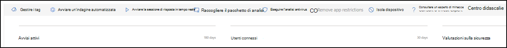
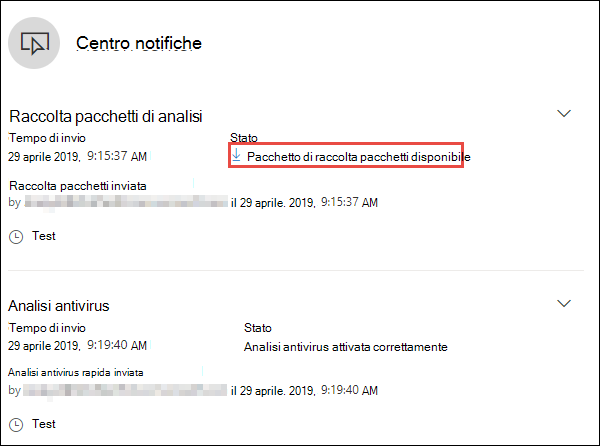
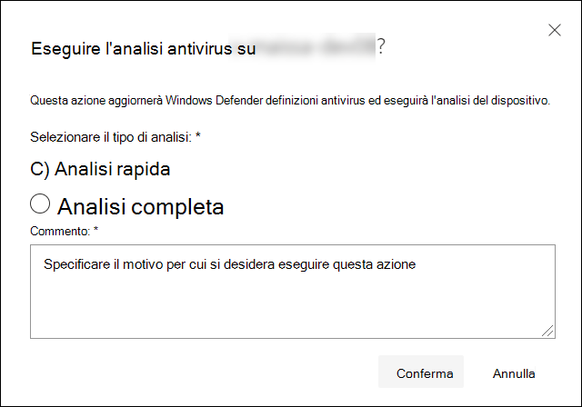
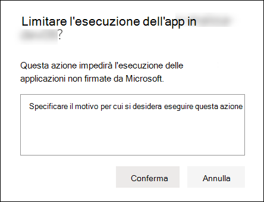
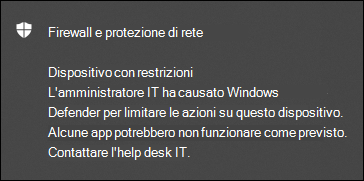
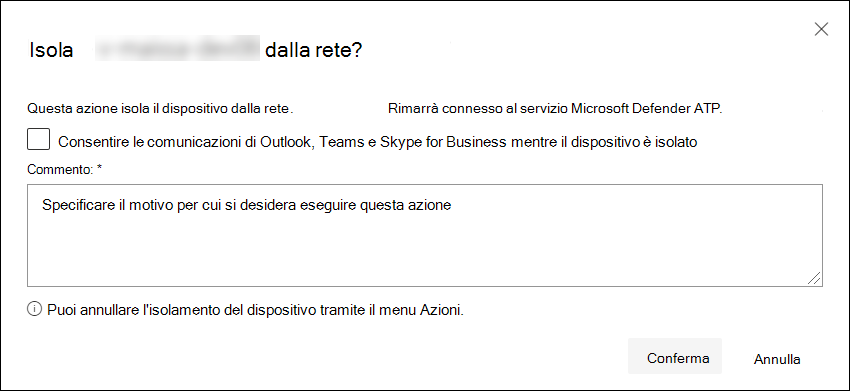
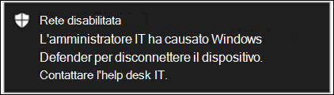
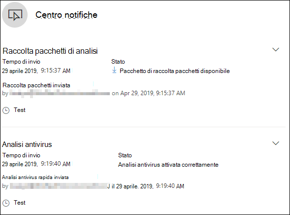

# Intraprendere azioni di risposta su un dispositivo

[!INCLUDE [Microsoft 365 Defender rebranding](../../includes/microsoft-defender.md)]

**Si applica a:**
- [Microsoft Defender per endpoint](https://go.microsoft.com/fwlink/?linkid=2154037)

>Vuoi provare Defender per Endpoint? [Iscriversi per una versione di valutazione gratuita.](https://www.microsoft.com/microsoft-365/windows/microsoft-defender-atp?ocid=docs-wdatp-respondmachine-abovefoldlink) 

Rispondi rapidamente agli attacchi rilevati isolando i dispositivi o raccogliendo un pacchetto di indagine. Dopo aver fatto un'azione sui dispositivi, puoi controllare i dettagli dell'attività nel centro notifiche.

Le azioni di risposta vengono eseguite nella parte superiore di una pagina specifica del dispositivo e includono:

- Gestire i tag
- Avviare un'indagine automatizzata
- Avviare la sessione di risposta in tempo reale
- Raccogliere un pacchetto di indagini
- Eseguire ricerca del virus
- Limitare l'esecuzione dell'app
- Isola dispositivo
- Consultare un esperto di minacce
- Centro notifiche

 Puoi trovare le pagine del dispositivo da una delle visualizzazioni seguenti:

- **Dashboard delle operazioni di** sicurezza: selezionare un nome di dispositivo dalla scheda Dispositivi a rischio.
- **Coda avvisi:** selezionare il nome del dispositivo accanto all'icona del dispositivo dalla coda degli avvisi.
- **Elenco dispositivi:** selezionare l'intestazione del nome del dispositivo nell'elenco dei dispositivi.
- **Casella di ricerca:** seleziona Dispositivo dal menu a discesa e immetti il nome del dispositivo.

>[!IMPORTANT]
> - Queste azioni di risposta sono disponibili solo per i dispositivi in Windows 10 versione 1703 o successiva. 
> - Per le piattaforme non Windows, le funzionalità di risposta (ad esempio isolamento del dispositivo) dipendono dalle funzionalità di terze parti.

## Gestire i tag

Aggiungere o gestire tag per creare un'affiliazione di gruppo logico. I tag dispositivo supportano il mapping corretto della rete, consentendo di collegare tag diversi per acquisire il contesto e abilitare la creazione dinamica dell'elenco come parte di un evento imprevisto.

Per altre informazioni sul tagging dei dispositivi, vedi [Creare e gestire tag dispositivo.](machine-tags.md)

## Avviare un'indagine automatizzata

Se necessario, puoi avviare una nuova indagine automatizzata di uso generale sul dispositivo. Durante l'esecuzione di un'indagine, qualsiasi altro avviso generato dal dispositivo verrà aggiunto a un'indagine automatizzata in corso fino al completamento dell'indagine. Inoltre, se la stessa minaccia viene vista su altri dispositivi, questi dispositivi vengono aggiunti all'indagine.

Per ulteriori informazioni sulle indagini automatizzate, vedere [Overview of Automated investigations](automated-investigations.md).

## Avviare la sessione di risposta in tempo reale

La risposta in tempo reale è una funzionalità che consente l'accesso istantaneo a un dispositivo tramite una connessione shell remota. In questo modo è possibile eseguire un lavoro di indagine approfondito e intraprendere azioni di risposta immediate per contenere prontamente le minacce identificate, in tempo reale.

La risposta in tempo reale è progettata per migliorare le indagini consentendoti di raccogliere dati forensi, eseguire script, inviare entità sospette per l'analisi, correggere le minacce e cercare in modo proattivo minacce emergenti.

Per altre informazioni sulla risposta in tempo reale, vedi [Analizzare le entità nei dispositivi che usano la risposta in tempo reale.](live-response.md)

## Raccogliere il pacchetto di analisi dai dispositivi

Come parte del processo di indagine o di risposta, puoi raccogliere un pacchetto di indagine da un dispositivo. Raccogliendo il pacchetto di analisi, è possibile identificare lo stato corrente del dispositivo e comprendere ulteriormente gli strumenti e le tecniche utilizzati dall'autore dell'attacco.

Per scaricare il pacchetto (file ZIP) e analizzare gli eventi che si sono verificati in un dispositivo

1. Seleziona **Raccogli pacchetto di indagine** nella riga delle azioni di risposta nella parte superiore della pagina del dispositivo.
2. Specificare nella casella di testo il motivo per cui si desidera eseguire questa azione. Selezionare **Conferma**.
3. Il file ZIP verrà scaricato

Modo alternativo:

1. Seleziona **Centro notifiche** nella sezione Azioni di risposta della pagina del dispositivo.

    

3. Nel riquadro a comparsa del centro notifiche seleziona **Pacchetto di raccolta pacchetti disponibile** per scaricare il file ZIP.
  
    

Il pacchetto contiene le cartelle seguenti:

| Cartella | Descrizione |
|:---|:---------|
|Esecuzione automatica | Contiene un set di file che rappresentano ognuno il contenuto del Registro di sistema di un punto di ingresso di avvio automatico noto (ASEP) per identificare la persistenza dell'utente malintenzionato nel dispositivo.    
<b>NOTA:</b> Se la chiave del Registro di sistema non viene trovata, il file conterrà il messaggio seguente: "ERRORE: Impossibile trovare la chiave o il valore del Registro di sistema specificato".
                                                                                                                                |
|Programmi installati | Questo . Il file CSV contiene l'elenco dei programmi installati che consentono di identificare ciò che è attualmente installato nel dispositivo. Per ulteriori informazioni, vedere Win32_Product [classe](https://go.microsoft.com/fwlink/?linkid=841509).                                                                                  |
|Connessioni di rete | Questa cartella contiene un set di punti dati correlati alle informazioni di connettività che consentono di identificare la connettività a URL sospetti, l'infrastruttura di comando e controllo (C&C), qualsiasi movimento laterale o connessioni remote.   - ActiveNetConnections.txt: visualizza le statistiche del protocollo e le connessioni di rete TCP/IP correnti. Consente di cercare la connettività sospetta effettuata da un processo.    - Arp.txt: visualizza le tabelle della cache ARP (Address Resolution Protocol) correnti per tutte le interfacce.    La cache ARP può rivelare host aggiuntivi in una rete compromessa o sistemi sospetti nella rete che potrebbero essere stati utilizzati per eseguire un attacco interno.   - DnsCache.txt - Visualizza il contenuto della cache del resolver del client DNS, che include sia le voci precaricate dal file Hosts locale che gli eventuali record di risorse ottenuti di recente per le query sui nomi risolte dal computer. Ciò può essere utile per identificare le connessioni sospette.    - IpConfig.txt : visualizza la configurazione TCP/IP completa per tutte le schede. Le schede possono rappresentare interfacce fisiche, ad esempio schede di rete installate o interfacce logiche, ad esempio connessioni remote.    - FirewallExecutionLog.txt e pfirewall.log                                                                                  |
| Prelettura dei file| I file di prelettura di Windows sono progettati per velocizzare il processo di avvio dell'applicazione. Può essere utilizzato per tenere traccia di tutti i file usati di recente nel sistema e trovare le tracce per le applicazioni che potrebbero essere state eliminate ma che sono ancora disponibili nell'elenco dei file di prelettura.    - Cartella di prelettura: contiene una copia dei file di prelettura da `%SystemRoot%\Prefetch` . NOTA: è consigliabile scaricare un visualizzatore di file di prelettura per visualizzare i file di prelettura.    - PrefetchFilesList.txt: contiene l'elenco di tutti i file copiati che possono essere utilizzati per tenere traccia in caso di errori di copia nella cartella di prelettura.                                                                                                      |
| Processi| Contiene un oggetto . File CSV che elenca i processi in esecuzione, che consente di identificare i processi correnti in esecuzione nel dispositivo. Ciò può essere utile quando si identifica un processo sospetto e il relativo stato.                                                                                                                                                                                                       |
| Attività pianificate| Contiene un oggetto . File CSV che elenca le attività pianificate, che possono essere utilizzate per identificare le routine eseguite automaticamente su un dispositivo scelto per cercare il codice sospetto impostato per l'esecuzione automatica.                                                                                                                                                                                                      |
| Registro eventi di sicurezza| Contiene il registro eventi di sicurezza, che contiene i record delle attività di accesso o disconnessione o altri eventi correlati alla sicurezza specificati dal criterio di controllo del sistema.   
<b>NOTA:</b> Aprire il file di registro eventi utilizzando il Visualizzatore eventi.
                                                                                    |
| Servizi| Contiene un oggetto . File CSV in cui sono elencati i servizi e i relativi stati.                                                                                      |
| Sessioni SMB (Windows Server Message Block) | Elenca l'accesso condiviso a file, stampanti e porte seriali e comunicazioni varie tra i nodi di una rete. Ciò consente di identificare l'esfiltrazione dei dati o il movimento laterale.    Contiene i file per SMBInboundSessions e SMBOutboundSession.    
<b>NOTA:</b> Se non sono presenti sessioni (in ingresso o in uscita), si otterrà un file di testo che indica che non sono presenti sessioni SMB trovate.
                                                                                                                          |
| System Information| Contiene un file SystemInformation.txt che elenca le informazioni di sistema, ad esempio la versione del sistema operativo e le schede di rete.                                                                                     |
| Directory temporanee| Contiene un set di file di testo che elenca i file che si trovano in %Temp% per ogni utente del sistema.    Ciò consente di tenere traccia dei file sospetti che un utente malintenzionato potrebbe aver rilasciato nel sistema.    
<b>NOTA:</b> Se il file contiene il messaggio seguente: "Impossibile trovare il percorso specificato", significa che non esiste una directory temporanea per l'utente e potrebbe essere perché l'utente non ha avuto accesso al sistema.
                                                                                                                                         |
| Utenti e gruppi| Fornisce un elenco di file che rappresentano ognuno un gruppo e i relativi membri.                                                                                                                   |
|WdSupportLogs| Fornisce le MpCmdRunLog.txt e MPSupportFiles.cab     
<b>NOTA:</b> Questa cartella verrà creata solo in Windows 10 versione 1709 o successiva con l'aggiornamento cumulativo di febbraio 2020 o più recente installato:  Win10 1709 (RS3) Build 16299.1717 : [KB4537816](https://support.microsoft.com/en-us/help/4537816/windows-10-update-kb4537816)   Win10 1803 (RS4) Build 17134.1345 : [KB4537795](https://support.microsoft.com/en-us/help/4537795/windows-10-update-kb4537795)   Win10 1809 (RS5) Build 17763.1075 : [KB4537818](https://support.microsoft.com/en-us/help/4537818/windows-10-update-kb4537818)   Win10 1903/1909 (19h1/19h2) Builds 18362.693 e 18363.693 : [KB4535996](https://support.microsoft.com/en-us/help/4535996/windows-10-update-kb4535996) 
                                                                                                                    |
| CollectionSummaryReport.xls| Questo file è un riepilogo della raccolta di pacchetti di analisi, contiene l'elenco dei punti dati, il comando utilizzato per estrarre i dati, lo stato di esecuzione e il codice di errore in caso di errore. Puoi usare questo report per tenere traccia se il pacchetto include tutti i dati previsti e identificare se si sono verificati errori. |

## Eseguire l'analisi di Microsoft Defender Antivirus nei dispositivi

Come parte del processo di indagine o di risposta, è possibile avviare in remoto un'analisi antivirus per identificare e correggere il malware che potrebbe essere presente in un dispositivo compromesso.

>[!IMPORTANT]
>- Questa azione è disponibile per i dispositivi in Windows 10 versione 1709 o successiva.
>- Un'analisi di Microsoft Defender Antivirus (Microsoft Defender AV) può essere eseguita insieme ad altre soluzioni antivirus, indipendentemente dal fatto che Microsoft Defender AV sia la soluzione antivirus attiva o meno. Microsoft Defender AV può essere in modalità passiva. Per ulteriori informazioni, vedere [Compatibilità con Microsoft Defender Antivirus.](https://docs.microsoft.com/windows/security/threat-protection/microsoft-defender-antivirus/microsoft-defender-antivirus-compatibility.md)

Uno è stato selezionato Esegui analisi **antivirus,** selezionare il tipo di analisi che si desidera eseguire (rapido o completo) e aggiungere un commento prima di confermare l'analisi.

Il centro notifiche mostrerà le informazioni di analisi e la sequenza temporale del dispositivo includerà un nuovo evento, a seguito dell'invio di un'azione di analisi nel dispositivo. Gli avvisi di Microsoft Defender AV rifletteranno eventuali rilevamenti evasi durante l'analisi.

>[!NOTE]
>Quando si attiva un'analisi con Defender per l'azione di risposta endpoint, il valore "ScanAvgCPULoadFactor" dell'antivirus di Microsoft Defender si applica e limita l'impatto della CPU dell'analisi.  Se ScanAvgCPULoadFactor non è configurato, il valore predefinito è un limite del carico massimo della CPU del 50% durante un'analisi. 
>Per ulteriori informazioni, vedere [configure-advanced-scan-types-microsoft-defender-antivirus](https://docs.microsoft.com/windows/security/threat-protection/microsoft-defender-antivirus/configure-advanced-scan-types-microsoft-defender-antivirus).

## Limitare l'esecuzione dell'app

Oltre a contenere un attacco arrestando processi dannosi, puoi anche bloccare un dispositivo e impedire l'esecuzione di successivi tentativi di programmi potenzialmente dannosi.

>[!IMPORTANT]
> - Questa azione è disponibile per i dispositivi in Windows 10 versione 1709 o successiva.
> - Questa funzionalità è disponibile se l'organizzazione usa Microsoft Defender Antivirus.
> - Questa azione deve soddisfare i requisiti di firma e i Windows Defender criteri di integrità del codice del controllo dell'applicazione. Per ulteriori informazioni, vedere Formati e firma [dei criteri di integrità del codice.](https://docs.microsoft.com/windows/device-security/device-guard/requirements-and-deployment-planning-guidelines-for-device-guard#code-integrity-policy-formats-and-signing)

Per limitare l'esecuzione di un'applicazione, vengono applicati criteri di integrità del codice che consentono l'esecuzione dei file solo se sono firmati da un certificato rilasciato da Microsoft. Questo metodo di restrizione può aiutare a impedire a un utente malintenzionato di controllare i dispositivi compromessi ed eseguire ulteriori attività dannose.

>[!NOTE]
>Sarà possibile annullare l'esecuzione delle applicazioni in qualsiasi momento. Il pulsante nella pagina del dispositivo cambia in Rimuovi restrizioni **app** e quindi devi eseguire la stessa procedura per limitare l'esecuzione dell'app.

Dopo aver selezionato Limita **l'esecuzione dell'app** nella pagina del dispositivo, digita un commento e seleziona **Conferma.** Il centro notifiche mostrerà le informazioni di analisi e la sequenza temporale del dispositivo includerà un nuovo evento.

**Notifica sull'utente del dispositivo**: 
Quando un'app è limitata, viene visualizzata la notifica seguente per informare l'utente che l'esecuzione di un'app è limitata:

## Isolare i dispositivi dalla rete

A seconda della gravità dell'attacco e della riservatezza del dispositivo, potresti voler isolare il dispositivo dalla rete. Questa azione può aiutare a impedire all'autore dell'attacco di controllare il dispositivo compromesso ed eseguire altre attività, come l'esfiltrazione dei dati e lo spostamento laterale.

>[!IMPORTANT]
>- L'isolamento completo è disponibile per i dispositivi in Windows 10 versione 1703.
>- L'isolamento selettivo è disponibile per i dispositivi in Windows 10 versione 1709 o successiva.

Questa funzionalità di isolamento del dispositivo disconnette il dispositivo compromesso dalla rete mantenendo la connettività al servizio Defender for Endpoint, che continua a monitorare il dispositivo.

In Windows 10, versione 1709 o successiva, avrai un controllo aggiuntivo sul livello di isolamento della rete. Puoi anche scegliere di abilitare la connettività Di Outlook, Microsoft Teams e Skype for Business (ovvero &quot;Isolamento selettivo").

>[!NOTE]
>Potrai riconnettere il dispositivo alla rete in qualsiasi momento. Il pulsante nella pagina del dispositivo cambierà in Rilascia dall'isolamento **e** quindi eseguire la stessa procedura dell'isolamento del dispositivo.

Dopo aver selezionato **Isola dispositivo** nella pagina del dispositivo, digita un commento e seleziona **Conferma.** Il centro notifiche mostrerà le informazioni di analisi e la sequenza temporale del dispositivo includerà un nuovo evento.

>[!NOTE]
>Il dispositivo rimarrà connesso al servizio Defender for Endpoint anche se è isolato dalla rete. Se si è scelto di abilitare le comunicazioni di Outlook e Skype for Business, sarà possibile comunicare con l'utente mentre il dispositivo è isolato.

**Notifica sull'utente del dispositivo**: 
Quando un dispositivo viene isolato, viene visualizzata la notifica seguente per informare l'utente che il dispositivo è isolato dalla rete:

## Consultare un esperto di minacce

Puoi consultare un esperto di minacce Microsoft per ulteriori informazioni su un dispositivo potenzialmente compromesso o già compromesso. Microsoft Threat Experts può essere coinvolto direttamente dal Microsoft Defender Security Center per una risposta accurata e immediata. Gli esperti forniscono informazioni dettagliate non solo su un dispositivo potenzialmente compromesso, ma anche per comprendere meglio le minacce complesse, le notifiche di attacco mirate che si ottengono o se sono necessarie ulteriori informazioni sugli avvisi o un contesto di intelligence per le minacce visualizzato nel dashboard del portale.

Per [informazioni dettagliate, vedere Consultare un esperto](https://docs.microsoft.com/microsoft-365/security/defender-endpoint/configure-microsoft-threat-experts#consult-a-microsoft-threat-expert-about-suspicious-cybersecurity-activities-in-your-organization) delle minacce Microsoft.

## Controllare i dettagli delle attività nel Centro operativo

Il **centro notifiche** fornisce informazioni sulle azioni eseguite su un dispositivo o un file. Potrai visualizzare i dettagli seguenti:

- Raccolta pacchetti di analisi
- Analisi antivirus
- Restrizione app
- Isolamento del dispositivo

Vengono visualizzati anche tutti gli altri dettagli correlati, ad esempio data/ora di invio, invio utente e se l'azione ha avuto esito positivo o negativo.

## Argomento correlato
- [Intraprendere azioni di risposta su un file](respond-file-alerts.md)
- [Imprecisione dei report](https://docs.microsoft.com/microsoft-365/security/defender-endpoint/tvm-security-recommendation#report-inaccuracy)
